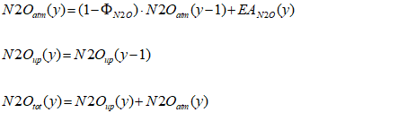
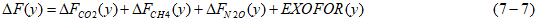
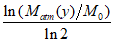
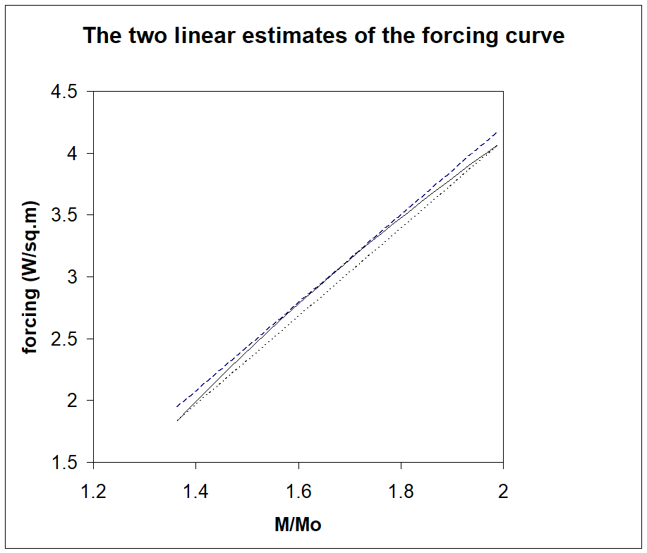

# The TIMES Climate Module

This chapter provides a detailed description of the theoretical approach
taken to model changes in atmospheric greenhouse gas concentrations,
radiative forcing, and global mean temperatures in the TIMES Climate
Module. Appendix A of Part II contains a full description of the
implementation of the Climate Module in TIMES, including parameters,
variables, and equations, as represented in the TIMES code.

The Climate Module starts from global emissions of CO2, CH4, and N2O, as
generated by the TIMES global model, and proceeds to compute
successively:

-   the changes in CO2, CH4, and N2O concentrations via three separate
    sets of equations;

-   the total change (over pre-industrial times) in atmospheric
    radiative forcing resulting from the three gases plus an exogenously
    specified additional forcing resulting from other causes (other
    anthropogenic and/or natural causes, as defined by the user), and

-   the temperature changes (over pre-industrial times) in two
    reservoirs (surface and deep ocean).

The climate equations used to perform these calculations were adapted
from Nordhaus and Boyer (1999), who proposed a three reservoir model for
the CO2 cycle only[^32]. This leads to linear recursive equations for
calculating CO2 concentrations in each reservoir. The temperature
equations use a two-reservoir model leading also to linear equations.
The forcing equation is the one used in most climate models, and is
non-linear.

In TIMES, we have modeled separately the life cycles of two other GHG's
besides CO2, namely methane and nitrous oxide. These linear equations
give results that are good approximations of those obtained from more
complex climate models (Drouet et al., 2004; Nordhaus and Boyer, 1999).

The non-linear radiative forcing equation used in virtually all climate
models was replaced in TIMES by a linear approximation whose values
closely approach the exact ones as long as the useful range is carefully
selected. This was done in order to keep the entire model linear, and
therefore to allow the user to set constraints on forcing and on
temperature as well as on concentrations and on emissions.

The temperature equations have been kept as in Nordhaus and Boyer.

We now describe the mathematical equations used at each of the three
steps of the climate module.

## Concentrations (accumulation of CO2, CH4, N2O[^33])

a\) CO2 accumulation is represented as the linear three-reservoir model
below: the atmosphere, the quickly mixing upper ocean + biosphere, and
the deep ocean. CO2 flows in both directions between adjacent
reservoirs. The 3-reservoir model is represented by the following 3
equations when the step of the recursion is equal to one year:

M~atm~ (y) = E(y) + (1 -- φ~atm-up~) M~atm~ (y-1) +φ~up-atm~ M~up~ (y-1)
(7-1)

M~up~ (y) = (1 --φ~up-atm~ -- φ~up-lo~) M~up~ (y-1) + φ~atm-up~ M~atm~
(y-1) + φ~lo-up~ M~lo~ (y-1) (7-2)

M~lo~ (y) = (1-- φ~lo-up~) M~lo~ (y-1) + φ~up-lo~ M~up~ (y-1) (7-3)

with

-   M~atm~(y), M~up~(y), M~lo~(y): Concentration (expressed in mass
    > units) of CO~2~ in atmosphere, in a quickly mixing reservoir
    > representing the upper level of the ocean and the biosphere, and
    > in deep oceans (GtC), respectively, in year y (GtC)

-   E(y) = CO~2~ emissions in year y (GtC)

-   φ~ij~, transport rate from reservoir i to reservoir j (i, j = atm,
    > up, lo) from year y-1 to y

b\) CH4 accumulation is represented by a so-called single-box model in
which the atmospheric methane concentration obeys the following
equations assuming a constant annual decay rate of the anthropogenic
concentrations $\Phi_{CH4}$ (whereas the natural concentration is
assumed in equilibrium):

$$CH4_{atm}(y) = (1 - \Phi_{CH4}) \cdot CH4_{atm}(y - 1) + EA_{CH4}(y)(7 - 4)$$

$$CH4_{up}(y) = CH4_{up}(y - 1)(7 - 5)$$

${CH4}_{tot}(y) = {CH4}_{atm}(y) + {CH4}_{up}(y)$ (7 - 6)

where

-   *CH4~atm~ ,, CH4~up~ ,CH4~tot~, ,* and *EA~CH4~* are respectively:
    the anthropogenic atmospheric concentration, the natural atmospheric
    concentration[^34], the total atmospheric concentration (all three
    expressed in Mt), and the anthropogenic emission of CH4 (expressed
    in Mt/yr). The anthropogenic emissions *EA~CH4~* are generated
    within the model and enter the dynamic equation (7-4) in order to
    derive the anthropogenic concentration. Note that the natural
    concentration *CH4~up~*is constant at all times. (See initial values
    for these and other parameters in Part II, Appendix A.)

-   *CH4~tot\ ~*is then reported and used in the forcing equations. All
    quantities are indexed by year.

-   $1 - \Phi_{CH4}$is the one-year retention rate of CH4 in the
    atmosphere.

-   *d~CH4~ =2.84* (the density of *CH4,* expressed in *Mt/ppbv*) is
    then used to convert concentration in Mt into ppbv for reporting
    purposes.

c\) N2O accumulation is also represented by a single-box model in a
manner entirely similar to CH4, although with different parameter
values. The corresponding equations are as follows:

## Radiative forcing

We assume, as is routinely done in atmospheric science, that the
atmospheric radiative forcings caused by the various gases are additive
(IPCC, 2007). Thus:

We now explain these four terms.

a\) The relationship between CO2 accumulation and increased radiative
forcing, *∆F~CO2~(y)*, is derived from empirical measurements and
climate models (IPCC 2001 and 2007).

  -----------------------------------------------------------------------
  ∆F~CO2~(y) = γ \* 
  -----------------------------------------------------------------------

  -----------------------------------------------------------------------

where:

-   M~0~ (i.e.CO2ATM_PRE_IND) is the pre-industrial (circa 1750)
    reference atmospheric concentration of CO2 = 596.4 GtC

-   γ is the radiative forcing sensitivity to atmospheric CO~2~
    concentration doubling = 3.7 W/m^2^

b\) The radiative forcing due to atmospheric CH4 is given by the
following expression (IPCC 2007), where the subscript tot has been
omitted

$$\mathbf{\Delta}\mathbf{F}_{\mathbf{CH}\mathbf{4}}\mathbf{(y) = 0.036}\mathbf{\cdot}\left( \sqrt{\mathbf{CH}\mathbf{4}_{\mathbf{y}}}\mathbf{-}\sqrt{\mathbf{CH}\mathbf{4}_{\mathbf{0}}} \right)\mathbf{-}\left\lbrack \mathbf{f(CH}\mathbf{4}_{\mathbf{y}}\mathbf{,N}\mathbf{2}\mathbf{O}_{\mathbf{0}}\mathbf{)}\mathbf{-}\mathbf{f(CH}\mathbf{4}_{\mathbf{0}}\mathbf{,N}\mathbf{2}\mathbf{O}_{\mathbf{0}}\mathbf{)} \right\rbrack\mathbf{(7}\mathbf{-}\mathbf{8)}$$

c\) The radiative forcing due to atmospheric N2O is given by the
following expression (IPCC, 2007)

$$\mathbf{\Delta}\mathbf{F}_{\mathbf{N}\mathbf{2}\mathbf{O}}\mathbf{(y) = 0.12}\mathbf{\cdot}\left( \sqrt{\mathbf{N}\mathbf{2}\mathbf{O}_{\mathbf{y}}}\mathbf{-}\sqrt{\mathbf{N}\mathbf{2}\mathbf{O}_{\mathbf{0}}} \right)\mathbf{-}\left\lbrack \mathbf{f(CH}\mathbf{4}_{\mathbf{0}}\mathbf{,N}\mathbf{2}\mathbf{O}_{\mathbf{y}}\mathbf{)}\mathbf{-}\mathbf{f(CH}\mathbf{4}_{\mathbf{0}}\mathbf{,N}\mathbf{2}\mathbf{O}_{\mathbf{0}}\mathbf{)} \right\rbrack\mathbf{(7}\mathbf{-}\mathbf{9)}$$

where:

$$\mathbf{f(x,y) = 0.47}\mathbf{\cdot}\mathbf{\ln}\left\lbrack \mathbf{1 + 2.01}\mathbf{\cdot}\mathbf{1}\mathbf{0}^{\mathbf{-}\mathbf{5}}\mathbf{\cdot}\mathbf{(xy}\mathbf{)}^{\mathbf{0.75}}\mathbf{+ 5.31}\mathbf{\cdot}\mathbf{1}\mathbf{0}^{\mathbf{-}\mathbf{15}}\mathbf{\cdot}\mathbf{x(xy}\mathbf{)}^{\mathbf{1.52}} \right\rbrack\mathbf{(7}\mathbf{-}\mathbf{10)}$$

Note that the f(x,y) function, which quantifies the cross-effects on
forcing of the presence in the atmosphere of both gases (CH4 and N2O),
is not quite symmetrical in the two gases. As usual, the 0 subscript
indicates the pre-industrial times (1750).

d\) EXOFOR(y) is the increase in total radiative forcing at period t
relative to pre-industrial level due to GHG's that are not represented
explicitly in the model. Units = W/m^2^. In Nordhaus and Boyer (1999),
only emissions of CO2 were explicitly modeled, and therefore EXOFOR(y)
accounted for all other GHG's. In TIMES, N~2~O and CH~4~ are fully
accounted for, but some other substances are not (e.g. CFC's, aerosols,
ozone, volcanic activity, etc.). Therefore, the values for EXOFOR(y)
will differ from those in Nordhaus and Boyer (1999). It is the modeler's
responsibility to include in the calculation of EXOFOR(y) the forcing
from only those gases and other causes that are not modeled. The careful
modeler may also want to adapt the EXOFOR trajectory to particular
scenarios. This has been done using alternative trajectories for EXOFOR
provided by other models, as was done in a multi-model, multi-scenario
study conducted at the Energy Modeling Forum (Clarke et al., 2009)

The parameterization of the three forcing equations (7-8, 7-9, and 7-10)
is not controversial and relies on the results reported by Working Group
I of the IPCC. IPCC (2001, Table 6.2, p.358) provides a value of 3.7 for
γ, smaller than the one used by Nordhaus and Boyer (γ = 4.1). We have
adopted this lower value of 3.7 W/m^2^ as default in TIMES. Users are
free to experiment with other values of the γ parameter. The same
reference provides the entire expressions for all three forcing
equations.

## Linear approximations of the three forcings

In TIMES, each of the three forcing expressions is replaced by a linear
approximation, in order to preserve linearity of the entire model. All
three forcing expressions are concave functions. Therefore, two linear
approximations are obvious candidates. The first one is an approximation
from below, consisting of the chord of the graph between two selected
end-points. The second one has the same slope as the chord and is
tangent to the graph, thus approximating the function from above. The
final approximation is the arithmetic average of the two approximations.
These linear expressions are easily derived once a range of interest is
defined by the user.

As an example, we derive below the linear approximation for the CO2
forcing expression. The other approximations are obtained in a similar
manner.

***Linear approximation for the CO2 forcing expression*** (see technical
note "TIMES Climate Module" for similar approximations of the other two
forcings):

First, an interval of interest for the concentration M must be selected
by the user. The interval should be wide enough to accommodate the
anticipated values of the concentrations, but not so wide as to make the
approximation inaccurate. We denote the interval (M~1~,M~2~).

Next, the linear forcing equation is taken as the half sum of two linear
expressions, which respectively underestimate and overestimate the exact
forcing value. The underestimate consists of the chord of the
logarithmic curve, whereas the overestimate consists of the tangent to
the logarithmic curve that is parallel to the chord. These two estimates
are illustrated in Figure 7.1, where the interval (M~1~,M~2~) is from
375 ppm to 550 ppm.

By denoting the pre-industrial concentration level as *M~0~*, the
general formulas for the two estimates are as follows:

  ----------------------------------------------------------------------------------------------------------------------------------------------------------------------
  *Overestimate:*     $$F_{1}(M) = \frac{\gamma}{\ln 2} \cdot \left\lbrack \ln(\frac{\gamma}{slope \cdot \ln(2) \cdot M_{0}}) - 1 \right\rbrack + slope \cdot M$$   
  ------------------- --------------------------------------------------------------------------------------------------------------------------------------------- ----
  *Underestimate:*    $$F_{2}(M) = \gamma \cdot \ln(M_{1}/M_{0})/\ln 2 + slope \cdot (M - M_{1})$$                                                                  

                                                                                                                                                                    

  where:              $$slope = \gamma \cdot \frac{\ln(M_{2}/M_{1})/\ln 2}{(M_{2} - M_{1})}$$                                                                       
  ----------------------------------------------------------------------------------------------------------------------------------------------------------------------

*Final approximation*: $F_{3}(M) = \frac{F_{1}(M) + F_{2}(M)}{2}$

  -----------------------------------------------------------------------

  -----------------------------------------------------------------------

## Temperature increase

In the TIMES Climate Module as in many other integrated models, climate
change is represented by the global mean surface temperature. The idea
behind the two-reservoir model is that a higher radiative forcing warms
the atmospheric layer, which then quickly warms the upper ocean. In this
model, the atmosphere and upper ocean form a single layer, which slowly
warms the second layer consisting of the deep ocean.

ΔT~up~(y) = ΔT~up~(y-1) +σ~1~{F(y) --λΔT~up~(y-1) -- σ~2~ \[ΔT~up~(y-1)
-- ΔT~low~(y-1)\]} (7-11)

ΔT~low~(y) = ΔT~low~(y-1) + σ~3~\[ΔT~up~(y-1) -- ΔT~low~ (y-1)\] (7-12)

with

-   ΔT~up~ = globally averaged surface temperature increase above
    > pre-industrial level,

{width="5.25in" height="4.4847222222222225in"}

*Figure 7.1. Illustration of the linearization of the CO2 radiative
forcing function*

-   ΔT~low~= deep-ocean temperature increase above pre-industrial level,

-   σ~1~= 1-year speed of adjustment parameter for atmospheric
    > temperature (also known as the lag parameter),

-   σ~2~= coefficient of heat loss from atmosphere to deep oceans,

-   σ~3~ = 1-year coefficient of heat gain by deep oceans,

-   λ= feedback parameter (climatic retroaction). It is customary to
    > write λ as λ =γ/C~s~, C~s~ being the climate sensitivity
    > parameter, defined as the change in equilibrium atmospheric
    > temperature induced by a doubling of CO~2~ concentration. In
    > contrast with most other parameters, the value of C~s~ is highly
    > uncertain, with a possible range of values from 1^o^C to 10^o^C.
    > This parameter is therefore a prime candidate for sensitivity
    > analysis, or for treatment by probabilistic methods such as
    > stochastic programming.

For more details on the implementation of the Climate Module in TIMES,
including parameters, variables, and equations, as represented in the
TIMES code, see Appendix A of Part II.

------------

[^32]: Other important GHG's such as CH4 and N2O may either be expressed in CO2-equivalent, or a special exogenous forcing term may be added to CO2 forcing. The latter approach is not attractive as it keeps two major GHG's fully exogenous.

[^33]: In keeping with the literature, we have expressed all concentrations as masses in megatonnes.

[^34]: Note that the subscripts *atm* and *up*, which for the CO2 equations referred to the atmosphere and upper reservoirs, have been reused for the CH4 and N2O equations to stand for anthropogenic and natural concentrations.
