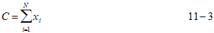
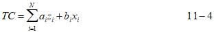
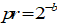

# The Endogenous Technological Learning extension

In a long-term dynamic model such as TIMES the characteristics of many of the future technologies are almost inevitably changing over the sequence of future periods due to *technological learning*.

In some cases it is possible to forecast such changes in characteristics as a function of time, and thus to define a time-series of values for each parameter (e.g. unit investment cost, or efficiency). In such cases, technological learning is *exogenous* since it depends only on time elapsed and may thus be established outside the model.

In other cases there is evidence that the pace at which some technological parameters change is dependent on the *experience* acquired with this technology. Such experience is not solely a function of time elapsed, but typically depends on the cumulative investment (often global) in the technology. In such a situation, technological learning is *endogenous*, since the future values of the parameters are no longer a function of time elapsed alone, but depend on the cumulative investment decisions taken by the model (which are unknown). In other words, the evolution of technological parameters may no longer be established outside the model, since it depends on the model's results.

Endogenous technological learning (ETL) is also named *Learning-By-Doing* (LBD) by some authors.

Whereas exogenous technological learning does not require any additional modeling, ETL presents a tough challenge in terms of modeling ingenuity and of solution time. In TIMES, there is a provision to represent the effects of endogenous learning on the unit investment cost of technologies. Other parameters (such as efficiency) are not treated, at this time.

## The basic ETL challenge

Empirical studies of unit investment costs of several technologies have been undertaken in several countries. Many of these studies find an empirical relationship between the unit investment cost of a technology at time $t$ $INVCOST_{t}$, and the cumulative investment in that technology up to time $t$, $C_{t} = \sum_{j = - 1}^{t}{VAR\_ NCAP_{j}}$.

A typical relationship between unit investment cost and cumulative investments is of the form:

$$INVCOST_{t} = a \times C_{t}^{- b}$$ (11 - 1)

where
- $INVCOST$ [^37] is the unit cost of creating one unit of the technology, which is no longer a constant, but evolves as more units of the technology are produced;
- $a$ is the value of $INVCOST$ for the first unit of the technology (when $C_{t}$ is equal to 1) and;
- $b$ is the learning index, representing the speed of learning[^38].

As experience builds up, the unit investment cost decreases, potentially rendering investments in the technology more attractive. It should be clear that near-sighted investors will not be able to detect the advantage of investing early in learning technologies, since they will only observe the high initial investment cost and, being near-sighted, will not anticipate the future drop in investment cost resulting from early investments. In other words, tapping the full potential of technological learning requires far-sighted agents who accept making initially non-profitable investments in order to later benefit from the investment cost reduction.

With regard to actual implementation, simply using (11-1) as the objective function coefficient of $VAR\_NCAP_t$ will yield a non-linear, non-convex expression. Therefore, the resulting mathematical optimization is no longer linear, and requires special techniques for its solution. In TIMES, a Mixed Integer Programming (MIP) formulation is used, that we now describe.

## The TIMES formulation of ETL

### The cumulative investment cost

We follow the basic approach described in Barreto, 2001.

The first step of the formulation is to express the total investment cost, i.e. the quantity that should appear in the objective function. The cumulative investment cost $TC_t$ of a learning technology in period $t$ is obtained by integrating expression (11-1):

$$TC_{t} = \int_{0}^{C_{t}}{a \times y^{- b}*dy} = \frac{a}{1 - b} \times {C_{t}}^{- b + 1}$$ (11 - 2)

$TC_t$ is a concave function of $C_t$, with a shape as shown in {numref}`cumulative-learning-curve`.

```{figure} assets/image26.png
:name: cumulative-learning-curve
:align: center
Example of a cumulative learning curve.
```

With the Mixed Integer Programming approach implemented in TIMES, the cumulative learning curve is approximated by linear segments, and binary variables are used to represent some logical conditions. {numref}`approx-cumulative-learning-curve` shows a possible piecewise linear approximation of the curve of {numref}`cumulative-learning-curve`. The choice of the number of steps and of their respective lengths is carefully made so as to provide a good approximation of the smooth cumulative learning curve. In particular, the steps must be smaller for small values than for larger values, since the curvature of the curve diminishes as total investment increases. The formulation of the ETL variables and constraints proceeds as follows (we omit the period, region, and technology indexes for notational clarity):

1. The user specifies the set of learning technologies;
2. For each learning technology, the user provides:

    a. The progress ratio $pr$ (from which the learning index $b$ may be inferred)

    b. One initial point on the learning curve, denoted $(C_0,TC_0)$

    c. The maximum allowed cumulative investment $C_{max}$(from which the maximum total investment cost $TC_{max}$ may be inferred)

    d. The number $N$ of segments for approximating the cumulative learning curve over the $(C_0,C_{max})$ interval.

> Note that each of these parameters, including $N$, may be different for different technologies.

3. The model automatically selects appropriate values for the $N$ step lengths, and then proceeds to generate the required new variables and constraints, and the new objective function coefficients for each learning technology. The detailed formulae are shown and briefly commented on below.

```{figure} assets/image27.png
:name: approx-cumulative-learning-curve
:align: center
Example of a 4-segment approximation of the cumulative cost curve.
```

### Calculation of break points and segment lengths

The successive interval lengths on the vertical axis are chosen to be in geometric progression, each interval being twice as wide as the preceding one. In this fashion, the intervals near the low values of the curve are smaller so as to better approximate the curve in its high curvature zone. Let $\{TC_{i-1}, TC_{i}\}$ be the $i^{th}$ interval on the vertical axis, for $i = 1, ..., N-1$. Then:

$$TC_{i} = TC_{i - 1} + 2^{i - N - 1}(T{Co^{N}}_{\max}$$

Note that $TC_{max}$ is equal to $TC_N$.

The break points on the horizontal axis are obtained by plugging the $TC_i$'s into expression (11-2), yielding:

$$C_{i} = \left( \frac{(1 - b)}{a}\left( TC_{i} \right) \right)^{\frac{1}{1 - b}},i = 1,2,...,N$$

### New variables

Once intervals are chosen, standard approaches are available to represent a concave function by means of integer (0-1) variables. We describe the approach used in TIMES.

First, we define $N$ continuous variables $x_i$, $i= 1,...,N$. Each $x_i$ represents the portion of cumulative investments lying in the $i^{th}$ interval. Therefore, the following holds:



We now define $N$ integer (0-1) variables $z_i$ that serve as indicators of whether or not the value of $C$ lies in the $i^{th}$ interval. We may now write the expression for $TC$, as follows:



where $b_i$ is the slope of the $i^{th}$ line segment, and $a_i$ is the value of the intercept of that segment with the vertical axis, as shown in {numref}`i-approx-learning-curve`. The precise expressions for $a_i$ and $b_i$ are:

$${b_{i} = \frac{TC_{i} - TC_{i - 1}}{C_{i} - C_{i - 1}}i = 1,2,...,N}$$(11 - 5)

$a_{i} = TC_{i - 1} - b_{i} \cdot C_{i - 1}i = 1,2,...,N$

```{figure} assets/image30.png
:name: i-approx-learning-curve
:align: center
The i^th^ segment of the step-wise approximation.
```

### New constraints

For (11-4) to be valid we must make sure that exactly one $z_i$ is equal to 1, and the others equal to 0. This is done (recalling that the $z_i$ variables are 0-1) via:

$$\sum_{i = 1}^{N}{z_{i} = 1}$$

We also need to make sure that each $x_i$ lies within the $i^{th}$ interval whenever $z_i$ is equal to 1 and is equal to 0 otherwise. This is done via two constraints:

$$C_{i - 1} \times z_{i} \leq x_{i} \leq C_{i} \times z_{i}$$

### Objective function terms

Re-establishing the period index, we see that the objective function term at period $t$, for a learning technology is thus equal to $TC_t - TC_{t-1}$, which needs to be discounted like all other investment costs.

### Additional (optional) constraints

Solving integer programming problems is facilitated if the domain of feasibility of the integer variables is reduced. This may be done via additional constraints that are not strictly needed but that are guaranteed to hold. In our application we know that experience (i.e. cumulative investment) is always increasing as time goes on. Therefore, if the cumulative investment in period $t$ lies in segment $i$, it is certain that it will not lie in segments $i-1, i-2, .., 1$ in time period $t+1$. This leads to two new constraints (re-establishing the period index $t$ for the $z$ variables):


Summarizing the above formulation, we observe that each learning technology requires the introduction of $N*T$ integer (0-1) variables. For example, if the model has 10 periods and a 5-segment approximation is selected, 50 integer (0-1) variables are created for that learning technology, assuming that the technology is available in the first period of the model. Thus, the formulation may become very onerous in terms of solution time, if many learning technologies are envisioned, and if the model is of large size to begin with. In section 11.5 we provide some comments on ETL, as well as a word of warning.

## Clustered learning

An interesting variation of ETL is also available in TIMES, namely the case where several technologies use the same key technology (or component), itself subject to learning. For instance, {numref}`gas-turbine-tech-cluster` lists 11 technologies using the key Gas Turbine technology. As experience builds up for gas the turbine, each of the 11 technologies in the cluster benefits. The phenomenon of clustered learning is modeled in TIMES via the following modification of the formulation of the previous section.

Let $k$ designate the key technology and let $l = 1, 2, ...,L$ designate the set of clustered technologies attached to $k$. The approach consists of three steps:

i) Step 1: designate $k$ as a learning technology, and write for it the formulation of the previous section;

ii) Step 2: subtract from each $INVCOST_l$ the initial investment cost of technology $k$ (this will avoid double counting the investment cost of $k$);

iii) Step 3: add the following constraint to the model, in each time period. This ensures that learning on $k$ spreads to all members of its cluster:

$$VAR\_NCAP_{k} - \sum_{l = 1}^{L}{VAR\_NCAP_{l} = 0}$$

:::{table} Cluster of gas turbine technologies (from A. Sebregts and K. Smekens, unpublished report, 2002)
:name: gas-turbine-tech-cluster

| Description                                      |
| ------------------------------------------------ |
| Integrated Coal gasification power plant         |
| Integrated Coal Gasification Fuel Cell plant     |
| Gas turbine peaking plant                        |
| Existing gas Combined Cycle power plant          |
| New gas Combined Cycle power plant               |
| Combined cycle Fuel Cell power plant             |
| Existing gas turbine CHP plant                   |
| Existing Combined Cycle CHP plant                |
| Biomass gasification: small industrial cog.      |
| Biomass gasification: Combined Cycle power plant |
| Biomass gasification: ISTIG+reheat               |
:::

## Learning in a multiregional TIMES model

Technological learning may be acquired via global or local experience, depending on the technology considered. There are examples of technologies that were developed and perfected in certain regions of the world, but have tended to remain regional, never fully spreading globally. Examples are found in land management, irrigation, and in household heating and cooking devices. Other technologies are truly global in the sense that the same (or close to the same) technology becomes rather rapidly commercially available globally. In the latter case, global experience benefits users of the technology worldwide. Learning is said to *spillover* globally. Examples are found in large electricity plants, in steel production, wind turbines, and many other sectors.

The first and obvious implication of these observations is that the appropriate model scope must be used to study either type of technology learning. The formulation described in the previous sections is adequate in two cases: a) learning in a single region model, and b) regional learning in a multiregional model. It does *not* directly apply to *global learning* in a multiregional global model, where the cumulative investment variable must represent the sum of all cumulative investments in all regions together. We now describe an approach to global learning that may be implemented in TIMES, using only standard TIMES entities.

The first step in modeling multiregional ETL is to create one additional region, region 0, which will play the role of the Manufacturing Region. This region's RES consists only of the set of (global) learning technologies (LT's). Each such LT has the following specifications:

a) The LT has no commodity input.

b) The LT has only one output, a new commodity $c$ representing the 'learning'. This output is precisely equal to the investment level in the LT in each period.

c) Commodity $c$ may be exported to all other regions.

Finally, in each 'real' region, the LT is represented with all its attributes *except the investment cost NCAP_COST.* Furthermore, the construction of one unit of the LT requires an input of one unit of the learning commodity $c$ (using the $NCAP\_ICOM$ parameter see chapter 3 of PART II). This ensures that the sum of all investments in the LT in the real regions is exactly equal to the investment in the LT in region 0, as desired.

## Endogenous vs. exogenous learning: a discussion

In this section, we formulate a few comments and warnings that may be useful to potential users of the ETL feature.

We start by stating a very important caveat to the ETL formulation described in the previous sections: if a model is run with such a formulation, it is very likely that the model will select some technologies, and *will invest massively at some early period* in these technologies unless it is prevented from doing so by additional constraints. Why this is likely to happen may be qualitatively explained by the fact that once a learning technology is selected for investing, two opposing forces are at play in deciding the optimal timing of the investments. On the one hand, the discounting provides an incentive for postponing investments. On the other hand, investing early allows the unit investment cost to drop immediately, and thus allows much cheaper investments in the learning technologies in the current and all future periods. Given the considerable cost reduction that is usually induced by learning, the first factor (discounting) is highly unlikely to predominate, and hence the model will tend to invest massively and early in such technologies, or not at all. Of course, what we mean by "massively" depends on the other constraints of the problem (such as the extent to which the commodity produced by the learning technology is in demand, the presence of existing technologies that compete with the learning technology, etc.). However, there is a clear danger that we may observe unrealistically large investments in some learning technologies.

ETL modelers are well aware of this phenomenon, and they use additional constraints to control the penetration trajectory of learning technologies. These constraints may take the form of upper bounds on the capacity of or the investment in the learning technologies in each time period, reflecting what is considered by the user to be realistic penetrations. These upper bounds play a determining role in the solution of the problem, and it is most often observed that the capacity of a learning technology is either equal to 0 or to the upper bound. This last observation indicates that the selection of upper bounds (or capacity/investment growth rates) by the modeler is the predominant factor in controlling the penetration of successful learning technologies.

In view of the preceding discussion, a fundamental question arises: is it worthwhile for the modeler to go to the trouble of modeling *endogenous* learning (with all the attendant computational burdens) when the results are to a large extent conditioned by *exogenous* upper bounds? We do not have a clear and unambiguous answer to this question; that is left for each modeler to evaluate.

However, given the above caveat, a possible alternative to ETL would consist in using exogenous learning trajectories. To do so, the same sequence of 'realistic' upper bounds on capacity would be selected by the modeler, and the values of the unit investment costs ($INVCOST$) would be externally computed by plugging these upper bounds into the learning formula (11-1). This approach makes use of the same exogenous upper bounds as the ETL approach, but avoids the MIP computational burden of ETL. Of course, the running of exogenous learning scenarios is not entirely foolproof, since there is no absolute guarantee that the capacity of a learning technology will turn out to be exactly equal to its exogenous upper bound. If that were not the case, a modified scenario would have to be run, with upper bounds adjusted downward. This trial-and-error approach may seem inelegant, but it should be remembered that it (or some other heuristic approach) might prove to be necessary in those cases where the number of learning technologies and the model size are both large (thus making the rigorous ETL formulation computationally intractable).

------------

[^37]: The notation in this chapter is sometimes different from the standard notation for parameters and variables, in order to conform to the more detailed technical note on the subject.

[^38]: It is usual to define, instead of $b$, another parameter, $pr$ called the *progress ratio*, which is related to $b$ via the following relationship:. Hence, $1-pr$ is the cost reduction incurred when cumulative investment is doubled. Typical observed $pr$ values are in a range of 0.75 to 0.95.
