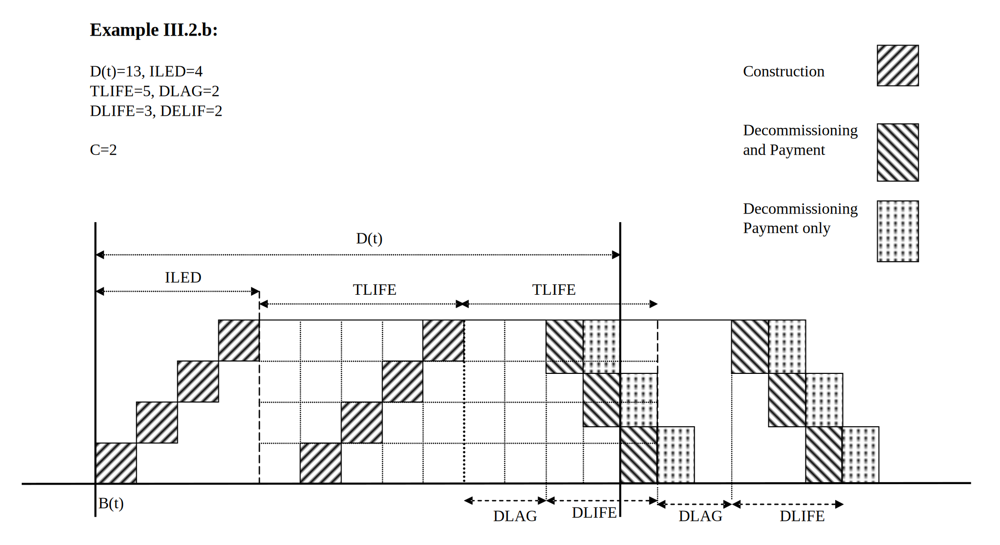

# Equations 

This chapter is divided into four sections: the first section describes the main notational conventions adopted in writing the mathematical expressions of the entire chapter. The next two sections treat respectively the TIMES objective function and the standard linear constraints of the model. The fourth section is devoted to the facility for defining various kinds of user constraints. Additional constraints and objective function additions that are required for the Climate Module, Damage Cost and Endogenous Technology Learning options are described in Appendices A, B and C, respectively.

Each equation has a unique name and is described in a separate subsection. The equations are listed in alphabetical order in each section. Each subsection contains successively the name, list of indices, and type of the equation, the related variables and other equations, the purpose of the equation, any particular remarks applying to it, and finally the mathematical expression of the constraint or objective function.

The mathematical formulation of an equation starts with the name of the equation in the format: $EQ\_XXX_{i,j,k,l}$, where $XXX$ is a unique equation identifier, and $i,j,k,..,$ are the *equation indexes*, among those described in chapter 2. Some equation names also include an index *l* controlling the sense of the equation. Next to the equation name is a *logical condition* that the equation indexes must satisfy. That condition constitutes the *domain of definition* of the equation. It is useful to remember that the equation is created in multiple instances, one for each combination of the equation indexes that satisfies the logical condition, and that each index in the equation's index list remains *fixed* in the expressions constituting each instance of the equation.

## Notational conventions

We use the following mathematical symbols for the mathematical expressions and relations constituting the equations:

The conditions that apply to each equation are mathematically expressed using the $\ni$symbol (meaning "such that" or "only when"), followed by a logical expression involving the usual logic operators: $\land$ (AND), $\vee$ (OR), and NOT.

Within the mathematical expressions of the constraints, we use the usual symbols for the arithmetic operators ($+ , - , \times ,/,\Sigma,$ etc).

However, in order to improve the writing and legibility of all expressions, we use some simplifications of the usual mathematical notation concerning the use of multiple indexes, which we describe in the next two subsections.

### Notation for summations 

When an expression $A(i,j,k,...)$ is summed, the summation must specify the range over which the indexes are allowed to run. Our notational conventions are as follows:

When a single index j runs over a one-dimensional set A, the usual notation is used, as in: $\sum_{j \in A}^{}{Expression_{j}}$ where *A* is a single dimensional set. 

When a summation must be done over a subset of a multi-dimensional set, we use a simplified notation where some of the running indexes are omitted, if they are not active for this summation.

\underline{Example}: consider the 3-dimensional set *top* consisting of all quadruples $\{r,p,c,io\}$ such that process $p$ in region $r$, has a flow of commodity $c$ with orientation $io$ (see table 3 of chapter 2). If is it desired to sum an expression $A_{r,p,c,io}$ over all commodities $c$, keeping the region ($r$), process ($p$) and orientation ($io$) fixed respectively at $r_1$, $p_1$ and 'IN', we will write, by a slight abuse of notation: $\sum_{c \in top(r_{1},p_{1},'IN')}^{}{A(r_{1},p_{1},c,'IN')}$ , or even more simply:

$\sum_{c \in top}^{}{A(r_{1},p_{1},c,'IN')}$, if the context is unambiguous. Either of these notations clearly indicates that $r$, $p$ and $io$ are fixed and that the only active running index is $c$.

(The traditional mathematical notation would have been: $\sum_{\{ r_{1},p_{1},c,'IN'\} \in top}^{}{A(r_{1},p_{1},c,'IN')}$, but this may have hidden the fact that $c$ is the only running index active in the sum).

### Notation for logical conditions 

We use similar simplifying notation in writing the logical conditions of each equation. A logical condition usually expresses that some parameter exists (i.e. has been given a value by the user), and/or that some indexes are restricted to certain subsets.

A typical example of the former would be written as: $\ni ACTBND_{r,t,p,s,bd}$, which reads: "the user has defined an activity bound for process *p* in region *r*, time-period *t*, timeslice *s* and sense *bd*". The indexes may sometimes be omitted, when they are the same as those attached to the equation name.

A typical example of the latter is the first condition for equation $EQ\_ACTFLO_{r,v,t,p,s}$ (see section 6.3.4), which we write simply as: $\mathbf{rtp}\_\mathbf{vintyr}$, which is short for: $\{ r,v,t,p\} \in \mathbf{rtp}\_\mathbf{vintyr}$, with the meaning that "some capacity of process *p* in region *r*, created at period *v*, exists at period *t*". Again here, the indices have been omitted from the notation since they are already listed as indices of the equation name.

### Using Indicator functions in arithmetic expressions

There are situations where an expression A is either equal to B or to C, depending on whether a certain condition holds or not, i.e.:

$${A = B\ if\ Cond}$$
$${A = C\ if\ NOT\ Cond}$$

This may also be written as:

$$A = B \times (Cond) + C \times (NOT\ Cond)$$

where it is understood that the notation (Cond) is the *indicator function* of the logical condition, i.e. (Cond)=1 if Cond holds, and 0 if not.

This notation often makes equations more legible and compact. A good example appears in EQ_CAPACT.

## Objective function EQ_OBJ

**Equation EQ_OBJ**

**Indices: region (r); state of the world (w); process (p); time-slice (s); and perhaps others \...**

**Type: = Non Binding (MIN)**

**Related Variables: All**

**Purpose**: the objective function is the criterion that is minimized by the TIMES model. It represents the total discounted cost of the entire, possibly multi-regional system over the selected planning horizon. It is also equal to the negative of the discounted total surplus (plus a constant), as discussed in PART I, chapters 3 and 4.

### Introduction and notation

The TIMES objective function includes a number of innovations compared to those of more traditional energy models such as MARKAL, EFOM, MESSAGE, etc. The main design choices are as follows:

- The objective function may be thought of as the discounted sum of *net annual costs* (i.e. costs minus revenues), as opposed to *net period costs*[^39]. Note that some costs and revenues are incurred after the end of horizon (EOH). This is the case for instance for some investment payments and more frequently for payments and revenues attached to decommissioning activities. The past investments (made before the first year of the horizon) may also have payments within horizon years (and even after EOH!) These are also reflected in the objective function. However, it should be clear that such payments are shown in OBJ only for reporting purposes, since such payments are entirely *sunk*, i.e. they are not affected by the model's decisions.

- The model uses a general discount rate $d(y)$ (year dependent), as well as technology specific discount rates $d_{s}(t)$ (period dependent). The former is used to: a) discount fixed and variable operating costs, and b) discount investment cost payments from the point of time when the investment actually occurs to the base year chosen for the computation of the present value of the total system cost. The latter are used only to calculate the annual payments resulting from a lump-sum investment in some year. Thus, the only place where $d_{s}(t)$ intervenes is to compute the Capital Recovery Factors *(CRF)* discussed further down.

For convenience, we summarize below the notation which is more especially used in the objective function formulation (see Section 6.1 for general notes on the notation) .

#### Notation relative to time

***MILESTONEYEARS:*** the set of all milestone years (by convention: middle years, see below ***M(t)*** )

***PASTYEARS:*** Set of years (usually prior to start of horizon), for which there is a past investment (*after* interpolation of user data).

***MODELYEARS:*** any year within the model's horizon

***FUTUREYEARS:*** set of years posterior to EOH

***YEARS*** set of years before during and after planning horizon

***t*** any member of ***MILESTONEYEARS*** or ***PASTYEARS***. By convention, a period ***t*** is represented by its middle year (see below ***M(t)***). This convention can be changed without altering the expressions in this document.

***B(t)*** : the first year of the period represented by ***t***

***E(t)*** : the last year of the period represented by ***t***

***D(t)*** : the number of years in period ***t*** . By default, ***D(t)=1*** for all past years. Thus, ***D(t)=E(t)--B(t)+1***

***M(t):*** the "middle" year or milestone year of period ***t***. Since period ***n*** may have an even or an odd number of years, ***M(t)*** is not always exactly centered at the middle of the period. It is defined as follows: ***M(t) = \[B(t)+(D(t)--1)/2\],*** where ***\[x\]*** indicates the largest integer less than or equal to ***x***. For example, period from 2011 to 2020 includes 10 years, and its "middle year" is \[2011+4.5\] or 2015 (slightly left of the middle), whereas the period from 2001 to 2015 has 15 years, and its "middle year" is : \[2001+7\] or 2008 (i.e. the true middle in this example)

***y*** : running year, ranging over ***MODELYEARS***, from $\boldsymbol{B_{0}}$ to ***EOH***.

***k*** : dummy running index of any year, even outside horizon

***v***: running index for a year, used when it represents a vintage year for some investment.

***v(p)*** vintage of process ***p*** (defined only if ***p*** is vintaged)

$\boldsymbol{B_{0}}$ : initial year (the single year of first period of the model run)

***EOH*** : Last year in horizon for a given model run.

Similarly, by a slight abuse of notation, the above entities are extended as follows, when the argument is a particular year, rather than a model year:

***B(y)*** : first year of the period containing year ***y*** (instead of ***B(T(y))*** )

***T(y)*** the milestone year of the period containing year ***y*** (same as ***M(y)*** in our present convention)

***M(y)*** : "middle year" of the period containing year ***y*** (instead of ***M(T(y))*** )

***D(y)*** : number of years of the period containing year ***y*** (instead of ***D(T(y))***

#### Other notation

***d(y)*** : general (social) discount rate (time dependent, although not shown in

notation)

***r(y)*** : general discount factor: ***r(y)=1/(1+d(y))*** (time dependent, although not shown in notation)

***$\boldsymbol{d_{s}(t)}$*** : technology specific discount rate (model year dependent)

***$\boldsymbol{r_{s}(t)}$*** : technology specific discount factor: ***$\boldsymbol{r_{s}(t)=1/(1+d_{s}(t))}$***

***DISC(y,z)**:* Value, discounted to the beginning of year ***z***, of a \$1 payment made at beginning of year ***y***, using **general** discount factor. ***$\boldsymbol{{DISC}(y,z) = \prod_{u=z\ to\ y-1} r(u)}$***

***$\boldsymbol{CRF_{s}(t)}$:*** Capital recovery factor, using a (technology specific) discount rate and an economic life appropriate to the payment being considered. This quantity is used to replace an investment cost by a series of annual payments spread over some span of time ***$\boldsymbol{CRF_{s} = \{1 - r_{s}(t)\} / \{1 - r_{s}(t)^{ELIFE}\}}$***[^40]***.*** Note that a *CRF* using the general discount rate is also defined and used in the SALVAGE portion of the objective function.

***OBJ(z):*** Total system cost, discounted to the beginning of year ***z***

***INDIC(x):*** ***1*** if logical expression ***x*** is true, ***0*** if not

$\left\langle \mathbf{E} \right\rangle$ is the smallest integer larger than of equal to *E*

#### Reminder of some technology attribute names (each indexed by *t*)

***TLIFE*** Technical life of a technology

***ELIFE*** Economic life of a technology, i.e. period over which investment payments are spread (default = ***TLIFE***)

***DLAG*** Lag after end of technical life, after which decommissioning may start

***DLIFE*** Duration of decommissioning for processes with ***ILED\>0, (otherwise =1)***

***DELIF*** Economic life for decommissioning purposes (default ***DLIFE***).

***ILED*** Lead-time for the construction of a process. *TLIFE* starts *after* the end of *ILED.* Note that below we in general assume *ILED*≥0, although *ILED* can also be negative (causing the lead-time be shifted ILED years backward).

***$\boldsymbol{ILED_{Min} = \textit{Min} \left\{ (1/10) \times D(t), (1/10) \times TLIFE \right\}}$*** This threshold serves to distinguish small from large projects; it triggers a different treatment of investment timing.

#### Discounting options

There are alternate discounting methods in TIMES. The default method is to assume that all payments occur at the beginning of some year. Alternate methods (activated by a switch, see PART III) assume that investments are incurred at the beginning of some year, but that all annual (or annualized) payments occur at the middle or at the end of the corresponding year. Section 0 explains the different methods.

#### Components of the Objective function

The objective function is the sum of all regional objectives, all of them discounted to the same user-selected base year, as shown in equation {eq}`6-A` below

$$EQ\_OBJ(z) \ni z \in ALLYEARS$$

$$VAR\_OBJ(z) = \sum_{r \in REG}{REG\_OBJ(z,r)}$$ (6-A)

Each regional objective *OBJ(z,r)* is decomposed into the sum of nine components, to facilitate exposition, as per expression {eq}`6-B` below.

$$EQ\_OBJ(z,r) \ni z \in ALLYEARS, \space r \in REG$$

$$
\begin{aligned}
REG\_ OBJ(z,r) = & \sum_{y \in ( - \infty, + \infty)}{DISC(y,z) \times \left\{
  \begin{aligned}
   & INVCOST(y) + INVTAXSUB(y) + \\
   & INVDECOM(y) + FIXCOST(y) + \\
   & FIXTAXSUB(y) + SURVCOST(y) + \\
   & VARCOST(y) + VARTAXSUB(y) + \\
   & ELASTCOST(y) - LATEREVENUES(y)                                  
  \end{aligned}
  \right\}}\\ & - SALVAGE(z)
\end{aligned}$$ (6-B)

The regional index *r* is omitted from the nine components for simplicity of notation.

The first and second terms are linked to investment costs. The third term is linked to decommissioning capital costs, the fourth and fifth terms to fixed annual costs, the seventh and eighth terms to all variable costs (costs proportional to some activity), and the ninth to demand loss costs. The tenth cost (actually a revenue) accounts for commodity recycling occurring after *EOH*, and the eleventh term is the salvage value of all capital costs of technologies whose life extends beyond *EOH*. The 11 components are presented in the nine subsections 6.2.2 to 6.2.10.

### Investment costs: INVCOST(y)

This subsection presents the components of the objective function related to investment costs, which occur in the year an investment is decided and/or during the construction lead-time of a facility.

**Remarks**

a) The investment cost specified by using the input attribute NCAP_COST should be the overnight investment cost (excluding any interests paid during construction) whenever the construction lead time is explicitly modeled (i.e. cases 2 are used, see below). In such a case, the interests during construction are endogenously calculated by the model itself, as will be apparent in the sequel. If no lead-time is specified (and thus cases 1 are used), the full cost of investments should be used (including interests during construction, if any)[^41].

b) Each individual investment physically occurring in year *k,* results in a *stream of annual payments* spread over several years in the future. The stream starts in year *k* and covers years *k, k+1, ..., k+ELIFE-1,* where *ELIFE* is the economic life of the technology. Each yearly payment is equal to a fraction *CRF* of the investment cost (*CRF* = Capital Recovery Factor). Note that if the technology discount rate is equal to the general discount rate, then the stream of *ELIFE* yearly payments is equivalent to a single payment of the whole investment cost located at year *k*, inasmuch as both have the same discounted present value. If however the technology's discount rate is chosen different from the general one, then the stream of payments has a different present value than the lump sum at year *k*. It is the user's responsibility to choose technology dependent discount rates, and therefore to decide to alter the effective value of investment costs.

c) In addition to spreading the payments resulting from investment costs, a major TIMES refinement is that the physical investment itself does not occur in a single year, but rather as a series of annual increments. For instance, if the model invests 3 GW of electric capacity in a period extending from 2011 to 2020, the physical capacity increase may be delayed and/or may be spread over several years. The exact way the delaying and spreading are effected depends on several conditions, which are specified further down as four separate cases, and which are functions both of the nature of the technology and of the length of the period in which the investment takes place relative to the technology's technical life. The spreading of investments and the spreading of payments described in the previous paragraph help guarantee a smooth trajectory for most investment payments, a more realistic representation than what happens in other models. The Case 1.a example given below shows a case where the physical investment is spread over four years, and each increment's capital payments are further spread over 3 years.

d) The above two remarks entail that payments of investment costs may well extend beyond the horizon. We shall also see that some investment payments occur in years prior to the beginning of the planning horizon (cases 1 only).

e) Taxes and subsidies on investments are treated exactly as investment costs in the objective function.

f) Since the model has the capability to represent *sunk* materials and energy carriers (i.e. those embedded in a technology at construction time, such as the uranium core of a nuclear reactor, or the steel imbedded in a car), these sunk commodities have an impact on cost. Two possibilities exist: if the material is one whose production is explicitly modeled in the RES, then there is no need to indicate the cost corresponding to the sunk material, which will be implicitly accounted for by the model just like any other flow. If on the other hand the material is not speci­fically modeled in the RES, then the cost of the sunk material should be included in the technology's investment cost, and will then be handled exactly as investment costs.

$\underline{\textbf{The four investment cases}}$

As mentioned above, the timing of the various types of payments and revenues is made as realistic and as smooth as possible. All investment decisions result in increments and/or decrements in the capacity of a process, at various times. These increments or decrements may occur, in some cases, in one large lump, for instance in the case of a large project (hydroelectric plant, aluminum plant, etc.), and, in other cases, in small additions or subtractions to capacity (e.g. buying or retiring cars, or heating devices). Depending on which case is considered, the assumption regarding the corresponding streams of payments (or revenues) differs markedly. Therefore, the distinction between small and large projects (called cases 1 and 2 below) will be crucial for writing the capital cost components of the objective function. A second distinction comes from the relative length of a project's technical life vs. that of the period when the investment occurs. Namely, if the life of an investment is less than the length of the period, then it is clear that the investment must be repeated all along the period. This is not so when the technical life extends beyond the period's end. Altogether, these two distinctions result in four mutually exclusive cases, each of which is treated separately. In what follows, we present the mathematical expression for the INVCOST component and one graphical example for each case.

**Case 1.a:** ${ILED}_{t} \leq {ILED}_{Min,t}$ and ${TLIFE}_{t} + {ILED}_{t} \geq {D(t)}$

**(Small divisible projects, non-repetitive, progressive investment in period)**

Here, we make what appears to be the most natural assumption, i.e. that the investment occurs in small yearly increments spread linearly over *D(t)* years. Precisely, the capacity additions start at year *M(t)-D(t)+1,* and end at year M*(t),* which means that payments start earlier than the beginning of the period, and end at the middle of the period, see example. This seems a more realistic compromise than starting the payments at the beginning of the period and stopping them at the end, since that would mean that during the whole period, the paid for capacity would actually not be sufficient to cover the capacity selected by the model for that period.


*EQ_INVCOST(y)*

$$
INVCOST(y) = \sum_{t \in MILESTONE \cup PASTYEARS}^{}{INDIC(1.a)} \times \sum_{v = Max\{ M(t) - D(t) + 1,y - ELIFE_{t} + 1\}}^{Min\{ M(t),y\}}\left( \frac{VAR\_ NCAP_{t}}{D(t)} + NCAP\_ PASTI_{t} \right)
\times CRF_{s} \times NCAP\_COST_{v}
$$

Useful range for $y$:

$$\left \{ M(t) - D(t) + 1, M(t) + ELIFE_{t} - 1 \right \}$$ (I-1-a)

*Comments*: The summand represents the payment effected in year *y,* due to the investment increment that occurred in year *v* (recall that investment payments are spread over *ELIFE*). The summand consists of three factors: the first is the amount of investment in year *v*, the second is the capital recovery factor, and the third is the unit investment cost.

The outer summation is over all periods (note that periods later than *T(y)* are relevant, because when *y* falls near the end of a period, the next period's investment may have already started). The inner summation is over a span of *D(t)* centered at *B(t),* but truncated at year *y*. Also, the lower summation bound ensures that an investment increment which occurred in year *v* has a payment in year *y* only if *y* and *v* are less than *ELIFE* years apart.

**Case 1.b:** ${ILED}_{t} \leq {ILED}_{Min,t}$ and ${TLIFE}_{t} + {ILED} < {D(t)}$

**Small projects, repeated investments in period**

Note that in this case the investment is repeated as many times as necessary to cover the period length (see figure). In this case, the assumption that the investment is spread over $D(t)$ years is not realistic. It is much more natural to spread the investment over the technical life of the process being invested in, because this ensures a smooth, constant stream of small investments during the whole period (any other choice of the time span over which investment is spread, would lead to an uneven stream of incremental investments). The number of re-investments in the period is called $C$, and is easily computed so as to cover the entire period. As a result of this discussion, the first investment cycle starts at year $\langle B(t) - TLIFE_{t}/2 \rangle$ (meaning the smallest integer not less than the operand), and ends *TLIFE* years later, when the second cycle starts, etc, as many times as necessary to cover the entire period. The last cycle extends over the next period(s), and that is taken into account in the capacity transfer equations of the model. As before, each capacity increment results in a stream of *ELIFE* payments at years $v$, $v+1$, etc.


$$
\begin{multline}
INVCOST(y) = \sum_{t \in MILESTONE} INDIC(1.b) \times \\
\sum_{v=Max \{ \langle B(t) - TLIFE_t / 2\rangle, y-ELIFE_t+1\}}^{Min\{y,\langle B(t) - TLIFE_t / 2\rangle + C \times TLIFE_t-1\}} \frac{VAR\_NCAP_t}{TLIFE_t} \times CRF_s \times NCAP\_COST_v
\end{multline}
$$

Relevant range for $y$:

$$\{ \langle B(t) - TLIFE_{t}/2 \rangle, \langle B(t) - TLIFE_{t}/2 \rangle + C \times TLIFE_{t} + ELIFE_{t}-2\}$$ (I-1-b)

*Comments:* the expression is similar to that in case **1.a**., except that i) the investment is spread over the technical life rather than the period length, and ii) the investment cycle is repeated more than once.

**Case 2.a:** ${ILED}_{t} > {ILED}_{Min,t}$ and ${ILED}_{t} + {TLIFE}_{t} \geq {D(t)}$

**(Large, indivisible projects, unrepeated investment in period)**

Here, it is assumed that construction is spread over the lead-time (a very realistic assumption for large projects), and capacity becomes available at the end of the lead time, **in a lump quantity** (see figure).


$$
INVCOST(y) = 
\sum_{\begin{aligned}
 & t \in MILESTONEYEARS \\
 & t \leq T(y)
\end{aligned}}^{}{INDIC(2.a)} \times \sum_{k = Max\{ B(t) + Min(0,ILED_{t}),y - ELIFE_{t} + 1\}}^{Min(B(t) + Max( - \text{1,}Min(\text{0,}ILED_{t}),ILED_{t} - 1),y)}\left( \frac{VAR\_ NCAP_{t}}{ILED_{t}} \right) \times CRF_{s} \times NCAP\_ COST_{B(t) + Max(0,ILED_{t})} + 
\sum_{v \in PASTYEARS}^{}{INDIC(2.a)} \times \sum_{k = Max\{ B(v) + Min(0,ILED_{v}),y - ELIFE_{v} + 1\}}^{Min(B(v) + Max( - 1,Min(0,ILED_{v}),ILED_{v} - 1),y)}{}\left( \frac{NCAP\_ PASTI_{v}}{ILED_{v}} \right) \times CRF_{s} \times NCAP\_ COST_{B(v) + Max(0,ILED_{v})}
$$

Useful Range for $y$:

$$
{\{ B(t),B(t) + ILED_{t} + ELIFE_{t} - 2\} \quad for \space ILED_{t} \geq 1}
$$

$$
{\{ B(t) + ILED_{t},B(t) + ELIFE_{t} - 2\} \quad for \space ILED_{t} \leq -1}
$$ (I-2-a)

*Comments:* The main difference with case I.1.a) is that the investment's construction starts at year *B(t)* and ends at year $B(t)+ILED_t-1$ (see example). As before, payments for each year's construction spread over *ELIFE* years. Equation I.2.a also shows the impact of negative *ILED*s, which is simply a shift of the lead-time *ILED* years backwards.

**Case 2.b:** ${ILED} > {ILED}_{Min,t}$ and ${TLIFE}_{t} + {ILED}_{t} < {D(t)}$

**(Large, indivisible Projects, repeated investments in period)**


This case is similar to case I.2.a, but the investment is repeated more than once over the period, each cycle being *TLIFE* years long. As in case I.2.a, each construction is spread over one lead time, *ILED*. In this case, the exact pattern of yearly investments is complex, so that we have to use an algorithm instead of a closed form summation.

$\underline{\textbf{ALGORITHM}}$ (Output: the vector of payments $P_t(y)$ at each year $y$, due to $VAR\_NCAP_t$)

$\underline{\textbf{Step 0}}$ Initialization ($NI(u)$ represents the amount of new investment made in year $u$)

$$
NI_t(u):=0 \quad \forall B(t) \leq u \leq B(t) + ILED_t + (C-1) \times TLIFE_t-1 
$$

$\underline{\textbf{Step 1}}$ Compute number of repetitions of investment

$$C = \left\langle \frac{D(t)-ILED_t}{TLIFE_t} \right\rangle$$

$\underline{\textbf{Step 2}}$ for each year $u$ in range:

$$B(t) \leq u \leq B(t) + ILED_t + (C-1) \cdot TLIFE_t - 1$$

Compute:

$$
\begin{align*}
&For \ I=1 \ to \ C \\
&\quad For \ u = B(t) + (I - 1) \cdot TLIFE_t \ to \ B(t) + (I - 1) \cdot TLIFE_t + ILED_t - 1 \\
&\quad \quad NI_t(u) := NI_t(u) + \frac{NCAP\_COST_{B(t) + (I - 1) \times TLIFE_t + ILED_t}}{ILED_t} \\
&\quad Next \ u \\
&Next \ I
\end{align*}
$$

$\underline{\textbf{Step 3}}$ Compute payments incurred in year $y$, and resulting from variable $VAR\_NCAP_t$

For each $y$ in range:

$$B(t) \leq y \leq B(t) + (C-1) \cdot TLIFE_t + ILED_t + ELIFE_t - 2$$ (I-2-b)

Compute:

$$P_t(y) = \sum_{u=Max\{B(t), y-ELIFE_t+1\}}^{y} {NI_t(u) \times VAR\_CAP_t \times CRF_s}$$

$\underline{\textbf{END ALGORITHM}}$

$$INVCOST(y) = \sum_{t \in MILESTONES,t \leq T(y)}^{}{INDIC(2.b) \times P_{t}(y)}$$

### Taxes and subsidies on investments

We assume that taxes/subsidies on investments occur at precisely the same time as the investment. Therefore, the expressions *INVTAXSUB(y)* for taxes/subsidies are identical to those for investment costs, with *NCAP_COST* replaced by: *(NCAP_ITAX -- NCAP_ISUB).*

### Decommissioning (dismantling) capital costs: *INVDECOM(y)*

**Remarks**

a) Decommissioning physically occurs after the end-of-life of the investment, and may be delayed by an optional lag period *DLAG* (e.g. a "cooling off" of the process before dismantling may take place). The decommissioning costs follow the same patterns and rules as those for investment costs. In particular, the same four cases that were defined for investment costs are still applicable.

b) The same principles preside over the timing of payments of decommissioning costs as were defined for investment costs, namely, the decomposition of payments into a stream of payments extending over the economic life of decommissioning, *DELIF.*

c) At decommissioning time, the recuperation of embedded materials is allowed by the model. This is treated as explained for investment costs, i.e. either as an explicit commodity flow, or as a credit (revenue) subtracted *by the user* from the decommissioning cost.

g) Decommissioning activities may also receive taxes or subsidies which are proportional to the corresponding decommissioning cost.

$$EQ\_ COSTDECOM(y) \ni y \in ALLYEARS$$

**Case 1.a:** ${ILED}_{t} \leq {ILED}_{Min,t}$ and ${TLIFE}_{t} + {ILED}_{t} \geq {D(t)}$

**(Small divisible projects, non-repetitive, progressive investment in period)**

In this case, decommissioning occurs exactly $TLIFE+DLAG$ years after investment. For small projects (cases **1.a** and **1.b**), it is assumed that decommissioning takes exactly one year, and also that its cost is paid that same year (this is the same as saying that $DLIFE=DELIF=1$). Any user-defined DLIFE/DELIF is in this case thus ignored. This is a normal assumption for small projects. As shown in the example below, also payments made at year $y$ come from investments made at period $T(y)$ or earlier. Hence the summation stops at $T(y)$.

$$
INVDECOM(y) = 
\sum_{\begin{aligned}
 & t \in MILESTONES \cup PASTYEARS \\
 & t \leq T(y)
\end{aligned}}^{}{INDIC(1.a) \times \left( \frac{VAR\_NCAP_{t}}{D(t)} + NCAP\_PASTI_{t} \right) \times NCAP\_DCOST_{y - TLIFE_{t}}}
\times \left\{ \begin{aligned}
 & 1 \quad if \space M(t) - D(t) + 1 + TLIFE_{t} + DLAG_{t} \leq y \leq M(t) + TLIFE_{t} + DLAG_{t} \\
 & 0 \quad otherwise
\end{aligned} \right.\ 
$$  (III-1-a)

*Comment:* Note that the cost attribute is indexed at the year when the investment started to operate. We have adopted this convention throughout the objective function.


**Case 1.b:** ${ILED}_{t} \leq {ILED}_{Min,t}$ and ${TLIFE}_{t} + {ILED} < {D(t)}$

**(Small projects, repeated investments in period)**

This cost expression is similar to I.1.b, but with payments shifted to the right by *TLIFE* (see example). The inner summation disappears because of the assumption that $DELIF=1$. Note also that past investments have no effect in this case, because this case does not arise when $D(t)=1$, which is always the case for past periods.

$$
INVDECOM(y) = 
\sum_{\begin{aligned}
 & t \in MILESTONES \\
 & t \leq T(y)
\end{aligned}}^{}{INDIC(1.b) \times \left( \frac{VAR\_NCAP_{t}}{TLIFE_t}\right) \times NCAP\_DCOST_{y - TLIFE_{t}}}
\times \left\{ \begin{aligned}
 & 1 \quad if \space B(t) + \left[ \frac{TLIFE_t}{2} \right] \leq y \leq B(t) + \left[ \frac{TLIFE_t}{2} \right] + C \cdot TLIFE_t - 1 \\
 & 0 \quad otherwise
\end{aligned} \right.\ 
$$

where $C=\left\langle\frac{D(t)}{TLIFE_t}\right\rangle$

**(III.1.b)**


**Case 2.a:** ${ILED}_{t} > {ILED}_{Min,t}$ and ${ILED}_{t} + {TLIFE}_{t} \geq {D(t)}$

**(Large, indivisible projects, unrepeated investment in period)**

In this situation, it is assumed that decommissioning of the plant occurs over a period of time called *DLIFE*, starting after the end of the technical process life *plus a time DLAG* (see example). *DLAG* is needed e.g. for a reactor to "cool down" or for any other reason. Furthermore, the payments are now spread over *DELIF,* which may be larger than one year.

$${INVDECOM(y) = 
}{\sum_{\begin{aligned}
 & t \in MILESTONES \\
 & t \leq T(y)
\end{aligned}}^{}{INDIC(2.a)} \times \sum_{k = Max\left\{ B(t) + ILED_{t} + TLIFE_{t} + DLAG_{t},y - DELIF_{t} + 1 \right\}}^{Min\{ y,B(t) + ILED_{t} + TLIFE_{t} + DLAG_{t} + DLIFE_{t} - 1\}}\left( \frac{VAR\_ NCAP_{t}}{DLIFE_{t}} \right) \times CRF_{s} \times NCAP\_ DCOST_{B(t) + ILED_{t}}
}
{+ \sum_{t \in PASTYEARS}^{}{INDIC(2.a)} \times \sum_{k = Max\left\{ t + TLIFE_{t} + DLAG_{t},y - DELIF_{t} + 1 \right\}}^{Min\{ y,t + TLIFE_{t} + DLAG_{t} + DLIFE_{t} - 1\}}\left( \frac{NCAP\_ PASTI_{t}}{DLIFE_{t}} \right) \times CRF_{s} \times NCAP\_ DCOST_{t}}$$ (III-2-a)

Useful Range for $y$:

$$
\{B(t) + ILED_{t} + TLIFE_{t} + DLAG_{t} - 1, \space same + DELIF_{t} - 1\}
$$


**Case 2.b:** ${ILED}_{t} > {ILED}_{Min,t}$ and ${TLIFE}_{t} + {ILED}_{t} < {D(t)}$

**(Big projects, repeated investments in period)**

Here too, the decommissioning takes place over *DLIFE*, but now, contrary to case 2.a, the process is repeated more than once in the period. The last investment has life extending over following periods, as in all similar cases. The resulting stream of yearly payments is complex, and therefore, we are forced to use an algorithm rather than a closed form summation. See also example below.

**[ALGORITHM]{.underline}** (apply to each *t* such that $t \leq T(y)$)

[Step 0]{.underline}: Initialization

$$P_{t}(y): = 0\quad\forall B(t) + ILED_{t} + TLIFE_{t} + DLAG_{t} \leq y \leq same + (C - 1) \times TLIFE_{t} + DLIFE_{t} + DELIF_{t} - 2$$

Where:

$$C = \left\langle \frac{D(t) - ILED_{t}}{TLIFE_{t}} \right\rangle$$

[Step 1]{.underline}: Compute payment vector

$$
{For \space I = 1 \space to \space C}
{For \space J = 1 \space to \space DLIFE_{t}
}{For \space L = 1 \space to \space DELIF_{t}
}{P_{t}\left( B(t) + ILED_{t} + I \times TLIFE_{t} + DLAG_{t} + J + L - 2 \right): = 
}{same + \frac{NCAP\_ DCOST_{B(t) + ILED_{t} + (I - 1) \times TLIFE_{t}}}{DLIFE_{t}}
}{Next \space L
}{Next \space J
}{Next \space I}
$$

**[END ALGORITHM]{.underline}**

$INVDECOM(y) = \sum_{t \in MILESTONES,t \leq T(y)}^{}{INDIC(III.2.b) \times P_{t}(y)} \times VAR\_ NCAP_{t} \times CRF$
**III.2.b**



### Fixed annual costs: FIXCOST(y), SURVCOST(y) 

The fixed annual costs are assumed to be paid in the same year as the actual operation of the facility. However, the spreading of the investment described in subsection 5.1.1 results in a tapering in and a tapering out of these costs. Taxes and subsidies on fixed annual costs are also accepted by the model.

There are two types of fixed annual costs, *FIXCOST(y)*, which is incurred each year for each unit of capacity still operating, and *SURVCOST(y)*, which is incurred each year for each unit of capacity in its *DLAG* state (this is a cost incurred for surveillance of the facility during the lag time before its demolition). Again here, the same classification of cases is adopted as in previous subsections on capital costs. Note that by assumption, *SURVCOST(y)* occurs only in cases 2. DLAG is allowed to be positive even in case 1a, but that in this case the surveillance costs are assumed to be negligible. Finally, note that *FIXCOST(y)* need be computed only for years *y* within the planning horizon, whereas *SURVCOST(y*) may exist for years beyond the horizon

**Remark on early retirements:**

In TIMES, any capacity may also be retired before the end of its technical lifetime, if so-called early retirements are enabled for a process. In such cases, the plant is assumed to be irrevocably shut down, and therefore fixed O&M costs would no longer occur. This situation is not taken into account in the standard formulations given below, but it has been taken into account in the model generator. To see that the expressions for the fixed annual costs, taxes and subsidies could be easily adjusted for early retirements, consider the standard expressions for *FIXCOST(y)*, which can all be written as follows.

$$missing \space expression$$

Here, $CF_{r,v,p,y}$ is the compound fixed cost coefficient for each capacity vintage in year $y$, as obtained from the original expressions for $FIXCOST(y)$. Recalling that fixed costs are accounted only within the model horizon, these expressions can be adjusted as follows:

$$missing \space expression$$

As one can see, the expressions for $FIXCOST(r,y)$ can be augmented in a straightforward manner, obtaining the expressions $FIXCOST°(r,y)$ that take into account early capacity retirements of each vintage, represented by the $VAR\_SCAP_{r,v,t,p}$ variables.

**Case 1.a:** ${ILED}_{t} \leq {ILED}_{Min,t}$ and ${TLIFE}_{t} + {ILED}_{t} \geq {D(t)}$

**(Small projects, single investment in period)**

$$
EQ\_FIXCOST(y), \quad y \leq EOH
$$

The figure of the example shows that payments made in year $y$ may come from investments made at periods before $T(y)$, at $T(y)$ itself, or at periods after $T(y)$. Note that the cost attribute is multiplied by two factors: the *SHAPE*, which takes into account the vintage and age of the technology, and the *MULTI* parameter, which takes into account the pure time at which the cost is paid (the notation below for *SHAPE* and *MULTI* is simplified: it should also specify that these two parameters are those pertaining to the *FOM* attribute).

$${FIXCOST(y) = 
}{\sum_{t \in MILESTONYR \cup PASTYEARS}^{}{INDIC(1.a)} \times \sum_{v = Max\left\{ M(t) - D(t) + 1,y - TLIFE_{t} + 1 \right\}}^{Min(M(t),y)}\left( \frac{VAR\_ NCAP_{t}}{D(t)} + NCAP\_ PASTI_{t} \right)
}{\times NCAP\_ FOM_{v} \times SHAPE(v,y - v) \times MULTI(y)
}
{Theusefulrangeforyis:
}{\{ M(t) - D(t) + 1,M(t) + TLIFE_{t} - 1\}
}
$$
and $y \leq EOH$ **(IV.1.a)**

Example:


**Case 1.b:** ${ILED}_{t} \leq {ILED}_{Min,t}$ and ${TLIFE}_{t} + {ILED} < {D(t)}$

**(Small projects, repeated investments in period)**

The figure shows that payments made at year $y$ may come from investments made at, before, or after period $T(y)$. Note that our expression takes into account the vintage and age of the *FOM* being paid, via the *SHAPE* parameter, and also the pure time via *MULTI*, both pertaining to the *FOM* attribute.

$$
{FIXCOST(y) = \sum_{t \in MILESTONYR}^{}{INDIC(1.b)} \times \sum_{v = Max\left\{ \left\langle B(t) - TLIFE_{t}/2 \right\rangle,y - TLIFE_{t} + 1 \right\}}^{Min(y,\left\langle B(t) - TLIFE_{t}/2 \right\rangle + C \times TLIFE_{t} - 1\}}\left( \frac{VAR\_ NCAP_{t}}{TLIFE_{t}} \right) \times NCAP\_ FOM_{v}
}{
 \times SHAPE(t,y - v) \times MULTI(y)}
$$ (IV-1-b)

Where:

$$C = \left\langle \frac{D(t)}{TLIFE_{t}} \right\rangle$$

Useful range for $y$:

$$
\left \{ \left \langle B(t) - \frac{TLIFE_t}{2} \right \rangle, \left \langle B(t) - \frac{TLIFE_t}{2} \right \rangle + (C + 1) \times TLIFE_{t} \right \}                                                                              
$$

and

$$y \leq EOH$$

Example:


**Case 2.a:** ${ILED}_{t} > {ILED}_{Min,t}$ and ${ILED}_{t} + {TLIFE}_{t} \geq {D(t)}$

**(Large, indivisible projects, unrepeated investment in period)**

i)  $FIXCOST(y)$

The figure of the example shows that payments made in year $y$ may come from investments made at period $T(y)$ or earlier, but not later. Again here the *SHAPE* has the correct vintage year and age, as its two parameters, whereas *MULTI* has the current year as its parameter. Both pertain to *FOM*.

$${FIXCOST(y) = \sum_{t \in MILESTONYR,t \leq T(y)}^{}{INDIC(2.a)} \times \left( VAR\_ NCAP_{t} \right) \times NCAP\_ FOM_{B(t) + ILED_{t}}
}{\times \begin{Bmatrix}
1ifB(t) + ILED_{t} \leq y \leq B(t) + ILED_{t} + TLIFE_{t} - 1 \\
0otherwise
\end{Bmatrix} \times SHAPE(t,y - B(t) + ILED_{t}) \times MULTI(y)}$$

$$missing \space expression$$ (IV-2-a)

$$missing \space expression$$

*Useful Range for y:*

ii) $SURVCOST$ (Surveillance cost for same case 2.a. See same example)

$$missing \space expression$$

$$
{+ \sum_{t \in PASTYEARS}^{}{INDIC(2.a)} \times \left( NCAP\_ PASTI_{t} \right) \times NCAP\_ DLAGC_{t}
}{\times \left\{ \begin{matrix}
1ift + TLIFE_{t} \leq y \leq t + TLIFE_{t} + DLAG_{t} - 1 \\
0otherwise
\end{matrix} \right.\ }$$

$$missing \space expression$$ (IV-2-a-tick)


**Remark**: again here, the cost attribute is indexed by the year when investment started its life. Also, note that, by choice, we have not defined the *SHAPE* or *MULTI* parameters for surveillance costs.

**Case 2.b:** ${ILED}_{t} > {ILED}_{Min,t}$ and ${TLIFE}_{t} + {ILED}_{t} < {D(t)}$

**(Big projects, repeated investments in period)**

*i. Fixed O&M cost*

The cost expression takes into account the vintage and the age of the *FIXOM* being paid at any given year $y$. See note in formula and figure for an explanation.

$$missing \space expression$$

where:

$$
{I = \left\lbrack \frac{y - B(t) - ILED_{t}}{TLIFE_{t}} \right\rbrack
} \space and \space
{C = \left\langle \frac{D(t) - ILED_{t}}{TLIFE_{t}} \right\rangle}
$$

*Range for y:*

$$missing \space expression$$ (IV-2-b)

*Remark:* same as above, concerning the indexing of the cost attribute

*ii. $SURVCOST(y)$ (surveillance cost for same case; the same example applies)*

$${SURVCOST(y) = \sum_{\begin{aligned}
 & t \in MILESTONES \\
 & t \leq T(y)
\end{aligned}}^{}{INDIC(2.b)} \times \left( VAR\_ NCAP_{t} \right) \times NCAP\_ DLAGC_{B(t) + ILED_{t} + I \cdot TLIFE_{t}}
}{\times \left\{ \begin{matrix}
1ifB(t) + ILED_{t} + (I + 1) \times TLIFE_{t} \leq y \leq same + DLAG_{t} - 1and0 \leq I \leq C - 1 \\
0otherwise
\end{matrix} \right.\ }$$

where:

$$
{I = \left\lbrack \frac{y - B(t) - ILED_{t} - TLIFE_{t}}{TLIFE_{t}} \right\rbrack
}{and
}{C = \left\langle \frac{D(t) - ILED_{t}}{TLIFE_{t}} \right\rangle
}{NotethatymayexceedEOH}
$$ (IV-2-b-tick)


*Remark*: same as precedingly regarding the indexing of the cost attribute *NCAP_DLAGC*

### Annual taxes/subsidies on capacity: FIXTAXSUB(Y) 

It is assumed that these taxes (subsidies) are paid (accrued) at exactly the same time as the fixed annual costs. Therefore, the expressions **IV** of subsection 5.1.4 are valid, replacing the cost attributes by *NCAP_FTAX -- NCAP_FSUB. []{.mark}*

### Variable annual costs *VARCOST(y), y ≤ EOH*

Variable operations costs are treated in a straightforward manner (the same as in MARKAL), assuming that each activity has a constant activity over a given period.

In this subsection, the symbol *VAR_XXX<sub>t</sub>* is any variable of the model that represents an activity at period *t*. Therefore, *XXX* may be *ACT, FLO, COMX, COMT,* etc. Note that, if and when the technology is vintaged, the variable has an index *v* indicating the vintage year, whereas *T(y)* indicates the period when the activity takes place. Similarly, the symbol *XXX_COST<sub>k</sub>* represents the value in year *k* of any cost attribute that applies to variable *VAR_XXX*.

Finally, the expressions are written only for the years within horizon, since past years do not have a direct impact on variable costs, and since no variable cost payments occur after EOH. Note also that the SHAPE and MULTI parameters are not applicable to variable costs.

As stated in the introduction, the payment of variable costs is constant over each period. Therefore, the expressions below are particularly simple.

$$
{VARCOST(y) = VAR\_ XXX_{v,T(y)} \times XXX\_ COST_{y}
}{VARTAXSUB(y) = VAR\_ XXX_{v,T(y)} \times (XXX\_ TAX_{y} - XXX\_ SUB_{y})
}
$$

$y \leq EOH$ **(VI)**

### Cost of demand reductions ELASTCOST(y) 

When elastic demands are used, the objective function also includes a cost resulting from the loss of welfare due to the reduction (or increase) of demands in a given run compared to the base run. See PART I for a theoretical justification, and Appendix D for formulations involving more generalized demand functions.

$${ELASTCOST(y) = 
}{\quad\sum_{j = 1}^{COM\_ STEP_{lo}}{COM\_ BPRICE_{T(y)} \times \left\{ \left( 1 - \frac{(j - 1/2) \times COM\_ VOC_{lo,T(y)}}{COM\_ STEP_{lo}} \right)^{\frac{1}{COM\_ ELAST_{lo,T(y)}}} \right\}} \times VAR\_ ELAST_{lo,j,T(y)}}$$

$${- \sum_{j = 1}^{COM\_ STEP_{up}}{COM\_ BPRICE_{T(y)} \times \left\{ \left( 1 + \frac{(j - 1/2) \times COM\_ VOC_{up,T(y)}}{COM\_ STEP_{up}} \right)^{\frac{1}{COM\_ ELAST_{up, ⥂ T(y)}}} \right\}} \times VAR\_ ELAST_{up,j,T(y)}
}{y \leq EOH}$$

**(VII)**

### Salvage value: SALVAGE (EOH+1)

Investments whose technical lives exceed the model's horizon receive a SALVAGE value for the unused portion of their technical lives. Salvage applies to several types of costs: investment costs, sunk material costs, as well as decommissioning costs and surveillance costs. SALVAGE is reported as a single lump sum revenue accruing precisely at the end of the horizon (and then discounted to the base year like all other costs).

The salvaging of a technology's costs is an extremely important feature of any dynamic planning model with finite horizon. Without it, investment decisions made toward the end of the horizon would be seriously distorted, since their full value would be paid, but only a fraction of their technical life would lie within the horizon and produce useful outputs.

What are the costs that should trigger a salvage value? The answer is: any costs that are directly or indirectly attached to an investment. These include investment costs and decommissioning costs. Fixed annual costs and variable costs do not require salvage values, since they are paid each year in which they occur, and their computation involves only years within the horizon. However, surveillance costs should be salvaged, because when we computed them in section 6.2.5, we allowed *y* to lie beyond EOH (for convenience). Finally, note that any capacity prematurely retired within the model horizon is not assumed to have a salvage value (although this detail is not explicitly shown in the formulation below).

Thus, *SALVAGE* is the sum of three salvage values

$$SALVAGE(EOH + 1) = SALVINV(EOH + 1) + SALVDECOM(EOH + 1) + SALVSURV(EOH + 1)$$

We treat each component separately, starting with *SALVINV.*

**A). Salvaging investment costs (from subsections 6.2.2 and 6.2.3)**

The principle of salvaging is simple, and is used in other technology models such as MARKAL, etc: a technology with technical life *TLIFE*, but which has only spent *x* years within the planning horizon, should trigger a repayment to compensate for the unused portion *TLIFE-x* of its active life.

However, the user can also request more accelerated functional depreciation in the value of the capacity, by defining *NCAP_FDR~r,v,p~* (representing additional annual depreciation in the value). For simplicity, we apply the functional depreciation as an additional exponential discounter.

The computation of the salvage value therefore obeys a simple rule, described by the following result:

*Result 1*

The salvage value (calculated at year *k*) of a unit investment made in
year *k*,\
and whose technical life is *TL*, is:

$${S(k,TL,FDR) = 0 if\overset{\underset{}{}}{k} + TL \leq EOH
}{S(k,TL,FDR) = 1if\overset{\underset{}{}}{k} > EOH
}{S(k,TL,FDR) = \frac{\left( (1 + d) \cdot \exp(FDR) \right)^{TL - EOH - 1 + k} - 1}{\left( (1 + d) \cdot \exp(FDR) \right)^{TL} - 1}\quad otherwise}$$

where d is the general discount rate and FDR is the optional functional depreciation rate

Note that the second case may indeed arise, because some investments will occur even after *EOH.*

Since we want to calculate all salvages at the single year *(EOH+1)*, the above expressions for *S(k,TL)* must be discounted (multiplied) by:

$$(1 + d)^{EOH + 1 - k}$$

Finally, another correction must be made to these expressions, whenever the user chooses to utilize a technology specific discount rate. The correction factor which must multiply every investment (and of course every salvage value) is:

$$
\frac{CRF_{s}}{CRF}
=
\frac{\left( 1 - \frac{1}{1 + i_{s}} \right) \times
\left( 1 - \frac{1}{(1 + i)^{ELIFE}} \right)}
{\left( 1 - \frac{1}{1 + i} \right) \times
\left( 1 - \frac{1}{\left( 1 + i_{s} \right)^{ELIFE}} \right)}
$$

where $i$ is the general discount rate, $i_s$ is the technology specific discount rate and $ELIFE$ is the economic life of the investment.

Note: the time indexes have been omitted for clarity of the expression.

The final result of these expressions is *Result 2* expressing the salvage value discounted to year *EOH+1*, of a unit investment with technical life *TL* made in year *k* as follows. Result 2 will be used in salvage expressions for investments and taxes/subsidies on investments.

*Result 2*

$$
{SAL(k,TL) = 0if\overset{\underset{}{}}{k} + TL \leq EOH
}{SAL(k,TL) = \frac{CRF_{s}}{CRF}if\overset{\underset{}{}}{k} \geq EOH + 1
}{SAL(k,TL) = \frac{1 - (1 + d)^{EOH + 1 - k - TL}}{1 - (1 + d)^{- TL}} \times \frac{CRF_{s}}{CRF} \times \frac{S(k,TL,FDR)}{S(k,TL,0)}\quad otherwise}
$$

where $d$ is the general discount rate, $CRF_s$ is the technology-specific capital recovery factor and $FDR$ is the functional depreciation rate.

These expressions may now be adapted to each case of investment (and taxes/subsidies on investments). We enumerate these cases below. Note that to simplify the equations, we have omitted the second argument in $SAL$ (it is always $TLIFE_t$ in the expressions).

**Case 1.a:** ${ILED}_{t} \leq {ILED}_{Min,t}$ and ${TLIFE}_{t} + {ILED}_{t} \geq {D(t)}$

**(Small divisible projects, non-repetitive, progressive investment in period)**

$$
{SALVINV(EOH + 1)
=
}{\sum_{t}^{}{INDIC(I.1.a) \times \sum_{v = M(t) - D(t) + 1}^{M(t)}\left( \frac{VAR\_ NCAP_{t}}{D(t)
} + NCAP\_ PASTI_{t} \right)} \times NCAP\_ COST_{v} \times SAL(v)}
$$

Where $SAL(v)$ is equal to $SAL(v,TLIFE_t)$ defined in *Result*  2.

Note that $SAL(v) = 0$ whenever  $v + TLIFE_t  ≤  EOH + 1$

**(VIII.1.a)**

**Case 1.b:** ${ILED}_{t} \leq {ILED}_{Min,t}$ and ${TLIFE}_{t} + {ILED} < {D(t)}$

**Small Projects, repeated investments in period**

$$SALVINV(EOH + 1) = \sum_{t}{INDIC(I.1.b) \times \sum_{v = B(t) - \left\langle TL/2 \right\rangle + (C - 1) \times TLIFE_{t}}^{B(t) - \left\langle TL/2 \right\rangle + C \times TLIFE_{t} - 1}\frac{VAR\_ NCAP_{t}}{TLIFE_{t}}} \times NCAP\_ COST_{v} \times SAL(v)$$

Note again here that $SAL(v)$ equals 0 if $v+TLIFE ≤ EOH+1$

(**VIII.1.b)**

**Case 2.a:** ${ILED}_{t} > {ILED}_{Min,t}$ and ${ILED}_{t} + {TLIFE}_{t} \geq {D(t)}$

**(Large, indivisible projects, unrepeated investment in period)**

$${SALVINV(EOH + 1) = \sum_{t \in MILESTONESYEARS} {VAR\_NCAP_{t} \times NCAP\_COST_{B(t) + ILED_{t}} \times SAL(B(t) + ILED_{t})}}$$

Note that $SAL(B(t) + ILED_{t}) = 0$ whenever $B(t) + ILED_{t} + TLIFE_{t} \leq EOH + 1$

(**VIII.2.a)**

**Case 2.b:** ${ILED} > {ILED}_{Min,t}$ and ${TLIFE}_{t} + {ILED}_{t} < {D(t)}$

**(Large, indivisible Projects, repeated investments in period)**

$${SALVINV(EOH + 1) =\sum_{t}{VAR\_NCAP_{t} \times NCAP\_COST_{B(t) + (C - 1) \times TLIFE_{t} + ILED_{t}} \times SAL} (B(t) + (C - 1) \times TLIFE_{t} + ILED_{t})}$$

Note again that $SAL (B(t) + (C-1) \times TLIFE_{t} + ILED_{t}) = 0$ whenever $B(t) + (C - 1) \times TLIFE_{t} + ILED_{t} + TLIFE_{t} \leq {EOH + 1}$

**(VIII.2.b)**

**NOTE:** salvage cost of taxes/subsidies on investment costs are identical to the above, replacing NCAP_COST by {NCAP_ITAX -- NCAP_ISUB}*.*

**B). Savage value of decommissioning costs (from subsection 6.2.4)**

For decommissioning costs, it should be clear that the triggering of salvage is still the fact that some residual life of the *investment itself* exists at $EOH+1$. What matters is *not* that the decommissioning occurs after EOH, but that some of the investment life extends beyond EOH. Therefore, Result 1 derived above for investment costs, still applies to decommissioning. Furthermore, the correction factor due to the use of technology specific discount rates is also still applicable (with *ELIFE* replaced by *DELIF*).

However, the further discounting of the salvage to bring it to $EOH+1$ is now different from the one used for investments. The discounting depends on the year *l* when the decommissioning occurred and is thus equal to:

$(1+d)^{EOH+1-l}$  where $l$ is the year when decommissioning occurs.

$l$ depends on each case and will be computed below:

In cases 1.a and 1.b, $l=TLIFE + k$

In case 2.a $k$ is fixed at $B(t)+ILED$, but $l$ varies from $(B(t)+ILED+TLIFE+DLAG)$ to $(same +DLIFE-1)$

In case 2.b $k$ is fixed at $B(t) + ILED + (C - 1) \times TLIFE$, but $l$ varies from $(B(t) + ILED + C \times TLIFE + DLAG)$ to $(same + DLIFE-1)$

It is helpful to look at the examples for each case in order to understand these expressions.

Finally, the equivalent of Result 2 is given as Result 3, for decommissioning.

$${\text{Result 3}
}
{\text{TheSalvage}\text{Value}\text{of}a\text{decommissioningcostoccuringatyear}l,\text{for}
}{\text{aninvestmenttakingplaceatyear}k,\text{is}:
}
{SAL(k,l) = 0ifk + TL \leq EOH
}
{SAL(k,l) = \frac{CRF_{s}}{CRF} \times (1 + i)^{EOH + 1 - l}ifk \geq EOH + 1
}
{SAL(k,l) = \frac{(1 + d)^{TLIFE + k - l} - (1 + d)^{EOH + 1 - l}}{(1 + d)^{TLIFE} - 1} \times \frac{CRF_{s}}{CRF}otherwise
}
{\text{where }d\ \text{is the general discountrate}
}{\text{and}d_{s}\text{isthetechnologyspecificdiscountrate}}$$

We are now ready to write the salvage values of decommissioning cost in each case.

**Case 1.a:** ${ILED}_{t} \leq {ILED}_{Min,t}$ and ${TLIFE}_{t} + {ILED}_{t} \geq {D(t)}$

**(Small divisible projects, non-repetitive, progressive investment in period)**

$${SALVDECOM(EOH + 1) = 
 }{\sum_{t}^{}{INDIC(1.a) \times \sum_{v = M(t) - D(t) + 1}^{M(t)}\left( \frac{VAR\_ NCAP_{t}}{D(t)} + NCAP\_ PASTI_{t} \right)} \times 
 }{NCAP\_ DCOST_{v} \times SAL(v,v + TLIFE_{t})
 }
 {\text{where }SAL(k,l)\ \text{is}\ \text{defined in}\ \text{Result }3.
 }
 {\text{Note  that }SAL(v,x)\ \text{is always 0 whenever}\ v + TLIFE \leq EOH + 1
 }$$
 
 (IX.1.a)
 
**Case 1.b:** ${ILED}_{t} \leq {ILED}_{Min,t}$ and ${TLIFE}_{t} + {ILED} < {D(t)}$

**(Small Projects, repeated investments in period)**

$$SALVDECOM(EOH + 1) = {\sum_{t}^{}{INDIC(1.b) \times \sum_{v = B(t) - \left\langle TL/2 \right\rangle + (C - 1) \times TLIFE_{t}}^{B(t) - \left\langle TL/2 \right\rangle + C \times TLIFE_{t} - 1}\frac{VAR\_NCAP_{t}}{TLIFE_{t}}} \times NCAP\_DCOST_{v} \times SAL(v,v + TLIFE_{t})}$$

Note again here that $SAL(k,l)$ equals 0 if $k + TLIFE \leq EOH + 1$

**(IX.1.b)**

**Case 2.a:** ${ILED}_{t} > {ILED}_{Min,t}$ and ${ILED}_{t} + {TLIFE}_{t} \geq {D(t)}$

**(Large, indivisible projects, unrepeated investment in period)**

$$SALVDECOM(EOH + 1) =
{\sum_{t \in MILESTONESYEARS} {INDIC(2.a) \times VAR\_NCAP_{t} \times NCAP\_COST_{B(t) + ILED_{t}} \times \sum_{l = B(t) + TLIFE + DLAG}^{same + DLIFE - 1}{ SAL(B(t) + ILED_{t}},l)}}$$

Note that $SAL$ is 0 whenever $B(t) + ILED_{t} + TLIFE_{t} \leq {EOH + 1}$

(**IX.2.a)**

**Case 2.b:** ${ILED}_{t} > {ILED}_{Min,t}$ and ${TLIFE}_{t} + {ILED}_{t} < {D(t)}$

**(Large, indivisible Projects, repeated investments in period)**

$$SALVDECOM(EOH + 1) =\sum_{t \in MILESTONYEARS} INDIC(2.b) \times VAR\_NCAP_{t} \times NCAP\_DCOST_{B(t) + (C - 1) \times TLIFE_{t} + ILED_{t}} \times \sum_{l = B(t) + ILED_{t} + C \times TLIFE_{t} + DLAG_{t}}^{same + DLIFE - 1}SAL[B(t) + ILED_{t} + (C - 1) \times TLIFE_{t},l]$$

where $C =\left\langle \frac{D(t) - ILED_{t}}{TLIFE_{t}} \right\rangle$

Note again that $SAL$ is 0 whenever $B(t) + C \times TLIFE_{t} + ILED_{t} \leq EOH + 1$

**(IX.2.b)**

**C) Salvage Value of Surveillance Costs**

Similarly to the salvaging of decommissioning costs, the basic salvage value fractions $S(k,m)$ defined in *Result 1* at the beginning of Section 6.2.9 are used as the basis for the salvage value of surveillance costs. However, unlike with decommissioning costs, there is no need to make corrections for technology-specific discount rates, as the costs do not represent capital costs. In addition, the discounting to $EOH+1$ must be made separately for each surveillance year. Note that only Cases 2 have surveillance costs.

**Case 2.a:** ${ILED}_{t} > {ILED}_{Min,t}$ and ${ILED}_{t} + {TLIFE}_{t} \geq {D(t)}$

**(Large, indivisible projects, unrepeated investment in period)**

$$SALVSURV(EOH + 1) = {\sum_{t \in MILESTONESYEARS}{INDIC(2.a) \times S(B(t) + ILED_{t},TLIFE_{t}) \times}}VAR\_NCAP_{t} \times NCAP\_DLAGC_{B(t) + ILED_{t}} \times \sum_{l = B(t) + ILED_{t} + TLIFE_{t}}^{same + DLAG_{t} - 1}DISC(l,EOH + 1)$$

Note that $S(k,m) = 0$ whenever $k + m \leq EOH + 1$.

(**X.2.a)**

**Case 2.b:** ${ILED}_{t} > {ILED}_{Min,t}$ and ${TLIFE}_{t} + {ILED}_{t} < {D(t)}$

**(Large, indivisible projects, repeated investments in period)**

$$SALVSURV(EOH + 1) = {\sum INDIC(2.b) \times S[B(t) + ILED_{t} + (C - 1) \times TLIFE_{t},TLIFE_{t}] \times VAR\_NCAP_{t} \times}NCAP\_DLAGC_{B(t) + ILED + (C - 1) \times TLIFE} \times \sum_{l = B(t) + ILED_{t} + C \times  TLIFE_{t}}^{same + DLAG_{t} - 1}DISC(l,EOH + 1)$$

where: $C = \left\langle \frac{D(t) - ILED_{t}}{TLIFE_{t}} \right\rangle$

Note again that $S(k,m) = 0$ whenever $k + m \leq EOH + 1$.

**(X.2.b)**

### Late revenues from endogenous commodity recycling after EOH LATEREVENUE(y)

Late revenues consist of revenues from any materials and energy which had been embedded in some processes, and which are released after *EOH*. Such revenues exist only if an exogenous salvage value was declared by the user for the sunk material.

*Note*: For materials released within the horizon, the revenue is either explicit (and then it is the user's responsibility to indicate a negative cost -- credit -- at dismantling time), or the revenue is implicit, and then the user must specify a physical release of the material at dismantling time, and the model will correctly 'price' this material within the RES.

$$LATEREVENUES(y) \space y ≥ EOH+1$$

The late revenues come *only* from the resale at dismantling time, of materials and/or energy that were sunk at construction time. Therefore, the *LATEREVENUES* expressions are identical to the decommissioning cost expressions, with the *NCAP_DCOST* attribute replaced by

$$\sum_{c} {-NCAP\_VAL(c) \times NCAP\_OCOM(c)}$$

where the summation extends over all commodities *c* for which an *NCAP_OCOM* attribute is defined (defaults to zero if undefined)

*LATEREVENUES(y)* is reported as a lump sum discounted to the user selected base year.

### Known issues in the standard objective function formulation

There are a few known issues in the standard objective function formulation that may cause small distortions in the cost accounting and, subsequently, in the relative competitiveness of technologies. The distortions only occur when using period lengths $D(t) > 1$. The issues can be briefly summarized as follows:

- In the investment cases 1.a and 1.b, the timing of the annual payments for the investment costs and fixed operation and maintenance costs are not fully in sync with the assumed amounts of available capacity. Although the effective difference is usually quite small, with longer periods having an even number of years, the distortion may become considerable.
- In the investment cases 1.a and 1.b, the spreading of the investment cost over $D(t)$ or $TLIFE(p)$ years causes some distortions in the salvage value accounting, which are at the highest in cases where $B(v)+TLIFE = EOH+1$, (capacity is retired exactly at the end of the horizon), because in such cases the capacity is assumed fully available within the model horizon, but it still has a salvage value according to the standard formulation.
- In all investment cases, the capacity is assumed to be available in each period according to the proportion of the period being covered by the years \[B(v)+ILED(v),B(v)+ILED(v)+TLIFE(v)--1\]. If all periods contain only a single year, this is quite accurate, but, due to discounting, it is no longer accurate with longer periods. That is because any capacity available in year y has a larger value than the same capacity available in year y+1. But again, this causes only a small distortion in the cost accounting.
- With variable period lengths, investments for period t can start even before the previous milestone year t--1. If the investment costs are changing over time, in such cases the costs are not accounted in a fully consistent way, because the investment cost data is taken from the start year of each investment step.

The first three of these issues have been addressed by introducing an optional switch (\$SET OBLONG YES), which, when activated, will eliminate all those three issues. For the first two issues, the discounting of the annual payments for the investment costs and fixed operation and maintenance costs is slightly modified, such that the weighted average of the commissioning years over the investment steps is exactly equal to B(v) (the weights being the present value factors for the commissioning years). In other words, the modification introduces a small additional discounting multiplier, which moves the whole investment spread slightly in time, such that the resulting costs will effectively always be in sync with the assumed available capacity (and activity).

For the third issue, the capacity transfer coefficients are slightly modified to reflect the true value of the capacity in each period, based on the *discounted* proportion of the period being covered by the process lifetime.

The modified objective function has been verified to produce results that are fully consistent with single-year period results, assuming that process parameters do not change over time, which is the best what one can expect. The fourth issue can only be addressed by using any of the alternative objective formulations (see separate *Objective Function Variants* documentation, available at the ETSAP documentation website).

### The discounting methods for annual payments

In the standard objective function of TIMES, all costs and payments are assumed to occur at the begin­ning of each year. In the case of investment costs, this means that the annualized payments made in the beginning of each year within the economic lifetime are equivalent to a lump-sum invest­ment cost paid at the beginning of the first operation year, if the annual payments are discounted back to that point by the technology-specific discount rate (for instance, in case 1a, each lump sum is equal to *NCAP_COST/D*(*t*)). Simi­larly, in the case of operation costs (e.g. *NCAP_FOM)*, the total annual costs are assumed to occur at the beginning of each operating year.

Because the operating costs can nevertheless be assumed to be spread continuously throughout the year, this kind of \'beginning-of-year\' discounting method introduces a small bias in the discounting of different cost components. For example, the operating costs in the first year of operation should be assumed to occur about half a year later in time compared to the investment, and not at the same time, as assumed in TIMES. One may well argue that this time-difference should be reflected in the discounting applied.

In TIMES, there is an option to correct this small bias by using mid-year discounting, or even end-of-year discounting. The options can be activated by the switch *MID_YEAR / DISCSHIFT* (see Part III, Control switches). The modifications needed in the discounting are basically quite similar for employing both mid-year and end-of-year discounting. Therefore, only the corrections for mid-year discounting are described in detail below.

The corrections needed for employing mid-year discounting in TIMES can be made in the following two steps:

1. First, simply assume that instead of the beginning of each year, all payments are made in the mid-point of each year in TIMES. As such, this assumption doesn\'t change the objective function in any way; it is only a change in thinking. However, it also means that instead of the beginning of the base year, all costs are assumed to be discounted to the mid-point of the base year.

2. Second, make the necessary corrections to the discounting of all those cost components that cannot be assumed to be actually paid at the mid-point of the year.

By going through the various cost components, the following conclusions
hold for step 2:

- All variable, fixed operation and surveillance costs can be assumed to be paid in the mid-point of each year, and no change is needed for them in the discounting. 
- The lump-sum investment costs in Cases 1 *(NCAP_COST/D(T))* should be assumed to occur at the beginning of the investment year instead of the mid-point. 
- All the lump-sum investment costs in Cases 2 *(NCAP_COST/ILED)* can be assumed to occur in the mid-point of each construction year. Therefore, no change is needed in the discounting of the annualized investment payments. 
- Decommissioning costs in Cases 1 can be assumed to be paid in the mid-point of the year, because in these cases decommissioning is assumed to take exactly one year, and one may assume that, on the average, the costs occur at the mid-point. 
- The lump-sum decommissioning costs in Cases 2 *(NCAP_DCOST/DLIFE)* can be assumed to occur at the mid-point of each year within the decommissioning lifetime. Therefore, no change is needed in the discounting of the annualized payments.

Consequently, the initial overall conclusion is that the only correction needed in the discounting of various cost components is related to the investment costs in Cases 1. If we assume that the Capital Recovery Factor used in the beginning-of-year discounting ($CRF_{beg}$) is still valid for mid-year discounting, we should simply shift the position of both the lump-sum investment and the annualized payments half a year backwards. In terms of discounting, this means that in Cases 1 the annualized investment payments should be multiplied by the factor $(1+d(y))^{0.5}$, where $d(y)$ is the **general discount rate**. Perhaps the simplest way to apply this correction in the objective function is to make the adjustment to the Capital Recovery Factor. Thus, for Cases 1 we could define a \'CRF corrected for mid-year discounting\' (*CRF~1,mid~*) as follows:

$$CRF_{1,mid} = CRF_{beg} \times (1+d(T(y)))^{0.5}$$

However, one could additionally argue that the Capital Recovery Factor $CRF_{beg}$ is no longer valid for mid-year discounting. The annualized investment payments can also be assumed to represent a continuous stream of costs, which should thus be assumed to be paid at the mid-point of each year. The shortcoming of the original $CRF_{beg}$ can be seen by calculating its value for an investment with an economic lifetime of just one year. The value of $CRF_{beg}$ is in this case exactly 1, although it seems obvious that some interest should be involved as well. Assu­ming that the single payment represents a continuous stream of costs, the payment can be as­sumed to occur at the mid-point of the year, and would thus include interest for half-year\'s time.

Accordingly, we should correct the definition of the *CRF proper* by assuming that the annualized payments occur *half a year forward* in time with respect to the lump-sum investment, which means that we must increase the nominal size of the payments by the corresponding interest for the half-year\'s time. Combining these corrections together, the general discount rate $d(y)$ should be simply replaced by the **tech­nology-specific discount rate** $d_S(T(y))$ in the expression above, because in addition to the nominal change in the *CRF*, the time of the annualized payments has been restored back to original. However, to maintain consistency bet­ween Cases 1 and 2, the same basic correction to the *CRF proper* should be applied to all cases. Therefore, the total adjust­ments needed when taking into account the correction to the *CRF proper* are the following:

$$CFR_{mid}^{proper} = CRF_{beg} \times (1 + d_S(T(y)))^{0.5}$$ (XI-1)

$$CRF_{1,mid} = CFR_{mid}^{proper} \times (1+d(T(y)))^{0.5} \times (1+d(T(y)))^{-0.5} = CRF_{beg} \times (1+d_S(T(y)))^{0.5}$$ (XI-2)

$$CRF_{2,mid} = CFR_{mid}^{proper} \times (1+d(T(y)))^{-0.5} = CRF_{beg} \times (1+d(T(y)))^{-0.5} \times (1+d_S(T(y)))^{0.5}$$ (XI-3)

Consequently, in both cases the annualized investment payments are then assumed to occur at the mid-point of each fiscal year starting at the time of the lump-sum investment, and the annual payments are equivalent to the lump-sum investment when discounted back to that point by the technology-specific discount rate. The implementation of the optional corrections for mid-year discounting corresponds to equations ({eq}`XI-1` to {eq}`XI-3`). To be consistent, the expression {eq}`XI-3` for $CRF_{2,mid}$ should also be used for decommissioning costs.

## Constraints

The constraints available in standard TIMES are shown in {numref}`times-equations`, and later fully described in the following subsections. The constraints related to the Climate Module (CLI), Damage Cost Functions (DAM) and Endogenous Technology Learning (ETL) are shown and described in three separate chapters (Appendices A, B and C respectively). The constraints related to the advanced unit commitment formulation are described in detail in a separate document \"*Dispatching and Unit Commitment in TIMES*\", and the constraints related to the balancing services extension are described in a separate document \"*Enhancing the flexibility in TIMES: Introducing Ancillary Services Markets*\".

```{list-table} List of TIMES equations.
:name: times-equations
:header-rows: 1

* - Equation Name
  - Short description
* - BND_ELAST
  - Upper bound on each of the step variables used to linearize the demand function when elastic demand feature is used
* - EQ(l)\_ACTBND
  - Bound on the activity of a process
* - EQE_ACTEFF
  - Equality relationship that defines the activity efficiency of a process
* - EQ_ACTFLO
  - Equality relationship that defines the activity of a process in terms of its flow variables
* - EQ_ACTPL
  - Defines the efficiency deterioration of a process at partial loads
* - EQ_ACTRAMP
  - Defines bounds on the ramping of process activity, in proportion to its online capacity, in either direction (LO/UP)
* - EQ_ACTRMPC
  - Defines the change in the load by ramping up or down in the dispatching phase, for which ramping costs are to be applied (ACT_CSTRMP).
* - EQL_ACTUPC
  - Sets a lower limit on the successive on-line / off-line hours of capacity
* - EQE_ACTUPS
  - Expresses that the change in process on-line capacity between successive timeslices must be equal to the capacity started-up -- shut-down
* - EQL_ACTUPS
  - Expresses that the sum of process started-up capacity over a cycle must be at least equal to the max. amount of capacity put off-line in the cycle
* - EQ(l)\_ASHAR
  - Establishes advanced share constraints between process flows
* - EQ(l)\_BLND
  - Special blending constraints used to specify the composition of refined oil products
* - EQ_BNDCST
  - Establishes a variable representing the cumulative amount of process costs, taxes and/or subsidies over a time interval, for defining a bound
* - EQ(l)\_BNDNET
  - Bound on the net amount (production minus consumption) of a commodity
* - EQ(l)\_BNDPRD
  - Bound on the total production of a commodity
* - EQ(l)\_CAFLAC
  - Relates the flows in the primary group of a process to its available capacity; may be rigid (=) or flexible (≤)
* - EQ(l)\_CAPACT
  - Relates the activity of a process to its available capacity; may be rigid (=) or flexible (≤,≥)
* - EQL_CAPFLO
  - Relates a flow not in the primary group of a process to its available capacity; only an upper bound for the flow ≤ is supported
* - EQ_CAPLOAD
  - Relates the activity of a process to its available on-line capacity in each timeslice; only for processes with flexible availability (≤,≥)
* - EQ(l)\_CPT
  - Calculates the current capacity of a process in terms of all past and current investments in that process
* - EQ(l)\_COMBAL
  - Balance equation of a commodity
* - EQE_COMPRD
  - Definition of the total production of a commodity
* - EQ_CUMFLO
  - Bound on the cumulative flow or activity of a process over a time interval
* - EQ_CUMNET
  - Bound on the cumulative production of a commodity over a time interval
* - EQ_CUMPRD
  - Bound on the cumulative net quantity of a commodity over a time interval
* - EQ_CUMRET
  - Establishes a variable representing the cumulative amount of retired capacity of a process
* - EQ_DSCNCAP and EQ_DSCONE
  - These two constraints ensure that some investments may only be made in certain discrete sizes
* - EQ_DSCRET
  - Ensures that early capacity retirements may only be made in multiples of a certain discrete block size
* - EQ(l)\_FLOBND
  - Bound on the sum over a commodity group, of the commodity flows of a process
* - EQ(l)\_FLOFR
  - Relationship between a flow in one timeslice and the annual flow, for a given process
* - EQ(l)\_FLOMRK
  - Expresses for a given commodity that the amount produced/consumed by a process is tied to the total amount produced/consumed of that commodity
* - EQ_IRE
  - Expresses that imports of a commodity by region r must be equal to all exports by other regions to region r
* - EQ_IREBND
  - Bound on exchange of a commodity between two regions
* - EQ_XBND
  - Bound on total exchanges of a commodity by one region
* - EQ(l)\_INSHR
  - For a given process, expresses that the inflow of a commodity is tied to the total inflows of all commodities in a certain group
* - EQ(l)\_OUTSHR
  - For a given process, expresses that the outflow of a commodity is tied to the total outflows of all commodities in a certain group
* - EQ_PEAK
  - Expresses that capacity available must exceed demand of a selected commodity in any time slice by a certain margin
* - EQ_PTRANS
  - Establishes an equality relationship between (groups of) inputs and certain (groups of) outputs of a process
* - EQL_REFIT
  - Implements the retrofit and life extension constraints, such that the capacity of the retrofit/life-extension options is, when commissioned, at most equal to the available remaining capacity of the host process.
* - EQL_SCAP
  - Bounds the amount of capacity salvaged if early retirements are active.
* - EQ_SLSIFT
  - Implements the load shifting constraints (see 6.3.37 EQ_SLSIFT).
* - EQ_STGAUX
  - Establishes an equality relationship between storage main flows or activity and an auxiliary storage flow
* - EQL_STGCCL
  - Defines an upper bound for storage cycling, by imposing a replacement cost if the annual output divided by storage capacity exceeds the average number of storage cycles in a year, as calculated from STG_MAXCYC.
* - EQ_STGIPS
  - Ensures the storage of a commodity between two time periods
* - EQ_STGTSS
  - Ensures the storage of a commodity between two timeslices
* - EQ(l)\_STGIN
  - Bounds the input into a storage process
* - EQ(l)\_STGOUT
  - Bounds the output of a storage process
* - EQ_STSBAL
  - Defines balances between timeslice levels in a general timeslice storage
* - EQ_SDLOGIC
  - Logical relationship between decision variables in the advanced unit commitment formulation (see separate documentation).
* - EQ_SUDUPT
  - Selection of start up type a according to non-operational time in the advanced unit commitment formulation (see separate documentation).
* - EQ_SDSLANT
  - Slanting equation for start-up and shut-down phase in the advanced unit commitment formulation (see separate documentation).
* - EQ_SDMINON
  - Minimum on-line capacity constraints in the advanced unit commitment formulation (see separate documentation).
* - EQ_SUDLOAD
  - Load during start-up/shut down phase of the unit (linear growth) in the advanced unit commitment formulation (see separate documentation).
* - EQ_SUDTIME
  - Minimum on-line / off-line time constraint in the advanced unit commitment formulation (see separate documentation).
* - EQ_SUDPLL
  - Efficiency losses due to start-up/shut-down of the unit in the advanced unit commitment formulation (see separate documentation).
* - EQ(l)\_UCRTP
  - Defines a dynamic bound on the growth / decay in the installed capacity, new capacity or activity of a process over successive periods
* - EQ(l)\_UCRTC
  - Defines a dynamic bound on the growth / decay in commodity production (NET or PRD) over successive periods
* - EQ(l)\_UC
  <br>EQ(l)\_UCR
  <br>EQ(l)\_UCT
  <br>EQ(l)\_UCRT
  <br>EQ(l)\_UCTS
  <br>EQ(l)\_UCRTS
  - User Constraints of the LHS type
  <br>Static user-defined constraints that have a user defined constant RHS
* - EQ(l)\_UCRS
  - Timeslice-dynamic User Constraints
  <br>User-defined constraints that involve only a single region r and period t but both timeslice s and the preceding timeslice s--rs_stg(r,s)
* - EQ(l)\_UCSU
  <br>EQ(l)\_UCSUS
  <br>EQ(l)\_UCRSU
  <br>EQ(l)\_UCRSUS
  - User Constraints of dynamic type (t,t+1)
  <br>User-defined constraints that involve both period t and the succeeding period t+1
* - EQ(l)\_UCSU
  <br>EQ(l)\_UCSUS
  <br>EQ(l)\_UCRSU
  <br>EQ(l)\_UCRSUS
  - User Constraints of dynamic type (t,t--1)
  <br>User-defined constraints that involve both period t and the preceding period t--1
```

### Bound: BND_ELAST

**Indices:** **region (r), year (t), commodity (c), time slice (s), linearization step (j), direction of elastic demand change (*l*)**

**Type:** **≤**

**Related variables:** **VAR_ELAST**

**Related equations:** **EQ(l)\_COMBAL, EQ_OBJELS, EQ_OBJ**

**Purpose**: Upper Bounds on the step variables used to represent the demand when the elasticity is non-zero.

**Remarks:**

- These bounds are applied whenever a demand is price elastic, i.e. when the COM_ELAST (elasticity) and COM_VOC (total range) parameters are specified and not zero.
- If COM_ELAST and COM_VOC are specified, and COM_STEP (number of steps) is not, the latter defaults to 1 (single step discretization)
- Attributes COM_VOC and COM_STEP do not have a timeslice index. The user can still control elasticities in each time slice through COM_ELAST~s~.

$${BND\_ELAST_{r,t,c,s,j,l} \ni COM\_STEP_{r,c,l} \land (s \in com\_ts_{r,c,s})}$$

$${VAR\_ELAST_{r,t,c,s,j,l} \leq \frac{COM\_PROJ_{r,t,c} \times COM\_FR_{r,t,c,s} \times COM\_VOC_{r,t,c,l}}{COM\_STEP_{r,c,l}}}$$

**Bound:**

### Equation EQ(*l*)\_ACTBND

**Indices**: **region (r), model year (t), process (p), time slice (s)**

**Type**: Any type, as determined by the index **bd** of ACT_BND:

-   *l* = 'G' for **bd** = 'LO' (lower bound) yields $\geq$.
-   *l* = 'E' for **bd** = 'FX' (fixed bound) yields $=$.
-   *l* = 'L' for **bd** = 'UP' (upper bound) yields $\leq$.

**Related variables**: **VAR_ACT**

**Related equations**: **EQ_COMBAL, EQ_ACTFLO, EQ_PTRANS**

**Purpose**: This equation bounds the total activity of a process in a period independently of the vintage years of the installed capacities. The equation will either be generated when the activity bound is specified for a timeslice being at a timeslice level above the timeslice level of the process (**prc_tsl**), e.g. ACT_BND is specified for an ANNUAL timeslice but the process operates on a DAYNITE timeslice level, or irrespectively of the timeslices when the process is characterized as a vintaged one (**prc_vint**). If activity bounds are specified for timeslices below the process timeslice level (**prc_tsl**), the bounds will be aggregated to the process timeslice level by standard aggregation (see Section 3.1.2) and then directly applied to the activity variable for non-vintaged processes. The same is true for activity bounds specified at the process timeslice level of non-vintaged processes.

**Remarks**:

- The equation is required because for the two cases described above (bound specified for a timelslice above the process timeslice level or process is characterized as a vintaged one), no single variable exists which can be bounded directly.
- The bound is only directly applied to VAR_ACT for non-vintaged processes, when ACT_BND is applied at the level **prc_ts(r,p,s)~.~**

**Interpretation of the results**:

Primal: The level value of the equation describes the activity of the process in the considered period **t** and timeslice **s**.

Dual: The dual variable describes in the case of a lower (upper) bound the cost increase (decrease) caused by an increase of the activity bound by one unit.

**Equation:**

$EQ(l)\_ ACTBND_{r,t,p,s} \ni ACT\_ BND_{r,t,p,s,bd} \land \mathbf{rtp}\_\mathbf{var}\mathbf{a}_{\mathbf{r},\mathbf{t},\mathbf{p}} \land \mathbf{rps}\_\mathbf{prct}\mathbf{s}_{\mathbf{r},\mathbf{p},\mathbf{s}}
$$${\land \left( p \in \mathbf{prc}\_\mathbf{vin}\mathbf{t}_{\mathbf{r},\mathbf{p}} \vee s \notin \mathbf{prc}\_\mathbf{t}\mathbf{s}_{\mathbf{r},\mathbf{p},\mathbf{s}} \right)
}

{\sum_{v \in \mathbf{rtp}\_\mathbf{vintyr}}^{}{\sum_{s2 \in \mathbf{prc}\_\mathbf{ts}}^{}{VAR\_ ACT_{r,v,t,p,s2}}}\left\{ = ; \leq ; \geq \right\} ACT\_ BND_{r,t,p,s,l}}$$

### Equation: EQE_ACTEFF

**Indices**: **region (r), vintage year (v), period (t), process (p),
commodity group (cg), side (io), timeslice (s)**

**Type**: =

**Related variables**: **VAR_ACT, VAR_FLO**

**Related equations**: **EQ_PTRANS, EQ_ACTPL**

**Purpose**: This equation is generated when the process activity efficiency has been defined with the input attribute *ACT_EFF~r,v,p,cg,s~* for a group of flows on the shadow side.

**Remarks**:

- The group cg in the equation may be either directly specified in ACT_EFF, or, if *ACT_EFF* is only specified for single commodity, determined as the commodity type, or, if *ACT_EFF* is specified for the reserved group name \'ACT\', determined as the default shadow group of the process. 
- The parameter *ACT_EFF~r,v,p,cg,s~* can be specified using any of the following as the cg: 
- commodity groups; these define a common efficiency for all member commodities in the group that are on the shadow side of the process; 
- commodity types (NRG/MAT/ENV/DEM/FIN); as above, these define a common efficiency for all member commodities in the group that are on the shadow side of the process; 
- the predefined commodity group \'ACT\'; this defines a common efficiency for all members of the default shadow group of the process; 
- single commodities on the shadow side without an associated group efficiency; these define commodity-specific efficiencies, and the shadow group will consist of all commodities of the same type; if no commodity efficiency is defined for some member in the group, the default efficiency 1 is assumed; 
- single commodities on the shadow side with an associated group efficiency; these define commodity-specific efficiencies as above, but are multiplied by the effi­ciency specified for the group; if no efficiency is defined for some member in the group, the group efficiency is applied directly to that member; 
- single commodities C that are members of the PCG of the process; these define commodity-specific multipliers for the process efficiency when producing the commodity C; if no efficiencies are additionally defined on the shadow side of the process, the whole standard shadow group of the process is assumed to be involved in the transformation (as when using 'ACT'), with the default efficiency of 1 on the shadow side. 
- The ACT_EFF parameter can also be shaped by using a FLO_FUNCX parameter of the following form: FLO_FUNCX(reg,datayear,p,CG,\'ACT\') = shape index. Here, the CG should correspond to the group of commodities on the shadow side involved in the EQE_ACTEFF equation (the group, commodity type, or \'ACT\' that was either explicitly or implicitly used in the ACT_EFF parameters that should be shaped).

**Equation:**

$$\mathbf{EQE\_ ACTEF}\mathbf{F}_{\mathbf{r,v,t,p,cg,io,s}}\mathbf{\quad}\mathbf{\ni}\mathbf{(rtp\_ vinty}\mathbf{r}_{\mathbf{r,v,t,p}}\mathbf{\land}\mathbf{\neg}\mathbf{rp\_ inou}\mathbf{t}_{\mathbf{r,p,io}}\mathbf{\land}\mathbf{ACT\_ EF}\mathbf{F}_{\mathbf{r,v,p,cg,s}}\mathbf{)}$$

$${\sum_{\begin{aligned}
 & \mathbf{com}\_\mathbf{gma}\mathbf{p}_{\mathbf{r},\mathbf{cg},\mathbf{c}} \\
 & \mathbf{rtcp}\_\mathbf{var}\mathbf{f}_{\mathbf{r},\mathbf{t},\mathbf{p},\mathbf{c},\mathbf{s}}
\end{aligned}}^{}\left( \begin{aligned}
 & VAR\_ FLO_{r,v,t,c,ts} \times \\
 & \left( \begin{aligned}
 & ACT\_ EFF_{r,v,p,c,ts}\mspace{6mu} if\mspace{6mu} ACT\_ EFF_{r,v,p,c,ts}\mspace{6mu} given \\
 & 1otherwise
\end{aligned} \right) \\
 & \times RTCS\_ TSFR_{r,t,c,s,ts}
\end{aligned} \right)
}{= 
}{\sum_{\begin{aligned}
 & \mathbf{rpc}\_\mathbf{p}\mathbf{g}_{\mathbf{r},\mathbf{p},\mathbf{c}} \\
 & \mathbf{prc}\_\mathbf{t}\mathbf{s}_{\mathbf{r},\mathbf{p},\mathbf{ts}}
\end{aligned}}^{}{\left( \begin{aligned}
 & \left( \begin{aligned}
 & VAR\_ ACT_{r,v,t,p,ts}if\mspace{6mu} RP\_ PGACT_{r,p} \\
 & \frac{VAR\_ FLO_{r,v,t,p,c,ts}}{PRC\_ ACTFLO_{r,v,p,c}}otherwise
\end{aligned} \right) \times \\
 & \left( \begin{aligned}
 & 1/ACT\_ EFF_{r,v,p,cg,ts}if\mspace{6mu} ACT\_ EFF_{r,v,p,cg,ts}\mspace{6mu} given \\
 & 1otherwise
\end{aligned} \right) \times \\
 & \left( \begin{aligned}
 & 1/ACT\_ EFF_{r,v,p,c,ts}if\mspace{6mu} ACT\_ EFF_{r,v,p,c,ts}\mspace{6mu} given \\
 & 1otherwise
\end{aligned} \right) \\
 & \times RTCS\_ TSFR_{r,t,c,s,ts}
\end{aligned} \right) +}
}{\sum_{\mathbf{prc}\_\mathbf{t}\mathbf{s}_{\mathbf{r},\mathbf{p},\mathbf{ts}}}^{}\left( \begin{aligned}
 & VAR\_ UPS_{r,v,t,p,ts,'FX'} \times \\
 & ACT\_ LOSPL_{r,v,p,'FX'}if\mspace{6mu} ACT\_ LOSPL_{r,v,p,'FX'}\mspace{6mu} given \\
 & \times RS\_ FR_{r,s,ts}
\end{aligned} \right)}$$

### Equation: EQ_ACTFLO 

**Indice**s: **region (r), vintage year (v), milestone year (t), process (p), time slice (s)**

**Type**: =

**Related variables**: **VAR_ACT, VAR_FLO, VAR_IRE**

**Related equations**: **EQ_COMBAL, EQ_CAPACT, EQ_PTRANS**

**Purpose**: This equation defines the VAR_ACT activity variable in terms of the "primary flows" of a process. The primary flows are defined by the user through the **prc_actunt** set attribute.

**Remarks**:

- The internal set **rtp_vintyr** ensures that (v,t) expressions are generated for the vintaged processes and (t,t) for the non-vintaged ones.
- The constraint defines the activity of a process. The activity of a process is limited in the equation EQ(l)\_CAPACT by the available capacity.
- **rtp_vara(r,t,p)** controls the valid periods in which the process can operate.
- **rp_aire(r,p)** controls which sides of an import/export process should define activity
- If the activity of a process is defined by a single flow, the flow variable is replaced by the activity variable in case that the
reduction algorithm is activated. Then, in all equations where the flow occurs, the activity variable is used instead. In this case the equation EQ_ACTFLO is not generated.

**Equation:**

$EQ\_ ACTFLO_{r,v,t,p,s} \ni \mathbf{rtp}\_\mathbf{vinty}\mathbf{r}_{\mathbf{r},\mathbf{v},\mathbf{t},\mathbf{p}} \land \mathbf{prc}\_\mathbf{t}\mathbf{s}_{\mathbf{r},\mathbf{p},\mathbf{s}} \land \mathbf{rtp}\_\mathbf{var}\mathbf{a}_{\mathbf{r},\mathbf{t},\mathbf{p}}
$$$
{IFNOT\mathbf{rpc}\_\mathbf{ire}
}{VAR\_ ACT_{v,t} = \sum_{c \in \mathbf{prc}\_\mathbf{actunt}}^{}\frac{VAR\_ FLO_{r,v,t,p,c,s}}{PRC\_ ACTFLO_{r,v,p,c}}
}
{IF\mathbf{rpc}\_\mathbf{ire}
}{VAR\_ ACT_{t,v} = \sum_{c \in \mathbf{prc}\_\mathbf{actunt}}^{}\frac{\sum_{ie \in \mathbf{rp}\_\mathbf{aire}}^{}{VAR\_ IRE_{r,v,t,p,c,s,ie}}}{PRC\_ ACTFLO_{r,v,p,c}}}$$

### Equation: EQ_ACTPL

**Indice**s: **region (r), vintage year (v), period (t), process (p),
time slice (s)**

**Type**: =

**Related variables**: **VAR_ACT, VAR_UPS**

**Related equations**: **EQE_ACTEFF**

**Purpose**: This equation defines the variable proportional to the efficiency loss under partial loads, if endogenous partial load efficiencies are modeled for a process, or a corresponding cost penalty under partial loads.

**Remarks:**

- Endogenous partial load efficiencies can only be modeled for processes that have their efficiency modelled by the ACT_EFF parameter. 
- The input parameter ACT_LOSPL(r,y,p,\'FX\') defines the proportional increase in specific fuel consumption at the minimum operating level, when modelling partial load efficiencies endogenously (for process p, vintage y, region r). 
- The input parameter ACT_LOSPL(r,y,p,\'LO\') defines the minimum operating level used for the partial load efficiency function; default value is taken from ACT_UPS(r,y,p, \'ANNUAL\',\'FX\'), but if neither is specified, is set to 0.1. 
- The input parameter ACT_LOSPL(r,y,p,\'UP\') defines the fraction of the feasible load range above the minimum operating level, below which the efficiency losses are assumed to occur; default value = 0.6. 
- It is recommended that the minimum operating level is defined by the ACT_MINLD(r,v,p) parameter, which is then used as the default value for ACT_LOSPL(r,y,p,\'LO\'). However, if desired, the minimum level to be assumed can also be defined by explicitly specifying ACT_LOSPL(\'LO\'). 
- When the ACT_CSTPL input parameter is defined instead of (or as a supplement to) ACT_LOSPL, the cost coefficient is applied in the objective function directly to the *VAR_UPS~r,v,t,p,s,\'FX\'~* variable as defined by the EQ_ACTPL equation.

**Notation:**

- *AF_MIN~r,v,p,s~* minimum operating level of online capacity of process ***p***, vintage ***v*** in timeslice ***s***, as defined by ACT_MINLD (default) or ACT_LOSPL(\'LO\'); 
- *PL_LDL~p,v~* the load level below which partial load efficiency losses start to occur for process ***p***, vintage ***v***; 
- *SUP(s)* is the set of timeslices above timeslice ***s*** in the timeslice tree, but including also ***s*** itself; 
- *UPS(p)* is the set of timeslices with start-ups/shut-downs allowed for process *p*.

**Equations:**

$$\mathbf{EQ\_ ACTP}\mathbf{L}_{\mathbf{r,v,t,p,s,}}\mathbf{\quad}\mathbf{\ni}\mathbf{(rtp\_ vinty}\mathbf{r}_{\mathbf{r,v,t,p}}\mathbf{\land}\mathbf{prc\_ t}\mathbf{s}_{\mathbf{r,p,s}}\mathbf{\land}\mathbf{(ACT\_ LOSP}\mathbf{L}_{\mathbf{r,v,p,}\mathbf{'}\mathbf{FX}\mathbf{'}}\mathbf{> 0))}$$

$${VAR\_ UPS_{r,v,t,p,s,'FX'} \geq 
}{\left( \begin{aligned}
 & COEF\_ CPT_{r,v,t,p}\left( VAR\_ NCAP_{r,v,p} - \sum_{ts \in SUP(s) \cap UPS(p)}^{}{VAR\_ UPS_{r,v,t,p,ts,'N'}} \right) \times \\
 & PL\_ LDL_{r,v,p} \cdot PRC\_ CAPACT_{r,p} \cdot G\_ YRFR_{s} - VAR\_ ACT_{r,v,t,p,s}
\end{aligned} \right) \times 
}$$$\quad\frac{AF\_ MIN_{r,v,p,ANNUAL}}{PL\_ LDL_{r,v,p} - AF\_ MIN_{r,v,p,ANNUAL}}$

### Equation: EQ_ACTRAMP

**Indice**s: **region (r), vintage year (v), period (t), process (p), time slice (s), bound (bd)**

**Type**: =

**Related variables**: **VAR_ACT, VAR_NCAP, VAR_UPS**

**Related equations**: **EQE_CAPLOAD**

**Purpose**: This equation defines maximum ramp-up and ramp-down rates for a standard process. The maximum ramp-rates are specified with the input parameter *ACT_UPS*(r,v,p,s,\'UP\') and *ACT_UPS*(r,v,p,s,\'LO\'), as fractions of the nominal on-line capacity per hour.

**Remarks:**

- The amount of on-line capacity is the full available capacity, unless start-ups / shut-downs have been enabled by using the parameter *ACT_MINLD*.

**Notation:**

- *SUP(s)* is the set of timeslices above timeslice ***s*** in the timeslice tree, but including also ***s*** itself
- *UPS(p)* is the set of timeslices with start-ups/shut-downs allowed for process *p*.

**Equations:**

$$\mathbf{EQ\_ ACTRAM}\mathbf{P}_{\mathbf{r,v,t,p,s,}\mathbf{'}\mathbf{UP}\mathbf{'}}\mathbf{\quad}\mathbf{\ni}\mathbf{(rtp\_ vinty}\mathbf{r}_{\mathbf{r,v,t,p}}\mathbf{\land}\mathbf{prc\_ t}\mathbf{s}_{\mathbf{r,p,s}}\mathbf{\land}\mathbf{(ACT\_ UP}\mathbf{S}_{\mathbf{r,v,p,}\mathbf{'}\mathbf{UP}\mathbf{'}}\mathbf{> 0))}$$

$${\left( \frac{VAR\_ ACT_{r,v,t,p,s}}{G\_ YRFR_{r,s}} - \frac{VAR\_ ACT_{r,v,t,p,s - 1}}{G\_ YRFR_{r,s - 1}} - \left( VAR\_ UPS_{r,v,t,p,s,'UP'} - VAR\_ UPS_{r,v,t,p,s,'LO'} \right) \cdot ACT\_ UPS_{r,v,p,s,'FX'} \right) \times 
}{\frac{2 \cdot RS\_ STGPRD_{r,s}}{8760 \times \left( G\_ YRFR_{r,s} + G\_ YRFR_{r,s - 1} \right)} \leq \left( VAR\_ NCAP_{r,v,p} - \sum_{ts \in SUP(s) \cap UPS(p)}^{}{VAR\_ UPS_{r,v,t,p,ts,'N'}} \right) \times 
}{COEF\_ CPT_{r,v,t,p} \times PRC\_ CAPACT_{r,p} \times ACT\_ UPS_{r,v,p,s,'UP'}\mspace{6mu}}$$

$$\mathbf{EQ\_ ACTRAM}\mathbf{P}_{\mathbf{r,v,t,p,s,}\mathbf{'}\mathbf{LO}\mathbf{'}}\mathbf{\quad}\mathbf{\ni}\mathbf{(rtp\_ vinty}\mathbf{r}_{\mathbf{r,v,t,p}}\mathbf{\land}\mathbf{prc\_ t}\mathbf{s}_{\mathbf{r,p,s}}\mathbf{\land}\mathbf{(ACT\_ UP}\mathbf{S}_{\mathbf{r,v,p,}\mathbf{'}\mathbf{LO}\mathbf{'}}\mathbf{> 0))}$$

$${\left( \frac{VAR\_ ACT_{r,v,t,p,s - 1}}{G\_ YRFR_{r,s - 1}} - \frac{VAR\_ ACT_{r,v,t,p,s}}{G\_ YRFR_{r,s}} - \left( VAR\_ UPS_{r,v,t,p,s,'LO'} - VAR\_ UPS_{r,v,t,p,s,'UP'} \right) \cdot ACT\_ UPS_{r,v,p,s,'FX'} \right) \times 
}{\frac{2 \cdot RS\_ STGPRD_{r,s}}{8760 \times \left( G\_ YRFR_{r,s} + G\_ YRFR_{r,s - 1} \right)} \leq \left( VAR\_ NCAP_{r,v,p} - \sum_{ts \in SUP(s - 1) \cap UPS(p)}^{}{VAR\_ UPS_{r,v,t,p,ts,'N'}} \right) \times 
}$$$COEF\_ CPT_{r,v,t,p} \times PRC\_ CAPACT_{r,p} \times ACT\_ UPS_{r,v,p,s,'LO'}$

### Equation: EQ_ACTRAMPC 

**Indice**s: **region (r), vintage year (v), period (t), process (p),
time slice (s)**

**Type**: =

**Related variables**: **VAR_ACT, VAR_UPS, VAR_UDP**

**Related equations**: **EQE_CAPLOAD**

**Purpose**: The increase or decrease in output load of a process may result in ramping costs per unit of load (i.e. unit of capacity). The costs are directly applied to the differences in the load level between successive time slices during the dispatching phase and at the process operating level. This equation defines the changes in loads by ramping up or down in the dispatching phase, for which ramping costs are to be applied. The ramping costs are specified with the input parameter *ACT_CSTRMP*(r,v,p,bd,cur), per unit of load change between successive timeslices.

**Remarks:**

- The amount of on-line capacity is the full available capacity, unless start-ups / shut-downs have been enabled by using the parameter *ACT_MINLD*.

The following equation calculates the changes in the load
$var\text{\_}ldc_{r,v,t,p,s,bd}$ during the dispatching phase:

$${\left( \frac{var\_ act_{r,v,t,p,s - 1}}{G\_ YRFR_{r,s - 1}} - \frac{var\_ act_{r,v,t,p,s}}{G\_ YRFR_{r,s}} \right) \cdot \frac{1}{CAPACT_{r,p}}\mspace{6mu} = \mspace{6mu} var\_ ldc_{r,v,t,p,s,LO} - var\_ ldc_{r,v,t,p,s,UP} - 
}{ACT\_ MINLD_{r,v,p} \times \left( var\_ off_{r,v,t,p,s - 1} - var\_ off_{r,v,t,p,s} \right),\mspace{6mu}\forall s \in PRC\_ TS_{r,p}}$$

In the above equation the variable *var_ldc~r,v,t,p,s,LO~* holds load decreases, while the variable *var_ldc~r,v,t,p,s,UP~* holds load increases. The two variables appear together in the equation since at each time slice $s$ only one of the two variables can be set (i.e. the load can either increase or decrease).

Having calculated the changes in the dispatchable load, the associated ramping costs are entered into the objective function as the sum of the load changes *var_ldc~r,v,t,p,s,UP~* multiplied by the cost attribute *ACT_CSTRMP~r,v,p,UP,cur~* for the ramping up costs, and the sum of the load changes *var_ldc~r,v,t,p,s,LO~* multiplied by the cost attribute *ACT_CSTRMP~r,v,p,LO,cur~* for the ramping down costs. The costs are discounted to the base year:

$${obj_{RMPC} = 
}{\sum_{r,t}^{}\left( NPV_{r,t} \cdot \sum_{p,v,bd \in \{ LO,UP\}}^{}{ACT\_ CSTRMP_{r,v,p,bd,cur} \cdot \sum_{s \in PRC\_ TS_{r,p}}^{}{var\_ ldc_{r,v,t,p,s,bd}}} \right)}$$

### Equation: EQL_ACTUPC

**Indices**: **region (r), vintage year (v), period (t), process (p), timeslice level (tsl), lim_type (l), time slice (s)**

**Type**: ≤

**Related variables**: **VAR_UPS, VAR_NCAP, VAR_RCAP**

**Related equations**: **EQE_ACTUPS, EQ_CAPLOAD**

**Purpose**: This equation has two purposes, according to the lim_type (l):

1. It defines a lower limit for consecutive on-line / off-line hours of process capacity, such that capacity started-up cannot be immediately shut down again, or capacity shut-down cannot be immediately started up again. This purpose is served when lim_type=LO/UP.
2. It defines a maximum number of start-up cycles for the process capacity within the timeslice cycle under the parent timeslice.

**Remarks:**

- The minimum on-line / off-line hours are defined by using the input attribute *ACT_TIME~r,v,p,bd~*, where bd = LO/UP. The maximum number of start-up cycles is defined by using the input attribute *ACT_TIME~r,v,p,\'N\'~*.

**Notation:**

- *SUP(s)* is the set of timeslices above timeslice ***s*** in the timeslice tree, but including also ***s*** itself,
- *UPS(p)* is the set of timeslices with start-ups/shut-downs allowed for process *p*,
- *P(s)* and *C(s)* refer to the parent timeslice of ***s*** and the set of child timeslices of ***s***, respectively.

**Equations:**

**Case A: Lower limit for consecutive on-line / off-line hours**

$${\mathbf{EQ\_ ACTUP}\mathbf{C}_{\mathbf{r,v,t,p,tsl,}\mathbf{'}\mathbf{UP}\mathbf{'}\mathbf{,s}}\mathbf{\quad}\mathbf{\ni}\mathbf{(rtp\_ vinty}\mathbf{r}_{\mathbf{r,v,t,p}}\mathbf{\land}\mathbf{prc\_ t}\mathbf{s}_{\mathbf{r,p,s}}\mathbf{\land}\mathbf{ts\_ grou}\mathbf{p}_{\mathbf{r,tsl,s}}\mathbf{\land}
}{\mathbf{(ACT\_ TIM}\mathbf{E}_{\mathbf{r,t,p,}\mathbf{'}\mathbf{UP}\mathbf{'}}\mathbf{> 0))}}$$

$${\sum_{ts \in C(P(s))}^{}{VAR\_ UPS_{r,v,t,p,ts'UP'}} \times ({mod}(Hour(s) - Hour(ts),24) < ACT\_ TIME_{r,v,p,'UP'}) \leq 
}\left( VAR\_ NCAP_{r,v,p} - \sum_{ts \in SUP(s) \cap UPS(p)}^{}{VAR\_ UPS_{r,v,t,p,ts,'N'}} \right)$$

$${\mathbf{EQ\_ ACTUP}\mathbf{C}_{\mathbf{r,v,t,p,tsl,}\mathbf{'}\mathbf{LO}\mathbf{'}\mathbf{,s}}\mathbf{\quad}\mathbf{\ni}\mathbf{(rtp\_ vinty}\mathbf{r}_{\mathbf{r,v,t,p}}\mathbf{\land}\mathbf{prc\_ t}\mathbf{s}_{\mathbf{r,p,s}}\mathbf{\land}\mathbf{ts\_ grou}\mathbf{p}_{\mathbf{r,tsl,s}}\mathbf{\land}
}{\mathbf{(ACT\_ TIM}\mathbf{E}_{\mathbf{r,t,p,}\mathbf{'}\mathbf{LO}\mathbf{'}}\mathbf{> 0))}}$$

$${\sum_{ts \in C(P(s))}^{}{VAR\_ UPS_{r,v,t,p,ts,'LO'}} \times ({mod}(Hour(s) - Hour(ts),24) < ACT\_ TIME_{r,v,p,'LO'}) \leq 
}\left( VAR\_ UPS_{r,v,t,p,s,'N'} \right)$$

**Case B: Maximum number of start-up cycles within parent timeslice
cycle**

$${\mathbf{EQ\_ ACTUP}\mathbf{C}_{\mathbf{r,v,t,p,tsl,}\mathbf{'}\mathbf{N}\mathbf{'}\mathbf{,s}}\mathbf{\quad}\mathbf{\ni}\mathbf{(rtp\_ vinty}\mathbf{r}_{\mathbf{r,v,t,p}}\mathbf{\land}\left( \mathbf{s}\mathbf{\in}\bigcup_{\mathbf{ts}}^{}\left\{ \mathbf{P(ts)|prc\_ t}\mathbf{s}_{\mathbf{r,p,ts}} \right\} \right)
}{\mathbf{\land}\mathbf{ts\_ grou}\mathbf{p}_{\mathbf{r,tsl,s}}\mathbf{\land}\mathbf{(ACT\_ UP}\mathbf{S}_{\mathbf{r,v,p,}\mathbf{'}\mathbf{ANNUAL}\mathbf{'}\mathbf{,}\mathbf{'}\mathbf{N}\mathbf{'}}\mathbf{> 0))}}$$

$${\sum_{ts \in C(s)}^{}{VAR\_ UPS_{r,v,t,p,ts,'UP'}} \leq 
}{\left( VAR\_ NCAP_{r,v,p} - \sum_{ts \in SUP(s) \cap UPS(p)}^{}{VAR\_ UPS_{r,v,t,p,ts,'N'}} \right) \times ACT\_ UPS_{r,v,p,'ANNUAL','N'}\mspace{6mu}
}$$

### Equation: EQE_ACTUPS

**Indices**: **region (r), vintage (v), period (t), process (p),
timeslice level (tsl),\
timeslice (s)**

**Type**: =

**Related variables**: **VAR_UPS**

**Related equations**: **EQL_ACTUPS, EQ_CAPLOAD**

**Purpose**: This equation establishes the relation between start-ups/shut-downs and the change in the amount of on-line capacity between successive timeslices. It is generated only when start-up costs have been defined for a standard process with *ACT_CSTUP*.

**Notation:**

- *UPS^+^(r,p,tsl)* is the set of timeslice levels with start-ups/shut-down costs defined for process p.

**Equation:**

$$\mathbf{EQE\_ ACTUP}\mathbf{S}_{\mathbf{r,v,t,p,tsl,s}}\mathbf{\quad}\mathbf{\ni}\mathbf{(rtp\_ vinty}\mathbf{r}_{\mathbf{r,v,t,p}}\mathbf{\land}\mathbf{UP}\mathbf{S}_{\mathbf{r,p,tsl}}^{\mathbf{+}}\mathbf{\land}\mathbf{ts\_ grou}\mathbf{p}_{\mathbf{r,tsl,s}}\mathbf{)}$$

> $${VAR\_ UPS_{r,v,t,p,s,'UP'} - VAR\_ UPS_{r,v,t,p,s,'LO'}
> }{= 
> }{VAR\_ UPS_{r,v,t,p,s - 1,'N'} - VAR\_ UPS_{r,v,t,p,s,'N'}}$$

### Equation: EQL_ACTUPS

**Indices**: **region (r), vintage year (v), period (t), process (p),
timeslice level (tsl), lim_type (l), time slice (s)**

**Type**: ≤

**Related variables**: **VAR_UPS**

**Related equations**: **EQE_ACTUPS, EQ_CAPLOAD**

**Purpose**: This equation ensures that startup costs are being consistently applied when start-up costs have been defined on multiple timeslice levels.

**Notation:**

- *UPS^+^(r,p,tsl)* is the set of timeslice levels with start-ups/shut-down costs defined for process **p**.
- *P(r,s)* refers to the parent timeslice of ***s*** in region **r**.

**Equations:**

**Case A: lim_type=\'N\'**

$$\mathbf{EQL\_ ACTUP}\mathbf{S}_{\mathbf{r,v,t,p,tsl,}\mathbf{'}\mathbf{N}\mathbf{'}\mathbf{,s}}\mathbf{\quad}\mathbf{\ni}\left( \mathbf{rtp\_ vinty}\mathbf{r}_{\mathbf{r,v,t,p}}\mathbf{\land}\mathbf{UP}\mathbf{S}_{\mathbf{r,p,tsl}}^{\mathbf{+}}\mathbf{\land}\mathbf{ts\_ grou}\mathbf{p}_{\mathbf{r,tsl,s}} \right)$$

$$VAR\_ UPS_{r,v,t,p,s,'N'}\quad \leq \quad VAR\_ UPS_{p,v,t,P(s),'FX'}$$

**Case B: lim_type=\'FX\'**

$$\mathbf{EQL\_ ACTUP}\mathbf{S}_{\mathbf{r,v,t,p,tsl,}\mathbf{'}\mathbf{FX}\mathbf{'}\mathbf{,s}}\mathbf{\quad}\mathbf{\ni}\left( \begin{array}{r}
\mathbf{\& rtp\_ vinty}\mathbf{r}_{\mathbf{r,v,t,p}}\mathbf{\land}\mathbf{UP}\mathbf{S}_{\mathbf{r,p,tsl}}^{\mathbf{+}}\mathbf{\land} \\
\mathbf{\& ts\_ grou}\mathbf{p}_{\mathbf{r,tsl,s}}\mathbf{\land}\mathbf{s}\mathbf{\in}\left\{ \bigcup_{\mathbf{sl}}^{}{\mathbf{P(sl)|sl}\mathbf{\in}\mathbf{UP}\mathbf{S}^{\mathbf{+}}\mathbf{(p)}} \right\}
\end{array} \right)$$

$$VAR\_ UPS_{r,v,t,p,s,'FX'}\quad \leq \quad\sum_{ts \in C(s)}^{}{VAR\_ UPS_{r,v,t,p,ts,'UP'}}$$

### Equation: EQ(*l*)\_ASHAR

**Indices**: **region (r), vintage year (v), period (t), process (p),
time slice (s)**

**Type**: As determined by the bd index of the input parameter FLO_SHAR:

-   *l* = \'G\' for **bd** = \'LO\' yields ≥,
-   *l* = \'L\' for **bd** = \'UP\' yields ≤,
-   *l* = \'E\' for **bd** = \'FX\' yields =.

**Related variables**: **VAR_FLO, VAR_ACT, VAR_SOUT**

**Related equations**: **EQ(*l*)\_INSHR, EQ(*l*)\_OUTSHR**

**Purpose**: A share equation between process flows/activity is generated a process (**p**) in region (**r**) for time period (**t**) and each time-slice (**s**). The equation is similar to the equations EQ(l)\_INSHR and EQ(l)\_OUTSHR, but is only generated when the input parameter *FLO_SHAR~r,v,p,c,cg,s,bd~* is specified in a non-standard way, for a commodity **c** and group **cg** such that **c** is not a member of group **cg**, or such that **c**=**cg**.

**Remarks**:

- Internally, the non-standard *FLO_SHAR*s are converted into the corresponding *FLO_ASHAR* parameters.
- In general, the constraint is generated on the level of the process flow variable for **c**, unless **c**=\'ACT\', which will result in an annual level constraint. 
- When **c**=\'ACT\', the equation defines a bound on the amount of activity in proportion to the flows in the group **cg**, on the ANNUAL level. 
- When **cg**=\'ACT\', the equation defines a bound on the amount of flow of **c** in proportion to the activity, on the level of the process flow variable for **c**. 
- When **c**=**cg**, and **c** is a member of the default shadow group, the share equation is generated for the flow of **c** in the total flow of commodities in the SPG, and either on the group level or on the WEEKLY level, whichever is higher. This feature makes it easy to define e.g. daily share constraints for a DAYNITE level process, such as fuel shares for plug-in hybrid cars. 
- When the process is a storage process, the only valid share specification is *FLO_SHAR~r,v,p,c,\'ACT\',s,bd~*, where c is the discharge commodity of a timeslice storage. This generates a constraint between the output flow and the storage activity, which can be useful e.g. for preventing the use of the storage for a by-pass operation. The **cg** is set automatically to the SPG when the *FLO_SHAR* is converted into *FLO_ASHAR.*

$$\mathbf{EQ(l)\_ ASHA}\mathbf{R}_{\mathbf{r,v,t,p,c,cg,s}}\mathbf{\ni}\left( \begin{array}{r}
\mathbf{\& rtp\_ vinty}\mathbf{r}_{\mathbf{r,v,t,p}}\mathbf{\land}\left( \mathbf{rpcs\_ va}\mathbf{r}_{\mathbf{r,p,c,s}}\mathbf{\vee}\left( \mathbf{(c =}\mathbf{'}\mathbf{ACT}\mathbf{'}\mathbf{)}\mathbf{\land}\mathbf{annua}\mathbf{l}_{\mathbf{s}} \right) \right) \\
\mathbf{\&}\mathbf{\land}\sum_{\mathbf{ts\_ ma}\mathbf{p}_{\mathbf{r,s,ts}}}^{}{\mathbf{FLO\_ ASHA}\mathbf{R}_{\mathbf{r,v,p,c,cg,ts,bd}}}
\end{array} \right)$$

**Case A**: Standard processes:

$${\sum_{\mathbf{rps\_ s}\mathbf{2}_{\mathbf{r,p,sl}}}^{}{\mathbf{FLO\_ ASHA}\mathbf{R}_{\mathbf{r,v,p,c,cg,sl,bd}}\mathbf{\times}\mathbf{RS\_ F}\mathbf{R}_{\mathbf{r,s,sl}}\mathbf{\times}}
}{\mathbf{\quad}\left( \begin{array}{r}
\mathbf{\&}\sum_{\mathbf{com}\mathbf{\in}\mathbf{cg}}^{}{\sum_{\mathbf{rtpcs\_ var}\mathbf{f}_{\mathbf{r,t,p,com,ts}}}^{}{\mathbf{VAR\_ FL}\mathbf{O}_{\mathbf{r,v,t,p,com,ts}}\mathbf{\times}\mathbf{RTCS\_ TSF}\mathbf{R}_{\mathbf{r,t,p,com,sl,ts}}}}\mathbf{+} \\
\mathbf{\&}\sum_{\mathbf{com}\mathbf{\in}\begin{Bmatrix}
\mathbf{rpc\_ p}\mathbf{g}_{\mathbf{r,p,com}} \\
\mathbf{|}\mathbf{\mspace{6mu}}\mathbf{cg =}\mathbf{'}\text{ACT}\mathbf{'}
\end{Bmatrix}}^{}{\sum_{\mathbf{prc\_ t}\mathbf{s}_{\mathbf{r,p,ts}}}^{}{\frac{\mathbf{VAR\_ FL}\mathbf{O}_{\mathbf{r,v,t,p,com,ts}}}{\mathbf{PRC\_ ACTFL}\mathbf{O}_{\mathbf{r,v,p,com}}}\mathbf{\times}\mathbf{RTCS\_ TSF}\mathbf{R}_{\mathbf{r,t,p,com,sl,ts}}}}
\end{array} \right)
}{\overset{\underset{}{}}{\left\{ \mathbf{= ;}\mathbf{\leq}\mathbf{;}\mathbf{\geq} \right\}}
}{\sum_{\mathbf{rtpcs\_ var}\mathbf{f}_{\mathbf{r,t,p,c,ts}}}^{}{\mathbf{VAR\_ FL}\mathbf{O}_{\mathbf{r,v,t,p,c,ts}}\mathbf{\times}\mathbf{RTCS\_ TSF}\mathbf{R}_{\mathbf{r,t,p,c,s,ts}}}\mathbf{+}
}{\sum_{\mathbf{com}\mathbf{\in}\begin{Bmatrix}
\mathbf{rpc\_ p}\mathbf{g}_{\mathbf{r,p,com}} \\
\mathbf{|}\mathbf{\mspace{6mu}}\mathbf{c =}\mathbf{'}\text{ACT}\mathbf{'}
\end{Bmatrix}}^{}{\sum_{\mathbf{prc\_ t}\mathbf{s}_{\mathbf{r,p,ts}}}^{}{\frac{\mathbf{VAR\_ FL}\mathbf{O}_{\mathbf{r,v,t,p,com,ts}}}{\mathbf{PRC\_ ACTFL}\mathbf{O}_{\mathbf{r,v,p,com}}}\mathbf{\times}\mathbf{RTCS\_ TSF}\mathbf{R}_{\mathbf{r,t,p,com,s,ts}}}}}$$

**Case B**: Storage processes:

$${\sum_{\mathbf{rps\_ s}\mathbf{2}_{\mathbf{r,p,sl}}}^{}{\mathbf{FLO\_ ASHA}\mathbf{R}_{\mathbf{r,v,p,c,}\mathbf{'}\mathbf{ACT}\mathbf{'}\mathbf{,sl,bd}}\mathbf{\times}\mathbf{RS\_ F}\mathbf{R}_{\mathbf{r,s,sl}}\mathbf{\times}}
}{\mathbf{\quad}\left( \sum_{\mathbf{com}\mathbf{\in}\begin{Bmatrix}
\mathbf{rpc\_ p}\mathbf{g}_{\mathbf{r,p,com}} \\
\mathbf{|}\mathbf{\mspace{6mu}}\mathbf{cg =}\mathbf{'}\text{ACT}\mathbf{'}
\end{Bmatrix}}^{}{\sum_{\mathbf{prc\_ t}\mathbf{s}_{\mathbf{r,p,ts}}}^{}{\mathbf{VAR\_ FL}\mathbf{O}_{\mathbf{r,v,t,p,com,ts}}\mathbf{\times}\mathbf{RTCS\_ TSF}\mathbf{R}_{\mathbf{r,t,p,com,sl,ts}}}} \right)
}{\overset{\underset{}{}}{\left\{ \mathbf{= ;}\mathbf{\leq}\mathbf{;}\mathbf{\geq} \right\}}
}$$

$$\sum_{\begin{array}{r}
\mathbf{\&}\mathbf{\mspace{6mu}}\mathbf{rpc\_ st}\mathbf{g}_{\mathbf{r,p,c}} \\
\mathbf{\& rpcs\_ va}\mathbf{r}_{\mathbf{r,p,c,ts}}
\end{array}}^{}{\frac{\mathbf{VAR\_ SOU}\mathbf{T}_{\mathbf{r,v,t,p,c,ts}}}{\mathbf{PRC\_ ACTFL}\mathbf{O}_{\mathbf{r,v,p,c}}}\mathbf{\times}\mathbf{RTCS\_ TSF}\mathbf{R}_{\mathbf{r,t,p,c,s,ts}}}$$

### Equation: EQ(*l*)\_BLND

**Indices**: **region (r), year (t), refinery product (ble), specification (spe)**

**Type**: Any type, as determined by the value of the input parameter BL_TYPE(r,ble,spe):

-   *l* = 'L' for a value of 1 yields $\leq$.
-   *l* = 'G' for a value of 2 yields $\geq$.
-   *l* = 'E' for a value of 3 yields $=$.

**Related variables**: **VAR_BLND**

**Related equations**: **EQ_COMBAL**

**Purpose**: The blending equations ensure that the characteristics of petroleum products (e.g. sulfur content, density, octane number, etc.) lie within specified limits, if desired.

**Remarks**:

- Parameter BL_COM contains the values of the blending specifications **spe** for the blending streams **opr**.
- Parameter BL_SPEC contains the value of the specification **spe** of the blending product **ble**. 
- The blending variables VAR_BLND are expressed in volume units. If the characteristics of the blending streams **opr** and the product **ble** are not given in volume units (indicated by input parameter REFUNIT), the user has to provide a conversion parameter CONVERT which contains the density and energy content (by weight or by volume) of each blending stream. The conversion parameters are used to derive the coefficients RU_CVT of the blending streams in the blending equation.

**Equation:**

$${EQ(l)\_ BLND_{r,t,ble,spe} \ni bl\_ type_{r,ble,spe}
}
{\sum_{opr \in ble\_ opr_{r,ble,opr}}^{}{BL\_ COM_{r,ble,opr,spe} \cdot RU\_ CVT_{r,ble,spe,opr} \cdot VAR\_ BLND_{r,t,ble,opr}}
}
{\left\{ \leq ; = ; \geq \right\}
}
{\sum_{opr \in ble\_ opr_{r,ble,opr}}^{}{BL\_ SPEC_{r,ble,opr,spe} \cdot RU\_ CVT_{r,ble,spe,opr} \cdot VAR\_ BLND_{r,t,ble,opr}}}$$

### Equation: EQ_BNDCST

**Indices**: **region (r), year1 (y1), period (t), year2 (y2), cost aggregation (costagg),\ currency (cur)**

**Type**: =

**Related variables**: **VAR_CUMCST**

**Related equations**: **EQ_OBJ**

**Purpose**: This equation is generated when a bound is specified on regional costs, taxes and/or subsidies, either cumulative over a year range (using *REG_CUMCST~r,y1,y2,agg,,cur,bd~*) or in given milestone years (using *REG_BNDCST~r,y,agg,cur,bd~*). It sets the level of the variable *VAR_CUMCST~r,y1,y2,costagg,cur~* equal to the cost expression, to be bounded accordingly.

**Remarks**:

- The available cost aggregations that can be bounded are listed in the table below.
- All the cost components related to investments are expressed in terms of annualized capital costs, i.e. as annuities paid in the year(s) in question. These components thus include interest during both construction and payback time. 
- In all combined cost aggregations, subsidies are treated as negative costs when summed up with other cost/taxes, but when bounded alone they are treated as positive.

:::{table}

| Cost aggregation ID | Description                            |
| ------------------- | -------------------------------------- |
| INV                 | investment costs (annuities)           |
| INVTAX              | investment taxes (annuities)           |
| INVSUB              | investment subsidies (annuities)       |
| INVTAXSUB           | investment taxes-subsidies (annuities) |
| INVALL              | = INV+INVTAXSUB (annuities)            |
| FOM                 | fixed OM costs                         |
| FOMTAX              | fixed operating taxes                  |
| FOMSUB              | fixed operating subsidies              |
| FOMTAXSUB           | fixed operating taxes-subsidies        |
| FOMALL              | = FOM+FOMTAXSUB                        |
| FIX                 | = INV+FOM                              |
| FIXTAX              | = INVTAX+FOMTAX                        |
| FIXSUB              | = INVSUB+FOMSUB                        |
| FIXTAXSUB           | = FIXTAX-FIXSUB                        |
| FIXALL              | = FIX+FIXTAXSUB                        |
| COMTAX              | commodity taxes                        |
| COMSUB              | commodity subsidies                    |
| COMTAXSUB           | commodity taxes-subsidies              |
| FLOTAX              | process commodity flow taxes           |
| FLOSUB              | process commodity flow subsidies       |
| FLOTAXSUB           | process commodity flow taxes-subsidies |
| ALLTAX              | = FIXTAX+COMTAX+FLOTAX                 |
| ALLSUB              | = FIXSUB+COMSUB+FLOSUB                 |
| ALLTAXSUB           | = ALLTAX-ALLSUB                        |
:::

**Notation:**

- INVTAX(r,y) = the tax portion of the (virtual) variable INVTAXSUB
- INVSUB(r,y) = the subsidy portion of the (virtual) variable INVTAXSUB
- FIXTAX(r,y) = the tax portion of the (virtual) variable FIXTAXSUB
- FIXSUB(r,y) = the subsidy portion of the (virtual) variable FIXTAXSUB
- COMTAX(r,y) = the commodity tax portion of the (virtual) variable VARTAXSUB
- COMSUB(r,y) = the commodity subsidy portion of the (virtual) variable VARTAXSUB
- FLOTAX(r,y) = the flow tax portion of the (virtual) variable VARTAXSUB
- FLOSUB(r,y) = the flow subsidy portion of the (virtual) variable VARTAXSUB
- **cost_map~agg,costagg~** = mapping coefficient between all cost aggregations and the component aggregations to be summed up (value = 0 / 1 / --1).

**Remark**: See the Section on the objective function for details on the expressions for the (virtual) cost variables mentioned above.

**Equation:**

$${\mathbf{EQ\_ BNDCS}\mathbf{T}_{\mathbf{r,y}\mathbf{1,t,y}\mathbf{2,agg,cur}}\mathbf{\quad \ni}\left( \left( \sum_{\mathbf{bd}}^{}{\mathbf{REG\_ CUMCS}\mathbf{T}_{\mathbf{r,y}\mathbf{1,y}\mathbf{2,agg,cur,bd}}}\mathbf{< > 0} \right)\mathbf{\land}\left( \mathbf{t =}\underset{\left\{ \mathbf{tt|M(tt - 1) < y}\mathbf{2} \right\}}{\mathbf{argmax}}\mathbf{(M(tt))} \right) \right)\mathbf{VAR\_ CUMCS}\mathbf{T}_{\mathbf{r,y}\mathbf{1,y}\mathbf{2,agg,cur}}\mathbf{=}
}{\sum_{\mathbf{y}\mathbf{1}\mathbf{\leq}\mathbf{y}\mathbf{\leq}\mathbf{y}\mathbf{2}}^{}\mathbf{INVCOST(r,y)}\mathbf{\times}\left( \mathbf{cost\_ ma}\mathbf{p}_{\mathbf{agg,}\mathbf{'}\mathbf{INV}\mathbf{'}\mathbf{,type}} \right)
}{\sum_{\mathbf{y}\mathbf{1}\mathbf{\leq}\mathbf{y}\mathbf{\leq}\mathbf{y}\mathbf{2}}^{}\mathbf{INVTAX(r,y)}\mathbf{\times}\left( \mathbf{cost\_ ma}\mathbf{p}_{\mathbf{agg,}\mathbf{'}\mathbf{INVTAX}\mathbf{'}} \right)
}{\sum_{\mathbf{y}\mathbf{1}\mathbf{\leq}\mathbf{y}\mathbf{\leq}\mathbf{y}\mathbf{2}}^{}\mathbf{INVSUB(r,y)}\mathbf{\times}\left( \mathbf{cost\_ ma}\mathbf{p}_{\mathbf{agg,}\mathbf{'}\mathbf{INVSUB}\mathbf{'}} \right)
}{\sum_{\mathbf{y}\mathbf{1}\mathbf{\leq}\mathbf{y}\mathbf{\leq}\mathbf{y}\mathbf{2}}^{}\mathbf{FIXCOST(r,y)}\mathbf{\times}\left( \mathbf{cost\_ ma}\mathbf{p}_{\mathbf{agg,}\mathbf{'}\mathbf{FOM}\mathbf{'}} \right)
}{\sum_{\mathbf{y}\mathbf{1}\mathbf{\leq}\mathbf{y}\mathbf{\leq}\mathbf{y}\mathbf{2}}^{}\mathbf{FIXTAX(r,y)}\mathbf{\times}\left( \mathbf{cost\_ ma}\mathbf{p}_{\mathbf{agg,}\mathbf{'}\mathbf{FOMTAX}\mathbf{'}} \right)
}{\sum_{\mathbf{y}\mathbf{1}\mathbf{\leq}\mathbf{y}\mathbf{\leq}\mathbf{y}\mathbf{2}}^{}\mathbf{FIXSUB(r,y)}\mathbf{\times}\left( \mathbf{cost\_ ma}\mathbf{p}_{\mathbf{agg,}\mathbf{'}\mathbf{FOMSUB}\mathbf{'}} \right)
}{\sum_{\mathbf{y}\mathbf{1}\mathbf{\leq}\mathbf{y}\mathbf{\leq}\mathbf{y}\mathbf{2}}^{}\mathbf{COMTAX(r,y)}\mathbf{\times}\left( \mathbf{cost\_ ma}\mathbf{p}_{\mathbf{agg,}\mathbf{'}\mathbf{COMTAX}\mathbf{'}} \right)
}{\sum_{\mathbf{y}\mathbf{1}\mathbf{\leq}\mathbf{y}\mathbf{\leq}\mathbf{y}\mathbf{2}}^{}\mathbf{COMSUB(r,y)}\mathbf{\times}\left( \mathbf{cost\_ ma}\mathbf{p}_{\mathbf{agg,}\mathbf{'}\mathbf{COMSUB}\mathbf{'}} \right)
}{\sum_{\mathbf{y}\mathbf{1}\mathbf{\leq}\mathbf{y}\mathbf{\leq}\mathbf{y}\mathbf{2}}^{}\mathbf{FLOTAX(r,y)}\mathbf{\times}\left( \mathbf{cost\_ ma}\mathbf{p}_{\mathbf{agg,}\mathbf{'}\mathbf{FLOTAX}\mathbf{'}} \right)
}$$$\sum_{\mathbf{y}\mathbf{1}\mathbf{\leq}\mathbf{y}\mathbf{\leq}\mathbf{y}\mathbf{2}}^{}\mathbf{FLOSUB(r,y)}\mathbf{\times}\left( \mathbf{cost\_ ma}\mathbf{p}_{\mathbf{agg,}\mathbf{'}\mathbf{FLOSUB}\mathbf{'}} \right)$

### Equation: EQ(*l*)\_BNDNET/PRD

**Indices: region (r), period (t), commodity (c), timeslice (s)**

**Type**: Any type, as determined by the bound index **bd** of
COM_BNDNET/PRD:

-   *l* = 'G' for **bd** = 'LO' (lower bound) yields $\geq$.
-   *l* = 'E' for **bd** = 'FX' (fixed bound) yields $=$.
-   *l* = 'L' for **bd** = 'UP' (upper bound) yields $\leq$.

**Purpose:** If the bound on the net or gross production of a commodity is specified for a timeslice being above the timeslice level of the commodity, the equation described here is generated. The bound on the net or gross production of a commodity is directly applied to the variable (VAR_COMNET, VAR_COMPRD), if the bound parameter is specified for a commodity timeslice (**com_ts**).

**Remarks:**

- The internal set **rcs_comts** used in the equation contains all timeslices at or above the timeslice level being defined for the commodity. 
- The internal set **rtcs_varc** used in the summation part of the equation contains all timeslices (out of **com_ts**) and periods for which the commodity is available. 
- The internal set **ts_map(r,s,ts)** used in the summation part of the equation contains for a given timeslice (**s**) all timeslices (**ts**) being at or below **s** in the timeslice tree.

**Interpretation of the results**:

Primal: Value of the net production of a commodity (production minus consumption)

Dual: marginal cost of increasing the bound by one unit

**Equation**

$EQ(l)\_ BND(NET/PRD)_{r,t,c,s}
$$${\ni \left\{ \mathbf{rcs}\_\mathbf{comt}\mathbf{s}_{\mathbf{r},\mathbf{c},\mathbf{s}} \land (NOT\mspace{6mu}\mathbf{com}\_\mathbf{t}\mathbf{s}_{\mathbf{r},\mathbf{c},\mathbf{s}}) \land COM\_ BND(NET/PRD)_{r,t,c,s,bd} \right\}
}
{\sum_{\underset{ts \in \mathbf{rtcs}\_\mathbf{var}\mathbf{c}_{\mathbf{r},\mathbf{t},\mathbf{c},\mathbf{ts}} \cap \mathbf{ts}\_\mathbf{ma}\mathbf{p}_{\mathbf{r},\mathbf{s},\mathbf{ts}}}{}}^{}{VAR\_ COM(NET/PRD)_{r,t,c,ts}}
}
{( \leq / \geq / = )
}
{COM\_ BND(NET/PRD)_{r,t,c,s,bd}}$$

### Equation: EQ(*l*)\_CAFLAC

**Indices**: **region (r), vintage year (v), period (t), process (p), time slice (s)**

**Type**: As determined by the bd index of the standard availability parameter:

-   *l* = 'L' for **bd** = 'UP' yields $\leq$,
-   *l* = 'E' for **bd** = 'FX' yields $=$.

**Related variables**: **VAR_NCAP, VAR_FLO, VAR_IRE, VAR_SIN, VAR_SOUT**

**Related equations**: **EQ(*l*)\_CAPACT, EQL_CAPFLO**

**Purpose**: This equation relates the flows in the primary group of a process to its available existing capacity in period **t**. The existing capacity consists of investments made in the current and previous periods (VAR_NCAP) and investment decisions that have been made exogenously (*NCAP_PASTI/PRC_RESID*). The availability of the existing capacity in a specific period **t** and timeslice **s** can be specified by the input attribute *NCAP_AFC~r,v,p,cg,tsl~ / NCAP_AFCS~r,v,p,cg,s~*, where cg can be a single commodity in the PG, thereby making the process availability factor dependent on the output mix.

**Remarks:**
- The cg index in the input attributes *NCAP_AFC~r,v,p,cg,tsl~ / NCAP_AFCS~r,v,p,cg,s~* can be either a single commodity in the PG, the reserved group name \'ACT\' denoting the PG itself (for other than storage processes, see below), or a commodity type of the PG. Any *NCAP_AFCS~r,v,p,cg,s~* specified overrides an *NCAP_AFC~r,v,p,cg,tsl~* specified on the same level, and any value specified for a single commodity overrides a value specified for a group containing the commodity.
- For storage and trade processes, which both can have the same commodity IN and OUT of the process, defining an *NCAP_AFC/NCAP_AFCS* both for the commodity type and for the single     commodity itself results in the commodity availability being applied to the output flow while the group availability is applied to the input flow.
- For storage processes, defining an *NCAP_AFC/NCAP_AFCS* on the reserved group name \'ACT\' defines a separate availability factor constraint (EQL_CAPFLO) for the storage level, and not for the flows in the PG.
- For trade processes, **prc_map~r,\'DISTR\',p~** can be also used for removing exports from contributing to the availability equation, if the process is bi-directional.
- Note that the availability factors defined by NCAP_AFC are multiplied by any NCAP_AF/NCAP_AFS/NCAP_AFA value if defined for the same timeslice.

**Special notation used for the equation formulation:**

-   *SX~r,v,p,c,s~* denotes an adjustment coefficient for storage
    > inputs:\
    > $$\mathbf{S}\mathbf{X}_{\mathbf{r,v,p,c,s}}\mathbf{\quad}\mathbf{=}\left\{ \begin{array}{r}
    > \mathbf{\& 0}\mathbf{if}\mathbf{\mspace{6mu}}\mathbf{to}\mathbf{p}_{\mathbf{OUT}}\mathbf{(c)}\mathbf{\land}\mathbf{to}\mathbf{p}_{\mathbf{IN}}\mathbf{(c)}\mathbf{\land}\mathbf{\neg}\mathbf{NCAP\_ AFC}\mathbf{S}_{\mathbf{r,v,p,cg,s}} \\
    > \mathbf{\&}\left( \frac{\mathbf{NCAP\_ AFC}\mathbf{S}_{\mathbf{r,v,p,c,s}}}{\sum_{\mathbf{rp\_ p}\mathbf{g}_{\mathbf{r,p,cg}}}^{}{\mathbf{NCAP\_ AFC}\mathbf{S}_{\mathbf{r,v,p,cg,s}}}} \right)\mathbf{\quad}\begin{matrix}
    > \mathbf{if}\mathbf{\mspace{6mu}}\mathbf{to}\mathbf{p}_{\mathbf{OUT}}\mathbf{(c)}\mathbf{\land}\mathbf{to}\mathbf{p}_{\mathbf{IN}}\mathbf{(c)}\mathbf{\land} \\
    > \mathbf{NCAP\_ AFC}\mathbf{S}_{\mathbf{r,v,p,c,s}}\mathbf{\land} \\
    > \mathbf{NCAP\_ AFC}\mathbf{S}_{\mathbf{r,v,p,cg,s}}
    > \end{matrix} \\
    > \mathbf{\& 1}\mathbf{\quad}\mathbf{otherwise}
    > \end{array} \right\}$$

-   *IX~r,v,p,c,s~* denotes an adjustment coefficient for trade process
    > exports:\
    > $$\mathbf{I}\mathbf{X}_{\mathbf{r,v,p,c,s}}\mathbf{\quad}\mathbf{=}\left\{ \begin{array}{r}
    > \mathbf{\&}\left( \frac{\mathbf{NCAP\_ AFC}\mathbf{S}_{\mathbf{r,v,p,c,s}}}{\sum_{\mathbf{rp\_ p}\mathbf{g}_{\mathbf{r,p,cg}}}^{}{\mathbf{NCAP\_ AFC}\mathbf{S}_{\mathbf{r,v,p,cg,s}}}} \right)\mathbf{\quad}\begin{matrix}
    > \mathbf{if}\mathbf{\mspace{6mu}}\mathbf{imp(c)}\mathbf{\land}\mathbf{exp(c)}\mathbf{\land} \\
    > \mathbf{NCAP\_ AFC}\mathbf{S}_{\mathbf{r,v,p,c,s}}\mathbf{\land} \\
    > \mathbf{NCAP\_ AFC}\mathbf{S}_{\mathbf{r,v,p,cg,s}}
    > \end{matrix} \\
    > \mathbf{\& 1}\mathbf{\quad}\mathbf{otherwise}
    > \end{array} \right\}$$

**Equation:**

$$\mathbf{EQ(l)\_ CAFLA}\mathbf{C}_{\mathbf{r,v,t,p,s}}\mathbf{\quad}\mathbf{\ni}\left( \begin{array}{r}
\mathbf{\& rtp\_ vinty}\mathbf{r}_{\mathbf{r,v,t,p}}\mathbf{\land}\mathbf{NCAP\_ AFC}\mathbf{S}_{\mathbf{r,v,p,s}}\mathbf{\land} \\
\mathbf{\&}\left( \mathbf{NCAP\_ A}\mathbf{F}_{\mathbf{r,v,p,s,bd}}\mathbf{\vee}\mathbf{NCAP\_ AF}\mathbf{S}_{\mathbf{r,v,p,s,bd}}\mathbf{\vee}\mathbf{NCAP\_ AF}\mathbf{A}_{\mathbf{r,t,p,bd}} \right)
\end{array} \right)$$

$${\sum_{\begin{aligned}
 & \mathbf{rpc}\_\mathbf{p}\mathbf{g}_{\mathbf{r},\mathbf{p},\mathbf{c}} \\
 & \mathbf{prc}\_\mathbf{t}\mathbf{s}_{\mathbf{r},\mathbf{p},\mathbf{ts}}
\end{aligned}}^{}{\left( \begin{aligned}
 & \frac{1}{PRC\_ ACTFLO_{r,v,p,c}} \times \\
 & \left( \begin{aligned}
 & \quad 1/NCAP\_ AFCS_{r,v,p,c,s}if\mspace{6mu} NCAP\_ AFCS_{r,v,p,c,s}\mspace{6mu} given \\
 & \sum_{\mathbf{rp}\_\mathbf{p}\mathbf{g}_{\mathbf{r},\mathbf{p},\mathbf{cg}}}^{}\frac{1}{NCAP\_ AFCS_{r,v,p,cg,s}}elseif\mspace{6mu} NCAP\_ AFCS_{r,v,p,cg,s}\mspace{6mu} given \\
 & 1otherwise
\end{aligned} \right) \times \\
 & \left( \begin{aligned}
 & VAR\_ FLO_{r,v,t,p,c,ts}if\mspace{6mu}\mathbf{rp}\_\mathbf{st}\mathbf{d}_{\mathbf{r},\mathbf{p}} \\
 & \left( \begin{aligned}
 & VAR\_ SOUT_{r,v,t,p,c,ts} + \\
 & VAR\_ SIN_{r,v,t,p,c,ts} \times SX_{r,v,p,c,ts}
\end{aligned} \right)if\mspace{6mu}\mathbf{rp}\_\mathbf{st}\mathbf{g}_{\mathbf{r},\mathbf{p}} \\
 & \left( \begin{aligned}
 & VAR\_ IRE_{r,v,t,p,c,ts,'IMP} + \\
 & VAR\_ IRE_{r,v,t,p,c,ts,'EXP'} \times IX_{r,v,p,c,ts}
\end{aligned} \right)if\mspace{6mu}\mathbf{rp}\_\mathbf{ir}\mathbf{e}_{\mathbf{r},\mathbf{p}}
\end{aligned} \right) \\
 & \times RTCS\_ TSFR_{r,t,c,s,ts}
\end{aligned} \right) +}
}{\left\{ \leq , = \right\}
}{\sum_{\left\{ v2|\mathbf{rtp}\_\mathbf{cpty}\mathbf{r}_{\mathbf{r},\mathbf{v2},\mathbf{t},\mathbf{p}} \right\}}^{}\left( \begin{aligned}
 & COEF\_ AF_{r,v2,t,p,s} \times COEF\_ CPT_{r,v2,t,p} \times \\
 & \left( \begin{aligned}
 & VAR\_ NCAP_{r,v2,p} + NCAP\_ PASTI_{r,v2,p} - \\
 & \left( VAR\_ SCAP_{r,v2,t,p}\quad if\mspace{6mu} PRC\_ RCAP_{r,p} \right)
\end{aligned} \right) \\
 & \times PRC\_ CAPACT_{r,p}
\end{aligned} \right)\quad if\mspace{6mu}\neg\mathbf{prc}\_\mathbf{vin}\mathbf{t}_{r,p}
}$$$\quad + \quad\quad\left( \begin{aligned}
 & COEF\_ AF_{r,v,t,p,s} \times COEF\_ CPT_{r,v,t,p} \times \\
 & \left( \begin{aligned}
 & VAR\_ NCAP_{r,v,p} + NCAP\_ PASTI_{r,v,p} - \\
 & \left( VAR\_ SCAP_{r,v,t,p}\quad if\mspace{6mu} PRC\_ RCAP_{r,p} \right)
\end{aligned} \right) \\
 & \times PRC\_ CAPACT_{r,p}
\end{aligned} \right)\quad if\mspace{6mu}\mathbf{prc}\_\mathbf{vin}\mathbf{t}_{r,p}$

### Equation: EQ(*l*)\_CAPACT

**Indices:** **region (r), vintage year (v), period (t), process (p), time slice (s)**

**Type:** Determined by the bound index **bd** of NCAP_AF, NCAP_AFS or NCAP_AFA:

-   *l* = 'E' for **bd** = 'FX' (fixed bound) yields $=$.
-   *l* = 'L' for **bd** = 'UP' (upper bound) yields ≤.
-   *l* = 'G' for **bd** = 'LO' (lower bound) yields ≥.

**Related variables:** **VAR_ACT, VAR_NCAP, VAR_FLO**

**Related equations:** **EQ_ACTFLO, EQ_COMBAL, EQ_INSHR, EQ_OUTSHR, EQ_PTRANS**

**Purpose**: The capacity-activity equation relates the activity of a process to its available existing capacity in period **t**. The existing capacity consists of investments made in the current and previous periods (VAR_NCAP) and investment decisions that have been made exogenously (NCAP_PASTI/PRC_RESID). The availability of the existing capacity in a specific period **t** and timeslice **s** is specified by the availability factor. Three availability factors exist:

- NCAP_AF(r,v,p,s,bd):

> Availability factor specified for a specific period and timeslice. If this availability factor is not specified for the process timeslices (**prc_ts**), the availabilities are aggregated/inherited according to the timeslice tree. Thus, for a process operating on the DAYNITE level it is sufficient to specify only one availability for the ANNUAL timeslice, which is then inherited to the DAYNITE timeslices.

- NCAP_AFS(r,v,p,s,bd):

> Availability factor specified for a specific period and timeslice. In contrast to NCAP_AF, this availability is not inherited/aggregated along the timeslice tree. If this availability is specified for a seasonal timeslice for a process operating on the DAYNITE level, the capacity-activity constraint is generated for the seasonal timeslice and sums over the DAYNITE activities. This gives the process flexibility how to operate within the seasonal timeslice as long as the overall seasonal availability restriction is fulfilled.

- NCAP_AFA(r,v,p,bd):

> Annual availability factor similar to NCAP_AFS being specified for the ANNUAL timeslice with the difference that NCAP_AFA is always applied in such a way as if the process is non-vintage dependent, even if it is specified as a vintaged one (**prc_vint**). Thus the annual availability factor is especially useful to calibrate the activity of a process in the first period(s) to the statistics irrespectively of its vintage structure and the vintage dependent activities (NCAP_AFS), which can be specified in addition to NCAP_AFA.

If the process is defined as a vintaged one (**prc_vint**), for each vintage year (**v**) of the existing capacity stock in period (**t**) a separate capacity-activity constraint will be generated (exception NCAP_AFA), while for a non-vintaged process one capacity-activity constraint is generated that sums over all vintage years. In the latter case the vintage index of the equation (EQ(l)\_CAPACT(r,v,t,p,s)) always equals the period index (**v** = **t**).

**Remarks:**

- For all process timeslices (**prc_ts**), NCAP_AF(r,t,p,s,'UP') is by default set to 1, unless NCAP_AF('UP') or NCAP_AF('FX') has been specified by the user. Thus, it is ensured that the activity of a process can never exceed its capacity. If for example only NCAP_AFA is specified by the modeler as annual availability for a process with a DAYNITE timeslice resolution, in addition to the annual activity-capacity constraint activity-capacity constraints with an availability of 100% are generated for the DAYNITE process timeslices. 
- An average value of the availability factors (NCAP_AF/S) over the years in the period is used when an age-dependent 'Shape' is specified for them. 
- **rtp_cptyr** identifies the capacities installed in period **v** still available in period **t**. This set takes into account that investments may be turned-off for certain periods (by PRC_NOFF). The condition is as under:

> **v,t such that**
>
> B(v) ≥ B(t) -- (COEF_RPTI\*TLIFE) -- ILED + 1
>
> *and*
>
> B(v) ≤ E(t) -- ILED

- **prc_vint** is a set of processes for which attributes are changing over time and vintaging is required.
- Entries in **rtp_vintyr** are controlled by the same logic as applied to COEF_CPT combined with the vintaging consideration. Note **v** = **t** when no vintaging is required, or vintaging is turned off for a particular processes, where the sum over the previous investments is used instead of individual variables.
- $COEF\_AF_{r,v,t,p,s,bd}$ will be read off a pre-processed table, after application of SHAPE and MULTI to the user provided availabilities (NCAP_AF/A/S).
- COEF_AF is calculated in the following manner:

1) aggregate if possible (pp_lvlbd.mod), otherwise inherit (in ppmain.mod)
2) apply SHAPE and MULTI to NCAP_AF/S

- For storage processes, the capacity describes the volume of the storage and the activity the storage content. For storage processes between timeslices (**prc_tgtss**, **prc_nstts**) parameter RS_STGPRD is used instead of G_YRFR. RS_STGPRD(r,s) equals the number of storage periods on the timeslice level of timeslice **s** in the whole year multiplied with the duration of its parent timeslice **ts**. Thus, the storage level VAR_ACT (and indirectly the storage in- and output flows VAR_SIN and VAR_SOUT) are scaled-up for the entire year.

Consequently, the value of RS_STGPRD(r,s) is:

- 1 for a seasonal storage,
- 365/7\*G_YRFR(r,ts) for a weekly storage, where **ts** is the parent node of **s**,
- 365\*G_YRFR(r,ts) for a daynite storage, where **ts** is the parent node of **s**.

**Interpretation of the results**:

Primal: In case of an inequality constraint and no past investments (i.e. RHS is zero), the primal value describes the difference between the activity level and the maximum possible activity due to the installed capacity in the considered period and timeslice. If the primal value is negative, it means that the capacity is not fully utilized. In case of past investments, the RHS is not zero[^43], but has a positive value and corresponds to the possible activity due to the past investments. If the primal value equals the RHS value, the capacity is fully utilized. If not the difference (RHS minus primal value), where the primal value may also be negative, describes the possible unused activity production.

Dual: The dual value is in case of an inequality constraint a negative number, when the constraint is binding. It describes the cost reduction caused by an additional capacity unit and can thus be interpreted as the value of the capacity. For a power plant for example it can be viewed as the part of the electricity price that can be used for covering the fixed operating and investment costs of the capacity (multiplied by the corresponding coefficient in the dual equation of the electricity flow variable). If NCAP_AFS or NCAP_AFA are applied for timeslices above the process timeslice level, in addition capacity-activity constraints (with a default value for NCAP_AF of 1 as upper bound) are generated for the process timeslices. The dual value of the constraints related to NCAP_AFS or NCAP_AFA serve as benchmark value of the capacity between the process timeslices. If for example NCAP_AFA is given for a power plant with a DAYNITE timeslice resolution (e.g. WD, WN, SD, SN), the NCAP_AF related capacity constraints with an availability of 1 are usually binding only in one process timeslice level, e.g. WD. Now the dual variable of NCAP_AFA can be seen as rent that must be covered in other process timeslices (WN, SD, SN) by the then prevailing electricity price, so that the model would decide to shift the scarce annual capacity from WD to another timeslice.

**Equation:**

$${EQ(l)\_ CAPACT_{r,v,t,p,s} \ni \mathbf{rtp}\_\mathbf{vinty}\mathbf{r}_{\mathbf{r},\mathbf{v},\mathbf{t},\mathbf{p}} \land \mathbf{prc}\_\mathbf{t}\mathbf{s}_{\mathbf{r},\mathbf{p},\mathbf{s}} \land \mathbf{rtp}\_\mathbf{var}\mathbf{a}_{\mathbf{r},\mathbf{t},\mathbf{p}} \land 
}{\left( NCAP\_ AF_{r,t,p,s} \vee NCAP\_ AFS_{r,t,p,s} \vee NCAP\_ AFA_{r,t,p} \right)
}
{\left\{ \begin{aligned}
 & \sum_{ts \in \left( \mathbf{prc}\_\mathbf{t}\mathbf{s}_{\mathbf{r},\mathbf{p},\mathbf{ts}} \cap \mathbf{ts}\_\mathbf{ma}\mathbf{p}_{\mathbf{r},\mathbf{s},\mathbf{ts}} \right)}^{}{VAR\_ ACT_{r,v,t,p,ts}}if\mspace{6mu}\neg\mathbf{prc}\_\mathbf{ma}\mathbf{p}_{\mathbf{r},'\mathbf{STG}'\mathbf{p}} \\
 & \sum_{ts \in \left( \mathbf{prc}\_\mathbf{t}\mathbf{s}_{\mathbf{r},\mathbf{p},\mathbf{ts}} \right)}^{}{\frac{VAR\_ ACT_{r,v,t,p,ts}}{RS\_ STGPRD_{r,ts}} \times RS\_ FR_{r,ts,s}}if\mspace{6mu}\mathbf{prc}\_\mathbf{ma}\mathbf{p}_{\mathbf{r},'\mathbf{STG}'\mathbf{p}}
\end{aligned} \right\}
}
{\left\{ \leq ; = ; \geq \right\}
}{\overset{}{\text{Case1:}\mspace{6mu}\text{Non-vintagedprocess}(v = t):}
}{\sum_{\left\{ v2|\mathbf{rtp}\_\mathbf{cpty}\mathbf{r}_{\mathbf{r},\mathbf{v}\mathbf{2},\mathbf{t},\mathbf{p}} \right\}}^{}\left( \begin{aligned}
 & COEF\_ AF_{r,v2,t,p,s,bd} \times COEF\_ CPT_{r,v2,t,p} \times \\
 & \left( \begin{aligned}
 & VAR\_ NCAP_{r,v2,p} + NCAP\_ PASTI_{r,v2,p} - \\
 & \left( VAR\_ SCAP_{r,v2,t,p}\quad if\mspace{6mu} PRC\_ RCAP_{r,p} \right)
\end{aligned} \right) \\
 & \times PRC\_ CAPACT_{r,p}
\end{aligned} \right)\quad if\mspace{6mu}\neg\mathbf{prc}\_\mathbf{vin}\mathbf{t}_{r,p}
}{\overset{}{\text{Case2:}\mspace{6mu}\text{Vintagedprocess}(v = \text{vintage}):}
}{\quad + \quad\quad\left( \begin{aligned}
 & COEF\_ AF_{r,v,t,p,s,bd} \times COEF\_ CPT_{r,v,t,p} \times \\
 & \left( \begin{aligned}
 & VAR\_ NCAP_{r,v,p} + NCAP\_ PASTI_{r,v,p} - \\
 & \left( VAR\_ SCAP_{r,v,t,p}\quad if\mspace{6mu} PRC\_ RCAP_{r,p} \right)
\end{aligned} \right) \\
 & \times PRC\_ CAPACT_{r,p}
\end{aligned} \right)\quad if\mspace{6mu}\mathbf{prc}\_\mathbf{vin}\mathbf{t}_{r,p}
}
{\times \left\lbrack G\_ YRFR_{r,s} \times (p \notin \mathbf{prc}\_\mathbf{ma}\mathbf{p}_{\mathbf{r},'\mathbf{STG}',\mathbf{p}}) + 1 \times (p \in \mathbf{prc}\_\mathbf{ma}\mathbf{p}_{\mathbf{r},'\mathbf{STG}',\mathbf{p}}) \right\rbrack}$$

**\
**$${COEF\_ CPT_{r,v,t,p}:
}
{ifv = t
}{= Max\left( \begin{aligned}
 & \frac{D(t) - NCAP\_ ILED}{D(t)} \\
 & 0
\end{aligned} \right)
}
{else
}{ift \geq v \land D(v) > IL + TL \land B(t) < E(v) + TL
}
{= Max\left( \begin{aligned}
 & \frac{Min\left( B(v) + IL + COEF\_ RPTI_{r,v,p} \times TL,E(t) + 1 \right) - B(t)}{D(t)} \\
 & 0
\end{aligned} \right)
}{else
}{= Max\left( \begin{aligned}
 & \frac{Min\left( B(v) + IL + TL,E(t) + 1 \right) - Max\left( B(v) + IL,B(t) \right)}{D(t)} \\
 & 0
\end{aligned} \right)
}{endif
}{endif
}

{Where,
}{COEF\_ RPTI_{r,v,p} = \left\langle \frac{D(v) - IL}{TL} \right\rangle}$$

where:

IL = *NCAP_ILED~r,v,p~*

TL *= NCAP_TLIFE~r,v,p~*

B(t) = 1^st^ year of the period containing **t**

E(t) = Last year of the period containing **t**

D(t) = Duration of the period containing **t**

### Equation: EQL_CAPFLO

**Indices**: **region (r), vintage (v), period (t), process (p), commodity (c), time slice (s)**

**Type**: ≤

**Related variables**: **VAR_NCAP, VAR_SCAP, VAR_FLO, VAR_ACT, VAR_UPS**

**Related equations**: **EQ(*l*)\_CAFLAC**

**Purpose**: The equation defines a maximum level for a process flow (standard processes) or activity (only for storage processes) in relation to its capacity, according to an *NCAP_AFC/NCAP_AFCS* parameter specified by the user.

**Remarks:**

- The equation is generated only for process flows not in the PG, as the PG flows are handled by EQ_CAFLAC. However, independent EQL_CAPFLO constraints may be requested also for the PG flows by setting *NCAP_AFC~r,\'0\',p,\'ACT\',tsl~* =--1. 
- When defined for storage activity, note that the capacity is assumed to represent an annual production capacity equivalent to the amount produced by full power during one full year/week/day for SEASON/WEEKLY/DAYNITE level storage processes, respectively. The availability factor should be adjusted to correspond to the actual storage capacity. For example, a capacity of 1 GW is equal to 24 GWh for a DAYNITE storage, and if the real daily storage capacity is, say 8 GWh / GW, the maximum availability factor should be 0.333. 
- The equation formulation is shown below is for the vintaged case only; the non-vintaged case differs in the RHS in the same way as in *EQ(l)\_CAPACT*.

**Notation:**

- *P(s)* denotes the parent timeslice of *s*.

**Equation (vintaged case only):**

$$\mathbf{EQ\_ CAPFL}\mathbf{O}_{\mathbf{r,v,t,p,c,s}}\mathbf{\quad}\mathbf{\ni}\left( \mathbf{rtp\_ vinty}\mathbf{r}_{\mathbf{r,v,t,p}}\mathbf{\land}\mathbf{NCAP\_ AF}\mathbf{C}_{\mathbf{r,v,p,c,s}}\mathbf{\land}\mathbf{\neg}\mathbf{rpc\_ p}\mathbf{g}_{\mathbf{r,p,c}} \right)$$

$${\left( \begin{aligned}
 & \sum_{\mathbf{rtpcs}\_\mathbf{var}\mathbf{f}_{\mathbf{r},\mathbf{t},\mathbf{p},\mathbf{c},\mathbf{ts}}}^{}{VAR\_ FLO_{r,v,t,p,c,s}}if\mspace{6mu} c \neq \text{'ACT'} \\
 & \sum_{\mathbf{prc}\_\mathbf{t}\mathbf{s}_{\mathbf{r},\mathbf{p},\mathbf{ts}}}^{}\frac{VAR\_ ACT_{r,v,t,p,ts} \times RS\_ FR_{r,ts,s} \times G\_ YRFR_{r,s}}{G\_ YRFR_{r,P(ts)}}if\mspace{6mu} c = \text{'ACT'}
\end{aligned} \right)
}{\overset{\underset{}{}}{\leq}
}{NCAP\_ AFC_{r,v,t,p,c,s} \times \left( \begin{aligned}
 & VAR\_ NCAP_{r,v,p} + NCAP\_ PASTI_{r,v,p} - \\
 & \sum_{\mathbf{prc}\_\mathbf{rca}\mathbf{p}_{\mathbf{r},\mathbf{p}}}^{}{VAR\_ SCAP_{r,v,t,p}} - \sum_{ts \in SUP(s) \cap UPS(p)}^{}{VAR\_ UPS_{r,v,t,p,ts,'N'}}
\end{aligned} \right) \cdot 
}$$$COEF\_ CPT_{r,v,p,t} \times PRC\_ CAPACT_{r,p} \times G\_ YRFR_{r,s}$

### Equation: EQ_CAPLOAD

**Indices**: **region (r), vintage year (v), period (t), process (p), time slice (s), lim_type (l)**

**Type**: ≤

**Related variables**: **VAR_ACT, VAR_NCAP, VAR_UPS**

**Related equations**: **EQE_ACTUPS**

**Purpose**: This equation is used as a replacement for the standard EQ(l)\_CAPACT equations for the process timeslices, whenever flexible minimum operating limits are defined for a standard process. It defines the maximum and minimum levels of activity in relation to the available capacity, taking also into account capacity that may have been shut-down during some timeslices. The difference to the standard EQ(l)\_CAPACT equations is thus that EQ_CAPLOAD refers to the on-line capacity in each timeslice, while EQ(l)\_CAPACT refers to the full available capacity.

**Remarks:**

- The flexible minimum operating limits are defined with the parameter ACT_MINLD(r,y,p). Any fixed lower bound availability factor at the process timeslice level is ignored when ACT_MINLD is defined. 
- Star-ups/shut-downs of capacity are by default only allowed on the SEASON level, and without costs. More general dispatchability features can be activated by defining start-up costs, with the parameter ACT_CSTUP. Start-up costs can be optionally defined even on the SEASON level, if desired (see the Table below). 
- Start-ups and shut-downs will always occur in pairs, and therefore any shut-down costs can be directly included in the ACT_CSTUP parameter. If start-ups on some level can be assumed without additional costs, it is advisable to leave ACT_CSTUP unspecified at that level. If the start-up costs are assumed zero on some timeslice level, they must be zero also on any higher levels.


**Notation:**

- *AF_MAX~r,v,p,t,s~* maximum operating level of online capacity of process ***p***, vintage ***v***, in period ***t*** and timeslice ***s***, as defined by NCAP_AF(\'UP\') 
- *AF_MIN~r,v,p,s~* minimum operating level of online capacity of process ***p***, vintage ***v*** in timeslice ***s***, as defined by ACT_MINLD 
- *SUP(s)* is the set of timeslices above timeslice ***s*** in the timeslice tree, but including also ***s*** itself 
- *UPS(p)* is the set of timeslices with start-ups/shut-downs allowed for process *p*;

**Note:** Only vintaged case shown below, see the RHS of EQ_CAPACT for the differences in the non-vintaged case.

**Equations:**

$$\mathbf{EQ\_ CAPLOA}\mathbf{D}_{\mathbf{r,v,t,p,s,UP}}\mathbf{\quad}\mathbf{\ni}\mathbf{(rtp\_ vinty}\mathbf{r}_{\mathbf{r,v,t,p}}\mathbf{\land}\mathbf{prc\_ t}\mathbf{s}_{\mathbf{r,p,s}}\mathbf{\land}\mathbf{(ACT\_ UP}\mathbf{S}_{\mathbf{r,v,p,s,}\mathbf{'}\mathbf{FX}\mathbf{'}}\mathbf{> 0))}$$

$${VAR\_ ACT_{r,v,t,p,s} \leq 
}{AF\_ MAX_{r,v,t,p,s} \times \left( \begin{aligned}
 & VAR\_ NCAP_{r,tt(v),p} + NCAP\_ PASTI_{r,v,p} - \\
 & \sum_{\mathbf{prc}\_\mathbf{rca}\mathbf{p}_{\mathbf{r},\mathbf{p}}}^{}{VAR\_ SCAP_{r,v,t,p}} - \sum_{ts \in SUP(s) \cap UPS(p)}^{}{VAR\_ UPS_{r,v,t,p,ts,'N'}}
\end{aligned} \right) \cdot 
}{COEF\_ CPT_{r,v,p,t} \cdot PRC\_ CAPACT_{r,p} \cdot G\_ YRFR_{r,s}}$$

$$\mathbf{EQ\_ CAPLOA}\mathbf{D}_{\mathbf{r,v,t,p,s,LO}}\mathbf{\quad}\mathbf{\ni}\mathbf{(rtp\_ vinty}\mathbf{r}_{\mathbf{r,v,t,p}}\mathbf{\land}\mathbf{prc\_ t}\mathbf{s}_{\mathbf{r,p,s}}\mathbf{\land}\mathbf{(ACT\_ UP}\mathbf{S}_{\mathbf{r,v,p,s,}\mathbf{'}\mathbf{FX}\mathbf{'}}\mathbf{> 0))}$$

$${VAR\_ ACT_{r,v,t,p,s} \geq 
}{AF\_ MIN_{r,v,p,s} \times \left( \begin{aligned}
 & VAR\_ NCAP_{r,tt(v),p} - NCAP\_ PASTI_{r,v,p} - \\
 & \sum_{\mathbf{prc}\_\mathbf{rca}\mathbf{p}_{\mathbf{r},\mathbf{p}}}^{}{VAR\_ SCAP_{r,v,t,p}} - \sum_{ts \in SUP(s) \cap UPS(p)}^{}{VAR\_ UPS_{r,v,t,p,ts,'N'}}
\end{aligned} \right) \cdot 
}{COEF\_ CPT_{r,v,p,t} \cdot PRC\_ CAPACT_{r,p} \cdot G\_ YRFR_{r,s}}$$

### Equation: EQ(*l*)\_CPT

**Indices:** **region (r), period (t), process (p)**

**Type:** Any type, as determined either by the bound index **bd** of CAP_BND or the need to have a capacity variable (learning technology or capacity variable used in user constraint):

- *l* = 'G' for **bd** = 'LO' (lower bound) yields $\geq$, if no upper bound at the same time
- *l* = 'E' for **bd** = 'FX' (fixed bound), or for lower and upper capacity bound at the same time, or for learning technology or for capacity variable used in user constraint yields $=$.
- *l* = 'L' for **bd** = 'UP' (upper bound) yields $\leq$, if no lower bound at the same time.

**Related variables:** **VAR_NCAP, VAR_CAP**

**Related equations:** **EQ(*l*)\_CAPACT**

**Purpose:** This equation adds up the investments (VAR_NCAP), which have been made in the current and previous periods and still exist in the current period, and past investments being made before the beginning of the model horizon and either assigns it to the capacity variable VAR_CAP or applies directly lower or upper capacity bounds to it.

**Remarks:**

- It is generated only for those milestone year & process combinations that have a corresponding CAP_BND specification, for processes where there is a user constraint involving a capacity variable, and for processes being a learning technology (**teg**).
- In case that only a lower or an upper capacity bound is specified, the capacity bounds are directly used as RHS constants. In the other cases, the capacity variable is used instead.
- The set **rtp_varp(r,t,p)** describes the cases where a capacity variable is needed:
- Capacity variable is used in a user constraint,
- Lower and upper capacity bound are specified for the same period. In this case it is more efficient to generate one capacity variable by one EQE_CPT equation and bound the variable instead of generating the two equations EQL_CPT and EQG_CPT.

**\
**

**Equation:**

$${\mathbf{EQ(l)\_ CP}\mathbf{T}_{\mathbf{r,t,p}}\mathbf{\ni}\mathbf{CAP\_ BN}\mathbf{D}_{\mathbf{r,t,p,bd}}\mathbf{\vee}\mathbf{te}\mathbf{g}_{\mathbf{p}}\mathbf{\vee}\mathbf{rtp\_ var}\mathbf{p}_{\mathbf{r,t,p}}
}
{\mathbf{VAR\_ CA}\mathbf{P}_{\mathbf{r,t,p}}\mathbf{\times}\left( \mathbf{rtp\_ var}\mathbf{p}_{\mathbf{r,t,p}}\mathbf{\vee}\mathbf{CAP\_ BN}\mathbf{D}_{\mathbf{r,t,p,}\mathbf{'}\mathbf{FX}\mathbf{'}}\mathbf{\vee}\mathbf{te}\mathbf{g}_{\mathbf{p}} \right)
}{\mathbf{+ CAP\_ BN}\mathbf{D}_{\mathbf{r,t,p,}\mathbf{'}\mathbf{LO}\mathbf{'}}\mathbf{\times}\left\lbrack \left( \mathbf{NOT}\mathbf{\mspace{6mu}}\mathbf{rtp\_ var}\mathbf{p}_{\mathbf{r,t,p}} \right)\mathbf{\land}\mathbf{CAP\_ BN}\mathbf{D}_{\mathbf{r,t,p,}\mathbf{'}\mathbf{LO}\mathbf{'}} \right\rbrack
}{\mathbf{+ CAP\_ BN}\mathbf{D}_{\mathbf{r,t,p,}\mathbf{'}\mathbf{UP}\mathbf{'}}\mathbf{\times}\left\lbrack \left( \mathbf{NOT}\mathbf{\mspace{6mu}}\mathbf{rtp\_ var}\mathbf{p}_{\mathbf{r,t,p}} \right)\mathbf{\land}\mathbf{CAP\_ BN}\mathbf{D}_{\mathbf{r,t,p,}\mathbf{'}\mathbf{UP}\mathbf{'}} \right\rbrack
}
{\left\{ \mathbf{\leq}\mathbf{; = ;}\mathbf{\geq} \right\}
}
{\sum_{\mathbf{v}\mathbf{\in}\mathbf{rtp\_ cpty}\mathbf{r}_{\mathbf{r,v,t,p}}}^{}{\mathbf{COEF\_ CP}\mathbf{T}_{\mathbf{r,v,t,p}}}\mathbf{\times}\left( \begin{array}{r}
\mathbf{\& VAR\_ NCA}\mathbf{P}_{\mathbf{r,v,p}}\mathbf{\times}\left( \mathbf{v}\mathbf{\in}\mathbf{MILESTONYR} \right) \\
\mathbf{\& + NCAP\_ PAST}\mathbf{I}_{\mathbf{r,v,p}}\mathbf{\times}\left( \mathbf{v}\mathbf{\in}\mathbf{PASTYEAR} \right) \\
\mathbf{\&}\mathbf{-}\mathbf{VAR\_ SCA}\mathbf{P}_{\mathbf{r,v,t,p}}\mathbf{\times}\left( \mathbf{(r,p)}\mathbf{\in}\mathbf{prc\_ rcap} \right)
\end{array} \right)
}
{\mathbf{where}
}
{\mathbf{COEF\_ CP}\mathbf{T}_{\mathbf{r,v,t,p}}\mathbf{asdefinedinequationEQ(l)\_ CAPACT}}$$

### Equation: EQ(*l*)\_COMBAL

**Indices:** **region (r), period (t), commodity (c), timeslice (s)**

**Type:** Determined by the user-supplied set **com_lim**. Defaults are:

- *l* = 'G' (**lim** = 'LO' in **com_lim**) for energy carriers (**com_tmap**(r,c,'NRG')), demands (**com_tmap**(r,c,'DEM')), and emissions (**com_tmap**(r,c,'ENV')); yields $\geq$ type of equation; production has to be greater or equal consumption if no upper bound at the same time
- *l* = 'E' (**lim** = 'FX' in **com_lim**) for materials (**com_tmap**(r,c,'MAT')) and financial commodities (**com_tmap**(r,c,'FIN')); yields = type of equation; production has to be equal consumption if no upper bound at the same time

**Related variables:** **VAR_ACT, VAR_FLO, VAR_COMNET, VAR_COMPRD, VAR_IRE, VAR_NCAP, VAR_SIN/OUT, VAR_BLND, VAR_ELAST**

**Purpose:** This equation ensures that at each period and time-slice, the total procurement of a commodity balances its total disposition. A commodity may be procured in several different ways: imported, produced by technologies (activity and capacity based), released at retirement of some investments. A commodity may be disposed of in several other ways: exported, consumed by technologies (activity or capacity based) or by a demand, or "sunk" at investment time of a process. The default type for the balance constraint of an energy carrier and for an emission is ≥, which allows procurement to exceed disposition. This may be important in order to avoid some infeasibilities dues to rigid processes with many outputs or inputs. The default sign is = for materials. Both defaults may be modified by the user by the set **com_lim**.

**Remarks:**

- The commodity balance is generated for the timeslices (**s**) according to the user defined sets **com_tsl** or **com_ts**. 
- When there are one or more of the attributes BND/CST/SUB/TAX/CUM relating to production of the commodity, EQE_COMPRD is generated in addition to this equation. EQE_COMPRD simply creates a new variable (VAR_COMPRD) equal to the production part of the LHS of the balance constraint (see expression COMSUP below) 
- Similarly, if there are relevant coefficients for the net production of the commodity, the expression VAR_COMNET is created, containing the net production, and used in the RHS (see below). 
- Note that CAL_FLOFLO(r,t,p,c,s,io) table stores the complete expressions (***coefficients and variables***) giving the flow of each commodity. 
- The investment related input flows are assumed to be spread uniformly throughout the commodity lead-time, NCAP_CLED, ending exactly at the end of NCAP_ILED (default value for NCAP_CLED is NCAP_ILED). 
- Commodity output flows related to dismantling are assumed to occur uniformly over NCAP_DLIFE, and to start right after NCAP_DLAG (default value: NCAP_DLIFE =1). 
- Net/gross production of other commodities can be aggregated to the production side of the commodity balance by using the COM_AGG attribute. 
- Capacity-related input/output flows can be defined with NCAP_COM, which has the \'io\' index. Examples exist for (physical) consumption as well as release, land use by hydro dams and methane emissions from them, respectively.

EQ_COMBAL reads schematically as follows:

*Procurement -- Disposition {*≥ or = *} COEF_FBRHS*

where COEF_FBRHS is 0 for all balance equations, except for demand balances where it is equal to a positive parameter. In addition, COEF_FBRHS is equal to a variable when the equation is used to define the variables VAR_COMPRD or VAR_COMNET.

This is expressed mathematically as the following equation, whose coefficients will be further developed in what follows.

**Interpretation of the results**:

Primal: In case of an inequality constraint of the commodity balance, the primal value corresponds to the value which is obtained when all terms with variables are moved to the LHS of the equation and all constants, e.g. terms with the demand parameter COM_PROJ, are moved to the RHS side. The primal value equals the value of the LHS side. Thus, the commodity balance is binding when its primal value equals its RHS constant, it is non-binding, i.e., production exceeds consumption if the primal value is greater than the RHS constant[^44].

Dual: The dual variable (shadow price) of the commodity balance describes the internal value of the commodity. If the commodity balance is binding, i.e., consumption equals production, the shadow price describes the cost change in the objective function induced by an increase of the commodity demand by one unit. Since the LHS of the commodity balance describes the difference between production and consumption, this additional demand may be covered by an increase in production or by a decrease in consumption. In the first case the shadow price is determined by activities on the supply side of the commodity, while in the latter case saving measures on the demand side of the commodity are setting the shadow price. Note that when a peaking constraint (EQ_PEAK) for the considered commodity exists, the price consumers must pay during peak hours depends not only on the shadow price of the commodity balance but also on the shadow of the peaking constraint (if the flow variable of the consuming technology has the same timeslice resolution as the commodity and the peaking parameters COM_PKFLX=0 and FLO_PKCOI=1, the price to consumers is simply the sum of the two shadow prices; in other cases the dual constraint of the flow variable should be inspected to identify the correct coefficients for the two shadow prices).

**Equation:**

$
$$${EQ(l)\_ COMBAL_{r,t,c,s} \ni \left\lbrack \mathbf{rcs}\_\mathbf{comba}\mathbf{l}_{\mathbf{r},\mathbf{t},\mathbf{c},\mathbf{s},\mathbf{bd}} \right\rbrack
}
{COM\_ IE_{r,t,c} \times \left( \begin{aligned}
 & \sum_{p \in \mathbf{to}\mathbf{p}_{\mathbf{r},\mathbf{p},\mathbf{c},'\mathbf{OUT}'}}^{}{\sum_{v \in \mathbf{rtp}\_\mathbf{vinty}\mathbf{r}_{\mathbf{r},\mathbf{v},\mathbf{t},\mathbf{p}}}^{}{CAL\_ FLOFLO_{r,v,t,p,c,s,'OUT'}}} \\
 & \\
 & + \sum_{p \in \mathbf{rpc}\_\mathbf{ir}\mathbf{e}_{\mathbf{r},\mathbf{p},\mathbf{c},'\mathbf{IMP}'}}^{}{\sum_{v \in \mathbf{rtp}\_\mathbf{vinty}\mathbf{r}_{\mathbf{r},\mathbf{v},\mathbf{t},\mathbf{p}}}^{}{CAL\_ IRE_{r,v,t,p,c,s,'IMP'}}} + AUX\_ IRE_{r,t,c,s,'OUT'} \\
 & \\
 & + \sum_{\begin{matrix}
p \in \mathbf{rpc}\_\mathbf{st}\mathbf{g}_{\mathbf{r},\mathbf{p},\mathbf{c}} \\
(p,v) \in \mathbf{rtp}\_\mathbf{vinty}\mathbf{r}_{\mathbf{r},\mathbf{v},\mathbf{t},\mathbf{p}}
\end{matrix}}^{}{\sum_{s1 \in \mathbf{prc}\_\mathbf{t}\mathbf{s}_{\mathbf{r},\mathbf{p},\mathbf{ts}}}^{}\left( VAR\_ SOUT_{r,v,t,p,c,ts} \times \left( \overset{\underset{}{}}{RS\_ FR_{r,s,ts}} \right) \times STG\_ EFF_{r,v,p} \right)} \\
 & \\
 & + \sum_{opr \in \mathbf{ble}\_\mathbf{op}\mathbf{r}_{\mathbf{r},\mathbf{c},\mathbf{opr}}}^{}\left( BLE\_ BAL_{r,t,c,opr} \times VAR\_ BLND_{r,t,c,opr} \times RTCS\_ TSFR_{r,t,c,s,'ANNUAL'} \right) \\
 & \\
 & + \left\lbrack \sum_{\begin{aligned}
 & (p,v) \in \mathbf{rpc}\_\mathbf{capfl}\mathbf{o}_{\mathbf{r},\mathbf{v},\mathbf{p},\mathbf{c}} \\
 & if(\mathbf{rtp}\_\mathbf{cpty}\mathbf{r}_{\mathbf{r},\mathbf{v},\mathbf{t},\mathbf{p}} \\
 & \land \\
 & NCAP\_ COM_{r,v,p,c,'OUT'})
\end{aligned}}^{}\left( \begin{aligned}
 & NCAP\_ COM_{r,v,p,c,'OUT'} \times COEF\_ CPT_{r,v,t,p} \times \\
 & \left( \begin{aligned}
 & VAR\_ NCAP_{r,tt(v),p} + NCAP\_ PASTI_{r,v,p} \\
 & VAR\_ SCAP_{r,tt(v),t,p} \ni (r,p) \in \mathbf{prc}\_\mathbf{rcap}
\end{aligned} \right)
\end{aligned} \right) \right\rbrack \times G\_ YRFR_{r,s} \\
 & \\
 & + \left\lbrack \sum_{\begin{aligned}
 & (p,v) \in \mathbf{rpc}\_\mathbf{capfl}\mathbf{o}_{\mathbf{r},\mathbf{v},\mathbf{p},\mathbf{c}} \\
 & ifCOEF\_ OCOM_{r,v,t,p,c}
\end{aligned}}^{}\left( \begin{aligned}
 & COEF\_ OCOM_{r,v,t,p,c} \times \\
 & \left( \begin{aligned}
 & VAR\_ NCAP_{r,tt(v),p} + NCAP\_ PASTI_{r,v,p} \\
 & VAR\_ SCAP_{r,tt(v),t,p} \ni (r,p) \in \mathbf{prc}\_\mathbf{rcap}
\end{aligned} \right)
\end{aligned} \right) \right\rbrack \times G\_ YRFR_{r,s} \\
 & \\
 & + \sum_{\begin{aligned}
 & \mspace{6mu}(com,ts) \in \\
 & \mathbf{com}\_\mathbf{t}\mathbf{s}_{\mathbf{r},\mathbf{com},\mathbf{ts}}
\end{aligned}}^{}{COM\_ AGG_{r,t,com,c} \times \begin{pmatrix}
\underset{\text{or, if }\mathbf{com}\_\mathbf{li}\mathbf{m}_{\mathbf{com}} = \text{FX/N:}}{VAR\_ COMNET_{r,t,com,ts}} \\
VAR\_ COMPRD_{r,t,com,ts}
\end{pmatrix} \times RTCS\_ TSFR_{r,t,com,s,ts}} \\
 & 
\end{aligned} \right)
}
{+ \sum_{j = 1}^{COM\_ STEP_{r,c,'LO'}}{VAR\_ ELAST_{r,t,c.s,j,'LO'}} - \sum_{j = 1}^{COM\_ STEP_{r,c,'UP'}}{VAR\_ ELAST_{r,t,c,s,j,'UP'}}
}
{(continued\mspace{6mu} on\mspace{6mu} next\mspace{6mu} page)}$$

$
$$${- \left( \begin{aligned}
 & \sum_{p \in \mathbf{to}\mathbf{p}_{\mathbf{r},\mathbf{p},\mathbf{c},'\mathbf{OUT}'}}^{}{\sum_{v \in \mathbf{rtp}\_\mathbf{vinty}\mathbf{r}_{\mathbf{r},\mathbf{v},\mathbf{t},\mathbf{p}}}^{}{CAL\_ FLOFLO_{r,v,t,p,c,s,'IN'}}} \\
 & \\
 & + \sum_{p \in \mathbf{rpc}\_\mathbf{ir}\mathbf{e}_{\mathbf{r},\mathbf{p},\mathbf{c},'EX\mathbf{P}'}}^{}{\sum_{v \in \mathbf{rtp}\_\mathbf{vinty}\mathbf{r}_{\mathbf{r},\mathbf{v},\mathbf{t},\mathbf{p}}}^{}{CAL\_ IRE_{r,v,t,p,c,s,'EXP'}}} + AUX\_ IRE_{r,t,c,s,'IN'} \\
 & \\
 & + \sum_{\begin{matrix}
p \in \mathbf{rpc}\_\mathbf{st}\mathbf{g}_{\mathbf{r},\mathbf{p},\mathbf{c}} \\
(p,v) \in \mathbf{rtp}\_\mathbf{vinty}\mathbf{r}_{\mathbf{r},\mathbf{v},\mathbf{t},\mathbf{p}}
\end{matrix}}^{}{\sum_{ts \in \mathbf{prc}\_\mathbf{t}\mathbf{s}_{\mathbf{r},\mathbf{p},\mathbf{ts}}}^{}\left( VAR\_ SIN_{r,v,t,p,c,ts} \times \left( \overset{\underset{}{}}{RS\_ FR_{r,s,ts}} \right) \right)} \\
 & \\
 & + \sum_{ble \in \mathbf{ble}\_\mathbf{op}\mathbf{r}_{\mathbf{r},\mathbf{ble},\mathbf{c}}}^{}\left( BLE\_ BAL_{r,t,ble,c} \times VAR\_ BLND_{r,t,ble,c} \times RTCS\_ TSFR_{r,t,c,s,'ANNUAL'} \right) \\
 & \\
 & + \left\lbrack \sum_{\begin{aligned}
 & (p,v) \in \mathbf{rpc}\_\mathbf{capfl}\mathbf{o}_{\mathbf{r},\mathbf{v},\mathbf{p},\mathbf{c}} \\
 & if(\mathbf{rtp}\_\mathbf{cpty}\mathbf{r}_{\mathbf{r},\mathbf{v},\mathbf{t},\mathbf{p}} \\
 & \land \\
 & NCAP\_ COM_{r,v,p,c,'IN'})
\end{aligned}}^{}\left( \begin{aligned}
 & NCAP\_ COM_{r,v,p,c,'IN'} \times COEF\_ CPT_{r,v,t,p} \times \\
 & \left( \begin{aligned}
 & VAR\_ NCAP_{r,tt(v),p} + NCAP\_ PASTI_{r,v,p} \\
 & VAR\_ SCAP_{r,v,t,p} \ni (r,p) \in \mathbf{prc}\_\mathbf{rcap}
\end{aligned} \right)
\end{aligned} \right) \right\rbrack \times G\_ YRFR_{r,s} \\
 & \\
 & + \left\lbrack \sum_{\begin{aligned}
 & (p,v) \in \mathbf{rpc}\_\mathbf{capfl}\mathbf{o}_{\mathbf{r},\mathbf{v},\mathbf{p},\mathbf{c}} \\
 & ifCOEF\_ ICOM_{r,v,t,p,c}
\end{aligned}}^{}\left( \begin{aligned}
 & COEF\_ ICOM_{r,v,t,p,c} \times \\
 & \left( \begin{aligned}
 & VAR\_ NCAP_{r,tt(v),p} + NCAP\_ PASTI_{r,v,p} \\
 & VAR\_ SCAP_{r,v,t,p} \ni (r,p) \in \mathbf{prc}\_\mathbf{rcap}
\end{aligned} \right)
\end{aligned} \right) \right\rbrack \times G\_ YRFR_{r,s} \\
 & 
\end{aligned} \right)
}
{\left\{ \geq ; = \right\}\quad COEF\_ FBRHS}$$

We now show the detailed calculation of the Right-hand-side

$$missing \space expression$$

**Flow Coefficients related to process activity (VAR_FLO)**

$\mathbf{CAL\_ FLOFL}\mathbf{O}_{\mathbf{r,v,t,p,c,s,io}}\mathbf{\ni}\mathbf{rp\_ fl}\mathbf{o}_{\mathbf{r,p}}\mathbf{\land}\mathbf{NOTrpc\_ conl}\mathbf{y}_{\mathbf{r,t,p,c}}
$$$
{\mathbf{=}\sum_{\mathbf{s}\mathbf{1}\mathbf{\in}\mathbf{rtpcs\_ var}\mathbf{f}_{\mathbf{r,t,p,c,s}\mathbf{1}}}^{}{\mathbf{VAR\_ FL}\mathbf{O}_{\mathbf{r,v,t,p,c,s}\mathbf{1}}\mathbf{\times}}\mathbf{RTCS\_ TSF}\mathbf{R}_{\mathbf{r,t,c,s,s}\mathbf{1}}
}$$

with RTCS_TSFR defined in the following way:

$${\mathbf{RTCS\_ TSFR(r,t,c,s,s}\mathbf{1)}
}{\mathbf{IF}\mathbf{\mspace{6mu}}\mathbf{ts\_ ma}\mathbf{p}_{\mathbf{r,s,s}\mathbf{1}}
}{\mathbf{= 1}
}{\mathbf{ELSE}
}{\mathbf{=}\frac{\mathbf{COM\_ F}\mathbf{R}_{\mathbf{r,t,c,s}}}{\mathbf{COM\_ F}\mathbf{R}_{\mathbf{r,t,c,s}\mathbf{1}}}\text{   if c is a demand commodity and }\mathbf{COM}\mathbf{\_}\mathbf{FR}\text{ is specified,}
}{\mathbf{=}\frac{\mathbf{G\_ YRF}\mathbf{R}_{\mathbf{r,t,c,s}}}{\mathbf{G\_ YRF}\mathbf{R}_{\mathbf{r,t,c,s}\mathbf{1}}}\text{  otherwise.}}$$

The parameter RTCS_TSFR is used to match the timeslice resolution of flow variables (VAR_FLO/VAR_IRE) and commodities. RTCS_TSFR is the coefficient of the flow variable, which is producing or consuming commodity (**c**), in the commodity balance of **c**. If timeslice **s** corresponds to the commodity timeslice resolution of **c** and timeslice **s1** to the timeslice resolution of the flow variable two cases may occur:

1\) The flow variables are on a finer timeslice level than the commodity balance (first case in the formula above, **ts_map**(r,s,s1) is true): in this case the flow variables with timeslices **s** being below ts in the timeslice tree are summed to give the aggregated flow within timeslice **s1**. RTCS_TSFR has the value 1.

2\) The flow variables are on coarser timeslice level than the commodity balance: in this case the flow variable is split-up on the finer timeslice level of the commodity balance according to the ratio of the timeslice duration of **s** to **s1**: RTCS_TSFR has the value = COM_FR(r,s) / COM_FR(r,s1) for demand commodities and G_YRFR(r,s) / G_YRFR(r,s1) otherwise. When COM_FR is used, the demand load curve is moved to the demand process. Thus, it is possible to model demand processes on an ANNUAL level and ensure at the same time that the process follows the given load curve COM_FR.

**Inter-regional Flow Coefficients**

$$missing \space expression$$

**Investment Related Flow Coefficients**

**Intermediate Notation:**

$BCF = B(v) + NCAP\_ILED - NCAP\_CLED$ Beginning year of commodity flow

$ECF = B(v) + NCAP\_ILED - 1$ Ending year of commodity flow

$${COEF\_ ICOM:
}
{if(v = t) \land (IL + TL < D(t))
}{= COEF\_ RPTINV \times \frac{NCAP\_ ICOM_{v}}{D(t)}
}{whereCOEF\_ RPTINV = \left\langle \frac{D(t) - ILED_{t}}{TLIFE_{t}} \right\rangle
}{else
}{= Max\left( \frac{1 + Min\left( ECF,E(t) \right) - Max\left( BCF,B(t) \right)}{D(t)} \times \frac{NCAP\_ ICOM_{v}}{NCAP\_ CLED_{v}},0 \right)
}{endif}$$


**Dismantling Related Flow Coefficients**

**Intermediate Notation:**

$BCF = B(v) + NCAP\_ILED + NCAP\_TLIFE + NCAP\_DLAG$ Start year of commodity flow.

$ECF = B(v) + NCAP\_ILED + NCAP\_TLIFE + NCAP\_DLAG + NCAP\_DLIFE - 1$ End year of commodity flow.

$${COEF\_ OCOM:
}
{ift \geq v \land D(v) > IL + TL \land B(t) < E(v) + TL + DLAG + DLIFE
}{= \sum_{i = 1}^{COEF\_ RPTINV}{\left( Max\left( \begin{aligned}
 & \left( \begin{aligned}
 & \frac{Min\left( B(v) + IL + (i \times TL) + DLAG + DLIFE - 1,E(t) \right)}{D(t)} \\
 & - \frac{Max\left( B(v) + IL + (i \times TL) + DLAG,B(t) \right)}{D(t)}
\end{aligned} \right) \\
 & 0
\end{aligned} \right) \right) \times \frac{NCAP\_ OCOM_{v}}{NCAP\_ DLIFE_{v}}}
}{else
}
{= Max\left( \begin{aligned}
 & \frac{1 + Min(ECF,E(t)) - Max(BCF,B(t))}{D(t)} \times \frac{NCAP\_ OCOM_{v}}{NCAP\_ DLIFE_{v}} \\
 & 0
\end{aligned} \right)
}{endif}$$

### Equation: EQE_COMPRD

**Indices: region (r), period (t), commodity (c), timeslice (s)**

**Type:** =

**Related variables: VAR_ACT, VAR_FLO, VAR_COMNET, VAR_COMPRD, VAR_IRE, VAR_NCAP, VAR_SOUT, VAR_BLND, VAR_ELAST**

**Related equations: EQ(l)\_COMBAL, EQ(l)\_BNDPRD, EQ(l)\_CUMPRD, EQ_OBJVAR**

**Purpose:** This equation generates a variable VAR_COMPRD equal to the total supply of the commodity, i.e. import + production (activity and capacity based) + investment-time outflow + dismantling related outflows, in each period and time slice. Note that this excludes demand reduction (in the case of a demand commodity).

**Remarks:**

- Enables the application of bounds to the annual or cumulative production of commodities. This is also needed to incorporate cost/sub/tax attributes on commodity production.

**Equation:**

$${\mathbf{EQE\_ COMPR}\mathbf{D}_{\mathbf{r,t,c,s}}\mathbf{\ni}\mathbf{COM\_ BNDPRD}\mathbf{\vee}\mathbf{COM\_ CUMPRD}
}{\mathbf{\vee}\mathbf{COM\_ CSTPRD}\mathbf{\vee}\mathbf{COM\_ SUBPRD}\mathbf{\vee}\mathbf{COM\_ TAXPRD}
}
{\mathbf{COMSUP = VAR\_ COMPR}\mathbf{D}_{\mathbf{r,t,c,s}}}$$

### Equation: EQ_CUMFLO

**Indices**: **region (r), process (p), commodity (c), year1 (y1), year2 (y2)**

**Type**: =

**Related variables**: **VAR_ACT, VAR_FLO, VAR_CUMFLO**

**Related equations**: **EQ_CUMNET, EQ_CUMPRD**

**Purpose**: This equation is generated whenever the input parameter *FLO_CUM~r,p,c,y1,y2~* or *ACT_CUM~r,p,y1,y2~* has been specified, for bounding the cumulative amount of process flow or activity. It is also generated when the input parameter *UC_CUMFLO* or *UC_CUMACT* has been specified. It sets the variable *VAR_CUMFLO~r,p,c,y1,y2~* equal to the cumulative flow/activity expression, to be bounded accordingly or to be referred to in a user constraint.

**Remarks:**

- The internal set **rpc_cumflo~r,p,c,y1,y2~** is set according to any user-defined *FLO_CUM~r,p,c,y1,y2~* , *ACT_CUM~r,p,y1,y2~*, *UC_CUMFLO or* *UC_CUMACT*, with the reserved commodity name \'ACT\' used for *ACT_CUM* and *UC_CUMACT*.

**Equation:**

$$\mathbf{EQ\_ CUMFL}\mathbf{O}_{\mathbf{r,p,c,y}\mathbf{1,t,y}\mathbf{2}}\mathbf{\quad}\mathbf{\ni}\left( \mathbf{rp}\mathbf{c}_{\mathbf{r,p,c}}\mathbf{\land}\mathbf{rpc\_ cumfl}\mathbf{o}_{\mathbf{r,p,c,y}\mathbf{1,y}\mathbf{2}} \right)$$

$${\mathbf{if}\mathbf{\mspace{6mu}}\mathbf{c}\mathbf{\neq '}\text{ACT}\mathbf{'}\mathbf{:}
}{\sum_{\mathbf{t = T(y}\mathbf{1)}}^{\mathbf{t = T(y}\mathbf{2)}}{\sum_{\begin{array}{r}
\mathbf{\& s}\mathbf{\in}\mathbf{rtpcs\_ var}\mathbf{f}_{\mathbf{r,t,p,c,s}} \\
\mathbf{\& v}\mathbf{\in}\mathbf{rtp\_ vinty}\mathbf{r}_{\mathbf{r,v,t,p}}
\end{array}}^{}{\left\lbrack \mathbf{Min}\left\{ \mathbf{E(t),y}\mathbf{2} \right\}\mathbf{-}\mathbf{Max}\left\{ \mathbf{B(t),y}\mathbf{1} \right\}\mathbf{+ 1} \right\rbrack\mathbf{\times}\mathbf{VAR\_ FL}\mathbf{O}_{\mathbf{r,v,t,p,c,s}}}}\mathbf{= VAR\_ CUMFL}\mathbf{O}_{\mathbf{r,p,c,y}\mathbf{1,y}\mathbf{2}}
}{\mathbf{if}\mathbf{\mspace{6mu}}\mathbf{c =}\mathbf{'}\text{ACT}\mathbf{'}\mathbf{:}
}$$$\sum_{\mathbf{t = T(y}\mathbf{1)}}^{\mathbf{t = T(y}\mathbf{2)}}{\sum_{\begin{array}{r}
\mathbf{\&}\mathbf{\quad}\mathbf{s}\mathbf{\in}\mathbf{prc\_ t}\mathbf{s}_{\mathbf{r,p,s}} \\
\mathbf{\& v}\mathbf{\in}\mathbf{rtp\_ vinty}\mathbf{r}_{\mathbf{r,v,t,p}}
\end{array}}^{}{\left\lbrack \mathbf{Min}\left\{ \mathbf{E(t),y}\mathbf{2} \right\}\mathbf{-}\mathbf{Max}\left\{ \mathbf{B(t),y}\mathbf{1} \right\}\mathbf{+ 1} \right\rbrack\mathbf{\times}\mathbf{VAR\_ AC}\mathbf{T}_{\mathbf{r,v,t,p,s}}}}\mathbf{= VAR\_ CUMFL}\mathbf{O}_{\mathbf{r,p,c,y}\mathbf{1,y}\mathbf{2}}$

**Bounds**: []{.mark}

*VAR_CUMFLO.LO~r,p,\'ACT\',y1,y2~* = *ACT_CUM ~r,\ y1,y2,\'LO\'~*

*VAR_CUMFLO.UP~r,p,\'ACT\',y1,y2~* = *ACT_CUM ~r,\ y1,y2,\'UP\'~*

*VAR_CUMFLO.FX~r,p,\'ACT\',y1,y2~* = *ACT_CUM ~r,\ y1,y2,\'FX\'~*

*VAR_CUMFLO.LO~r,p,c,y1,y2~* = *FLO_CUM ~r,p,c,\ y1,y2,\'LO\'~*

*VAR_CUMFLO.UP~r,p,c,y1,y2~* = *FLO_CUM ~r,p,c,\ y1,y2,\'UP\'~*

*VAR_CUMFLO.FX~r,p,c,y1,y2~* = *FLO_CUM ~r,p,c,\ y1,y2,\'FX\'~*

### Equation: EQ_CUMNET/PRD

**Indices**: **region (r), year1 (y1), year2 (y2), commodity (c)**

**Type**: =

**Related variables**: **VAR_COMNET/VAR_COMPRD, VAR_CUMCOM**

**Related equations**: **EQ(*l*)\_COMBAL, EQE_COMPRD**

**Purpose**: This equation defines a variable representing the cumulative amount of net release or total gross production of a commodity, primarily for bounding the variable according to the bound parameter COM_CUMNET/PRD. The constraint concerns net release/production over an arbitrary number of consecutive years between the year (y1) and year (y2) as given in the parameter COM_CUMNET/PRD.

**Remarks**:

- It is possible to have multiple cumulative bounds of any type.
- The total time span for calculating the cumulative production need not consist of an exact number of periods.
- The cumulative bounds are expressed annually only.
- The sign of the bound is indicated by the **l** equation index.

**Interpretation of the results**:

Primal: The primal value describes the cumulative net release/the cumulative production of commodity **c** between the years **y1** and **y2**.

Dual: The dual value of the constraint describes the change in the objective function if the bound parameter is increased by one unit. The increase of an upper bound yields a reduction of the total costs (dual value is negative), since the system wants to use more of this commodity. The increase of a lower bound yields an increase of the total costs (dual value is positive), since the system has to be forced to use more of an uncompetitive commodity (the commodity itself or the technologies utilizing it maybe too expensive). The dual value of a cumulative production constraint can also be interpreted as a tax/subsidy that is applied between the years **y1** and **y2** to reach the same cumulative productions as specified in the bound (the tax/subsidy has to be adjusted by the discount rate).

**\
**

**Equation:**

$\mathbf{EQ(l)\_ CUMNE}\mathbf{T}_{\mathbf{r,y}\mathbf{1,y}\mathbf{2,c}}\mathbf{\ni}\mathbf{COM\_ CUMNE}\mathbf{T}_{\mathbf{r,y1,y}\mathbf{2,c,l}}
$$$
{\sum_{\mathbf{t = T(y}\mathbf{1)}}^{\mathbf{t = T(y}\mathbf{2)}}{\sum_{\mathbf{s}\mathbf{\in}\mathbf{rtcs\_ var}\mathbf{c}_{\mathbf{r,t,c,s}}}^{}{\left\lbrack \mathbf{Min}\left\{ \mathbf{E(t),y}\mathbf{2} \right\}\mathbf{-}\mathbf{Max}\left\{ \mathbf{B(t),y}\mathbf{1} \right\}\mathbf{+ 1} \right\rbrack\mathbf{\times}\mathbf{VAR\_ COMNE}\mathbf{T}_{\mathbf{r,t,c,s}}}}\mathbf{= VAR\_ CUMCO}\mathbf{M}_{\mathbf{r,c,}\mathbf{'}\mathbf{NET}\mathbf{'}\mathbf{,y}\mathbf{1,y}\mathbf{2}}}$$

$${\mathbf{EQ(l)\_ CUMPR}\mathbf{D}_{\mathbf{r,y}\mathbf{1,y}\mathbf{2,c,s}}\mathbf{\ni}\mathbf{COM\_ CUMPR}\mathbf{D}_{\mathbf{r,y}\mathbf{1,y}\mathbf{2,c,l}}
}
{\sum_{\mathbf{t = T(y}\mathbf{1)}}^{\mathbf{t = T(y}\mathbf{2)}}{\sum_{\mathbf{s}\mathbf{\in}\mathbf{rtcs\_ var}\mathbf{c}_{\mathbf{r,t,c,s}}}^{}{\left\lbrack \mathbf{Min}\left\{ \mathbf{E(t),y}\mathbf{2} \right\}\mathbf{-}\mathbf{Max}\left\{ \mathbf{B(t),y}\mathbf{1} \right\}\mathbf{+ 1} \right\rbrack\mathbf{\times}\mathbf{VAR\_ COMPR}\mathbf{D}_{\mathbf{r,t,c,s}}}}\mathbf{= VAR\_ CUMCO}\mathbf{M}_{\mathbf{r,c,}\mathbf{'}\mathbf{PRD}\mathbf{'}\mathbf{,y}\mathbf{1,y}\mathbf{2}}}$$

**Bounds**: []{.mark}

*VAR_CUMCOM.LO~r,c,\'NET\',y1,y2~* = *COM_CUMNET ~r,\ y1,y2,c,\'LO\'~*

*VAR_CUMCOM.UP~r,c,\'NET\',y1,y2~* = *COM_CUMNET ~r,\ y1,y2,c,\'UP\'~*

*VAR_CUMCOM.FX~r,c,\'NET\',y1,y2~* = *COM_CUMNET ~r,\ y1,y2,c,\'FX\'~*

*VAR_CUMCOM.LO~r,c,\'PRD\',y1,y2~* = *COM_CUMPRD ~r,\ y1,y2,c,\'LO\'~*

*VAR_CUMCOM.UP~r,c,\'PRD\',y1,y2~* = *COM_CUMPRD ~r,\ y1,y2,c,\'UP\'~*

*VAR_CUMCOM.FX~r,c,\'PRD\',y1,y2~* = *COM_CUMPRD ~r,\ y1,y2,c,\'FX\'~*

[\
]{.mark}

### Equation: EQ_CUMRET

**Indices**: **region (r), vintage year (v), period (t), process (p)**

**Type**: =

**Related variables**: **VAR_RCAP, VAR_SCAP**

**Related equations**: **EQ_DSCRET**, **EQ_SCAP**

**Purpose**: This equation defines the relation between the early retirements of capacity occurring in each period t and the cumulative retirements over all periods tt ≤ t, by vintage. Its main purpose is to define the early retirements of capacity by each period, in order to be able to bound them directly with the attribute RCAP_BND.

**Equation:**

$$\mathbf{EQ\_ CUMRE}\mathbf{T}_{\mathbf{r,v,t,p}}\mathbf{\quad}\mathbf{\ni}\mathbf{(rtp\_ cpty}\mathbf{r}_{\mathbf{r,v,t,p}}\mathbf{\land}\mathbf{prc\_ rca}\mathbf{p}_{\mathbf{r,p}}\mathbf{)}$$

$\mathbf{VAR\_ SCA}\mathbf{P}_{\mathbf{r,v,t,p}}\mathbf{= VAR\_ RCA}\mathbf{P}_{\mathbf{r,v,t,p}}\mathbf{+}\sum_{\mathbf{t}\mathbf{-}\mathbf{1}\mathbf{\in}\left\{ \mathbf{tt|rtp\_ cpty}\mathbf{r}_{\mathbf{r,v,tt,p}} \right\}}^{}{\mathbf{VAR\_ SCA}\mathbf{P}_{\mathbf{r,v,t}\mathbf{-}\mathbf{1,p}}}$

### Equation EQ_DSCNCAP

**Indices:** **region (r),** **milestone year (t), process (p)**

**Type: =**

**Related variables: VAR_DNCAP, VAR_SNCAP, VAR_NCAP**

**Related equations: EQ_DSCONE**

**Purpose:** The investment variable of the technology p in period t and region r can take only specific unit sizes given by the parameter NCAP_DISC. This equation defines the investment variable to be equal to the sum over the different unit sizes each multiplied by the corresponding decision variable VAR_DNCAP. However, the sister equation EQ_DSCONE restricts this sum to a single term only (i.e. a single unit -- of a specific size -- is allowed to be invested in at period **t**). Alternatively, if NCAP_SEMI is defined, the equation defines the investment variable to be equal to the semi-continuous variable VAR_SNCAP.

**Remarks**:

- The set **unit** contains the names of capacity blocks/units that can be added, the set contain integer numbers going from '0' to '100'. The unit name '0' is used to describe the decision that no capacity should be added.
- The set **prc_dscnap(r,p)** contains the processes **p** (in region **r**) for which the discrete capacity formulation should be used
- The parameter **NCAP_DISC(r,t,p,u)** is the allowed capacity size of unit u; e.g. the size of unit '1' could be 50 MW, unit '2' 100 MW and unit '3' 500 MW. The size of unit '0' is automatically set to zero (EPS). If all unit sizes are taken equal, the formulation allows the repeated investment of a basic unit (as many as 100 times, in integer numbers).
- The parameter **NCAP_SEMI**(r,t,p) can alternatively be used for defining the investment variable VAR_NCAP semi-continuous, with the lower bound defined by *NCAP_SEMI*, and upper bound by *NCAP_BND*. If *NCAP_BND* is not defined, upper bound is assumed equal to the lower bound.
- VAR_DNCAP(r,t,p,u) is a binary decision variable describing whether the capacity unit of technology **p** should be added in period **t** or not. Some solvers for mixed-integer problems, as CPLEX or XPRESS, allow the definition of variables as so-called SOS1 sets (special ordered sets) in order to improve the solution process. An SOS1 set is defined as a set of variables of which only one variable can take a non-zero value. VAR_DNCAP is currently defined as an SOS1 variable. Not all solvers support this option, in these cases the variable type should be changed to a binary variable in the file **mod_vars.dsc**.

**Equation:**

$${EQ\_ DSCNCAP_{r,t,p} \ni \left( \mathbf{rp}\_\mathbf{dscnca}\mathbf{p}_{\mathbf{r},\mathbf{p}} \land \mathbf{rt}\mathbf{p}_{\mathbf{r},\mathbf{t},\mathbf{p}} \right)
}
{VAR\_ NCAP_{r,t,p} = \sum_{u \in \mathbf{unit}}^{}\left( VAR\_ DNCAP_{r,t,p,u} \times NCAP\_ DSC_{r,t,p,u} \right) + 
}\left( VAR\_ SNCAP_{r,t,p}\quad if\mspace{6mu} NCAP\_ SEMI_{r,t,p}\mspace{6mu} given \right)$$

### Equation: EQ_DSCONE 

**Indices**: **region (r),** **milestoneyear (t), process (p)**

**Type**: =

**Related variables**: VAR_DNCAP, VAR_NCAP

**Related equations**: EQ_DSCNCAP

**Purpose**: The equation ensures that only one of the multiple unit sizes allowed for technology **p** (described by NCAP_DSC(r,t,p,u)) can be added in period t.

**Equation**

$${EQ\_ DSCONE_{r,t,p} \ni \left( \mathbf{rp}\_\mathbf{dscnca}\mathbf{p}_{\mathbf{r},\mathbf{p}} \land \mathbf{rt}\mathbf{p}_{\mathbf{r},\mathbf{t},\mathbf{p}} \right)
}
{\sum_{u \in \mathbf{unit}}^{}{VAR\_ DNCAP_{r,t,p,u}} = 1
}
{NotethatVAR\_ DNCAPmustbedeclaredasabinary{var}iable(takingvalues0or1only)}$$

[\
]{.mark}

### Equation: EQ_DSCRET

**Indices**: **region (r), vintage year (v), period (t), process (p)**

**Type**: =

**Related variables**: **VAR_NCAP, VAR_SCAP, VAR_DRCAP**

**Related equations**: **EQ_CUMRET**

**Purpose**: This equation defines the cumulative early retirement variable *VAR_SCAP* to be a multiple of a user-defined block size, specified by *RCAP_BLK*. The amount of capacity retired early can thus only take discrete values *n* × *RCAP_BLK, n=0,1,2,3,...*.

**Remarks**:

- Because the residual capacity can be defined rather freely by PRC_RESID, a forced component (*RTFORC*) is added into the cumulative retirements for processes having existing capacities defined with PRC_RESID, corresponding to the trajectory given by PRC_RESID. 
- Because it should always be possible to retire the remaining residual capacity in full (regardless of the block size specified), that amount is added as a second alternative block size, which can only be retired in a multiple of 1.

**Equation:**

$${\mathbf{EQ\_ DSCRE}\mathbf{T}_{\mathbf{r,v,t,p}}\mathbf{\quad}\mathbf{\ni}\mathbf{(rtp\_ cpty}\mathbf{r}_{\mathbf{r,v,t,p}}\mathbf{\land}\mathbf{RCAP\_ BL}\mathbf{K}_{\mathbf{r,v,p}}\mathbf{)}
}{\mathbf{VAR\_ SCA}\mathbf{P}_{\mathbf{r,v,t,p}}\mathbf{-}\mathbf{RTFOR}\mathbf{C}_{\mathbf{r,v,t,p}}\mathbf{=}
}{\mathbf{RCAP\_ BL}\mathbf{K}_{\mathbf{r,v,p}}\mathbf{\times}\mathbf{VAR\_ DRCA}\mathbf{P}_{\mathbf{r,v,t,p,2}}\mathbf{+}
}{\mathbf{(NCAP\_ PAST}\mathbf{I}_{\mathbf{r,v,p}}\mathbf{-}\mathbf{RTFOR}\mathbf{C}_{\mathbf{r,v,t,p}}\mathbf{)}\mathbf{\times}\mathbf{VAR\_ DRCA}\mathbf{P}_{\mathbf{r,v,t,p,1}}}$$

### Equation: EQ(*l*)\_FLOBND

**Indices: region (r), period (t), process (p), commodity group (cg),
timeslice (s)**

**Type**: Any type, as determined by the bound index **bd** of FLO_BND:

- *l* = 'G' for **bd** = 'LO' (lower bound) yields $\geq$.
- *l* = 'E' for **bd** = 'FX' (fixed bound) yields $=$.
- *l* = 'L' for **bd** = 'UP' (upper bound) yields $\leq$.

**Purpose**: Bound on the sum of process flows in a given commodity group (**cg**) for a particular process (**p**) in period (**t**) and timeslice (**s**).

**Remarks:**

- The constraint bounds the flows in a specific period (**t**) irrespectively of the vintage years of the process capacity.
- The bound can be defined for a single commodity or a group of commodities linked to the process (**p**). In the latter case, a commodity group (**cg**) must be defined by the user (through **com_gmap**).
- The constraint is generated if one of the following conditions is true:
    - Process (**p**) is vintaged, or 
    - The sum of several process flows given by the commodity group (**cg**), and not only a single process flow, should be bounded, or
    - The timeslice resolution of the flow variables are below the timeslice (**s**) of the bound parameter.

> In other cases, the bound can be directly applied to the corresponding flow variable, so that no extra equation is needed.

- The timeslice level (**s**) of the bound must be at or higher than the timeslice level of the process flows (**rtpcs_varf**).
- If *FLO_BND* is defined for a trade process, the constraint bounds the sum of imports and exports when **cg** is a single commodity, but net imports if **cg** is a true commodity group (i.e. is itself not a commodity).

**Interpretation of the results**:

Primal: If the primal value equals the bound parameter, the constraint is binding.

Dual: The dual value describes for a lower/upper bound the cost increase/decrease in the objective function, if the bound is increased by one unit. It may also be interpreted as subsidy/tax needed to reach the given bound value.

**Notation used in formulation:**

- $XS_{cg,ie}$ denotes a sign coefficient for trade flows, such that $XS_{cg,'IMP'} = 1$ for all cg, $XS_{c,'EXP'} = 1$ for all c, and $XS_{cg,'EXP'} = -1$ for all other (true) cg.

**Equation:**

$$ missing \space expression $$

### Equation: EQ(*l*)\_FLOFR

**Indices: region (r), period (t), process (p), commodity (c), timeslice (s)**

**Type**: Any type, as determined by the bound index **bd** of FLO_FR:

- *l* = 'G' for **bd** = 'LO' (lower bound) yields $\geq$.
- *l* = 'E' for **bd** = 'FX' (fixed bound) yields $=$.
- *l* = 'L' for **bd** = 'UP' (upper bound) yields $\leq$.

**Purpose: 1)** Relationship in period (**t**) between the total annual flow and the flow in a particular timeslice (**s**) for a specific process (**p**). This is the standard usage of the *FLO_FR* parameter, which may be used even for defining a full load curve for a process flow.\

**2**) Relationship in period (**t**) between the the flow level in a particular flow timeslice (**s**) and the average level under all timeslices under its parent timeslice for a specific process (**p**). This variant will only be used when *FLO_FR* is levelized to the flow timeslices (**rpcs_var**), which is triggered by defining any *FLO_FR* value for that process flow at the ANNUAL level.

**Remarks:**

The sign of the equation determines whether the flow in a given timeslice is rigidly (=) or flexibly (≥ ; ≤) linked to the annual flow (or the parent flow level). The constraint bounds the flows irrespectively of the vintage years of the process capacity.

**Equation:**

**Case A**: Standard EQ(*l*)\_FLOFR: fraction of flow in total ANNUAL flow

$EQ(l)\_ FLOFR_{r,t,p,c,s} \ni \left\{ \sum_{ts \in \mathbf{rpcs}\_\mathbf{va}\mathbf{r}_{\mathbf{r},\mathbf{p},\mathbf{c},\mathbf{ts}}}^{}{\mathbf{ts}\_\mathbf{ma}\mathbf{p}_{\mathbf{r},\mathbf{s},\mathbf{ts}}} \land FLO\_ FR_{r,t,p,c,s,bd} \right\}
$$$
{\sum_{ts \in \mathbf{rtpcs}\_\mathbf{var}\mathbf{f}_{\mathbf{r},\mathbf{t},\mathbf{p},\mathbf{c},\mathbf{ts}}}^{}{\sum_{v \in \mathbf{rtp}\_\mathbf{vinty}\mathbf{r}_{\mathbf{r},\mathbf{v},\mathbf{t},\mathbf{p}}}^{}\left( VAR\_ FLO_{r,v,t,p,c,ts} \times RTCS\_ TSFR_{r,t,c,s,ts} \right)}
}
{( \leq / \geq / = )
}
{\sum_{ts \in \mathbf{rtpcs}\_\mathbf{var}\mathbf{f}_{\mathbf{r},\mathbf{t},\mathbf{p},\mathbf{c},\mathbf{ts}}}^{}{\sum_{v \in \mathbf{rtp}\_\mathbf{vinty}\mathbf{r}_{\mathbf{r},\mathbf{v},\mathbf{t},\mathbf{p}}}^{}\left\lbrack VAR\_ FLO_{r,v,t,p,c,ts} \times FLO\_ FR_{r,t,p,c,s,bd} \right\rbrack}
}

{\text{wheretheequationsignisindicatedbyequationindex}\mathbf{l}.}$$

**Case B**: Levelized EQ(*l*)\_FLOFR: flow level in proportion to average level under parent

$${EQ(l)\_ FLOFR_{r,t,p,c,s} \ni \left\{ \mathbf{rtpcs}\_\mathbf{va}\mathbf{r}_{\mathbf{r},\mathbf{t},\mathbf{p},\mathbf{c},\mathbf{s}} \land FLO\_ FR_{r,t,p,c,s,bd} \right\}
}
{\sum_{v \in \mathbf{rtp}\_\mathbf{vinty}\mathbf{r}_{\mathbf{r},\mathbf{v},\mathbf{t},\mathbf{p}}}^{}\left( \frac{VAR\_ FLO_{r,v,t,p,c,s}}{G\_ YRFR_{r,s}} \right)
}
{( \leq / \geq / = )
}
{\sum_{ts \in \mathbf{rs}\_\mathbf{below}\mathbf{1}_{\mathbf{r},\mathbf{ts},\mathbf{s}}}^{}{\sum_{v \in \mathbf{rtp}\_\mathbf{vinty}\mathbf{r}_{\mathbf{r},\mathbf{v},\mathbf{t},\mathbf{p}}}^{}{\left( \frac{\sum_{sl \in \mathbf{rs}\_\mathbf{below}\mathbf{1}_{\mathbf{r},\mathbf{ts},\mathbf{sl}}}^{}{VAR\_ FLO_{r,v,t,p,c,sl}}}{G\_ YRFR_{r,ts}} \right) \times FLO\_ FR_{r,t,p,c,s,bd}}}
}

{\text{wheretheequationsignisindicatedbyequationindex}\mathbf{l}.}$$

### Equation: EQ(*l*)\_FLOMRK

**Indices**: **region (r), period (t), process (p), commodity (c), time-slice (s)**

**Type:** Any type, as determined by the bound index **bd** of FLO_MARK/PRC_MARK:

- *l* = 'G' for **bd** = 'LO' (lower bound) yields $\geq$.
- *l* = 'E' for **bd** = 'FX' (fixed bound) yields $=$.
- *l* = 'L' for **bd** = 'UP' (upper bound) yields $\leq$.

**Related variables:** **VAR_FLO, VAR_IRE, VAR_SIN/SOUT, VAR_COMPRD**

**Related equations**: **EQ(*l*)\_COMBAL, EQE_COMPRD**

**Purpose**: Relationship to facilitate constraints on the market share of process (p) in the total production of commodity (c). Indicates that the flow of commodity (c) from/to process (p) is bounded by the given fraction of the total production of commodity (c). The time-slice level of the constraint is that of the commodity (c) when using FLO_MARK, and ANNUAL when using PRC_MARK. The same given fraction is applied to all time­slices.

**Variables involved:**

- **VAR_FLO(r,v,t,p,com,s)** -- the average flow to/from a process built in period **v**, during time-slice **s**, during each year of period **t**. The variable for an input flow appears on the consump­tion side of the balance equation without any coefficients, and the variable for an output flow on the production side multiplied with the commodity efficiency (COM_IE). 
- **VAR_IRE(r,v,t,p,com,s,ie)** -- the average flow to/from an exchange process built in period **v**, during time-slice **s**, during each year of period **t**. The export variable appears on the consump­tion side of the balance equation without any coefficients, and the import variable on the production side multiplied by the commodity efficiency (COM_IE). 
- **VAR_SIN/SOUT(r,v,t,p,c,s)** -- flows entering/leaving a storage process **p** storing a com­modity **c**. The variable for charging appears on the consumption side of the balance equation without any coefficients; the import variable on the production side multiplied by both the storage efficiency and commodity efficiency (SGT_EFF, COM_IE). 
- **VAR_COMPRD(r,t,com,s)** -- variable equal to the total import + production (activity and capacity based) in each period and time slice. This balance is defined by the equation EQE_COMPRD, which is automatically generated for all commodities used in the FLO_MARK or PRC_MARK parameters.

**Parameters:**

- **FLO_MARK(r,t,p,c,l)** -- Market share of single process in total production of commodity **c**.
- **PRC_MARK(r,t,p,grp,c,l)** -- Market share of a group **grp** of processes in total production of commodity **c**.

**Remarks:**

1. All the FLO_MARK parameters are internally converted to PRC_MARK parameters by the model generator, using the process name of the FLO_MARK parameter as the process group index (**grp**) in PRC_MARK. Therefore, below references to the parameters are mostly given in terms of PRC_MARK only. 
2. Market-share constraints can be specified for standard processes, as well as for exchange and storage processes. For standard processes, the PRC_MARK parameter value can be unambiguously applied to the process flow, and the value should normally be non-negative. However, because exchange and storage processes may have both input and output flows of the same commodity, for these processes the sign of the parameter value determines whether it is applied to the input or output flow, by using the following simple conventional rules:
    - Value ≥ 0: Constraint is applied to the output flow (imports or storage discharge)
    - Value ≤ 0: Constraint is applied to the negative of input flow (exports or storage charge)
    - Value=EPS: Constraint is applied to the net output flow (output--input flow)

> These simple rules provide reasonable flexibility for specifying market share bounds also for exchange and storage processes, in addition to ordinary processes. Although these rules preclude individually bounding the input or output flow to zero, this could always be accomplished by using the IRE_BND, STG_OUTBND, and STG_INBND parameters when necessary.

3. The default timeslice level of the constraint is the commodity timeslice level for the constraints defined by using FLO_MARK by the user, and ANNUAL level for those defined by using the PRC_MARK parameter. For overriding the default, see remark 4 below. 
4. The commodity used in the parameter does not actually need to be in the topology, but it should contain some commodity that does exist in the process topology. This feature can be utilized for defining market-share equations at any desired timeslice level. For example, if ELC is a DAYNITE level commodity, the user could define a dummy com­modity ELC_ANN that includes ELC as a group member (through COM_GMAP membership), and use the ELC_ANN commodity in the PRC_MARK parameter instead of ELC. The constraint would then be defined at the timeslice level of the ELC_ANN commodity, which is ANNUAL if not explicitly defined. 
5. In the equation formulation below, the set **mrk_ts~r,grp,c,s~** denotes the timeslices assigned to the constraints associated with group **grp** and commodity **c** in region **r**, as explained in remarks 3 and 4 above.
6. Zero market shares are either removed (for bound type \'LO\') or converted into flow bounds (bound types \'UP\' and \'FX\'), because the formulation employs inverse values.

**Examples:**

- Define an upper market share bound of 5% for technology WIND1 in total ELC production in the 2010 period.
- Define an upper market share of 25% for diesel export (through exchange process DSLXHG) of total DSL production in the 2010 period. Note that because the bound is for exports, in this case the parameter value should be negative and the bound type LO instead of UP.

```
PARAMETER FLO_MARK
/
REG.2010.WIND1.ELC.UP 0.05
REG.2010.DSLXHG.DSL.LO --0.25
/;
```


**Interpretation of the results**:

Primal: If the primal value is zero, the constraint is binding. If the primal value is positive for a lower PRC_MARK bound or negative for an upper bound, the constraint is non-binding.

Dual: The dual value describes for example for a lower bound, the subsidy needed to guarantee the market share of the technology being forced into the market. The subsidy is needed, since the production of the technology is too expensive compared to other competing technologies. The value of the subsidy, which the technology receives, is equal to (1--PRC_MARK)\*(dual variable). This subsidy has to be paid by the other technologies producing the same commodity. Thus, the costs of these technologies are increased by the amount PRC_MARK\*(dual variable). The constraint can therefore be interpreted as a quota system for the production of a specific technology, e.g. a certificate system for electricity by a wind technology: each non-wind producer has to buy certificates according to the quota. The price of the certificates equals the dual value of the constraint.

**Equation:**

$${EQ(l)\_ FLMRK_{r,t,grp,c,s}\forall(r,t,grp,c,s) \in \left( \left\{ \mathbf{rtp}\mathbf{c}_{\mathbf{r},\mathbf{t},\mathbf{p},\mathbf{c}}|PRC\_ MARK_{r,t,p,grp,c,s,l} \neq 0 \right\} \cap \mathbf{mrk}\_\mathbf{t}\mathbf{s}_{\mathbf{r},\mathbf{grp},\mathbf{c},\mathbf{s}} \right)
}
{\sum_{\underset{\cap RPCS\_ VAR_{p}}{\underset{\cap RTP\_ VINTYR_{p,t}}{\underset{RPC_{p} \cap COM\_ GMAP_{c}}{(com,v,ts) \in}}}}^{}\left\{ \left\lbrack VAR\_ FLO_{r,v,t,p,com,ts} \times \begin{bmatrix}
COM\_ IE_{r,com,ts}ifoutput \\
1ifinput
\end{bmatrix} + \right.\  \right.\ 
}{\begin{pmatrix}
VAR\_ IRE_{r,v,t,p,com,ts,imp} \\
VAR\_ SOUT_{r,v,t,p,com,ts} \times STG\_ EFF_{r,v,p}
\end{pmatrix} \times \left\lbrack \begin{aligned}
 & COM\_ IE_{r,com,ts}ifPRC\_ MARK_{r,t,p,grp,c,s,l} \geq 0 \\
 & 0ifPRC\_ MARK_{r,t,p,grp,c,s,l} < 0
\end{aligned} \right\rbrack - 
}{\left. \ \begin{pmatrix}
VAR\_ IRE_{r,v,t,p,com,ts,exp} \\
VAR\_ SIN_{r,v,t,p,com,ts}
\end{pmatrix} \times \begin{bmatrix}
1ifPRC\_ MARK_{r,t,p,grp,c,s,l} \leq 0 \\
0ifPRC\_ MARK_{r,t,p,grp,c,s,l} > 0
\end{bmatrix} \right\rbrack \times \left. \ \left( \frac{RS\_ FR_{r,s,ts}}{PRC\_ MARK_{r,t,p,grp,c,s,l}} \right) \right\}
}{\overset{\underset{}{}}{\left\{ = ; \leq ; \geq \right\}}
}{\sum_{\underset{RPC \cap COM\_ GMAP_{c}}{com \in}}^{}{\sum_{\underset{RHS\_ COMPRD_{t,com}}{ts \in}}^{}\left\{ VAR\_ COMPRD_{r,t,com,ts} \times \left( \overset{\underset{}{}}{RS\_ FR_{r,s,ts}} \right) \right\}}}$$

### Equations related to exchanges (EQ_IRE, EQ_IREBND, EQ_XBND)

The three equations in this section concern trade between regions. Since these equations involve (directly or indirectly) more than one region, we start their presentation by a complete description of the modeling approach used, which, as we shall see, involves various schemes for representing different types of trade. The description already given in Chapter 4 is also relevant to these equations.

**[Variables]{.underline}**

- VAR_IRE(r, v, t, p, c, s, ie)

*Description*: The total amount of traded commodity (**c**) imported/exported (**ie**) to/from region (**r**), through process (**p**) vintage (**v**) in each time period (**t**)

*Purpose*: The trade variables facilitate trade of commodities between exporting and importing regions

*Bounds*: The amount of commodity imported to a region from each exporting region can be directly constrained by the IRE_BND parameter.

*Remarks*:

- Note that there is a one-to-one correspondence between the VAR_IRE variables and the top_ire entries (one variable for the supply region/commodity and one variable for the demand region/commodity for each instance of top_ire).
- In market-based trade, the VAR_IRE variables for the market region describe the net imports to, and exports from, the market region, not the total market volume.
- There is no variable for the total volume of the commodity market in market-based trade. The total volume can only be addressed by means of UC_IRE parameters (summing over all imports to or exports from the market).
- In market-based trade, only the amount of commodity imported to a region from the market, or exported from the region to the market, can be con­strained by the IRE_BND parameter. The imports and exports thus cannot be attributed to a specific supply or demand region on the other side of the trade.
- The amount of commodity exported from / imported to a region may also be limited by various user constraints. However, unless the trade is modeled with bilateral processes, such bounds can only apply to the total exports from or imports to a region, and cannot apply to e.g. imports from a specific region.

There are only three trade equations, namely a generic trade balance equation EQ_IRE, and two bounds, EQ(l)\_IREBND and EQ(l)\_XBND. The generic balance equation, EQ_IRE, can be further divided into two flavors:

A. Balance equations for bilateral and other unidirectional trade into a single destination region (Cases 1 and 2).

B. Balance equations for multidirectional trade from single export region and multi-lateral market-based trade (Cases 3 and 4).

#### Equation EQ_IRE

**Indices: region (r), year (t), process (p), commodity (c), timeslice (s)**

**Type: =**

**Related variables: VAR_IRE**

**Related equations: EQ(l)\_IREBND, EQ(l)\_XBND, EQ(l)\_COMBAL, EQ_ACTFLO**

**Purpose:** This equation defines the balance between the imports of each traded commodity (**c**) into region (**r**) and the corresponding exports through each exchange process (**p**) in each time period (**t**) and timeslice (**s**) of the process.

**Units:** Units of commodity traded. Normally PJ for energy, Mton or kton for materials or emissions.

**Remarks:**

- Flows into individual regions may be limited by the IRE_BND and IRE_XBND parameters.
- The equation has two flavors: The first one is for bilateral and unidirectional trade with a single destination region, and the second is for market-based trade and multidirectional trade from a single source region.

##### Case A. Bi-lateral or multilateral unidirectional trade to a single import region

**Equation:**

$EQ\_ IRE_{r,t,p,c,s} \ni \left\{ r,t,p,c,s \in (\mathbf{rt}\mathbf{p}_{\mathbf{r},\mathbf{t},\mathbf{p}} \land \mathbf{rpcs}\_\mathbf{va}\mathbf{r}_{\mathbf{r},\mathbf{p},\mathbf{c},\mathbf{s}} \land \mathbf{rpc}\_\mathbf{eqir}\mathbf{e}_{\mathbf{r},\mathbf{p},\mathbf{c}}) \right\}:
$$$
{\sum_{v \in \mathbf{rtp}\_\mathbf{vinty}\mathbf{r}_{\mathbf{r},\mathbf{v},\mathbf{t},\mathbf{p}}}^{}{VAR\_ IRE_{r,v,t,p,c,s,'IMP'}} = 
}{\sum_{(r2,c2) \in \mathbf{top}\_\mathbf{ir}\mathbf{e}_{\mathbf{r}\mathbf{2},\mathbf{c}\mathbf{2},\mathbf{r},\mathbf{c},\mathbf{p}}}^{}{\sum_{v \in \mathbf{rtp}\_\mathbf{vinty}\mathbf{r}_{\mathbf{r}\mathbf{2},\mathbf{v},\mathbf{t},\mathbf{p}}}^{}{\sum_{s2 \in IRE\_ TSCVT_{r2,s2,r,s}}^{}{\sum_{ts \in \left( \begin{aligned}
 & \mathbf{rtpcs}\_\mathbf{var}\mathbf{f}_{\mathbf{r}\mathbf{2},\mathbf{t},\mathbf{p},\mathbf{c}\mathbf{2},\mathbf{ts}} \\
 & \cap \mspace{6mu}\mathbf{rs}\_\mathbf{tre}\mathbf{e}_{\mathbf{r},\mathbf{s}\mathbf{2},\mathbf{ts}}
\end{aligned} \right)}^{}\left( \begin{aligned}
 & VAR\_ IRE_{r2,v,t,p,c2,ts,'EXP'} \times IRE\_ FLO_{r2,v,p,c2,r,c,s} \times \\
 & IRE\_ TSCVT_{r2,s2,r,s} \times IRE\_ CCVT_{r2,c2,r,c} \times \\
 & RTCS\_ TSFR_{´r2,t,c,s2,ts}
\end{aligned} \right)}}}}$$

**Remarks:**

- The IRE_TSCVT conversion coefficients are in practice provided only for some pairs of mapped timeslices between **r2** and **r**. Therefore, the timeslice conversion is actually done in two stages: First, the timeslices of the VAR_IRE variables are converted to the mapped timeslices, and then the mapped timeslices in **r2** to those in **r** as follows: 
- The mapping coefficients IRE_TSCVT do not have to be provided by the user if the timeslice definitions in both regions are identical.
- If the timeslice definitions are different, the user provides the mapping coefficients IRE_TSCVT to convert the timeslice **s2** in region **r2** to the timeslice **s** in region **r**. Since the timeslice level of **s2** may be different from the timeslice level **ts** of the exchange variable in region **r2**, the parameter RTCS_TSFR is used to match **ts** and **s2**.
- Note that the equation is generated for each period in **rtp** only, not for each vintage in **rtp_vintyr** as in the original code. This is because **prc_vint** is region-specific. If **prc_vint** is set to YES in one region and to NO in another, that would create serious sync problems, if the equation were generated for each vintage in **rtp_vintyr**. In addition, differences in e.g. NCAP_PASTI, NCAP_TLIFE, and NCAP_AF could create sync problems, even if **prc_vint** would be set to YES in all regions.

> **\
> **

##### Case B. Multidirectional and market-based trade between regions.

**Equation:**

$${EQ\_ IRE_{r,t,p,c,s} \ni \left\{ r,t,p,c,s \in (\mathbf{rt}\mathbf{p}_{\mathbf{r},\mathbf{t},\mathbf{p}} \land \mathbf{rpcs}\_\mathbf{va}\mathbf{r}_{\mathbf{r},\mathbf{p},\mathbf{c},\mathbf{s}} \land \mathbf{rpc}\_\mathbf{eqir}\mathbf{e}_{\mathbf{r},\mathbf{p},\mathbf{c}}) \right\}:
}
{\sum_{\underset{(\mathbf{top}\_\mathbf{ir}\mathbf{e}_{\mathbf{r},\mathbf{c}\mathbf{1},\mathbf{r}\mathbf{2},\mathbf{c}\mathbf{2},\mathbf{p}} \cap \mathbf{top}\_\mathbf{ir}\mathbf{e}_{\mathbf{r},\mathbf{c}\mathbf{1},\mathbf{r},\mathbf{c},\mathbf{p}} \cap \mathbf{rpc}\_\mathbf{marke}\mathbf{t}_{\mathbf{r},\mathbf{p},\mathbf{c}\mathbf{1}})}{(r2,c1,c2) \in}}^{}{\sum_{v \in \mathbf{rtp}\_\mathbf{vinty}\mathbf{r}_{\mathbf{r}\mathbf{2},\mathbf{v},\mathbf{t},\mathbf{p}}}^{}{\sum_{s2 \in IRE\_ TSCVT_{r2,s2,r,s}}^{}{\sum_{ts \in \left( \begin{aligned}
 & \mathbf{rtpcs}\_\mathbf{var}\mathbf{f}_{\mathbf{r}\mathbf{2},\mathbf{t},\mathbf{p},\mathbf{c}\mathbf{2},\mathbf{ts}} \\
 & \cap \mspace{6mu}\mathbf{rs}\_\mathbf{tre}\mathbf{e}_{\mathbf{r},\mathbf{s}\mathbf{2},\mathbf{ts}}
\end{aligned} \right)}^{}\left( \begin{aligned}
 & VAR\_ IRE_{r2,v,t,p,c2,s2,'IMP'} \times IRE\_ CCVT_{r,c1,r,c} \\
 & \times IRE\_ CCVT_{r2,c2,r,c1} \times IRE\_ TSCVT_{r2,s2,r,s} \\
 & \times RTCS\_ TSFR_{´r2,t,c,s2,ts}
\end{aligned} \right)}} \times}
}

{= 
}
{\sum_{(r2,c2) \in \mathbf{top}\_\mathbf{ir}\mathbf{e}_{\mathbf{r}\mathbf{2},\mathbf{c}\mathbf{2},\mathbf{r},\mathbf{c},\mathbf{p}}}^{}{\sum_{v \in \mathbf{rtp}\_\mathbf{vinty}\mathbf{r}_{\mathbf{r}\mathbf{2},\mathbf{v},\mathbf{t},\mathbf{p}}}^{}{\sum_{s2 \in IRE\_ TSCVT_{r2,s2,r,s}}^{}{\sum_{ts \in \left( \begin{aligned}
 & \mathbf{rtpcs}\_\mathbf{var}\mathbf{f}_{\mathbf{r}\mathbf{2},\mathbf{t},\mathbf{p},\mathbf{c}\mathbf{2},\mathbf{ts}} \\
 & \cap \mspace{6mu}\mathbf{rs}\_\mathbf{tre}\mathbf{e}_{\mathbf{r},\mathbf{s}\mathbf{2},\mathbf{ts}}
\end{aligned} \right)}^{}\left( \begin{aligned}
 & VAR\_ IRE_{r2,v,t,p,c2,ts,'EXP'} \times IRE\_ FLO_{r2,v,p,c2,r,c,s} \times \\
 & IRE\_ TSCVT_{r2,s2,r,s} \times IRE\_ CCVT_{r2,c2,r,c} \times \\
 & RTCS\_ TSFR_{´r2,t,c,s2,ts}
\end{aligned} \right)}}}}$$

**Remarks**:

- The IRE_TSCVT conversion coefficients are in practice provided only for some pairs of mapped timeslices between ***r2*** and ***r***. Therefore, the timeslice conversion is actually done in two stages: First, the timeslices of the VAR_IRE variables are converted to the mapped timeslices, and then the mapped timeslices in ***r2*** to those in ***r***. 
- In the case of market-based trading, **prc_aoff** can be used to switch off the entire commodity market for periods that fall within a range of years. It is also possible to specify multiple entries of **prc_aoff**, if, for example trading should be possible only between selected years. 
- The **top_ire** entry between the export and import commodity in the market region itself is automatically defined by the TIMES model generator when necessary, i.e. there is no need to provide it by the user.

#### Equation: EQ(*l*)\_IREBND 

**Indices: region (r), year (t), commodity (c), timeslice (s), region2 (all_r), import/export (ie)**

**Type:** Any type, as determined by the bound index **bd** of IRE_BND:

- l = 'G' for **bd** = 'LO' (lower bound) yields $\geq$.
- l = 'E' for **bd** = 'FX' (fixed bound) yields $=$.
- l = 'L' for **bd** = 'UP' (upper bound) yields $\leq$.

**Related variables: VAR_IRE**

**Related equations: EQ_IRE, EQ(l)\_XBND, EQ(l)\_COMBAL**

**Description*:*** Sets a bound for the amount of commodity (c) imported/exported (ie) to/from region (r), from/to another region (all_r) in time period (t) and timeslice (s).

**Purpose:** The equation is optional and can be used to set a bound for a pair-wise inter-regional exchange. The generation of the equation is triggered by the user-specified parameter IRE_BND.

**Units:** Units of commodity traded. Normally PJ for energy, Mton or kton for materials or emissions.

**Type:** Set according to the \'l\' index in IRE_BND.

**Remarks:**

- Total trade flows into/from individual regions may be limited by using the IRE_XBND parameter.

**Interpretation of the results**:

Primal: If the primal value equals the bound parameter, the constraint is binding.

Dual: The dual value describes for a lower/upper bound the cost increase/decrease in the objective function, if the bound is increased by one unit. It may also be interpreted as subsidy/tax needed to reach the given bound value.

**\
Equation:**

**Case A. Imports from an external region or market region**

$${EQ(l)\_ IREBND_{r,t,c,s,all\_ r,ie}\forall\left\{ \begin{aligned}
 & r,t,c,s,all\_ r,ie:(RCS\_ COMTS_{r,c,s} \land \\
 & (\exists p:RPC\_ IE_{r,p,c,ie}) \land IRE\_ BND_{r,t,c,s,all\_ r,ie})
\end{aligned} \right\}:
}
{\sum_{p:(\exists c2:TOP\_ IRE_{all\_ r,c2,r,c,p})}^{}{\sum_{v \in RTP\_ VINTYR_{r,v,t,p}}^{}{\sum_{s2}^{}{VAR\_ IRE_{r,v,t,p,c,s2,exp}}}} \times 
}
{\begin{pmatrix}
1ifs2 \in TS\_ MAP(r,s,s2) \\
\frac{FR(s)}{FR(s2)}ifs2 \in RS\_ BELOW(r,s2,s)
\end{pmatrix}
}
{\left\{ \leq ; = ; \geq \right\} IRE\_ BND_{r,t,c,s,all\_ r,ie}}$$

**Case B. Imports from an internal non-market region**

$${EQ(l)\_ IREBND_{r,t,c,s,all\_ r,ie}\forall\left\{ \begin{aligned}
 & r,t,c,s,all\_ r,ie:(RCS\_ COMTS_{r,c,s} \land \\
 & (\exists p \in RPC\_ IE_{r,p,c,ie}) \land IRE\_ BND_{r,t,c,s,all\_ r,ie})
\end{aligned} \right\}:
}
{\sum_{\underset{s1 \in RPCS\_ VAR_{r,p,c,s1}}{(c2,p) \in TOP\_ IRE_{all\_ r,c2,r,c,p}}}^{}{\sum_{v \in RTP\_ VINTYR_{all\_ r,v,t,p}}^{}{\sum_{s2}^{}{VAR\_ IRE_{all\_ r,v,t,p,c2,s2,exp}}}} \times IRE\_ FLO_{all\_ r,v,p,c2,r,c,s1} \times 
}
{IRE\_ CCVT_{all\_ r,c2,r,c} \times IRE\_ TSCVT_{all\_ r,s2,r,s1} \times \begin{pmatrix}
1ifs1 \in TS\_ MAP(r,s,s1) \\
\frac{FR(s)}{FR(s1)}ifs1 \in RS\_ BELOW(r,s1,s)
\end{pmatrix}
}
{\left\{ \leq ; = ; \geq \right\} IRE\_ BND_{r,t,c,s,all\_ r,ie}}$$

**Case C. Exports from a non-market region to an internal or external
region**

$${EQ(l)\_ IREBND_{r,t,c,s,all\_ r,ie}\forall\left\{ \begin{aligned}
 & r,t,c,s,all\_ r,ie:(RCS\_ COMTS_{r,c,s} \land \\
 & (\exists p:RPC\_ IE_{r,p,c,ie}) \land IRE\_ BND_{r,t,c,s,all\_ r,ie})
\end{aligned} \right\}:
}
{\sum_{p:(\exists c2:TOP\_ IRE_{r,c,all\_ r,c2,p})}^{}{\sum_{v \in RTP\_ VINTYR_{r,v,t,p}}^{}{\sum_{s2}^{}{VAR\_ IRE_{r,v,t,p,c,s2,exp}}}} \times 
}
{\begin{pmatrix}
1ifs2 \in TS\_ MAP(r,s,s2) \\
\frac{FR(s)}{FR(s2)}ifs2 \in RS\_ BELOW(r,s2,s)
\end{pmatrix}
}
{\left\{ \leq ; = ; \geq \right\} IRE\_ BND_{r,t,c,s,all\_ r,ie}}$$

**Case D. Exports from a market region to an internal region**

$${EQ(l)\_ IREBND_{r,t,c,s,all\_ r,ie}\forall\left\{ \begin{aligned}
 & r,t,c,s,all\_ r,ie:(RCS\_ COMTS_{r,c,s} \land \\
 & (\exists p:RPC\_ IE_{r,p,c,ie}) \land IRE\_ BND_{r,t,c,s,all\_ r,ie})
\end{aligned} \right\}:
}
{\sum_{(c2,p) \in TOP\_ IRE_{r,c,all\_ r,c2,p}}^{}{\sum_{v \in RTP\_ VINTYR_{all\_ r,v,t,p}}^{}{\sum_{s2}^{}{VAR\_ IRE_{all\_ r,v,t,p,c2,s2,exp}}}} \times 
}
{IRE\_ CCVT_{all\_ r,c2,r,c} \times IRE\_ TSCVT_{all\_ r,s2,r,s} \times \begin{pmatrix}
1ifs2 \in TS\_ MAP(r,s,s2) \\
\frac{FR(s)}{FR(s2)}ifs2 \in RS\_ BELOW(r,s2,s)
\end{pmatrix}
}
{\left\{ \leq ; = ; \geq \right\} IRE\_ BND_{r,t,c,s,all\_ r,ie}}$$

**Remarks:**

- The IRE_TSCVT conversion coefficients are in practice provided only for some pairs of mapped timeslices between **all_r** and **r**. Therefore, the timeslice conversion is actually done in two stages: First, the timeslices of the VAR_IRE variables are converted to the mapped timeslices, and then the mapped timeslices in **all_r** to those in **r**.

*\
*

#### Equation: EQ(*l*)\_XBND 

**Indices: region (r), year (t), commodity (c), timeslice (s), imp/exp (ie)**

**Type:** Any type, as determined by the bound index **bd** of IRE_XBND:

- *l* = 'G' for **bd** = 'LO' (lower bound) yields $\geq$.
- *l* = 'E' for **bd** = 'FX' (fixed bound) yields $=$.
- *l* = 'L' for **bd** = 'UP' (upper bound) yields $\leq$.

**Related variables: VAR_IRE**

**Related equations: EQ(*l*)\_IRE, EQ(*l*)\_IREBND, EQ(*l*)\_COMBAL**

**Description:** Bound on the total amount of traded commodity (c) imported/exported (ie) to/from region (all_r) in a period (t) and timeslice (s).

**Purpose:** This equation bounds inter-regional or exogenous exchanges in a particular region, across all other regions.

**Units:** Units of commodity traded. Normally PJ for energy, Mton or kton for materials or emissions.

**Remarks:** Flows into/from individual regions may be limited by the IRE_BND parameter.

**Interpretation of the results**:

Primal: If the primal value equals the bound parameter, the constraint is binding.

Dual: The dual value describes for a lower/upper bound the cost increase/decrease in the objective function, if the bound is increased by one unit. It may also be interpreted as subsidy/tax needed to reach the given bound value.

**Equation:**

$EQ(l)\_ XBND_{all\_ r,t,c,s,ie} \ni IRE\_ XBND_{all\_ r,t,c,s,ie,bd}
$$$

{\sum_{p \in \mathbf{rpc}\_\mathbf{ir}\mathbf{e}_{\mathbf{all}\_\mathbf{r},\mathbf{p},\mathbf{c},\mathbf{ie}}}^{}{\sum_{s2 \in \left( \mathbf{rtpcs}\_\mathbf{var}\mathbf{f}_{\mathbf{all}\_\mathbf{r},\mathbf{t},\mathbf{p},\mathbf{c},\mathbf{s}\mathbf{2}} \cap \mathbf{rs}\_\mathbf{tre}\mathbf{e}_{\mathbf{all}\_\mathbf{r},\mathbf{s},\mathbf{s}\mathbf{2}} \right)}^{}{\sum_{v \in \mathbf{rtp}\_\mathbf{vinty}\mathbf{r}_{\mathbf{all}\_\mathbf{r},\mathbf{v},\mathbf{t},\mathbf{p}}}^{}\left\lbrack \begin{aligned}
 & VAR\_ IRE_{all\_ r,v,t,p,c,s2,ie} \times \\
 & 1ifs2 \in \mathbf{ts}\_\mathbf{ma}\mathbf{p}_{\mathbf{all}\_\mathbf{r},\mathbf{s},\mathbf{s}\mathbf{2}} \\
 & \frac{G\_ YRFR(s)}{G\_ YRFR(s2)}ifs2 \in \mathbf{rs}\_\mathbf{belo}\mathbf{w}_{\mathbf{all}\_\mathbf{r},\mathbf{s}\mathbf{2},\mathbf{s}}
\end{aligned} \right\rbrack}}
}{\left\{ = ; \leq ; \geq \right\} IRE\_ XBND_{all\_ r,t,c,s,ie,bd}
}


{\sum_{p \in \mathbf{rpc}\_\mathbf{ir}\mathbf{e}_{\mathbf{r},\mathbf{p},\mathbf{com},\mathbf{impex}}}^{\sum}{\sum_{(ts,s2) \in \left( \mathbf{rs}\_\mathbf{tre}\mathbf{e}_{\mathbf{r},\mathbf{ts},\mathbf{s}\mathbf{2}} \cap \mathbf{rtpcs}\_\mathbf{var}\mathbf{f}_{\mathbf{r},\mathbf{t},\mathbf{p},\mathbf{com},\mathbf{s}\mathbf{2}} \cap IRE\_ TSCVT_{r,ts,all\_ r,s} \right)}^{\sum}{\sum_{v \in \mathbf{rtp}\_\mathbf{vinty}\mathbf{r}_{\mathbf{r},\mathbf{v},\mathbf{t},\mathbf{p}}}^{\sum}\left\lbrack \begin{aligned}
 & VAR\_ IR{Er,com,all\_ r,c}_{r,v,t,p,com,s2,impexp} \\
 & \times IRE\_ TSCVT(r,ts,all\_ r,s)
\end{aligned} \right\rbrack}}
}

{\left\{ = ; \leq ; \geq \right\} IRE\_ XBND_{all\_ r,t,c,s,ie,bd}}$$

### Equations: EQ(*l*)\_INSHR, EQ(*l*)\_OUTSHR

**Indices: region (r), year (t), process (p), commodity (c), commodity
group (cg), time-slice (s)**

**Type:** Any type, as determined by the bound index **bd** of FLO_SHAR:

- *l* = **\'**G**\'** for **bd** = **\'**LO**\'** (lower bound) yields $\geq$.
- *l* = **\'**E**\'** for **bd** = **\'**FX**\'** (fixed bound) yields $=$.
- *l* = **\'**L**\'** for **bd** = **\'**UP**\'** (upper bound) yields $\leq$.

**Related variables:** **VAR_FLO, VAR_ACT**

**Related equations:** **EQ(*l*)\_COMBAL, EQ_PTRANS, EQ_ACTFLO**

**Purpose:** A market/product allocation constraint equation is generated for each process (**p**) for each time period (**t**) and each time-slice (**s**) in each region (if desired). It ensures that the share of an inflow/outflow of a commodity (**c**) is lower/higher/equal a certain percentage of the total consumption/production of this process for a specified commodity group (**cg**).

**Quality Control Checks**:

$${\sum_{c \in cg}^{}{FLO\_ SHAR_{r,v,p,c,cg,s,'LO'}}\forall(FLO\_ SHAR_{r,v,p,c,cg,s,'LO'} \ni l = " \geq ") \leq 1 - \sum_{c \in cg}^{}{FLO\_ SHAR_{r,v,p,c,cg,s,'FX'}}
}
{\sum_{c \in cg}^{}{FLO\_ SHAR_{r,v,p,c,cg,s,'UP'}}\forall(FLO\_ SHAR_{r,v,p,c,cg,s,'UP'} \ni l = " \leq ") \geq 1 - \sum_{c \in cg}^{}{FLO\_ SHAR_{r,t,p,c,cg,s,'FX'}}
}
{\forall FLO\_ SHAR > 0}$$

**Remarks**:

- Exchanging top(r,p,c,'IN')=Input vs. top(r,p,c'OUT') = Output in this equation yields EQ(l)\_OUTSHR since **c** is only member of one **cg**.
- The period index of the parameter FLO_SHAR is related to the vintage period (**v**) of the process, i.e., if the process is vintaged (**prc_vint**), a constraint will be generated for each period (**t**) the installation made in the vintage period (**v**) still exists (these period pairs are internally provided by the set **rtp_vintyr**).

**Interpretation of the results**:

Primal: If the primal value is zero, the constraint is binding. If the primal value is positive for a lower FLO_SHAR bound or negative for an upper bound, the constraint is non-binding.

Dual: The dual value describes, for a lower bound, the subsidy needed to guarantee that the flow is at the given lower bound. The subsidy is needed, since for an output flow the shadow price of the produced commodity is too low to cover the production costs of the flow variable (for an input flow the opposite is true, the commodity is too expensive to be used in the process). The value of the subsidy that the flow receives is equal to (1-FLO_SHAR)\*(dual variable). This subsidy has to be paid by the other flows forming the denominator in FLO_SHAR constraint, thus, the costs for these flows are increased by the amount FLO_SHAR\*(dual variable). In a similar way, an upper bound FLO_SHAR can be interpreted as a tax being added to the costs of a flow.

**Equation:**

$\mathbf{EQ(l)\_ IN/OUTSH}\mathbf{R}_{\mathbf{r,v,t,p,c,cg,s}}\mathbf{\ni}\mathbf{(c}\mathbf{\in}\mathbf{cg)}\mathbf{\land}\left( \mathbf{t}\mathbf{\in}\mathbf{rtp\_ vinty}\mathbf{r}_{\mathbf{r,v,t,p}} \right)\mathbf{\land}\mathbf{to}\mathbf{p}_{\mathbf{r,p,c,}\mathbf{'}\mathbf{IN}\mathbf{'}\mathbf{/}\mathbf{'}\mathbf{OUT}\mathbf{'}}\mathbf{\land}
$$${\mathbf{(s}\mathbf{\in}\mathbf{rps\_ s}\mathbf{1}_{\mathbf{r,p,s}}\mathbf{)}\mathbf{\land}\mathbf{FLO\_ SHA}\mathbf{R}_{\mathbf{r,v,p,c,cg,s,bd}}
}
{\mathbf{FLO\_ SHA}\mathbf{R}_{\mathbf{r,v,p,c,cg,s,bd}}\mathbf{\times}\sum_{\mathbf{com}\mathbf{\in}\mathbf{cg}}^{}{\sum_{\mathbf{s}\mathbf{2}\mathbf{\in}\mathbf{rtpcs\_ var}\mathbf{f}_{\mathbf{r,t,p,com,s}\mathbf{2}}}^{}\left\lbrack \mathbf{VAR\_ FL}\mathbf{O}_{\mathbf{r,v,t,p,com,s}\mathbf{2}}\mathbf{\times}\mathbf{RTCS\_ TSF}\mathbf{R}_{\mathbf{r,t,p,com,s,s}\mathbf{2}} \right\rbrack}
}{\left\{ \mathbf{= ;}\mathbf{\leq}\mathbf{;}\mathbf{\geq} \right\}
}
{\sum_{\mathbf{s}\mathbf{2}\mathbf{\in}\mathbf{rtpcs\_ var}\mathbf{f}_{\mathbf{r,t,p,c,s}\mathbf{2}}}^{}{\mathbf{VAR\_ FL}\mathbf{O}_{\mathbf{r,v,t,p,c,s}\mathbf{2}}\mathbf{\times}\mathbf{RTCS\_ TSF}\mathbf{R}_{\mathbf{r,t,p,c,s,s}\mathbf{2}}}}$$

### Equation: EQ_PEAK

**Indices: region (r), period (t), commodity group (cg), time-slice (s)**

**Type:** ≥

**Related variables: VAR_ACT, VAR_NCAP, VAR_FLO**

**Related equations: EQ(*l*)\_COMBAL, EQ(*l*)\_CAPACT**

**Purpose:** The commodity peaking constraint ensures that the capacity installed is enough to meet the highest demand in any timeslice, taking into consideration both adjustments to the average demands tracked by the model and a reserve margin requiring excess capacity to be installed.

**Remarks:**

- In the description below, the production and consumption components resemble those of the EQ(l)\_COMBAL commodity balance equation, but with a peak contribution/co-incident factor applied to the terms. These factors are process dependent and as such are actually applied within the referenced expression during the summing operation.

**Sets and parameters involved:**

- **com_peak(r,cg)** is a flag that a peaking constraint is desired. It is optional if **com_pkts(r,cg,s)** is provided
- **com_pkts(r,cg,s)** are the explicit time slices for which peaking constraints are to be constructed. A post-optimization QC check will be done to ensure that the timeslice with highest demand is in said list. Default is all **com_ts(r,c,s)**. 
- COM_PKRSV(r,t,c) is the peak reserve margin. Default 0.
- COM_PKFLX(r,t,c,s) is the difference (fluctuation) between the
average calculated demand and the actual shape of the peak. Default 0
- FLO_PKCOI(r,t,p,c,s) is a factor that permits increasing the average demand calculated by the model to handle the situation where peak usage is typically higher due to coincidental usage at peak moment (e.g., air condition). Default 1 for each process consuming **c**. User can prevent a process from contributing to the calculation of the peak by specifying = 0 
- NCAP_PKCNT(r,t,p,s) is the amount of capacity (activity) to contribute to the peak. Default 1 for each process producing commodity **c**. User can prevent a process from contributing to the peak by specifying = EPS 
- **prc_pkaf(r,p)** switch to set NCAP_PKCNT=NCAP_AF/1 as default. Default: no
- **prc_pkno(r,p)** switch to disable process **p** from contributing to the peak by its capacity, and to disable also assigning the default value of NCAP_PKCNT for the process.
- **rpc_pkc(r,p,c)** is an internal set defined to contain those processes (p) and peaking commodities (c) that will be assumed to contribute to the peak by their capacity. Derived by the preprocessor from all those process producing commodity **c**, which either have **c** as their primary group PG or have **prc_pkaf** defined, but are in neither case included in the set **prc_pkno**.

**Interpretation of the results**:

Primal: When the equation is binding, the primal value of the equation is equal to the RHS constant of the equation, i.e. corresponds to the maximum output from the existing capacity in the peak timeslice, adjusted with the peak reserve requirement. When the equation is non-binding, the primal level also includes the amount of output capacity exceeding the capacity requirements during the timeslice.

Dual: The dual value of the peaking equation describes the premium consumers have to pay in addition to the commodity price (dual variable of EQ(l)\_COMBAL) during the peak timeslice. The premium equals (1+COM_PKFLX)\*FLO_PKCOI\*RTCS_TSFR\*(dual variable).

**Equation:**

$${EQ\_ PEAK_{r,t,cg,s} \ni \mathbf{com}\_\mathbf{pea}\mathbf{k}_{\mathbf{r},\mathbf{cg}} \land s \in \mathbf{com}\_\mathbf{pkt}\mathbf{s}_{\mathbf{r},\mathbf{cg},\mathbf{s}}\ 
}

{\left\{ \begin{aligned}
 & \sum_{c \in cg}^{}{1/(1 + COM\_ PKRSV_{r,t,c}) \times COM\_ IE_{r,t,c} \times}\sum_{p \in \left( \mathbf{to}\mathbf{p}_{\mathbf{r},\mathbf{p},\mathbf{c},'\mathbf{OUT}'} \cup \mathbf{rpc}\_\mathbf{ir}\mathbf{e}_{\mathbf{r},\mathbf{p},\mathbf{c},'\mathbf{IMP}'} \right)}^{} \\
 & \left\lbrack \begin{aligned}
 & if\mspace{6mu}\left( \mathbf{rpc}\_\mathbf{pk}\mathbf{c}_{\mathbf{r},\mathbf{p},\mathbf{c}} \land \mathbf{prc}\_\mathbf{ca}\mathbf{p}_{\mathbf{r},\mathbf{p}} \right) \\
 & \quad\left( G\_ YRFR_{r,s} \times \sum_{v \in \mathbf{rtp}\_\mathbf{cpty}\mathbf{r}_{\mathbf{r},\mathbf{v},\mathbf{t},\mathbf{p}}}^{}\left\lbrack \begin{aligned}
 & NCAP\_ PKCNT_{r,v,p,s} \times COEF\_ CPT_{r,v,t,p} \\
 & \times \left( \begin{aligned}
 & VAR\_ NCAP_{r,tt(v),p} + NCAP\_ PASTI_{r,v,p} - \\
 & VAR\_ SCAP_{r,v,t,p} \times ( \ni \mathbf{prc}\_\mathbf{rca}\mathbf{p}_{\mathbf{r},\mathbf{p}})
\end{aligned} \right) \\
 & PRC\_ CAPACT_{r,p} \times PRC\_ ACTFLO_{r,v,p,c}
\end{aligned} \right\rbrack\mspace{6mu} \right) \\
 & else \\
 & \quad\sum_{v \in \mathbf{rtp}\_\mathbf{vinty}\mathbf{r}_{\mathbf{r},\mathbf{v},\mathbf{t},\mathbf{p}}}^{}{CAL\_ FLOFLO_{r,v,t,p,c,s,'OUT'} ⥂ \mspace{6mu} \times NCAP\_ PKCNT_{r,v,p,s}} \\
 & \quad + \\
 & \quad\sum_{\begin{aligned}
 & \quad(p,c) \in \\
 & \mathbf{rpc}\_\mathbf{st}\mathbf{g}_{\mathbf{r},\mathbf{p},\mathbf{c}}
\end{aligned}}^{}{\sum_{\begin{matrix}
\mathbf{rtp}\_\mathbf{vinty}\mathbf{r}_{\mathbf{r},\mathbf{v},\mathbf{t},\mathbf{p}} \\
\mathbf{rpcs}\_\mathbf{va}\mathbf{r}_{\mathbf{r},\mathbf{p},\mathbf{c},\mathbf{ts}}
\end{matrix}}^{}{VAR\_ SOUT_{r,v,t,p,c,ts} ⥂ \mspace{6mu} \times RS\_ FR_{r,s,ts} \times NCAP\_ PKCNT_{r,v,p,s}}} \\
 & \quad + \\
 & \quad\sum_{v \in \mathbf{rtp}\_\mathbf{vinty}\mathbf{r}_{\mathbf{r},\mathbf{v},\mathbf{t},\mathbf{p}}}^{}{CAL\_ IRE_{r,v,t,p,c,s,'IMP'} \times NCAP\_ PKCNT_{r,v,p,s}} \\
 & \quad - \\
 & \quad\sum_{v \in \mathbf{rtp}\_\mathbf{vinty}\mathbf{r}_{\mathbf{r},\mathbf{v},\mathbf{t},\mathbf{p}}}^{}{CAL\_ IRE_{r,v,t,p,c,s,'EXP'} \times NCAP\_ PKCNT_{r,v,p,s}if\mspace{6mu}\mathbf{prc}\_\mathbf{pkn}\mathbf{o}_{\mathbf{r},\mathbf{p}}}
\end{aligned} \right\rbrack \\
 & \mspace{6mu}
\end{aligned} \right\}
}$$

$${\geq 
}{\sum_{c \in cg}^{}{(1 + COM\_ PKFLX_{r,t,c,s}) \times}
}\left\lbrack \begin{aligned}
 & \\
 & \sum_{p \in \left( \mathbf{to}\mathbf{p}_{\mathbf{r},\mathbf{p},\mathbf{c},'\mathbf{IN}'} \cup \mathbf{rpc}\_\mathbf{ir}\mathbf{e}_{\mathbf{r},\mathbf{p},\mathbf{c},'\mathbf{EXP}'} \right) \land \left( NOT\mathbf{prc}\_\mathbf{pkn}\mathbf{o}_{\mathbf{r},\mathbf{p}} \right)}^{}{\mspace{6mu}\left\{ \begin{aligned}
 & \sum_{v \in \mathbf{rtp}\_\mathbf{vinty}\mathbf{r}_{\mathbf{r},\mathbf{v},\mathbf{t},\mathbf{p}}}^{}{CAL\_ FLOFLO_{r,v,t,p,c,s,'OUT'}\mspace{6mu} \times \mspace{6mu} FLO\_ PKCOI_{r,t,p,c,s}} \\
 & + \\
 & \sum_{p \in \mathbf{rpc}\_\mathbf{ir}\mathbf{e}_{\mathbf{r},\mathbf{p},\mathbf{c},'\mathbf{EXP}'}}^{}{\sum_{v \in \mathbf{rtp}\_\mathbf{vinty}\mathbf{r}_{\mathbf{r},\mathbf{v},\mathbf{t},\mathbf{p}}}^{}{CAL\_ IRE_{r,v,t,p,c,s,'EXP'} \times \mspace{6mu} FLO\_ PKCOI_{r,t,p,c,s}}} \\
 & + \\
 & + \left\lbrack \sum_{(p,v) \in \mathbf{rpc}\_\mathbf{capfl}\mathbf{o}_{\mathbf{r},\mathbf{v},\mathbf{p},\mathbf{c}}}^{}\left( \begin{aligned}
 & NCAP\_ COM_{r,v,p,c,'IN'} \times COEF\_ CPT_{r,v,t,p} \times \\
 & \left( \begin{aligned}
 & VAR\_ NCAP_{r,tt(v),p} + NCAP\_ PASTI_{r,v,p} \\
 & VAR\_ SCAP_{r,v,t,p} \ni (r,p) \in \mathbf{prc}\_\mathbf{rcap}
\end{aligned} \right)
\end{aligned} \right) \right\rbrack \times G\_ YRFR_{r,s} \\
 & \\
 & + \left\lbrack \sum_{(p,v) \in \mathbf{rpc}\_\mathbf{capfl}\mathbf{o}_{\mathbf{r},\mathbf{v},\mathbf{p},\mathbf{c}}}^{}\left( \begin{aligned}
 & COEF\_ ICOM_{r,v,t,p,c} \times \\
 & \left( \begin{aligned}
 & VAR\_ NCAP_{r,tt(v),p} + NCAP\_ PASTI_{r,v,p} \\
 & VAR\_ SCAP_{r,v,t,p} \ni (r,p) \in \mathbf{prc}\_\mathbf{rcap}
\end{aligned} \right)
\end{aligned} \right) \right\rbrack \times G\_ YRFR_{r,s} \\
 & 
\end{aligned} \right\} +} \\
 & \sum_{\begin{aligned}
 & \quad(p,c) \in \\
 & \mathbf{rpc}\_\mathbf{st}\mathbf{g}_{\mathbf{r},\mathbf{p},\mathbf{c}}
\end{aligned}}^{}{\sum_{\begin{matrix}
\mathbf{rtp}\_\mathbf{vinty}\mathbf{r}_{\mathbf{r},\mathbf{v},\mathbf{t},\mathbf{p}} \\
\mathbf{rpcs}\_\mathbf{va}\mathbf{r}_{\mathbf{r},\mathbf{p},\mathbf{c},\mathbf{ts}}
\end{matrix}}^{}{VAR\_ SIN_{r,v,t,p,c,ts} \times RS\_ FR_{r,s,ts}}} + \\
 & \\
 & \sum_{c \in \mathbf{de}\mathbf{m}_{\mathbf{r},\mathbf{c}}}^{}\left( \begin{aligned}
 & COM\_ PROJ_{r,t,c} \times COM\_ FR_{r,t,c,s} - \\
 & \sum_{j = 1}^{COM\_ STEP_{r,c,'LO'}}{VAR\_ ELAST_{r,t,c,s,j,'LO'}} + \sum_{j = 1}^{COM\_ STEP_{r,c,'UP'}}{VAR\_ ELAST_{r,t,c,s,j,'UP'}}
\end{aligned} \right) \\
 & 
\end{aligned} \right\rbrack$$

### Equation: EQ_PTRANS

**Indices:** **region (r), year (y), process (p), commodity group1 (cg1), commodity group2 (cg2), time-slice (s)**

**Type**: **=**

**Related variables**: **VAR_FLO, VAR_ACT**

**Related equations**: **EQ(*l*)\_COMBAL, EQ(*l*)\_INSHR, EQ(*l*)\_OUTSHR, EQ_ACTFLO**

**Purpose**: Allows specifying an equality relationship between certain inputs and certain outputs of a process e.g. efficiencies at the flow level, or the modeling of emissions that are tied to the inputs. It is generated for each process for each time period and each time-slice in each region.

**Remarks**:

- Internal set **rps_s1(r,p,s)**: The finer of (set of time slices of the most finely divided member of the commodities within the shadow primary group (commodities being not part of primary commodity group and on the process side opposite to the primary commodity group) and the process timeslice level (**prc_tsl**)). 
- The flow variables of the commodities within the primary commodity group are modelled on the process level (**prc_tsl**). All other flow variables on the timeslice level of **rps_s1**.
- The internal parameter COEF_PTRAN(r,v,t,p,cg1,c,cg2) is the coefficient of the flow variables of commodity **c** belonging to the commodity group **cg2**. While FLO_FUNC(r,v,p,cg1,cg2,s) establishes a relationship between the two commodity groups **cg1** and **cg2**, FLO_SUM(r,v,p,cg1,c,cg2,s) can be in addition specified as multiplier for the flow variables of **c** in **cg2**.

> COEF_PTRAN is derived from the user specified FLO_FUNC and FLO_SUM parameters based on the following rules:

- If FLO_FUNC is given between **cg1** and **cg2** but no FLO_SUM for the commodities **c** in **cg2**, it is assumed that the FLO_SUMs are 1.  - If FLO_SUM is specified but no FLO_FUNC, the missing FLO_FUNC is set
to 1.
- If FLO_SUM(r,v,p,cg1,c,cg2) and FLO_FUNC(r,v,p,cg2,cg1,s) are specified, the reciprocal of FLO_FUNC is taken to calculate COEF_PTRAN. 
- FLO_SUMs can only be specified for the flows within one commodity group **cg1** or **cg2** of EQ_PTRANS between these two commodity groups, but not for both commodity groups at the same time. 
- By specifying a SHAPE curve through the parameter FLO_FUNCX(r,v,p,cg1,cg2) the efficiencies FLO_FUNC and FLO_SUM can be described as function of the age of the installation. The internal parameter RTP_FFCX contains the average SHAPE multiplier for the relevant years in a period (those years in which the installed capacity exists).

**Interpretation of the results**:

Primal: The primal value of the transformation is usually zero.

Dual: Due to the flexibility of the transformation equation the interpretation of its dual value depends on the specific case. For a simple case, a process with one input flow **c1** and one output flow **c2** being linked by an efficiency FLO_FUNC(c1,c2), the dual variable, which is being defined as the cost change when the RHS is increased by one unit, can be interpreted as cost change when the efficiency of the process is increased by 1/VAR_FLO(r,v,t,p,c1,s):

$$ Missing \space expression$$

**Equation:**

$${EQ\_ PTRANS_{r,v,t,p,cg1,cg2,s1} \ni (r,v,t,p) \in \left( \mathbf{rp}\_\mathbf{fl}\mathbf{o}_{\mathbf{r},\mathbf{p}} \cap \mathbf{rtp}\_\mathbf{vinty}\mathbf{r}_{\mathbf{r},\mathbf{v},\mathbf{t},\mathbf{p}} \right) \land s1 \in \mathbf{rps}\_\mathbf{s}\mathbf{1}_{\mathbf{r},\mathbf{p},\mathbf{s}\mathbf{1}}
}{\land \left( s2 \in \mathbf{ts}\_\mathbf{ma}\mathbf{p}_{\mathbf{r},\mathbf{s}\mathbf{2},\mathbf{s}\mathbf{1}} \land \left( \begin{aligned}
 & FLO\_ SUM_{r,t,p,cg1,c,cg2,s2} \vee \\
 & FLO\_ FUNC_{r,t,p,cg1,cg2,s2} \land NOT\left( FLO\_ SUM_{r,t,p,cg1,c,cg2,s2} \vee FLO\_ SUM_{r,t,p,cg2,c,cg1,s2} \right)
\end{aligned} \right) \right)
}

{\sum_{c \in cg2}^{}{\sum_{s \in \left( \mathbf{ts}\_\mathbf{ma}\mathbf{p}_{\mathbf{r},\mathbf{s},\mathbf{s}\mathbf{1}} \cap \mathbf{rtpcs}\_\mathbf{var}\mathbf{f}_{\mathbf{r},\mathbf{t},\mathbf{p},\mathbf{c},\mathbf{s}} \right)}^{}{VAR\_ FLO_{r,v,t,p,c,s} \times RTCS\_ TSFR_{r,t,c,s1,s}}} = 
}
{\sum_{c \in cg1}^{}{\sum_{s \in \left( \mathbf{ts}\_\mathbf{ma}\mathbf{p}_{\mathbf{r},\mathbf{s},\mathbf{s}\mathbf{1}} \cap \mathbf{rtpcs}\_\mathbf{var}\mathbf{f}_{\mathbf{r},\mathbf{t},\mathbf{p},\mathbf{c},\mathbf{s}} \right)}^{}\left( COEF\_ PTRAN_{r,v,t,p,cg1,c,cg2,s} \times VAR\_ FLO_{r,v,t,p,c,s} \times RTCS\_ TSFR_{r,t,c,s1,s} \right)}
}{\times \left( 1 + RTP\_ FFCX_{r,v,t,p,cg1,cg2} \times \left( if\mathbf{prc}\_\mathbf{vin}\mathbf{t}_{\mathbf{r},\mathbf{p}} \right) \right)}$$

$${COEF\_ PTRAN_{r,v,t,p,cg1,c,cg2,ts}\quad ts \in \mathbf{rpcs}\_\mathbf{var}\mathbf{c}_{\mathbf{r},\mathbf{p},\mathbf{c},\mathbf{ts}}
}{= 
}{\sum_{s \in \mathbf{prc}\_\mathbf{t}\mathbf{s}_{\mathbf{r},\mathbf{p},\mathbf{s}}}^{}\left( 1 \times \left( if\mspace{6mu}\mathbf{ts}\_\mathbf{ma}\mathbf{p}_{\mathbf{r},\mathbf{ts},\mathbf{s}} \right) + \frac{G\_ YRFR_{r,ts}}{G\_ YRFR_{r,s}} \times \left( if\mspace{6mu}\mathbf{rs}\_\mathbf{belo}\mathbf{w}_{\mathbf{r},\mathbf{s},\mathbf{ts}} \right) \right)
}{\frac{FLO\_ FUNC_{r,v,t,p,cg1,cg2,s}}{FLO\_ FUNC_{r,v,t,p,cg2,cg1,s} \times \left( ifFLO\_ SUM_{r,v,t,p,cg1,c,cg2,s} \right)} \times \left( \begin{aligned}
 & ifFLO\_ FUNC_{r,v,t,p,cg1,cg2,s} \\
 & \vee FLO\_ FUNC_{r,v,t,p,cg2,cg1,s}
\end{aligned} \right) \times 
}\overset{\underset{}{}}{\left( 1\mspace{6mu} \times \left( ifNOTFLO\_ SUM_{r,v,t,p,cg1,c,cg2,s} \right) + FLO\_ SUM_{r,v,t,p,cg1,c,cg2,s} \right)}$$

**Calculation of SHAPE parameter RTP_FFCX**

[Case A: Lifetime minus construction time is longer than the construction period]{.underline}

$$PRC\_ YMIN_{r,v,p} = B_{v} + NCAP\_ ILED_{r,v,p}$$

$$PRC\_ YMAX_{r,v,p} = PRC\_ YMIN_{r,v,p} + NCAP\_ TLIFE_{r,v,p} - 1$$

$${RTP\_ FFCX_{r,v,t,p,cg1,c,cg2}\quad \ni FLO\_ FUNCX_{r,v,p,cg1,cg2}
}{= 
}{\sum_{v \in \mathbf{rtp}\_\mathbf{vinty}\mathbf{r}_{\mathbf{r},\mathbf{v},\mathbf{t},\mathbf{p}}}^{}\frac{\sum_{y \in \left( \mathbf{periody}\mathbf{r}_{\mathbf{t},\mathbf{y}} \land \left\lbrack y \leq MAX(B(t),PRC\_ YMAX_{r,v,p}) \right\rbrack \right)}^{}{SHAPE\left( FLO\_ FUNCX_{r,v,p,cg1,cg2},1 + MIN\left( y,PRC\_ YMAX_{r,v,p} \right) - PRC\_ YMIN_{r,v,p} \right)}}{MAX\left\lbrack 1,MIN(E(t),PRC\_ YMAX_{r,v,p}) - MAX(B(t),PRC\_ YMIN_{r,v,p}) + 1 \right\rbrack} - 1}$$

[Case B: Lifetime minus construction time is shorter than the construction period =\> Investment is repeated in construction period]{.underline}

$$PRC\_ YMAX_{r,v,p} = NCAP\_ TLIFE_{r,v,p} - 1$$

$${RTP\_ FFCX_{r,v,t,p,cg1,c,cg2}\quad \ni FLO\_ FUNCX_{r,v,p,cg1,cg2}
}{= 
}{\sum_{v \in \mathbf{rtp}\_\mathbf{vinty}\mathbf{r}_{\mathbf{r},\mathbf{v},\mathbf{t},\mathbf{p}}}^{}\frac{SHAPE\left( FLO\_ FUNCX_{r,v,p,cg1,cg2},PRC\_ YMAX_{r,v,p} \right)}{PRC\_ YMAX_{r,v,p}} - 1}$$

### Equation: EQL_REFIT 

**Indice**s: **region (r), period1 (tt), period2 (t), process (p)**

**Type**: ≤

**Related variables**: **VAR_NCAP, VAR_RCAP, VAR_SCAP**

**Related equations**: **EQ(l)\_CPT**

**Purpose**: This equation bounds the investments into a retrofit (RF) and lifetime extension (LE) options defined for a host process according to the available capacity of the host process. The mapping of the RF/LE options is done be the attribute *PRC_REFIT(reg,prc,p).*

**Remarks:**

- Defining RF/LE options requires that early retirements are allowed in the model.
- Each host process, for which some RF/LE options are to be included, can be modeled to have any number of different RF/LE options;
- Each of the RF/LE options must be modeled in the same way as any new technologies (including the topology, process transformation parameters, availabilities, technical lifetime etc.);
- Whenever the model chooses to invest into a RF/LE option, the same amount of capacity of the host process will be simultaneously retired;
- The investment costs for the RF/LE options should include only the additional investments for the refurbishment in question, but the fixed and variable O&M costs must cover the full costs during the RF/LE operation.

**Equation formulation**

When retirements are enabled, the TIMES model generator will generate the following equations according to the user-defined PRC_REFIT parameters:

$${EQL\_ REFIT_{r,tt,t,prc} \ni \left\{ \exists p:\left( PRC\_ REFIT_{r,prc,p} < > 0 \land RTP\_ CPTYR_{r,tt,t,p} \right) \right\}
}{\sum_{p \in RTP\_ CPTYR_{r,tt,t,p}}^{}{COEF\_ CPT_{r,tt,t,p} \times \left( VAR\_ NCAP_{r,tt,p} - VAR\_ SCAP_{r,tt,t,p} \right)} \times 
}{\max\left( DIAG(tt,t), - SIGN(PRC\_ REFIT(r,prc,p)) \right)
}{\leq / = 
}{\sum_{v \in RTP\_ CPTYR_{r,v,tt,prc}}^{}{COEF\_ CPT_{r,v,t,prc} \times \left( VAR\_ SCAP_{r,v,tt,prc} - VAR\_ SCAP_{r,v,tt - 1,prc} \right)}}$$

where

- *RTP_CPTYR~r,v,t,p~* is the TIMES capacity transfer mapping set
- *COEF_CPT~r,v,t,p~* is the TIMES capacity transfer coefficient parameter
- *DIAG(tt,t)* is the GAMS DIAG function, returning 1 iff *tt*=*t*
- *SIGN(x)* is the GAMS SIGN function returning ±1 or 0, according to the sign of *x*
- *VAR_NCAP~r,v,p~* is the TIMES new capacity variable
- *VAR_SCAP~r,v,t,p~* is the TIMES cumulative retirement variable

### Equations: EQL_SCAP

**Indices: region (r), vintage (v), process (p), indicator (ips)**

**Type**: ≤

**Related variables: VAR_ACT, VAR_NCAP, VAR_SCAP**

**Related equations**: **EQ_CUMRET**

**Purpose**: Establishes an upper bound for the cumulative retirements and salvaged capacity by process vintage, as well as for the cumulative process activity. The equation is only generated when early retirements are allowed for the process, or if the process is vintaged and a maximum operating life is specified with *NCAP_OLIFE*.

**Notation:**

- *RVPRL~r,v,p~* is defined as the time (in years) between the vintage year (v) and the last period **t** of availability for that vintage: *RVPRL~r,v,p~* = M(t)--M(v).

**Equation:**

$$\mathbf{EQL\_ SCA}\mathbf{P}_{\mathbf{r,v,p,ips}}\mathbf{\quad}\mathbf{\ni}\left( \mathbf{rt}\mathbf{p}_{\mathbf{r,v,p}}\mathbf{\land}\left( \begin{array}{r}
\mathbf{\&}\left( \mathbf{prc\_ rca}\mathbf{p}_{\mathbf{r,p}}\mathbf{\land}\left( \mathbf{\neg}\mathbf{prc\_ vin}\mathbf{t}_{\mathbf{r,p}}\mathbf{\vee}\mathbf{obj\_ sum}\mathbf{s}_{\mathbf{r,v,p}} \right) \right) \\
\mathbf{\&}\mathbf{\vee}\left( \mathbf{prc\_ vin}\mathbf{t}_{\mathbf{r,p}}\mathbf{\land}\mathbf{NCAP\_ OLIF}\mathbf{E}_{\mathbf{r,v,p}} \right)
\end{array} \right) \right)$$

$${\left( \begin{aligned}
 & \sum_{t = v + RVPRL_{r,v,p}}^{}{VAR\_ SCAP_{r,v,t,p}if\mspace{6mu} ips = \text{'N}'} \\
 & \sum_{\mathbf{rtp}\_\mathbf{cpty}\mathbf{r}_{\mathbf{r},\mathbf{v},\mathbf{t},\mathbf{p}}}^{}{\sum_{\mathbf{prc}\_\mathbf{t}\mathbf{s}_{\mathbf{r},\mathbf{p},\mathbf{s}}}^{}\frac{VAR\_ ACT_{r,v,t,p,s} \times D_{t}}{PRC\_ CAPACT_{r,p} \times NCAP\_ OLIFE_{r,v,p}}}otherwise
\end{aligned} \right)
}{\overset{\underset{}{}}{\leq}
}{VAR\_ NCAP_{r,tt(v),p} + NCAP\_ PASTI_{r,v,p} - \sum_{\begin{aligned}
 & \mathbf{obj}\_\mathbf{sum}\mathbf{s}_{\mathbf{r},\mathbf{v},\mathbf{p}} \\
 & \mathbf{prc}\_\mathbf{rca}\mathbf{p}_{\mathbf{r},\mathbf{p}}
\end{aligned}}^{}{VAR\_ SCAP_{r,v,'0',p}}\mspace{6mu}}$$

### Equations: EQ_SLSIFT

### {#section-2 .unnumbered}

This block of equations implements the load shifting constraints. Enabling load-shifting for demand or final energy commodities is supported by introducing load-shifting processes. Load shifting processes must be characterized as timeslice storage processes, and must have *STG_SIFT~r,t,p,D,s~* specified for the load commodity *D*. The constraints for the load-shifting can be divided into different types, as described below.

**Indice**s: **region (r), period (t), process (p), time slice (s)**

**Related variables**: **VAR_SIN, VAR_SOUT, VAR_UDP, VAR_UPS**

**Notation:**

- *P(s)* -- Set of parent timeslice of timeslice $s$ in the timeslice tree
- *C(s)* -- Set of child timeslices of timeslice s in the timeslice tree
- *S~i~* -- Set of timeslices belonging to season *i* (e.g. summer, winter)
- *VAR_DAC~r,t,p,s,bd~* -- activities of bi-directional load storage (advance / delay);\ virtual variables internally implemented with *VAR_UDP*

A. **Seasonal balances**

**Purpose:** To impose an equality balance for the storage input and output flows on the seasonal or weekly level (the first level above DAYNITE in the model). See section 4.3.9 for some more detailed discussion of load-shifting processes.

**Type**: =

Assume that the output of the load-shifting process is commodity *D*, and the input is commodity *com*. Usually these would be the same commodity, i.e. *com*=*D*, but TIMES allows also the load-shifting process to convert an upstream commodity com into *D*, while shifting its load. The seasonal balances could then be written as follows:

$$\sum_{s \in S_{i}}^{}{VAR\_ SIN(r,t,p,com,s)} = \sum_{s \in S_{i}}^{}{VAR\_ SOUT(r,t,p,D,s)},\quad\forall(r,t),\mspace{6mu} i = 1,...,NS$$

where the *Si*\'s are the subsets of time-slices in each season *i* = 1,...,*NS*. For example, *S~1~* could be for winter, *S~2~* for summer and *S~3~* for intermediate. These constraints ensure that the entirety of the demand is met and forbid cross-seasonal load shifting.

B. **Maximum allowed deviations from nominal demand loads**

**Purpose:** To impose a limit for the deviation from the original demand loads, specified by *STG_SIFT* (in gross terms, i.e. including any optional efficiency loss that may have been defined by *STG_EFF*).

**Type**: ≤

As the model generator automatically aggregates the demand into *VAR_COMPRD* variables, on the process timeslices **s** the constraints for the maximum allowed deviations from the exogenous nominal demand levels can be formulated as follows:

$${VAR\_ SIN(r,t,p,com,s) + VAR\_ SOUT(r,t,p,D,s)\quad \leq \quad STG\_ SIFT(r,t,p,D,s)\mspace{6mu} \times 
}{\sum_{ts \in RS\_ TREE_{r,s}}^{}\left( \frac{RTCS\_ TSFR_{r,t,D,s,ts}}{COM\_ IE_{r,t,D,ts}} \times VAR\_ COMPRD_{r,t,D,ts} \right)\quad\forall(r,t,s),\mspace{6mu} s \in \left\{ ts|PRC\_ TS_{r,p,ts} \right\}}$$

In addition, the user can also define maximum fractions for the total load shifting within each season in proportion to the total demand in that season, by specifying *STG_SIFT(r,y,p,\'ACT\',s)*. In this case, the constraints for the maximum allowed shifting in proportion to the seasonal total demand in season *i* can be formulated as follows:

$$\sum_{ts \in S_{i}}^{}{VAR\_ SOUT_{r,t,p,D,ts}} \leq STG\_ SIFT_{r,t,p,ACT,s} \cdot \sum_{\underset{RS\_ TREE_{S_{i}}}{ts \in}}^{}\frac{RTCS\_ TSFR_{r,t,D,s,ts} \cdot VAR\_ COMPRD_{r,t,D,ts}}{COM\_ IE_{r,t,D,ts}}$$

C. **Balance over user-defined time-window**

**Purpose:** To impose the requirement that withing each N consequtive hours, the total demand (after load shifting) must be at least equal to the original (unshifted) demand. This requirement can be specified by *ACT_TIME(r,y,p,\'N\')*=N.

**Type**: ≥

**Equation:**

$$\sum_{ts \in C\left( P(s) \right)}^{}\begin{bmatrix}
\left( \sum_{v}^{}{VAR\_ SIN_{r,v,t,p,com,ts} - VAR\_ SOUT_{r,v,t,p,D,ts}} \right) \cdot \\
\left( {mod}(Hour(s) - Hour(ts),24) < ACT\_ TIME_{r,t,p}^{N} \right)
\end{bmatrix}\mspace{6mu}\mspace{6mu} \geq 0\quad\forall(r,t,s),s\mspace{6mu} \in \left\{ sl|PRC\_ TS_{r,p} \right\}$$

D. **Maximum advance or delay for meeting the shited loads**

**Purpose:** To impose the requirement that the shifted loads have to be met within at most N hours of advance of delay. This requirement can be specified by *ACT_TIME(r,y,p,bd)*=N, where bd = FX / UP / LO, such that LO=advance, UP=delay, and FX means that the limits for advance and delay are symmetric.

**Type**: = / ≤

**Equations (illustrated here for the symmetric case bd=FX only):**

$${VAR\_ DAC_{r,t,p,s,LO} - VAR\_ DAC_{r,t,p,s - 1,LO} + VAR\_ DAC_{r,t,p,s - 1,UP} - VAR\_ DAC_{r,t,p,s,UP}
}{= \quad\sum_{v}^{}\left( VAR\_ SIN_{r,v,t,p,com,s} - \mspace{6mu} VAR\_ SOUT_{r,v,t,p,D,s} \right)\quad\forall(r,t,s),s \in \left\{ ts|PRC\_ TS_{r,p} \right\}\mspace{6mu}}$$

$${VAR\_ DAC_{r,t,p,s,UP} + VAR\_ DAC_{r,t,p,s,LO} - 
}{\sum_{ts \in C\left( P(s) \right)}^{}\begin{bmatrix}
\left( \sum_{v}^{}{VAR\_ SIN_{r,v,t,p,ts}} + VAR\_ DAC_{r,t,p,ts - 1,UP} - VAR\_ DAC_{r,t,p,ts,UP} \right) \cdot \\
\left( {mod}(Hour(s) - Hour(ts),24) < ACT\_ TIME_{r,t,p}^{FX} \right)
\end{bmatrix}\mspace{6mu} \leq 0\quad\forall(r,t,s)\mspace{6mu}}$$

### Equation: EQ_STGCCL

**Indice**s: **region (r), vintage year (v), period (t), process (p)**

**Type**: ≥

**Related variables**: **VAR_NCAP, VAR_SOUT, VAR_UPS**

**Related equations**: **EQ(l)\_CPT**

**Purpose**: This equation approximates the impact of the storage degradation on the investment decision, by assuming a targeted maximum number of cycles per year, *STG_MAXCYC*(r,v,p)/*NCAP_TLIFE*(r,v,p), where *STG_MAXCYC* is the maximum number of cycles (e.g. 3000 or 4500) over the lifetime and *NCAP_TLIFE* is the technical lifetime of the storage process (e.g. 15 years).

**Remarks:**

- This feature becomes of importance if the investment in a storage process is related to the investment of another process, e.g. the battery of an electric car. In this example and in the case of excessive cycling, the optimiser will opt to pay the replacement cost of the battery than re-investing in a car, if the car has not reached the end of its lifetime.
- If the number of cycles in a year exceeds the annual targeted cycles, then a replacement of the storage has implicitly happened and the replacement capacity that supports this extensive cycling is represented with variable *VAR_STGCC*, which is actually a virtual cariable (internally implemented with *VAR_UPS~r,v,t,p,s~*). The variable is included in the objective function multiplied with the annualised investment cost to account for the replacement cost of the storage.

**Equation formulation:**

$${\left( COEF\_ CPT_{r,v,t,p} \cdot VAR\_ NCAP_{r,v,p} + VAR\_ STGCC_{r,v,t,p} \right) \times \max_{s}\left( NCAP\_ AF_{r,v,p,s} \right) \times 
}{PRC\_ CAPACT_{r,p} \geq 
}{\left( \frac{ncap\_ tlife_{r,v,p}}{stg\_ maxcyc_{r,v,p}} \times \frac{\sum_{c,s}^{}{VAR\_ SOUT_{r,v,t,p,c,s}}}{prc\_ actflo_{r,v,p,c}} \right),\quad\forall(r,v,t,p) \in RTP\_ VINTYR\mspace{6mu}}$$

### Equations: EQ_STGAUX

**Indices: region (r), vintage (v), period (t), process (p), commodity (c), timeslice (s)**

**Type**: =

**Related variables: VAR_ACT, VAR_FLO, VAR_SIN, VAR_SOUT**

**Related equations**: **EQ_STGTSS, EQ_STGIPS**

**Purpose**: Establishes the relations between the main storage flows / activity and auxiliary storage flows.

**Equation:**

$${EQ\_ STGAUX_{r,v,t,p,c,s}\mspace{6mu} \ni \left( \mathbf{rtp}\_\mathbf{vinty}\mathbf{r}_{\mathbf{r},\mathbf{v},\mathbf{t},\mathbf{p}} \land \mathbf{rpcs}\_\mathbf{va}\mathbf{r}_{\mathbf{r},\mathbf{p},\mathbf{c},\mathbf{s}} \land \mathbf{prc}\_\mathbf{ma}\mathbf{p}_{\mathbf{r},'\mathbf{STG}',\mathbf{p}} \land \neg\mathbf{rpc}\_\mathbf{st}\mathbf{g}_{\mathbf{r},\mathbf{p},\mathbf{c}} \right)
}{VAR\_ FLO_{r,v,t,p,c,s} = 
}
{⥂ ⥂ ⥂ ⥂ PRC\_ ACTFLO_{r,v,p,c} \times \left( \begin{aligned}
 & \left( \begin{aligned}
 & VAR\_ ACT_{r,v,t - 1,p,s} \times \frac{G\_ YRFR_{r,s}}{RS\_ STGPRD_{r,s}} - \\
 & \left( \sum_{c \in \left\{ \begin{aligned}
 & \mathbf{to}\mathbf{p}_{IN} \\
 & \mathbf{prc}\_\mathbf{stgips}
\end{aligned} \right\}}^{}\frac{VAR\_ SIN_{r,v,t,p,c,s}}{PRC\_ ACTFLO_{r,v,p,c}} - \sum_{c \in \left\{ \begin{aligned}
 & \mathbf{to}\mathbf{p}_{OUT} \\
 & \mathbf{prc}\_\mathbf{stgips}
\end{aligned} \right\}}^{}\frac{VAR\_ SOUT_{r,v,t,p,c,s}}{PRC\_ ACTFLO_{r,v,p,c}} \right) \times \\
 & \left( \sum_{y \in \left\{ \begin{aligned}
 & \mathbf{periody}\mathbf{r}_{\mathbf{t},\mathbf{y}} \\
 & y \geq M(t)
\end{aligned} \right\}}^{}\left( 1 - STG\_ LOSS_{r,v,p,s} \right)^{(E(t) - y + 0.5)} \right)
\end{aligned} \right) \\
 & \times \left( \left( 1 - STG\_ LOSS_{r,v,p,s} \right)^{\left( M(t) - E(t) - Mod(D(t)/2,1) \right)} \right)^{\left( 1\mspace{6mu} if\mspace{6mu}\mathbf{prc}\_\mathbf{ma}\mathbf{p}_{\mathbf{r},'\mathbf{STK}',\mathbf{p}} \right)}
\end{aligned} \right)
}
{+ \mspace{6mu}\mspace{6mu}\sum_{com \in \mathbf{to}\mathbf{p}_{IN}}^{}{VAR\_ SIN_{r,v,t,p,com,s} \times \left( \overset{\underset{}{}}{COEF\_ PTRAN_{r,v,p,com,com,c,s}} \right)}
}$$$+ \sum_{com \in \mathbf{to}\mathbf{p}_{OUT}}^{}{VAR\_ SOUT_{r,v,t,p,com,s} \times \left( \frac{1}{COEF\_ PTRAN_{r,v,p,c,c,com,s}}\mspace{6mu} if\mspace{6mu} COEF\_ PTRAN_{r,v,p,c,c,com,s} > 0 \right)}$

### Equation: EQ_STGTSS/IPS

**Indices**: **region (r), vintage year (v), period (t), process (p), time-slice (s)**

**Type:** \"=\"

**Related variables: VAR_FLO, VAR_ACT**

**Related equations: EQ(*l*)\_COMBAL, EQ(*l*)\_CAPACT, EQ(*l*)\_STGIN/OUT**

**Purpose**

- The model allows two kinds of storage: inter-period storage (IPS), and storage across time-slices (or time-slice storage TSS). A special type of the TSS storage is a night-storage device, which may have an input commodity different from its output commodity. The input and output commodity of a night-storage device are given by the topology set **top**.
- Storage processes are special, as they have the same commodity as input and output. Also, all other processes transform energy within their time-slices and time periods. Since topology (with the exception of night-storage devices) does not determine in/out, different variables have to be used for this purpose. Similarly, since the transformation is special, EQ_PTRANS is replaced by new equations for the two types of storage.

**Sets**:

- **prc_stgips(r,p,c)**: The set of inter-period storage processes. They are forced to operate annually.
- **prc_stgtss(r,p,c)**: The set of time-slice storage processes. A storage process can operate only at one particular time slice level.
- **prc_nstts(r,p,s):** The set contains the allowed charging timeslices for a night-storage device.

**Variables:**

- **VAR_SIN(r,v,t,p,c,s)** -- the average **in** flow to a process built in period **v**, during time-slice **s**, during each year of period **t**. This variable would appear on the consumption side of the balance equation, without any coefficients.
- **VAR_SOUT(r,v,t,p,c,s)** -- the average **out** flow from a process built in period **v**, during time-slice **s**, during each year of period **t**. This variable would appear on the supply side of the balance equation, multiplied by *STG_EFF* and *COM_IE*.
- **VAR_ACT(r,v,t,p,s)** -- the energy stored in a storage process at the beginning of time-slice **s** (for a timeslice storage) or end of period **t** (for an inter-period storage). Note that this is a special interpretation of \'activity\', to represent \'storage level.\' Therefore, EQ_ACTFLO will not be generated for storage processes.
- In EQ_STGIPS only annual flows are allowed; the timeslice s index is set to ANNUAL in this case.

**Equations:**

- **EQ_STGTSS(r,t,p,s)** -- transforms input to output for the timeslice storage processes.
- **EQ_STGIPS(r,t,p)** -- transforms input to output for the interperiod storage processes.

**Parameters:**

- **STG_LOSS(r,v,p,s)** -- annual energy loss from a storage technology, per unit of (average) energy stored.
- **STG_CHRG(r,t,p,s)** -- exogenous charging of a storage technology. For timeslice storage this parameter can be specified for each period, while for interperiod storage this parameter can only be specified for the first period, to describe the initial content of the storage.

#### EQ_STGTSS: Storage between timeslices (including night-storage devices):

**Equation:**

$${EQ\_ STGTSS_{r,v,t,p,s}\forall(r,v,t,p,s) \in \left( \mathbf{rtp}\_\mathbf{vinty}\mathbf{r}_{\mathbf{r},\mathbf{v},\mathbf{t},\mathbf{p}} \land \mathbf{rps}\_\mathbf{st}\mathbf{g}_{\mathbf{r},\mathbf{p},\mathbf{s}} \land \mathbf{prc}\_\mathbf{ma}\mathbf{p}_{\mathbf{r},'\mathbf{STG}',\mathbf{p}} \right)
}
{VAR\_ ACT_{r,v,t,p,s} = 
}{\left\lbrack \begin{aligned}
 & VAR\_ ACT_{r,v,t,p,s - 1} + \\
 & \sum_{c \in \mathbf{rpc}\_\mathbf{stg}}^{} \\
 & \quad\left( \begin{aligned}
 & \text{if p is a night-storage device:} \\
 & \quad\frac{VAR\_ SIN_{r,v,t,p,c,s - 1}}{PRC\_ ACTFLO_{r,v,p,c}} \times \left( if\mspace{6mu} s - 1 \in \mathbf{prc}\_\mathbf{nstt}\mathbf{s}_{\mathbf{r},\mathbf{p},\mathbf{s} - \mathbf{1}} \land \mathbf{to}\mathbf{p}_{\mathbf{r},\mathbf{p},\mathbf{c},'\mathbf{IN}'} \right) - \\
 & \quad\frac{VAR\_ SOUT_{r,v,t,p,c,s - 1}}{PRC\_ ACTFLO_{r,v,p,c}} \times \left( if\mspace{6mu} s - 1 \notin \mathbf{prc}\_\mathbf{nstt}\mathbf{s}_{\mathbf{r},\mathbf{p},\mathbf{s} - \mathbf{1}} \land \mathbf{to}\mathbf{p}_{\mathbf{r},\mathbf{p},\mathbf{c},'\mathbf{OUT}'} \right) \\
 & \text{if p is not a night-storage device} \\
 & \quad + \sum_{top_{r,p,c,'IN'}}^{}\frac{VAR\_ SIN_{r,v,t,p,c,s - 1}}{PRC\_ ACTFLO_{r,v,p,c}} - \sum_{top_{r,p,c,'OUT'}}^{}\frac{VAR\_ SOUT_{r,v,t,p,c,s - 1}}{PRC\_ ACTFLO_{r,v,p,c}}
\end{aligned} \right) \\
 & - \sum_{ts \in \{ sl|\mathbf{prc}\_\mathbf{t}\mathbf{s}_{r,p,sl} \cap \mathbf{rs}\_\mathbf{belo}\mathbf{w}_{r,sl,s}\}}^{}{VAR\_ SOUT_{r,v,p,'ACT',ts} \times RS\_ FR_{r,s - 1,ts}} \\
 & - \left\lbrack \left( \frac{VAR\_ ACT_{r,v,t,p,s} + VAR\_ ACT_{r,v,t,p,s - 1}}{2} \right) \right\rbrack \times STG\_ LOSS_{r,v,p,s} \times \frac{G\_ YRFR_{r,s}}{RS\_ STGPRD_{r,s}}
\end{aligned} \right\rbrack
}
{+ STG\_ CHRG_{r,t,p,s - 1}}$$

#### EQ_STGIPS: Storage between periods

**Equation:**

$${EQ\_ STGIPS_{r,v,t,p}\forall(r,v,t,p) \in \left( \mathbf{rtp}\_\mathbf{vinty}\mathbf{r}_{\mathbf{r},\mathbf{v},\mathbf{t},\mathbf{p}} \cap \mathbf{prc}\_\mathbf{ma}\mathbf{p}_{\mathbf{r},'\mathbf{STK}',\mathbf{p}} \right)
}{VAR\_ ACT_{r,v,t,p,'ANNUAL'} = 
}
{⥂ ⥂ ⥂ ⥂ ⥂ \sum_{\begin{matrix}
v \in \mathbf{rtp}\_\mathbf{vinty}\mathbf{r}_{\mathbf{r},\mathbf{v},\mathbf{t} - \mathbf{1},\mathbf{p}} \\
p \in \mathbf{prc}\_\mathbf{vint}
\end{matrix}}^{}\left\lbrack \begin{aligned}
 & VAR\_ ACT_{r,v,t - 1,p,'ANNUAL'} \\
 & \times (1 - STG\_ LOSS_{r,v,p,'ANNUAL'})^{D(t)}
\end{aligned} \right\rbrack + \sum_{p \notin \mathbf{prc}\_\mathbf{vint}}^{}\left\lbrack \begin{aligned}
 & VAR\_ ACT_{r,t - 1,t - 1,p,'ANNUAL'} \\
 & \times (1 - STG\_ LOSS_{r,v,p,'ANNUAL'})^{D(t)}
\end{aligned} \right\rbrack
}{+ \left\lbrack \sum_{\begin{matrix}
y \in \mathbf{periody}\mathbf{r}_{\mathbf{t},\mathbf{y}} \\
c \in \mathbf{rpc}\_\mathbf{st}\mathbf{g}_{r,p,c}
\end{matrix}}^{}{\left( \begin{aligned}
 & \sum_{c \in \mathbf{to}\mathbf{p}_{IN}}^{}\frac{VAR\_ SIN_{r,v,t,p,c,'ANNUAL'}}{PRC\_ ACTFLO_{r,v,p,c}} - \\
 & \sum_{c \in \mathbf{to}\mathbf{p}_{OUT}}^{}\frac{VAR\_ SOUT_{r,v,t,p,c,'ANNUAL'}}{PRC\_ ACTFLO_{r,v,p,c}}
\end{aligned} \right) \times (1 - STG\_ LOSS_{r,v,p,'ANNUAL'})^{(E(t) - y + 0.5)}} \right\rbrack
}
{+ STG\_ CHRG_{r,t,p,'ANNUAL'}(whenORD(t) = 1)}$$

### Equations: EQ(*l*)\_STGIN / EQ(*l*)\_STGOUT

**Indices: region (r), period (t), process (p), commodity (c), timeslice (s)**

**Type**: Any type, as determined by the bound index **bd** of STGIN/OUT_BND:

- *l* = 'G' for **bd** = 'LO' (lower bound) yields $\geq$.
- *l* = 'E' for **bd** = 'FX' (fixed bound) yields $=$.
- *l* = 'L' for **bd** = 'UP' (upper bound) yields $\leq$.

**Related variables: VAR_SIN, VAR_SOUT**

**Related equations: EQ_STGTSS, EQ_STGIPS**

**Purpose**: Bound on the input/output flow of a storage process of commodity (**c**) for a particular process (**p**) in period (**t**) and timeslice (**s**).

**Remarks:**

- The constraint bounds the flows in a specific period (**t**) irrespectively of the vintage years of the process capacity.
- The constraint is generated if one of the following conditions is true:
    - Process (**p**) is vintaged, or
    - the timeslice resolution of the flow variables (VAR_SIN/OUT) are below the timeslice (**s**) of the bound parameter.

> In other cases, the bound can be directly applied to the flow variable (VAR_SIN/SOUT), so that no extra equation is needed.

- The timeslice level (**s**) of the bound must be at or higher than the timeslice level at which the storage operates.

**Interpretation of the results**:

Primal: If the primal value equals the bound parameter, the constraint is binding.

Dual: The dual value describes for a lower/upper bound the cost increase/decrease in the objective function, if the bound is increased by one unit. It may also be interpreted as subsidy/tax needed to reach the given bound value.

**Equation:**

$
$$${EQ(l)\_ STGIN/OUT_{r,t,p,c,s} \ni \left\{ \begin{aligned}
 & (r,t,p,c) \in \mathbf{rtp}\mathbf{c}_{\mathbf{r},\mathbf{t},\mathbf{p},\mathbf{c}} \land STGIN/OUT\_ BND_{r,t,p,c,s,bd} \land s \in \mathbf{rps}\_\mathbf{prct}\mathbf{s}_{\mathbf{r},\mathbf{p},\mathbf{s}} \land \\
 & \left( \mathbf{prc}\_\mathbf{vin}\mathbf{t}_{\mathbf{r},\mathbf{p}} \vee \left( NOT\mspace{6mu}\mathbf{prc}\_\mathbf{t}\mathbf{s}_{\mathbf{r},\mathbf{p},\mathbf{s}} \right) \right)
\end{aligned} \right\}
}
{\sum_{ts \in \left( \mathbf{prc}\_\mathbf{t}\mathbf{s}_{\mathbf{r},\mathbf{p},\mathbf{ts}} \land \mathbf{ts}\_\mathbf{ma}\mathbf{p}_{\mathbf{r},\mathbf{s},\mathbf{ts}} \right)}^{}{\sum_{v \in \mathbf{rtp}\_\mathbf{vinty}\mathbf{r}_{\mathbf{r},\mathbf{v},\mathbf{t},\mathbf{p}}}^{}{VAR\_ SIN/SOUT_{r,v,t,p,c,ts}}}
}
{( \leq / \geq / = )STGIN/OUT\_ BND_{r,t,p,c,s,bd}
}
{\text{wheretheequationsignisindicatedbyequationindex}\mathbf{l}\text{ based on the bound type }\mathbf{bd}.}$$

### Equations: EQ_STSBAL

**Indices: region (r), vintage (v), period (t), process (p), timeslice
(s)**

**Type**: =

**Related variables: VAR_ACT, VAR_FLO, VAR_SIN, VAR_SOUT**

**Related equations**: **EQ_STGTSS**

**Purpose**: Establishes the balance between different levels of a general timeslice storage.

**Equation:**

$${EQ\_ STSBAL_{r,v,t,p,s}\forall(r,v,t,p,s) \in \left( \mathbf{rtp}\_\mathbf{vinty}\mathbf{r}_{\mathbf{r},\mathbf{v},\mathbf{t},\mathbf{p}} \cap \mathbf{prc}\_\mathbf{t}\mathbf{s}_{\mathbf{r},\mathbf{p},\mathbf{s}} \cap \neg\mathbf{rps}\_\mathbf{st}\mathbf{g}_{\mathbf{r},\mathbf{p},\mathbf{s}} \right)
}{\sum_{\mathbf{rs}\_\mathbf{belo}\mathbf{w}_{\mathbf{r},'\mathbf{ANNUAL}',\mathbf{s}}}^{}{VAR\_ ACT_{r,v,t,p,s}} = 
}{\sum_{\mathbf{rs}\_\mathbf{belo}\mathbf{w}_{\mathbf{r},'\mathbf{ANNUAL}',\mathbf{s} - 1}}^{}\left( \begin{aligned}
 & VAR\_ ACT_{r,v,t,p,s - 1} + VAR\_ SOUT_{r,v,t,p,'ACT',s - 1} - \\
 & \sum_{ts \in \left\{ sl|\mathbf{prc}\_\mathbf{t}\mathbf{s}_{r,p,sl} \land \mathbf{rs}\_\mathbf{below}\mathbf{1}_{\mathbf{r},\mathbf{sl},\mathbf{s}} \right\}}^{}{VAR\_ SOUT_{r,v,t,p,'ACT',ts} \times RS\_ FR_{r,s - 1,ts} -} \\
 & \left( \frac{VAR\_ ACT_{r,v,t,p,s} + VAR\_ ACT_{r,v,t,p,s - 1}}{} \right) \times STG\_ LOSS_{r,v,p,s} \times \frac{G\_ YRFR_{r,s}}{RS\_ STGPRD_{r,s}}
\end{aligned} \right) + 
}{⥂ ⥂ ⥂ ⥂ ⥂ 
}{+ \sum_{s \in \left\{ sl|\mathbf{annual}(sl) \right\}}^{}\left\lbrack \begin{aligned}
 & \sum_{c \in \left\{ \begin{aligned}
 & \mathbf{stgips} \cap \\
 & \mathbf{to}\mathbf{p}_{'\mathbf{IN}'}
\end{aligned} \right\}}^{}\frac{VAR\_ SIN_{r,v,t,p,c,s}}{PRC\_ ACTFLO_{r,v,p,c}} - \sum_{c \in \left\{ \begin{aligned}
 & \mathbf{stgips} \cap \\
 & \mathbf{to}\mathbf{p}_{'\mathbf{OUT}'}
\end{aligned} \right\}}^{}\frac{VAR\_ SOUT_{r,v,t,p,c,s}}{PRC\_ ACTFLO_{r,v,p,c}} - \\
 & VAR\_ SOUT_{r,v,t,p,'ACT',s}
\end{aligned} \right\rbrack
}$$

### Equations: EQ(*l*)\_UCRTP

**Indices: name (uc_n), region (r), period (t), process (p), type (uc_grptype), bound (bd)**

**Type**: Any type, as determined by the bound index **bd** of **uc_dynbnd**:

- *l* = \'N\' for **bd** = \'LO\' (lower bound) yields $\geq$.
- *l* = \'N\' for **bd** = \'UP\' (upper bound) yields $\leq$.
- *l* = \'E\' for **bd** = \'FX\' (fixed bound) yields $=$.

**Related variables: VAR_ACT, VAR_CAP, VAR_NCAP**

**Purpose**: Dynamic bound on the growth/decay in the capacity (CAP), new capacity (NCAP) or activity level (ACT) of a particular process (**p**) between period (**t**) and previous period (**t--1**).

**Remarks:**

- The input set **uc_dynbnd** must be used for flagging the pairs (uc_n,bd) to be reserved for dynamic bound constraints.
- The input parameters UC_CAP, UC_NCAP, and UC_ACT should be used for defining the growth/decay coefficients (side=\'LHS\') and RHS constants (side=\'RHS\').
- The growth/decay coefficients (side=\'LHS\') are given as annual multipliers (e.g. 1.1 for a 10% annual growth). The RHS constants (side=\'RHS\') represent annual absolute values of additional growth/decay.
- The LHS is by default interpolated using option 5. If no LHS is specified, the RHS is by default interpolated with the option 10, like other bounds. However, if the LHS is also specified, the RHS is by default interpolated by the same option as the LHS.
- Whenever any ***RHS values*** are specified, the constraints will be generated for those periods for which the RHS is defined after the interpolation/extrapolation. If no RHS is specified, the constraints are generated for the periods that have the LHS defined, but excluding the first period of technology availability.
- In the case of dynamic bounds on the activity (ACT), the UC_ACT values must be specified at the ANNUAL level, and constraint bounds the change in the total activity in a specific period (**t**), summing over the process vintages and timeslices.

**Equations:**

**Case A. For CAP:**

$${\mathbf{EQ(l)\_ UCRT}\mathbf{P}_{\mathbf{uc\_ n,r,t,p,'CAP',bd}}\mathbf{\quad \ni}\left( \mathbf{rt}\mathbf{p}_{\mathbf{r,t,p}}\mathbf{\land uc\_ dynbn}\mathbf{d}_{\mathbf{uc\_ n,bd}}\mathbf{\land}\left( \sum_{\mathbf{side}}^{}{\left( \mathbf{UC\_ CA}\mathbf{P}_{\mathbf{uc\_ n,side,r,t,p}} \right)\mathbf{> 0}} \right) \right)\mathbf{VAR\_ CA}\mathbf{P}_{\mathbf{r,t,p}}
}{\left\{ \mathbf{\leq}\mathbf{; = ;}\mathbf{\geq} \right\}
}{\mathbf{VAR\_ CA}\mathbf{P}_{\mathbf{r,t}\mathbf{-}\mathbf{1,p}}\mathbf{\times}\left( \mathbf{UC\_ CA}\mathbf{P}_{\mathbf{uc\_ n,}\mathbf{'}\mathbf{LHS}\mathbf{'}\mathbf{,r,t,p}} \right)^{\mathbf{(M(t)}\mathbf{-}\mathbf{M(t}\mathbf{-}\mathbf{1))}}\mathbf{+ UC\_ CA}\mathbf{P}_{\mathbf{uc\_ n,}\mathbf{'}\mathbf{RHS}\mathbf{'}\mathbf{,r,t,p}}\mathbf{\times}\mathbf{(M(t)}\mathbf{-}\mathbf{M(t}\mathbf{-}\mathbf{1))}}$$

**Case B. For NCAP:**

$${\mathbf{EQ(l)\_ UCRT}\mathbf{P}_{\mathbf{uc\_ n,r,t,p,'NCAP',bd}}\mathbf{\quad \ni}\left( \mathbf{rt}\mathbf{p}_{\mathbf{r,t,p}}\mathbf{\land uc\_ dynbn}\mathbf{d}_{\mathbf{uc\_ n,bd}}\mathbf{\land}\left( \sum_{\mathbf{side}}^{}{\left( \mathbf{UC\_ NCA}\mathbf{P}_{\mathbf{uc\_ n,side,r,t,p}} \right)\mathbf{> 0}} \right) \right)\mathbf{VAR\_ NCA}\mathbf{P}_{\mathbf{r,t,p}}
}{\left\{ \mathbf{\leq}\mathbf{; = ;}\mathbf{\geq} \right\}
}{\mathbf{VAR\_ NCA}\mathbf{P}_{\mathbf{r,t}\mathbf{-}\mathbf{1,p}}\mathbf{\times}\left( \mathbf{UC\_ NCA}\mathbf{P}_{\mathbf{uc\_ n,}\mathbf{'}\mathbf{LHS}\mathbf{'}\mathbf{,r,t,p}} \right)^{\mathbf{(M(t)}\mathbf{-}\mathbf{M(t}\mathbf{-}\mathbf{1))}}\mathbf{+ UC\_ NCA}\mathbf{P}_{\mathbf{uc\_ n,}\mathbf{'}\mathbf{RHS}\mathbf{'}\mathbf{,r,t,p}}\mathbf{\times}\mathbf{(M(t)}\mathbf{-}\mathbf{M(t}\mathbf{-}\mathbf{1))}}$$

**Case C. For ACT:**

$${EQ(l)\_UCRTP_{uc\_n,r,t,p,'ACT',bd} \quad \ni \left( rtp_{r,t,p} \land uc\_dynbnd_{uc\_n,bd}\land \left( \sum_{side} {(UC\_ACT_{uc\_n,side,r,t,p,'ANNUAL'}) > 0} \right) \right)}$$

$$\sum_{\mathbf{v}\mathbf{\in}\mathbf{rtp\_ vinty}\mathbf{r}_{\mathbf{r,v,t,p}}}^{}{\sum_{\mathbf{s}\mathbf{\in}\mathbf{prc\_ ts}}^{}{\mathbf{VAR\_ AC}\mathbf{T}_{\mathbf{r,t,p,s}}}}\mathbf{\quad}\left\{ \mathbf{\leq}\mathbf{; = ;}\mathbf{\geq} \right\}
$$

$${\sum_{\mathbf{v}\mathbf{\in}\mathbf{rtp\_ vinty}\mathbf{r}_{\mathbf{r,v,t,p}}}^{}{\sum_{\mathbf{s}\mathbf{\in}\mathbf{prc\_ ts}}^{}{\mathbf{VAR\_ AC}\mathbf{T}_{\mathbf{r,t}\mathbf{-}\mathbf{1,p,s}}}\mathbf{\times}\left( \mathbf{UC\_ AC}\mathbf{T}_{\mathbf{uc\_ n,}\mathbf{'}\mathbf{LHS}\mathbf{'}\mathbf{,r,t,p,}\mathbf{'}\mathbf{ANNYAL}\mathbf{'}} \right)^{\mathbf{(M(t)}\mathbf{-}\mathbf{M(t}\mathbf{-}\mathbf{1))}}}
}{\mathbf{+ UC\_ AC}\mathbf{T}_{\mathbf{uc\_ n,}\mathbf{'}\mathbf{RHS}\mathbf{'}\mathbf{,r,t,p,}\mathbf{'}\mathbf{ANNUAL}\mathbf{'}}\mathbf{\times}\mathbf{(M(t)}\mathbf{-}\mathbf{M(t}\mathbf{-}\mathbf{1))}}$$

## User Constraints

This section on TIMES User Constraints explains the framework that may be employed by modellers to formulate additional linear constraints, which are not part of the generic constraint set of TIMES, without having to bother with any GAMS programming.

### Overview

**Indexes: region (r), time period (t), time slice (s), user constraint (uc_n)**

**Type:** Any type, as determined by the bound index **bd** of *UC_RHS*(*R*)(*T*)(*S*)~(*r*)*,uc_n,*(*t*)*,*(*s*)*,bd*~ :

- *l* = \'G\' for **bd** = \'LO\' (lower bound) yields $\geq$.
- *l* = \'E\' for **bd** = \'FX\' (fixed bound) yields $=$.
- *l* = \'L\' for **bd** = \'UP\' (upper bound) yields $\leq$.

**Related variables:** VAR_ACT, VAR_CAP, VAR_FLO, VAR_IRE, VAR_NCAP, VAR_COMPRD, VAR_COMNET, VAR_CUMCOM, VAR_CUMFLO, VAR_UPS

**Related equations:** EQ(l)\_COMBAL, EQ(l)\_CPT

**Purpose:** The user constraints in TIMES provide a modeler with a flexible framework to add case-study specific constraints to the standard equation set embedded in TIMES. With the help of the user constraints virtually any possible linear relationship between variables in TIMES can be formulated. Examples of user constraints are quotas for renewables in electricity generation or primary energy consumption, GHG reduction targets, absolute bounds on the minimum amount of electricity generated by various biomass technologies, etc.

Four types of user constraints can be distinguished in TIMES:

- Pure LHS (left hand side) user constraints,
- Timeslice-dynamic user constraints,
- Dynamic user constraints of type (t, t+1), and
- Dynamic user constraints of type (t--1, t).

In addition, the dynamic bound constraints (see EQ_UCRTP) also employ user constraint names and UC\_\* attributes, but these constraints are based on prescribed expressions and are thus not considered genuine user constraints.

In the following four subsections, the different types of user constraints are briefly presented. Their mathematical formulations are then presented in a new section.

*[LHS user constraints]{.underline}*

The so-called LHS user constraints have the following main structure:

$${EQ(l)\_ UC(R)(T)(S)_{(r),uc\_ n,(t),(s)}\forall\left\{ \begin{aligned}
 & UC\_ RHS(R)(T)(S)_{(r),uc\_ n,(t),(s),bd} \land \left( r \in \mathbf{uc}\_\mathbf{r}\_\mathbf{eac}\mathbf{h}_{\mathbf{r},\mathbf{uc}\_\mathbf{n}} \right) \\
 & \land \left( t \in \mathbf{uc}\_\mathbf{t}\_\mathbf{eac}\mathbf{h}_{\mathbf{r},\mathbf{uc}\_\mathbf{n},\mathbf{t}} \right) \land \left( s \in \mathbf{uc}\_\mathbf{ts}\_\mathbf{eac}\mathbf{h}_{\mathbf{r},\mathbf{uc}\_\mathbf{n},\mathbf{s}} \right)
\end{aligned} \right\}
}
{\left( \sum_{r \in \mathbf{uc}\_\mathbf{r}\_\mathbf{su}\mathbf{m}_{\mathbf{r},\mathbf{uc}\_\mathbf{n}}}^{}{} \right)\left( \sum_{t \in \mathbf{uc}\_\mathbf{t}\_\mathbf{su}\mathbf{m}_{\mathbf{r},\mathbf{uc}\_\mathbf{n},\mathbf{t}}}^{}{} \right)\left( \sum_{s \in \mathbf{uc}\_\mathbf{ts}\_\mathbf{su}\mathbf{m}_{\mathbf{r},\mathbf{uc}\_\mathbf{n},\mathbf{s}}}^{}{} \right)LHS_{r,t,s}\left\{ = / \geq / \leq \right\} UC\_ RHS(R)(T)(S)_{(r),uc\_ n,(t),(s),bd}}$$

To identify the user constraint, the modeller has to give it a unique name **uc_n**. The LHS expression *LHS~r,t,s~* consists of the sum of various TIMES variables (VAR_ACT, VAR_FLO, VAR_COMPRD, VAR_COMNET, VAR_NCAP, VAR_CAP), multiplied by corresponding coefficients (UC_ACT, UC_FLO, UC_COMPRD, UC_COMCON, UC_NCAP, UC_CAP). The coefficients are input data given by the modeller and serve thus also as an indicator of which variables are being components of the user constraint.

With respect to region **r**, time period **t** and timeslice **s**, the user constraint is either specified for specific regions, periods or timeslices or the expression within the user constraint is summed over subsets of regions, periods and timeslices. In the first case, the regions, periods or timeslices for which the user constraint should be generated are given by the sets **uc_r_each**, **uc_t_each** or **uc_ts_each**, while in the latter case, summation sets are specified by the sets **uc_r_sum**, **uc_t_sum** and **uc_ts_sum**. The corresponding sets **uc_x_each/sum** are exclusive, so that for example, if **uc_t_each** has been specified, the set **uc_t_sum** cannot be specified and vice versa. By choosing **uc_x_each/sum** also the name and the index domain of the user constraint are specified, e.g. if **uc_r_each**, **uc_t_each** and **uc_ts_sum** are given, the user constraint has the name and index domain *EQ(l)\_UCRT~r,uc_n,t~*. It is generated for each region and period specified by **uc_r_each** and **uc_t_each**, respectively, and is summing within the user constraint over the timeslices given in **uc_ts_each**. The name of the RHS constraint depends in the same way on the choice of **uc_x_each/sum**. In the previous example, the RHS constant has the name and index domain *UC_RHSRT~r,uc_n,t,bd~*. The knowledge of these naming rules is **important**, since the modeller has to give the correct RHS parameter names depending on the choice of **uc_x_each/sum** when defining a user constraint.

Since for each of the three dimensions (region, period, timeslice), two options (EACH or SUM) exist, this would result in 8 possible combinations of user constraint equations ({numref}`allowed-combinations-of-rts`). However, the combinations EQ(l)\_UCS and EQ(l)\_UCRS, which would lead to a constraint being generated for specific timeslices while summing over time periods at the same time, have been considered unrealistic, so that 6 variants remain. It should be noted that the sets **uc_r_each/sum**, **uc_t_each/sum** and **uc_ts_each/sum** can contain an arbitrary combination of elements, e.g. the periods specified in **uc_t_each/sum** do not have to be consecutive.

```{figure} assets/allowed-combinations-of-rts.svg
:name: allowed-combinations-of-rts
:align: center

The allowed combinations of region, period and timeslice for user constraints.
```

The RHS (right hand side) of this category of user constraint consists of a constant $UC\_ RHS(R)(T)(S)_{(r),uc\_ n,(t),(s),bd}$ which is provided by the modeller. The RHS constant also defines the equation type of the user constraint. If the RHS constant has the index FX, the user constraint is generated as strict equality (=). If the RHS index is LO (respectively UP), the constraint has $\geq$ (respectively $\leq$) inequality sign. It should be noted that a RHS user constraint is only generated when a RHS constant is specified (this feature may be used to easily turn-on/off user constraints between different scenarios).

In addition to the coefficients UC_ACT, UC_FLO, etc. also some model input attributes may be used as coefficient for the variables in a user constraint. The model attribute being used as coefficient in a user constraint is specified by the set *UC_ATTR~r,uc_n,\'LHS\',VAR,ATTR~* with the indicator VAR for the variable (ACT, FLO, IRE, NCAP, CAP, COMNET, COMPRD) and the index ATTR representing the attribute being used (COST, SUB, TAX, DELIV, INVCOST, INVSUB, INVTAX, CAPACT, CAPFLO, NEWFLO, ONLINE, EFF, NET, CUMSUM, PERIOD, GROWTH, see Section for more information).

Instead of defining different equality types of user constraints depending on the bound type of $UC\_ RHS(R)(T)(S)_{(r),uc\_ n,(t),(s),bd}$ an alternative formulation can be used in TIMES. In this formulation a variable $VAR\_ UC(R)(T)(S)_{(r),uc\_ n,(t),(s)}$ is created that is set equal to the LHS expression. The RHS bounds are then applied to these variables.

$${EQE\_ UC(R)(T)(S)_{(r),uc\_ n,(t),(s)}\forall\left\{ \begin{aligned}
 & UC\_ RHS(R)(T)(S)_{(r),uc\_ n,(t),(s),bd} \land \left( r \in \mathbf{uc}\_\mathbf{r}\_\mathbf{eac}\mathbf{h}_{\mathbf{r},\mathbf{uc}\_\mathbf{n}} \right) \\
 & \land \left( t \in \mathbf{uc}\_\mathbf{t}\_\mathbf{eac}\mathbf{h}_{\mathbf{r},\mathbf{uc}\_\mathbf{n},\mathbf{t}} \right) \land \left( s \in \mathbf{uc}\_\mathbf{ts}\_\mathbf{eac}\mathbf{h}_{\mathbf{r},\mathbf{uc}\_\mathbf{n},\mathbf{s}} \right)
\end{aligned} \right\}
}
{\left( \sum_{r \in uc\_ r\_ sum_{r,uc\_ n}}^{}{} \right)\left( \sum_{t \in uc\_ t\_ sum_{r,uc\_ n,t}}^{}{} \right)\left( \sum_{s \in uc\_ ts\_ sum_{r,uc\_ n,s}}^{}{} \right)LHS_{r,t,s} = VAR\_ UC(R)(T)(S)_{(r),uc\_ n,(t),(s)}
}
{VAR\_ UC(R)(T)(S).LO_{(r),uc\_ n,(t),(s)} = UC\_ RHS(R)(T)(S)_{(r),uc\_ n,(t),(s),'LO'}
}{VAR\_ UC(R)(T)(S).UP_{(r),uc\_ n,(t),(s)} = UC\_ RHS(R)(T)(S)_{(r),uc\_ n,(t),(s),'UP'}
}{VAR\_ UC(R)(T)(S).FX_{(r),uc\_ n,(t),(s)} = UC\_ RHS(R)(T)(S)_{(r),uc\_ n,(t),(s),'FX'}}$$

The alternative formulation is created when the dollar control parameter VAR_UC (see Part III for the use of dollar control parameters) is set to YES by the modeller, while in the default case the first formulation is used.

*[Timeslice-dynamic user constraints]{.underline}*

Timeslice-dynamic user constraints establish a relationship between two successive timeslices within a timeslice cycle. The LHS expression $LHS_{r,t,s}$ is generated for timeslice **s**, whereas the RHS expression $RHS_{r,t,s-1}$ is generated for the preceding timeslice **s--**RS_STG(r,s) under the same parent timeslice. Timeslice-dynamic user constraints of type can thus be written as follows:

$$
\begin{aligned}
& EQ(l)\_UCRS_{r,uc\_n,t,tsl,s} \ni \left\{ \begin{aligned}
   & UC\_RHSRTS_{r,uc\_n,t,s,bd} \land \left( r \in uc\_r\_each_{r,uc\_n} \right) \land \left( t \in uc\_t\_each_{r,uc\_n,t} \right) \\
   & \land (s \in \{ ts|ts\_grp_{r,tsl,s} \land \bigcup_{side}^{}{uc\_tsl_{r,uc\_n,side,tsl}}\})
  \end{aligned} \right\} \\
& LHS_{r,t,s}\quad\left\{ = / \geq / \leq \right\}\sum_{uc\_tsl(r,ucn,'RHS',tsl)}{RHS_{r,t,s - RS\_ STG(r,s)}} + UC\_RHS(R)T(S)_{(r),uc\_n,t,(s),bd}
\end{aligned}
$$

Timeslice-dynamic user constraints are always specific to a single region and period. To build a timeslice-dynamic user constraint, the modeller must identify the desired timeslice level of the constraint, by using the set **uc_tsl***~r,uc_n,side,tsl~*, and the RHS constants must be defined by using the UC_RHSRTS parameter. As an alternative to using **uc_tsl**, **uc_attr***~r,uc_n,side,uc_grptype,tslvl~* can also be used, with any **uc_grptype** (**ucn** recommended). The constraint will be genuinely dynamic only if **uc_tsl** is specified on the RHS. This is the only type of user constraint for which the RHS constant parameter is levelized, according the timeslice level identified by **uc_tsl**. That can make the RHS specification much easier.

*[Dynamic user constraints]{.underline}*

Dynamic user constraints establish a relationship between two *consecutive* periods. The LHS expression $LHS_{r,t,s}$ is generated for period $t$, whereas the for the RHS expression either the term $RHS_{r,t+1,s}$ corresponding to the period $t+1$, or the term $RHS_{r,t-1,s}$ corresponding to the period $t-1$ is generated, according to the dynamic type.

Dynamic user constraints of type (**t,t+1**) can thus be written as follows:

$${EQ(l)\_ UC(R)SU(S)_{(r),uc\_ n,t,(s)} \ni \left\{ \begin{aligned}
 & UC\_ RHS(R)T(S)_{(r),uc\_ n,t,(s),bd} \land \left( r \in \mathbf{uc}\_\mathbf{r}\_\mathbf{eac}\mathbf{h}_{\mathbf{r},\mathbf{uc}\_\mathbf{n}} \right) \\
 & \land \left( t \in \mathbf{uc}\_\mathbf{t}\_\mathbf{suc}\mathbf{c}_{\mathbf{r},\mathbf{uc}\_\mathbf{n},\mathbf{t}} \right) \land \left( s \in \mathbf{uc}\_\mathbf{ts}\_\mathbf{eac}\mathbf{h}_{\mathbf{r},\mathbf{uc}\_\mathbf{n},\mathbf{s}} \right)
\end{aligned} \right\}
}
{\left( \sum_{r \in \mathbf{uc}\_\mathbf{r}\_\mathbf{su}\mathbf{m}_{\mathbf{r},\mathbf{uc}\_\mathbf{n}}}^{}{} \right)\left( \sum_{s \in \mathbf{uc}\_\mathbf{ts}\_\mathbf{su}\mathbf{m}_{\mathbf{r},\mathbf{uc}\_\mathbf{n},\mathbf{s}}}^{}{} \right)LHS_{r,t,s}\left\{ = / \geq / \leq \right\}\left( \sum_{r \in \mathbf{uc}\_\mathbf{r}\_\mathbf{su}\mathbf{m}_{\mathbf{r},\mathbf{uc}\_\mathbf{n}}}^{}{} \right)\left( \sum_{s \in \mathbf{uc}\_\mathbf{ts}\_\mathbf{su}\mathbf{m}_{\mathbf{r},\mathbf{uc}\_\mathbf{n},\mathbf{s}}}^{}{} \right)RHS_{r,t + 1,s} + 
}{\quad\overset{}{UC\_ RHS(R)T(S)_{(r),uc\_ n,t,(s),bd}}}$$

Similarly, dynamic user constraints of type (**t--1,t**) can be written as follows:

$${EQ(l)\_ UC(R)SU(S)_{(r),uc\_ n,t,(s)} \ni \left\{ \begin{aligned}
 & UC\_ RHS(R)T(S)_{(r),uc\_ n,t,(s),bd} \land \left( r \in \mathbf{uc}\_\mathbf{r}\_\mathbf{eac}\mathbf{h}_{\mathbf{r},\mathbf{uc}\_\mathbf{n}} \right) \\
 & \land \left( t \in \mathbf{uc}\_\mathbf{t}\_\mathbf{suc}\mathbf{c}_{\mathbf{r},\mathbf{uc}\_\mathbf{n},\mathbf{t}} \right) \land \left( s \in \mathbf{uc}\_\mathbf{ts}\_\mathbf{eac}\mathbf{h}_{\mathbf{r},\mathbf{uc}\_\mathbf{n},\mathbf{s}} \right)
\end{aligned} \right\}
}
{\left( \sum_{r \in \mathbf{uc}\_\mathbf{r}\_\mathbf{su}\mathbf{m}_{\mathbf{r},\mathbf{uc}\_\mathbf{n}}}^{}{} \right)\left( \sum_{s \in \mathbf{uc}\_\mathbf{ts}\_\mathbf{su}\mathbf{m}_{\mathbf{r},\mathbf{uc}\_\mathbf{n},\mathbf{s}}}^{}{} \right)LHS_{r,t,s}\left\{ = / \geq / \leq \right\}\left( \sum_{r \in \mathbf{uc}\_\mathbf{r}\_\mathbf{su}\mathbf{m}_{\mathbf{r},\mathbf{uc}\_\mathbf{n}}}^{}{} \right)\left( \sum_{s \in \mathbf{uc}\_\mathbf{ts}\_\mathbf{su}\mathbf{m}_{\mathbf{r},\mathbf{uc}\_\mathbf{n},\mathbf{s}}}^{}{} \right)RHS_{r,t - 1,s} + 
}{\quad\overset{}{UC\_ RHS(R)T(S)_{(r),uc\_ n,t,(s),bd}}}$$

To build a dynamic user constraint of type (**t,t+1**), between the periods **t** and **t+1**, the modeller identifies the desired set of time periods that will be used as first periods in the pairs (**t**, **t+1**). This set is named **uc_t_succ** (note that the sets **uc_t_sum** and **uc_t_each** are not used in the context of dynamic user constraints, and are reserved for the pure LHS user constraints described in the previous section). In addition, the RHS constant parameter must be defined for all of these time periods.

To build a dynamic user constraint of type (**t--1,t**), between the periods **t--1** and **t**, the modeller should indicate the desired type by defining for the constraint any UC_ATTR attribute using the \'RHS\' side. In addition, the desired set of time periods that will be used as the second period in the pairs(**t--1,t**) should be identified by defining the RHS constant parameter for those periods **t**.

The choice between the dynamic types (**t,t+1**) or (**t--1,t**) is usually only a matter of convenience. However, while using the (**t,t+1**) type requires explicit specification of **uc_t_succ**, for using the (**t--1,t**) type, any UC_ATTR on the RHS is sufficient to trigger that dynamic type and will cause auto-generation of **uc_t_succ** for all milestone years.

For both types of dynamic constraints, only four combinations with respect to the region and timeslice domain are possible:

- EQ(l)\_UCSU: dynamic user constraint summing **r** over **uc_r_sum** and **s** over **uc_ts_sum**,
- EQ(l)\_UCRSU: dynamic user constraint being generated for each region **uc_r_each** and summing **s** over **uc_ts_sum**,
- EQ(l)\_UCRSUS: dynamic user constraint being generated for each region **uc_r_each** and timeslice **uc_ts_each** and
- EQ(l)\_UCSUS: dynamic user constraint summing **r** over **uc_r_sum** and being generated for each timeslice **s** in set **uc_ts_each**.

The input parameters for defining the coefficients, UC_ACT, UC_FLO, UC_IRE, UC_COMCON, UC_COMNET, UC_COMPRD, UC_NCAP and UC_CAP all have an index **side**, which can be either LHS or RHS, to identify on which side of the user constraint the corresponding variables should appear. The LHS index corresponds always to the period **t**, while the RHS index is related either to the **t+1** or the **t--1** term.

As for LHS user constraints, setting the dollar control parameter VAR_UC to YES yields a strict equality type of dynamic user constraint (EQE_UCSU, EQE_UCRSU, EQE_UCRSUS, EQE_UCSUS) with the RHS constant replaced by a user constraint variable (VAR_UCT, VAR_UCRT, VAR_UCRTS, VAR_UCTS). The bound given by the RHS constant is then applied to the user constraint variable.

*[Growth constraints]{.underline}*

Growth (or decay) constraints are a special type of dynamic constraints. A growth constraint may for example express that the capacity increase between two periods is limited by an annual growth rate. So, growth constraints relate variables in one period to the ones in the previous or following period as in dynamic constraints described in the previous section. In growth constraints, however, in addition some of the variable coefficients UC_ACT, UC_FLO, UC_IRE, UC_COMNET, UC_COMPRD, UC_NCAP, UC_CAP can represent annual growth (or decay) rates[^45] by specifying the set *UC_ATTR~r,uc_n,\'LHS\',VAR,ATTR~* with the index ATTR being set to GROWTH. This will cause the coefficient of the corresponding variable being interpreted as an annual growth rate. If for example the input information *UC_ATTR~\'REG1\',\'G_1\',\'LHS\',\'CAP\',\'GROWTH\'~* is given for the user constraint G_1, the coefficient *UC_CAP~\'G_1\',\'LHS\',\ \'REG1\',t,p~* of the capacity variable of technology **p** will be interpreted as annual growth rate and the final coefficient of the variable VAR_CAP in the user constraint will be calculated in the following way:

$\left( UC\_ CAP_{'G\_ 1','LHS','REG1',t,p} \right)^{M(t + 1) - M(t)}$.

With the help of the input set UC_ATTR, growth coefficients can be defined for the variables in LHS expression (as in the example) or for the variables in RHS expression. If a growth rate is defined for variables on the LHS, the exponent is M(t+1)--M(t), whereas for RHS variables the exponent is equal to M(t)--M(t+1).

If at least one growth coefficient is defined for a LHS variable, the dynamic constraint will be assumed to be of type (**t**,**t+1**) described above. In this case, the growth constraints are generated for the period pairs **t** and **t+1** for all periods **t** of the model horizon with the exception of the last period.

If, however, all growth coefficients are specified for the RHS variables, the dynamic constraint will be assumed to be of type (**t--1,t**), and the growth constraints are now generated for the period pairs **t**--1 and **t** for all periods of the model horizon. In this alternative RHS formulation, it is possible to introduce boundary conditions that are usually needed for the first period.

[Example of defining a simple growth constraint:]{.underline}

The annual capacity increase of technology E01 between two periods should not exceed 2% for model covering the three ten-year periods 1990, 2000 and 2010. So one wants to create user constraints expressing:

$${1.02^{10} \times VAR\_ CAP_{'REG1','1990','E01'} + 1 \geq VAR\_ CAP_{'REG1','2000','E01'}
}{1.02^{10} \times VAR\_ CAP_{'REG1','2000','E01'} + 1 \geq VAR\_ CAP_{'REG1','2010','E01'}}$$

The summand 1 on the LHS expresses an initial capacity value, so that capacity growth can start from this starting point, e.g. if *VAR_CAP~\'REG1\',\'1990\',\'E01\'~* is zero, the model can invest at most 1 capacity unit in the year 2000: 1 ≥ *VAR_CAP~\'REG1\',\'2000\',\'E01\'~*.

Since growth constraints should be generated for the first two periods, but not the last one, the growth constraint should be of type (**t**,**t**+1). The specification of the growth constraint called 'G_1' in GAMS looks like:

SET UC_N /

G_1

/

\* Specify growth of capacity on the LHS

SET UC_ATTR /

REG1.G_1.LHS.CAP.GROWTH

/

\* Specify growth coefficient for E01 on LHS (period 1) and coefficient

\* for capacity on RHS (period t+1)

PARAMETER UC_CAP /

\* on the LHS

G1.LHS.REG1.2000.E01 1.02

\* on the RHS

G1.RHS.REG1.2000.E01 1

/

\* Specify RHS constant for the years t to have the constraint

PARAMETER UC_RHSRTS /

REG1.G_1.1990.ANNUAL.LO -1

REG1.G_1.2000.ANNUAL.LO -1

/;

One should note that the period index used for the UC_CAP on the LHS is related to the period **t**, while the period index on the RHS is related to the period **t**+1. The RHS UC_RHSRTS constant is provided for the time period **t** of the LHS.

Since a growth coefficient is specified for the LHS, the user constraint is automatically identified as a dynamic growth constraint, so that the set **uc_t_succ** does not need to be provided by the user. The constraint will be generated for all periods for which the RHS parameter UC_RHSRTS is given.

In the following section, we give the full descriptions of the available user constraints in each category, along with a reminder of the corresponding variables.

**Mathematical descriptions of user constraints**

[List of user constraints and variables]{.underline}

We first show the complete list of user constraints in the three categories.

The following types of LHS user constraints exist:

-   *EQ(l)\_UC~uc_n~* : user constraint summing over regions **uc_r_sum**, periods **uc_t_sum** and timeslices **uc_ts_sum**,
-   *EQ(l)\_UCR~r,uc_n~* : user constraint generated for regions **uc_r_each** and summing over periods **uc_t_sum** and timeslices **uc_ts_sum**,
-   *EQ(l)\_UCT~uc_n,t~* : user constraint generated for periods **uc_t_each** and summing over regions **uc_r_sum** and timeslices **uc_ts_sum**,
-   *EQ(l)\_UCRT~r,uc_n,t~* : user constraint generated for regions **uc_r_each** and periods **uc_t_each** and summing over timeslices **uc_ts_sum**,
-   *EQ(l)\_UCTS~uc_n,t,s~* : user constraint generated for periods **uc_t_each**, timeslices **uc_ts_each** and summing over regions **uc_r_sum**,
-   *EQ(l)\_UCRTS~r,uc_n,t,s~* : user constraint generated for regions **uc_r_each**, periods **uc_t_each** and timeslices **uc_ts_each**.

The placeholder **l** reflects the equation type of the user constraint (**l**=E, G or L) corresponding to the bound type of the RHS constant. In case the dollar control parameter VAR_UC is set to YES, the user constraints are always strict equalities (**l**=E) with the RHS constants replaced by the following user constraint variables:

- *VAR_UC~uc_n\ ~*: user constraint variable for EQE_UC,
- *VAR_UCR~r,uc_n\ ~*: user constraint variable for EQE_UCR,
- *VAR_UCT~uc_n,t\ ~*: user constraint variable for EQE_UCT,
- *VAR_UCRT~r,uc_n,t\ ~*: user constraint variable for EQE_UCRT,
- *VAR_UCTS~uc_n,t,s\ ~*: user constraint variable for EQE_UCTS,
- *VAR_UCRTS~uc_n,r,t,s\ ~*: user constraint variable for EQE_UCRTS.

The following types of dynamic user constraints and growth constraints exist:

- *EQ(l)\_UCSU~uc_n,t~* : user constraint generated for periods **uc_t_succ**, summing over regions **uc_r_sum** and timeslices **uc_ts_sum**,
- *EQ(l)\_UCRSU~r,uc_n,t~* : user constraint generated for regions **uc_r_each** and periods **uc_t_succ** and summing over timeslices **uc_ts_sum**,
- *EQ(l)\_UCSUS~uc_n,t,s~* : user constraint generated for periods **uc_t_succ**, timeslices **uc_ts_each** and summing over regions **uc_r_sum**,
- *EQ(l)\_UCRSUS~r,uc_n,t,s~* : user constraint generated for regions **uc_r_each**, periods **uc_t_succ** and timeslices **uc_ts_each**.

The placeholder ***l*** reflects the equation type of the user constraint (***l***=E, G or L) corresponding to the bound type of the RHS constant. In case the dollar control parameter VAR_UC is set to YES, the user constraints are always strict equalities (***l***=E) with the RHS constants replaced by the following user constraint variables:

- *VAR_UCT~uc_n,t\ ~*: user constraint variable for EQE_UCSU,
- *VAR_UCRT~r,uc_n,t\ ~*: user constraint variable for EQE_UCRSU,
- *VAR_UCTS~uc_n,t,s\ ~*: user constraint variable for EQE_UCSUS,
- *VAR_UCRTS~uc_n,r,t,s\ ~*: user constraint variable for EQE_UCRSUS.

[Sets and parameters related to user constraints]{.underline}

The following sets and parameters are related to the user constraint framework in TIMES.

**Sets**

[Predefined internal sets:]{.underline}

-   $\mathbf{side}$: set having the two elements *LHS* and *RHS* (elements are fixed and not under user control),
-   $\mathbf{uc}\_\mathbf{grptype}$: set having the elements *ACT*, *FLO*, *IRE*, *COMCON*, *COMNET*, *COMPRD*, *NCAP*, *CAP, UCN*, and used in the multi-dimensional set *UC_ATTR* (elements are fixed and not under user control), 
-   $\mathbf{uc}\_\mathbf{name}$: set having the following attribute names as elements: *COST, SUB, TAX, DELIV, INVCOST, INVSUB, INVTAX, BUILDUP, CAPACT, CAPFLO, NEWFLO, ONLINE, EFF, NET, CUMSUM, PERDISC, PERIOD, GROWTH* and *SYNC*, used in the multi-dimensional set *UC_ATTR* (elements are fixed and not under user control).

[User-specified sets:]{.underline}

- **uc_n**: unique name of the user constraint,
- **uc_r_each~r,uc_n~** : regions **r** for which the user constraint **uc_n** is generated,
- **uc_r_sum~r,uc_n~**: regions **r** being summed over in the user constraint **uc_n**,
- **uc_t_each~r,uc_n,t~** : periods **t** for which the user constraint **uc_n** is generated,
- **uc_t_sum~r,uc_n,t~** : periods **t** being summed over in the user constraint **uc_n**,
- **uc_ts_each~r,uc_n,ts~** : timeslices **ts** for which the user constraint **uc_n** is generated,
- **uc_ts_sum~r,uc_n,ts~** : timeslices **ts** being summed over in the user constraint **uc_n**,
- **uc_tsl ~r,uc_n,side,tslvl~** : timeslice level **tslvl** of user constraint **uc_n**,
- **uc_attr~r,uc_n,side,uc_grptype,uc_name\ ~**: indicator that the attribute **uc_name** on the RHS or LHS **side** of the user constraint **uc_n** as coefficient of the variable given by **uc_grptype**.

If neither **uc_r_each** nor **uc_r_sum** are given, the default is set to all **uc_r_each** containing all internal regions. In a similar fashion **uc_t_each** being set to all milestoneyears is the default, if neither **uc_t_each** or **uc_t_sum** are specified. The default for the timeslice dimension is **uc_ts_each** being set to all timeslices for which the RHS constants UC_RHSRS or UC_RHSRTS are being specified.

**Parameters**

[User-specified coefficients of variables:]{.underline}

- *UC_ACT~uc_n,side,r,t,p,s\ ~*: coefficient of the activity variable *VAR_ACT~r,v,t,p,s~* in the user constraint **uc_n** on the LHS or RHS **side**, 
- *UC_FLO~uc_n,side,r,t,p,c,s\ ~*: coefficient of the flow variable *VAR_FLO~r,v,t,p,c,s~* in the user constraint **uc_n** on the LHS or RHS **side**, 
- *UC_IRE~uc_n,side,r,t,p,c,s,ie~*: coefficient of the inter-regional exchange variable *VAR_IRE~r,v,t,p,c,s,ie~* in the user constraint **uc_n** on the LHS or RHS **side**, 
- *UC_COMCON~uc_n,side,r,t,c,s\ ~*: coefficient of the virtual commodity consumption variable (*VAR_COMPRD~r,t,c,s~--VAR_COMNET~r,t,c,s~*) in the user constraint **uc_n** on the LHS or RHS **side**, 
- *UC_COMPRD~uc_n,side,r,t,c,s~*: coefficient of the gross commodity production variable *VAR_COMPRD~r,t,c,s~* in the user constraint **uc_n** on the LHS or RHS **side**, 
- *UC_COMNET~uc_n,side,r,t,c,s~*: coefficient of the net commodity production variable *VAR_COMNET~r,t,c,s~* in the user constraint **uc_n** on the LHS or RHS **side**, 
- *UC_CUMACT~uc_n,r,p,y1,y2~*: coefficient of the cumulative process activity variable *VAR_CUMFLO~r,p,\'ACT\',y1,y2~* in the user constraint **uc_n** (only in cumulative constraints), 
- *UC_CUMCOM~uc_n,r,type,c,y1,y2~*: coefficient of the cumulative commodity net or gross production variable *VAR_CUMCOM~r,c,type,y1,y2~* in the user constraint **uc_n**, where type =PRD/NET (only in cumulative constraints), 
- *UC_CUMFLO~uc_n,r,p,c,y1,y2~*: coefficient of the cumulative process flow variable *VAR_CUMFLO~r,p,c,y1,y2~* in the user constraint **uc_n** (only in cumulative constraints), 
- *UC_NCAP~uc_n,side,r,t,p\ ~*: coefficient of the investment variable *VAR_NCAP~r,t,p~* in the user constraint **uc_n** on the LHS or RHS **side**, 
- *UC_CAP~uc_n,side,r,t,p\ ~*: coefficient of the capacity variable *VAR_CAP~r,t,p~* in the user constraint **uc_n** on the LHS or RHS **side**.

[User-specified RHS constants:]{.underline}

- *UC_RHS~uc_n,bd~* : RHS constant with bound type **bd** of the user constraint *EQl_UC~uc_n~* of type **l**,
- *UC_RHSR~r,uc_n,bd\ ~*: RHS constant with bound type **bd** of the user constraint *EQl_UCR~r,uc_n~* of type **l**,
- *UC_RHST~uc_n,t,bd\ ~*: RHS constant with bound type **bd** of the user constraint *EQl_UCT~uc_n,t~* of type **l**,
- *UC_RHSRT~r,uc_n,t,bd\ ~*: RHS constant with bound type **bd** of the user constraint *EQl_UCRT~r,uc_n,t~* of type **l**,
- *UC_RHSTS~uc_n,t,s,bd\ ~*: RHS constant with bound type **bd** of the user constraint *EQl_UCTS~uc_n,t,s~* of type **l**,
- *UC_RHSRTS~r,uc_n,t,s,bd\ ~*: RHS constant with bound type **bd** of the user constraint *EQl_UCRTS~r,uc_n,t,s~* of type **l**.
- *UC_TIME~uc_n,r,t\ ~*: Defines an additional term in the RHS constant, which is either the time (in years) covered by the user constraint multiplied by *UC_TIME* (for static and cumulative constraints), or the time between the milestone years of the successive periods in the constraint (for dynamic user constraints).

### LHS user constraints

**Mathematical formulation of LHS user constraints**

In the mathematical description of the different variants of LHS user constraints the following placeholders are used for clarity reasons: *ACT~r,t,p,s,\'LHS\'~*, *FLO~r,t,p,s,\'LHS\'~*, *IRE~r,t,p,s,\'LHS\'~*, *COMPRD~r,t,s,\'LHS\'~*, *COMNET~r,t,s,\'LHS\'~*, *NCAP~r,t,p,s,\'LHS\'~*, *CAP~r,t,p,s,\'LHS\'~*, *CUMCOM~r~* and *CUMFLO~r~*. For example the placeholder *ACT~r,t,p,s,\'LHS\'~* includes the part of the user constraint related to the activity variable.

$${ACT_{r,t,s,'LHS'}
}{= 
}{\sum_{(v,p) \in \mathbf{rtp}\_\mathbf{vinty}\mathbf{r}_{\mathbf{r},\mathbf{v},\mathbf{t},\mathbf{p}}\mspace{6mu}}^{}{\sum_{ts \in \mathbf{prc}\_\mathbf{t}\mathbf{s}_{\mathbf{r},\mathbf{p},\mathbf{ts}}}^{}\left( \begin{aligned}
 & VAR\_ ACT_{r,v,t,p,ts} \times UC\_ ACT_{uc\_ n,'LHS',r,t,p,ts} \times \left( RS\_ FR_{r,s,ts} \right) \\
 & \times \\
 & \left( \sum_{cur \in \mathbf{rdcu}\mathbf{r}_{\mathbf{r},\mathbf{cur}}}^{}{OBJ\_ ACOST_{r,t,p,cur}} \right)\quad if\mspace{6mu} UC\_ ATTR_{r,uc\_ n,'LHS','ACT','COST'}\mspace{6mu} is\mspace{6mu} given \\
 & 
\end{aligned} \right)}}$$

$${FLO_{r,t,s,'LHS'}
}{= 
}{\sum_{(p,c,ts) \in \mathbf{rtpcs}\_\mathbf{var}\mathbf{f}_{\mathbf{r},\mathbf{t},\mathbf{p},\mathbf{c},\mathbf{ts}}}^{}\sum_{v \in \mathbf{rtp}\_\mathbf{vinty}\mathbf{r}_{\mathbf{r},\mathbf{v},\mathbf{t},\mathbf{p}}}^{}
}\left\{ \begin{aligned}
 & VAR\_ FLO_{r,v,t,p,c,ts} \times UC\_ FLO_{uc\_ n,'LHS',r,t,p,c,ts} \times \left( \overset{\underset{}{}}{RTCS\_ TSFR_{r,t,c,s,ts}} \right) \\
 & \times \\
 & \left\lbrack \sum_{cur \in \mathbf{rdcu}\mathbf{r}_{\mathbf{r},\mathbf{cur}}}^{}\left( \begin{aligned}
 & OBJ\_ FCOST_{r,t,p,c,ts,cur}\quad if\mspace{6mu} UC\_ ATTR_{r,uc\_ n,'LHS','FLO','COST'}\mspace{6mu} is\mspace{6mu} given \\
 & + \\
 & OBJ\_ FDELV_{r,t,p,c,ts,cur}\quad if\mspace{6mu} UC\_ ATTR_{r,uc\_ n,'LHS','FLO','DELIV'}\mspace{6mu} is\mspace{6mu} given \\
 & - \\
 & OBJ\_ FSUB_{r,t,p,c,ts,cur}\quad if\mspace{6mu} UC\_ ATTR_{r,uc\_ n,'LHS','FLO','SUB'}\mspace{6mu} is\mspace{6mu} given \\
 & + \\
 & OBJ\_ FTAX_{r,t,p,c,ts,cur}\quad if\mspace{6mu} UC\_ ATTR_{r,uc\_ n,'LHS','FLO','TAX'}\mspace{6mu} is\mspace{6mu} given
\end{aligned} \right) \right\rbrack \\
 & 
\end{aligned} \right\}$$

$${IRE_{r,t,s,'LHS'}
}{= \sum_{(p,c,ts) \in \mathbf{rtpcs}\_\mathbf{var}\mathbf{f}_{\mathbf{r},\mathbf{t},\mathbf{p},\mathbf{c},\mathbf{ts}}\mspace{6mu}}^{}{\sum_{v \in \mathbf{rtp}\_\mathbf{vinty}\mathbf{r}_{\mathbf{r},\mathbf{v},\mathbf{t},\mathbf{p}}}^{}\sum_{ie \in \mathbf{rpc}\_\mathbf{ir}\mathbf{e}_{\mathbf{r},\mathbf{p},\mathbf{c},\mathbf{ie}}}^{}}
}\left\lbrack \begin{aligned}
 & VAR\_ IRE_{r,v,t,p,c,ts,ie} \times UC\_ IRE_{uc\_ n,'LHS',r,t,p,c,ts,ie} \times \left( \overset{\underset{}{}}{RTCS\_ TSFR_{r,t,c,s,ts}} \right) \\
 & \times \\
 & \sum_{cur \in \mathbf{rdcu}\mathbf{r}_{r,cur}}^{}\left( \begin{aligned}
 & OBJ\_ FCOST_{r,t,p,c,s,cur}\mspace{6mu} if\mathbf{uc}\_\mathbf{att}\mathbf{r}_{r,uc\_ n,'LHS','IRE','COST'} \\
 & + \\
 & OBJ\_ FDELV_{r,t,p,c,s,cur}\mspace{6mu} if\mathbf{uc}\_\mathbf{att}\mathbf{r}_{r,uc\_ n,'LHS','IRE','DELIV'} \\
 & - \\
 & OBJ\_ FSUB_{r,t,p,c,s,cur}\mspace{6mu} if\mathbf{uc}\_\mathbf{att}\mathbf{r}_{r,uc\_ n,'LHS','IRE','SUB'} \\
 & + \\
 & OBJ\_ FTAX_{r,t,p,c,s,cur}\mspace{6mu} if\mathbf{uc}\_\mathbf{att}\mathbf{r}_{r,uc\_ n,'LHS','IRE','TAX'}
\end{aligned} \right) \\
 & 
\end{aligned} \right\rbrack$$

$${COMPRD_{r,t,s,'LHS'}
}{= \sum_{(c,ts) \in \mathbf{rtcs}\_\mathbf{var}\mathbf{c}_{\mathbf{r},\mathbf{t},\mathbf{c},\mathbf{ts}}\mspace{6mu}}^{}\left( \begin{aligned}
 & VAR\_ COMPRD_{r,t,c,ts} \times UC\_ COMPRD_{uc\_ n,'LHS',r,t,c,s} \\
 & \times \left( \overset{\underset{}{}}{RTCS\_ TSFR_{r,t,c,s,ts}} \right) \times \\
 & \sum_{\begin{matrix}
cur \in \mathbf{rdcu}\mathbf{r}_{r,cur} \\
uc\_ cost
\end{matrix}}^{}\left( OBJ\_ COMPD_{r,t,c,ts,uc\_\cos t,cur}\quad if\mathbf{uc}\_\mathbf{att}\mathbf{r}_{r,uc\_ n,'LHS','COMPRD',uc\_ cost} \right)
\end{aligned} \right)}$$

$${COMNET_{r,t,s,'LHS'}
}{= \sum_{(c,ts) \in \mathbf{rtcs}\_\mathbf{var}\mathbf{c}_{\mathbf{r},\mathbf{t},\mathbf{c},\mathbf{ts}}\mspace{6mu}}^{}\left( \begin{aligned}
 & VAR\_ COMNET_{r,t,c,ts} \times UC\_ COMNET_{uc\_ n,'LHS',r,t,c,s} \\
 & \times \left( \overset{\underset{}{}}{RTCS\_ TSFR_{r,t,c,s,ts}} \right) \times \\
 & \sum_{\begin{matrix}
cur \in \mathbf{rdcu}\mathbf{r}_{r,cur} \\
uc\_\cos t
\end{matrix}}^{}\left( OBJ\_ COMNT_{r,t,c,ts,uc\_\cos t,cur}\quad if\mathbf{uc}\_\mathbf{att}\mathbf{r}_{r,uc\_ n,'LHS','COMNET',uc\_\cos t} \right)
\end{aligned} \right)}$$

$${NCAP_{r,t,'LHS'}
}{= 
}{\sum_{p}^{}\left\lbrack \begin{aligned}
 & VAR\_ NCAP_{r,t,p} \times UC\_ NCAP_{uc\_ n,'LHS',r,t,p} \times \\
 & \left( \begin{aligned}
 & \sum_{cur \in \mathbf{rdcu}\mathbf{r}_{\mathbf{r},\mathbf{cur}}}^{}{OBJ\_ ICOST_{r,t,p,cur}}\quad if\mspace{6mu} UC\_ ATTR_{r,uc\_ n,'LHS','NCAP','COST'}\mspace{6mu} is\mspace{6mu} given \\
 & - \\
 & \sum_{cur \in \mathbf{rdcu}\mathbf{r}_{\mathbf{r},\mathbf{cur}}}^{}{OBJ\_ ISUB_{r,t,p,cur}}\quad if\mspace{6mu} UC\_ ATTR_{r,uc\_ n,'LHS','NCAP','SUB'}\mspace{6mu} is\mspace{6mu} given \\
 & + \\
 & \sum_{cur \in \mathbf{rdcu}\mathbf{r}_{\mathbf{r},\mathbf{cur}}}^{}{OBJ\_ ITAX_{r,t,p,cur}}\quad if\mspace{6mu} UC\_ ATTR_{r,uc\_ n,'LHS','NCAP','TAX'}\mspace{6mu} is\mspace{6mu} given
\end{aligned} \right) \\
 & 
\end{aligned} \right\rbrack}$$

$${CAP_{r,t,p,'LHS'}
}{= 
}{\sum_{p}^{}\left\lbrack \begin{aligned}
 & VAR\_ CAP_{r,t,p} \times UC\_ CAP_{uc\_ n,'LHS',r,t,p} \\
 & \times \\
 & PRC\_ CAPACT_{r,p}\quad if\mspace{6mu} UC\_ ATTR_{r,uc\_ n,'LHS','CAP','CAPACT'}\mspace{6mu} is\mspace{6mu} given
\end{aligned} \right\rbrack}$$

$${CUMCOM_{r}
}{= 
}{\sum_{\mathbf{rc}\_\mathbf{cumco}\mathbf{m}_{\mathbf{r},\mathbf{com}\_\mathbf{var},\mathbf{c}}}^{}{VAR\_ CUMCOM_{r,c,com\_{var},y1,y2}} \times UC\_ CUMCOM_{uc\_ n,r,com\_{var,}c,y1,y2}}$$

$${CUMFLO_{r}
}{= 
}{\sum_{\mathbf{rpc}\_\mathbf{cumfl}\mathbf{o}_{\mathbf{r},\mathbf{p},\mathbf{c}}}^{}\left( VAR\_ CUMFLO_{r,p,c,y1,y2} \times UC\_ CUMFLO_{uc\_ n,r,p,c,y1,y2} \right) + 
}{\sum_{\mathbf{rpc}\_\mathbf{cumfl}\mathbf{o}_{\mathbf{r},\mathbf{p},'\mathbf{ACT}'}}^{}\left( VAR\_ CUMFLO_{r,p,'ACT',y1,y2} \times UC\_ CUMACT_{uc\_ n,r,p,y1,y2} \right)}$$

#### Equation: EQ(*l*)\_UC / EQE_UC

**Indices: user constraint (uc_n)**

**Related variables: VAR_FLO, VAR_IRE, VAR_NCAP, VAR_CAP, VAR_ACT, VAR_COMPRD, VAR_COMNET, VAR_CUMCOM, VAR_CUMFLO**

**Purpose:** The user constraint **EQ(*l*)\_UC** is a user constraint, which is summing over specified regions (**uc_r_sum**), periods (**uc_t_sum**) and timeslices (**uc_ts_sum**).

**Equation:**

$${EQ(l)\_ UC_{uc\_ n} \ni UC\_ RHS_{uc\_ n,bd} \land \mathbf{uc}\_\mathbf{ts}\_\mathbf{su}\mathbf{m}_{\mathbf{r},\mathbf{uc}\_\mathbf{n},\mathbf{s}} \land \mathbf{uc}\_\mathbf{r}\_\mathbf{su}\mathbf{m}_{\mathbf{r},\mathbf{uc}\_\mathbf{n}}
}{\land \mathbf{uc}\_\mathbf{t}\_\mathbf{su}\mathbf{m}_{\mathbf{r},\mathbf{uc}\_\mathbf{n},\mathbf{t}}}$$

$${\sum_{r \in \mathbf{uc}\_\mathbf{r}\_\mathbf{sum}}^{}{\mspace{6mu}\sum_{t \in \mathbf{uc}\_\mathbf{t}\_\mathbf{sum}}^{}{\mspace{6mu}\sum_{s \in \mathbf{uc}\_\mathbf{ts}\_\mathbf{sum}}^{}\left( \begin{aligned}
 & ACT_{r,t,s,'LHS'} + FLO_{r,t,s,'LHS'} + IRE_{r,t,s,'LHS'} \\
 & + COMNET_{r,t,s,'LHS'} + COMPRD_{r,t,s,'LHS'}
\end{aligned} \right)}}
}{+ 
}{\sum_{r \in \mathbf{uc}\_\mathbf{r}\_\mathbf{sum}}^{}{\mspace{6mu}\left( \sum_{t \in \mathbf{uc}\_\mathbf{t}\_\mathbf{sum}}^{}\left( NCAP_{r,t,'LHS'} + CAP_{r,t,'LHS'} \right) + \left( CUMCOM_{r} + CUMFLO_{r} \right) \right)}
}$$

when control parameter VAR_UC is set to NO by the user or is missing:

$$\left\{ \leq ; = ; \geq \right\}$$

$$UC\_ RHS_{uc\_ n,l} + \sum_{t \in \mathbf{uc}\_\mathbf{t}\_\mathbf{sum}}^{}{\sum_{r \in \mathbf{uc}\_\mathbf{r}\_\mathbf{sum}}^{}{UC\_ TIME_{uc\_ n,r,t}} \times D_{t}}$$

When control parameter VAR_UC=YES, the user constraint is created as strict equality and the LHS is set equal to the variable VAR_UC. The bounds UC_RHS are then applied to the variable VAR_UC.

$$=$$

$$VAR\_ UC_{uc\_ n} + \sum_{t \in \mathbf{uc}\_\mathbf{t}\_\mathbf{sum}}^{}{\sum_{r \in \mathbf{uc}\_\mathbf{r}\_\mathbf{sum}}^{}{UC\_ TIME_{uc\_ n,r,t}} \times D_{t}}$$

with

$$VAR\_ UC.LO_{uc\_ n} = UC\_ RHS_{uc\_ n,'LO'}$$

$$VAR\_ UC.UP_{uc\_ n} = UC\_ RHS_{uc\_ n,'UP'}$$

$$VAR\_ UC.FX_{uc\_ n} = UC\_ RHS_{uc\_ n,'FX'}$$

#### Equation: EQ(*l*)\_UCR / EQE_UCR

**Indices: user constraint (uc_n), region (r)**

**Related variables**: **VAR_FLO, VAR_IRE, VAR_NCAP, VAR_CAP, VAR_ACT, VAR_COMPRD, VAR_COMNET, VAR_CUMCOM, VAR_CUMFLO**

**Purpose:** The user constraint **EQ(*l*)\_UCR** is a user constraint, which is created for each region of **uc_r_each** and is summing over periods (**uc_t_sum**) and timeslices (**uc_ts_sum**).

**Equation:**

$${EQ(l)\_ UCR_{r,uc\_ n} \ni UC\_ RHSR_{r,uc\_ n,bd} \land \mathbf{uc}\_\mathbf{ts}\_\mathbf{su}\mathbf{m}_{\mathbf{r},\mathbf{uc}\_\mathbf{n},\mathbf{s}} \land \mathbf{uc}\_\mathbf{r}\_\mathbf{eac}\mathbf{h}_{\mathbf{r},\mathbf{uc}\_\mathbf{n}}
}{\land \mathbf{uc}\_\mathbf{t}\_\mathbf{su}\mathbf{m}_{\mathbf{r},\mathbf{uc}\_\mathbf{n},\mathbf{t}}}$$

$${\sum_{t \in \mathbf{uc}\_\mathbf{t}\_\mathbf{sum}}^{}{\mspace{6mu}\sum_{s \in \mathbf{uc}\_\mathbf{ts}\_\mathbf{sum}}^{}\left( \begin{aligned}
 & ACT_{r,t,s,'LHS'} + FLO_{r,t,s,'LHS'} + IRE_{r,t,s,'LHS'} \\
 & + COMNET_{r,t,s,'LHS'} + COMPRD_{r,t,s,'LHS'}
\end{aligned} \right)}
}{+ 
}{\sum_{t \in \mathbf{uc}\_\mathbf{t}\_\mathbf{sum}}^{}\left( NCAP_{r,t,'LHS'} + CAP_{r,t,'LHS'} \right)\mspace{6mu} + \quad\left( CUMCOM_{r} + CUMFLO_{r} \right)}$$

when control parameter VAR_UC=NO:

$$\left\{ \leq ; = ; \geq \right\}$$

$$UC\_ RHSR_{r,uc\_ n,l} + \sum_{t \in \mathbf{uc}\_\mathbf{t}\_\mathbf{sum}}^{}{UC\_ TIME_{uc\_ n,r,t} \times D_{t}}$$

When control parameter VAR_UC=YES, the user constraint is created as strict equality and the LHS is set equal to the variable VAR_UCR. The bounds UC_RHSR are then applied to the variable VAR_UCR.

$$=$$

$$VAR\_ UCR_{r,uc\_ n} + \sum_{t \in \mathbf{uc}\_\mathbf{t}\_\mathbf{sum}}^{}{UC\_ TIME_{uc\_ n,r,t} \times D_{t}}$$

with

$$VAR\_ UCR.LO_{r,uc\_ n} = UC\_ RHSR_{r,uc\_ n,'LO'}$$

$$VAR\_ UCR.UP_{r,uc\_ n} = UC\_ RHSR_{r,uc\_ n,'UP'}$$

$$VAR\_ UCR.FX_{r,uc\_ n} = UC\_ RHSR_{r,uc\_ n,'FX'}$$

#### Equation: EQ(*l*)\_UCT / EQE_UCT

**Indices: user constraint (uc_n), period (t)**

**Related variables: VAR_FLO, VAR_IRE, VAR_NCAP, VAR_CAP, VAR_ACT, VAR_COMPRD, VAR_COMNET, VAR_CUMCOM, VAR_CUMFLO**

**Purpose:** The user constraint **EQ(*l*)\_UCT** is a user constraint, which is created for each period of **uc_t_each** and is summing over regions (**uc_r_sum**) and timeslices (**uc_ts_sum**).

**Equation:**

$${EQ(l)\_ UCT_{uc\_ n,t} \ni UC\_ RHST_{uc\_ n,t,bd} \land \mathbf{uc}\_\mathbf{ts}\_\mathbf{su}\mathbf{m}_{\mathbf{r},\mathbf{uc}\_\mathbf{n},\mathbf{s}} \land \mathbf{uc}\_\mathbf{r}\_\mathbf{su}\mathbf{m}_{\mathbf{r},\mathbf{uc}\_\mathbf{n}}
}{\land \mathbf{uc}\_\mathbf{t}\_\mathbf{eac}\mathbf{h}_{\mathbf{r},\mathbf{uc}\_\mathbf{n},\mathbf{t}}}$$

$${\sum_{r \in \mathbf{uc}\_\mathbf{r}\_\mathbf{sum}}^{}{\sum_{s \in \mathbf{uc}\_\mathbf{ts}\_\mathbf{sum}}^{}\left( \begin{aligned}
 & ACT_{r,t,s,'LHS'} + FLO_{r,t,s,'LHS'} + IRE_{r,t,s,'LHS'} \\
 & + COMNET_{r,t,s,'LHS'} + COMPRD_{r,t,s,'LHS'}
\end{aligned} \right)}
}{+ 
}{\sum_{r \in \mathbf{uc}\_\mathbf{r}\_\mathbf{sum}}^{}\left( NCAP_{r,t,'LHS'} + CAP_{r,t,'LHS'} \right)}$$

when control parameter VAR_UC=NO:

$$\left\{ \leq ; = ; \geq \right\}$$

$$UC\_ RHST_{uc\_ n,t,l} + \sum_{r \in \mathbf{uc}\_\mathbf{r}\_\mathbf{sum}}^{}{UC\_ TIME_{uc\_ n,r,t}} \times D_{t}$$

When control parameter VAR_UC=YES, the user constraint is created as strict equality and the LHS is set equal to the variable VAR_UCT. The bounds UC_RHST are then applied to the variable VAR_UCT.

$$=$$

$$VAR\_ UCT_{uc\_ n,t} + \sum_{r \in \mathbf{uc}\_\mathbf{r}\_\mathbf{sum}}^{}{UC\_ TIME_{uc\_ n,r,t}} \times D_{t}$$

with

$$VAR\_ UCT.LO_{uc\_ n,t} = UC\_ RHST_{uc\_ n,t,'LO'}$$

$$VAR\_ UCT.UP_{uc\_ n,t} = UC\_ RHST_{uc\_ n,t,'UP'}$$

$$VAR\_ UCT.FX_{uc\_ n,t} = UC\_ RHST_{uc\_ n,t,'FX'}$$

#### Equation: EQ(*l*)\_UCRT / EQE_UCRT

**Indices: user constraint (uc_n), region (r), period (t)**

**Related variables: VAR_FLO, VAR_IRE, VAR_NCAP, VAR_CAP, VAR_ACT, VAR_COMPRD, VAR_COMNET, VAR_CUMCOM, VAR_CUMFLO**

**Purpose:** The user constraint **EQ(*l*)\_UCRT** is a user constraint, which is created for each region of **uc_r_each** and each period of **uc_t_each** and is summing over timeslices (**uc_ts_sum**).

**Equation:**

$${EQ(l)\_ UCRT_{r,uc\_ n,t} \ni UC\_ RHSRT_{r,uc\_ n,t,bd} \land \mathbf{uc}\_\mathbf{ts}\_\mathbf{su}\mathbf{m}_{\mathbf{r},\mathbf{uc}\_\mathbf{n},\mathbf{s}} \land \mathbf{uc}\_\mathbf{r}\_\mathbf{eac}\mathbf{h}_{\mathbf{r},\mathbf{uc}\_\mathbf{n}}
}{\land \mathbf{uc}\_\mathbf{t}\_\mathbf{eac}\mathbf{h}_{\mathbf{r},\mathbf{uc}\_\mathbf{n},\mathbf{t}}}$$

$${\sum_{s \in \mathbf{uc}\_\mathbf{ts}\_\mathbf{sum}}^{}\left( \begin{aligned}
 & ACT_{r,t,s,'LHS'} + FLO_{r,t,s,'LHS'} + IRE_{r,t,s,'LHS'} \\
 & + COMNET_{r,t,s,'LHS'} + COMPRD_{r,t,s,'LHS'}
\end{aligned} \right)
}{+ 
}\left( NCAP_{r,t,'LHS'} + CAP_{r,t,'LHS'} \right)$$

when control parameter VAR_UC=NO:

$$\left\{ \leq ; = ; \geq \right\}$$

$$UC\_ RHSRT_{r,uc\_ n,t,l} + UC\_ TIME_{uc\_ n,r,t} \times D_{t}$$

When control parameter VAR_UC=YES, the user constraint is created as strict equality and the LHS is set equal to the variable VAR_UCRT. The bounds UC_RHSRT are then applied to the variable VAR_UCRT.

$$=$$

$$VAR\_ UCRT_{r,uc\_ n,t} + UC\_ TIME_{uc\_ n,r,t} \times D_{t}$$

with

$$VAR\_ UCRT.LO_{r,uc\_ n,t} = UC\_ RHSRT_{r,uc\_ n,t,'LO'}$$

$$VAR\_ UCRT.UP_{r,uc\_ n,t} = UC\_ RHSRT_{r,uc\_ n,t,'UP'}$$

$$VAR\_ UCRT.FX_{r,uc\_ n,t} = UC\_ RHSRT_{r,uc\_ n,t,'FX'}$$

#### Equation: EQ(*l*)\_UCRTS / EQE_UCRTS

**Indices: user constraint (uc_n), region (r), period (t), timeslice (s)**

**Related variables:** **VAR_FLO, VAR_IRE, VAR_NCAP, VAR_CAP, VAR_ACT, VAR_COMPRD, VAR_COMNET, VAR_CUMCOM, VAR_CUMFLO**

**Purpose:** The user constraint **EQ(*l*)\_UCRTS** is a user constraint, which is created for each region of **uc_r_each**, each period of **uc_t_each** and each timeslice of **uc_ts_each**.

**Equation:**

$${EQ(l)\_ UCRTS_{r,uc\_ n,t,s} \ni UC\_ RHSRTS_{r,uc\_ n,t,s,bd} \land \mathbf{uc}\_\mathbf{ts}\_\mathbf{eac}\mathbf{h}_{\mathbf{r},\mathbf{uc}\_\mathbf{n},\mathbf{s}} \land \mathbf{uc}\_\mathbf{r}\_\mathbf{eac}\mathbf{h}_{\mathbf{r},\mathbf{uc}\_\mathbf{n}}
}{\land \mathbf{uc}\_\mathbf{t}\_\mathbf{eac}\mathbf{h}_{\mathbf{r},\mathbf{uc}\_\mathbf{n},\mathbf{t}}}$$

$${\left( \begin{aligned}
 & ACT_{r,t,s,'LHS'} + FLO_{r,t,s,'LHS'} + IRE_{r,t,s,'LHS'} \\
 & + COMNET_{r,t,s,'LHS'} + COMPRD_{r,t,s,'LHS'}
\end{aligned} \right)
}{+ 
}\left( NCAP_{r,t,'LHS'} + CAP_{r,t,'LHS'} \right)$$

when control parameter VAR_UC=NO:

$$\left\{ \leq ; = ; \geq \right\}$$

$$UC\_ RHSRTS_{r,uc\_ n,t,s,l} + UC\_ TIME_{uc\_ n,r,t} \times D_{t}$$

When control parameter VAR_UC=YES, the user constraint is created as strict equality and the LHS is set equal to the variable VAR_UCRTS. The bounds UC_RHSRTS are then applied to the variable VAR_UCRTS.

$$=$$

$$VAR\_ UCRTS_{r,uc\_ n,t,s} + UC\_ TIME_{uc\_ n,r,t} \times D_{t}$$

with

$$VAR\_ UCRTS.LO_{r,uc\_ n,t,s} = UC\_ RHSRTS_{r,uc\_ n,t,s,'LO'}$$

$$VAR\_ UCRTS.UP_{r,uc\_ n,t,s} = UC\_ RHSRTS_{r,uc\_ n,t,s,'UP'}$$

$$VAR\_ UCRTS.FX_{r,uc\_ n,t,s} = UC\_ RHSRTS_{r,uc\_ n,t,s,'FX'}$$

#### Equation: EQ(*l*)\_UCTS / EQE_UCTS

**Indices: user constraint (uc_n), period (t), timeslice (s)**

**Related variables:** **VAR_FLO, VAR_IRE, VAR_NCAP, VAR_CAP, VAR_ACT, VAR_COMPRD, VAR_COMNET, VAR_CUMCOM, VAR_CUMFLO**

**Purpose:** The user constraint **EQ(*l*)\_UCTS** is a user constraint, which is created for each period of **uc_t_each** and each timeslice of **uc_ts_each** and is summing over regions (**uc_r_sum**).

**Equation:**

$${EQE\_ UCTS_{uc\_ n,t,s} \ni UC\_ RHSRTS_{uc\_ n,t,s,bd} \land \mathbf{uc}\_\mathbf{ts}\_\mathbf{eac}\mathbf{h}_{\mathbf{r},\mathbf{uc}\_\mathbf{n},\mathbf{s}} \land \mathbf{uc}\_\mathbf{r}\_\mathbf{su}\mathbf{m}_{\mathbf{r},\mathbf{uc}\_\mathbf{n}}
}{\land \mathbf{uc}\_\mathbf{t}\_\mathbf{eac}\mathbf{h}_{\mathbf{r},\mathbf{uc}\_\mathbf{n},\mathbf{t}}}$$

$${\sum_{r \in \mathbf{uc}\_\mathbf{r}\_\mathbf{sum}}^{}\left( \begin{aligned}
 & ACT_{r,t,s,'LHS'} + FLO_{r,t,s,'LHS'} + IRE_{r,t,s,'LHS'} \\
 & + COMNET_{r,t,s,'LHS'} + COMPRD_{r,t,s,'LHS'}
\end{aligned} \right)
}{+ 
}{\sum_{r \in \mathbf{uc}\_\mathbf{r}\_\mathbf{sum}}^{}\left( NCAP_{r,t,'LHS'} + CAP_{r,t,'LHS'} \right)}$$

when control parameter VAR_UC=NO:

$$\left\{ \leq ; = ; \geq \right\}$$

$$UC\_ RHSTS_{uc\_ n,t,s,l} + \sum_{r \in \mathbf{uc}\_\mathbf{r}\_\mathbf{sum}}^{}{UC\_ TIME_{uc\_ n,r,t}} \times D_{t}$$

When control parameter VAR_UC=YES, the user constraint is created as strict equality and the LHS is set equal to the variable VAR_UCTS. The bounds UC_RHSTS are then applied to the variable VAR_UCTS.

$$=$$

$$VAR\_ UCTS_{uc\_ n,t,s} + \sum_{r \in \mathbf{uc}\_\mathbf{r}\_\mathbf{sum}}^{}{UC\_ TIME_{uc\_ n,r,t}} \times D_{t}$$

with

$$VAR\_ UCTS.LO_{uc\_ n,t,s} = UC\_ RHSTS_{uc\_ n,t,s,'LO'}$$

$$VAR\_ UCTS.UP_{uc\_ n,t,s} = UC\_ RHSTS_{uc\_ n,t,s,'UP'}$$

$$VAR\_ UCTS.FX_{uc\_ n,t,s} = UC\_ RHSTS_{uc\_ n,t,s,'FX'}$$

### Timeslice-dynamic user constraints

**Mathematical formulation of timeslice-dynamic user constraints**

In the mathematical description of the different variants of timeslice-dynamic user constraints, on the LHS the same placeholders can be used as for pure LHS user constraints: *ACT~r,t,p,s,\'LHS\'~*, *FLO~r,t,p,s,\'LHS\'~*, *IRE~r,t,p,s,\'LHS\'~*, *COMPRD~r,t,s,\'LHS\'~*, *COMNET~r,t,s,\'LHS\'~*, *NCAP~r,t,p,s,\'LHS\'~*, *CAP~r,t,p,s,\'LHS\'~*. The LHS placeholder expressions are identical to those of LHS user constraints.

On the RHS (preceding timeslice ***ds*** = ***s***--RS_STG(r,s)), the following placeholders can be used: *ACT~r,t,p,ds,\'RHS\'~*, *FLO~r,t,p,ds,\'RHS\'~*, *IRE~r,t,p,ds,\'RHS\'~*, *COMPRD~r,t,ds,\'RHS\'~*, *COMNET~r,t,ds,\'RHS\'~*, *NCAP~r,t,p,ds,\'RHS\'~*, *CAP~r,t,p,ds,\'RHS\'~*. The RHS placeholder expressions can be written by replacing in them the timeslice index **s** by **d(s)**.

Note that the timeslice-specific terms in the equation are all divided by G_YRFR~r,s~ in order to make it easy to combine flow and capacity terms in the constraint.

#### Equation: EQ(*l*)\_UCRS / EQE_UCRS

**Indices: user constraint (uc_n), period (t), timeslice (s)**

**Related variables: VAR_FLO, VAR_IRE, VAR_NCAP, VAR_CAP, VAR_ACT, VAR_COMPRD, VAR_COMNET**

**Purpose:** The timeslice-dynamic constraint **EQ(*l*)\_UCRS** establishes a constraint between two successive timeslices **s** and **d(s)** = **s--**RS_STG(**r,s**). The constraint is generated for all regions **r** in the set **uc_r_each**, all periods **t** in the set **uc_t_each**, and for each timeslice on the timeslice level defined by **uc_tsl**, such that also have the corresponding *UC_RHSRT~r,uc_n,t,s,bd~* specified.

**Equation:**

$${EQ(l)\_ UCRS_{r,uc\_ n,t,tsl,s} \ni UC\_ RHSRTS_{r,uc\_ n,t,s,bd} \land \mathbf{uc}\_\mathbf{r}\_\mathbf{eac}\mathbf{h}_{\mathbf{r},\mathbf{uc}\_\mathbf{n}} \land \mathbf{uc}\_\mathbf{t}\_\mathbf{eac}\mathbf{h}_{\mathbf{r},\mathbf{uc}\_\mathbf{n},\mathbf{t}}
}{\land (s \in \{ ts|\mathbf{ts}\_\mathbf{gr}\mathbf{p}_{r,tsl,ts} \land \bigcup_{side}^{}{\mathbf{uc}\_\mathbf{ts}\mathbf{l}_{r,uc\_ n,side,tsl}}\})}$$

$${\left( \begin{aligned}
 & ACT_{r,t,s,'LHS'} + FLO_{r,t,s,'LHS'} + IRE_{r,t,s,'LHS'} \\
 & + COMNET_{r,t,s,'LHS'} + COMPRD_{r,t,s,'LHS'}
\end{aligned} \right) \times \frac{1}{G\_ YRFR_{r,s}}
}{+ 
}\left( NCAP_{r,t,'LHS'} + CAP_{r,t,'LHS'} \right)$$

When control parameter VAR_UC=NO:

$$\left\{ \leq ; = ; \geq \right\}$$

$${UC\_ RHSRTS_{r,uc\_ n,t,s,l} + UC\_ TIME_{uc\_ n,r,t} \times D_{t}
}{+ 
}{\left( \begin{aligned}
 & \left( \begin{aligned}
 & ACT_{r,t,d(s),'RHS'} + FLO_{r,t,d(s),'RHS'} + IRE_{r,t,d(s),'RHS'} \\
 & + COMNET_{r,t,d(s),'RHS'} + COMPRD_{r,t,d(s),'RHS'}
\end{aligned} \right) \times \frac{1}{G\_ YRFR_{r,d(s)}} \\
 & + \\
 & \left( NCAP_{r,t,'RHS'} + CAP_{r,t,'RHS'} \right)
\end{aligned} \right)if\mathbf{uc}\_\mathbf{ts}\mathbf{l}_{r,uc\_ n,'RHS',s}}$$

When control parameter VAR_UC=YES, the user constraint is created as strict equality and the RHS constant UC_RHSRTS is replaced by the variable VAR_UCRTS. The bounds UC_RHSRTS are then applied to the variable VAR_UCRTS.

$$=$$

$${VAR\_ UCRTS_{r,uc\_ n,t,s} + UC\_ TIME_{uc\_ n,r,t} \times D_{t}
}{+ 
}{\left( \begin{aligned}
 & \left( \begin{aligned}
 & ACT_{r,t,d(s),'RHS'} + FLO_{r,t,d(s),'RHS'} + IRE_{r,t,d(s),'RHS'} \\
 & + COMNET_{r,t,d(s),'RHS'} + COMPRD_{r,t,d(s),'RHS'}
\end{aligned} \right) \times \frac{1}{G\_ YRFR_{r,d(s)}} \\
 & + \\
 & \left( NCAP_{r,t,'RHS'} + CAP_{r,t,'RHS'} \right)
\end{aligned} \right)if\mathbf{uc}\_\mathbf{ts}\mathbf{l}_{r,uc\_ n,'RHS',s}}$$

with

$$VAR\_ UCRTS.LO_{r,uc\_ n,t,s} = UC\_ RHSRTS_{r,uc\_ n,t,s,'LO'}$$

$$VAR\_ UCRTS.UP_{r,uc\_ n,t,s} = UC\_ RHSRTS_{r,uc\_ n,t,s,'UP'}$$

$$VAR\_ UCRTS.FX_{r,uc\_ n,t,s} = UC\_ RHSRTS_{r,uc\_ n,t,s,'FX'}$$

### Dynamic user constraints of type (t,t+1)

**Mathematical formulation of dynamic user constraints and growth constraints of type (t,t+1)**

In the mathematical description of the dynamic user constraints and growth constraints of type (**t**, **t+1**), the following placeholders are used for variable terms on the LHS (period **t**): $ACT\_ GROW_{r,t,p,s,'LHS'}$, $FLO\_ GROW_{r,t,p,s,'LHS'}$, $IRE\_ GROW_{r,t,p,s,'LHS'}$, $COMPRD\_ GROW_{r,t,s,'LHS'}$, $COMNET\_ GROW_{r,t,s,'LHS'}$, $NCAP\_ GROW_{r,t,p,'LHS'}$, $CAP\_ GROW_{r,t,p,'LHS'}$

and on the RHS (period **t+1**):

$ACT\_ GROW_{r,t + 1,p,s,'RHS'}$, $FLO\_ GROW_{r,t + 1,p,s,'RHS'}$,
$IRE\_ GROW_{r,t + 1,p,s,'RHS'}$, $COMPRD\_ GROW_{r,t + 1,s,'RHS'}$,
$COMNET\_ GROW_{r,t + 1,s,'RHS'}$, $NCAP\_ GROW_{r,t + 1,p,'RHS'}$,
$CAP\_ GROW_{r,t + 1,p,'RHS'}$.

The expressions for the variable terms on the LHS can be written as follows:

$${ACT\_ GROW_{r,t,s,'LHS'}
}{= 
}{\sum_{(p,v) \in \mathbf{rtp}\_\mathbf{vinty}\mathbf{r}_{\mathbf{r},\mathbf{v},\mathbf{t},\mathbf{p}}\mspace{6mu}}^{}{\sum_{ts \in \mathbf{prc}\_\mathbf{t}\mathbf{s}_{\mathbf{r},\mathbf{p},\mathbf{ts}}}^{}\left( \begin{aligned}
 & VAR\_ ACT_{r,v,t,p,ts} \times UC\_ ACT_{uc\_ n,'LHS',r,t,p,ts} \times \left( RS\_ FR_{r,s,ts} \right) \\
 & \times \\
 & \left( \sum_{cur \in \mathbf{rdcu}\mathbf{r}_{\mathbf{r},\mathbf{cur}}}^{}{OBJ\_ ACOST_{r,t,p,cur}} \right)\quad if\mspace{6mu} UC\_ ATTR_{r,uc\_ n,'LHS','ACT','COST'}\mspace{6mu} is\mspace{6mu} given \\
 & \times \\
 & \left( UC\_ ACT_{uc\_ n,'LHS',r,t,p,ts} \right)^{M(t + 1) - M(t) - 1}\quad if\mspace{6mu} UC\_ ATTR_{r,uc\_ n,'LHS','ACT','GROWTH'}\mspace{6mu} is\mspace{6mu} given \\
 & 
\end{aligned} \right)}}$$

$${FLO\_ GROW_{r,t,s,'LHS'}
}{= 
}{\sum_{(p,c,ts) \in \mathbf{rtpcs}\_\mathbf{var}\mathbf{f}_{\mathbf{r},\mathbf{t},\mathbf{p},\mathbf{c},\mathbf{ts}}\mspace{6mu}}^{}\sum_{v \in \mathbf{rtp}\_\mathbf{vinty}\mathbf{r}_{\mathbf{r},\mathbf{v},\mathbf{t},\mathbf{p}}}^{}
}\left\{ \begin{aligned}
 & VAR\_ FLO_{r,v,t,p,c,ts} \times UC\_ FLO_{uc\_ n,'RHS',r,t,p,c,ts} \times \left( \overset{\underset{}{}}{RTCS\_ TSFR_{r,t,c,s,ts}} \right) \\
 & \times \\
 & \left\lbrack \sum_{cur \in \mathbf{rdcu}\mathbf{r}_{\mathbf{r},\mathbf{cur}}}^{}\left( \begin{aligned}
 & OBJ\_ FCOST_{r,t,p,c,ts,cur}\quad if\mspace{6mu} UC\_ ATTR_{r,uc\_ n,'LHS','FLO','COST'}\mspace{6mu} is\mspace{6mu} given \\
 & + \\
 & OBJ\_ FDELV_{r,t,p,c,ts,cur}\quad if\mspace{6mu} UC\_ ATTR_{r,uc\_ n,'LHS','FLO','DELIV'}\mspace{6mu} is\mspace{6mu} given \\
 & + \\
 & OBJ\_ FSUB_{r,t,p,c,ts,cur}\quad if\mspace{6mu} UC\_ ATTR_{r,uc\_ n,'LHS','FLO','SUB'}\mspace{6mu} is\mspace{6mu} given \\
 & + \\
 & OBJ\_ FTAX_{r,t,p,c,ts,cur}\quad if\mspace{6mu} UC\_ ATTR_{r,uc\_ n,'LHS','FLO','TAX'}\mspace{6mu} is\mspace{6mu} given
\end{aligned} \right) \right\rbrack \\
 & \times \\
 & \left( UC\_ FLO_{uc\_ n,'LHS',r,t,p,c,ts} \right)^{M(t + 1) - M(t) - 1}\quad if\mspace{6mu} UC\_ ATTR_{r,uc\_ n,'LHS','FLO','GROWTH'}\mspace{6mu} is\mspace{6mu} given \\
 & 
\end{aligned} \right\}$$

$${IRE\_ GROW_{r,t,s,'LHS'}
}{= \sum_{(p.c,ts) \in \mathbf{rtpcs}\_\mathbf{var}\mathbf{f}_{\mathbf{r},\mathbf{t},\mathbf{p},\mathbf{c},\mathbf{ts}}\mspace{6mu}}^{}{\sum_{v \in \mathbf{rtp}\_\mathbf{vinty}\mathbf{r}_{\mathbf{r},\mathbf{v},\mathbf{t},\mathbf{p}}}^{}\sum_{ie \in \mathbf{rpc}\_\mathbf{ir}\mathbf{e}_{\mathbf{r},\mathbf{p},\mathbf{c},\mathbf{ie}}}^{}}
}\left\lbrack \begin{aligned}
 & VAR\_ IRE_{r,v,t,p,c,ts,ie} \times UC\_ IRE_{uc\_ n,'LHS',r,t,p,c,ts,ie} \times \left( \overset{\underset{}{}}{RTCS\_ TSFR_{r,t,c,s,ts}} \right) \\
 & \times \\
 & \sum_{cur \in \mathbf{rdcu}\mathbf{r}_{r,cur}}^{}\left( \begin{aligned}
 & OBJ\_ FCOST_{r,t,p,c,s,cur}\mspace{6mu} if\mathbf{uc}\_\mathbf{att}\mathbf{r}_{r,uc\_ n,'LHS','IRE','COST'} \\
 & + \\
 & OBJ\_ FDELV_{r,t,p,c,s,cur}\mspace{6mu} if\mathbf{uc}\_\mathbf{att}\mathbf{r}_{r,uc\_ n,'LHS','IRE','DELIV'} \\
 & - \\
 & OBJ\_ FSUB_{r,t,p,c,s,cur}\mspace{6mu} if\mathbf{uc}\_\mathbf{att}\mathbf{r}_{r,uc\_ n,'LHS','IRE','SUB'} \\
 & + \\
 & OBJ\_ FTAX_{r,t,p,c,s,cur}\mspace{6mu} if\mathbf{uc}\_\mathbf{att}\mathbf{r}_{r,uc\_ n,'LHS','IRE','TAX'}
\end{aligned} \right) \\
 & \times \left( UC\_ IRE_{uc\_ n,'LHS',r,t,p,c,ts,ie} \right)^{M(t + 1) - M(t) - 1}\quad if\mspace{6mu} UC\_ ATTR_{r,uc\_ n,'LHS','IRE','GROWTH'}\mspace{6mu} is\mspace{6mu} given
\end{aligned} \right\rbrack$$

$${COMPRD\_ GROW_{r,t,s,'LHS'}
}{= \sum_{(c,ts) \in \mathbf{rtcs}\_\mathbf{var}\mathbf{c}_{\mathbf{r},\mathbf{t},\mathbf{c},\mathbf{ts}}\mspace{6mu}}^{}\left( \begin{aligned}
 & VAR\_ COMPRD_{r,t,c,ts} \times UC\_ COMPRD_{uc\_ n,'LHS',r,t,c,s} \\
 & \times \left( \overset{\underset{}{}}{RTCS\_ TSFR_{r,t,c,s,ts}} \right) \times \\
 & \sum_{\begin{matrix}
cur \in \mathbf{rdcu}\mathbf{r}_{r,cur} \\
uc\_ cost
\end{matrix}}^{}\left( OBJ\_ COMPD_{r,t,c,ts,uc\_\cos t,cur}\quad if\mathbf{uc}\_\mathbf{att}\mathbf{r}_{r,uc\_ n,'LHS','COMPRD',uc\_ cost} \right) \\
 & \times \left( UC\_ COMPRD_{uc\_ n,'LHS',r,t,c,s} \right)^{M(t + 1) - M(t) - 1}\quad if\mspace{6mu}\mathbf{uc}\_\mathbf{att}\mathbf{r}_{r,uc\_ n,'LHS','COMPRD','GROWTH'}\mspace{6mu} given
\end{aligned} \right)}$$

$${COMNET\_ GROW_{r,t,s,'LHS'}
}{= \sum_{(c,ts) \in \mathbf{rtcs}\_\mathbf{var}\mathbf{c}_{\mathbf{r},\mathbf{t},\mathbf{c},\mathbf{ts}}\mspace{6mu}}^{}\left( \begin{aligned}
 & VAR\_ COMNET_{r,t,c,ts} \times UC\_ COMNET_{uc\_ n,'LHS',r,t,c,s} \\
 & \times \left( \overset{\underset{}{}}{RTC\_ TSFR_{r,t,c,s,ts}} \right) \times \\
 & \sum_{\begin{matrix}
cur \in \mathbf{rdcu}\mathbf{r}_{r,cur} \\
uc\_\cos t
\end{matrix}}^{}\left( OBJ\_ COMNT_{r,t,c,ts,uc\_\cos t,cur}\quad if\mathbf{uc}\_\mathbf{att}\mathbf{r}_{r,uc\_ n,'LHS','COMNET',uc\_\cos t} \right) \\
 & \times \left( UC\_ COMNET_{uc\_ n,'LHS',r,t,c,s} \right)^{M(t + 1) - M(t) - 1}\quad if\mspace{6mu}\mathbf{uc}\_\mathbf{att}\mathbf{r}_{r,uc\_ n,'LHS','COMNET','GROWTH'}\mspace{6mu} given
\end{aligned} \right)}$$

$${NCAP\_ GROW_{r,t,p,'LHS'}
}{= 
}{\sum_{p}^{}\left\lbrack \begin{aligned}
 & VAR\_ NCAP_{r,t,p} \times UC\_ NCAP_{uc\_ n,'LHS',r,t,p} \times \\
 & \left( \begin{aligned}
 & \sum_{cur \in \mathbf{rdcu}\mathbf{r}_{\mathbf{r},\mathbf{cur}}}^{}{OBJ\_ ICOST_{r,t,p,cur}}\quad if\mspace{6mu} UC\_ ATTR_{r,uc\_ n,'LHS','NCAP','COST'}\mspace{6mu} is\mspace{6mu} given \\
 & - \\
 & \sum_{cur \in \mathbf{rdcu}\mathbf{r}_{\mathbf{r},\mathbf{cur}}}^{}{OBJ\_ ISUB_{r,t,p,cur}}\quad if\mspace{6mu} UC\_ ATTR_{r,uc\_ n,'LHS','NCAP','SUB'}\mspace{6mu} is\mspace{6mu} given \\
 & + \\
 & \sum_{cur \in \mathbf{rdcu}\mathbf{r}_{\mathbf{r},\mathbf{cur}}}^{}{OBJ\_ ITAX_{r,t,p,cur}}\quad if\mspace{6mu} UC\_ ATTR_{r,uc\_ n,'LHS','NCAP','TAX'}\mspace{6mu} is\mspace{6mu} given
\end{aligned} \right) \\
 & \times \left( UC\_ NCAP_{uc\_ n,'LHS',r,t,p} \right)^{M(t + 1) - M(t) - 1}\quad if\mspace{6mu} UC\_ ATTR_{r,uc\_ n,'LHS','NCAP','GROWTH'}\mspace{6mu} given
\end{aligned} \right\rbrack}$$

$${CAP\_ GROW_{r,t,'LHS'}
}{= 
}{\sum_{p}^{}\left( \begin{aligned}
 & VAR\_ CAP_{r,t,p} \times UC\_ CAP_{uc\_ n,'LHS',r,t,p} \\
 & \times \\
 & PRC\_ ACTFLO_{r,p}\quad if\mspace{6mu} UC\_ ATTR_{r,uc\_ n,'LHS','CAP','CAPACT'}\mspace{6mu} is\mspace{6mu} given \\
 & \times \\
 & \left( UC\_ CAP_{uc\_ n,'LHS',r,t,p} \right)^{M(t + 1) - M(t) - 1}\quad if\mspace{6mu} UC\_ ATTR_{r,uc\_ n,'LHS','CAP','GROWTH'}\mspace{6mu} is\mspace{6mu} given
\end{aligned} \right)}$$

The expressions for the variable terms on the RHS can be written as follows:

$${ACT\_ GROW_{r,t + 1,s,'RHS'}
}{= 
}{\sum_{(p,v) \in \mathbf{rtp}\_\mathbf{vinty}\mathbf{r}_{\mathbf{r},\mathbf{v},\mathbf{t} + \mathbf{1},\mathbf{p}}\mspace{6mu}}^{}{\sum_{ts \in \mathbf{prc}\_\mathbf{t}\mathbf{s}_{\mathbf{r},\mathbf{p},\mathbf{ts}}}^{}\left( \begin{aligned}
 & VAR\_ ACT_{r,v,t + 1,p,ts} \times UC\_ ACT_{uc\_ n,'RHS',,t + 1,p,ts} \times \left( RS\_ FR_{r,s,ts} \right) \\
 & \times \\
 & \left( \sum_{cur \in \mathbf{rdcu}\mathbf{r}_{\mathbf{r},\mathbf{cur}}}^{}{OBJ\_ ACOST_{r,t + 1,p,cur}} \right)\quad if\mspace{6mu} UC\_ ATTR_{r,uc\_ n,'RHS','ACT','COST'}\mspace{6mu} is\mspace{6mu} given \\
 & \times \\
 & \left( UC\_ ACT_{uc\_ n,'RHS',r,t + 1,p,ts} \right)^{M(t) - M(t + 1) - 1}\quad if\mspace{6mu} UC\_ ATTR_{r,uc\_ n,'RHS','ACT','GROWTH'}\mspace{6mu} is\mspace{6mu} given \\
 & 
\end{aligned} \right)}}$$

$${FLO\_ GROW_{r,t + 1,s,'RHS'}
}{= 
}{\sum_{(p,c,ts) \in \mathbf{rtpcs}\_\mathbf{var}\mathbf{f}_{\mathbf{r},\mathbf{t} + \mathbf{1},\mathbf{p},\mathbf{c},\mathbf{ts}}\mspace{6mu}}^{}\sum_{v \in \mathbf{rtp}\_\mathbf{vinty}\mathbf{r}_{\mathbf{r},\mathbf{v},\mathbf{t} + \mathbf{1},\mathbf{p}}}^{}
}\left\{ \begin{aligned}
 & VAR\_ FLO_{r,v,t + 1,p,c,ts} \times UC\_ FLO_{uc\_ n,'RHS',r,t + 1,p,c,ts} \times \left( \overset{\underset{}{}}{RTCS\_ TSFR_{r,t,c,s,ts}} \right) \\
 & \times \\
 & \left\lbrack \sum_{cur \in \mathbf{rdcu}\mathbf{r}_{\mathbf{r},\mathbf{cur}}}^{}\left( \begin{aligned}
 & OBJ\_ FCOST_{r,t + 1,p,c,ts,cur}\quad if\mspace{6mu} UC\_ ATTR_{r,uc\_ n,'RHS','FLO','COST'}\mspace{6mu} is\mspace{6mu} given \\
 & + \\
 & OBJ\_ FDELV_{r,t + 1,p,c,ts,cur}\quad if\mspace{6mu} UC\_ ATTR_{r,uc\_ n,'RHS','FLO','DELIV'}\mspace{6mu} is\mspace{6mu} given \\
 & + \\
 & OBJ\_ FSUB_{r,t + 1,p,c,ts,cur}\quad if\mspace{6mu} UC\_ ATTR_{r,uc\_ n,'RHS','FLO','SUB'}\mspace{6mu} is\mspace{6mu} given \\
 & + \\
 & OBJ\_ FTAX_{r,t + 1,p,c,ts,cur}\quad if\mspace{6mu} UC\_ ATTR_{r,uc\_ n,'RHS','FLO','TAX'}\mspace{6mu} is\mspace{6mu} given
\end{aligned} \right) \right\rbrack \\
 & \times \\
 & \left( UC\_ FLO_{uc\_ n,'RHS',r,t + 1,p,c,ts} \right)^{M(t) - M(t + 1) - 1}\quad if\mspace{6mu} UC\_ ATTR_{r,uc\_ n,'RHS','FLO','GROWTH'}\mspace{6mu} is\mspace{6mu} given \\
 & 
\end{aligned} \right\}$$

$${IRE\_ GROW_{r,t + 1,s,'RHS'}
}{= \sum_{(p,c,ts) \in \mathbf{rtpcs}\_\mathbf{var}\mathbf{f}_{\mathbf{r},\mathbf{t} + 1,\mathbf{p},\mathbf{c},\mathbf{ts}}\mspace{6mu}}^{}{\sum_{v \in \mathbf{rtp}\_\mathbf{vinty}\mathbf{r}_{\mathbf{r},\mathbf{v},\mathbf{t} + 1,\mathbf{p}}}^{}\sum_{ie \in \mathbf{rpc}\_\mathbf{ir}\mathbf{e}_{\mathbf{r},\mathbf{p},\mathbf{c},\mathbf{ie}}}^{}}
}\left\lbrack \begin{aligned}
 & VAR\_ IRE_{r,v,t + 1,p,c,ts,ie} \times UC\_ IRE_{uc\_ n,'RHS',r,t + 1,p,c,ts,ie} \times \left( \overset{\underset{}{}}{RTCS\_ TSFR_{r,t + 1,c,s,ts}} \right) \\
 & \times \\
 & \sum_{cur \in \mathbf{rdcu}\mathbf{r}_{r,cur}}^{}\left( \begin{aligned}
 & OBJ\_ FCOST_{r,t + 1,p,c,s,cur}\mspace{6mu} if\mathbf{uc}\_\mathbf{att}\mathbf{r}_{r,uc\_ n,'RHS','IRE','COST'} \\
 & + \\
 & OBJ\_ FDELV_{r,t + 1,p,c,s,cur}\mspace{6mu} if\mathbf{uc}\_\mathbf{att}\mathbf{r}_{r,uc\_ n,'RHS','IRE','DELIV'} \\
 & - \\
 & OBJ\_ FSUB_{r,t + 1,p,c,s,cur}if\mathbf{uc}\_\mathbf{att}\mathbf{r}_{r,uc\_ n,'RHS','IRE','SUB'} \\
 & + \\
 & OBJ\_ FTAX_{r,t + 1,p,c,s,cur}\mspace{6mu} if\mathbf{uc}\_\mathbf{att}\mathbf{r}_{r,uc\_ n,'RHS','IRE','TAX'}
\end{aligned} \right) \\
 & \times \left( UC\_ IRE_{uc\_ n,'RHS',r,t + 1,p,c,ts,ie} \right)^{M(t) - M(t + 1) - 1}\quad if\mspace{6mu}\mathbf{uc}\_\mathbf{att}\mathbf{r}_{r,uc\_ n,'RHS','IRE','GROWTH'}\mspace{6mu} given
\end{aligned} \right\rbrack$$

$${COMPRD\_ GROW_{r,t + 1,s,'RHS'}
}{= \sum_{(c,ts) \in \mathbf{rtcs}\_\mathbf{var}\mathbf{c}_{\mathbf{r},\mathbf{t}, + 1\mathbf{c},\mathbf{ts}}\mspace{6mu}}^{}\left( \begin{aligned}
 & VAR\_ COMPRD_{r,t + 1,c,ts} \times UC\_ COMPRD_{uc\_ n,'RHS',r,t + 1,c,s} \\
 & \times \left( \overset{\underset{}{}}{RTCS\_ TSFR_{r,t + 1,c,s,ts}} \right) \times \\
 & \sum_{\begin{matrix}
cur \in \mathbf{rdcu}\mathbf{r}_{r,cur} \\
uc\_ cost
\end{matrix}}^{}\left( OBJ\_ COMPD_{r,t + 1,c,ts,uc\_\cos t,cur}\quad if\mathbf{uc}\_\mathbf{att}\mathbf{r}_{r,uc\_ n,'RHS','COMPRD',uc\_ cost} \right) \\
 & \times \left( UC\_ COMPRD_{uc\_ n,'RHS',r,t + 1,c,s} \right)^{M(t) - M(t + 1) - 1}\quad if\mspace{6mu}\mathbf{uc}\_\mathbf{att}\mathbf{r}_{r,uc\_ n,'RHS','COMPRD','GROWTH'}\mspace{6mu} given
\end{aligned} \right)}$$

$${COMNET\_ GROW_{r,t + 1,s,'RHS'}
}{= \sum_{(c,ts) \in \mathbf{rtcs}\_\mathbf{var}\mathbf{c}_{\mathbf{r},\mathbf{t} + 1,\mathbf{c},\mathbf{ts}}\mspace{6mu}}^{}\left( \begin{aligned}
 & VAR\_ COMNET_{r,t + 1,c,ts} \times UC\_ COMNET_{uc\_ n,'RHS',r,t + 1,c,s} \\
 & \times \left( \overset{\underset{}{}}{RTCS\_ TSFR_{r,t + 1,c,s,ts}} \right) \times \\
 & \sum_{\begin{matrix}
cur \in \mathbf{rdcu}\mathbf{r}_{r,cur} \\
uc\_\cos t
\end{matrix}}^{}\left( OBJ\_ COMNT_{r,t + 1,c,ts,uc\_\cos t,cur}\quad if\mathbf{uc}\_\mathbf{att}\mathbf{r}_{r,uc\_ n,'RHS','COMNET',uc\_\cos t} \right) \\
 & \times \left( UC\_ COMNET_{uc\_ n,'RHS',r,t + 1,c,s} \right)^{M(t) - M(t + 1) - 1}\quad if\mspace{6mu}\mathbf{uc}\_\mathbf{att}\mathbf{r}_{r,uc\_ n,'RHS','COMNET','GROWTH'}\mspace{6mu} given
\end{aligned} \right)}$$

$${NCAP\_ GROW_{r,t + 1,'RHS'}
}{= 
}{\sum_{p}^{}\left( \begin{aligned}
 & VAR\_ NCAP_{r,t + 1,p} \times UC\_ NCAP_{uc\_ n,'RHS',r,t + 1,p} \\
 & \times \\
 & \left( \begin{aligned}
 & \sum_{cur \in \mathbf{rdcu}\mathbf{r}_{\mathbf{r},\mathbf{cur}}}^{}{OBJ\_ ICOST_{r,t + 1,p,cur}}\quad if\mspace{6mu} UC\_ ATTR_{r,uc\_ n,'RHS','NCAP','COST'}\mspace{6mu} is\mspace{6mu} given \\
 & - \\
 & \sum_{cur \in \mathbf{rdcu}\mathbf{r}_{\mathbf{r},\mathbf{cur}}}^{}{OBJ\_ ISUB_{r,t + 1,p,cur}}\quad if\mspace{6mu} UC\_ ATTR_{r,uc\_ n,'RHS','NCAP','SUB'}\mspace{6mu} is\mspace{6mu} given \\
 & + \\
 & \sum_{cur \in \mathbf{rdcu}\mathbf{r}_{\mathbf{r},\mathbf{cur}}}^{}{OBJ\_ ITAX_{r,t + 1,p,cur}}\quad if\mspace{6mu} UC\_ ATTR_{r,uc\_ n,'RHS','NCAP','TAX'}\mspace{6mu} is\mspace{6mu} given
\end{aligned} \right) \\
 & \times \\
 & \left( UC\_ NCAP_{uc\_ n,'RHS',r,t + 1,p} \right)^{M(t) - M(t + 1) - 1}\quad if\mspace{6mu} UC\_ ATTR_{r,uc\_ n,'RHS','NCAP','GROWTH'}\mspace{6mu} is\mspace{6mu} given
\end{aligned} \right)}$$

$${CAP\_ GROW_{r,t + 1,'RHS'}
}{= 
}{\sum_{p}^{}\left( \begin{aligned}
 & VAR\_ CAP_{r,t + 1,p} \times UC\_ CAP_{uc\_ n,'RHS',r,t + 1,p} \\
 & \times \\
 & PRC\_ CAPACT_{r,p}\quad if\mspace{6mu} UC\_ ATTR_{r,uc\_ n,'RHS','CAP','CAPACT'}\mspace{6mu} is\mspace{6mu} given \\
 & \times \\
 & \left( UC\_ CAP_{uc\_ n,'RHS',r,t + 1,p} \right)^{M(t) - M(t + 1) - 1}\quad if\mspace{6mu} UC\_ ATTR_{r,uc\_ n,'RHS','CAP','GROWTH'}\mspace{6mu} is\mspace{6mu} given
\end{aligned} \right)}$$

#### Equation: EQ(*l*)\_UCSU / EQE_UCSU

**Indices: user constraint (uc_n), period (t)**

**Related variables: VAR_FLO, VAR_IRE, VAR_NCAP, VAR_CAP, VAR_ACT, VAR_COMPRD, VAR_COMNET**

**Purpose:** The dynamic user constraint or growth constraint of type (**t,t+1**) **EQ(*l*)\_UCSU** establishes a constraint between two successive periods **t** and **t+1**. For dynamic user constraints the period **t** is specified by the set **uc_t_succ**, growth constraints are generated for all periods bur the last. The constraint is summing over regions (**uc_r_sum**) and timeslices (**uc_ts_sum**).

**Equation:**

$${EQ(l)\_ UCSU_{uc\_ n,t} \ni UC\_ RHST_{uc\_ n,t,bd} \land \mathbf{uc}\_\mathbf{ts}\_\mathbf{su}\mathbf{m}_{\mathbf{r},\mathbf{uc}\_\mathbf{n},\mathbf{s}} \land \mathbf{uc}\_\mathbf{r}\_\mathbf{su}\mathbf{m}_{\mathbf{r},\mathbf{uc}\_\mathbf{n}}
}{\land \mathbf{uc}\_\mathbf{t}\_\mathbf{suc}\mathbf{c}_{\mathbf{r},\mathbf{uc}\_\mathbf{n},\mathbf{t}}}$$

$${\sum_{r \in \mathbf{uc}\_\mathbf{r}\_\mathbf{sum}}^{}{\sum_{s \in \mathbf{uc}\_\mathbf{ts}\_\mathbf{sum}}^{}\left( \begin{aligned}
 & ACT\_ GROW_{r,t,s,'LHS'} + FLO\_ GROW_{r,t,s,'LHS'} + IRE\_ GROW_{r,t,s,'LHS'} \\
 & + COMNET\_ GROW_{r,t,s,'LHS'} + COMPRD\_ GROW_{r,t,s,'LHS'}
\end{aligned} \right)}
}{+ 
}{\sum_{r \in \mathbf{uc}\_\mathbf{r}\_\mathbf{sum}}^{}\left( NCAP\_ GROW_{r,t,'LHS'} + CAP\_ GROW_{r,t,'LHS'} \right)}$$

When control parameter VAR_UC=NO:

$$\left\{ \leq ; = ; \geq \right\}$$

$${UC\_ RHST_{uc\_ n,t,l}
}{+ 
}{\sum_{r \in \mathbf{uc}\_\mathbf{r}\_\mathbf{sum}}^{}{\sum_{s \in \mathbf{uc}\_\mathbf{ts}\_\mathbf{sum}}^{}\left( \begin{aligned}
 & ACT\_ GROW_{r,t + 1,s,'RHS'} + FLO\_ GROW_{r,t + 1,s,'RHS'} + IRE\_ GROW_{r,t + 1,s,'RHS'} \\
 & + COMNET\_ GROW_{r,t + 1,s,'RHS'} + COMPRD\_ GROW_{r,t + 1,s,'RHS'}
\end{aligned} \right)}
}{+ 
}{\sum_{r \in \mathbf{uc}\_\mathbf{r}\_\mathbf{sum}}^{}\left( NCAP\_ GROW_{r,t + 1,'RHS'} + CAP\_ GROW_{r,t + 1,'RHS'} \right)}$$

When control parameter VAR_UC=YES, the user constraint is created as strict equality and the RHS constant UC_RHST is replaced by the variable VAR_UCT. The bounds UC_RHST are then applied to the variable VAR_UCT.

$$=$$

$${VAR\_ UCT_{uc\_ n,t}
}{+ 
}{\sum_{r \in \mathbf{uc}\_\mathbf{r}\_\mathbf{sum}}^{}{\sum_{s \in \mathbf{uc}\_\mathbf{ts}\_\mathbf{sum}}^{}\left( \begin{aligned}
 & ACT\_ GROW_{r,t + 1,s,'RHS'} + FLO\_ GROW_{r,t + 1,s,'RHS'} + IRE\_ GROW_{r,t + 1,s,'RHS'} \\
 & + COMNET\_ GROW_{r,t + 1,s,'RHS'} + COMPRD\_ GROW_{r,t + 1,s,'RHS'}
\end{aligned} \right)}
}{+ 
}{\sum_{r \in \mathbf{uc}\_\mathbf{r}\_\mathbf{sum}}^{}\left( NCAP\_ GROW_{r,t + 1,'RHS'} + CAP\_ GROW_{r,t + 1,'RHS'} \right)}$$

with

$$VAR\_ UCT.LO_{uc\_ n,t} = UC\_ RHST_{uc\_ n,t,'LO'}$$

$$VAR\_ UCT.UP_{uc\_ n,t} = UC\_ RHST_{uc\_ n,t,'UP'}$$

$$VAR\_ UCT.FX_{uc\_ n,t} = UC\_ RHST_{uc\_ n,t,'FX'}$$

#### Equation: EQ(*l*)\_UCRSU / EQE_UCRSU

**Indices: region (r), user constraint (uc_n), period (t)**

**Related variables:** **VAR_FLO, VAR_IRE, VAR_NCAP, VAR_CAP, VAR_ACT, VAR_COMPRD, VAR_COMNET**

**Purpose:** The dynamic user constraint or growth constraint of type (**t,t+1**) **EQ(*l*)\_UCSU** establishes a constraint between two successive periods **t** and **t+1**. For dynamic user constraints the period **t** is specified by the set **uc_t_succ**, growth constraints are generated for all periods but the last. The constraint is generated for each region of the set **uc_r_each** and is summing over timeslices (**uc_ts_sum**).

**Equation:**

$${EQ(l)\_ UCRSU_{r,uc\_ n,t} \ni UC\_ RHSRT_{r,uc\_ n,t,bd} \land \mathbf{uc}\_\mathbf{ts}\_\mathbf{su}\mathbf{m}_{\mathbf{r},\mathbf{uc}\_\mathbf{n},\mathbf{s}} \land \mathbf{uc}\_\mathbf{r}\_\mathbf{eac}\mathbf{h}_{\mathbf{r},\mathbf{uc}\_\mathbf{n}}
}{\land \mathbf{uc}\_\mathbf{t}\_\mathbf{suc}\mathbf{c}_{\mathbf{r},\mathbf{uc}\_\mathbf{n},\mathbf{t}}}$$

$${\sum_{s \in \mathbf{uc}\_\mathbf{ts}\_\mathbf{sum}}^{}\left( \begin{aligned}
 & ACT\_ GROW_{r,t,s,'LHS'} + FLO\_ GROW_{r,t,s,'LHS'} + IRE\_ GROW_{r,t,s,'LHS'} \\
 & + COMNET\_ GROW_{r,t,s,'LHS'} + COMPRD\_ GROW_{r,t,s,'LHS'}
\end{aligned} \right)
}{+ 
}\left( NCAP\_ GROW_{r,t,'LHS'} + CAP\_ GROW_{r,t,'LHS'} \right)$$

When control parameter VAR_UC=NO:

$$\left\{ \leq ; = ; \geq \right\}$$

$${UC\_ RHSRT_{r,uc\_ n,t,l}
}{+ 
}{\sum_{s \in \mathbf{uc}\_\mathbf{ts}\_\mathbf{sum}}^{}\left( \begin{aligned}
 & ACT\_ GROW_{r,t + 1,s,'RHS'} + FLO\_ GROW_{r,t + 1,s,'RHS'} + IRE\_ GROW_{r,t + 1,s,'RHS'} \\
 & + COMNET\_ GROW_{r,t + 1,s,'RHS'} + COMPRD\_ GROW_{r,t + 1,s,'RHS'}
\end{aligned} \right)
}{+ 
}\left( NCAP\_ GROW_{r,t + 1,'RHS'} + CAP\_ GROW_{r,t + 1,'RHS'} \right)$$

When control parameter VAR_UC=YES, the user constraint is created as strict equality and the RHS constant UC_RHSRT is replaced by the variable VAR_UCRT. The bounds UC_RHSRT are then applied to the variable VAR_UCRT.

$$=$$

$${VAR\_ UCRT_{r,uc\_ n,t}
}{+ 
}{\sum_{s \in \mathbf{uc}\_\mathbf{ts}\_\mathbf{sum}}^{}\left( \begin{aligned}
 & ACT\_ GROW_{r,t + 1,s,'RHS'} + FLO\_ GROW_{r,t + 1,s,'RHS'} + IRE\_ GROW_{r,t + 1,s,'RHS'} \\
 & + COMNET\_ GROW_{r,t + 1,s,'RHS'} + COMPRD\_ GROW_{r,t + 1,s,'RHS'}
\end{aligned} \right)
}{+ 
}\left( NCAP\_ GROW_{r,t + 1,'RHS'} + CAP\_ GROW_{r,t + 1,'RHS'} \right)$$

with

$$VAR\_ UCRT.LO_{r,uc\_ n,t} = UC\_ RHSRT_{r,uc\_ n,t,'LO'}$$

$$VAR\_ UCRT.UP_{r,uc\_ n,t} = UC\_ RHSRT_{r,uc\_ n,t,'UP'}$$

$$VAR\_ UCRT.FX_{r,uc\_ n,t} = UC\_ RHSRT_{r,uc\_ n,t,'FX'}$$

#### Equation: EQ(*l*)\_UCRSUS / EQE_UCRSUS

**Indices: region (r), user constraint (uc_n), period (t), timeslice (s)**

**Related variables:** **VAR_FLO, VAR_IRE, VAR_NCAP, VAR_CAP, VAR_ACT, VAR_COMPRD, VAR_COMNET**

**Purpose:** The dynamic user constraint or growth constraint of type (**t,t+1**) **EQ(*l*)\_UCSUS** establishes a constraint between two successive periods **t** and **t+1**. For dynamic user constraints the period **t** is specified by the set **uc_t_succ**, growth constraints are generated for all periods but the last. The constraint is generated for each region of the set **uc_r_each** and each timeslice of the set **uc_ts_each**.

**Equation:**

$${EQ(l)\_ UCRSUS_{r,uc\_ n,t,s} \ni UC\_ RHSRTS_{r,uc\_ n,t,s,bd} \land \mathbf{uc}\_\mathbf{ts}\_\mathbf{eac}\mathbf{h}_{\mathbf{r},\mathbf{uc}\_\mathbf{n},\mathbf{s}} \land \mathbf{uc}\_\mathbf{r}\_\mathbf{eac}\mathbf{h}_{\mathbf{r},\mathbf{uc}\_\mathbf{n}}
}{\land \mathbf{uc}\_\mathbf{t}\_\mathbf{suc}\mathbf{c}_{\mathbf{r},\mathbf{uc}\_\mathbf{n},\mathbf{t}}}$$

$${\left( \begin{aligned}
 & ACT\_ GROW_{r,t,s,'LHS'} + FLO\_ GROW_{r,t,s,'LHS'} + IRE\_ GROW_{r,t,s,'LHS'} \\
 & + COMNET\_ GROW_{r,t,s,'LHS'} + COMPRD\_ GROW_{r,t,s,'LHS'}
\end{aligned} \right)
}{+ 
}\left( NCAP\_ GROW_{r,t,'LHS'} + CAP\_ GROW_{r,t,'LHS'} \right)$$

When control parameter VAR_UC=NO:

$$\left\{ \leq ; = ; \geq \right\}$$

$${UC\_ RHSRTS_{r,uc\_ n,t,s,l}
}{+ 
}{\left( \begin{aligned}
 & ACT\_ GROW_{r,t + 1,s,'RHS'} + FLO\_ GROW_{r,t + 1,s,'RHS'} + IRE\_ GROW_{r,t + 1,s,'RHS'} \\
 & + COMNET\_ GROW_{r,t + 1,s,'RHS'} + COMPRD\_ GROW_{r,t + 1,s,'RHS'}
\end{aligned} \right)
}{+ 
}\left( NCAP\_ GROW_{r,t + 1,'RHS'} + CAP\_ GROW_{r,t + 1,'RHS'} \right)$$

When control parameter VAR_UC=YES, the user constraint is created as strict equality and the RHS constant UC_RHSRTS is replaced by the variable VAR_UCRTS. The bounds UC_RHSRTS are then applied to the variable VAR_UCRTS.

$$=$$

$${VAR\_ UCRTS_{r,uc\_ n,t,s}
}{+ 
}{\left( \begin{aligned}
 & ACT\_ GROW_{r,t + 1,s,'RHS'} + FLO\_ GROW_{r,t + 1,s,'RHS'} + IRE\_ GROW_{r,t + 1,s,'RHS'} \\
 & + COMNET\_ GROW_{r,t + 1,s,'RHS'} + COMPRD\_ GROW_{r,t + 1,s,'RHS'}
\end{aligned} \right)
}{+ 
}\left( NCAP\_ GROW_{r,t + 1,'RHS'} + CAP\_ GROW_{r,t + 1,'RHS'} \right)$$

with

$$VAR\_ UCRTS.LO_{r,uc\_ n,t,s} = UC\_ RHSRTS_{r,uc\_ n,t,s,'LO'}$$

$$VAR\_ UCRTS.UP_{r,uc\_ n,t,s} = UC\_ RHSRTS_{r,uc\_ n,t,s,'UP'}$$

$$VAR\_ UCRTS.FX_{r,uc\_ n,t,s} = UC\_ RHSRTS_{r,uc\_ n,t,s,'FX'}$$

#### Equation: EQ(*l*)\_UCSUS / EQE_UCSUS

**Indices: user constraint (uc_n), period (t), timeslice (s)**

**Related variables:** **VAR_FLO, VAR_IRE, VAR_NCAP, VAR_CAP, VAR_ACT, VAR_COMPRD, VAR_COMNET**

**Purpose:** The dynamic user constraint or growth constraint of type (**t,t+1**) **EQ(*l*)\_UCSUS** establishes a constraint between two successive periods **t** and **t+1**. For dynamic user constraints the period **t** is specified by the set **uc_t_succ**, growth constraints are generated for all periods but the last. The constraint generated for each timeslice **uc_ts_each** and is summing over regions (**uc_r_sum**).

**Equation:**

$${EQ(l)\_ UCSUS_{uc\_ n,t,s} \ni UC\_ RHSTS_{uc\_ n,t,s,bd} \land \mathbf{uc}\_\mathbf{ts}\_\mathbf{eac}\mathbf{h}_{\mathbf{r},\mathbf{uc}\_\mathbf{n},\mathbf{s}} \land \mathbf{uc}\_\mathbf{r}\_\mathbf{su}\mathbf{m}_{\mathbf{r},\mathbf{uc}\_\mathbf{n}}
}{\land \mathbf{uc}\_\mathbf{t}\_\mathbf{suc}\mathbf{c}_{\mathbf{r},\mathbf{uc}\_\mathbf{n},\mathbf{t}}}$$

$${\sum_{r \in \mathbf{uc}\_\mathbf{r}\_\mathbf{sum}}^{}\left( \begin{aligned}
 & ACT\_ GROW_{r,t,s,'LHS'} + FLO\_ GROW_{r,t,s,'LHS'} + IRE\_ GROW_{r,t,s,'LHS'} \\
 & + COMNET\_ GROW_{r,t,s,'LHS'} + COMPRD\_ GROW_{r,t,s,'LHS'}
\end{aligned} \right)
}{+ 
}{\sum_{r \in \mathbf{uc}\_\mathbf{r}\_\mathbf{sum}}^{}\left( NCAP\_ GROW_{r,t,'LHS'} + CAP\_ GROW_{r,t,'LHS'} \right)}$$

When control parameter VAR_UC=NO:

$$\left\{ \leq ; = ; \geq \right\}$$

$${UC\_ RHSTS_{uc\_ n,t,s,l}
}{+ 
}{\sum_{r \in \mathbf{uc}\_\mathbf{r}\_\mathbf{sum}}^{}\left( \begin{aligned}
 & ACT\_ GROW_{r,t + 1,s,'RHS'} + FLO\_ GROW_{r,t + 1,s,'RHS'} + IRE\_ GROW_{r,t + 1,s,'RHS'} \\
 & + COMNET\_ GROW_{r,t + 1,s,'RHS'} + COMPRD\_ GROW_{r,t + 1,s,'RHS'}
\end{aligned} \right)
}{+ 
}{\sum_{r \in \mathbf{uc}\_\mathbf{r}\_\mathbf{sum}}^{}\left( NCAP\_ GROW_{r,t + 1,'RHS'} + CAP\_ GROW_{r,t + 1,'RHS'} \right)}$$

When control parameter VAR_UC=YES, the user constraint is created as strict equality and the RHS constant UC_RHSTS is replaced by the variable VAR_UCTS. The bounds UC_RHSTS are then applied to the variable VAR_UCTS.

$$=$$

$${VAR\_ UCTS_{uc\_ n,t,s}
}{+ 
}{\sum_{r \in \mathbf{uc}\_\mathbf{r}\_\mathbf{sum}}^{}\left( \begin{aligned}
 & ACT\_ GROW_{r,t + 1,s,'RHS'} + FLO\_ GROW_{r,t + 1,s,'RHS'} + IRE\_ GROW_{r,t + 1,s,'RHS'} \\
 & + COMNET\_ GOW_{r,t + 1,s,'RHS'} + COMPRD\_ GROW_{r,t + 1,s,'RHS'}
\end{aligned} \right)
}{+ 
}{\sum_{r \in \mathbf{uc}\_\mathbf{r}\_\mathbf{sum}}^{}\left( NCAP\_ GROW_{r,t + 1,'RHS'} + CAP\_ GROW_{r,t + 1,'RHS'} \right)}$$

with

$$VAR\_ UCTS.LO_{uc\_ n,t,s} = UC\_ RHSTS_{uc\_ n,t,s,'LO'}$$

$$VAR\_ UCTS.UP_{uc\_ n,t,s} = UC\_ RHSTS_{uc\_ n,t,s,'UP'}$$

$$VAR\_ UCTS.FX_{uc\_ n,t,s} = UC\_ RHSTS_{uc\_ n,t,s,'FX'}$$

### Dynamic user constraints of type (t--1,t)

**Mathematical formulation of dynamic user constraints and growth constraints of type (t-1, t)**

In the mathematical description of the dynamic user constraints and growth constraints of type (**t--1, t**), the following placeholders are used for variable terms on the RHS (period **t--1**): $ACT\_ GROW_{r,t - 1,p,s,'RHS'}$, $FLO\_ GROW_{r,t - 1,p,s,'RHS'}$, $IRE\_ GROW_{r,t - 1,p,s,'RHS'}$, $COMPRD\_ GROW_{r,t - 1,s,'RHS'}$, $COMNET\_ GROW_{r,t - 1,s,'RHS'}$, $NCAP\_ GROW_{r,t - 1,p,'RHS'}$, $CAP\_ GROW_{r,t - 1,p,'RHS'}$.

For the LHS terms (period **t**), the placeholders are the same ones as defined for the LHS user constraints.

The expressions for the variable terms on the RHS can be written as follows:

$${ACT\_ GROW_{r,t - 1,s,'RHS'}
}{= 
}{\sum_{(p,v) \in \mathbf{rtp}\_\mathbf{vinty}\mathbf{r}_{\mathbf{r},\mathbf{v},\mathbf{t} - \mathbf{1},\mathbf{p}}\mspace{6mu}}^{}{\sum_{ts \in \mathbf{prc}\_\mathbf{t}\mathbf{s}_{\mathbf{r},\mathbf{p},\mathbf{ts}}}^{}\left( \begin{aligned}
 & VAR\_ ACT_{r,v,t - 1,p,ts} \times UC\_ ACT_{uc\_ n,'RHS',r,t - 1,p,ts} \times \left( RS\_ FR_{r,s,ts} \right) \\
 & \times \\
 & \left( \sum_{cur \in \mathbf{rdcu}\mathbf{r}_{\mathbf{r},\mathbf{cur}}}^{}{OBJ\_ ACOST_{r,t - 1,p,cur}} \right)\quad if\mspace{6mu} UC\_ ATTR_{r,uc\_ n,'RHS','ACT','COST'}\mspace{6mu} is\mspace{6mu} given \\
 & \times \\
 & \left( UC\_ ACT_{uc\_ n,'RHS',r,t - 1,p,ts} \right)^{M(t) - M(t - 1) - 1}\quad if\mspace{6mu} UC\_ ATTR_{r,uc\_ n,'RHS','ACT','GROWTH'}\mspace{6mu} is\mspace{6mu} given \\
 & 
\end{aligned} \right)}}$$

$${FLO\_ GROW_{r,t - 1,s,'RHS'}
}{= 
}{\sum_{(p,c,ts) \in \mathbf{rtpcs}\_\mathbf{var}\mathbf{f}_{\mathbf{r},\mathbf{t} - \mathbf{1},\mathbf{p},\mathbf{c},\mathbf{ts}}\mspace{6mu}}^{}\sum_{v \in \mathbf{rtp}\_\mathbf{vinty}\mathbf{r}_{\mathbf{r},\mathbf{v},\mathbf{t} - \mathbf{1},\mathbf{p}}}^{}
}\left\{ \begin{aligned}
 & VAR\_ FLO_{r,v,t - 1,p,c,ts} \times UC\_ FLO_{uc\_ n,'RHS',r,t - 1,p,c,ts} \times \left( \overset{\underset{}{}}{RTCS\_ TSFR_{r,t - 1,c,s,ts}} \right) \\
 & \times \\
 & \left\lbrack \sum_{cur \in \mathbf{rdcu}\mathbf{r}_{\mathbf{r},\mathbf{cur}}}^{}\left( \begin{aligned}
 & OBJ\_ FCOST_{r,t - 1,p,c,ts,cur}\quad if\mspace{6mu} UC\_ ATTR_{r,uc\_ n,'RHS','FLO','COST'}\mspace{6mu} is\mspace{6mu} given \\
 & + \\
 & OBJ\_ FDELV_{r,t - 1,p,c,ts,cur}\quad if\mspace{6mu} UC\_ ATTR_{r,uc\_ n,'RHS','FLO','DELIV'}\mspace{6mu} is\mspace{6mu} given \\
 & + \\
 & OBJ\_ FSUB_{r,t - 1,p,c,ts,cur}\quad if\mspace{6mu} UC\_ ATTR_{r,uc\_ n,'RHS','FLO','SUB'}\mspace{6mu} is\mspace{6mu} given \\
 & + \\
 & OBJ\_ FTAX_{r,t - 1,p,c,ts,cur}\quad if\mspace{6mu} UC\_ ATTR_{r,uc\_ n,'RHS','FLO','TAX'}\mspace{6mu} is\mspace{6mu} given
\end{aligned} \right) \right\rbrack \\
 & \times \\
 & \left( UC\_ FLO_{uc\_ n,'RHS',r,t - 1,p,c,ts} \right)^{M(t) - M(t - 1) - 1}\quad if\mspace{6mu} UC\_ ATTR_{r,uc\_ n,'RHS','FLO','GROWTH'}\mspace{6mu} is\mspace{6mu} given \\
 & 
\end{aligned} \right\}$$

$${IRE\_ GROW_{r,t - 1,s,'RHS'}
}{= \sum_{(p,c,ts) \in \mathbf{rtpcs}\_\mathbf{var}\mathbf{f}_{\mathbf{r},\mathbf{t} - 1,\mathbf{p},\mathbf{c},\mathbf{ts}}\mspace{6mu}}^{}{\sum_{v \in \mathbf{rtp}\_\mathbf{vinty}\mathbf{r}_{\mathbf{r},\mathbf{v},\mathbf{t} - 1,\mathbf{p}}}^{}\sum_{ie \in \mathbf{rpc}\_\mathbf{ir}\mathbf{e}_{\mathbf{r},\mathbf{p},\mathbf{c},\mathbf{ie}}}^{}}
}\left\lbrack \begin{aligned}
 & VAR\_ RE_{r,v,t - 1,p,c,ts,ie} \times UC\_ IRE_{uc\_ n,'RHS',r,t - 1,p,c,ts,ie} \times \left( \overset{\underset{}{}}{RTCS\_ TSFR_{r,t - 1,c,s,ts}} \right) \\
 & \times \\
 & \sum_{cur \in \mathbf{rdcu}\mathbf{r}_{r,cur}}^{}\left( \begin{aligned}
 & OBJ\_ FCOST_{r,t - 1,p,c,s,cur}\mspace{6mu} if\mathbf{uc}\_\mathbf{att}\mathbf{r}_{r,uc\_ n,'RHS','IRE','COST'} \\
 & + \\
 & OBJ\_ FDELV_{r,t - 1,p,c,s,cur}\mspace{6mu} if\mathbf{uc}\_\mathbf{att}\mathbf{r}_{r,uc\_ n,'RHS','IRE','DELIV'} \\
 & - \\
 & OBJ\_ FSUB_{r,t - 1,p,c,s,cur}\mspace{6mu} if\mathbf{uc}\_\mathbf{att}\mathbf{r}_{r,uc\_ n,'RHS','IRE','SUB'} \\
 & + \\
 & OBJ\_ FTAX_{r,t - 1,p,c,s,cur}\mspace{6mu} if\mathbf{uc}\_\mathbf{att}\mathbf{r}_{r,uc\_ n,'RHS','IRE','TAX'}
\end{aligned} \right) \\
 & \times \left( UC\_ IRE_{uc\_ n,'RHS',r,t - 1,p,c,ts,ie} \right)^{M(t) - M(t - 1) - 1}\quad if\mspace{6mu}\mathbf{uc}\_\mathbf{att}\mathbf{r}_{r,uc\_ n,'RHS','IRE','GROWTH'}\mspace{6mu} given
\end{aligned} \right\rbrack$$

$${COMPRD\_ GROW_{r,t - 1,s,'RHS'}
}{= \sum_{(c,ts) \in \mathbf{rtcs}\_\mathbf{var}\mathbf{c}_{\mathbf{r},\mathbf{t}, - 1\mathbf{c},\mathbf{ts}}\mspace{6mu}}^{}\left( \begin{aligned}
 & VAR\_ COMPRD_{r,t - 1,c,ts} \times UC\_ COMPRD_{uc\_ n,'RHS',r,t - 1,c,s} \\
 & \times \left( \overset{\underset{}{}}{RTCS\_ TSFR_{r,t - 1,c,s,ts}} \right) \times \\
 & \sum_{\begin{matrix}
cur \in \mathbf{rdcu}\mathbf{r}_{r,cur} \\
uc\_ cost
\end{matrix}}^{}\left( OBJ\_ COMPD_{r,t - 1,c,ts,uc\_\cos t,cur}\quad if\mathbf{uc}\_\mathbf{att}\mathbf{r}_{r,uc\_ n,'RHS','COMPRD',uc\_ cost} \right) \\
 & \times \left( UC\_ COMPRD_{uc\_ n,'RHS',r,t - 1,c,s} \right)^{M(t) - M(t - 1) - 1}\quad if\mspace{6mu}\mathbf{uc}\_\mathbf{att}\mathbf{r}_{r,uc\_ n,'RHS','COMPRD','GROWTH'}\mspace{6mu} given
\end{aligned} \right)}$$

$${COMNET\_ GROW_{r,t - 1,s,'RHS'}
}{= \sum_{(c,ts) \in \mathbf{rtcs}\_\mathbf{var}\mathbf{c}_{\mathbf{r},\mathbf{t} - 1,\mathbf{c},\mathbf{ts}}\mspace{6mu}}^{}\left( \begin{aligned}
 & VAR\_ COMNET_{r,t - 1,c,ts} \times UC\_ COMNET_{uc\_ n,'RHS',r,t - 1,c,s} \\
 & \times \left( \overset{\underset{}{}}{RTCS\_ TSFR_{r,t - 1,c,s,ts}} \right) \times \\
 & \sum_{\begin{matrix}
cur \in \mathbf{rdcu}\mathbf{r}_{r,cur} \\
uc\_\cos t
\end{matrix}}^{}\left( OBJ\_ COMNT_{r,t - 1,c,ts,uc\_\cos t,cur}\quad if\mathbf{uc}\_\mathbf{att}\mathbf{r}_{r,uc\_ n,'RHS','COMNET',uc\_\cos t} \right) \\
 & \times \left( UC\_ COMNET_{uc\_ n,'RHS',r,t - 1,c,s} \right)^{M(t) - M(t - 1) - 1}\quad if\mspace{6mu}\mathbf{uc}\_\mathbf{att}\mathbf{r}_{r,uc\_ n,'RHS','COMNET','GROWTH'}\mspace{6mu} given
\end{aligned} \right)}$$

$${NCAP\_ GROW_{r,t - 1,'RHS'}
}{= 
}{\sum_{p}^{}\left( \begin{aligned}
 & VAR\_ NCAP_{r,t - 1,p} \times UC\_ NCAP_{uc\_ n,'RHS',r,t - 1,p} \\
 & \times \\
 & \left( \begin{aligned}
 & \sum_{cur \in \mathbf{rdcu}\mathbf{r}_{\mathbf{r},\mathbf{cur}}}^{}{OBJ\_ ICOST_{r,t - 1,p,cur}}\quad if\mspace{6mu} UC\_ ATTR_{r,uc\_ n,'RHS','NCAP','COST'}\mspace{6mu} is\mspace{6mu} given \\
 & - \\
 & \sum_{cur \in \mathbf{rdcu}\mathbf{r}_{\mathbf{r},\mathbf{cur}}}^{}{OBJ\_ ISUB_{r,t - 1,p,cur}}\quad if\mspace{6mu} UC\_ ATTR_{r,uc\_ n,'RHS','NCAP','SUB'}\mspace{6mu} is\mspace{6mu} given \\
 & + \\
 & \sum_{cur \in \mathbf{rdcu}\mathbf{r}_{\mathbf{r},\mathbf{cur}}}^{}{OBJ\_ ITAX_{r,t - 1,p,cur}}\quad if\mspace{6mu} UC\_ ATTR_{r,uc\_ n,'RHS','NCAP','TAX'}\mspace{6mu} is\mspace{6mu} given
\end{aligned} \right) \\
 & \times \\
 & \left( UC\_ NCAP_{uc\_ n,'RHS',r,t - 1,p} \right)^{M(t) - M(t - 1) - 1}\quad if\mspace{6mu} UC\_ ATTR_{r,uc\_ n,'RHS','NCAP','GROWTH'}\mspace{6mu} is\mspace{6mu} given
\end{aligned} \right)}$$

$${CAP\_ GROW_{r,t - 1,'RHS'}
}{= 
}{\sum_{p}^{}\left( \begin{aligned}
 & VAR\_ CAP_{r,t - 1,p} \times UC\_ CAP_{uc\_ n,'RHS',r,t - 1,p} \\
 & \times \\
 & PRC\_ CAPACT_{r,p}\quad if\mspace{6mu} UC\_ ATTR_{r,uc\_ n,'RHS','CAP','CAPACT'}\mspace{6mu} is\mspace{6mu} given \\
 & \times \\
 & \left( UC\_ CAP_{uc\_ n,'RHS',r,t - 1,p} \right)^{M(t + 1) - M(t) - 1}\quad if\mspace{6mu} UC\_ ATTR_{r,uc\_ n,'RHS','CAP','GROWTH'}\mspace{6mu} is\mspace{6mu} given
\end{aligned} \right)}$$

#### Equation: EQ(*l*)\_UCSU / EQE_UCSU

**Indices: user constraint (uc_n), period (t)**

**Related variables:** **VAR_FLO, VAR_IRE, VAR_NCAP, VAR_CAP, VAR_ACT, VAR_COMPRD, VAR_COMNET**

**Purpose:** The growth constraint of type (**t--1,t**) **EQ(*l*)\_UCSU** establishes a constraint between two successive periods **t--1** and **t**. The growth constraint is generated for all periods **t** having the *UC_RHST* constant specified. The constraint is summing over regions (**uc_r_sum**) and timeslices (**uc_ts_sum**).

**Equation:**

$${EQ(l)\_ UCSU_{uc\_ n,t} \ni UC\_ RHST_{uc\_ n,t,bd} \land \mathbf{uc}\_\mathbf{ts}\_\mathbf{su}\mathbf{m}_{\mathbf{r},\mathbf{uc}\_\mathbf{n},\mathbf{s}} \land \mathbf{uc}\_\mathbf{r}\_\mathbf{su}\mathbf{m}_{\mathbf{r},\mathbf{uc}\_\mathbf{n}}
}{\land \mathbf{uc}\_\mathbf{t}\_\mathbf{suc}\mathbf{c}_{\mathbf{r},\mathbf{uc}\_\mathbf{n},\mathbf{t}}}$$

$${\sum_{r \in \mathbf{uc}\_\mathbf{r}\_\mathbf{sum}}^{}{\sum_{s \in \mathbf{uc}\_\mathbf{ts}\_\mathbf{sum}}^{}\left( \begin{aligned}
 & ACT\_ GROW_{r,t,s,'LHS'} + FLO\_ GROW_{r,t,s,'LHS'} + IRE\_ GROW_{r,t,s,'LHS'} \\
 & + COMNET\_ GROW_{r,t,s,'LHS'} + COMPRD\_ GROW_{r,t,s,'LHS'}
\end{aligned} \right)}
}{+ 
}{\sum_{r \in \mathbf{uc}\_\mathbf{r}\_\mathbf{sum}}^{}\left( NCAP\_ GROW_{r,t,'LHS'} + CAP\_ GROW_{r,t,'LHS'} \right)}$$

When control parameter VAR_UC=NO:

$$\left\{ \leq ; = ; \geq \right\}$$

$${UC\_ RHST_{uc\_ n,t,l}
}{+ 
}{\sum_{r \in \mathbf{uc}\_\mathbf{r}\_\mathbf{sum}}^{}{\sum_{s \in \mathbf{uc}\_\mathbf{ts}\_\mathbf{sum}}^{}\left( \begin{aligned}
 & ACT\_ GROW_{r,t - 1,s,'RHS'} + FLO\_ GROW_{r,t - 1,s,'RHS'} + IRE\_ GROW_{r,t - 1,s,'RHS'} \\
 & + COMNET\_ GROW_{r,t - 1,s,'RHS'} + COMPRD\_ GROW_{r,t - 1,s,'RHS'}
\end{aligned} \right)}
}{+ 
}{\sum_{r \in \mathbf{uc}\_\mathbf{r}\_\mathbf{sum}}^{}\left( NCAP\_ GROW_{r,t - 1,'RHS'} + CAP\_ GROW_{r,t - 1,'RHS'} \right)}$$

When control parameter VAR_UC=YES, the user constraint is created as strict equality and the RHS constant UC_RHST is replaced by the variable VAR_UCT. The bounds UC_RHST are then applied to the variable VAR_UCT.

$$=$$

$${VAR\_ UCT_{uc\_ n,t}
}{+ 
}{\sum_{r \in \mathbf{uc}\_\mathbf{r}\_\mathbf{sum}}^{}{\sum_{s \in \mathbf{uc}\_\mathbf{ts}\_\mathbf{sum}}^{}\left( \begin{aligned}
 & ACT\_ GROW_{r,t - 1,s,'RHS'} + FLO\_ GROW_{r,t - 1,s,'RHS'} + IRE\_ GROW_{r,t - 1,s,'RHS'} \\
 & + COMNET\_ GROW_{r,t - 1,s,'RHS'} + COMPRD\_ GROW_{r,t - 1,s,'RHS'}
\end{aligned} \right)}
}{+ 
}{\sum_{r \in \mathbf{uc}\_\mathbf{r}\_\mathbf{sum}}^{}\left( NCAP\_ GROW_{r,t - 1,'RHS'} + CAP\_ GROW_{r,t - 1,'RHS'} \right)}$$

with

$$VAR\_ UCT.LO_{uc\_ n,t} = UC\_ RHST_{uc\_ n,t,'LO'}$$

$$VAR\_ UCT.UP_{uc\_ n,t} = UC\_ RHST_{uc\_ n,t,'UP'}$$

$$VAR\_ UCT.FX_{uc\_ n,t} = UC\_ RHST_{uc\_ n,t,'FX'}$$

#### Equation: EQ(*l*)\_UCRSU / EQE_UCRSU

**Indices: region (r), user constraint (uc_n), period (t)**

**Related variables:** **VAR_FLO, VAR_IRE, VAR_NCAP, VAR_CAP, VAR_ACT, VAR_COMPRD, VAR_COMNET**

**Purpose:** The growth constraint of type (**t--1,t**) **EQ(*l*)\_UCSU** establishes a constraint between two successive periods **t--1** and **t**. The growth constraint is generated for all periods **t** having the *UC_RHSRT* attribute defined. The constraint is generated for each region of the set **uc_r_each** and is summing over timeslices (**uc_ts_sum**).

**Equation:**

$${EQ(l)\_ UCRSU_{r,uc\_ n,t} \ni UC\_ RHSRT_{r,uc\_ n,t,bd} \land \mathbf{uc}\_\mathbf{ts}\_\mathbf{su}\mathbf{m}_{\mathbf{r},\mathbf{uc}\_\mathbf{n},\mathbf{s}} \land \mathbf{uc}\_\mathbf{r}\_\mathbf{eac}\mathbf{h}_{\mathbf{r},\mathbf{uc}\_\mathbf{n}}
}{\land \mathbf{uc}\_\mathbf{t}\_\mathbf{suc}\mathbf{c}_{\mathbf{r},\mathbf{uc}\_\mathbf{n},\mathbf{t}}}$$

$${\sum_{s \in \mathbf{uc}\_\mathbf{ts}\_\mathbf{sum}}^{}\left( \begin{aligned}
 & ACT\_ GROW_{r,t,s,'LHS'} + FLO\_ GROW_{r,t,s,'LHS'} + IRE\_ GROW_{r,t,s,'LHS'} \\
 & + COMNET\_ GROW_{r,t,s,'LHS'} + COMPRD\_ GROW_{r,t,s,'LHS'}
\end{aligned} \right)
}{+ 
}\left( NCAP\_ GROW_{r,t,'LHS'} + CAP\_ GROW_{r,t,'LHS'} \right)$$

When control parameter VAR_UC=NO:

$$\left\{ \leq ; = ; \geq \right\}$$

$${UC\_ RHSRT_{r,uc\_ n,t,l}
}{+ 
}{\sum_{s \in \mathbf{uc}\_\mathbf{ts}\_\mathbf{sum}}^{}\left( \begin{aligned}
 & ACT\_ GROW_{r,t - 1,s,'RHS'} + FLO\_ GROW_{r,t - 1,s,'RHS'} + IRE\_ GROW_{r,t - 1,s,'RHS'} \\
 & + COMNET\_ GROW_{r,t - 1,s,'RHS'} + COMPRD\_ GROW_{r,t - 1,s,'RHS'}
\end{aligned} \right)
}{+ 
}\left( NCAP\_ GROW_{r,t - 1,'RHS'} + CAP\_ GROW_{r,t - 1,'RHS'} \right)$$

When control parameter VAR_UC=YES, the user constraint is created as strict equality and the RHS constant UC_RHSRT is replaced by the variable VAR_UCRT. The bounds UC_RHSRT are then applied to the variable VAR_UCRT.

$$=$$

$${VAR\_ UCRT_{r,uc\_ n,t}
}{+ 
}{\sum_{s \in \mathbf{uc}\_\mathbf{ts}\_\mathbf{sum}}^{}\left( \begin{aligned}
 & ACT\_ GROW_{r,t - 1,s,'RHS'} + FLO\_ GROW_{r,t - 1,s,'RHS'} + IRE\_ GROW_{r,t - 1,s,'RHS'} \\
 & + COMNET\_ GROW_{r,t - 1,s,'RHS'} + COMPRD\_ GROW_{r,t - 1,s,'RHS'}
\end{aligned} \right)
}{+ 
}\left( NCAP\_ GROW_{r,t - 1,'RHS'} + CAP\_ GROW_{r,t - 1,'RHS'} \right)$$

with

$$VAR\_ UCRT.LO_{r,uc\_ n,t} = UC\_ RHSRT_{r,uc\_ n,t,'LO'}$$

$$VAR\_ UCRT.UP_{r,uc\_ n,t} = UC\_ RHSRT_{r,uc\_ n,t,'UP'}$$

$$VAR\_ UCRT.FX_{r,uc\_ n,t} = UC\_ RHSRT_{r,uc\_ n,t,'FX'}$$

#### Equation: EQ(*l*)\_UCRSUS / EQE_UCRSUS

**Indices: region (r), user constraint (uc_n), period (t), timeslice (s)**

**Related variables: VAR_FLO, VAR_IRE, VAR_NCAP, VAR_CAP, VAR_ACT, VAR_COMPRD, VAR_COMNET**

**Purpose:** The growth constraint of type (**t--1,t**) **EQ(*l*)\_UCSUS** establishes a constraint between two successive periods **t--1** and **t**. The growth constraint is generated for all periods **t** having the *UC_RHSRTS* attribute defined. The constraint is generated for each region of the set **uc_r_each** and each timeslice of the set **uc_ts_each**.

**Equation:**

$${EQ(l)\_ UCRSUS_{r,uc\_ n,t,s} \ni UC\_ RHSRTS_{r,uc\_ n,t,s,bd} \land \mathbf{uc}\_\mathbf{ts}\_\mathbf{eac}\mathbf{h}_{\mathbf{r},\mathbf{uc}\_\mathbf{n},\mathbf{s}} \land \mathbf{uc}\_\mathbf{r}\_\mathbf{eac}\mathbf{h}_{\mathbf{r},\mathbf{uc}\_\mathbf{n}}
}{\land \mathbf{uc}\_\mathbf{t}\_\mathbf{suc}\mathbf{c}_{\mathbf{r},\mathbf{uc}\_\mathbf{n},\mathbf{t}}}$$

$${\left( \begin{aligned}
 & ACT\_ GROW_{r,t,s,'LHS'} + FLO\_ GROW_{r,t,s,'LHS'} + IRE\_ GROW_{r,t,s,'LHS'} \\
 & + COMNET\_ GROW_{r,t,s,'LHS'} + COMPRD\_ GROW_{r,t,s,'LHS'}
\end{aligned} \right)
}{+ 
}\left( NCAP\_ GROW_{r,t,'LHS'} + CAP\_ GROW_{r,t,'LHS'} \right)$$

When control parameter VAR_UC=NO:

$$\left\{ \leq ; = ; \geq \right\}$$

$${UC\_ RHSRTS_{r,uc\_ n,t,s,l}
}{+ 
}{\left( \begin{aligned}
 & ACT\_ GROW_{r,t - 1,s,'RHS'} + FLO\_ GROW_{r,t - 1,s,'RHS'} + IRE\_ GROW_{r,t - 1,s,'RHS'} \\
 & + COMNET\_ GROW_{r,t - 1,s,'RHS'} + COMPRD\_ GROW_{r,t - 1,s,'RHS'}
\end{aligned} \right)
}{+ 
}\left( NCAP\_ GROW_{r,t - 1,'RHS'} + CAP\_ GROW_{r,t - 1,'RHS'} \right)$$

When control parameter VAR_UC=YES, the user constraint is created as strict equality and the RHS constant UC_RHSRTS is replaced by the variable VAR_UCRTS. The bounds UC_RHSRTS are then applied to the variable VAR_UCRTS.

$$=$$

$${VAR\_ UCRTS_{r,uc\_ n,t,s}
}{+ 
}{\left( \begin{aligned}
 & ACT\_ GROW_{r,t - 1,s,'RHS'} + FLO\_ GROW_{r,t - 1,s,'RHS'} + IRE\_ GROW_{r,t - 1,s,'RHS'} \\
 & + COMNET\_ GROW_{r,t - 1,s,'RHS'} + COMPRD\_ GROW_{r,t - 1,s,'RHS'}
\end{aligned} \right)
}{+ 
}\left( NCAP\_ GROW_{r,t - 1,'RHS'} + CAP\_ GROW_{r,t - 1,'RHS'} \right)$$

with

$$VAR\_ UCRTS.LO_{r,uc\_ n,t,s} = UC\_ RHSRTS_{r,uc\_ n,t,s,'LO'}$$

$$VAR\_ UCRTS.UP_{r,uc\_ n,t,s} = UC\_ RHSRTS_{r,uc\_ n,t,s,'UP'}$$

$$VAR\_ UCRTS.FX_{r,uc\_ n,t,s} = UC\_ RHSRTS_{r,uc\_ n,t,s,'FX'}$$

#### Equation: EQ(*l*)\_UCSUS / EQE_UCSUS

**Indices: user constraint (uc_n), period (t), timeslice (s)**

**Related variables: VAR_FLO, VAR_IRE, VAR_NCAP, VAR_CAP, VAR_ACT, VAR_COMPRD, VAR_COMNET**

**Purpose:** The growth constraint of type (**t-1,t**) **EQ(*l*)\_UCSUS** establishes a constraint between two successive periods **t-1** and **t**. The growth constraint is generated for all periods **t** having the *UC_RHSTS* attribute defined. The constraint generated for each timeslice **uc_ts_each** and is summing over regions (**uc_r_sum**).

**Equation:**

$${EQ(l)\_ UCSUS_{uc\_ n,t,s} \ni UC\_ RHSTS_{uc\_ n,t,s,bd} \land \mathbf{uc}\_\mathbf{ts}\_\mathbf{eac}\mathbf{h}_{\mathbf{r},\mathbf{uc}\_\mathbf{n},\mathbf{s}} \land \mathbf{uc}\_\mathbf{r}\_\mathbf{su}\mathbf{m}_{\mathbf{r},\mathbf{uc}\_\mathbf{n}}
}{\land ú\mathbf{c}\_\mathbf{t}\_\mathbf{suc}\mathbf{c}_{\mathbf{r},\mathbf{uc}\_\mathbf{n},\mathbf{t}}}$$

$${\sum_{r \in \mathbf{uc}\_\mathbf{r}\_\mathbf{sum}}^{}\left( \begin{aligned}
 & ACT\_ GROW_{r,t,s,'LHS'} + FLO\_ GROW_{r,t,s,'LHS'} + IRE\_ GROW_{r,t,s,'LHS'} \\
 & + COMNET\_ GROW_{r,t,s,'LHS'} + COMPRD\_ GROW_{r,t,s,'LHS'}
\end{aligned} \right)
}{+ 
}{\sum_{r \in \mathbf{uc}\_\mathbf{r}\_\mathbf{sum}}^{}\left( NCAP\_ GROW_{r,t,'LHS'} + CAP\_ GROW_{r,t,'LHS'} \right)}$$

When control parameter VAR_UC=NO:

$$\left\{ \leq ; = ; \geq \right\}$$

$${UC\_ RHSTS_{uc\_ n,t,s,l}
}{+ 
}{\sum_{r \in \mathbf{uc}\_\mathbf{r}\_\mathbf{sum}}^{}\left( \begin{aligned}
 & ACT\_ GROW_{r,t - 1,s,'RHS'} + FLO\_ GROW_{r,t - 1,s,'RHS'} + IRE\_ GROW_{r,t - 1,s,'RHS'} \\
 & + COMNET\_ GROW_{r,t - 1,s,'RHS'} + COMPRD\_ GROW_{r,t - 1,s,'RHS'}
\end{aligned} \right)
}{+ 
}{\sum_{r \in \mathbf{uc}\_\mathbf{r}\_\mathbf{sum}}^{}\left( NCAP\_ GROW_{r,t - 1,'RHS'} + CAP\_ GROW_{r,t - 1,'RHS'} \right)}$$

When control parameter VAR_UC=YES, the user constraint is created as strict equality and the RHS constant UC_RHSTS is replaced by the variable VAR_UCTS. The bounds UC_RHSTS are then applied to the variable VAR_UCTS.

$$=$$

$${VAR\_ UCTS_{uc\_ n,t,s}
}{+ 
}{\sum_{r \in \mathbf{uc}\_\mathbf{r}\_\mathbf{sum}}^{}\left( \begin{aligned}
 & ACT\_ GROW_{r,t - 1,s,'RHS'} + FLO\_ GROW_{r,t - 1,s,'RHS'} + IRE\_ GROW_{r,t - 1,s,'RHS'} \\
 & + COMNET\_ GOW_{r,t - 1,s,'RHS'} + COMPRD\_ GROW_{r,t - 1,s,'RHS'}
\end{aligned} \right)
}{+ 
}{\sum_{r \in \mathbf{uc}\_\mathbf{r}\_\mathbf{sum}}^{}\left( NCAP\_ GROW_{r,t - 1,'RHS'} + CAP\_ GROW_{r,t - 1,'RHS'} \right)}$$

with

$$VAR\_ UCTS.LO_{uc\_ n,t,s} = UC\_ RHSTS_{uc\_ n,t,s,'LO'}$$

$$VAR\_ UCTS.UP_{uc\_ n,t,s} = UC\_ RHSTS_{uc\_ n,t,s,'UP'}$$

$$VAR\_ UCTS.FX_{uc\_ n,t,s} = UC\_ RHSTS_{uc\_ n,t,s,'FX'}$$

### User constraint modifiers

#### Overview

The user constraint facility in TIMES provides a very powerful tool for specifying a large variety of custom user constraints in a TIMES model. Such constraints can refer to practically any combination of individual variables. Moreover, the constraint definitions can be optionally refined by specifying additional modifier attributes that are applied to specific components (variable terms) of the constraints. The modifier attributes available in the current version are listed in {numref}`uc-modifier-attributes`. The note \"DYN only\" in the table means that the attribute is valid for dynamic constraints only (the constraint is in those cases automatically defined as dynamic if the attribute is used).

As indicated in {numref}`uc-modifier-attributes`, one can easily specify, for example, that the FLO coefficients of the user constraint should apply to the sum of all annual flows in each period, by using the PERIOD attribute. In addition, as cumulative user constraints (summed over periods) are typically almost always meant to be applied also to the sum of the annual flows/activities in each period, the PERIOD modifier is now by default applied to the FLO, ACT, IRE, COMPRD and COMCON components of all cumulative constraints (this can be overridden by the explicit use of the input set **uc_ts_sum** for the constraint). The specification of various kinds of cumulative constraints is thus possible quite easily.

#### Cost modifiers (COST, TAX, SUB, DELIV)

The cost modifiers are applied to the variable terms by multiplying them with the corresponding cost attribute, or with the sum of multiple cost attributes, if several cost modifiers are specified. The expressions for the *FLO~r,t,p,s,\'LHS\'~* term above in section 6.4.2 give a detailed example of how the cost attributes are applied. The cost attributes applied are the following (where the SUB terms are taken as negative
values):

- COST: ACT_COST for ACT, FLO_COST for FLO/IRE, NCAP_COST for NCAP, COM_CSTNET for COMNET, and COM_CSTPRD for COMPRD
- TAX: FLO_TAX for FLO/IRE, NCAP_ITAX for NCAP, COM_TAXNET for COMNET, and COM_TAXPRD for COMPRD
- SUB: FLO_SUB for FLO/IRE, NCAP_ISUB for NCAP, COM_SUBNET for COMNET, and COM_SUBPRD for COMPRD 
- DELIV: FLO_DELIV for FLO/IRE

#### Annuity modifiers (INVCOST, INVTAX, INVSUB)

The annuity modifiers are applied to the variable terms by summing the VAR_NACP variables over all vintage periods tt ≤ t that have an annual investment payment in period t, and multiplying these with the annual cost coefficient. The INVCOST modifier applies the investment cost payments, the INVTAX modifier the tax payments, and the INVSUB modifier the subsidy payments (taken as negative values). By combining several of these modifiers, the payments are summed together.

```{list-table} User constraint modifier attributes available in TIMES.
:name: uc-modifier-attributes
:header-rows: 1

* - Attribute
  - Description
  - Applicable UC components
* - COST
  - Multiple by primary cost attribute (summingtogether with other cost attributes requested)
  - NCAP, ACT, FLO, COMPRD, COMCON
* - TAX
  - Multiple by tax attribute (summing togetherwith other cost attributes requested)
  - NCAP,FLO
* - SUB
  - Multiple by subsidy attribute (summingtogether with other cost attributes requested,SUB as a negative term)
  - NCAP,FLO
* - DELIV
  - Multiple by delivery cost attribute (summingtogether with other cost attributes requested)
  - FLO
* - INVCOST
  - Multiply by investment cost annuities; impliesCUMSUM
  - NCAP
* - INVTAX
  - Multiply by investment tax annuities; impliesCUMSUM
  - NCAP
* - INVSUB
  - Multiply by investment subsidy annuities(taken as a negative term), implies CUMSUM
  - NCAP
* - BUILDUP
  - Divide by the lead time from previousmilestone year to current, for getting theannual build-up of capacity
  - NCAP
* - CAPACT
  - Multiply by PRC_CAPACT
  - CAP
* - CAPFLO
  - Apply coefficients also to anycapacity-related flows
  - FLO
* - CUMSUM
  - Sum over all periods up to current or previousperiod\(DYN only)
  - All
* - EFF
  - Multiply by COM_IE (UC_COMPRD), divide byCOM_IE (UC_COMCON)
  - COMPRD, COMCON
* - GROWTH
  - Interpret coefficients as annual changecoefficients (DYN only)
  - All
* - NET
  - Apply to *net* production (UC_COMPRD) orconsumption UC_COMCON)
  - COMPRD, COMCON
* - NEWFLO
  - Apply coefficient to the flows of the newvintage only
  - ACT, FLO, IRE
* - ONLINE
  - Apply coefficient to the on-line capacity only(assumed equal to the full capacity ifACT_MINLD has not been defined).
  - CAP
* - PERDISC
  - Multiply by the NPV of period to get adiscounted value
  - ACT, FLO, IRE, COM\*
* - PERIOD
  - Multiply by period length (all but NCAP) orCOEF_RPTI (NCAP)
  - All but CAP
* - SYNC
  - Synchronize LHS and RHS sides to refer to thesame period
  - All (RHS only)
* - \<TSLVL\>
  - Defines the timeslice level of the constraint,equivalent to UC_TSL(r,uc_n,side,tslvl). Worksonly under VEDA.
  - All
* - YES
  - Declares the constraint to be dynamic, of type(t--1,t)
  - All (RHS only)
```

#### BUILDUP modifier

The BUILDUP modifier can only be applied only to the NCAP terms of user constraints, when such exist. The NCAP term for each process is divided by the lead time (LEAD(T)) of the milestone year T of the NCAP variable, when the modifier is used, to get the annual build-up of the new capacity.

#### CAPACT modifier

The CAPACT modifier is applied only to the CAP terms of user constraints, if such exist. The CAP term for each process is multiplied by the PRC_CAPACT parameter of that process when the modifier is used.

#### CAPFLO modifier

The CAPFLO modifier is applied only to the FLO terms of user constraints, if such exist. When the modifier is used, the FLO term for each process/commodity, which normally includes only the VAR_FLO variables, is augmented by the capacity-related flows of the same commodity, if such exists.

#### CUMSUM modifier

The CUMSUM attribute means that the corresponding variable term for any milestone year **t** consists of the cumulative sum of the variables in all previous periods up to (and including) the year **t**. For example, when combined with the INVCOST attribute, the resulting NCAP variable term represents the cumulative sum of capital cost annuities related to all new capacities installed up to the year **t**, which are paid in year **t**.

#### EFF modifier

The EFF modifier can currently only be applied to COMPRD/COMCON/COMNET, and it causes the variable terms to be either multiplied or divided by the commodity efficiency COM_IE. For COMPRD, the variable terms will refer to the net production after taking into account the commodity efficiency COM_IE. For COMCON, it will refer to the gross consumption before applying the commodity efficiency COM_IE, and with COMNET it will refer to the gross NET production (gross production minus gross consumption).

#### GROWTH modifier

The GROWTH modifier used for a variable term causes the user constraint coefficients specified for that term to be interpreted as annual growth/decay coefficients. For example, a coefficient of 1.1 will be interpreted as a growth coefficient corresponding to a 10% annual growth. The final effective coefficient applied to the variable term will be the growth/decay coefficient raised to the power (M(t)--M(t--1)) or (M(t+1)--M(t)), depending on the dynamic type.

#### NET modifier

The NET modifier can only be applied to COMPRD/COMCON. For COMPRD, it causes the variable terms to represent the net amount of production after consumption is subtracted (i.e. gross production in excess of gross consumption). For COMCON, it represents the net consumption in excess of net production (after applying COM_IE), which is normally a non-positive value. Using COMPRD with the NET modifier will thus result in the same variable term as when using COMNET with the EFF modifier.

#### NEWFLO modifier

The NEWFLO modifier can only be applied to the ACT, FLO and IRE variable terms. The modifier causes the variable terms to be restricted to the flows or activities of newly installed capacity vintages in the commissioning period only, whenever the process is vintaged. For non-vintaged processes, the modifier has no effect. Therefore, for making consistent use of the modifier, usually all processes referred to in the variable terms should be vintaged when this modifier is used.

#### ONLINE modifier

The ONLINE modifier can only be used with the CAP variable term. It causes the capacity term to be referring to the on-line capacity instead of the full installed capacity. However, in TIMES, the on-line capacity of a process may differ from the full capacity only when start-ups and shut-downs have been modelled, by defining a minimum stable operating level with the parameter ACT_MINLD.

#### PERDISC modifier

The PERDISC modifier can be used for adding the period-wise discounting multiplier for components related to activities and flows. As a result, the component term will represent the discounted amount for each period, and so if a cost multiplier is also applied, the constraint component will represent the discounted costs related to activities or flows.

#### PERIOD modifier

The PERIOD modifier can be used for all other components (variable terms) except for the CAP term. For the ACT, FLO, IRE, COMPRD, COMCON, and COMNET terms, the modifier adds the multiplier D(t), i.e. they are multiplied by the period length. For the NCAP term, the modifier multiplies the new capacity variable for each period by the number of repeated investments in that period.

#### SYNC modifier

The SYNC modifier can be used on the RHS for any component of a user component to signify that the RHS term should refer to the same period as the LHS term. It will also automatically declare the constraint to be dynamic of type (**t--1,t**), unless **uc_t_succ** is defined or the GROWTH modifier is used on the LHS side, which both force it to be of type (**t,t+1**).

#### \<TSLVL\> modifier

Timeslice levels can also be used as a modifier for any component, when the constraint is meant to be timeslice-dynamic. It is an alternative way to set the UC_TSL(r,uc_n,side,tslvl) attribute. Note that even though the modifier can be used with any component, it is important that only a single tslvl level is specified on a single side for the constraint where this modifier is used, otherwise the resulting constraint may be generated in unexpected ways not designed to be supported.

#### YES modifier

The only function of the YES modifier is to declare the user constraint to be dynamic. The constraint will be of type (**t--1,t**), unless **uc_t_succ** is defined or the GROWTH modifier is used on the LHS side, which forces it to be of type (**t,t+1**). Using this modifier can thus be useful, if there are no other relevant modifiers to be used on the RHS of the constraint, which would automatically declare the constraint dynamic.

### Non-binding user constraints

Non-binding user constraints of any type (intoduced for reporting purposes) can be defined in the same way as binding constraints, but using the \'N\' lim type when specifying the UC_RHSxxx constant, with any value defined for it (--1 is recommended). Non-binding user constraints can only be defined when user constraint variables are enabled (i.e. when using the option \$SET VAR_UC YES). The levels of the non-ninding constraints (i.e. the levels of the slack variables) are reported in the PAR_UCSL reporting attribute (see Section 3.3).


[^39]: The actual implementation of OBJ in the GAMS program is different from the one described in the documentation, since the annualizing of the various cost components is not performed in the GAMS code of the OBJ equation, but rather in the reporting section of the program, for improved code performance. However, despite the simplification, the GAMS code results in an objective function that is fully equivalent to the one in this documentation.

[^40]: This is the default definition adopted for *CRF*, corresponding to beginning-of-year discounting. For other discounting options, see Section .

[^41]: Ideally, it would be desirable that cases 1 be used only for those investments that have no lead time (and thus no interest during construction). However, if cases 1 are employed even for projects with significant IDC's, these should have their IDC included in the investment cost.

[^43]: GAMS moves all constants (e.g. past investments) on the RHS and the variables on the LHS of the equation. In the listing file the primal value of the equation can be found in the solution report under the LEVEL column. The RHS value is given under the column UPPER column in case of a \<= inequality and in the LOWER column for a \>= inequality. For an equality LOWER, LEVEL and UPPER value are the same.

[^44]: The primal value and the RHS constant of an equation can be found in the GAMS listing file in solution report part. The LEVEL value column corresponds to the primal value, the LOWER level value equals the RHS of a constraint of type \>= and the UPPER level value equals the RHS of a constraint of a type \<=.

[^45]: If the coefficient UC_ACT, UC_FLO, etc. is greater than one, it represents an annual growth rate, while a coefficient smaller than one describes an annual decay rate.
