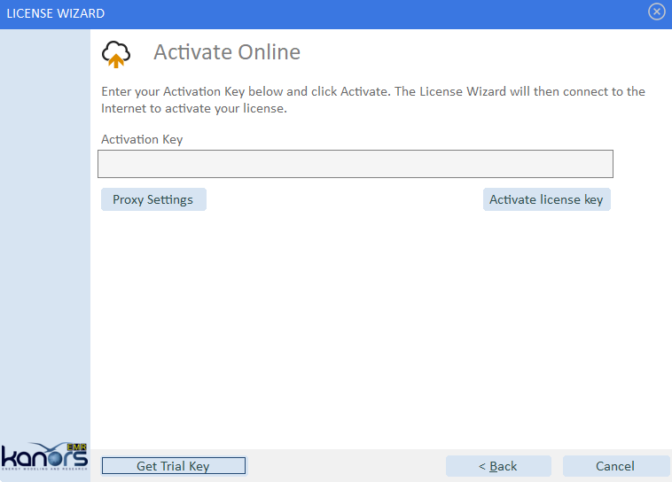
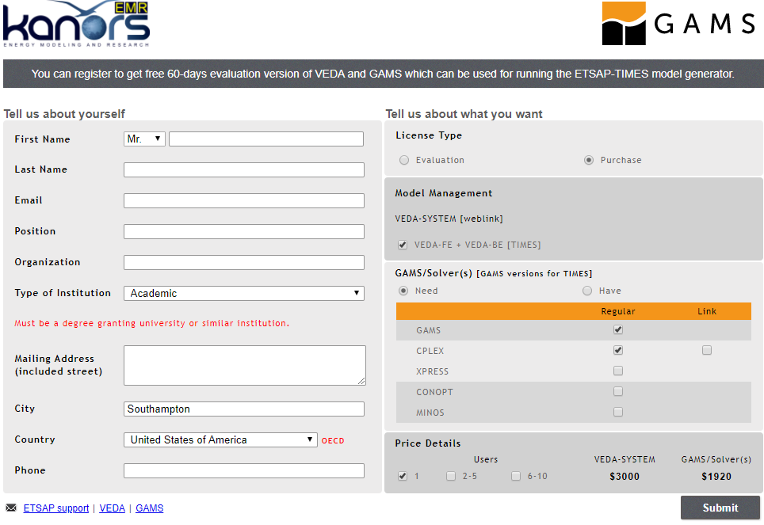
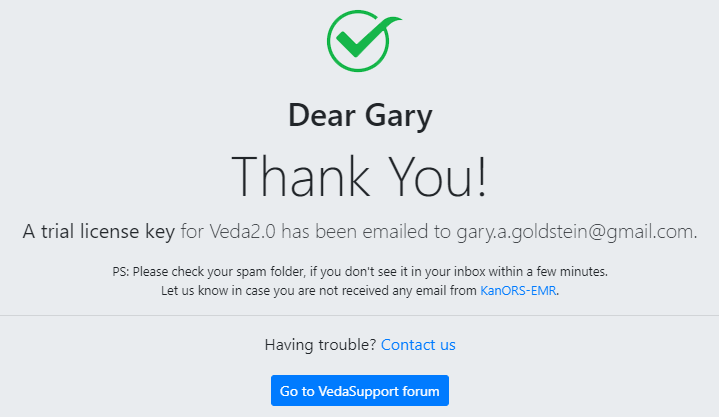
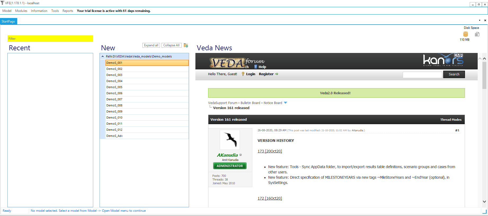
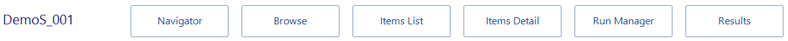

# Overview

This Part of the TIMES documentation provides an introduction to VEDA2.0 (Version 1.190.1.1), a flexible, user-friendly tool that oversees all aspects of the management and use TIMES energy system models, incorporating modules for handling the model input templates (data) and run results. The manual does so by presenting a step-by-step introduction to building a TIMES model using a series of twelve DemoS models (available for download from the [ETSAP website](https://iea-etsap.org/index.php/documentation) to progressively demonstrate VEDA-TIMES principles and modeling techniques. The remainder of Section 1 describes how to access and set up the TIMES DemoS models. Section 2 provides an orientation to the basic features of VEDA2.0, including software layout, commonly used data files and tables, and model management features. Section 3 then walks through the twelve DemoS models, providing for each a summary of the VEDA-TIMES features and model attributes introduced, a detailed guide to the templates and tables used, and a look at the model results.

## Downloading and Registering VEDA2.0

To download and install VEDA2.0 it is recommend that the new user first takes a look at the YouTube video on this topic noted in Section 2. Once downloaded, unzipped and starting VEDA2.0 the user is presented with an Activation screen where one proceeds by:

- Hitting **Get Trail Key**
- Completing the **Registration Form**
- Grabbing **the Trail Key** from your email,
- Paste it into the Activation form, and request **Activation** -- as seen below.

This will then bring you to the VEDA2.0 Start Page discussed in Section 2.

## Obtaining and Setting Up GAMS for TIMES

As part of registering VEDA2.0 a request is sent to the ETSAP Liaison Officer who will arrange for an evaluation GAMS license file to be created, sending it to the new user along with the download and install procedures here:

1. Copy the GAMSLICE someplace on your computer.
2. Head to <http://www.gams.com/download/> and select the Windows download option for either Win-64/32, as appropriate
3. Run Setup by clicking on it in Windows Explore

    a.  Check "**Use advanced installation mode**" at the bottom of the GAMS Setup form.

    b.  Let GAMS get installed into the default folder (\\GAMS\\\<Win#\>\\\<ver\>.

    c.  **Check the Add GAMS directory to PATH** environment variable.

    d.  Have the GAMSLICE.TXT copied from wherever it currently resides.

**You may need to restart your computer to have the GAMS Path activated.**

Once you have VEDA installed you can try a TIMES model run.

## Downloading and Setting Up the DemoS Models

The complete set of VEDA-TIMES DemoS models is available, along with all five Parts of the TIMES documentation, on the [ETSAP Documentation webpage](http://www.iea-etsap.org/index.php/documentation) under 'VEDA-TIMES Demo Models,' and is downloaded as part of the VEDA2.0 installation procedure. Thus you will also need VEDA2.0 installed in order to follow along with this manual. In addition, you'll need [GAMS](https://www.gams.com) (General Algebraic Modeling System) system in with the TIMES model generator is written. VEDA and GAMS evaluation licenses are available at [KanORS](https://www.kanors-emr.org/AcquiringTools.php).

To open the first DemoS from VEDA2.0 launch VEDA2.0. and from the StartPage select DemoS_001 from the list of available models, see Figure 1. The current model and version of VEDA2.0 is shown on the top row for the form.

Figure 1. StartPage Model Selection & News

Note that once a model has been selected the StartPage will have the Module buttons displayed at the top of the form, see Figure 3.

