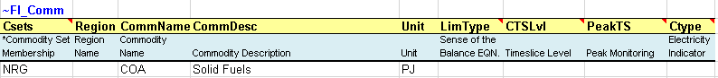
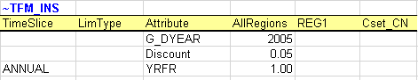
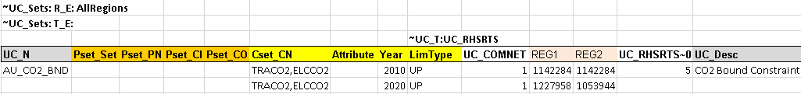
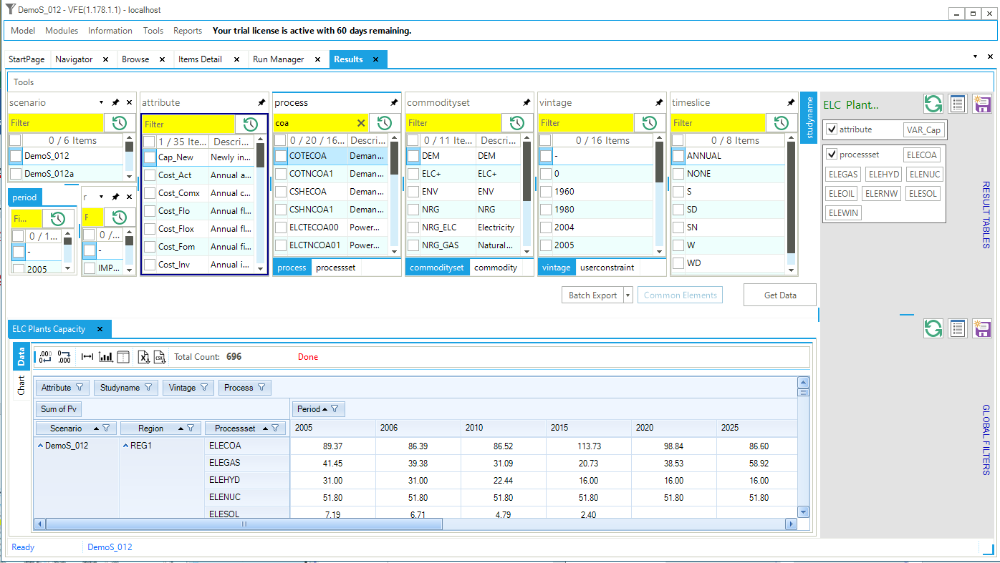

(p2-introduction-to-veda)=
# Introduction to VEDA2.0

This section provides a brief introduction to the VEDA Excel template workbooks for specifying and building a model, and using VEDA2.0 to access and manage the templates, browsing the data, viewing the underlying Reference Energy System (RES) network depicting the energy system, and running a TIMES model.

To assist with getting setup with and oriented to VEDA2.0 you may want to start by engaging with the short YouTube tutorials:

1. [Installation & Quick Tour](https://www.youtube.com/watch?v=OnYIDiftNgM&list=PLED97cPMXPOm60xOKSwvmXaGIsQrjoM8Y&index=1)
2. [VEDA2.0 Menu](https://www.youtube.com/watch?v=OnYIDiftNgM&list=PLED97cPMXPOm60xOKSwvmXaGIsQrjoM8Y&index=2)
3. [Navigator](https://www.youtube.com/watch?v=OnYIDiftNgM&list=PLED97cPMXPOm60xOKSwvmXaGIsQrjoM8Y&index=3)
4. [Browse](https://www.youtube.com/watch?v=OnYIDiftNgM&list=PLED97cPMXPOm60xOKSwvmXaGIsQrjoM8Y&index=4)
5. [Item Details](https://www.youtube.com/watch?v=OnYIDiftNgM&list=PLED97cPMXPOm60xOKSwvmXaGIsQrjoM8Y&index=5)
6. [Run Manager](https://www.youtube.com/watch?v=3EkFqLyl5ZE&list=PLED97cPMXPOm60xOKSwvmXaGIsQrjoM8Y&index=6)
7. Results *{now video yet}*
8. [ETSAP VEDA2.0 Tutorial Webinar (1.5hrs)](https://www.youtube.com/watch?v=OmDjlePsbsM&list=PLED97cPMXPOm60xOKSwvmXaGIsQrjoM8Y&index=10)

The main modules available in VEDA2.0, available from the StartPage, Modules menu, or \[Function Keys\] are:

- **Navigator \[F6\]:** to oversee the management of the Excel workbooks;
- **Browse \[F7\]:** to view all model data (based on filter and search facilities) in a dynamic data cube;
- **Items List** indicating all the process/commodities appearing in the model, as well as user constraints;
- **Items Details \[F8\]:** to view and cascade thru the RES (indicating any UCs the component is involved in), with process/commodity declaration information and cube data views;
- **Run Manager \[F9\]:** for composing and submitting model runs, and
- **Results \[F10\]:** for model results analysis.

These are described in Section {numref}`%s <p25-veda20-data-management>`, after a description of the VEDA2.0 template folder structure, file types, tables used to create model input and results module VEDA2.0 for analysis of model runs.

## Model Folder Organization

All VEDA-TIMES model input data is organized in Excel workbooks (or files). VEDA2.0 then integrates information from all of these workbooks into internal databases to facilitate management of the model data and to prepare and submit a TIMES model, generated and solved with the GAMS sub-system. The user templates underlying models managed by VEDA2.0 are normally stored in a specific folder (by default \\VEDA\\VEDA_Models). Within this folder, there is a sub-folder for each individual model a user is working with, including all of the VEDA-TIMES Demo Models ((\\VEDA\\VEDA_Models\\DemoS_001, \_002, etc.). The sub-folder structure is identical for each individual model (Figure 2, left side) and includes the kind of templates shown in the table below, as found with the DemoS_012 model.


Figure 2. Sub-folders Structure for each VEDA2.0 Model (showing the DemoS_012 files)

- The **B-Y Templates**, the **SysSettings** files, the **BY_Trans** file and **Sets**.
- A sub-folder (**SubRES_TMPL**) to store all SubRES files and associated transformation files.
- A sub-folder (**SuppXLS**) to store all scenario files, as well sub-folders for trade files (**Trades**) and demand files (**Demands**) (Figure 2, right side).
- Users are not concerned with the other sub-folders.

## VEDA2.0 StartPage

VEDA2.0 opens displaying the StartPage (), which enables the launch of any of the individual components of VEDA by double-clicking on the associate box. The components may also be launch from the Modules pulldown menu, as well as via function keys as noted above. The main components most often used are readily accessible via the StartPage:

- **Navigator:** oversee the management of the Excel workbooks;
- **Browse:** access model data via dynamic cube tables;
- **Items List:** list of all process, commodity, commodity groups and user constraint in a model;
- **Items Detail:** basic Reference Energy System network diagram view of commodity/process connectivity and associated data;
- **Run Manager:** to compose and submit model runs, and
- **RESULTS**: examination of model run results via tables and graphs.

The current model (DemoS_001) and version of VEDA2.0 are shown on the top line of the form.


Figure 3. Model StartPage

(p23-veda20-navigator)=
## VEDA2.0 Navigator and Types of Templates

The VEDA2.0 Navigator (Figure 4) provides a comprehensive view of all Templates In the various folders managed by VEDA2.0 for the current model. The form opens with the last model loaded. To bring in your first or another model hit the Add New button in the upper left of the Navigator form, which opens Windows Explorer -- move to the VEDA_Models sub-folder of interest and click on it to start the process. VEDA2.0 may ask if you want to open a New Window, where "Yes" will start another instance of VEDA2.0 and "No" will replace the currently viewed model with the one requested, which also happens if you reselect the current model folder. You may reopen previously opened models via , which will again ask if you want to open a new instance or replace the only currently open.

When first opening the Navigator for a particular model the form will be presented as seen below, with all the panel types displayed. If you want to recover empty real estate simply Unpin say the Parametric and No Seed Value panes showing in Figure 4, resulting in what one sees in Figure 5, where by grabbing the vertical tabs in the middle of a pane the window size has also been adjusted. Note that when Unpinned the pane header appears to the right so that when clicked on it returns to the visualization pane.


Figure 4. VEDA2.0 Navigator Layout

You may also switch the panes around, as done in Figure 5, where the Regular Scenario \[RS\] pane has been moved to the left of the Demand Scenario \[DS\] and Trade Scenario \[TS\] panes. This is accomplished by grabbing the pane at the top then using thepositioning tool to place the pane where you wish in the form. Note that when closing and reopening the Navigator (or VEDA2.0) the panes will appear as organized the last time.


Figure 5. VEDA2.0 Navigator -- Tailored View

The specific folder associated with the active model can be opened by clicking on the model name at the both of the VEDA2.0 form (in Figure 4, MODEL: C:\\VEDA\\VEDA_Models\\ DemoS_012) or the  icon in the Base Scenario quadrants. Said icon can be found in each of the panes of the Navigator and will similarly open Explore to the associated sub-folder of the current model. One may also make a new instance of any folder by hitting the New button next to the folder in each pane.

The VEDA-Navigator is the main vehicle for accessing, importing, and coordinating the various files that make up a model. Any template may be opened from the Navigator by double-clicking on its name, or in the case of SysSettings/BaseTrans using the  icon alongside the file name. The Navigator form is divided into sub-windows/panes/quadrants according to the various types of files managed by VEDA2.0:

- **Base Scenario \[BS\]**: templates used to set up the base-year (B-Y) structure of the model (existing commodities and current processes stock, and the base-year end-use demand levels), according to the energy flows reflect the overall energy balance. Thus the start year of the model can be calibrated to the energy balance according the B-Y Templates. The B-Y templates are named as VT\_\<workbook name\>\_\<sector\>\_\<Version\> (e.g. VT_REG_PRI_V1, as seen in ). The number of B-Y templates and their names depend on both the model structure (e.g., the number of regions and sectors) and the organisation of the input data (e.g., how many regions and sectors in each file). The B-Y templates are introduced in DemoS_001 (Section {numref}`%s <p31-demos001>`) and are modified throughout the evolution of the 12 DemoS steps.
  - **BY_Trans**: are transformation files used to update the information included in the B-Y templates (update existing values for existing attributes) and/or to insert new information (insert new attributes for existing processes) in the B-Y templates. They work like a scenario file (described below), but the rule-based filters and the update/insert changes apply only to those processes and commodities already existing in the B-Y templates. The BY_Trans file is introduced in DemoS_009 (Section {numref}`%s <p3912-by-trans>`).
- **SysSettings**: is used to declare the very basic structure of the model including regions, time slices, start year, etc. It also contains some settings for the synchronization process and can include some additional information. There is only one such file; it has a fixed name that stands for System Settings. The SysSettings file is described in Section {numref}`%s <p311-syssetting-syssetting>`.
- **SubRES \[SR\]**: SubRES files are used to introduce new commodities and processes in the RES that are not part of the B-Y templates. However, while the B-Y templates are region-specific, the SubRES are region independent. For each SubRES file there is a corresponding transformation (Trans) file allowing the introduction of region-specific process attributes, including the availability (or not) of processes in each region. To make changes to the SubRES_Trans-\_\<sector\> files use the Navigator to open the associated model subfolder and access the file via Window Explorer. The naming conventions are: SubRES\_\<name\> and SubRES\_\<name\>\_Trans. SubRES files are introduced in DemoS_006 (Section {numref}`%s <p363-subres-newtechs>`).
- **Regular Scenario \[RS}**: Scenario files are used to update existing information and/or to insert new information in any part of the RES, including B-Y templates, SubRES files, and Trade files (see below). They are also used to include any additional user constraints in the model. The naming convention is: Scen\_\<scenario name\>. These files can only manipulate (insert or update) information associated with previously declared RES components. New commodities and processes may not be added via Scenario files, only new attributes. Scenario files are introduced in DemoS_004 (Section {numref}`%s <p341-scenario-files>`). Several different applications of scenario files are illustrated through the remainder of the DemoS.
- **Demand Scenario \[DS\]**: Demand Templates Include all the information necessary to project end-use demands for energy services in each region, such as macroeconomic drivers and sensitivity series. Multiple demand files may be used, to model different demand growth scenarios for instance. The naming convention is: ScenDem\_\<scenario name\>. This section of the Navigator also contains a single file permitting assignment of a demand driver as well as a sensitivity (or elasticity) series each end-use demand to its driver in each region: Dem_Alloc+Series. Demand files and tables are described in DemoS_010 (Section {numref}`%s <p3101-demand-files>`).
- **Trade Scenario \[TS\]**. This section of the Navigator contains a file in which all unilateral and/or bilateral trade links between regions are declared: ScenTrade\_\_Trade_Links, and associate data provided when appropriate. The latter contains all of the attribute specifications for the trade processes. Multiple trade files may be used, to model different trade scenarios or for different commodities. The naming convention is: ScenTrade\_\<scenario name\>. Trade files are introduced in DemoS_005 (Section {numref}`%s <p353-trade-files>`).

For more advanced modelling there are also control panels for the Parametrisation facilities of VEDA2.0, and well as for more complex model input setups a couple of ways to look at inter-decencies between templates -- though these are beyond the scope of the basic DemoS models.

As shown in Figure 4, the Navigator provides feedback as to the status of the various files and the integrated database managed by VEDA2.0. The consistency of the files and database is immediately evident based upon whether any of the template files are highlighted in orange (to ToImport) or red (Inconsistent). The status of individual templates is indicated by their colors in the template lists, according to the legend at the bottom of the form. A file is shown as Inconsistent when it has a newer date/time stamp than in the database. [Note]{.underline}: you may need to do a refresh via  to update the current status of the files after a recent change(s).

Hitting  will import all Templates In the application folder marked as inconsistent. You may force synchronization of other files by checking the checkbox next to their names before hitting . The synchronize operation and resulting log is discussed in Section {numref}`%s <p251-navigator>`. When opening the DemoS_001 model the single model input template (PRE_PRI_V01) will be tagged as ToImport.

## VEDA2.0 Templates Tables

The VEDA2.0 synchronize operation reads each sheet in each file to be imported in sequence, looking for VEDA2.0 tables to be processed. All VEDA2.0 tables are identified by table tags, discussed below, and triggered by the special character tilde (\"**\~**\"). VEDA2.0 tables must be separated from each other and the rest of the information on a worksheet by blank rows and columns. Rows and columns starting with the character \"**\***\" or with "\\I:", which stands for \"ignore\", are not read.

The most common types of tables are briefly described in this section. More information on how to use them for specific cases is shown in the sections associated with each step of the DemoS. The initial examples in this section come out of the DemoS_001 model, unless otherwise noted. The VEDA2.0 Information/VEDA Tags feature, shown in Figure 6, provides a summary of what is required for each "\~"tag VEDA handles.


Figure 6. VEDA Tags Overview

### Basic tables needed for any model

The following tables are needed in any VEDA-TIMES model.

- Tables that exist only in the SysSetting file (Section {numref}`%s <p311-syssetting-templete>` describes how to use these tables):

**\~BookRegions_Map:** declare the workbook name and the list of region names;

**\~TimeSlices:** declare the time-slice resolution for the model;

**\~DefaultYear**: used to control the default year of the first period. It defaults to the start year;

**\~StartYear:** declare the start year of the model;

**\~ActivePDef:** declare the set of active periods;

**\~TimePeriods:** declare the time horizon of the model for the ActivePdef;

**\~Currencies:** define a default currency for the whole model, and

**\~DefUnits:** define default units by activity, capacity, and commodity for each sector in the model.

- **Commodity Definition Tables** **(\~FI_COMM):** commodity declaration and definition; may only appear in B-Y, SubRES and SysSetting files (described further in Section {numref}`%s <p242-commodity-definition-tables>`).
- **Process Definition Tables** **(\~FI_PROCESS):** process declaration and definition; may only appear in B-Y, SubRES and SysSetting files (described further in Section {numref}`%s <p243-process-definition-tables>`).
- **Flexible** **Input Tables** **(\~FI_T)** for topology and parameter definition; used in BY and SubRES files (described further in Section {numref}`%s <p244-flexible-import-tables>`).

(p242-commodity-definition-tables)=
### Commodity definition tables \~FI_COMM

Commodity definition tables (\~FI_Comm) are used to declare the non-numerical characteristics of commodities. The columns headers are described in the table below and their order can be changed. Each commodity needs to be declared (only) once in such a table as shown in Figure 7. They are supported in B-Y Templates, SubRES files, and the SysSettings template.. Care must be taken that commodities are declared only once, as problems can arise if the same commodity is declared twice with conflicting attributes, such as different time slice levels. In large complex models, therefore, a best practice would be to declare them in a single template location only, such as the SysSettings template.



Figure 7. How to Use \~FI_COMM

The valid column headers for a commodity table \~FI_COMM are described in {numref}`commodity-table-column-headers` (with reference to Figure 7).

```{list-table}  Valid Column Headers for a Commodity Table \~FI_COMM.
:name: commodity-table-column-headers
:header-rows: 1

* - Header
  - Description
* - Csets\*
  - The sets to which commodities belong. Valid entries are: NRG (energy), MAT (material), DEM (demand service), ENV (emissions) and FIN (financial). These declarations are inherited until the next one is encountered. In this example, COA (Solid Fuels) is an energy commodity (NRG).
* - Region\*
  - The region name. By default, it is applied to all regions of the model when not specified. The region designation is used only in the B-Y templates and not allowed in SubRES.
* - CommName
  - The commodity name (COA).
* - CommDesc
  - The commodity description (Solid Fuels).
* - Unit
  - The commodity unit throughout the model (PJ). It is responsibility of the user to be consistent with units.
* - LimType
  - The sense of the balance equation for the commodity. Valid entries are LO (Production\>=Consumption, FX (Production=Consumption), UP (Production\<=Consumption). When not specified, the default is LO for all but MAT commodities with a default of FX.
* - CTSLvl
  - The commodity time-slice tracking level. Valid entries are ANNUAL, SEASON, WEEKLY and DAYNITE. When not specified, the default is ANNUAL.
* - PeakTS\*
  - Peak time slice monitoring. Valid entries are: ANNUAL to generate the peaking equation for all time slices or any specific time slices already defined in the SysSettings file (comma-separated entries allowed). If not specified the default is ANNUAL.
* - CType
  - Electricity and heat commodities indicator (ELC, HTHEAT and LTHEAT)
```

> \* Note: Comma separated elements are allowed.

(p243-process-definition-tables)=
### Process definition tables \~FI_PROCESS

Process definition tables (\~FI_Process) are used to declare the non-numerical characteristics of processes. The columns headers are described in the table below and their order can be changed. Each process needs to be declared (only) once in such a table as shown in Figure 8. They are supported in B-Y Templates and SubRES files.


Figure 8. How to use \~FI_PROCESS

The valid column headers for a process table \~FI_PROCESS are described in {numref}`process-table-column-headers` (with reference to Figure 8.

```{list-table} Valid Column Headers for a Process Table \~FI_Process.
:name: process-table-column-headers
:header-rows: 1

* - Header
  - Description
* - Sets\*
  - Sets to which processes belong, indicating the nature of a process. Valid entries are: ELE (thermal or other power plant), CHP (combined heat and power), PRE (generic process), DMD (demand device), IMP (import process), EXP (export process), MIN (mining process), HPL (heating plant), IPS for inter-period storage, NST for night storage device, STG for general timeslice storage, STS for simultaneous DayNite/Weekly/Seasonal, STK for simultaneous DayNite/Weekly/Seasonal and inter-period storage process. These declarations are inherited until the next one is encountered. In this example, there are three mining processes (MINCOA\*), one import process (IMPCOA1) and one export process (EXPCOA1), all related to the supply of solid fuels (COA).
* - Region
  - The region name where the process exists (comma-separated entries allowed). By default, it is applied to all regions of the model when not specified. The region designation is used only in the B-Y templates and not allowed in SubRES. \[Note that regional data for SubRES processes can be provided in the SubREs\_\<sector\>\_Trans file.\]
* - TechName
  - The process name (e.g. MINCOA1), up to 32 characters. (However, it is recommended to limit process names to 27 characters as VEDA2.0 may internally add digits for vintaging issues or dummy imports.)
* - ProcessDesc
  - The process description (e.g., Domestic supply of Solid Fuels Step 1), up to 255 characters.
* - Tact
  - The activity unit of the process (in Figure 8, for example, it is in PJ). It is the user's responsibility to be consistent with units.
* - Tcap
  - The capacity unit of the process. It is the user's responsibility to be consistent with units.
* - Tslvl
  - The process time-slice operational level. Valid entries are ANNUAL, SEASON, WEEKLY and DAYNITE. When not specified, the default is based on the Sets declaration: DAYNITE (for ELE, STGTSS, and STGIPS), SEASON (for CHP and HPL), ANNUAL (for all others).
* - PrimaryCG
  - The Primary Commodity Group (PCG) of the process. Normally none specified as VEDA allocates the PCG by default. A declaration is needed only when the user wants to create a new PCG and/or override the default PCG.
* - Vintage
  - Vintage tracking. Valid entries are YES or NO. When not specified, the default is NO.
```

> \* Note: Comma separated elements are allowed.

(p244-flexible-import-tables)=
### Flexible import tables \~FI_T

The Flexible Import Table **(\~FI_T**) is the main workhorse used to create model topology (process inputs and outputs) in B-Y templates and SubRES, provides a very flexible structure (hence the name) for specifying parameters and their numerical values. With this identifier the information is imported as provided, and not modified during the import process.

Unlike in most other table types (with the exception of UC tables, described in Section {numref}`%s <p247-user-constraint-and-their-tables>`), the \~FI_T table tag is not placed directly above the upper-leftmost table cell. Instead it is placed in the row immediately above the table headers and in the column before the first column containing values. This placement allows any number of columns to be designated for row identifiers, rather than data, as shown in Figure 9 and defined in {numref}`flexible-import-tables-column-headers`.


Figure 9. How to Use the \~FI_T Table

Indexes for the data, including attribute, region, year, and timeslice may be specified as either row identifiers or column headers, so that a table may be laid out to match the configuration of source data with minimal user intervention.

The \~FI_T table has six distinct regions. Valid entries in each of these are listed below.

- **Row ID Col Headers**. The valid row ID column headers for a \~FI_T flexible import table are described in {numref}`flexible-import-tables-column-headers`.

```{list-table} Valid Row ID Column Headers for Flexible Import \~FI_T Table.
:name: flexible-import-tables-column-headers
:header-rows: 1

* - Header
  - Description
* - Region\*
  - Region declaration
* - TechName
  - Technology Name
* - Comm-IN\*
  - Input Commodity
* - Comm-IN-A\*
  - Auxiliary Input Commodity
* - Comm-OUT\*
  - Output Commodity
* - Comm-OUT-A\*
  - Auxiliary Output Commodity
* - Attribute
  - Attribute declaration; single entries permitted
* - Year
  - Year declaration; comma-separated entries allowed
* - TimeSlice\*
  - Time slices declaration; comma-separated entries allowed
* - LimType
  - Valid entries are: UP (Upper), LO (Lower), FX (Fixed) and N (Non-binding)
* - CommGrp
  - User Defined Commodity Group
* - Curr
  - Currency declaration
* - Stage
  - Decision point (for multi-stage Stochastic models)
* - SOW
  - State of the World (for Stochastic models)
* - Other_Indexes
  - To enter special dimensions that are required in certain attributes (see an example at https://github.com/kanors-emr/Model_Demo_Adv_Veda.git)
```

\* Note: Comma separated elements are allowed.

- **Row Identifiers**: elements of the dimension indicated in the row ID column headers.
- **Data Area Column Headers**: Elements of the following dimensions (elements of multiple dimensions can be separated by \~):
  - Attribute
  - Year
  - TimeSlice
  - LimType
  - Commodity
  - CommGrp (only the internal VEDA commodity groups: DEMO/DEMI/NRGO/ NRGI/MATO/MATI/ENVO/ENVI/FINO/FINI can be used as column headers)
  - Region
  - Currency
- **Data**: numerical entries.
- **Table level declarations**: Declarations like those made in column headers can be included in the table header (following a colon) and will apply to all data that doesn't have a different value for that index specified. For example, \~FI_T: DEMAND would assign DEMAND as the attribute for all values in the table that don't have an attribute specification at the column or row level.
- **Comments**: a comment row is identified by the character \" **\*** \" or "\\I:" as the first character in any of the cells below the Row ID Col Headers or the first character in any of the column headers. (However, caution should be exercised in using \" **\*** \" to indicate a comment, because it may also be used to indicate a wildcard or an operation in some cells. "\\I:" is the safer choice to indicate a comment row/column.)

### Transformation Insert and Update tables

> **Transformation Insert Tables (\~TFM_INS)** are used to define absolute values via additional parameters that were not defined in the base year or SubRES templates in a rule-based manner. In this example from DemoS_001, it is used to declare three new attributes (G_DYEAR, Discount, and YRFR) by row as shown in .



Figure 10. Example of \~TFM_INS Insert Table

**Transformation Update Tables (\~TFM_UPD)** are used to update pre-existing data in a rule-based manner. For example, in Figure 11 it sets default prices (ACTCOST) for the backstop dummy processes for energy commodities (IMP\*Z - dummy IMPort processes ending with "Z") and demands (IMPDEMZ - a dummy IMPDEMZ process that can feed any demand). Note that the process and attribute **MUST** already have been specified for the qualifying process. Though not shown in the example below the data specification field may also contain operators (+, \*, -, /) there the resulting value is applied to the existing value for the qualifying processes.


Figure 11. Example of \~TFM_UPD Update Table

**Transformation Direct Insert Tables** **(\~TFM_DINS)** are also used to insert data, but unlike in Insert tables, it is forbidden to define subsets of technologies using text/wildcards, and for each attribute all the required dimensions must be defined (no defaults). These tables can be useful when working with large, detailed source data tables, because VEDA2.0's processing of DINS tables is much faster than that of Insert tables.

Transformation tables may be used only in scenario and transformation files. Valid column headers for data entry in transformation insert and update tables are presented in the top portion of {numref}`transformation-tables-column-headers`. These tables can identify the items whose data is to updated or inserted using the criteria in the bottom portion of {numref}`transformation-tables-column-headers`.

```{list-table} Valid Column Headers for Transformation Tables
:name: transformation-tables-column-headers
:header-rows: 1

* - Header
  - Description
* - 
  - **Insert or update values**
* - Attribute
  - Name of the attribute
* - Year<sup>*</sup>
  - Year declaration; default value = start year
* - TimeSlice<sup>*</sup>
  - Time slices declaration; default=ANNUAL.
* - LimType
  - Valid entries are: UP (Upper), LO (Lower), FX (Fixed) and N (Non-binding)
* - CommGrp
  - User defined Commodity Group
* - Curr
  - Currency declaration; default=CUR
* - Stage
  - Decision point (for multi-stage Stochastic models)
* - SOW
  - State of the World for Stochastic models)
* - Other_Indexes
  - To enter special dimensions that are required in certain attributes
* - AllRegions
  - Data value that is applicable to all regions
* - \<Regions\>
  - Region-specific data values; these will supersede any declaration in AllRegions column
* - 
  - **Commodity and process filtering**
* - PSet_Set<sup>1</sup>
  - Identifies qualifying processes based on TIMES or user-defined set membership
* - PSet_PN<sup>2</sup>
  - Identifies qualifying processes based on names
* - PSet_PD<sup>2</sup>
  - Identifies qualifying processes based on descriptions
* - PSet_CI<sup>2</sup>
  - Identifies qualifying processes based on commodity inputs
* - PSet_CO<sup>2</sup>
  - Identifies qualifying processes based on commodity outputs
* - CSet_Set<sup>1</sup>
  - Identifies qualifying commodities based on TIMES set membership
* - CSet_CN<sup>2</sup>
  - Identifies qualifying commodities based on names
* - CSet_CD<sup>2</sup>
  - Identifies qualifying commodities based on descriptions
* - Top_Check
  - To restrict application of attribute data to those process-commodity combinations where the specified topology already exists in the model, rather than creating new topology. Valid entries: **I/O/A. "I"** will retain those combinations where commodities are input to processes. **"O"** =\> Output. No topology check is performed by default.
* - Attrib_Cond
  - To filter based upon whether an attribute is present or missing (precede with "-") for potentially qualifying processes.
* - Val_Cond
  - Used in conjunction with Attrib_Cond to filter on the value of the specified attribute. Define using \'\<\', \'\>\', '\<\>', or \'=\'. The condition will be tested across all dimensions (for example, years) for the specified process, region, and attribute.
```

><sup>*</sup> Comma separated entries permitted.
>
><sup>1</sup> Comma separated elements are allowed. Each of these fields can have comma-separated entries that are joined by OR.
>
><sup>2</sup> Comma separated elements and wild cards characters are allowed. The possible wild cards are:
>
> "\*" is used as wild card; for example \*GAS\* would refer to all elements that have GAS in the name with any possible characters before and after GAS.
> 
> "-" before the text used for exclusions; for example, \*GAS\*,-ELCGAS would refer to all elements that have GAS in the name except for ELCGAS.
> 
> "?" can be used to specify a single character; for example, ???GAS means there are 3 characters before GAS.

(p246-advanced-tables)=
### Advanced tables

The following tables are special and/or advanced tables that can be used in different types of templates to support model building.

- Special tags exist for emission commodity tables. With this table identifier the data are manipulated during the import process to provide for special calculations on emissions factors.

**\~COMEMI** to link emissions to commodity consumption. An example on how to use this table is shown in Section {numref}`%s <p3727-emi>`.

**\~COMAGG** to define an aggregated commodity such as TOTCO2 accumulating the emissions from each \<sector\>CO2 commodity.

- Fill tables in scenario files **(\~TFM_FILL**) allow extraction of values from the rest of the model database for use in Update or Insert tables. An example is shown in Section {numref}`%s <p3741-scen-demproj>`.
  - TFM_FILL table is also available in SubRES transformation file, though note that it can only be populated with numbers from the BASE scenario.
  - The fill operation will color the Region cells upon processing to indicate the number of records found, as follow:
    - Blue color represents only one record found, and
    - Purple color represents that more than one record was found for the specified parameter and its dimensions while filling the region value in the relevant row.

The user can specify whether multiple values are to be summed, averaged, or counted.

- Tags exist for transformation tables indicating that the import operation is different than for the standard input tables \~FI_T. With this type of table identifier the data are manipulated during the import process and not imported as provided. They are supported in the BY_Trans file, SubRES files, and all scenario files.

**\~TFM_AVA** to declare the availability of processes in different regions.

- Special tables that exist only in the Demand module:

**\~DRVR_Allocation** to allocate a driver to each end-use demands;

**\~Series** to define sensitivity and calibration series, and

**\~DRVR_Table** to define demand driver indexes (base-year =1).

- Special tables that exist only in the Trade module: **\~TradeLinks** to declare uni- or bilateral trade links between regions.
- User constraints are identified with specific identifiers **\~UC_Sets.**

(p247-user-constraint-and-their-tables)=
### User constraints and their tables

User constraints provide the modeller with a flexible framework to add case-study specific constraints to the standard equation set embodied in TIMES model generator. With the help of user constraints, virtually any possible linear relationship between core components of the RES (as represented by variables in TIMES) can be formulated, and some input attributes can also be brought in as coefficients. User constraints can also be written to link variables across consecutive time slices or periods. Section {numref}`%s <p64-user-constraints>` of Part II of the TIMES documentation contains an extensive discussion of the user constraint types available and their mathematics.

Defining user constraints in VEDA2.0 templates is a two-step process. They are first declared with one or more **\~UC_SETS:** tags, which indicate their type and domain of coverage. Then their data is specified using a table with similar structure to that of a **\~FI_T** table, as shown in Figure 12. This example puts an upper limit on the CO2 arising from the Transportation plus Power sectors of the model from 2010 on, interpolation between 2010-2020 and the extending constant for the remainder of the modelling horizon (owing to interpolation rule (5) specified in the UC_RHSRTS\~0 column).



Figure 12. Defining a User Constraint in VEDA2.0

Available UC sets are described in {numref}`uc-sets-in-veda2`. Each set definition holds for the entire sheet, unless redefined. All the existing set definitions are applied to all user constraints in a table.

```{list-table} UC sets available in VEDA2.0.
:name: uc-sets-in-veda2
:header-rows: 1

* - \~UC_SETS:
  - Signification
  - Application
* - R_E
  - Region_Each
  - REG1: apply to one particular region 
  <br>REG1,REG2: apply to more than one region (comma separated)
  <br>AllRegions: will apply to all regions
* - R_S
  - Region_Sum
  - (same as above)
* - T_E
  - Time period_Each
  - 
* - T_S
  - Time period_Sum
  - 
* - TS_E
  - Time slice_Each
  - 
* - TS_S
  - Time slice_Sum
  - 
* - T_SUC
  - Time period successive
  - 
```

A UC table is then structured similarly to a Flexible Import table, with the **\~UC_T** tag separating the column headings into row identifiers (UC_INDEXES) and data column headers. Valid row ID (UC_INDEX) column headers are listed in {numref}`indexes-for-uc-tables`.

```{list-table} UC_INDEXES for user constraint tables.
:name: indexes-for-uc-tables
:header-rows: 1

* - Column Header
  - Description
* - UC_N
  - Short Name of the UC
* - Region
  - Name of the region(s)
* - PSet_PN\*
  - Process names
* - PSet_PD\*
  - Process description
* - Pset_CI\*
  - Input commodities to define a set of processes
* - Pset_CO\*
  - Output commodities to define a set of processes
* - Cset_CN\*
  - Commodity names
* - Cset_CD\*
  - Commodity description
* - Side
  - LHS/RHS; RHS is applicable only in the case of dynamic (across periods) constraints.
* - Attribute
  - Any of the UC attributes available in the current TIMES code (refer to Part II of the TIMES system documentation).
* - UC_ATTR
  - <div><ul><li>Allows modifiers to be applied to the variables used in the UC. These include the GROWTH modifier, to create a constraint that limits the percentage growth in a variable over periods; modifiers to pull input data, such as COST and EFF, into the UC's coefficients; and the NEWFLO modifier that applies the UC coefficient to the flows of the new vintage of a process only. More details are found in Section {numref}`%s <p646-user-constraints-modifiers>` of Part II.</li> <li>The contents of this column are comma separated values of UC_Name and UC_GrpType. Several pairs can be separated by ";".</li><br><li>A pair can have UC_Name/GrpType in any order; any element in the list ACT, CAP, NCAP, FLO, IRE, COMCON, COMPRD, COMNET is taken as GrpType and the other one is designated as the UC_Name. Valid UC_Names are provided and described in Section 6.4.6 of Part II.</li><br><li>UC_ATTR can have a \~ appended to it; the default is LHS</li></ul></div>
* - Year
  - Years, comma separated list allowed
* - LimType
  - UP/LO/FX/N
* - Top_Check
  - To control the process-commodity combinations via topology when both indexes exist for the attribute in question. Valid entries: I/O/A. "I" will retain those combinations where commodities are input to processes. "O" =\> Output; . Default = either input or output.
```

> \* Wild cards allowed, comma separated list permitted

Valid data column headers are:

- Any of the UC attributes available in the current TIMES code;
- Years (including 0 for interpolation setting);
- Region;
- UP/LO, and
- LHS/RHS.

Multiple values can be separated by "\~". Any specification without a region identifier in the column is applied to the region in the row identifier area. If there is no region, it applies to all regions in the active R_E/R_S specification.

A user constraint definition can span multiple rows of the table (to attach numbers/attributes and other indexes to different sets of processes/commodities).

## VEDA2.0 Data Management, Model Visualization and Run Submission Tools

Once the templates have been imported and assembled as a model database within VEDA2.0 by means of the Navigator (Figure 5) and a Synchronize done, one can review the resulting data by means of powerful visualization tools and dynamic data cubes (pivot tables), as well as to view the RES by requesting that the network diagram be displayed. As is the case in the earlier sections screenshot below are taken for the DemoS_012 model.

More information on VEDA2.0 and description of additional features are available at <http://support.kanors-emr.org/> \[note: at the time of writing the website described original VEDA-FE and VEDA-BE.\] Each of the remaining main sections of this document describes one incremental step of the VEDA-TIMES Demo Models.

(p251-navigator)=
### Navigator

The Navigator was introduced in Section {numref}`%s <p23-veda20-navigator>`. Here we expand to further explain the important role the Navigator plays below.

- Enables easy access to any of the Excel templates constituting the currently open model.
- Double-clicking directly on any file name (or click the Excel icon next to it, in the case of the *BY_Trans* and *SysSettings* files) will open that file in Excel.
- Clicking on the folder button above each section of the Navigator will open the associated folder in Windows Explorer.
- Provides feedback as to the status of the various files and the integrated database managed by VEDA-FE according to colour legend at the bottom of form:


- Not imported -- not yet brought into VEDA-FE
- Imported -- selected for importing with next SYNC
- Consistent -- template and database aligned
- InConsistent -- template date stamp more recent that last import
- ToRemove -- missing template imported previously now flagged for removal from the database
- FileMissing -- previously imported template no longer found
- FileOpen -- a template currently open, so can not be processed/imported
- Error -- if a file error happens
- The SYNCHRONIZE button will process all templates in the application folder marked as ToImport (orange)

To ensure that VEDA2.0 is working in the model directory intended the user is encouraged to access templates via the Navigator by opening the Explore Folder via  or directly by double-clicking on the file name.

### Browse

The database Browser can be accessed from the StartPage, or Modules menu or by pressing **F7**. The Browse pane is split with the upper half where the user specifies the criteria to be applied to the data, and the lower part the resulting qualifying information. The Browser thereby enables the user to view subsets of the assembled data in a cube by selecting the scenario(s), region(s), process(es), commodity(ies), and/or the attribute(s) of interest; the new nuclear power plants (ELCNNNUC01) in REG1 in the example shown in Figure 13. It also facilitates direct access to the data in the templates by double-clicking on a cell.


Figure 13. Browser for the model database

First, elements are selected manually, limited to those belonging to a particular Set via the pulldown menu above the Process/Commodity or via the search box at the top of each column. For the items then selected the information is displayed in a default layout, or last layout used. As was mentioned earlier, in Section {numref}`%s <p23-veda20-navigator>`, the Browse pane may be rearranged as desired. It is possible to rearrange the layout of the cube by adding/removing dimensions (columns and rows) to/from the table by dragging/dropping components from/to the area above the current row designator columns, where above unwanted indexes are dragged up to (outside of the cube) and the columns reordered (by putting the cursor on the column header and holding the left mouse button down) to present a clean look at the process information.

Any dimension not positioned as part of the row/column table layout definition appears at the top of the page. These dimensions have their values summed in the cube. Note that for any dimension where only a single value exists, said dimension is automatically moved up top. Using the  associated with each header, individual entries may temporarily be removed by unselecting them from the list of elements.

### Item List

The Items List provides a look at all the data assembled from Templates Into the VEDA2.0 database by component type: Process, Commodity, Commodity Group, User Constraint, indicating the scenario, region, sector, Set membership, Item Name, Description, Units, Primary Commodity Group (PCG, indicating whether a process is input or output normalized), time-slice level, and whether a process is vintage or now, as seen in Figure 14 for the Electric Power Processes in the DemoS_0012 model (by applying the Set Filter = ELE).


Figure 14. Process Items List

(p253-item-details)=
### Item Details (RES viewer)

The Items Details form may be accessed from the StartPage, or Modules menu or by pressing **F8**. When first entering the form an item much be selected (by double-click) for the associated list (Process, Commodity, User Constraints (UC), Commodity Groups (CommGrp)) presented to the left. It is possible to navigate around the model by clicking on the name of a commodity or process, allowing the user to see: 1) in the case of a commodity, all processes producing and consuming that commodity; and/or 2) in the case of a process, all input and output flows. The upper right panel of Figure 15 shows the RES viewer as zoomed in on process ELCNUCCC01. We see the process consumes nuclear fuel (ELCNUC) and produces electricity (ELC). The area in the top left panel provide the process (or commodity) declaration information. By clicking on any item, the user can cascade through the RES to better visualize the interrelationships and competing processes throughout the network, as shown in Figure 16 after clicking on ELC. A Browse window with the data associated with the focus component is presented below the RES, and may be rearranged by means of drag-and-drop, as was discussed earlier.


Figure 15. Master Schematic Representation of the RES -- Process View


Figure 16. Master Schematic Representation of the RES -- Commodity View

The User Constraint (UC) view allows you to see components of the individual user constraints, as shown in for the cross-region (global) CO<sub>2</sub> limit constraint.

There is also a facility for examining the Commodity Groups, not shown here as DemoS only employs the standard single commodity input/output groups created by VEDA2.0.


Figure 17. Master Schematic Representation of User Constraints

(p255-run-manager)=
### Run Manager

The Run Manager, available from the **StartPage**, **Module** menu, or by pressing **F9**, is used to compose and submit a model run or set of runs.

Figure 18 illustrates the main components of the Run Manager.


Figure 18. Run Manager

There are 5 basic sections to the Run Manager, along with an additional form to compose a Case once the specification is complete, as discussed here:

1. **Scenario Group Designation**: check BASE/SysSettings and the list of scenario to be included in a "cluster" that is then given a name for inclusion later in a Case Definition for a model run;
2. **Settings**: to designate where the GAMS and TIMES files reside, in what folder the model is to be run, the Maximum number of runs that are to be submitted in parallel, the Solver to be used and the Solver Options file to be employed;
3. **Regions:** designation of the regions to be included in the Group definition;
4. **Properties:** which GAMS switches are to be employed for the run, and
5. **Cases:** list of Cases prepared identifying the Run name/Description, Scenario Group, list of regions, the Property specification to be used, period definition and ending year, and date information.

The key mechanism for defining a Case is shown in Figure 19, which is presented in response to hitting the New Case button under Manage Saved Cases, or double-click on a case in the list to bring up that designation to edit or make to copy as a starting point for a new (similar) Case definition. As can be seen the only new user input on the form is the Case Name and Description, all other aspects of the run specification embodies in the Case must already be defined and are thereby available from the associated pulldown menus. Thus one creates a new case Create a New Case by providing the core information for the case definition (or start from an existing Case):

- Case Name - case run name;
- Description - run description;
- Scenario Groups - scenarios to be included in this run;
- Region Groups - regions to be included in this run;
- Parametric Groups - driver scenario for a suite of runs;
- Properties Groups - what GAMS options/switch are to be employed;
- Periods Definition - what periods is the model be run for;
- Ending Year - what is the last period for the run;
- Source TIMES - where does the TIMES code reside;
- Solver - which solver is to be used;
- Solver Options - which solver options to use, and
- GDX References - gdx to be used, if appropriate

Double-clicking on a existing Case opens its Definition form. It can then be copied or modified and resaved as desired.

> 

Figure 19. Case Designation Form

Once a case has been fully specified a model run can be submitted by selecting the Case(s) desired and hitting the  button. This results in VEDA extrating the data from the intermal database and placing the data dictionary (DD) files that contain the input for the TIMES GAMS model generator into the designated work/run folder (the Log below). Once extracted a Command Window opens, along the lines below, echoing the GAMS exectution steps and solver actions, as seen below. \[A series of other VEDA work windows may open / close along the way as well.\] As many jobs will be submitted in parallel as set on the RunManager Settings panel.

{


Figure 20. Model Run

### Results

Upon completion of a run the results are brought into the VEDA2.0 Results component, opened from the StartPage, Modules menu or by pressing \[F10\]. The Results component is used to analyze TIMES model results. Note that Results are all stored in the VEDA2.0 system database. Therefore it is not possible to share results across users/computers, expect by running the model or importing vd\* files on the other computer.

The core facilities of the Results component of VEDA2.0 are:

- **Model VD files**: model results (VD files) are included automatically in the model database at the end of a successful run (e.g. \\Veda\\GAMS_WrkTIMES\\DemoS_012);
- **Importing VD files from other models**: to import model results from other models;
- **Results browsing**: to view (and refresh) model results through dynamic pivot tables (cubes);
- **Table definition**: user defined tables for a specific model (\<model folder\>/AppData/ResultsView.json), and
- **Batch export**: to export results in Excel and CSV.

An overview of the in Results component is shown in 

Figure 21. Note that users of original VEDA can migrate their Sets and Tables (SnT) definitions by means of the *Veda_SnT to Excel migration* utility found in the VEDA\\VEDA (new) root folder, and just requires the user identify to original SnT and VEDA2.0 model folder. See Appendix A and B for the TIMES Results attributes and VD\* files .


Figure 21. Components of the VEDA2.0 Result Facility

The Results component greatly facilitates digging to model results, across scenarios, by means of powerful filtering, creation of table views of the data, presentation of the information in dynamic cube (pivot) tables, enabling quick graphing of results, and exporting the cube to Excel or CSV files. The layout of the basic Results form can be tailored as desired, and said layout will be employed, until reset via the Tools/User Options/Layout Settings facility is invoked to reset the layout. But the real power of the Results module stems for repopulating predefined tables that organize the model results into logical tables for analyzing aspects of the solution results.

There are three main filtering mechanisms available to the user, shown in the initial layout of the Resutls form in Figure 22. The columns identify the indexes corresponding to the dimensions of the various TIMES results attributes.


Figure 22. Results Form Components

Data can be retrieved by checking individual Items in their lists, perhaps limited by a filter criteria (with wild cards) typed into your yellow fields, and via the list of predefined tables. What is then retrieved is then further controlled by where a Global Filter is active. Note that the table definition is displayed in the upper right quadrant once the table is retrieved, as seen in Figure 23 for power plant capacity. Once the table is presented it can be rearranged as desired, for example moving the scenario to the right of the row definition area to facility comparing scenarios. Note that  may be used to refresh the information presented and  to save the current layout, giving it a name. The list of previously saved layouts and data tables may be retrieved by means of . Note that the Global Filter, most often used for Scenarios and/or periods, is activated by Ctrl double-clicking in the checkbox for the elements constituting the filter.



Figure 23. Results Electric Power Plant Capacity Table

Another powerful facility in VEDA2.0 is the quick charting facility available in the Results module. The user simply highlights the desired tables rows to be graphed and press the  button. Then by using the layout tool in VEDA2.0 one can position the cart alongside the data, as seen in

Figure 24, and the chart then tailored by means of the Settings form.


Figure 24. Results Data and Chart

> A very handy facility in the Results module is the ability to cascade thru the RES by means of the ExRES feature. By placing the cursor on a Process or Commodity appearing in the data table and using the right mouse Select Data/ExRES option that component of the RES will be presented in a new window, along the lines shown in
>


Figure 25. Results ExRES Facility Component Detail

(p257-times-attribute-table)=
### TIMES Attribute Table

The Attribute Master may be accessed from the StartPage or via the Modules menu. The Attribute Master table (Figure 26) shows all the TIMES attributes/parameters supported by VEDA2.0.


Figure 26. Attribute Master Table

The table consists of the following columns:

- **Attribute**: lists the name of each supported attribute that can be used in VEDA2.0 tables;
- **Years:** specifies whether the attribute can be defined by year (YES) or not (NO). For attributes that can be, the color of the cell indicates the default tinterpolation/extrapolation (I/E) behavior. If green, there is a default I/E applied. If red, there is not;
- **Commodity/Process:** specifies whether an attribute may be defined by commodity, process, or both;
- **Timeslice:** specifies whether attribute can be defined by timeslice and lists any default applied by VEDA2.0;
- **LimType:** specifies whether a limit type is required (light blue) and lists any default applied by VEDA2.0;
- **Currency:** shows the default currency that will be inserted if none is specified;
- **Stage/SOW:** indicate where this information is required for attributes used in the stochastic version of TIMES;
- **Other_Indexes:** list additional information required by an attribute, and
- **Alias:** lists alternative names for the TIMES attribute that can be used in templates.

The Property / Description window at the bottom of the form provides information from the TIMES Part III model documentation for the selected attribute. The list may be limited / searched by means of the Filter field in the upper right part of the pane.

### Managing Sets Specification XLS

> Sets, both TIMES and user-defined, are a central part of TIMES and VEDA2.0 in that they facilitate the grouping of RES components (commodities and processes) and thereby the preparation of input data filtering and Results tables definition essential for effectively working with TIMES. for analysis of results. The user establishes and maintains their Sets in the Sets-\<model\> Excel workbook in the model root folder, the TIMES Sets membership is determined by VEDA2.0 based upon how a component is defined to TIMES. There are separate sheets for Commodities and Processes, the latter shown in Figure 27.


Figure 27. Sets-\<model\> Rules Workbook

> The Sets rule workbook is accessible via Navigator  or better yet the Tools/SetBrowser which presents the Set definition information via a VEDA2.0 cube (Figure 28, TIMES Commodity on the left / User-defined Process on the right) for viewing using all the filtering/tailoring of the information available throughout VEDA2.0.


Figure 28. Set Brower

> For user-defned Sets double-clicking on a cell associated with a RES component / Region opens the Sets-\<model\> workbook where said Set is defined. \[Note, a more interactive tool for managing Sets is under development.\]

### Advanced VEDA2.0 Facilities

> There are various other menu items that can be observed on the VEDA2.0 menu bar. These are either beyond the scope of DemoS or advanced features of VEDA2.0 that require special licensing (contact <Support@KanORS.com>). Each remaining VEDA2.0 is noted below, based upon where they are found.

- Navigator
- LMA (Last Mile Analytics) Defs are for the web-based VEDA Visualize facility, not employed by the DemoS models.
- Information
- VEDA Tags -- indicates where each tilde (\~) specification is found in all the templates of a model (see Figure 6)
- Model
  - SYNC Log -- displays All or most recent synchronize error/warning log;
  - NSV Candidates -- the list of templates that VEDA2.0 observes that there is No Seed Value (that is direct dependency) between scenario files, enabling parallel process during SYNC operations, and
  - UC Set Usage -- displays all templates in which a user-defined Set appears.
- Tools
- User Options
  - Syncing options -- indication of how many cores to use during SYNC operations for various RES component processing, and
  - Layout Setting -- check a module and click Delete to reset the layout of said pane to its default.
- Sync App Folder - to copy user-defined stuff like result views and run manager groups and cases.
- Update TIMES Code -- will check the web for the current version of the TIMES GAMS model generator source code. Note that to use this code for new model runs the Case definitions in the RunManager will need to be changed to the new Source TIMES folder for each one to use said code.
- Delete Log / Flat File -- get rid of Log files;
- Convert XLS to XLSX/M -- to convert all templates to XLS/M files, which VEDA2.0 prefers, creating a backup of the XLS instances;
- Jacobian Analysis -- an Advanced feature to examine the spread of the coefficient range for each model constraint, to assist with scaling of large models -beyond the scope of the DemoS models.
- Import GDX/VD File -- to bring the GAMS model input or TIMES reporting results into the Browse viewer to examine.
- View License Information -- shows the current status of the VEDA2.0 license and facilitates to registering/updating of licenses.
- Reports -- is an Advance facility for the creation of special results reports, beyond the needs of the DemoS models.
