# Overview

This Part of the TIMES documentation provides an introduction to VEDA2.0
(Version 1.190.1.1), a flexible, user-friendly tool that oversees all
aspects of the management and use TIMES energy system models,
incorporating modules for handling the model input templates (data) and
run results. The manual does so by presenting a step-by-step
introduction to building a TIMES model using a series of twelve DemoS
models (available for download from the ETSAP website -
<https://iea-etsap.org/index.php/documentation>) to progressively
demonstrate VEDA-TIMES principles and modeling techniques. The remainder
of Section 1 describes how to access and set up the TIMES DemoS models.
Section 2 provides an orientation to the basic features of VEDA2.0,
including software layout, commonly used data files and tables, and
model management features. Section 3 then walks through the twelve DemoS
models, providing for each a summary of the VEDA-TIMES features and
model attributes introduced, a detailed guide to the templates and
tables used, and a look at the model results.

## Downloading and Registering VEDA2.0

To download and install VEDA2.0 it is recommend that the new user first
takes a look at the YouTube video on this topic noted in Section 2. Once
downloaded, unzipped and starting VEDA2.0 the user is presented with an
Activation screen where one proceeds by:

-   Hitting **Get Trail Key**

-   Completing the **Registration Form**

-   Grabbing **the Trail Key** from your email,

-   Paste it into the Activation form, and request **Activation** -- as
    seen below.

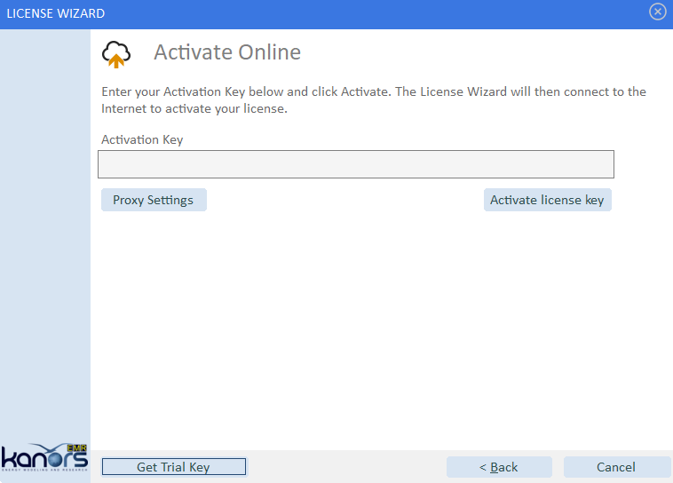{width="4.84375in" height="3.4791666666666665in"}

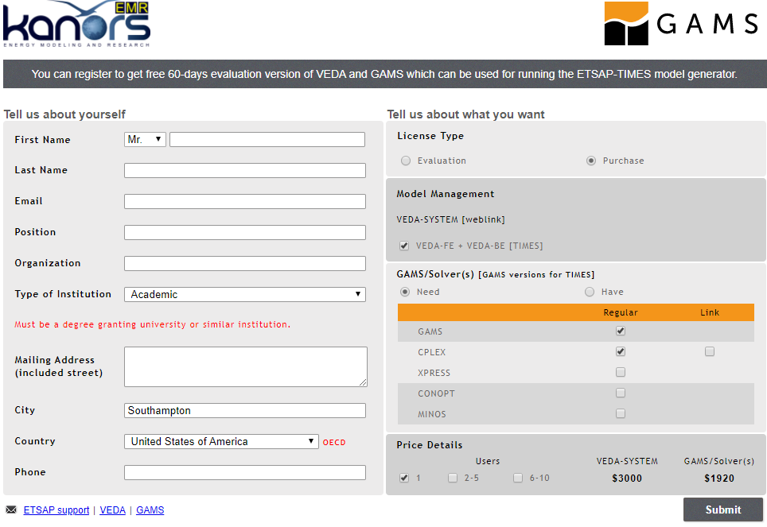{width="4.40625in" height="3.03125in"}

{width="4.4375in" height="2.5833333333333335in"}

This will then bring you to the VEDA2.0 Start Page discussed in Section
2.

## Obtaining and Setting Up GAMS for TIMES

As part of registering VEDA2.0 a request is sent to the ETSAP Liaison
Officer who will arrange for an evaluation GAMS license file to be
created, sending it to the new user along with the download and install
procedures here:

1.  Copy the GAMSLICE someplace on your computer.

2.  Head to <http://www.gams.com/download/> and select the Windows
    download option for either Win-64/32, as appropriate

3.  Run Setup by clicking on it in Windows Explore

    a.  Check "**Use advanced installation mode**" at the bottom of the
        GAMS Setup form.

    b.  Let GAMS get installed into the default folder
        (\\GAMS\\\<Win#\>\\\<ver\>.

    c.  **Check the Add GAMS directory to PATH** environment variable.

    d.  Have the GAMSLICE.TXT copied from wherever it currently resides.

**You may need to restart your computer to have the GAMS Path
activated.**

Once you have VEDA installed you can try a TIMES model run.

## Downloading and Setting Up the DemoS Models

The complete set of VEDA-TIMES DemoS models is available, along with all
five Parts of the TIMES documentation, on the ETSAP Documentation web
page (<http://www.iea-etsap.org/index.php/documentation>) under
'VEDA-TIMES Demo Models,' and is downloaded as part of the VEDA2.0
installation procedure. Thus you will also need VEDA2.0 installed in
order to follow along with this manual. In addition, you'll need GAMS
(General Algebraic Modeling System, [www.GAMS.com](http://www.GAMS.com))
system in with the TIMES model generator is written. VEDA and GAMS
evaluation licenses are available at
<https://www.kanors-emr.org/AcquiringTools.php>.

To open the first DemoS from VEDA2.0 launch VEDA2.0. and from the
StartPage select DemoS_001 from the list of available models, see
Figure 1. The current model and version of VEDA2.0 is shown on the top
row for the form.

{width="6.510416666666667in"
height="2.8854166666666665in"}

[]{#_Ref54873777 .anchor}Figure 1. StartPage Model Selection & News

Note that once a model has been selected the StartPage will have the
Module buttons displayed at the top of the form, see Figure 3.

{width="6.5in" height="0.34375in"}

# Introduction to VEDA2.0 

This section provides a brief introduction to the VEDA Excel template
workbooks for specifying and building a model, and using VEDA2.0 to
access and manage the templates, browsing the data, viewing the
underlying Reference Energy System (RES) network depicting the energy
system, and running a TIMES model.

To assist with getting setup with and oriented to VEDA2.0 you may want
to start by engaging with the short YouTube tutorials:

1.  [Installation & Quick
    Tour](https://www.youtube.com/watch?v=OnYIDiftNgM&list=PLED97cPMXPOm60xOKSwvmXaGIsQrjoM8Y&index=1)

2.  [VEDA2.0
    Menu](https://www.youtube.com/watch?v=OnYIDiftNgM&list=PLED97cPMXPOm60xOKSwvmXaGIsQrjoM8Y&index=2)

3.  [Navigator](https://www.youtube.com/watch?v=OnYIDiftNgM&list=PLED97cPMXPOm60xOKSwvmXaGIsQrjoM8Y&index=3)

4.  [Browse](https://www.youtube.com/watch?v=OnYIDiftNgM&list=PLED97cPMXPOm60xOKSwvmXaGIsQrjoM8Y&index=4)

5.  [Item
    Details](https://www.youtube.com/watch?v=OnYIDiftNgM&list=PLED97cPMXPOm60xOKSwvmXaGIsQrjoM8Y&index=5)

6.  [Run
    Manager](https://www.youtube.com/watch?v=3EkFqLyl5ZE&list=PLED97cPMXPOm60xOKSwvmXaGIsQrjoM8Y&index=6)

7.  Results *{now video yet}*

8.  [ETSAP VEDA2.0 Tutorial Webinar
    (1.5hrs)](https://www.youtube.com/watch?v=OmDjlePsbsM&list=PLED97cPMXPOm60xOKSwvmXaGIsQrjoM8Y&index=10)

The main modules available in VEDA2.0, available from the StartPage,
Modules menu, or \[Function Keys\] are:

-   **Navigator \[F6\]:** to oversee the management of the Excel
    workbooks;

-   **Browse \[F7\]:** to view all model data (based on filter and
    search facilities) in a dynamic data cube;

-   **Items List** indicating all the process/commodities appearing in
    the model, as well as user constraints;

-   **Items Details \[F8\]:** to view and cascade thru the RES
    (indicating any UCs the component is involved in), with
    process/commodity declaration information and cube data views;

-   **Run Manager \[F9\]:** for composing and submitting model runs, and

-   **Results \[F10\]:** for model results analysis.

These are described in Section 2.5, after a description of the VEDA2.0
template folder structure, file types, tables used to create model input
and results module VEDA2.0 for analysis of model runs.

## Model Folder Organization

All VEDA-TIMES model input data is organized in Excel workbooks (or
files). VEDA2.0 then integrates information from all of these workbooks
into internal databases to facilitate management of the model data and
to prepare and submit a TIMES model, generated and solved with the GAMS
sub-system. The user templates underlying models managed by VEDA2.0 are
normally stored in a specific folder (by default \\VEDA\\VEDA_Models).
Within this folder, there is a sub-folder for each individual model a
user is working with, including all of the VEDA-TIMES Demo Models
((\\VEDA\\VEDA_Models\\DemoS_001, \_002, etc.). The sub-folder structure
is identical for each individual model (Figure 2, left side) and
includes the kind of templates shown in the table below, as found with
the DemoS_012 model.

{width="6.5in" height="3.5208333333333335in"}

[]{#_Ref444525057 .anchor}Figure 2. Sub-folders Structure for each
VEDA2.0 Model (showing the DemoS_012 files)

-   The **B-Y Templates**, the **SysSettings** files, the **BY_Trans**
    file and **Sets**.

-   A sub-folder (**SubRES_TMPL**) to store all SubRES files and
    associated transformation files.

-   A sub-folder (**SuppXLS**) to store all scenario files, as well
    sub-folders for trade files (**Trades**) and demand files
    (**Demands**) (Figure 2, right side).

-   Users are not concerned with the other sub-folders.

## VEDA2.0 StartPage

VEDA2.0 opens displaying the StartPage (), which enables the launch of
any of the individual components of VEDA by double-clicking on the
associate box. The components may also be launch from the Modules
pulldown menu, as well as via function keys as noted above. The main
components most often used are readily accessible via the StartPage:

-   **Navigator:** oversee the management of the Excel workbooks;

-   **Browse:** access model data via dynamic cube tables;

-   **Items List:** list of all process, commodity, commodity groups and
    user constraint in a model;

-   **Items Detail:** basic Reference Energy System network diagram view
    of commodity/process connectivity and associated data;

-   **Run Manager:** to compose and submit model runs, and

-   **RESULTS**: examination of model run results via tables and graphs.

The current model (DemoS_001) and version of VEDA2.0 are shown on the
top line of the form.

{width="6.489583333333333in"
height="4.270833333333333in"}

[]{#_Ref54877190 .anchor}Figure 3. Model StartPage

## VEDA2.0 Navigator and Types of Templates

The VEDA2.0 Navigator (Figure 4) provides a comprehensive view of all
Templates In the various folders managed by VEDA2.0 for the current
model. The form opens with the last model loaded. To bring in your 1^st^
or another model hit the Add New button in the upper left of the
Navigator form, which opens Windows Explorer -- move to the VEDA_Models
sub-folder of interest and click on it to start the process. VEDA2.0 may
ask if you want to open a New Window, where "Yes" will start another
instance of VEDA2.0 and "No" will replace the currently viewed model
with the one requested, which also happens if you reselect the current
model folder. You may reopen previously opened models via
{width="0.5625in" height="0.19791666666666666in"},
which will again ask if you want to open a new instance or replace the
only currently open.

When first opening the Navigator for a particular model the form will be
presented as seen below, with all the panel types displayed. If you want
to recover empty real estate simply Unpin say the Parametric and No Seed
Value panes showing in Figure 4, resulting in what one sees in Figure 5,
where by grabbing the vertical tabs in the middle of a pane the window
size has also been adjusted. Note that when Unpinned the pane header
appears to the right so that when clicked on it returns to the
visualization pane.

{width="6.5in" height="2.5416666666666665in"}

[]{#_Ref335997296 .anchor}Figure 4. VEDA2.0 Navigator Layout

You may also switch the panes around, as done in Figure 5, where the
Regular Scenario \[RS\] pane has been moved to the left of the Demand
Scenario \[DS\] and Trade Scenario \[TS\] panes. This is accomplished by
grabbing the pane at the top then using
the{width="0.3229166666666667in"
height="0.2708333333333333in"}positioning tool to place the pane where
you wish in the form. Note that when closing and reopening the Navigator
(or VEDA2.0) the panes will appear as organized the last time.

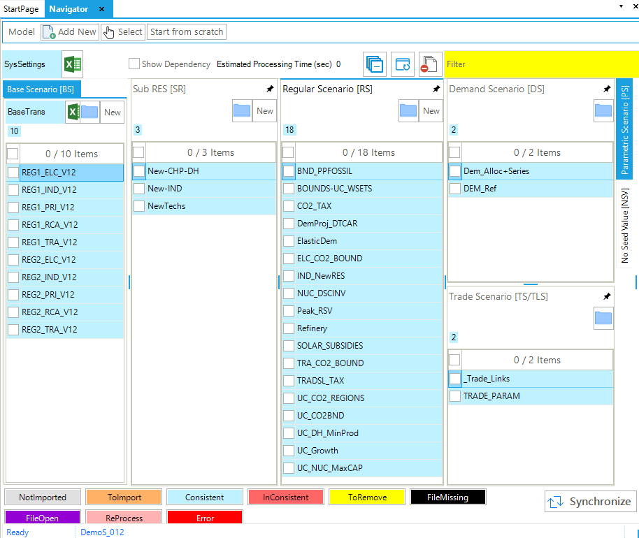{width="5.21875in" height="4.385416666666667in"}

[]{#_Ref47578864 .anchor}Figure 5. VEDA2.0 Navigator -- Tailored View

The specific folder associated with the active model can be opened by
clicking on the model name at the both of the VEDA2.0 form (in Figure 4,
MODEL: C:\\VEDA\\VEDA_Models\\ DemoS_012) or the
{width="0.23958333333333334in" height="0.1875in"}
icon in the Base Scenario quadrants. Said icon can be found in each of
the panes of the Navigator and will similarly open Explore to the
associated sub-folder of the current model. One may also make a new
instance of any folder by hitting the New button next to the folder in
each pane.

The VEDA-Navigator is the main vehicle for accessing, importing, and
coordinating the various files that make up a model. Any template may be
opened from the Navigator by double-clicking on its name, or in the case
of SysSettings/BaseTrans using the {width="0.25in"
height="0.25in"} icon alongside the file name. The Navigator form is
divided into sub-windows/panes/quadrants according to the various types
of files managed by VEDA2.0:

-   **Base Scenario \[BS\]**: templates used to set up the base-year
    (B-Y) structure of the model (existing commodities and current
    processes stock, and the base-year end-use demand levels), according
    to the energy flows reflect the overall energy balance. Thus the
    start year of the model can be calibrated to the energy balance
    according the B-Y Templates. The B-Y templates are named as
    VT\_\<workbook name\>\_\<sector\>\_\<Version\> (e.g. VT_REG_PRI_V1,
    as seen in ). The number of B-Y templates and their names depend on
    both the model structure (e.g., the number of regions and sectors)
    and the organisation of the input data (e.g., how many regions and
    sectors in each file). The B-Y templates are introduced in DemoS_001
    (Section ) and are modified throughout the evolution of the 12 DemoS
    steps.

    -   **BY_Trans**: are transformation files used to update the
        information included in the B-Y templates (update existing
        values for existing attributes) and/or to insert new information
        (insert new attributes for existing processes) in the B-Y
        templates. They work like a scenario file (described below), but
        the rule-based filters and the update/insert changes apply only
        to those processes and commodities already existing in the B-Y
        templates. The BY_Trans file is introduced in DemoS_009 (Section
        3.9.1.2).

-   **SysSettings**: is used to declare the very basic structure of the
    model including regions, time slices, start year, etc. It also
    contains some settings for the synchronization process and can
    include some additional information. There is only one such file; it
    has a fixed name that stands for System Settings. The SysSettings
    file is described in Section .

-   **SubRES \[SR\]**: SubRES files are used to introduce new
    commodities and processes in the RES that are not part of the B-Y
    templates. However, while the B-Y templates are region-specific, the
    SubRES are region independent. For each SubRES file there is a
    corresponding transformation (Trans) file allowing the introduction
    of region-specific process attributes, including the availability
    (or not) of processes in each region. To make changes to the
    SubRES_Trans-\_\<sector\> files use the Navigator to open the
    associated model subfolder and access the file via Window Explorer.
    The naming conventions are: SubRES\_\<name\> and
    SubRES\_\<name\>\_Trans. SubRES files are introduced in DemoS_006
    (Section 3.6.3).

-   **Regular Scenario \[RS}**: Scenario files are used to update
    existing information and/or to insert new information in any part of
    the RES, including B-Y templates, SubRES files, and Trade files (see
    below). They are also used to include any additional user
    constraints in the model. The naming convention is: Scen\_\<scenario
    name\>. These files can only manipulate (insert or update)
    information associated with previously declared RES components. New
    commodities and processes may not be added via Scenario files, only
    new attributes. Scenario files are introduced in DemoS_004 (Section
    ). Several different applications of scenario files are illustrated
    through the remainder of the DemoS.

-   **Demand Scenario \[DS\]**: Demand Templates Include all the
    information necessary to project end-use demands for energy services
    in each region, such as macroeconomic drivers and sensitivity
    series. Multiple demand files may be used, to model different demand
    growth scenarios for instance. The naming convention is:
    ScenDem\_\<scenario name\>. This section of the Navigator also
    contains a single file permitting assignment of a demand driver as
    well as a sensitivity (or elasticity) series each end-use demand to
    its driver in each region: Dem_Alloc+Series. Demand files and tables
    are described in DemoS_010 (Section 3.10.1).

-   **Trade Scenario \[TS\]**. This section of the Navigator contains a
    file in which all unilateral and/or bilateral trade links between
    regions are declared: ScenTrade\_\_Trade_Links, and associate data
    provided when appropriate. The latter contains all of the attribute
    specifications for the trade processes. Multiple trade files may be
    used, to model different trade scenarios or for different
    commodities. The naming convention is: ScenTrade\_\<scenario name\>.
    Trade files are introduced in DemoS_005 (Section 3.5.3).

For more advanced modelling there are also control panels for the
Parametrisation facilities of VEDA2.0, and well as for more complex
model input setups a couple of ways to look at inter-decencies between
templates -- though these are beyond the scope of the basic DemoS
models,

As shown in Figure 4, the Navigator provides feedback as to the status
of the various files and the integrated database managed by VEDA2.0. The
consistency of the files and database is immediately evident based upon
whether any of the template files are highlighted in orange (to
ToImport) or red (Inconsistent). The status of individual templates is
indicated by their colors in the template lists, according to the legend
at the bottom of the form. A file is shown as Inconsistent when it has a
newer date/time stamp than in the database. [Note]{.underline}: you may
need to do a refresh via {width="0.1875in"
height="0.15625in"} to update the current status of the files after a
recent change(s).

Hitting {width="1.4270833333333333in"
height="0.3125in"} will import all Templates In the application folder
marked as inconsistent. You may force synchronization of other files by
checking the checkbox next to their names before hitting
{width="1.0729166666666667in"
height="0.20833333333333334in"}. The synchronize operation and resulting
log is discussed in Section 2.5.1. When opening the DemoS_001 model the
single model input template (PRE_PRI_V01) will be tagged as ToImport.

## VEDA2.0 Templates Tables

The VEDA2.0 synchronize operation reads each sheet in each file to be
imported in sequence, looking for VEDA2.0 tables to be processed. All
VEDA2.0 tables are identified by table tags, discussed below, and
triggered by the special character tilde (\" **\~** \"). VEDA2.0 tables
must be separated from each other and the rest of the information on a
worksheet by blank rows and columns. Rows and columns starting with the
character \" **\*** \" or with "\\I:", which stands for \"ignore\", are
not read.

The most common types of tables are briefly described in this section.
More information on how to use them for specific cases is shown in the
sections associated with each step of the DemoS. The initial examples in
this section come out of the DemoS_001 model, unless otherwise noted.
The VEDA2.0 Information/VEDA Tags feature, shown in Figure 6, provides a
summary of what is required for each "\~"tag VEDA handles.

{width="6.302083333333333in"
height="7.489583333333333in"}

[]{#_Ref58394022 .anchor}Figure 6. VEDA Tags Overview

### Basic tables needed for any model

The following tables are needed in any VEDA-TIMES model.

-   Tables that exist only in the SysSetting file (Section 3.1.1
    describes how to use these tables):

**\~BookRegions_Map:** declare the workbook name and the list of region
names;

**\~TimeSlices:** declare the time-slice resolution for the model;

**\~DefaultYear**: used to control the default year of the first period.
It defaults to the start year;

**\~StartYear:** declare the start year of the model;

**\~ActivePDef:** declare the set of active periods;

**\~TimePeriods:** declare the time horizon of the model for the
ActivePdef;

**\~Currencies:** define a default currency for the whole model, and

**\~DefUnits:** define default units by activity, capacity, and
commodity for each sector in the model.

-   **Commodity Definition Tables** **(\~FI_COMM):** commodity
    declaration and definition; may only appear in B-Y, SubRES and
    SysSetting files (described further in Section 2.4.2).

```{=html}
<!-- -->
```
-   **Process Definition Tables** **(\~FI_PROCESS):** process
    declaration and definition; may only appear in B-Y, SubRES and
    SysSetting files (described further in Section 2.4.3).

```{=html}
<!-- -->
```
-   **Flexible** **Input Tables** **(\~FI_T)** for topology and
    parameter definition; used in BY and SubRES files (described further
    in Section 2.4.4).

### Commodity definition tables \~FI_COMM

Commodity definition tables (\~FI_Comm) are used to declare the
non-numerical characteristics of commodities. The columns headers are
described in the table below and their order can be changed. Each
commodity needs to be declared (only) once in such a table as shown in
Figure 7. They are supported in B-Y Templates, SubRES files, and the
SysSettings template.. Care must be taken that commodities are declared
only once, as problems can arise if the same commodity is declared twice
with conflicting attributes, such as different time slice levels. In
large complex models, therefore, a best practice would be to declare
them in a single template location only, such as the SysSettings
template.

{width="6.0in" height="0.65625in"}

[]{#_Ref455666090 .anchor}Figure 7. How to Use \~FI_COMM

The valid column headers for a commodity table \~FI_COMM are described
in Table 1 (with reference to Figure 7).

  ------------------------------------------------------------------------
  **Header**   **Description**
  ------------ -----------------------------------------------------------
  Csets\*      The sets to which commodities belong. Valid entries are:
               NRG (energy), MAT (material), DEM (demand service), ENV
               (emissions) and FIN (financial). These declarations are
               inherited until the next one is encountered. In this
               example, COA (Solid Fuels) is an energy commodity (NRG).

  Region\*     The region name. By default, it is applied to all regions
               of the model when not specified. The region designation is
               used only in the B-Y templates and not allowed in SubRES.

  CommName     The commodity name (COA).

  CommDesc     The commodity description (Solid Fuels).

  Unit         The commodity unit throughout the model (PJ). It is
               responsibility of the user to be consistent with units.

  LimType      The sense of the balance equation for the commodity. Valid
               entries are LO (Production\>=Consumption, FX
               (Production=Consumption), UP (Production\<=Consumption).
               When not specified, the default is LO for all but MAT
               commodities with a default of FX.

  CTSLvl       The commodity time-slice tracking level. Valid entries are
               ANNUAL, SEASON, WEEKLY and DAYNITE. When not specified, the
               default is ANNUAL.

  PeakTS\*     Peak time slice monitoring. Valid entries are: ANNUAL to
               generate the peaking equation for all time slices or any
               specific time slices already defined in the SysSettings
               file (comma-separated entries allowed). If not specified
               the default is ANNUAL.

  CType        Electricity and heat commodities indicator (ELC, HTHEAT and
               LTHEAT)
  ------------------------------------------------------------------------

  : []{#_Ref455662577 .anchor}Table 1. Valid Column Headers for a
  Commodity Table \~FI_COMM

> \* Note: Comma separated elements are allowed.

### Process definition tables \~FI_PROCESS 

Process definition tables (\~FI_Process) are used to declare the
non-numerical characteristics of processes. The columns headers are
described in the table below and their order can be changed. Each
process needs to be declared (only) once in such a table as shown in
Figure 8. They are supported in B-Y Templates and SubRES files.

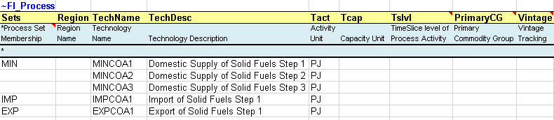{width="5.78125in" height="1.25in"}

[]{#_Ref455666174 .anchor}Figure 8. How to use \~FI_PROCESS

The valid column headers for a process table \~FI_PROCESS are described
in Table 2 (with reference to Figure 8.

+----------+-----------------------------------------------------------+
| **       | **Description**                                           |
| Header** |                                                           |
+==========+===========================================================+
| Sets\*   | Sets to which processes belong, indicating the nature of  |
|          | a process. Valid entries are: ELE (thermal or other power |
|          | plant), CHP (combined heat and power), PRE (generic       |
|          | process), DMD (demand device), IMP (import process), EXP  |
|          | (export process), MIN (mining process), HPL (heating      |
|          | plant), IPS for inter-period storage, NST for night       |
|          | storage device, STG for general timeslice storage, STS    |
|          | for simultaneous DayNite/Weekly/Seasonal, STK for         |
|          | simultaneous DayNite/Weekly/Seasonal and inter-period     |
|          | storage process. These declarations are inherited until   |
|          | the next one is encountered. In this example, there are   |
|          | three mining processes (MINCOA\*), one import process     |
|          | (IMPCOA1) and one export process (EXPCOA1), all related   |
|          | to the supply of solid fuels (COA).                       |
+----------+-----------------------------------------------------------+
| Region   | The region name where the process exists (comma-separated |
|          | entries allowed). By default, it is applied to all        |
|          | regions of the model when not specified.                  |
|          |                                                           |
|          | The region designation is used only in the B-Y templates  |
|          | and not allowed in SubRES. \[Note that regional data for  |
|          | SubRES processes can be provided in the                   |
|          | SubREs\_\<sector\>\_Trans file.\]                         |
+----------+-----------------------------------------------------------+
| TechName | The process name (e.g. MINCOA1), up to 32 characters.     |
|          | (However, it is recommended to limit process names to 27  |
|          | characters as VEDA2.0 may internally add digits for       |
|          | vintaging issues or dummy imports.)                       |
+----------+-----------------------------------------------------------+
| Pro      | The process description (e.g., Domestic supply of Solid   |
| cessDesc | Fuels Step 1), up to 255 characters.                      |
+----------+-----------------------------------------------------------+
| Tact     | The activity unit of the process (in Figure 8, for        |
|          | example, it is in PJ). It is the user's responsibility to |
|          | be consistent with units.                                 |
+----------+-----------------------------------------------------------+
| Tcap     | The capacity unit of the process. It is the user's        |
|          | responsibility to be consistent with units.               |
+----------+-----------------------------------------------------------+
| Tslvl    | The process time-slice operational level. Valid entries   |
|          | are ANNUAL, SEASON, WEEKLY and DAYNITE. When not          |
|          | specified, the default is based on the Sets declaration:  |
|          | DAYNITE (for ELE, STGTSS, and STGIPS), SEASON (for CHP    |
|          | and HPL), ANNUAL (for all others).                        |
+----------+-----------------------------------------------------------+
| P        | The Primary Commodity Group (PCG) of the process.         |
| rimaryCG | Normally none specified as VEDA allocates the PCG by      |
|          | default. A declaration is needed only when the user wants |
|          | to create a new PCG and/or override the default PCG.      |
+----------+-----------------------------------------------------------+
| Vintage  | Vintage tracking. Valid entries are YES or NO. When not   |
|          | specified, the default is NO.                             |
+----------+-----------------------------------------------------------+

: []{#_Ref455666223 .anchor}Table 2. Valid Column Headers for a Process
Table \~FI_Process

> \* Note: Comma separated elements are allowed.

### Flexible import tables \~FI_T

The Flexible Import Table **(\~FI_T**) is the main workhorse used to
create model topology (process inputs and outputs) in B-Y templates and
SubRES, provides a very flexible structure (hence the name) for
specifying parameters and their numerical values. With this identifier
the information is imported as provided, and not modified during the
import process.

Unlike in most other table types (with the exception of UC tables,
described in Section 2.4.7), the \~FI_T table tag is not placed directly
above the upper-leftmost table cell. Instead it is placed in the row
immediately above the table headers and in the column before the first
column containing values. This placement allows any number of columns to
be designated for row identifiers, rather than data, as shown in Figure
9 and defined in Table 3.

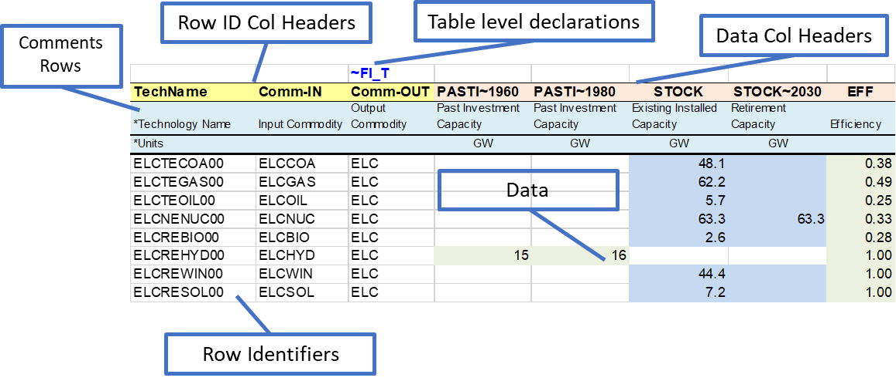{width="5.511805555555555in"
height="2.361111111111111in"}

[]{#_Ref455657085 .anchor}Figure 9. How to Use the \~FI_T Table

Indexes for the data, including attribute, region, year, and timeslice
may be specified as either row identifiers or column headers, so that a
table may be laid out to match the configuration of source data with
minimal user intervention.

The \~FI_T table has six distinct regions. Valid entries in each of
these are listed below.

-   **Row ID Col Headers**. The valid row ID column headers for a \~FI_T
    flexible import table are described in Table 3.

  --------------------------------------------------------------------------
  **Header**      **Description**
  --------------- ----------------------------------------------------------
  Region\*        Region declaration

  TechName        Technology Name

  Comm-IN\*       Input Commodity

  Comm-IN-A\*     Auxiliary Input Commodity

  Comm-OUT\*      Output Commodity

  Comm-OUT-A\*    Auxiliary Output Commodity

  Attribute       Attribute declaration; single entries permitted

  Year            Year declaration; comma-separated entries allowed

  TimeSlice\*     Time slices declaration; comma-separated entries allowed

  LimType         Valid entries are: UP (Upper), LO (Lower), FX (Fixed) and
                  N (Non-binding)

  CommGrp         User Defined Commodity Group

  Curr            Currency declaration

  Stage           Decision point (for multi-stage Stochastic models)

  SOW             State of the World (for Stochastic models)

  Other_Indexes   To enter special dimensions that are required in certain
                  attributes (see an example at
                  <https://github.com/kanors-emr/Model_Demo_Adv_Veda.git>)
  --------------------------------------------------------------------------

  : []{#_Ref47655968 .anchor}Table 3. Valid Row ID Column Headers for
  Flexible Import \~FI_T Table

\* Note: Comma separated elements are allowed.

-   **Row Identifiers**: elements of the dimension indicated in the row
    ID column headers.

-   **Data Area Column Headers**: Elements of the following dimensions
    (elements of multiple dimensions can be separated by \~):

    -   Attribute

    -   Year

    -   TimeSlice

    -   LimType

    -   Commodity

    -   CommGrp (only the internal VEDA commodity groups:
        DEMO/DEMI/NRGO/ NRGI/MATO/MATI/ENVO/ENVI/FINO/FINI can be used
        as column headers)

    -   Region

    -   Currency

```{=html}
<!-- -->
```
-   **Data**: numerical entries.

-   **Table level declarations**: Declarations like those made in column
    headers can be included in the table header (following a colon) and
    will apply to all data that doesn't have a different value for that
    index specified. For example, \~FI_T: DEMAND would assign DEMAND as
    the attribute for all values in the table that don't have an
    attribute specification at the column or row level.

-   **Comments**: a comment row is identified by the character \" **\***
    \" or "\\I:" as the first character in any of the cells below the
    Row ID Col Headers or the first character in any of the column
    headers. (However, caution should be exercised in using \" **\*** \"
    to indicate a comment, because it may also be used to indicate a
    wildcard or an operation in some cells. "\\I:" is the safer choice
    to indicate a comment row/column.)

### Transformation Insert and Update tables

> **Transformation Insert Tables (\~TFM_INS)** are used to define
> absolute values via additional parameters that were not defined in the
> base year or SubRES templates in a rule-based manner. In this example
> from DemoS_001, it is used to declare three new attributes (G_DYEAR,
> Discount, and YRFR) by row as shown in .

{width="3.15625in" height="0.8645833333333334in"}

[]{#_Ref336357066 .anchor}Figure 10. Example of \~TFM_INS Insert Table

**Transformation Update Tables (\~TFM_UPD)** are used to update
pre-existing data in a rule-based manner. For example, in Figure 11 it
sets default prices (ACTCOST) for the backstop dummy processes for
energy commodities (IMP\*Z - dummy IMPort processes ending with "Z") and
demands (IMPDEMZ - a dummy IMPDEMZ process that can feed any demand).
Note that the process and attribute **MUST** already have been specified
for the qualifying process. Though not shown in the example below the
data specification field may also contain operators (+, \*, -, /) there
the resulting value is applied to the existing value for the qualifying
processes.

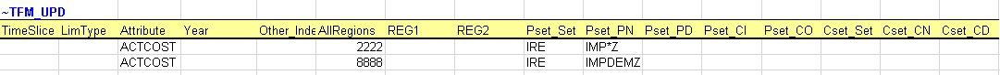{width="6.395833333333333in"
height="0.4895833333333333in"}

[]{#_Ref455668699 .anchor}Figure 11. Example of \~TFM_UPD Update Table

**Transformation Direct Insert Tables** **(\~TFM_DINS)** are also used
to insert data, but unlike in Insert tables, it is forbidden to define
subsets of technologies using text/wildcards, and for each attribute all
the required dimensions must be defined (no defaults). These tables can
be useful when working with large, detailed source data tables, because
VEDA2.0's processing of DINS tables is much faster than that of Insert
tables.

Transformation tables may be used only in scenario and transformation
files. Valid column headers for data entry in transformation insert and
update tables are presented in the top portion of Table 4. These tables
can identify the items whose data is to updated or inserted using the
criteria in the bottom portion of Table 4.

  -----------------------------------------------------------------------
  **Header**      **Description**
  --------------- -------------------------------------------------------
  **Insert or     
  update values** 

  Attribute       Name of the attribute

  Year\*          Year declaration; default value = start year

  TimeSlice\*     Time slices declaration; default=ANNUAL.

  LimType         Valid entries are: UP (Upper), LO (Lower), FX (Fixed)
                  and N (Non-binding)

  CommGrp         User defined Commodity Group

  Curr            Currency declaration; default=CUR

  Stage           Decision point (for multi-stage Stochastic models)

  SOW             State of the World for Stochastic models)

  Other_Indexes   To enter special dimensions that are required in
                  certain attributes

  AllRegions      Data value that is applicable to all regions

  \<Regions\>     Region-specific data values; these will supersede any
                  declaration in AllRegions column

  **Commodity and 
  process         
  filtering**     

  PSet_Set^1^     Identifies qualifying processes based on TIMES or
                  user-defined set membership

  PSet_PN^2^      Identifies qualifying processes based on names

  PSet_PD^2^      Identifies qualifying processes based on descriptions

  PSet_CI^2^      Identifies qualifying processes based on commodity
                  inputs

  PSet_CO^2^      Identifies qualifying processes based on commodity
                  outputs

  CSet_Set^1^     Identifies qualifying commodities based on TIMES set
                  membership

  CSet_CN^2^      Identifies qualifying commodities based on names

  CSet_CD^2^      Identifies qualifying commodities based on descriptions

  Top_Check       To restrict application of attribute data to those
                  process-commodity combinations where the specified
                  topology already exists in the model, rather than
                  creating new topology. Valid entries: **I/O/A.
                  "I"** will retain those combinations where commodities
                  are input to processes. **"O"** =\> Output. No topology
                  check is performed by default.

  Attrib_Cond     To filter based upon whether an attribute is present or
                  missing (precede with "-") for potentially qualifying
                  processes.

  Val_Cond        Used in conjunction with Attrib_Cond to filter on the
                  value of the specified attribute. Define using \'\<\',
                  \'\>\', '\<\>', or \'=\'. The condition will be tested
                  across all dimensions (for example, years) for the
                  specified process, region, and attribute.
  -----------------------------------------------------------------------

  : []{#_Ref455668767 .anchor}Table 4. Valid Column Headers for
  Transformation Tables

> ^\*^ Comma separated entries permitted.
>
> ^1^ Comma separated elements are allowed. Each of these fields can
> have comma-separated entries that are joined by OR.
>
> ^2^ Comma separated elements and wild cards characters are allowed.
> The possible wild cards are:
>
> "\*" is used as wild card; for example \*GAS\* would refer to all
> elements that have GAS in the name with any possible characters before
> and after GAS.
>
> "-" before the text used for exclusions; for example, \*GAS\*,-ELCGAS
> would refer to all elements that have GAS in the name except for
> ELCGAS.
>
> "?" can be used to specify a single character; for example, ???GAS
> means there are 3 characters before GAS.

### Advanced tables

The following tables are special and/or advanced tables that can be used
in different types of templates to support model building.

-   Special tags exist for emission commodity tables. With this table
    identifier the data are manipulated during the import process to
    provide for special calculations on emissions factors.

**\~COMEMI** to link emissions to commodity consumption. An example on
how to use this table is shown in Section .

**\~COMAGG** to define an aggregated commodity such as TOTCO2
accumulating the emissions from each \<sector\>CO2 commodity.

-   Fill tables in scenario files **(\~TFM_FILL**) allow extraction of
    values from the rest of the model database for use in Update or
    Insert tables. An example is shown in Section .

    -   TFM_FILL table is also available in SubRES transformation file,
        though note that it can only be populated with numbers from the
        BASE scenario.

    -   The fill operation will color the Region cells upon processing
        to indicate the number of records found, as follow:

        -   Blue color represents only one record found, and

        -   Purple color represents that more than one record was found
            for the specified parameter and its dimensions while filling
            the region value in the relevant row.

The user can specify whether multiple values are to be summed, averaged,
or counted.

-   Tags exist for transformation tables indicating that the import
    operation is different than for the standard input tables \~FI_T.
    With this type of table identifier the data are manipulated during
    the import process and not imported as provided. They are supported
    in the BY_Trans file, SubRES files, and all scenario files.

**\~TFM_AVA** to declare the availability of processes in different
regions.

-   Special tables that exist only in the Demand module:

**\~DRVR_Allocation** to allocate a driver to each end-use demands;

**\~Series** to define sensitivity and calibration series, and

**\~DRVR_Table** to define demand driver indexes (base-year =1).

-   Special tables that exist only in the Trade module: **\~TradeLinks**
    to declare uni- or bilateral trade links between regions.

-   User constraints are identified with specific identifiers
    **\~UC_Sets.**

### User constraints and their tables

User constraints provide the modeller with a flexible framework to add
case-study specific constraints to the standard equation set embodied in
TIMES model generator. With the help of user constraints, virtually any
possible linear relationship between core components of the RES (as
represented by variables in TIMES) can be formulated, and some input
attributes can also be brought in as coefficients. User constraints can
also be written to link variables across consecutive time slices or
periods. Section 6.4 of Part II of the TIMES documentation contains an
extensive discussion of the user constraint types available and their
mathematics.

Defining user constraints in VEDA2.0 templates is a two-step process.
They are first declared with one or more **\~UC_SETS:** tags, which
indicate their type and domain of coverage. Then their data is specified
using a table with similar structure to that of a **\~FI_T** table, as
shown in Figure 12. This example puts an upper limit on the CO2 arising
from the Transportation plus Power sectors of the model from 2010 on,
interpolation between 2010-2020 and the extending constant for the
remainder of the modelling horizon (owing to interpolation rule (5)
specified in the UC_RHSRTS\~0 column).

{width="6.239583333333333in"
height="0.7395833333333334in"}

[]{#_Ref336865683 .anchor}Figure 12. Defining a User Constraint in
VEDA2.0

Available UC sets are described in Table 5. Each set definition holds
for the entire sheet, unless redefined. All the existing set definitions
are applied to all user constraints in a table.

+----------+-------------+--------------------------------------------+
| **\~UC   | **Sign      | **Application**                            |
| _SETS:** | ification** |                                            |
+==========+=============+============================================+
| R_E      | Region_Each | REG1: apply to one particular region       |
|          |             |                                            |
|          |             | REG1,REG2: apply to more than one region   |
|          |             | (comma separated)                          |
|          |             |                                            |
|          |             | AllRegions: will apply to all regions      |
+----------+-------------+--------------------------------------------+
| R_S      | Region_Sum  |                                            |
+----------+-------------+--------------------------------------------+
| T_E      | Time        |                                            |
|          | period_Each |                                            |
+----------+-------------+--------------------------------------------+
| T_S      | Time        |                                            |
|          | period_Sum  |                                            |
+----------+-------------+--------------------------------------------+
| TS_E     | Time        |                                            |
|          | slice_Each  |                                            |
+----------+-------------+--------------------------------------------+
| TS_S     | Time        |                                            |
|          | slice_Sum   |                                            |
+----------+-------------+--------------------------------------------+
| T_SUC    | Time period |                                            |
|          | successive  |                                            |
+----------+-------------+--------------------------------------------+

: []{#_Ref336866034 .anchor}Table 5. UC sets available in VEDA2.0

A UC table is then structured similarly to a Flexible Import table, with
the **\~UC_T** tag separating the column headings into row identifiers
(UC_INDEXES) and data column headers. Valid row ID (UC_INDEX) column
headers are listed in Table 6.

+--------+-------------------------------------------------------------+
| **     | **Description**                                             |
| Column |                                                             |
| He     |                                                             |
| ader** |                                                             |
+========+=============================================================+
| UC_N   | Short Name of the UC                                        |
+--------+-------------------------------------------------------------+
| Region | Name of the region(s)                                       |
+--------+-------------------------------------------------------------+
| PSe    | Process names                                               |
| t_PN\* |                                                             |
+--------+-------------------------------------------------------------+
| PSe    | Process description                                         |
| t_PD\* |                                                             |
+--------+-------------------------------------------------------------+
| Pse    | Input commodities to define a set of processes              |
| t_CI\* |                                                             |
+--------+-------------------------------------------------------------+
| Pse    | Output commodities to define a set of processes             |
| t_CO\* |                                                             |
+--------+-------------------------------------------------------------+
| Cse    | Commodity names                                             |
| t_CN\* |                                                             |
+--------+-------------------------------------------------------------+
| Cse    | Commodity description                                       |
| t_CD\* |                                                             |
+--------+-------------------------------------------------------------+
| Side   | LHS/RHS; RHS is applicable only in the case of dynamic      |
|        | (across periods) constraints.                               |
+--------+-------------------------------------------------------------+
| Att    | Any of the UC attributes available in the current TIMES     |
| ribute | code (refer to Part II of the TIMES system documentation.\] |
+--------+-------------------------------------------------------------+
| U      | -   Allows modifiers to be applied to the variables used in |
| C_ATTR |     the UC. These include the GROWTH modifier, to create a  |
|        |     constraint that limits the percentage growth in a       |
|        |     variable over periods; modifiers to pull input data,    |
|        |     such as COST and EFF, into the UC\'s coefficients; and  |
|        |     the NEWFLO modifier that applies the UC coefficient to  |
|        |     the flows of the new vintage of a process only. More    |
|        |     details are found in Section 6.4.6 of Part II.          |
|        |                                                             |
|        | -   The contents of this column are comma separated values  |
|        |     of UC_Name and UC_GrpType. Several pairs can be         |
|        |     separated by ";".                                       |
|        |                                                             |
|        | ```{=html}                                                  |
|        | <!-- -->                                                    |
|        | ```                                                         |
|        | -   A pair can have UC_Name/GrpType in any order; any       |
|        |     element in the list ACT, CAP, NCAP, FLO, IRE, COMCON,   |
|        |     COMPRD, COMNET is taken as GrpType and the other one is |
|        |     designated as the UC_Name. Valid UC_Names are provided  |
|        |     and described in Section 6.4.6 of Part II.              |
|        |                                                             |
|        | -   UC_ATTR can have a \~ appended to it; the default is    |
|        |     LHS.                                                    |
+--------+-------------------------------------------------------------+
| Year   | Years, comma separated list allowed                         |
+--------+-------------------------------------------------------------+
| L      | UP/LO/FX/N                                                  |
| imType |                                                             |
+--------+-------------------------------------------------------------+
| Top    | To control the process-commodity combinations via topology  |
| _Check | when both indexes exist for the attribute in question.      |
|        | Valid entries: **I/O/A. "I"** will retain those             |
|        | combinations where commodities are input to                 |
|        | processes. **"O"** =\> Output; . Default = either input or  |
|        | output**.**                                                 |
+--------+-------------------------------------------------------------+

: []{#_Ref47658844 .anchor}Table 6. UC_INDEXES for user constraint
tables

> \* Wild cards allowed, comma separated list permitted

Valid data column headers are:

-   Any of the UC attributes available in the current TIMES code;

-   Years (including 0 for interpolation setting);

-   Region;

-   UP/LO, and

-   LHS/RHS.

Multiple values can be separated by "\~". Any specification without a
region identifier in the column is applied to the region in the row
identifier area. If there is no region, it applies to all regions in the
active R_E/R_S specification.

A user constraint definition can span multiple rows of the table (to
attach numbers/attributes and other indexes to different sets of
processes/commodities).

## VEDA2.0 Data Management, Model Visualization and Run Submission Tools

Once the templates have been imported and assembled as a model database
within VEDA2.0 by means of the Navigator (Figure 5) and a Synchronize
done, one can review the resulting data by means of powerful
visualization tools and dynamic data cubes (pivot tables), as well as to
view the RES by requesting that the network diagram be displayed. As is
the case in the earlier sections screenshot below are taken for the
DemoS_012 model.

More information on VEDA2.0 and description of additional features are
available at <http://support.kanors-emr.org/> \[note: at the time of
writing the website described original VEDA-FE and VEDA-BE.\] Each of
the remaining main sections of this document describes one incremental
step of the VEDA-TIMES Demo Models.

### Navigator 

The Navigator was introduced in Section 2.3. Here we expand to further
explain the important role the Navigator plays below.

-   Enables easy access to any of the Excel templates constituting the
    > currently open model.

-   Double-clicking directly on any file name (or click the Excel icon
    > next to it, in the case of the *BY_Trans* and *SysSettings* files)
    > will open that file in Excel.

-   Clicking on the folder button above each section of the Navigator
    > will open the associated folder in Windows Explorer.

-   Provides feedback as to the status of the various files and the
    > integrated database managed by VEDA-FE according to colour legend
    > at the bottom of form:

{width="6.5in" height="0.28125in"}

-   Not imported -- not yet brought into VEDA-FE

-   Imported -- selected for importing with next SYNC

-   Consistent -- template and database aligned

-   InConsistent -- template date stamp more recent that last import

-   ToRemove -- missing template imported previously now flagged for
    > removal from the database

-   FileMissing -- previously imported template no longer found

-   FileOpen -- a template currently open, so can not be
    > processed/imported

-   Error -- if a file error happens

```{=html}
<!-- -->
```
-   The SYNCHRONIZE button will process all templates in the application
    > folder marked as ToImport (orange)

To ensure that VEDA2.0 is working in the model directory intended the
user is encouraged to access templates via the Navigator by opening the
Explore Folder via {width="0.22916666666666666in"
height="0.19791666666666666in"} or directly by double-clicking on the
file name.

### Browse

The database Browser can be accessed from the StartPage, or Modules menu
or by pressing **F7**. The Browse pane is split with the upper half
where the user specifies the criteria to be applied to the data, and the
lower part the resulting qualifying information. The Browser thereby
enables the user to view subsets of the assembled data in a cube by
selecting the scenario(s), region(s), process(es), commodity(ies),
and/or the attribute(s) of interest; the new nuclear power plants
(ELCNNNUC01) in REG1 in the example shown in Figure 13. It also
facilitates direct access to the data in the templates by
double-clicking on a cell.

{width="2.4895833333333335in"
height="1.5479166666666666in"} {width="6.5in"
height="4.291666666666667in"}

[]{#_Ref455754367 .anchor}Figure 13. Browser for the model database

First, elements are selected manually, limited to those belonging to a
particular Set via the pulldown menu above the Process/Commodity or via
the search box at the top of each column. For the items then selected
the information is displayed in a default layout, or last layout used.
As was mentioned earlier, in Section 2.3, the Browse pane may be
rearranged as desired. It is possible to rearrange the layout of the
cube by adding/removing dimensions (columns and rows) to/from the table
by dragging/dropping components from/to the area above the current row
designator columns, where above unwanted indexes are dragged up to
(outside of the cube) and the columns reordered (by putting the cursor
on the column header and holding the left mouse button down) to present
a clean look at the process information.

Any dimension not positioned as part of the row/column table layout
definition appears at the top of the page. These dimensions have their
values summed in the cube. Note that for any dimension where only a
single value exists, said dimension is automatically moved up top. Using
the {width="0.14583333333333334in"
height="0.1875in"} associated with each header, individual entries may
temporarily be removed by unselecting them from the list of elements.

### Item List

The Items List provides a look at all the data assembled from Templates
Into the VEDA2.0 database by component type: Process, Commodity,
Commodity Group, User Constraint, indicating the scenario, region,
sector, Set membership, Item Name, Description, Units, Primary Commodity
Group (PCG, indicating whether a process is input or output normalized),
time-slice level, and whether a process is vintage or now, as seen in
Figure 14 for the Electric Power Processes in the DemoS_0012 model (by
applying the Set Filter = ELE).

{width="6.5in" height="4.3125in"}

[]{#_Ref48954564 .anchor}Figure 14. Process Items List

### Item Details (RES viewer)

The Items Details form may be accessed from the StartPage, or Modules
menu or by pressing **F8**. When first entering the form an item much be
selected (by double-click) for the associated list (Process, Commodity,
User Constraints (UC), Commodity Groups (CommGrp)) presented to the
left. It is possible to navigate around the model by clicking on the
name of a commodity or process, allowing the user to see: 1) in the case
of a commodity, all processes producing and consuming that commodity;
and/or 2) in the case of a process, all input and output flows. The
upper right panel of Figure 15 shows the RES viewer as zoomed in on
process ELCNUCCC01. We see the process consumes nuclear fuel (ELCNUC)
and produces electricity (ELC). The area in the top left panel provide
the process (or commodity) declaration information. By clicking on any
item, the user can cascade through the RES to better visualize the
interrelationships and competing processes throughout the network, as
shown in Figure 16 after clicking on ELC. A Browse window with the data
associated with the focus component is presented below the RES, and may
be rearranged by means of drag-and-drop, as was discussed earlier.

{width="5.947916666666667in"
height="5.333333333333333in"}

[]{#_Ref462306843 .anchor}Figure 15. Master Schematic Representation of
the RES -- Process View

{width="5.927083333333333in"
height="5.302083333333333in"}

[]{#_Ref450061205 .anchor}Figure 16. Master Schematic Representation of
the RES -- Commodity View

The User Constraint (UC) view allows you to see components of the
individual user constraints, as shown in for the cross-region (global)
CO~2~ limit constraint.

There is also a facility for examining the Commodity Groups, not shown
here as DemoS only employs the standard single commodity input/output
groups created by VEDA2.0.

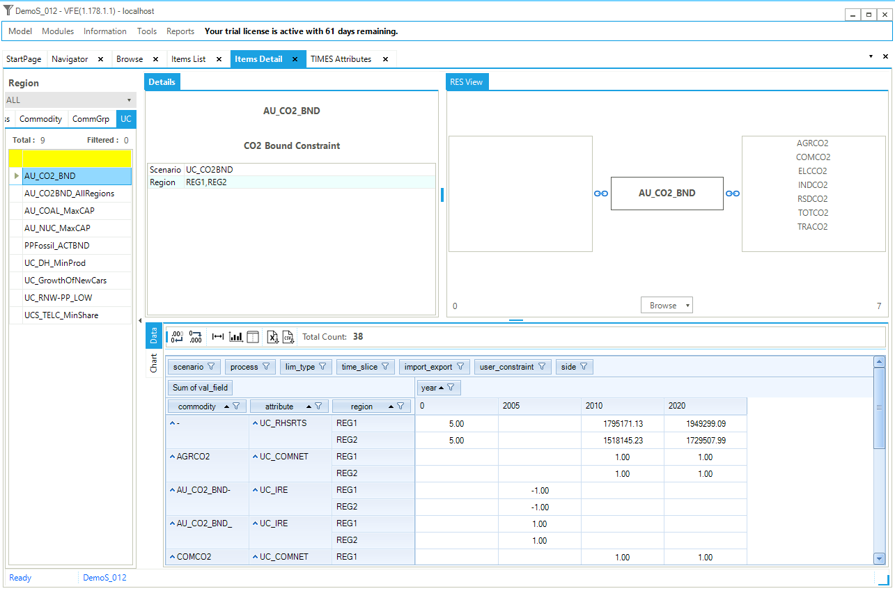{width="6.510416666666667in"
height="4.302083333333333in"}

[]{#_Toc58401157 .anchor}Figure 17. Master Schematic Representation of
User Constraints

### Run Manager

The Run Manager, available from the **StartPage**, **Module** menu, or
by pressing **F9**, is used to compose and submit a model run or set of
runs.

Figure 18 illustrates the main components of the Run Manager.

{width="6.5in"
height="3.4479166666666665in"}{width="1.2034722222222223in"
height="0.4270833333333333in"}[]{#_Ref450062276 .anchor}

Figure 18. Run Manager

> There are 5 basic sections to the Run Manager, along with an
> additional form to compose a Case once the specification is complete,
> as discussed here:

1.  **Scenario Group Designation**: check BASE/SysSettings and the list
    of scenario to be included in a "cluster" that is then given a name
    for inclusion later in a Case Definition for a model run;

2.  **Settings**: to designate where the GAMS and TIMES files reside, in
    what folder the model is to be run, the Maximum number of runs that
    are to be submitted in parallel, the Solver to be used and the
    Solver Options file to be employed;

3.  **Regions:** designation of the regions to be included in the Group
    definition;

4.  **Properties:** which GAMS switches are to be employed for the run,
    and

5.  **Cases:** list of Cases prepared identifying the Run
    name/Description, Scenario Group, list of regions, the Property
    specification to be used, period definition and ending year, and
    date information.

The key mechanism for defining a Case is shown in Figure 19, which is
presented in response to hitting the New Case button under Manage Saved
Cases, or double-click on a case in the list to bring up that
designation to edit or make to copy as a starting point for a new
(similar) Case definition. As can be seen the only new user input on the
form is the Case Name and Description, all other aspects of the run
specification embodies in the Case must already be defined and are
thereby available from the associated pulldown menus. Thus one creates a
new case Create a New Case by providing the core information for the
case definition (or start from an existing Case):

-   Case Name - case run name;

-   Description - run description;

-   Scenario Groups - scenarios to be included in this run;

-   Region Groups - regions to be included in this run;

-   Parametric Groups - driver scenario for a suite of runs;

-   Properties Groups - what GAMS options/switch are to be employed;

-   Periods Definition - what periods is the model be run for;

-   Ending Year - what is the last period for the run;

-   Source TIMES - where does the TIMES code reside;

-   Solver - which solver is to be used;

-   Solver Options - which solver options to use, and

-   GDX References - gdx to be used, if appropriate

Double-clicking on a existing Case opens its Definition form. It can
then be copied or modified and resaved as desired.

> 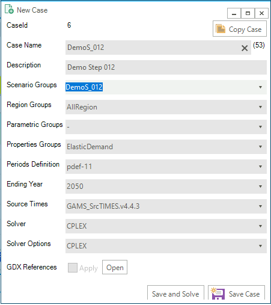{width="4.697916666666667in" height="5.28125in"}

[]{#_Ref48953394 .anchor}Figure 19. Case Designation Form

Once a case has been fully specified a model run can be submitted by
selecting the Case(s) desired and hitting the
{width="0.6041666666666666in"
height="0.21875in"}button. This results in VEDA extrating the data from
the intermal database and placing the data dictionary (DD) files that
contain the input for the TIMES GAMS model generator into the designated
work/run folder (the Log below). Once extracted a Command Window opens,
along the lines below, echoing the GAMS exectution steps and solver
actions, as seen below. \[A series of other VEDA work windows may open /
close along the way as well.\] As many jobs will be submitted in
parallel as set on the RunManager Settings panel.

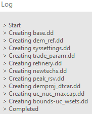{width="2.21875in"
height="2.75in"}{width="4.260416666666667in"
height="3.3333333333333335in"}

[]{#_Toc58401160 .anchor}Figure 20. Model Run

### Results

Upon completion of a run the results are brought into the VEDA2.0
Results component, opened from the StartPage, Modules menu or by
pressing \[F10\]. The Results component is used to analyze TIMES model
results. Note that Results are all stored in the VEDA2.0 system
database. Therefore it is not possible to share results across
users/computers, expect by running the model or importing vd\* files on
the other computer.

The core facilities of the Results component of VEDA2.0 are:

-   **Model VD files**: model results (VD files) are included
    > automatically in the model database at the end of a successful run
    > (e.g. \\Veda\\GAMS_WrkTIMES\\DemoS_012);

-   **Importing VD files from other models**: to import model results
    > from other models;

-   **Results browsing**: to view (and refresh) model results through
    > dynamic pivot tables (cubes);

-   **Table definition**: user defined tables for a specific model

> (\<model folder\>/AppData/ResultsView.json), and

-   **Batch export**: to export results in Excel and CSV.

An overview of the in Results component is shown in
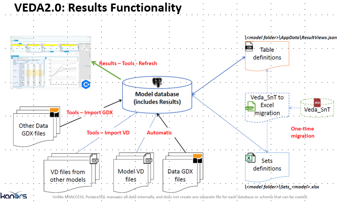{width="6.5in" height="3.90625in"}

Figure 21. Note that users of original VEDA can migrate their Sets and
Tables (SnT) definitions by means of the *Veda_SnT to Excel migration*
utility found in the VEDA\\VEDA (new) root folder, and just requires the
user identify to original SnT and VEDA2.0 model folder. See Appendix A
and B for the TIMES Results attributes and VD\* files .

{width="6.5in" height="3.90625in"}

[]{#_Toc58401161 .anchor}Figure 21. Components of the VEDA2.0 Result
Facility

The Results component greatly facilitates digging to model results,
across scenarios, by means of powerful filtering, creation of table
views of the data, presentation of the information in dynamic cube
(pivot) tables, enabling quick graphing of results, and exporting the
cube to Excel or CSV files. The layout of the basic Results form can be
tailored as desired, and said layout will be employed, until reset via
the Tools/User Options/Layout Settings facility is invoked to reset the
layout. But the real power of the Results module stems for repopulating
predefined tables that organize the model results into logical tables
for analyzing aspects of the solution results.

There are three main filtering mechanisms available to the user, shown
in the initial layout of the Resutls form in Figure 22. The columns
identify the indexes corresponding to the dimensions of the various
TIMES results attributes.

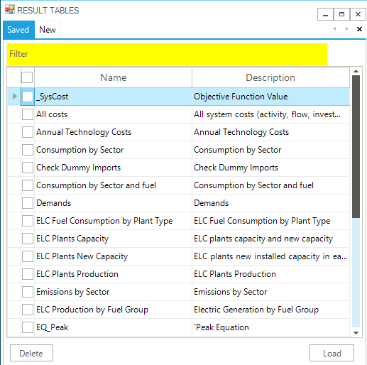{width="1.175in"
height="1.1666666666666667in"}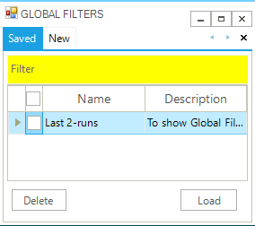{width="0.9888888888888889in"
height="0.8770833333333333in"}{width="6.5in"
height="4.895833333333333in"}

Figure 22. Results Form Components

Data can be retrieved by checking individual Items in their lists,
perhaps limited by a filter criteria (with wild cards) typed into your
yellow fields, and via the list of predefined tables. What is then
retrieved is then further controlled by where a Global Filter is active.
Note that the table definition is displayed in the upper right quadrant
once the table is retrieved, as seen in Figure 23 for power plant
capacity. Once the table is presented it can be rearranged as desired,
for example moving the scenario to the right of the row definition area
to facility comparing scenarios. Note that
{width="0.19791666666666666in"
height="0.19791666666666666in"}may be used to refresh the information
presented and {width="0.21875in"
height="0.20833333333333334in"} to save the current layout, giving it a
name. The list of previously saved layouts and data tables may be
retrieved by means of
{width="0.19791666666666666in"
height="0.22916666666666666in"}. Note that the Global Filter, most often
used for Scenarios and/or periods, is activated by Ctrl double-clicking
in the checkbox for the elements constituting the filter.

{width="6.5in" height="3.6666666666666665in"}

[]{#_Ref54965616 .anchor}Figure 23. Results Electric Power Plant
Capacity Table

Another powerful facility in VEDA2.0 is the quick charting facility
available in the Results module. The user simply highlights the desired
tables rows to be graphed and press the
{width="0.23958333333333334in"
height="0.17708333333333334in"} button. Then by using the layout tool in
VEDA2.0 one can position the cart alongside the data, as seen in

Figure 24, and the chart then tailored by means of the Settings form.

{width="1.2402777777777778in"
height="0.7756944444444445in"}{width="5.729166666666667in"
height="3.2395833333333335in"}[]{#_Ref54966076 .anchor}

Figure 24. Results Data and Chart

> A very handy facility in the Results module is the ability to cascade
> thru the RES by means of the ExRES feature. By placing the cursor on a
> Process or Commodity appearing in the data table and using the right
> mouse Select Data/ExRES option that component of the RES will be
> presented in a new window, along the lines shown in
>
> 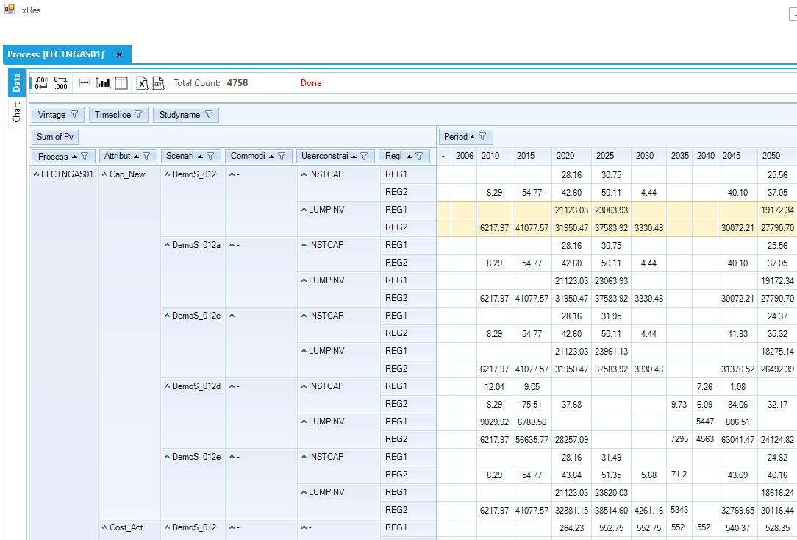{width="6.5in" height="4.40625in"}

[]{#_Toc58401164 .anchor}Figure 25. Results ExRES Facility Component
Detail

### TIMES Attribute Table

The Attribute Master may be accessed from the StartPage or via the
Modules menu. The Attribute Master table (Figure 26) shows all the TIMES
attributes/parameters supported by VEDA2.0.

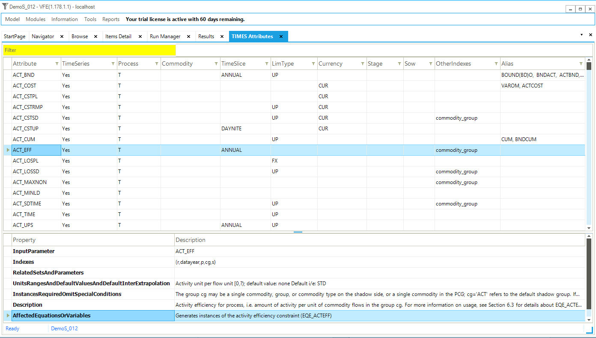{width="6.5in" height="3.6770833333333335in"}

[]{#_Ref455670879 .anchor}Figure 26. Attribute Master Table

The table consists of the following columns:

-   **Attribute**: lists the name of each supported attribute that can
    be used in VEDA2.0 tables;

-   **Years:** specifies whether the attribute can be defined by year
    (YES) or not (NO). For attributes that can be, the color of the cell
    indicates the default tinterpolation/extrapolation (I/E) behavior.
    If green, there is a default I/E applied. If red, there is not;

-   **Commodity/Process:** specifies whether an attribute may be defined
    by commodity, process, or both;

-   **Timeslice:** specifies whether attribute can be defined by
    timeslice and lists any default applied by VEDA2.0;

-   **LimType:** specifies whether a limit type is required (light blue)
    and lists any default applied by VEDA2.0;

-   **Currency:** shows the default currency that will be inserted if
    none is specified;

-   **Stage/SOW:** indicate where this information is required for
    attributes used in the stochastic version of TIMES;

-   **Other_Indexes:** list additional information required by an
    attribute, and

-   **Alias:** lists alternative names for the TIMES attribute that can
    be used in templates.

The Property / Description window at the bottom of the form provides
information from the TIMES Part III model documentation for the selected
attribute. The list may be limited / searched by means of the Filter
field in the upper right part of the pane.

### Managing Sets Specification XLS

> Sets, both TIMES and user-defined, are a central part of TIMES and
> VEDA2.0 in that they facilitate the grouping of RES components
> (commodities and processes) and thereby the preparation of input data
> filtering and Results tables definition essential for effectively
> working with TIMES. for analysis of results. The user establishes and
> maintains their Sets in the Sets-\<model\> Excel workbook in the model
> root folder, the TIMES Sets membership is determined by VEDA2.0 based
> upon how a component is defined to TIMES. There are separate sheets
> for Commodities and Processes, the latter shown in Figure 27.
>
> 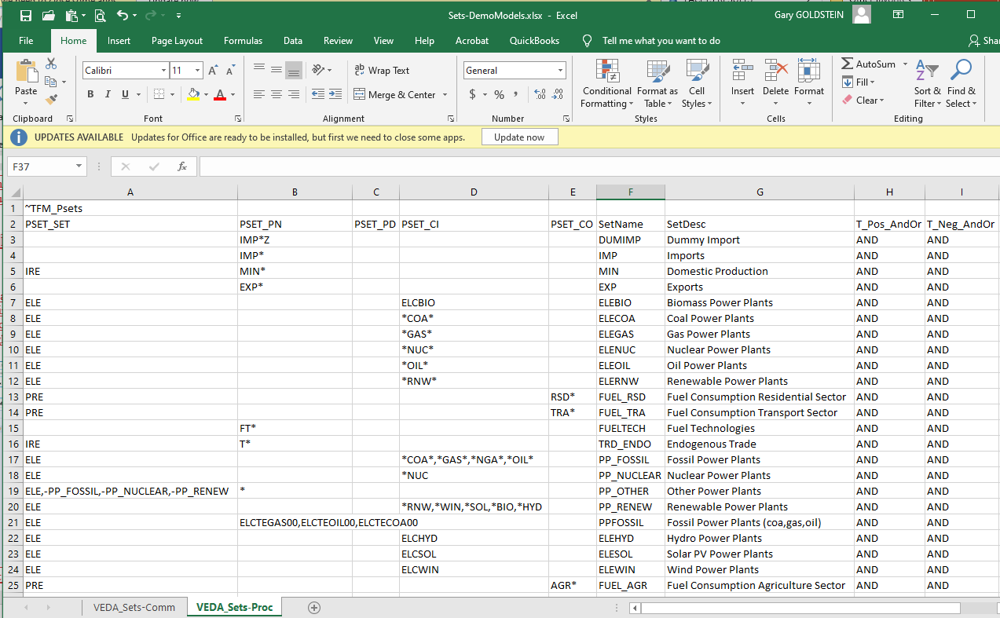{width="6.5in" height="4.020833333333333in"}

[]{#_Ref55986292 .anchor}Figure 27. Sets-\<model\> Rules Workbook

> The Sets rule workbook is accessible via Navigator
> {width="0.84375in" height="0.3125in"} or better
> yet the Tools/SetBrowser which presents the Set definition information
> via a VEDA2.0 cube (Figure 28, TIMES Commodity on the left /
> User-defined Process on the right) for viewing using all the
> filtering/tailoring of the information available throughout VEDA2.0.

{width="3.0208333333333335in"
height="2.7291666666666665in"}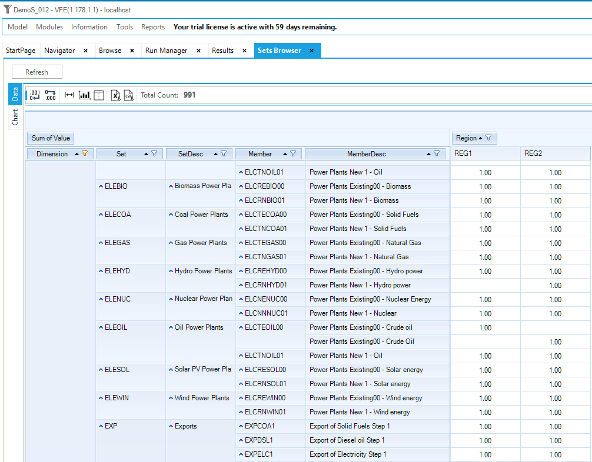{width="3.4791666666666665in"
height="2.7083333333333335in"}

[]{#_Ref55985407 .anchor}Figure 28. Set Brower

> For user-defned Sets double-clicking on a cell associated with a RES
> component / Region opens the Sets-\<model\> workbook where said Set is
> defined. \[Note, a more interactive tool for managing Sets is under
> development.\]

### Advanced VEDA2.0 Facilities

> There are various other menu items that can be observed on the VEDA2.0
> menu bar. These are either beyond the scope of DemoS or advanced
> features of VEDA2.0 that require special licensing (contact
> <Support@KanORS.com>). Each remaining VEDA2.0 is noted below, based
> upon where they are found.

-   Navigator

```{=html}
<!-- -->
```
-   LMA (Last Mile Analytics) Defs are for the web-based VEDA Visualize
    > facility, not employed by the DemoS models.

```{=html}
<!-- -->
```
-   Information

```{=html}
<!-- -->
```
-   VEDA Tags -- indicates where each tilde (\~) specification is found
    > in all the templates of a model (see Figure 6)

-   Model

    -   SYNC Log -- displays All or most recent synchronize
        error/warning log;

    -   NSV Candidates -- the list of templates that VEDA2.0 observes
        that there is No Seed Value (that is direct dependency) between
        scenario files, enabling parallel process during SYNC
        operations, and

    -   UC Set Usage -- displays all templates in which a user-defined
        Set appears.

```{=html}
<!-- -->
```
-   Tools

```{=html}
<!-- -->
```
-   User Options

    -   Syncing options -- indication of how many cores to use during
        SYNC operations for various RES component processing, and

    -   Layout Setting -- check a module and click Delete to reset the
        layout of said pane to its default.

-   Sync App Folder - to copy user-defined stuff like result views and
    > run manager groups and cases.

-   Update TIMES Code -- will check the web for the current version of
    > the TIMES GAMS model generator source code. Note that to use this
    > code for new model runs the Case definitions in the RunManager
    > will need to be changed to the new Source TIMES folder for each
    > one to use said code.

-   Delete Log / Flat File -- get rid of Log files;

-   Convert XLS to XLSX/M -- to convert all templates to XLS/M files,
    > which VEDA2.0 prefers, creating a backup of the XLS instances;

-   Jacobian Analysis -- an Advanced feature to examine the spread of
    > the coefficient range for each model constraint, to assist with
    > scaling of large models -beyond the scope of the DemoS models.

-   Import GDX/VD File -- to bring the GAMS model input or TIMES
    > reporting results into the Browse viewer to examine.

-   View License Information -- shows the current status of the VEDA2.0
    > license and facilitates to registering/updating of licenses.

```{=html}
<!-- -->
```
-   Reports -- is an Advance facility for the creation of special
    results reports, beyond the needs of the DemoS models.

# TIMES DemoS Models

This section explains how to progress in the use of TIMES features and
variants using the set of VEDA-TIMES Demo Models. This is a set of
VEDA-TIMES models that start from an energy balance and focus on
building a model incrementally employing a standard approach to describe
the underlying Reference Energy System (RES) as well as specific naming
conventions.

The first step model starts with a simple supply curve feeding a single
demand. The Demos then grow step by step to build out the RES, adding
new commodities, processes (or technologies) and regions, while
introducing new attributes (or parameters) and more advanced TIMES
modelling features, and explaining the *why* of the different choices
made in VEDA2.0 for building these models.

The VEDA-TIMES Demo Models consist of several incremental steps. Steps 1
to 12 are considered the Basic Demo models (Table 7), and are described
in this section.). For each step, it provides:

-   A brief description of the step model and the objectives in terms of
    > VEDA-TIMES features demonstrated;

-   A summary of attributes introduced and files created, modified,
    > and/or replaced;

-   A step-by-step description of the template tables created and/or
    > modified in each file; and

-   A brief look at the results.

  ---------------------------------------------------------------------------
  **Demo**   **Folder      **Short description**
             name**        
  ---------- ------------- --------------------------------------------------
  001        DemoS_001     Resource supply

  002        DemoS_002     More demand options and multiple supply curves

  003        DemoS_003     Power sector: basics

  004        DemoS_004     Power sector: sophistication

  005        DemoS_005     2-region model with endogenous trade: compact
                           approach

  006        DemoS_006     Multi-region with separate regional templates

  007        DemoS_007     Adding complexity

  008        DemoS_008     Split Base-Year (B-Y) templates by sector: demands
                           by sector

  009        DemoS_009     SubRES sophistication (CHP, district heating) and
                           Trans files

  010        DemoS_010     Demand projections and elastic demand

  011        DemoS_011     User SETS in scenario templates

  012        DemoS_012     More modelling techniques
  ---------------------------------------------------------------------------

  : []{#_Ref337287169 .anchor}Table 7. Basic DemoS Models

## DemoS_001 - Resource supply

**Description.** This is the first step and therefore represents a very
simple model that serves as the starting point for the development of a
more complex model: it includes a single supply curve and a single
demand for one commodity in a single region over two time periods.

**Objective**. The objective is to introduce examples of how to
implement in VEDA2.0 templates the most basic types of energy
commodities and processes that are normally part of a typical TIMES
model, along with their respective attributes: a three-step supply
curve, an import and an export option, one generic demand and one demand
process for one energy commodity (i.e. coal).

This first demo is used also to introduce the SysSettings workbook, the
base year template (or VT template), and how to use the most common
VEDA2.0 tables.

  ------------------------------------------------------------------------
  Attributes                               Files Created
  Introduced[^2]                           
  --------------------- ------------------ -------------------------------
  G_DYEAR               EFF                SysSettings

  Discount              AFA                VT_REG_PRI_v01

  YRFR                  INVCOST            

  CUM                   FIXOM              

  COST                  LIFE               

  ACT_BND               DEMAND             
  ------------------------------------------------------------------------

  : []{#_Ref336528826 .anchor}Table 8. Interpolation/Extrapolation Codes
  in TIMES

The first step model is built using only two files: the default
SysSettings file and one B-Y Template (VT_REG_PRI_V01). The base year
transformation file (BY_Trans) is created by default; it is empty at
this stage. Figure 29 shows the VEDA2.0 Navigator (see Section 2.3) for
the DemoS_001. This is the first window you will see when you first open
it, or switch to it from another model to the DemoS_001. Note that the
1^st^ time you'll also need to Synchronize the model before proceeding
to seed the VEDA2.0 database.

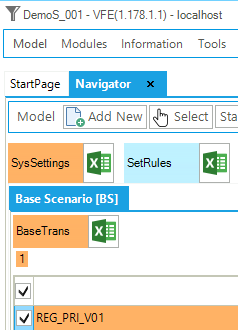{width="1.875in" height="2.6041666666666665in"}

[]{#_Ref450311222 .anchor}Figure 29. Templates Included in DemoS_001

The RES of this first demo can be viewed in VEDA2.0 (by means of the
Item Details see Section 2.5.4), and it is shown in Figure 30. The RES
shows an end-use demand device called DTPSCOA, which uses as its input
the commodity called COA. The COA commodity can be also exogenously
exported outside the model boundary with the export technology called
EXPCOA1. The production of the COA commodity is based on one import
technology (IMPCOA1) and on a three step local supply curve with the
technologies MINCOA1, MINCOA2 and MINCOA3. By double-clicking on any
process the RES will cascade to it, then that procedure can be continued
by double-clicking on the input/output commodities associated with the
process.

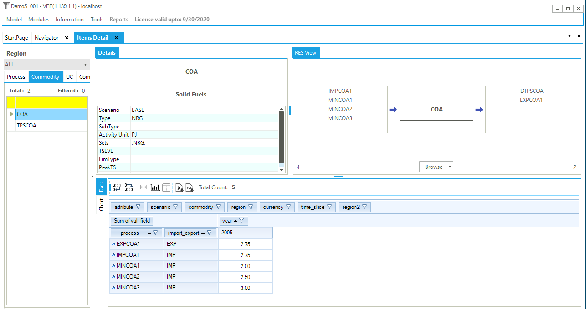{width="6.5in" height="3.4270833333333335in"}

[]{#_Ref456101262 .anchor}Figure 30. Commodity RES (COA) and Item
Details

The next two sections explain VEDA2.0 sheet-by-sheet for the two
templates of this first simple DemoS model how this TIMES model for
delivering the commodity TPSCOA at the minimum cost is built in VEDA2.0.
Note that in the minimal model there is only one region and two files.

### SysSetting template

This file is used to declare the very basic structure of any VEDA-TIMES
model, including its regions, time slices, start year, etc. It also
contains some settings for the synchronization process and can include
some additional information. In this example, this file contains the
following sheets:

-   Region-Time slices;

-   TimePeriods;

-   Interpol_Extrapol_Defaults;

-   Constants

-   Defaults

The key SysSettings Options are shown in Figure 31, and discussed in the
sections that follow according to the sheet in the template they are
found.

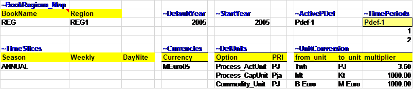{width="6.5in" height="1.3958333333333333in"}

[]{#_Ref55039125 .anchor}Figure 31. Key SysSettings Options (DemoS_001)

#### Region-Time slices

This sheet contains two tables (see Figure 32):

-   \~BookRegions_Map is used to define:

```{=html}
<!-- -->
```
-   The workbook name (here, REG), which needs to be the same for each
    B-Y Template of a region, and

-   The list of model region names (REG1).

```{=html}
<!-- -->
```
-   \~TimeSlices is used to define the time-slice resolution for the
    > model at different hierarchical levels: SEASON, WEEKLY and
    > DAYNITE. In this first step, there is only one time slice defined
    > by the user for the seasonal level and called ANNUAL.

+-----------------------------+----------------------------------------+
| > 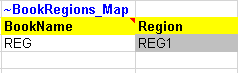    | >                |
+=============================+========================================+
+-----------------------------+----------------------------------------+

: []{#_Ref55198922 .anchor}Table 9. TIMES Results Attributes

[]{#_Ref444526172 .anchor}Figure 32. Regions and Time-slices Definition
in SysSettings

#### TimePeriods sheet

This sheet contains three tables (Figure 33):

-   \~StartYear is used to define the start year of the model (2005 for
    this example and all the other steps).

-   \~ActivePDef is used to select the set of active periods (Pdef-1, by
    default) from all those defined in the following table.

-   \~TimePeriods is used to specify period definitions by specifying
    the number of years for each period. In this step, only a single
    period definition has been created (Pdef-1), which contains 1 year
    for the first period (start year) and 2 years for the second period.

-   \~DefaultYear is used to define the default year of the first
    period. It default to the StartYear.

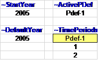{width="2.0416666666666665in" height="1.25in"}

[]{#_Ref455752192 .anchor}Figure 33. Start Year and Time Period
Definition in SysSettings

#### Interpol_Extrapol_Defaults sheet

This sheet normally contains two tables, one for setting user
interpolation rules applied to all the other files, unless the user
specifies new rules in other templates to overwrite this information,
and one for setting the default prices of dummy import processes. There
is only the first table in the current version (Figure 34).

-   **\~TFM_UPD** **ACTCOST**: is a transformation table used to update
    pre-existing data in a rule-based manner. In this example, it sets
    default prices (ACTCOST) for the backstop dummy processes for energy
    commodities (processes with names matching IMP\*Z -- dummy IMPort
    processes ending with "Z") and demands (IMPDEMZ - a dummy IMPDEMZ
    process that can feed any demand). These costs should be a few
    orders of magnitude higher than real import costs in your model in
    order to ensure that these processes only become active when real
    fuel supplies are insufficient or unavailable.

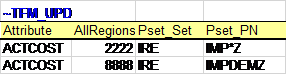{width="2.9791666666666665in"
height="0.7708333333333334in"}

[]{#_Ref455752400 .anchor}Figure 34. Dummy Import Prices in SysSettings

#### Constants sheet

This sheet contains one table (Figure 35):

-   **\~TFM_INS global attributes**: is a transformation table used to
    insert new attributes and values in a rule-based manner. In this
    first step, it is used to declare three new TIMES attributes:

    -   **G_DYEAR** - discounting year; this is a user input and in this
        example is 2005;

    -   **DISCOUNT** - overall discount rate for the energy system,
        including for depreciation of investments; this is a user input
        and in this example is 5% and is constant for the entire
        modelling horizon, and

    -   **YRFR** - fraction of year for each time slice; this is a user
        input and in this example is 100% for the single ANNUAL time
        slice.

{width="4.479166666666667in"
height="0.8645833333333334in"}

[]{#_Ref455754877 .anchor}Figure 35. Global Constants Declarations in
SysSettings

#### Defaults sheet

This sheet contains two tables shown in Figure 36:

-   **\~Currencies**: to define a default currency for the whole model;
    this is a user input. In this example the default unit is million
    2005 euros (MEuro05). \[It is important to note that for TIMES this
    is just a label called MEuro05, it is the user's responsibility to
    be consistent with costs and units in the model.\], and

-   **\~DefUnits**: to define units for activity, capacity and commodity
    for each sector in the model: petajoules (PJ) and petajoules per
    year (Pja) in this case. \[Again, it is the user's responsibility to
    ensure consistency in the units used in any TIMES model. It is
    possible to use any units, but it is important to be coherent across
    the model.\].

-   **\~UnitConversion**: enables unit conversion in the Results module.
    Use a common unit in **to_unit** to declare new conversions. For
    example, for a new energy unit, use PJ in **to_unit**.

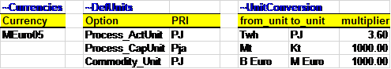{width="5.145833333333333in" height="0.90625in"}

[]{#_Ref455752918 .anchor}Figure 36. Default Currency and Units
Declarations in SysSettings

### SysSetting template

This file is used to declare the very basic structure of any VEDA-TIMES
model, including its regions, time slices, start year, etc. It also
contains some settings for the synchronization process and can include
some additional information. In this example, this file contains the
following sheets:

-   Region-Time slices;

-   TimePeriods;

-   Interpol_Extrapol_Defaults;

-   Import Settings (this sheet is not used in the basic DemoS)

-   Constants

-   Defaults

-   Commodity Group. (This sheet is not used in the basic DemoS. In
    general it can be used to build user commodity groups.)

The key SysSettings Options are shown in Figure 37, and discussed in the
sections that follow according to the sheet in the template they are
found.

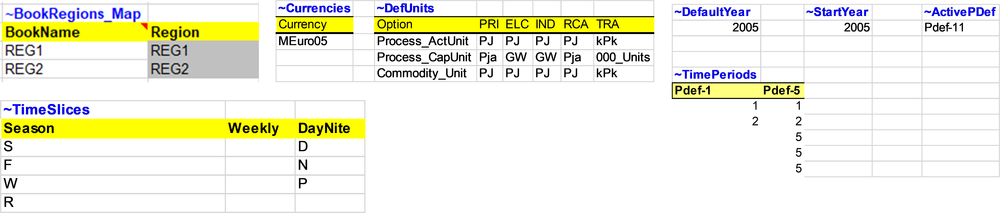{width="6.5in" height="1.3854166666666667in"}

[]{#_Ref58338460 .anchor}Figure 37. Key SysSettings Options (DemoS_012)

#### Region-Time slices

This sheet contains two tables (see Figure 38):

-   \~BookRegions_Map is used to define:

```{=html}
<!-- -->
```
-   The workbook name (here, REG), which needs to be the same for each
    B-Y Template of a region, and

-   The list of model region names (REG1).

```{=html}
<!-- -->
```
-   \~TimeSlices is used to define the time-slice resolution for the
    > model at different hierarchical levels: SEASON, WEEKLY and
    > DAYNITE. In this first step, there is only one time slice defined
    > by the user for the seasonal level and called ANNUAL.

+-----------------------------+----------------------------------------+
| >     | >                |
+=============================+========================================+
+-----------------------------+----------------------------------------+

[]{#_Ref58338195 .anchor}Figure 38. Regions and Time-slices Definition
in SysSettings

#### TimePeriods sheet

This sheet contains three tables (Figure 33):

-   \~StartYear is used to define the start year of the model (2005 for
    this example and all the other steps).

-   \~ActivePDef is used to select the set of active periods (Pdef-1, by
    default) from all those defined in the following table.

-   \~TimePeriods is used to specify period definitions by specifying
    the number of years for each period. In this step, only a single
    period definition has been created (Pdef-1), which contains 1 year
    for the first period (start year) and 2 years for the second period.


[]{#_Toc58401178 .anchor}Figure 39. Start Year and Time Period
Definition in SysSettings

#### Interpol_Extrapol_Defaults sheet

This sheet normally contains two tables, one for setting user
interpolation rules applied to all the other files, unless the user
specifies new rules in other templates to overwrite this information,
and one for setting the default prices of dummy import processes. There
is only the first table in the current version (Figure 34).

-   **\~TFM_UPD** **ACTCOST**: is a transformation table used to update
    pre-existing data in a rule-based manner. In this example, it sets
    default prices (ACTCOST) for the backstop dummy processes for energy
    commodities (processes with names matching IMP\*Z -- dummy IMPort
    processes ending with "Z") and demands (IMPDEMZ - a dummy IMPDEMZ
    process that can feed any demand). These costs should be a few
    orders of magnitude higher than real import costs in your model in
    order to ensure that these processes only become active when real
    fuel supplies are insufficient or unavailable.

{width="2.9791666666666665in"
height="0.7708333333333334in"}

[]{#_Toc58401179 .anchor}Figure 40. Dummy Import Prices in SysSettings

#### Constants sheet

This sheet contains one table (Figure 41):

-   **\~TFM_INS global attributes**: is a transformation table used to
    insert new attributes and values in a rule-based manner. In this
    first step, it is used to declare three new TIMES attributes:

    -   **G_DYEAR** - discounting year; this is a user input and in this
        example is 2005;

    -   **DISCOUNT** - overall discount rate for the energy system,
        including for depreciation of investments; this is a user input
        and in this example is 5% and is constant for the entire
        modelling horizon, and

    -   **YRFR** - fraction of year for each time slice; this is a user
        input and in this example is 100% for the single ANNUAL time
        slice.

{width="4.479166666666667in"
height="0.8645833333333334in"}

[]{#_Ref58338334 .anchor}Figure 41. Global Constants Declarations in
SysSettings

#### Defaults sheet

This sheet contains two tables shown in Figure 42:

-   **\~Currencies**: to define a default currency for the whole model;
    this is a user input. In this example the default unit is million
    2005 euros (MEuro05). \[It is important to note that for TIMES this
    is just a label called MEuro05, it is the user's responsibility to
    be consistent with costs and units in the model.\], and

-   **\~DefUnits**: to define units for activity, capacity and commodity
    for each sector in the model: petajoules (PJ) and petajoules per
    year (Pja) in this case. \[Again, it is the user's responsibility to
    ensure consistency in the units used in any TIMES model. It is
    possible to use any units, but it is important to be coherent across
    the model.\].

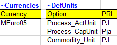{width="2.4375in" height="0.9479166666666666in"}

[]{#_Ref58338260 .anchor}Figure 42. Default Currency and Units
Declarations in SysSettings

### SETS template

The Sets-DemoModels template is used to build user sets (groups) of
processes and/or commodities. In this example a commodity set is created
(\~TFM_Csets) called NRG_SOLID (column SetName) and described as Solid
Fuels (column SetDesc). The column Cset_CD (as in any \~TFM table) is
used to define the elements that belongs to the set base on the
commodity set description so in this example all the commodities that
start with any character, SOLID in the middle of the description, and
end with any character (\* is used as a wildcard).

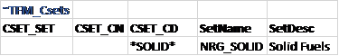{width="3.8958333333333335in"
height="0.6354166666666666in"}

### B-Y Template

The B-Y templates are used to set up the BASE scenario structure of the
model, and in principle it is possible to build a full model using just
B-Y templates. This is the approach used for this first example. Later
when the model grows to include more commodities, technologies, sectors,
regions, and additional information to run different scenarios, we will
demonstrate the flexibility and modularity of VEDA2.0 using different
types of workbooks to input information.

Each B-Y template in the DemoS examples contain worksheets that identify
the RES depicted and energy balance used. In this first example the B-Y
Template (VT_REG_PRI_V01) is used to set up the base-year process stock
and the base-year end-use demand levels, such that the overall energy
flows reflect the energy balance.

#### RES&OBJ sheet

This sheet shows the RES covered and the normal completion of a run
VEDA2.0with the value of the objective function as reported at the end
of the run in VEDA2.0 and the same value in the Results table.

#### EnergyBalance sheet

This sheet contains the energy balance for the model start year (2005)
for REG1 (Figure 43). The energy balance in itself is not imported into
the model; the table is not identified with any VEDA table header (cell
starting with the character "\~"). However, it allows the user to
calibrate the model start year with appropriate historical energy flows.
A typical energy balance comprises two dimensions:

-   Different types of energy commodities in columns. In this simple
    example, the different types of energies are partially aggregated in
    categories (e.g. solid fuels, renewable energies, etc.). The first
    row of the table includes codes defined by the modeller that are
    used to name the energy commodities in the model.

-   Components of the entire supply-demand chain is reflected in rows.
    This simple example shows three main sections: primary energy
    supply, energy conversion and final energy consumption. For each
    energy commodity, the primary energy supply minus the energy used
    for conversion yield the remainder for final energy consumption. The
    first column of the table includes codes specified by the modeller
    that are used to designate the various sectors and then used as part
    of naming energy processes in a uniform manner in the model.

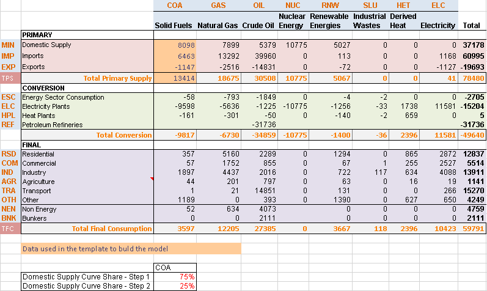{width="5.989583333333333in"
height="3.5833333333333335in"}

[]{#_Ref444526230 .anchor}Figure 43. Initial Energy Balance at Start
Year (2005) for REG1 in DemoS_001

The portion of the energy balance that is developed in each step model
is identified using the color orange: here is this first step primary
supply of solid fuels (COA).

Shares are provided below the energy balance table to split the total
domestic production of solid fuels (COA) into more than one step. This
way, it is possible to set up in the model a supply curve defined by the
maximum production and cost of each step. A greater level of
disaggregation can be added along both commodity and sector dimensions
using additional data sources and user assumptions.

#### Pri_COA

This sheet shows how to declare commodities and processes (in their
respective declaration tables) and to describe specific supply processes
(in a flexible import table): primary supply of solid fuels (COA) in
this example.

In any TIMES model, all commodities and processes in the model need to
be declared once in commodity tables (identified with \~FI_Comm) and
process tables (identified with \~FI\_ Process) with a structure as
explained in Sections 2.4.2 and 2.4.3 and shown in Figure 44 and Figure
45.

{width="6.0in" height="0.65625in"}

[]{#_Ref444526251 .anchor}Figure 44. A Typical Commodity Declaration
Table

{width="5.78125in" height="1.25in"}

[]{#_Ref444526259 .anchor}Figure 45. A Typical Process Declaration Table

Unlike the tables used to declare commodities and processes, the tables
used to describe specific processes are very flexible (\~FI_T). They are
built using first **Row** **ID column headers** before and below the
\~FI_T tag to identify the process names (TechName), descriptions
(TechDesc), commodity inputs (Comm-IN), and commodity outputs
(Comm-OUT), as well as the years of data (Year) when relevant. Then
**Data column headers** after the \~FI_T are used to provide the data
describing the processes. The number and arrangement of rows and columns
is totally flexible in these tables. More information about the \~FI_T
tables is available in Section 2.4.4.

In the first model step, a flexible import table is used to describe the
primary supply options for COA (Figure 46):

-   A 3-step domestic coal supply curve through three mining processes
    (MINCOA\*), each characterized with the cumulative amount of
    resources available over the modelling horizon (CUM), the annual
    cost per unit of energy (COST) and a bound on the annual production
    (ACT_BND) for the start year 2005 and the following period 2006.
    Bounds need to be combined with the LimType (UP), which is indicated
    in a specific column in this example. When not specified, it is UP
    by default (see Attribute Master Table, Section ).

-   Import and export options are characterized with the COST and
    ACT_BND attributes.

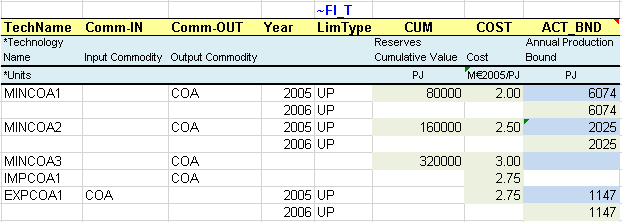{width="5.135416666666667in"
height="1.8333333333333333in"}

> \*Blue cells are linked to the energy balance.

[]{#_Ref444526269 .anchor}Figure 46. Description of Supply Options in a
Flexible Table

#### DemTechs_TPS

This sheet shows how to declare commodities and processes (in their
respective tables) and to describe specific demand processes (in a
flexible import table): a demand process to deliver the total primary
supply coal demand, in this example.

A new DEM commodity (TPSCOA -Demand Total Primary Supply -- COA) and a
new DMD process (DTPSCOA -- Demand technology Total Primary Supply --
COA) are declared in the commodity and process tables (Figure 47), as
described in the previous section.

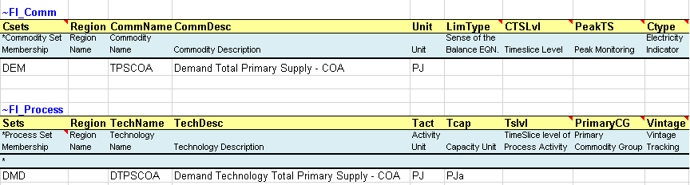{width="6.489583333333333in" height="1.75in"}

[]{#_Ref444526286 .anchor}Figure 47. Declaration of Demand Commodity and
Process

A flexible import table is used to provide the data depicting the demand
option for total solid fuels (Figure 48).

-   A demand process for the total primary supply of COA (DTPSCOA) is
    characterized with an efficiency (EFF), an annual availability
    factor (AFA), an investment cost (INVCOST), a fixed operation and
    maintenance cost (FIXOM), and a technical lifetime (LIFE). By
    default this technical lifetime is also used as the economic
    lifetime, unless a specific economic lifetime (ELIFE) is defined.

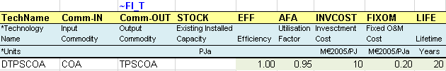{width="5.71875in" height="0.9166666666666666in"}

[]{#_Ref336348252 .anchor}Figure 48. Description of a simple demand
processes

#### Demands

This sheet is used to specify the demand (DEMAND) value for the TPSCOA
for the base year 2005 (Figure 49). This value comes from the energy
balance and represents the total final COA consumption and the total
consumed for energy conversion. This demand is constant over the time
horizon of the analysis due to the default interpolation/extrapolation
applied to the attribute Demand. The future values can be changed by
specifying new inputs for the future years/periods.

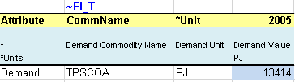{width="3.4479166666666665in" height="0.96875in"}

> \*Blue cells are linked to the energy balance. Here, the demand value
> is equivalent to the sum of Total Conversion plus Total Final
> consumption.

[]{#_Ref444526298 .anchor}Figure 49. Definition of Base Year Demand
Values

### Solving the Model

The model is solved via the Run Manager (**invoked via the StartPage,
Modules/RunManager or \[F9\]**), explained more in detail in Section
2.5.5.

For all models of DemoS, all cases (runs) are pre-defined by default
(Figure 50) with a name and a description (here, DemoS_001; Demo Step
001), the components to be included in the run (BASE, SysSettings), the
Regions (REG1), the Ending Year (2006), and the Period Defs (Pdef-1). It
is important to note that the BASE component represents all the base
year information included in all B-Y Templates together (only
VT_REG_PRI_V01 in this example).

The optimizer options (**CPLEX button**) and the model variants
(**Control Panel**) are also set by default. The model can be launched
by clicking the **SOLVE** button. The model will be solved using the
TIMES source code indicated under **GAMS Source Code** **folder** and
the results files stored in the folder indicated below **GAMS Work
folder**.

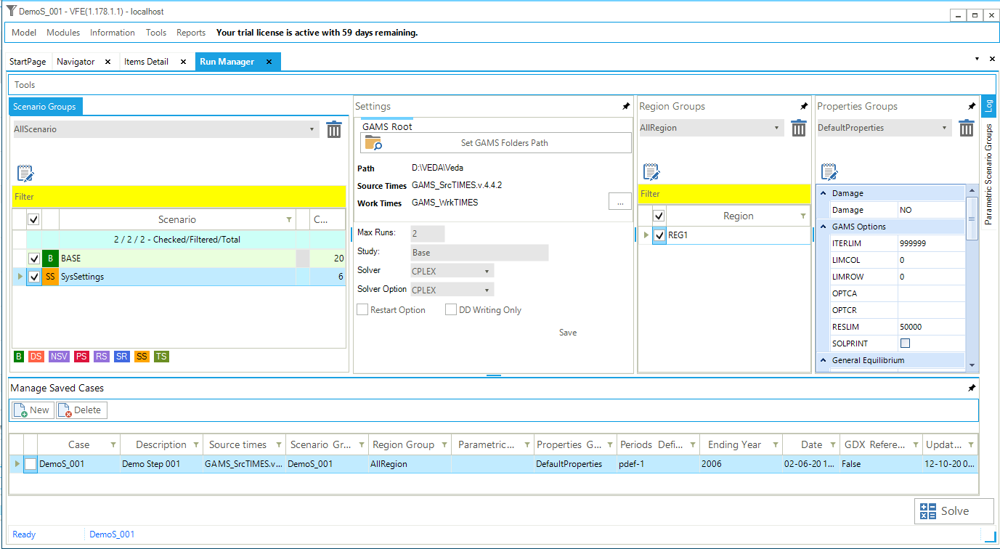{width="6.5in" height="3.5625in"}

[]{#_Ref455757151 .anchor}Figure 50. VEDA2.0 Run Manager to Submit Model
Runs

### Analysis via Results Module

The results of a model run in VEDA2.0 can be imported into the Results
manager upon activating it from the StartPage, Modules menus or {f10\]
key. If the Results form is already open, and new runs submitted, then
the {width="0.1875in" height="0.1875in"}refresh in
the upper right can be used to reload the data.

The list of pre-defined tables can be seen by pressing
{width="0.22916666666666666in"
height="0.2604166666666667in"} at the top right of the form. To view a
particular table(s), scroll down/up the list and select it (them), then
click the **Load** button. The table will open with a pre-defined layout
that can than be modified in a very flexible manner. Not all of the
tables can be used for the first demo steps, in which only few results
and information will be available. If a Results table is inconsistent or
empty you will get a pop up message saying that table is empty.

The Results tables that can be checked for the first DemoS are listed in
Figure 51, and then each described below.

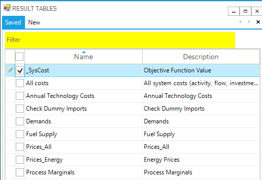{width="4.083333333333333in"
height="2.8020833333333335in"}

[]{#_Ref55040586 .anchor}Figure 51. List of DemoS_001 Results Tables

-   \_\_Check Dummy Imports (Figure 52)

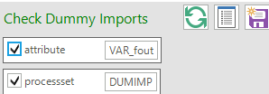{width="3.1041666666666665in"
height="1.0833333333333333in"}

[]{#_Ref456106094 .anchor}Figure 52. \_\_Check Dummy Imports

-   In an healthy model this table should be empty. If not, it means the
    model has some infeasibilities and is using some dummy technologies
    (built by default in VEDA2.0) to satisfy the commodity/demand
    production.

-   This table is built by selecting the attribute VAR_FOUT and the
    ProcessSet DUMIMP (this is a user-defined process set).

```{=html}
<!-- -->
```
-   \_System Cost Tables

    -   This table (Figure 53), built selecting the attribute Reg_Obj,
        shows the total system cost discounted to the G_DYEAR defined in
        the SysSettings file (in this example 2005). Figure 54 shows the
        total system cost in million euros for the model run to 2006,
        based on two periods (2005 and 2006) for a total of three years.

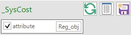{width="2.8020833333333335in" height="0.75in"}

[]{#_Ref456106115 .anchor}Figure 53. \_SysCost Results Table Definition

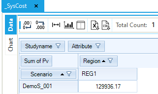{width="3.34375in" height="1.9895833333333333in"}

[]{#_Ref456106233 .anchor}Figure 54. Total System Cost in DemoS_001

-   The Scenario label shows the scenario name (DemoS_001) for the run
    we are viewing, while under the column Region we see the region name
    (REG1) and the value of the objective function. The column Total is
    shows the total by row (over regions). In this case, we only have
    the single region REG1, so the value is the same.

-   The \_SysCost table provides a key model run indicator. In TIMES
    models, the Objective-Function is to minimize the total discounted
    cost of the system, properly augmented by the 'cost' of lost demand
    (when using the elastic demand features). See Parts I and II of the
    TIMES documentation for more on the model objective function.

```{=html}
<!-- -->
```
-   All costs

    -   This table can be used to show the undiscounted cost elements of
        the model solution (Figure 55).

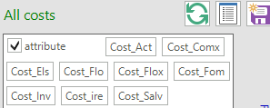{width="3.09375in" height="1.2395833333333333in"}

[]{#_Ref456105963 .anchor}Figure 55. All Costs Results Table Definition

-   The cost elements, each an individual attribute selected in the
    table definition, comprise capital costs for investing in and/or
    dismantling processes (Cost_Inv), fixed O&M costs (Cost_Fom),
    activity costs (Cost_Act), flow costs including import and export
    prices (Cost_Flo), implied costs of endogenous trade (Cost_ire),
    taxes and subsidies (Cost_Flox, Cost_Comx), salvage value of
    processes and commodities at the end of the planning horizon
    (Cost_Salv), and welfare loss resulting from reduced end-use demands
    (Cost_Els).

-   The undiscounted cost elements (in million euros) that are part of
    the solution for this first step for REG1 are shown below (Figure
    56). \[Note that the "fit" button
    (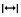{width="0.21875in"
    height="0.17708333333333334in"}) was applied once the table was
    loaded.\]

> 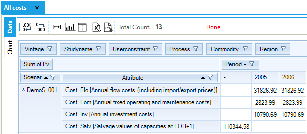{width="5.46875in"
> height="2.3958333333333335in"}
>
> []{#_Ref456106647 .anchor}Figure 56. All System Costs Results by
> Component

-   The attribute column in this case shows both the attribute name and
    description, while the Period columns show the value of each
    attribute in each model period, except the salvage value
    (Cost_Salv), which does not take a period index.

```{=html}
<!-- -->
```
-   Demands

    -   The Demands able (Figure 57) is used to show the energy service
        demand(s). In this case there is only the single demand called
        TPSCOA, which is in PJ (Figure 58).

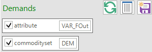{width="3.1354166666666665in"
height="1.0833333333333333in"}

[]{#_Ref456106893 .anchor}Figure 57. Demands Table Definition

-   The Demands table shows, from left to right, for the scenario
    DemoS_001, region REG1, process (or technology) DTPSCOA, a flow out
    (Var_FOut -- production or output from the process) for the
    commodity Demand Total Primary Supply -- COA (TPSCOA), the values
    for the periods 2005 and 2006.

> 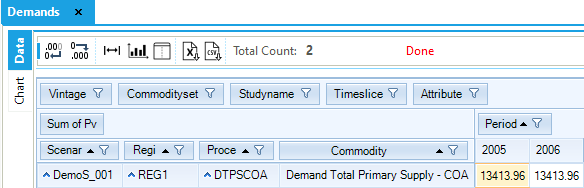{width="5.53125in" height="1.78125in"}

[]{#_Ref456107018 .anchor}Figure 58. TPSCOA Demand Results Table

-   Fuel Supply

    -   The Fuel Supply table (Figure 59) is built selecting the
        attribute VAR_FOut (flow out) and the process set IRE (that
        includes all the process defined in \~FI_PROCESS tables as MIN,
        IMP and EXP). In other words, this table can be used to check
        the output from all the processes that belong to import and
        mining sets. The export process is characterised with an input
        and not an output, so it not possible to check the behavior of
        the export process by selecting only VAR_FOut.

    -   The COA demand is met in a significant proportion with imports
        (6,462.67 PJ) and the rest with domestic resources through the
        first two steps of the supply curve. (The third step is not
        used, because it has higher COST than the imports, see Figure
        60.) The demand and supply balance of COA is constant between
        2005 and 2006, as described above in Section 3.1.4.5.

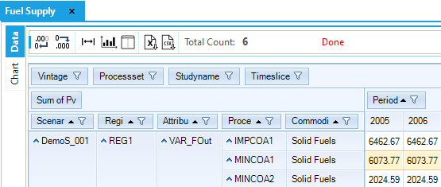{width="5.78125in" height="2.4479166666666665in"}

[]{#_Ref456107947 .anchor}Figure 59. Fuel Supply Results Table

-   In this example the marginal technology, that is, the technology
    that would produce the next additional unit of the COA commodity, is
    the import technology. This information will be reflected in the
    commodity marginal price for COA, which will be equal to the
    production cost of the COA commodity from the marginal technology.

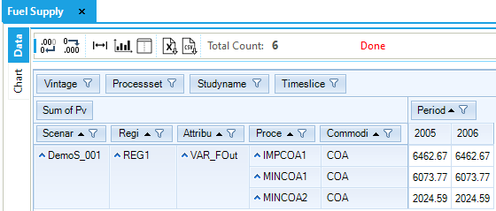{width="5.833333333333333in"
height="2.4895833333333335in"}

[]{#_Ref456108122 .anchor}Figure 60. Fuel Supply results by process and
period

-   Prices

    -   The Prices_All table (Figure 61), built selecting the attribute
        EQ_CombalM, can be used for showing commodities' marginal prices
        in the run.

{width="2.8020833333333335in"
height="0.6979166666666666in"}

[]{#_Ref456108491 .anchor}Figure 61. Marginal prices Results Table

-   As noted above, the marginal price of COA (solid fuels) is the same
    as the production cost from the marginal technology (import of solid
    fuels). In this example, it is 2.75 MEuro/PJ in both periods (Figure
    62). The marginal price of TPSCOA (Demand Total Primary Supply --
    COA) in 2005 depends on the new capacity investment that must happen
    in that year to serve the demand. The marginal price for 2005 can be
    calculated by taking in account the marginal prices of the solid
    fuels commodity, the investment cost of the demand technology, the
    operating cost for the demand technology, and finally the salvage
    cost. In 2006 there isn't any new investment, so the marginal price
    will be only a function of the fuel cost.

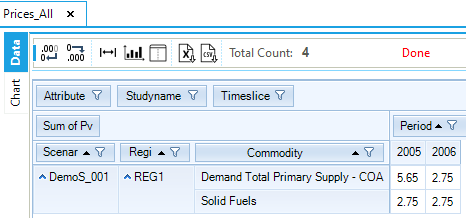{width="4.854166666666667in"
height="2.2708333333333335in"}

[]{#_Ref456108695 .anchor}Figure 62. Marginal Prices for DemoS_001
Commodities

## DemoS_002 - More Demand Options and Multiple Supply Curves

**Description.** The second step model includes a greater number of
supply, demand, import and export options for additional commodities in
a single region over two time periods.

**Objective**. The objective is to show how to expand the model with
more examples of commodities (energy and emissions) and of typical
processes along with their respective attributes, including emission
coefficients. On the supply side, it includes more three-step supply
curves (e.g., for oil & gas in addition to coal), extraction processes,
and import and export options, as well as the introduction of new sector
fuel processes (processes used to change fuel names into sectoral
commodity names). The demand side is also expanded with the presentation
of two demands for energy services (residential and transportation) and
corresponding end-use devices in each sector. Emission commodities (e.g.
CO~2~) and emission tracking are also introduced at the end-use device
level in both the residential and transport sectors.

  -----------------------------------------------------------------------
  Attributes Introduced                 Files Updated
  ------------------------------------- ---------------------------------
  STOCK                                 VT_REG_PRI_v02

  ENV_ACT                               

  START                                 
  -----------------------------------------------------------------------

**Files**. The second step model is built by modifying the B-Y Template
(VT_REG_PRI_V02) to add processes as well as energy and emission
commodities. The SysSettings file is the same as in the DemoS_001.

### B-Y Templates

#### EnergyBalance sheet

The energy balance is the same as in the first step although a larger
portion is covered in this second step model (Figure 63). In addition to
the primary supply of solid fuels (COA), the model covers the primary
supply of natural gas (GAS) and crude oil (OIL) as well as the demand
for GAS and OIL in the residential and transportation sectors (rather
than for the aggregated primary supply as for COA).

A higher degree of disaggregation is also provided. On the supply side,
the same level of disaggregation as for COA is provided for GAS and OIL,
with shares to split the total domestic production in more than one
step. On the demand side, fuel consumption is split by sector and by end
use in the residential sector (space heating, appliances, and other).
GAS is allocated at 100% to the Other end use in the residential sector
and OIL at 100% to the single end use D1 in the transportation sector.

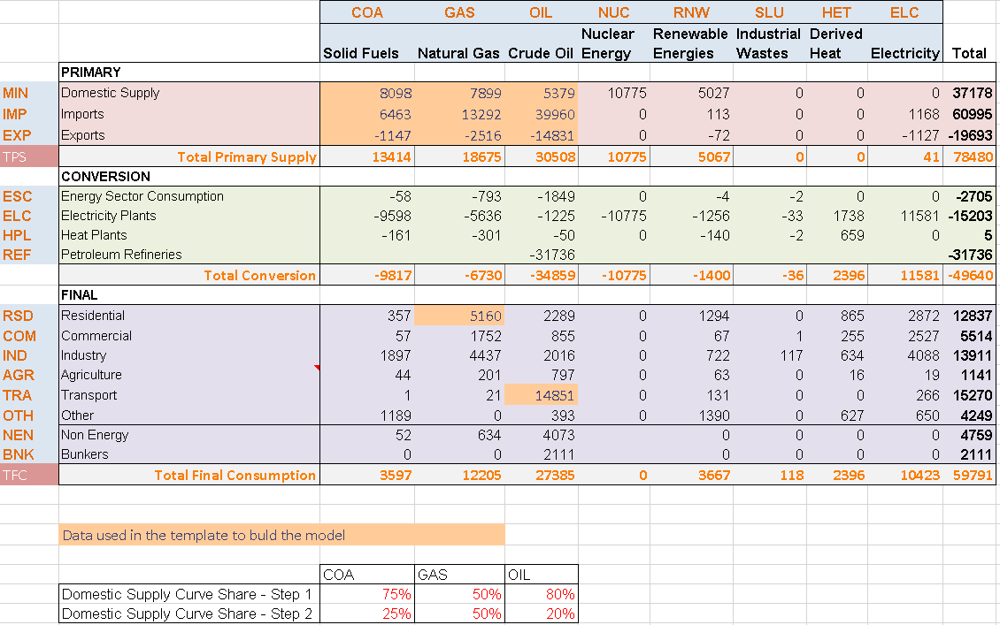{width="6.0in" height="3.75in"}

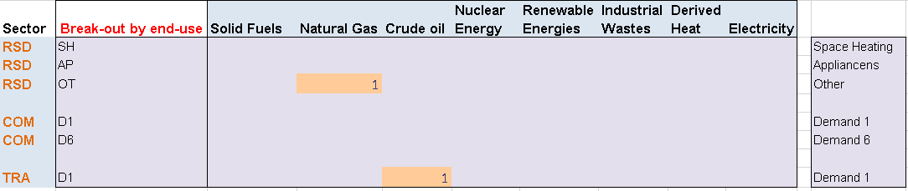{width="6.0in" height="1.2708333333333333in"}

[]{#_Ref444526391 .anchor}Figure 63. Energy balance at start year 2005
for REG1 -- Covered in DemoS_002

#### Pri_COA/GAS/OIL sheets

These new Pri_GAS and the Pri_OIL sheets have exactly the same structure
as the Pri_COA sheet (which has not been modified from the first step)
including:

-   A commodity table to declare additional energy commodities (NRG):
    GAS - Natural gas (PJ) and OIL - Crude oil (PJ).

-   A process table to declare additional supply options for GAS and
    OIL: mining processes (MINGAS\* and MINOIL\*), import processes
    (IMPGAS1, IMPOIL1), and export processes (EXPGAS1, EXPOIL1).

-   A flexible import table to describe the primary supply options for
    GAS and OIL: 3-step domestic supply curves through three mining
    processes, as well as import and export options. All are
    characterized with the same attributes.

#### Sector_Fuels sheet

This is a new sheet that is used to construct sector fuel processes
(FTE-\*), which produce sector fuels from primary fuels, e.g.: GAS
becomes RSDGAS and OIL becomes TRAOIL in this example (Figure 64). This
is done to make it easy to track fuel consumption at the sectoral level
as well as to add sectoral emissions (which could be constrained
separately). These technologies can be also used to add additional
information on the sectoral commodities, for example additional costs to
simulate a sectoral tariff for GAS or an investment cost to simulate new
investments in infrastructure and so on. The same approach is used to
declare the new commodities and processes in their respective tables.

{width="3.9791666666666665in" height="1.15625in"}

[]{#_Ref444526408 .anchor}Figure 64. Introduction of Sector Fuel
Processes

#### DemTechs_RSD and DemTechs_TRA sheets

Demand processes (DMD) are introduced in these sheets (Figure 65). They
consume an energy commodity (RSDGAS, TRAOIL) to produce directly the
energy service commodity: residential--other (DROT) and transport (DTD1)
in this example. In both sectors, there are existing (ROTEGAS and
TOTEOIL) and new processes (ROTNGAS and TOTNOIL).

-   The existing processes are characterized with their existing
    installed capacity (STOCK), corresponding in this case to the energy
    consumption required to produce these energy services in the base
    year as given by the energy balance and the additional fuel split
    assumptions. They also have an efficiency (EFF), an annual
    availability factor (AFA) and a life time (LIFE).

-   Existing processes characterised in VEDA B-Y Templates with a base
    year STOCK can not increase their capacity endogenously through new
    investment because when synchronizing the templates, by default
    VEDA2.0 inserts the attribute NCAP_BND with
    interpolation/extrapolation rule number 2, setting an upper bound of
    EPS (epsilon, or effectively zero) for all years. (For more
    information on interpolation/extrapolation see Table 8 in Section )
    New technologies thus are needed to replace the existing capacity as
    it retires or increase the amount of capacity available after the
    base year.

-   The new processes do not have an existing installed capacity, but
    they are available in the database to be invested in to replace the
    existing ones and meet the demand for energy services. They are
    characterized with an investment cost (INVCOST), a fixed operation
    and maintenance cost (FIXOM), and the year in which they become
    available (START). The model can invest in these new technologies
    only beginning in that START year.

-   Finally, emission commodities (ENV) are also introduced along with
    these processes: CO2 emissions in the residential (RSDCO2) and the
    transport (TRACO2) sectors in this example (in kt). An emission
    coefficient (ENV_ACT in kt/PJ~output~) is provided for each process
    based on the technology output. It is also possible to define
    emissions coefficients based on fuel input (see Section ).

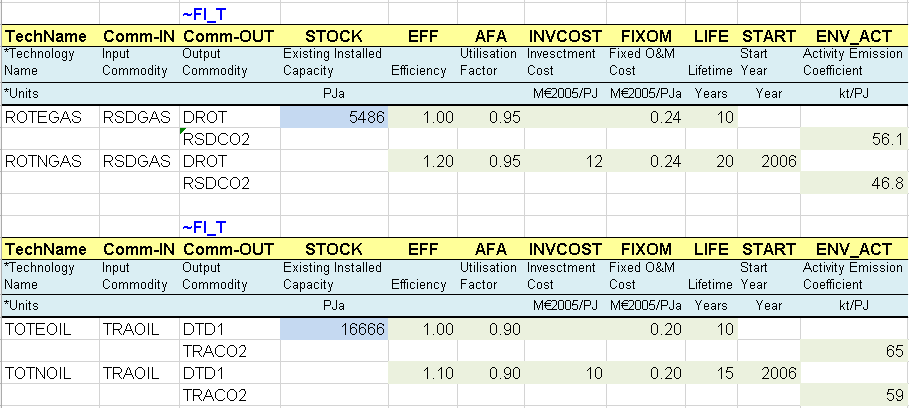{width="5.40625in" height="2.4166666666666665in"}

[]{#_Ref456189801 .anchor}Figure 65. End-use Demand Processes

#### Demands sheet

The demand table is expanded to include the demand for the new energy
services created at this step: residential--other (DROT) and transport
(DTD1). The 2005 values come from the energy balance sheet and then will
be constant, as explained in Section 3.1.4.5, until new data is input
for future years.

### Results

There are more demands for energy services (Figure 66) and fuel supply
options (Figure 67) in this second step model compared with the first
step. Also, a new piece of information available at this second step is
CO2 emissions by sector (Figure 68), which are computed from the input
coefficients provided for each process and the activity of each process.
These three tables can be viewed in the same way as explained for
DemoS_001, and if results for both DemoS_001 and DemoS_002 have been
imported, then it will be possible to see and compare results for the
two scenarios. \[Note that in order to get the DemoS_001 results into
the DemoS_002 database the Tools/Import VD files option must be used to
grad them from the GAMS_WrkTIMES subfolder for the model.

The main findings from the results analysis are:

-   The domestic demand for transportation (DTC1) represents the major
    proportion (44%) of total domestic demand for energy. This sector
    relies on oil and also accounts for the largest part of the CO2
    emissions (TRACO2), although no coefficient was provided for solid
    fuels combustion emissions.

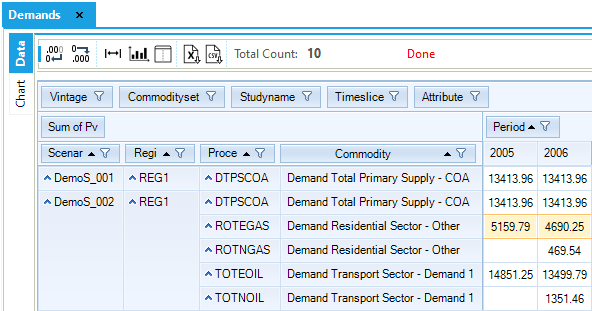{width="6.166666666666667in"
height="3.2395833333333335in"}

[]{#_Ref456190416 .anchor}Figure 66. Results - Demands Results Table for
DemoS_002

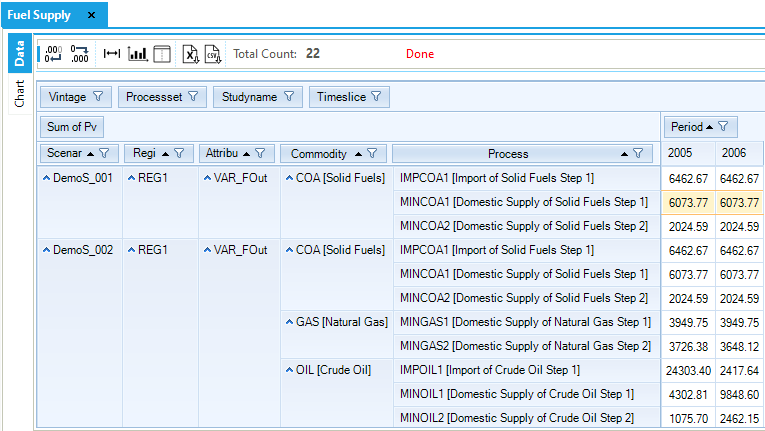{width="6.5in" height="3.6666666666666665in"}

[]{#_Ref444526439 .anchor}Figure 67. Results -- Fuel Supply Results
Table for DemoS_002

-   The demand for residential--other (DROT) and transportation (DTC1)
    is first fully satisfied with the existing demand processes (ROTEGAS
    and TOTEOIL) in the base year 2005, but the new demand processes
    (ROTNGAS and TOTNOIL) start penetrating in 2006. The new processes
    are more efficient and require less energy to satisfy the demand.
    The existing processes satisfy less demand in 2006 because their
    STOCK in 2006 is lower than in 2005. The STOCK decreases between the
    base year value and zero linearly over the technical LIFE. For
    example, for ROTEGAS the base (2005) stock is 5486 PJ and will be
    zero in 2015 (because the residual technical life is 10 years). The
    stock value between 2005 and 2015 is linearly interpolated between
    5486 PJ and 0 PJ.

-   A large proportion of the oil imported in 2005 is destined to export
    markets (exports reach their upper limit because the export price is
    no higher than that of the marginal oil supply, the import price),
    while in 2006 the demand from export markets decreases to zero and
    more oil is produced domestically to meet the domestic demand for
    transportation oil.

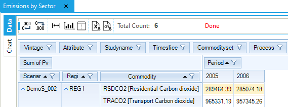{width="5.927083333333333in"
height="2.1979166666666665in"}

[]{#_Ref444526444 .anchor}Figure 68. Results -- Emissions by Sector
Results Table for DemoS_002

**Objective-Function** = 496 637 M euros (see the \_SysCost table).

All the system cost components can be seen from the Results table **All
costs**. As the model includes different types of energy commodities, it
is relevant to have a look at their respective marginal prices (Figure
69). Marginal prices of oil are the highest due to higher production
costs and import prices. Marginal (shadow) prices for process activity
(Figure 70) allow us to understand why the third step of the supply
curve for fossil fuels (MINCOA3, MINGAS3, MINOIL3) are not part of the
optimal solution, as they are more expensive. For example the VAR_ActM
for MINCOA1 is -0.75. This means that if we relax the upper activity
bound of this technology of by GJ than the objective function will
decrease by 0.75 euros, while forcing the production of 1 GJ from
MINCOA3 will increase the objective function by 0.25 euros.

In TIMES, the shadow prices of commodities play a very important
diagnostic role. If some shadow price is clearly out of line (i.e., if
it seems much too small or too large compared to anticipated market
prices), this indicates that the database may contain some errors. For
instance, if the shadow price of a commodity is zero and the quantity
supplied is non zero, as pointed out by the second theorem of Linear
Programming, it means that there is more supply than demand for that
commodity. The examination of shadow prices is just as important as the
analysis of the quantities produced and consumed of each commodity and
of the technological investments.

{width="4.78125in" height="3.25in"}

[]{#_Ref444526454 .anchor}Figure 69. Results -- Prices_Energy Results
Table for DemoS_002

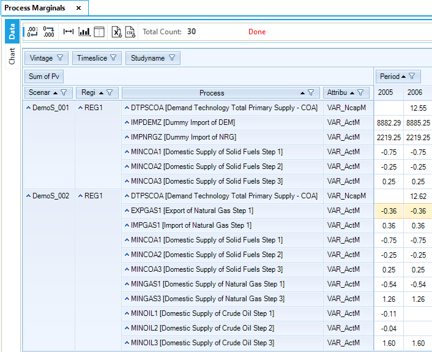{width="6.5in" height="5.291666666666667in"}

[]{#_Ref444526472 .anchor}Figure 70. Marginal Price of Process Activity
Table in DemoS_002

## DemoS_003 - Power Sector: Basics

**Description.** The third step model demonstrates the modelling of a
simple power sector in a single region over more than two time periods.
From the base year of 2005, the time horizon is expanded from 2006 to
2020.

**Objective**. The objective is to show how to model a typical power
sector with different types of power plants (e.g., thermal, nuclear and
renewable) along with their respective attributes and the transmission
efficiency of the network. Other objectives are to add more time
periods, to show how to project future demands (e.g. constant or
growing), and to explain the powerful interpolation/extrapolation rules
existing in VEDA-TIMES, as well as the difference between model years
and data years.

  -----------------------------------------------------------------------
  Attributes Introduced                 Files Updated
  ------------------------------------- ---------------------------------
  COM_IE                                SysSettings

  CAP2ACT                               VT_REG_PRI_v03
  -----------------------------------------------------------------------

**Files**. The third step model is built by modifying:

-   the SysSettings file to add more time periods and declare the
    transmission efficiency of the electricity network.

-   the B-Y Template (VT_REG_PRI_V03) to model the power sector and
    insert interpolation/extrapolation rules.

### SysSettings file

#### TimePeriods sheet

The \~TimePeriods table is used to extend the time horizon of the model
by adding three active periods of five years each (Figure 71). These
specifications are saved as a new time period definition (Pdef-5). The
time horizon is extended to 2020, with the milestones years being 2005,
2006, 2010, 2015 and 2020.

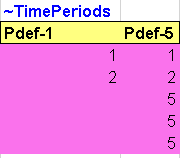{width="1.5in" height="1.3125in"}

[]{#_Ref444526503 .anchor}Figure 71. New time periods definition in the
SysSettings file

With the introduction of the interpolation/extrapolation rules, it is
possible to run the model on a longer time horizon without having to
declare data values for all periods up to 2020.

#### Constants sheet

The transformation table is also used to insert a new constant in the
model: the transmission efficiency (COM_IE) for the electricity (ELC)
commodity in REG1 (Figure 72).

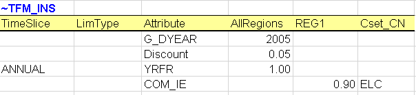{width="4.395833333333333in"
height="1.0104166666666667in"}

[]{#_Ref444526515 .anchor}Figure 72. New constant declarations in the
SysSettings file

### B-Y Templates

#### EnergyBalance sheet

The energy balance is the same as in the second step although a larger
portion of it is covered in this third step model (Figure 73). The
energy used for conversion into electricity and the total electricity
generation are now included.

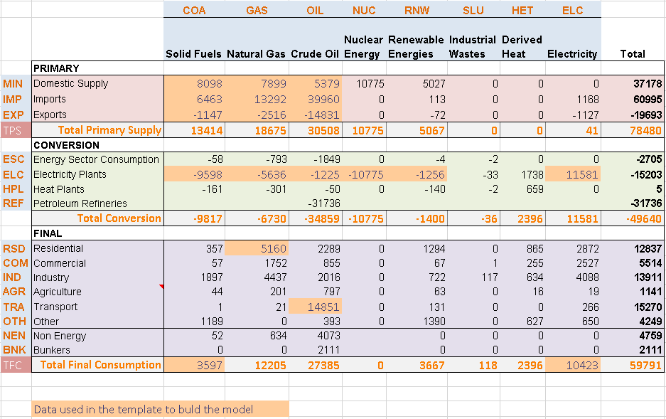{width="5.96875in" height="3.75in"}

[]{#_Ref444526521 .anchor}Figure 73. Energy Balance at Start Year (2005)
for REG1 -- Covered in DemoS_003

#### Pri_COA/GAS/OIL sheets

These sheets were all modified in a similar way to show the use of
interpolation/extrapolation rules in VEDA-TIMES (Figure 74). With the
introduction of the interpolation/extrapolation rules, it is possible to
run the model for a longer time horizon without having to declare data
values for all periods up to 2020.

To activate an interpolation/extrapolation (I/E) rule for a specific
process, insert a data row and write a \"0\" as the Year. In this
example, an interpolation/extrapolation rule will be enabled for the
processes MINCOA1, MONCOA2 and EXPCOA1. Then, an
interpolation/extrapolation code is indicated under the attribute. In
this example, option 5 will be applied to the activity bound (ACT_BND)
of these processes. The option codes for the interpolation/extrapolation
rules are presented in Table 8. The code 5 means full interpolation and
forward extrapolation of the attribute.

In this example, MINCOA1 has an activity bound of 6074 PJ in the year
2005, and due to the I/E rule, the 2005 value is kept constant over the
time horizon. Just remember that the ACT_BND is not I/E by default, so
when no I/E rule is explicitly specified in the template, the bound will
be applied only to the periods defined in the year column.

Default interpolation/extrapolation mechanisms are embedded in the TIMES
code itself (for more information see Section 3.1.1 of Part II of the
TIMES documentation). It is also useful to check the Attribute Master
table in VEDA2.0 (see Section 2.5.7) for more information about which
attributes are interpolated/extrapolated by default and which are not.

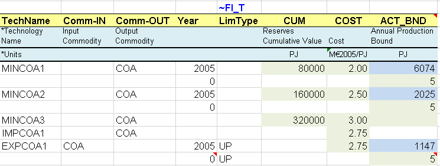{width="5.177083333333333in"
height="1.9583333333333333in"}

[]{#_Ref456191818 .anchor}Figure 74. PRI_COA Sheet with
Interpolation/Extrapolation Rules

  -------------------------------------------------------------------------
  **Option   **Action**                                         **Applies
  code**                                                        to**
  ---------- -------------------------------------------------- -----------
  0 (or      Interpolation and extrapolation of data in the     All
  none)      default way as predefined in TIMES (see below)     

  \< 0       No interpolation or extrapolation of data (only    All
             valid for non-cost parameters).                    

  1          Interpolation between data points but no           All
             extrapolation.                                     

  2          Interpolation between data points entered, and     All
             filling-in all points outside the inter­polation    
             window with the EPS value.                         

  3          Forced interpolation and both forward and backward All
             extrapolation throughout the time horizon.         

  4          Interpolation and backward extrapolation           All

  5          Interpolation and forward extrapolation            All

  10         Migrated interpolation/extrapolation within        Bounds, RHS
             periods                                            

  11         Interpolation migrated at end-points, no           Bounds, RHS
             extrapolation                                      

  12         Interpolation migrated at ends, extrapolation with Bounds, RHS
             EPS                                                

  14         Interpolation migrated at end, backward            Bounds, RHS
             extrapolation                                      

  15         Interpolation migrated at start, forward           Bounds, RHS
             extrapolation                                      

  YEAR\      Log-linear interpolation beyond the specified      All
  (≥ 1000)   YEAR, and both forward and backward extrapolation  
             outside the interpolation window.                  
  -------------------------------------------------------------------------

#### Pri_RNW and Pri_NUC sheets

As with supply curves for fossil fuels, mining processes are created for
the uranium resources and the renewable potential (Figure 75). They are
considered unlimited and at no cost in this simple example.

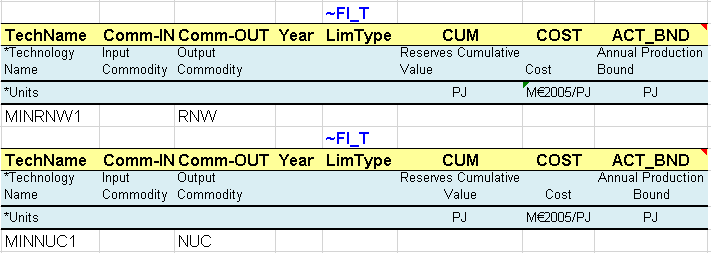{width="5.59375in" height="1.9895833333333333in"}

[]{#_Ref444526540 .anchor}Figure 75. Description of New Supply Options

#### Sector_Fuels sheet

Additional sector fuel processes (FTE-\*) are defined and characterized
in this sheet, namely to produce the electricity sector fuels from
primary fuels, including fossil fuels (e.g. COA to ELCCOA) and other
sources (e.g. NUC to ELCNUC). The same approach is used to declare the
new commodities and processes in their respective tables.

#### Con_ELC sheet

A series of processes are created to represent different types of power
plants (Figure 76). These are conversion processes that consume
electricity sector fuels (ELCGAS, ELCNUC, etc.) to produce electricity
(ELC).

-   The existing processes are characterized with their existing
    installed capacity (STOCK) in GW (calculated from the information
    given in the energy balance in terms of energy consumption for
    electricity production and technical attribute values). They also
    have an efficiency (EFF), an annual availability factor (AFA), fixed
    and variable O&M costs (FIXOM, VAROM), a life time (LIFE), and a CO2
    emission coefficient (ENV_ACT).

-   By default, all attribute values apply to the base year 2005 when
    not specified. It is possible to declare any attribute values for
    future years using the command \"\~\" followed by the year, as for
    the installed capacity attribute in this case (STOCK\~2030). By
    default, an existing installed capacity (STOCK) decreases to zero at
    the end of its lifetime (e.g., after 30 years for ELCTECOA00). By
    specifying an installed capacity value for 2030, as for ELCTENUC00,
    a new retirement profile is defined (constant in this example), and
    it is not necessary to specify a life duration.

-   The new processes do not have an existing installed capacity, but
    they are available in the database to be invested in to replace the
    existing ones and meet the demand for electricity. They are
    characterized in addition with an investment cost (INVCOST) as well
    as the year where they become available (START).

-   A new attribute is introduced (CAP2ACT) allowing the conversion
    between the process capacity and activity units. In this example a
    coefficient of 31.536 PJ/GW is needed (1GW \* 365 days \* 24 hours =
    8760 GWh = 31.536 PJ). When not specified and when both capacity and
    activity are tracked in the same unit, the CAP2ACT is equal to 1.

The same approach is used to declare the new commodities and processes
in their respective tables (Figure 77) including the declaration of
existing and new power plants as ELE processes. The process names follow
a convention where T=thermal, C=CHP, R=Renewable, N=Nuclear.

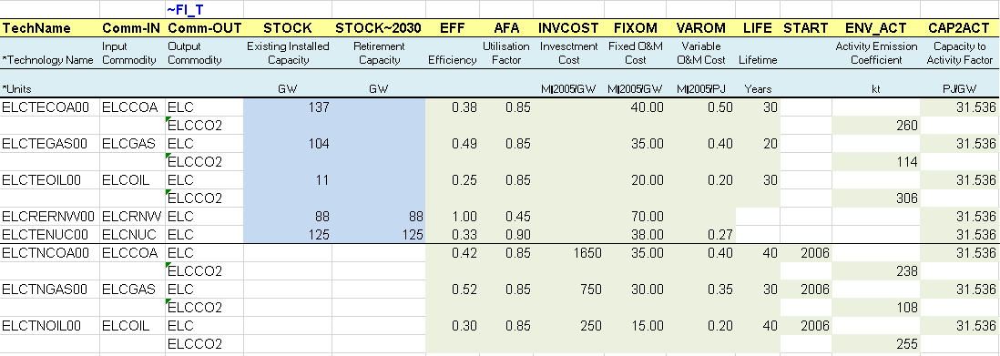{width="6.322916666666667in" height="2.25in"}

[]{#_Ref444526548 .anchor}Figure 76. Existing and New Power Plants

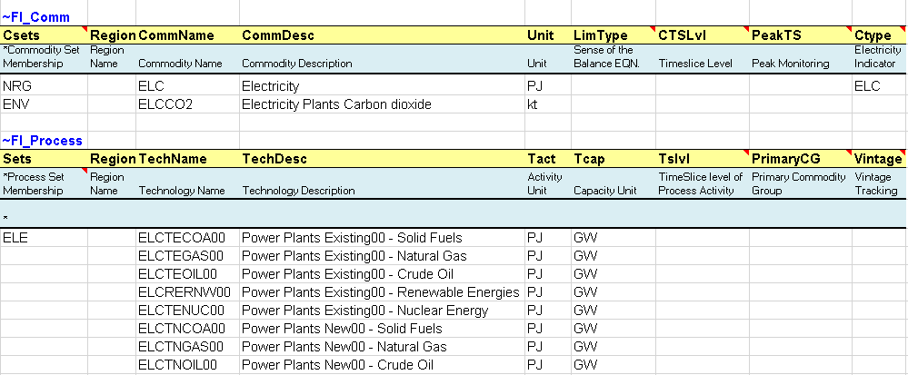{width="5.875in" height="2.4270833333333335in"}

[]{#_Ref444526554 .anchor}Figure 77. Declaration of Electricity
Commodities and Processes

#### DemTechs_ELC sheet

The total demand for electricity (ELC) is modelled in a simplistic
manner as for solids fuels (COA). A flexible table is used to describe
the demand device for electricity (Figure 78):

-   A process for the total demand of ELC (DTPSELC) is characterized
    with an efficiency (EFF), an annual availability factor (AFA), an
    investment cost (INVCOST) a fixed operation and maintenance cost
    (FIXOM), and a life time (LIFE).

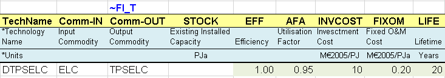{width="5.166666666666667in"
height="0.9166666666666666in"}

[]{#_Ref444526562 .anchor}Figure 78. Description of a simple electricity
demand processes

#### Demands

The end-use demand table is expanded to include the demand for
electricity (TPSELC) in the base year as well as for future years
(Figure 79). While the demand for other fuels or for energy services
will be kept constant over time (extrapolated at a constant level by
default), the demand for electricity is set up to increase by an annual
growth rate of 1% through 2020.

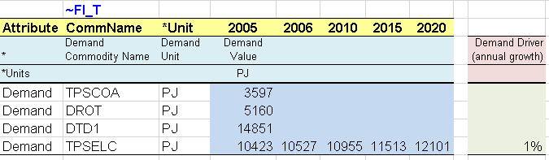{width="4.760416666666667in"
height="1.3854166666666667in"}

[]{#_Ref444526568 .anchor}Figure 79. Definition of base year and future
years demand values

### Results

The demands for energy and energy services are extended to the 2020
horizon (Figure 80), increasing by 1% per year (TPSELC) or remaining
constant (all others). The effects of the interpolation/extrapolation
rules applied on the activity bound of certain supply processes can be
seen below (Figure 63). The activity of the first two mining processes
(first two steps of the domestic supply curves) for fossil fuels (COA,
GAS, OIL) is controlled by the annual activity bound (set constant for
each period by the interpolation rule) and the cumulative bound (CUM).
The combination of these two conditions leads to a significant increase
in imports to meet the growing demand for energy. Exports are also kept
constant using the same interpolation/extrapolation rules. More primary
supply options exist now with the addition of the electric fuels such as
nuclear and renewables.

Results from the new electricity sector are introduced (Figure 82 and
Figure 83). The total generating installed capacity increases from 466.3
GW in 2005 to 541.6 GW in 2020. Most of this increase is coming from new
coal-fired power plants (ELCTNCOA00), the most expensive process but the
least expensive fuel. The installed capacity of nuclear and renewable
power plants remain constant as specified in the B-Y Template.
Electricity production is coming mainly from fossil fuels (64%), with a
smaller contribution from nuclear (26%) and renewables (9%). The oil
plants are working only in the base year, as calibrated to the energy
balance, because the fuel is too expensive compared to the other
available options.

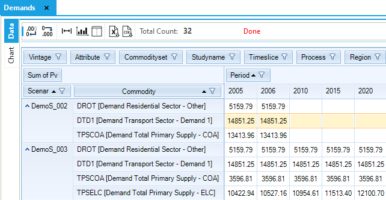{width="6.5in" height="3.3645833333333335in"}

[]{#_Ref444526575 .anchor}Figure 80. Demand Results Table in DemoS_003

{width="5.6875in" height="3.0520833333333335in"}

[]{#_Toc58401220 .anchor}Figure 81. Fuel Supply Results Table in
DemoS_003

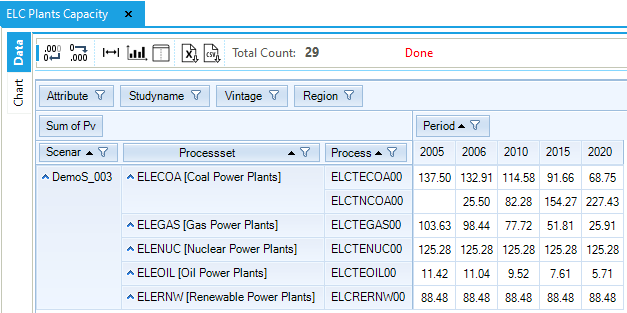{width="5.71875in" height="2.8541666666666665in"}

[]{#_Ref444526630 .anchor}Figure 82. Electricity Plants Capacity Results
Table in DemoS_003

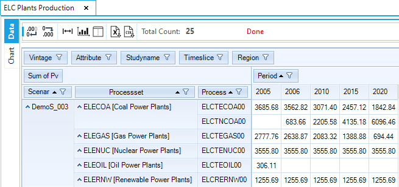{width="5.760416666666667in" height="2.71875in"}

[]{#_Ref444526636 .anchor}Figure 83. Electricity Plants Activity Results
Table in DemoS_003

**Objective-Function** = 3,185,019 M euros (see the \_SysCost table).
This cost is significantly higher compared to the optimal cost obtained
with DemoS_002 because of the addition of the electricity sector. All
the system cost components can be seen in the Results table **All
costs**, as well as the marginal fuel prices in **Price_Energy** and the
process activity in **Process Marginals**.

## DemoS_004 - Power sector: sophistication

**Description.** The fourth step model expands the modelling to a more
sophisticated power sector in the same single region over the 2020
horizon.

**Objective**. The objective is to introduce the concepts of time
slices, peak, and peak reserve capacity. Time slices are added to the
model to adequately capture the timing of the electricity demand, and
the peak reserve capacity requirement is illustrated through scenario
variants, with and without peak reserve capacity factor. This step model
is also used to show how interpolation/extrapolation specifications can
be moved to the SysSettings file and applied to all instances of an
attribute in the model using a single declaration.

  -----------------------------------------------------------------------
  Attributes Introduced              Files Updated
  ---------------------------------- ------------------------------------
  PEAK                               SysSettings

  COM_FR                             VT_REG_PRI_v04

  Discount                           Files Created

  COM_PEAK                           Scen_Peak_RSV

  COM_PKRSV                          Scen_Peak_RSV-FLX

  COM_PKFLX                          
  -----------------------------------------------------------------------

**Files**. The forth step model is built:

-   by modifying the SysSettings file to add new time slices and to
    insert default interpolation/extrapolation options;

-   by modifying the B-Y Template (VT_REG_PRI_V04) to declare the
    contribution of power plants to the peak and add the load curve of
    electricity demand;

-   by creating scenario files to illustrate the peak reserve capacity
    requirement (Figure 84).

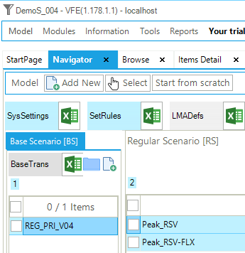{width="3.1770833333333335in" height="3.28125in"}

[]{#_Ref444526655 .anchor}Figure 84. Templates In DemoS_004

### SysSettings file

#### Region-Time Slices

The \~TimeSlices table is used to create four time slices (Figure 85)
and replace the previous single ANNUAL time slice. There are four time
slices combining two seasons (W- Winter and S- Summer) and two intraday
periods or day-night periods (D- Day and N- Night).

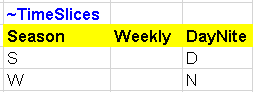{width="1.8333333333333333in"
height="0.6666666666666666in"}

[]{#_Ref444526662 .anchor}Figure 85. New Time Slices Definition in
SysSettings

#### Interpol_Extrapol_Defaults

A table is added for setting the default interpolation/extrapolation
rules (

Figure 86). A transformation table used to update pre-existing data
(\~TFM_MIG) in a rule-based manner, it sets the default
interpolation/extrapolation rule, indicated by the 0 in the Year2
column, for the attribute defined in the Attribute column and all the
processes defined in the model. In this case, this is the same
interpolation/extrapolation rule used for each of the supply processes
(see Figure 30) in the B-Y Template. It is now moved into the
SysSettings file and applied to the activity bound (ACT_BND) of all
processes at once.

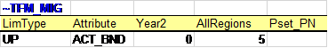{width="3.8333333333333335in"
height="0.5520833333333334in"}

[]{#_Ref456276610 .anchor}

Figure 86. Default Table for Interpolation/Extrapolation Rules in
SysSettings

#### Constants

The existing transformation table is also used to insert new constants
in the model: fractions of year for the new time slices (YRFR) replace
the single ANNUAL time slice (100%) as declared in the previous steps
(Figure 87). The timeslice name is identified in the first column
(TimeSlice), while their fractions (for the attribute called YRFR) over
one year are declared for AllRegions as for the other constants of the
model. The fraction values, as with any other input in the model, are
the user's responsibility. In this case, it is important that they sum
to 100%.

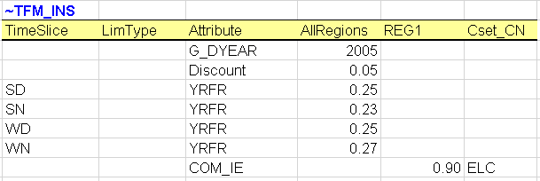{width="4.041666666666667in"
height="1.3541666666666667in"}

[]{#_Ref444526710 .anchor}Figure 87. New Time Slice Declarations in
SysSettings

### B-Y Templates

#### Con_ELC

A new attribute is declared for all existing and new processes
representing power plants (Figure 88):

-   Their contribution to peak (Peak), i.e., the fraction of a process's
    capacity that is considered to be secure and thus will most likely
    be available to contribute to the peak (and reserve capacity) load
    in the highest demand time-slice of a year for a commodity
    (electricity or heat only). In this case, the capacity contribution
    of all thermal and nuclear power plants is 100%, while the capacity
    contribution of the renewable power plant is 50%. Indeed, many types
    of supply processes can be regarded as predictably available with
    their entire capacity contributing during the peak and thus have a
    peak coefficient equal to 1 (100%), whereas others (such as wind
    turbines or solar plants) are attributed a peak coefficient less
    than 1 (100%), since they are on average only fractionally available
    at peak. (E.g., a wind turbine typically has a peak coefficient of
    0.25 or 0.3 maximum).

Another important change to mention is the start year of one new process
(ELCTNOIL00) that can be installed from the 2005 base year to cover the
additional capacity needed for the reserve equation (5%), as defined in
the scenario files.

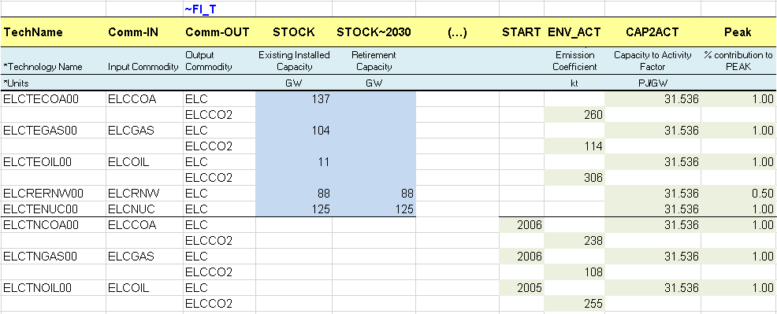{width="6.0in" height="2.4270833333333335in"}

[]{#_Ref444526715 .anchor}Figure 88. Peak Contribution for Different
Types of Power Plants

Additional information is required to complete the declaration of the
electricity commodity and processes in their respective tables (Figure
89 and Figure 90). Along with the new time slices, it is possible to
specify the tracking level of the electricity commodity (ELC) in the
**CTSLvl** column: DAYNITE. (When not specified, as in the previous
step, the default is ANNUAL.) **PeakTS (**peak time slice
monitoring**)** directs TIMES to generate the peak equation for the
specified time slices. It is possible to declare any of the time slices
defined in the SysSettings file, or ANNUAL (the default) to generate the
peaking equation for all time slices. Since it is left blank here, the
peak equation will be generated in all time slices once it has been
requested using COM_Peak (see Section 3.4.3.1). Finally, it is important
that the user enter ELC in the **Ctype** column when declaring an
electricity commodity that may be produced by combined heat and power
(CHP) plants, as this commodity will be in DemoS_009.

For the electricity processes, the process table is used to define the
time slice level of operation in the **Tslvl** column (Figure 90). For
example, the coal-fired and the nuclear power plants are defined at the
SEASON time slice level, meaning that their operational level does not
vary across DAYNITE time slices. (When not specified, the default is
based on the Sets declaration: DAYNITE (for ELE), SEASON (for CHP and
HPL) ANNUAL (for all others).)

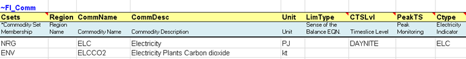{width="6.0in" height="0.7604166666666666in"}

[]{#_Ref444526724 .anchor}Figure 89. Declaration of Time Slice Level for
Electricity Commodity

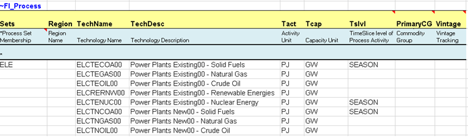{width="5.989583333333333in"
height="1.7708333333333333in"}

[]{#_Ref456277068 .anchor}Figure 90. Declaration of Time Slice
Operational Level for Processes

#### Pri_COA/GAS/OIL

These sheets were all modified back to remove the
interpolation/extrapolation rules: the flag to activate an
interpolation/extrapolation rule (additional rows with a \"0\" as the
Year) and the rule code in the attribute column.

#### Demands

A table is added to define the load curve of the demand for electricity
(TPSELC) in the base year, which will also apply for future years
(Figure 91). The attribute (COM_FR) is introduced to declare the
fraction of the electricity demand occurring in each time slice.

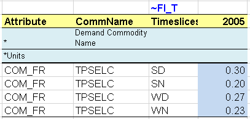{width="2.5625in" height="1.2291666666666667in"}

[]{#_Ref444526730 .anchor}Figure 91. Definition of Load Curve for
Electricity Demand

The TPSELC commodity is the demand commodity produced by a demand
technology (end-use technology) called DTPSELC (Figure 92) and defined
in the sheet DemTechs_ELC. This technology takes as input the ELC
commodity that will be consumed by timeslice as defined by the COM_FR
attribute for TPSELC.

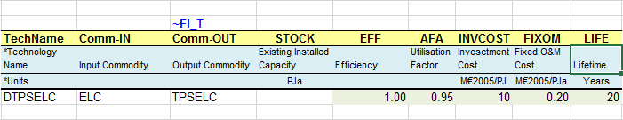{width="6.0in" height="1.15625in"}

[]{#_Ref456277555 .anchor}Figure 92. Demand Technology Producing TPSELC

### Scenario files

#### Scen_Peak_RSV and Scen_Peak_RSV-FLX

Two scenario files are created to insert new information in the RES that
can be retained or not in the configuration of the model at the time of
solving the model (see Section 2.5.5). A transformation table
**\~TFM_INS** is used to declare new attributes (Figure 93):

-   COM_Peak - Specify that the peaking equation will be generated for
    the ELC commodity.

-   COM_PKRSV - Declare the capacity fraction (%) that is required for
    the peak reserve. This is the option used in the first scenario file
    (Peak_RSV).

-   COM_PKFLX - Declare the fraction (%) by which the actual peak demand
    exceeds the average calculated demand, by time slice. This is the
    option used in the second scenario file (Peak_RSV- FLX) for the
    Summer-Day time slice (SD), although in practice COM_PKFLX is
    typically used alongside COM_PKRSV.

The TIMES peak equation allows the user to require that the total
capacity of all processes producing a commodity at each time period and
in each region exceed, by a certain percentage, the average demand in
the time-slice when the highest demand occurs. This peak reserve factor
(COM_PKRSV) insures against several contingencies, such as possible
commodity shortfall due to uncertainty regarding its supply (e.g. water
availability in a reservoir), unplanned equipment down time, and random
peak demand that exceeds the average demand during the time-slice when
the peak occurs. This constraint is therefore akin to a safety margin to
protect against random events not explicitly represented in the model.
Optionally, COM_PKFLX can be used to reflect the fact that the actual
system peak demand is greater than the average demand in the model's
peak slice, allowing COM_PKRSV to represent a more typical utility
reserve margin.

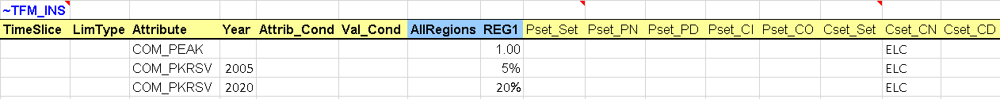{width="6.0in" height="0.59375in"}

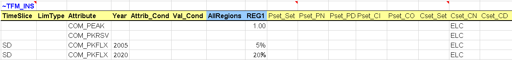{width="5.989583333333333in"
height="0.6979166666666666in"}

[]{#_Ref444526803 .anchor}Figure 93. Declaration of the Peak Reserve in
a Scenario File

### Results

Three cases are solved with this step model, with a different selection
of scenario files (Figure 94): the DemoS_004 case is solved using only
the two components (BASE, SysSettings), while the DemoS_004a case is
solved adding one scenario file (Peak_RSV), and the DemoS_004b case is
solved adding the other scenario file (Peak_RSV-FLX). The different
Cases in the Run Manager can be selected individually to run a single
Case or multiple Cases selected to be submitted in parallel (i.e., the
cases will be launched automatically by VEDA2.0 one after the other) to
TIMES.

+-----------------------------------------------------------------------+
| > {width="6.5in" height="3.84375in"}           |
+=======================================================================+
| []{#_Ref456277970 .anchor}Figure 94. Solving Multiple Cases           |
+-----------------------------------------------------------------------+

The impacts of the improvements made in the electricity sector on the
electricity generating capacity are shown in Figure 95, namely.

-   The effect of adding new time slices and of specifying the seasonal
    operational level for the coal-fired power plant in DemoS_004,
    compared with DemoS_003: there is a switch from coal-fired
    generation to natural gas-fired generation due to its greater
    flexibility (time slice level DAYNITE for gas, as opposed to SEASON
    for coal) to satisfy the electricity demand. The additional natural
    gas supply is coming from import sources.

-   The effect of declaring a peak reserve factor on the total capacity
    in DemoS_004a, compared with DemoS_004: there is additional capacity
    required that is coming from oil-fired power plants as new power
    plants are available from 2005. The total capacity in DemoS_004a is
    increasing from 507 GW in 2005 to 659 GW in 2020 (compared with 466
    GW to 542 GW without the peak reserve requirement).

-   There is no effect on the generating capacity in DemoS_004b,
    compared with DemoS_004a.

The electricity price varies across years and time slices (Figure 96).

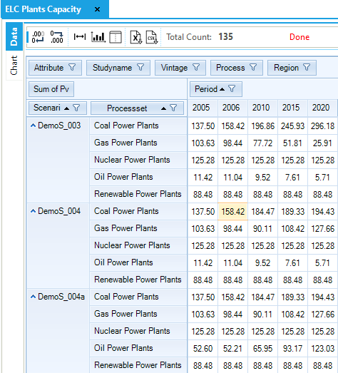{width="4.666666666666667in"
height="5.145833333333333in"}

[]{#_Ref444526874 .anchor}Figure 95. Electricity Plant Capacity Results
Table in DemoS_004

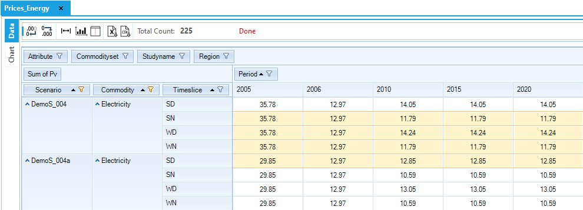{width="6.5in" height="2.34375in"}

[]{#_Ref444526911 .anchor}Figure 96. Electricity Price by Time Slice in
DemoS_004

Other interesting results to show are related to the peak contribution
specifically (Figure 97). The peak equation expresses that the available
capacity must exceed demand for the electricity (ELC) commodity in any
time slice by a certain margin, so the dual value of the peak equation
describes the premium consumers have to pay in addition to the commodity
price (dual value of EQ_COMBAL) during the peak time slice (SD in this
case) to ensure adequate system capacity. The peak marginal is similar,
though not identical, when using COM_PKRSV and COM_PKFLX, owing to the
differences in how they are applied in the TIMES equations.

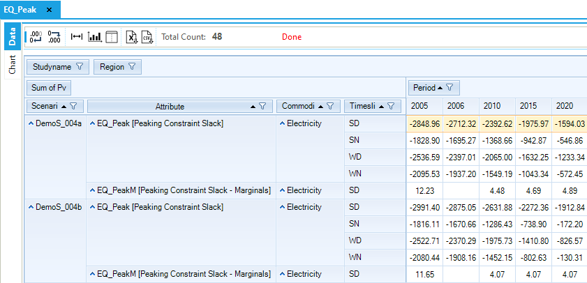{width="6.5in" height="3.1354166666666665in"}

[]{#_Ref456278131 .anchor}Figure 97. Slack and Dual Values of the Peak
Equations in DemoS_004

**Objective-Function** = 3,187,361 M euros (see the \_SysCost table).
This cost is only slightly higher with the peak reserve requirement and
the additional investments in generating capacity: 3,211,296 M euros.

## DemoS_005 - 2-region Model with Endogenous Trade (compact approach)

**Description.** At the fifth step, the model evolves from being a
single region model to become a compact multi-regional model (2 or more
regions in the same set of B-Y Templates). This approach is relevant
when all the model regions are under the control of a single individual.

**Objective**. The objective is to create the multi-regional model
framework typical to larger or more complex models, namely the trade
matrix that allows the modelling of energy trade movements
(uni-directional or bi-directional trade between two regions). Another
objective is to demonstrate how to limit emissions from a sector in a
particular region or from the entire energy system of all regions
through emission bounds or user constraints. Scenario variants
illustrate the impact of a cap on CO~2~ emissions from the electricity
sector only and of a cross-region user constraint on the total CO~2~
emissions from the transport and electricity sectors.

  -----------------------------------------------------------------------
  Attributes Introduced            Files Updated
  -------------------------------- --------------------------------------
  COM_BNDNET                       SysSettings

  UC_RHSRTS                        VT_REG_PRI_v05

  UC_COMNET                        Files Created

                                   Scen_TRADE_PARAM

                                   Scen_ELC_CO2_BOUND

                                   Scen_UC_CO2BND

                                   Files Removed

                                   Scen_Peak_RSV-FLX
  -----------------------------------------------------------------------

**Files**. The fifth step model is built:

1.  by modifying the SysSettings file to add one region;

2.  by modifying the B-Y Template (VT_REG_PRI_V05) to disaggregate the
    energy balance between two regions and to regionalize some process
    attributes;

3.  by creating trade files to capture the trade movements between the
    two regions;

4.  by creating more scenario files to limit GHG emissions (Figure 98).

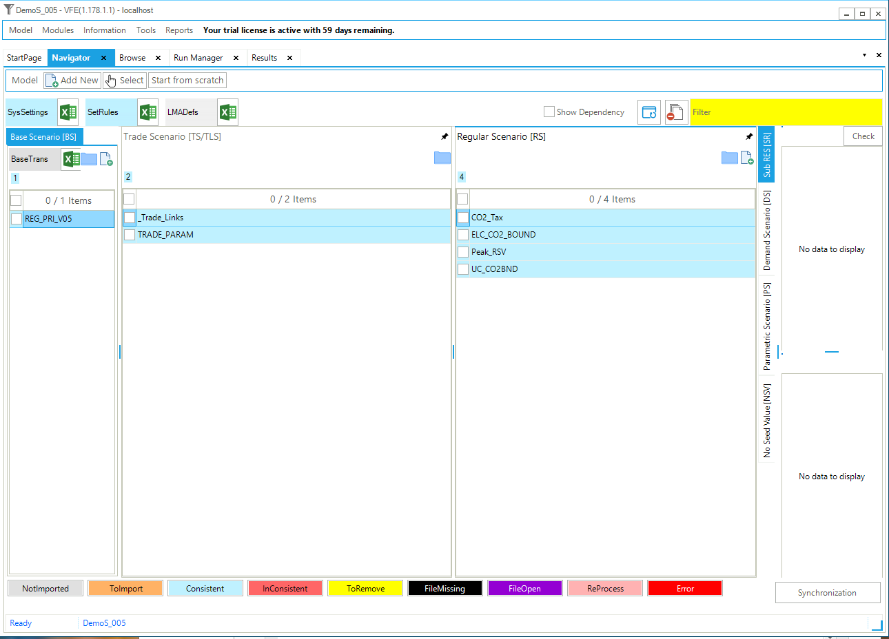{width="5.635416666666667in"
height="4.052083333333333in"}

[]{#_Ref444526929 .anchor}Figure 98. Templates In DemoS_005

### SysSettings file

#### Region-Time Slices

The \~BookRegions_Map table is used to create one additional region:
REG2 (Figure 99) in the same workbook (REG).

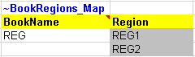{width="2.21875in" height="0.625in"}

[]{#_Ref444526936 .anchor}Figure 99. New Region Definition in
SysSettings for DemoS_005

### B-Y Templates

#### EnergyBalance, EB1, EB2

The energy balance is disaggregated between two regions (Figure 100)
using shares on production, conversion, and final consumption of various
energy commodities: REG1 becomes producer and consumer of solid fuels
(100%), crude oil (30%) and renewable energies (100%), while REG2
becomes producer and consumer of natural gas (100%), crude oil (70%),
and nuclear energy (100%). The same portion of the energy balance as in
the fourth step is used in this fifth step model.

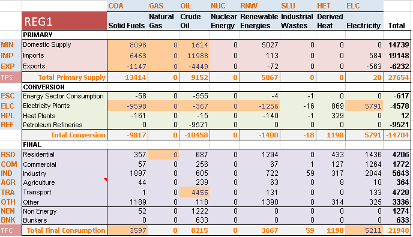{width="6.0in" height="3.4479166666666665in"}

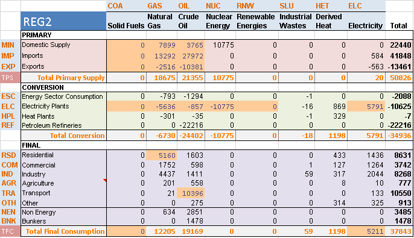{width="6.0in" height="3.5in"}

[]{#_Ref444526942 .anchor}Figure 100. Energy balance at start year 2005
for REG1 & REG 2--Covered in DemoS_005

#### Pri_COA/GAS/OIL

These sheets are updated to include two regions and to regionalize some
process attributes. There are several ways of accounting for the
regionalization of some attributes. For instance, it is possible to
insert a **Region** column on the left side of any **\~FI_T** table and
to indicate in which region(s) the process is available (Figure 101). A
process can be available in only one region (e.g. MINGAS\* and IMPGAS1)
or in several regions (EXPGAS1). In this later case, different rows can
be inserted to declare different values for some of the attributes
(ACT_BND of EXPGAS1); the values that remain on the initial row will
apply to all regions (COST of EXPGAS1). The additional rows approach is
mainly used when all attributes of a process vary across regions.

In the process table (\~FI\_ Process), the region where each process is
available can be specified (Figure 102): MINGAS\* and IMPGAS1 processes
exist only in REG2, while the EXPGAS1 process exists in both regions (by
default, when the **Region** column is empty, it applies to all
regions). Comma-separated entries are also allowed, for instance, when a
process exists in more than one region but not in all regions.

{width="4.479166666666667in"
height="1.7291666666666667in"}

[]{#_Ref444526949 .anchor}Figure 101. Regionalization of Process
Attributes using Additional Rows

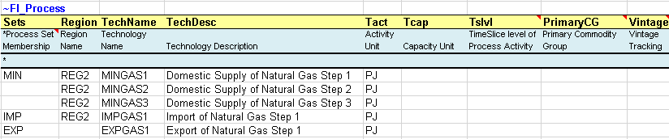{width="5.989583333333333in" height="1.25in"}

[]{#_Ref444526957 .anchor}Figure 102. Region Specification in the
Default Process Table

#### Con_ELC

This sheet is also updated to include two regions and to regionalize
some process attributes. However, a different approach is used (Figure
103): columns are inserted (duplicated) only for those attributes that
vary across regions: the STOCK attribute in this example. As for the
year, the regions are identified using the \" \~ \" command after the
attribute. The additional columns approach is mainly used when only few
attributes of a process vary across regions.

The column approach is also used in the following sheets, namely for the
STOCK attribute: Sector_Fuels, DemTechs_TPS, DemTechs_ELC, DemTechs_RSD
and DemTechs_TRA. The row approach is used in the Demand sheet.

### Trade files

Two trade files are created to model the energy trade movements between
the two regions.

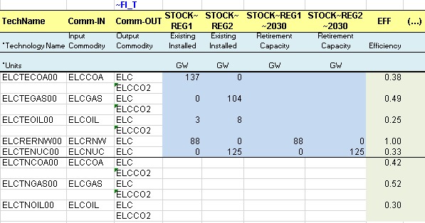{width="4.739583333333333in"
height="2.4895833333333335in"}

[]{#_Ref444526974 .anchor}Figure 103. Regionalization of process
attributes using additional columns

#### Scen_Trade_Links

The \~ TradeLinks tables are used to declare the traded commodities and
their links between regions (Figure 104): either bilateral links between
regions (e.g. ELC trade between REG 1 (importer/exporter) and REG2
(importer/exporter) or unilateral links between regions (e.g. GAS trade
between REG 1 (importer) and REG2 (exporter). For each link declared
(1=active links), VEDA2.0 will automatically create an IRE
(inter-regional trade) process to which attributes may then be
associated (e.g., bounds, investment costs, etc.). The naming convention
for IRE processes is:

-   Bilateral trade: TB\_\<fuel name\>\_\<exporter region\>\_\<importer
    region\>\_\<01\> (e.g. TB_ELC_REG1_REG2_01)

-   Unilateral trade: TU\_\<fuel name\>\_\<exporter region\>\_\<importer
    region\>\_\<01\> (e.g. TU_GAS_REG2_REG1_01)

  -----------------------------------------------------------------------
  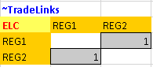             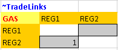
  ----------------------------------- -----------------------------------

  -----------------------------------------------------------------------

[]{#_Ref444526983 .anchor}Figure 104. Examples of trade matrix for
bilateral and unilateral links

#### Scen_Trade_Param

In this file, a transformation table **\~TFM_INS** is used to insert new
attributes for trade processes (Figure 105), for example: an investment
cost (INVCOST) for all unilateral trade processes (TU\_\*). Trade
processes are created automatically after the user declares unilateral
or bilateral links between regions in the **\_Trade_Links** file.

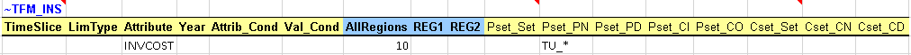{width="6.0in" height="0.3645833333333333in"}

[]{#_Ref444526990 .anchor}Figure 105. Declaration of attributes for IRE
processes

### Scenario files

Two more scenario files are created to insert new information in the RES
that can be retained or not in the configuration of the model at the
time of solving the model. Of the previous scenario files, only the
Scen_Peak_RSV file is retained for further analysis.

#### Scen_ELC_CO2_Bound

This file is used to introduce a bound (limit) on the CO2 emissions from
the power sector in REG1. A transformation table \~TFM_INS is used
(Figure 106) to declare an upper bound on annual emissions (Attribute =
COM_BNDNET; LimType = UP), on the CO2 emissions from the electricity
sector only (ELCCO2) in REG1. In this example the upper bound is
calculated as a percentage reduction target from the power sector CO2
emissions in a reference scenario for 2010 (10% = 993,548 kt) and 2020
(20% = 1,017,340 kt). It is necessary to run the step model without any
limit on emissions first to get the reference emission trajectory (run
DemoS_005) and to calculate the bounds as a reduction target from the
reference emissions. An interpolation rule is used with the \"0\" flag
in the Year column and the interpolation/extrapolation option in the
region column where the bounds are declared. The code 5 means full
interpolation and forward extrapolation.

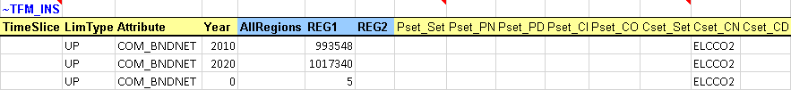{width="6.072916666666667in"
height="0.7083333333333334in"}

[]{#_Ref444526997 .anchor}Figure 106. Declaration of emission bounds for
the power sector

#### Scen_UCCO2_BND -- user constraint

This file shows another way used to introduce bounds (limits) on the CO2
emissions from both the power and the transportation sectors in each
region (REG1 and REG2). The idea is to build a user constraint (Figure
107) that specifies the maximum amount of emissions in a specific year
for the sum of TRACO2 and ELCCO2 emission commodities.

These upper bounds (or limits) are again calculated as a percentage
reduction target from the CO2 emissions (sum in kt) of the power and the
transportation sector in a reference scenario for 2010 (10%) and 2020
(20%). It is necessary to run the step model without any limit on
emissions first to get the reference emission trajectory (run DemoS_005)
and to calculate the bounds as a reduction target from the reference
emissions.

{width="6.239583333333333in"
height="0.7395833333333334in"}

[]{#_Ref444527014 .anchor}Figure 107. Declaration of emission bounds
using a user constraint

The UC scenario template is set up as described in Section 2.4.7. The
sets declarations above the table indicate:

-   \~UC_Sets: R_E: AllRegions: The constraints are to be applied to all
    regions in the model, individually (E=each). That is, the bounds
    imposed for REG1 and REG2 are separate, and there is no emissions
    trading between regions.

-   \~UC_Sets: T_E: The constraints are imposed to each time period
    individually. There is no banking or borrowing between periods.

The table level declaration following the table tag
(\~UC_T:**UC_RHSRTS**) indicates that any column without an index will
be interpreted as the right hand side of the constraint, in this case,
the indicated bounds in REG1 and REG2 in the given years. This right
hand side bounds 1 times the net production (UC_COMNET) of the sum of
TRACO2 and ELCCO2. The interpolation/extrapolation option 5 indicates
full interpolation and forward extrapolation.

### Results

Three cases are solved with this step model, with a different selection
of scenario files: the DemoS_005 case is solved without any limit on CO2
emissions and using only the three main components (BASE, TRADE_PARAM,
SysSettings), while the DemoS_005a case is solved adding one scenario
file (ELC_CO2_BOUND) to put a limit on CO2 emissions from the REG1 power
sector, and the DemoS_005b case is solved adding the other scenario file
(UC_CO2_BND) to put a limit on both the power and the transportation
sectors in both regions.

A first sample of results shows the different configuration of the
energy supply systems in the two regions (Figure 108). As mentioned
earlier, the REG1 becomes the main provider of solid fuels, renewable
energies and some crude oil (from both domestic production and imports).
REG1 is also getting electricity from REG2. REG2 becomes the main
provider of natural gas, nuclear energy and some crude oil (from both
domestic production and imports).

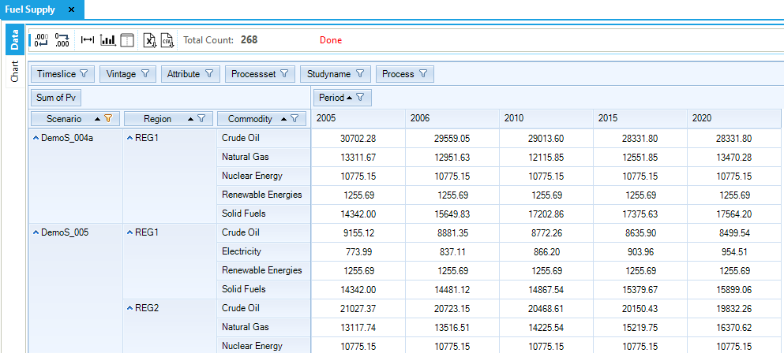{width="6.5in" height="2.9270833333333335in"}

[]{#_Ref456280618 .anchor}Figure 108. Fuel Supply (by Region) in
DemoS_005

A second sample of results shows the evolution of the emissions in the
different sectors of the two regions (Figure 109):

-   Emissions from the power and the transportation sectors as projected
    > in the DemoS_005 case were used to compute the emissions limits in
    > the other two cases.

-   A limit on the CO2 from the power sector in REG1 (DemoS_005a) leads
    > to a lower electricity production from solid fuels, and an
    > emission increase in REG2, which produces more electricity from
    > natural gas to supply REG1 (Figure 110).

-   With a limit on the CO2 from both the power and the transportation
    > sector in REG1 and in REG2 (DemoS_005b), all the emission
    > reductions are coming from the power sector in both regions.
    > Emissions from the transportation sector are not affected compared
    > with the reference case (DemoS_005) meaning that the power sector
    > of both regions could provide enough reduction options at a lower
    > cost to meet the target. Because there is no trading in emissions
    > between regions, REG2 must cut back on its electricity generation
    > from natural gas, and it begins importing natural gas-fired
    > electricity from REG1, which in turn imports natural gas from REG2
    > (Figure 110).

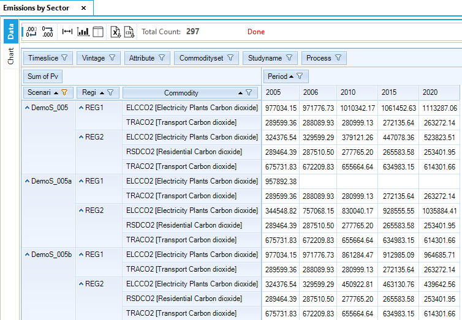{width="6.5in" height="4.510416666666667in"}

[]{#_Ref456280722 .anchor}Figure 109. Emissions by Sector (and Region)
in DemoS_005

Finally, the marginal price of CO2 (i.e. the price to pay in euros to
reduce the last ton of CO2 to meet the reduction targets) in both
scenarios with limits on emissions is particularly relevant and
represents the level of tax that would be necessary to achieve the
reduction targets that are prescribed in the scenario files (Figure
111).

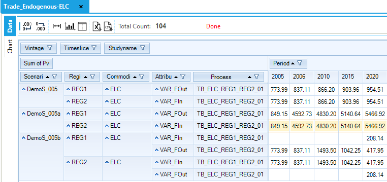{width="6.072916666666667in"
height="2.8645833333333335in"} 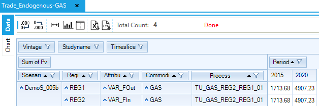{width="5.9375in"
height="2.0in"}

[]{#_Ref444527045 .anchor}Figure 110. Endogenous Trades in DemoS_005

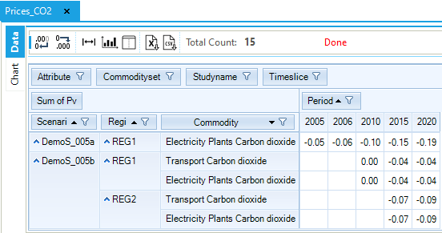{width="5.75in" height="3.03125in"}

[]{#_Ref456280878 .anchor}Figure 111. Emissions Price by Sector and
Region in DemoS_005

**Objective-Function** = 3,204,949 M euros (see the \_SysCost table)
with 1,225,688 M euros for REG1 and 1,979,261 M euros for REG2. This
cost is less than 0.1% higher with the emission limits for the power
sector (3,206,161 M euros) and 1.4% higher with the emission limits for
the power and the transportation sectors (3,250,281 M euros). More
details about the impacts of the emission limits on the different cost
components of the system in each region are shown below (Figure 112).

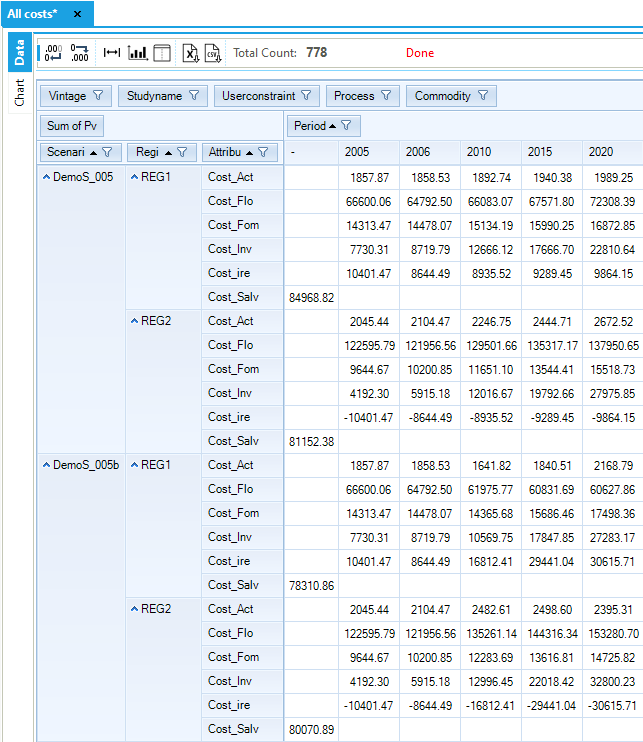{width="6.5in" height="7.5in"}

[]{#_Ref444527183 .anchor}Figure 112. Costs by Sector and Region in
DemoS_005

## DemoS_006 - Multi-region with Separate Regional Templates

**Description.** At the sixth step, the configuration of the
multi-regional model developed previously shifts from a single set of
B-Y Templates for all regions to a separate sets of B-Y Templates for
each region. This approach is relevant when the model regions are under
the control of more than one individual.

**Objective**. The objective is again to create the multi-regional model
framework typical to larger or more complex models, with the trade
matrix and limits on emissions of all regions, but additionally to
introduce the concept of technology repositories (i.e., SubRES) that
include a number of new processes (in competition) that are available in
the database to replace the existing ones at the end of their lifetime
or to meet an increasing demand.

The motivation behind these repositories is mainly to avoid repeating
the new process specifications for each region; all attributes
specifications apply to all regions unless a transformation file is used
to regionalize some values when necessary.

Simultaneously, the role of the vintage feature is illustrated to handle
processes for which characteristics change over time (other than
investment cost) when new capacity is built. As in step 5, the scenario
variants illustrate the impact of a cap on CO~2~ emissions from the
electricity sector only and of a cross-region user constraint on the
total CO~2~ emissions from the transport and electricity sectors.

  -----------------------------------------------------------------------
  Attributes Introduced            Files Updated
  -------------------------------- --------------------------------------
  N.A.                             SysSettings

                                   Files Created

                                   SubRES_NewTechs

                                   VT_REG1_PRI_v06

                                   VT_REG2_PRI_v06

                                   Files Replaced

                                   VT_REG1_PRI_v05
  -----------------------------------------------------------------------

**Files**. The sixth step model is built 1) by modifying the SysSettings
file to add one B-Y Template, 2) by replacing the B-Y Template
(VT_REG_PRI_V05) by two B-Y Template (VT_REG1_PRI_v06, VT_REG2_PRI_v06)
to disaggregate the energy balance between two regions in two separate
files, and 3) by creating a SubRES file to add new processes to the
model (Figure 113). Note that for the rest of this manual the region
templates will be stated as REG1/2, rather than listing each separately.

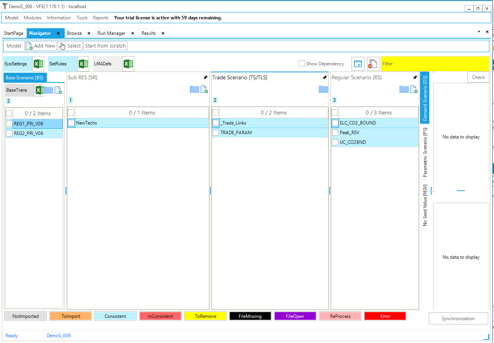{width="6.489583333333333in"
height="4.520833333333333in"}

[]{#_Ref456281207 .anchor}Figure 113. Templates Included in DemoS_006

### SysSettings file

#### Region-Time Slices

The \~BookRegions_Map table is used to create one additional workbook:
one for each region REG1 and REG2 (Figure 114).

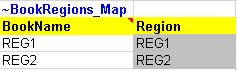{width="2.0416666666666665in"
height="0.6145833333333334in"}

[]{#_Ref444527206 .anchor}Figure 114. New workbook name definitions in
the SysSettings file

### B-Y Templates

The structure of the two B-Y Templates (VT_REG1_PRI_v06 and
VT_REG2_PRI_v06) is identical to the structure of the B-Y Template of
the fourth step model and uses the same energy balances defined in the
fifth step model for REG1 and REG2 respectively. There is no change to
report, except that new power plants are moved from the B-Y Template to
the new process repository.

### SubRES_NewTechs

Two files are created to add new processes in the model, the SubRES and
SubRES_Trans files. The SubRES file is a repository of new processes
available for all regions. In the SubRES, by default, all attribute
specifications apply to all regions. This approach is convenient for
models with multiple regions because a single set of declarations can be
made for all regions. The SubRES file includes one sheet for each
sector: PRI_ELC, PRI_RSD, PRI_TRA, PRI_FuelSec. (Due to the way SubRES
are processed in VEDA2.0, it is required that the name of each sheet
start with a valid name of one of the model sectors, as defined in the
names of the B-Y templates. In this case, PRI is the only such model
sector, and so all sheets in the SubRES template begin with PRI\_.)

With this approach, the B-Y Templates now include only processes with
existing capacity in the base year 2005, and all new processes are
defined in the SubRES. Duplicate definition should be avoided. The new
power plants are now declared in this file without any regional
specification (Figure 115). Other new processes are created in the other
sheets following the same rules: new processes do not have an existing
installed capacity, but they are characterized with an investment cost
(INVCOST) as well as the year where they become available (START).

The role of the vintage feature is illustrated to handle processes for
which characteristics other than investment cost change over time when
new capacity is built., In this example, the new gas-fired power plant
(ELCTNGAS00) has its efficiency and emission coefficient evolving
between 2006 and 2020. The process ELCTNGAS00 is vintaged (Vintage=Yes)
in the \~FI_Process table (Figure 116).

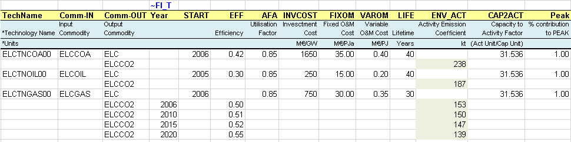{width="5.989583333333333in" height="1.5in"}

[]{#_Ref444527282 .anchor}Figure 115. Example of new processes in the
SubRES file

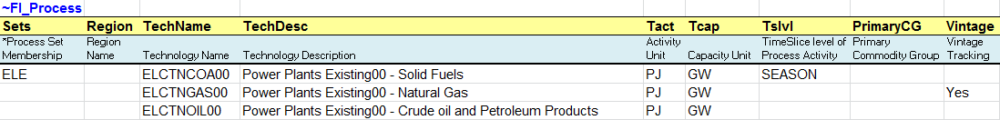{width="5.989583333333333in" height="0.71875in"}

[]{#_Ref444527291 .anchor}Figure 116. Example of a new process with
vintage tracking in the SubRES file

#### SubRES_NewTechs_Trans

For each SubRES\_\<user-name\> file, there is an associated
SubRES\_\<user-name\>\_Trans file. The transformation files contain the
mapping and transformation operations that control the inheritance (or
not) of new processes into the various regions of the model, as well as
to change any process characteristics, such as investment costs, by
region. In this example, the file is empty, so all new processes in the
SubRES are available in both regions with identical characteristics.

### Results

The results are very similar to those obtained with the previous step
model since most of the changes occurred in the way the information is
structured in different files rather than in the energy system itself.
However, the impact of the vintage feature for the new gas-fired power
plants is illustrated (Figure 117).

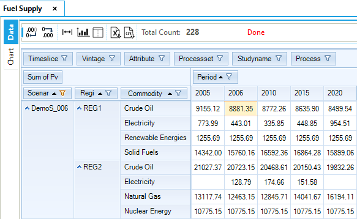{width="6.072916666666667in"
height="3.7291666666666665in"}[]{#_Ref456281460 .anchor}

Figure 117. Fuel Supply by Region in DemoS_005

**Objective-Function** = 3,205,281 M euros (see the \_SysCost table)
with 1,293,017 M euros for REG1 and 1,912,264 M euros for REG2. These
costs are similar to those computed with the previous step model
DemoS_005.

## DemoS_007 -- Making DemoS More Robust

**Description.** The seventh step model is enhanced to capture more
components of the energy balance, leading to a more comprehensive
representation of the RES with more complex processes.

**Objectives**. The objective is to show how to model a more
comprehensive RES covering more details of the energy balance with more
complex processes along its two dimensions: number of commodities and
the number of transformation steps in the whole supply-demand chain. In
this step refined petroleum products are broken out into different
commodities (e.g., gasoline, diesel, heavy fuel, etc.) to better
describe the transport sector, where different types of vehicles are
introduced. This enhancement of the RES requires the modelling of
additional and more complex processes (e.g., refineries and dual demand
cars) and the need to introduce the primary commodity group (PCG)
concept.

Several more techniques are also introduced in this step:

-   We present an easier way to account for combustion-based emissions,
    by directly linking emission coefficients with each unit of fuel
    burnt.

-   We illustrate how to build end-use demand projections starting from
    base year values and different growth rates. This is done using the
    fill table feature to grab base year information from the initial
    files (e.g. B-Y Templates).

-   We show how to build a user constraint that specific the minimum (or
    maximum) annual growth rate for a set of processes using the CAP,
    GROWTH attribute.

-   Finally, we demonstrate how to use the elastic demand feature of
    TIMES, including how to generate the file containing the demand
    prices for base scenarios and how to use these prices for the
    constrained scenarios.

  -----------------------------------------------------------------------
  Attributes Introduced            Files Updated
  -------------------------------- --------------------------------------
  Share                            SysSettings

  ACTFLO                           VT_REG1/2_PRI_v07

  COM_VOC                          SubRES_NewTechs

  COM_STEP                         Files Created

  COM_ELAST                        Scen_DemProj_DTCAR

  UC_CAP                           Scen_Refinery

                                   Scen_ElasticDem

                                   Scen_TRA_CO2_BOUND

                                   Scen_UC Growth
  -----------------------------------------------------------------------

**Files**. The seventh step model is built:

-   by modifying the SysSettings file to add interpolation rules;

-   by modifying the two B-Y Template (VT_REG1_PRI_v07, VT_REG2_PRI_v07)
    and the SubRES file (SubRES_NewTechs) to add more commodities, more
    complex processes, and emission coefficients, and to introduce the
    PCG concept;

-   by creating a scenario file to project demand from base year values;

-   by creating a scenario file to update refinery attributes;

-   by creating a scenario file to include price-elasticities for
    demands;

-   by creating a scenario file with a limit on emissions from the
    transportation sector;

-   by creating a scenario file with a user constraint on growth rates
    of new cars (Figure 118).

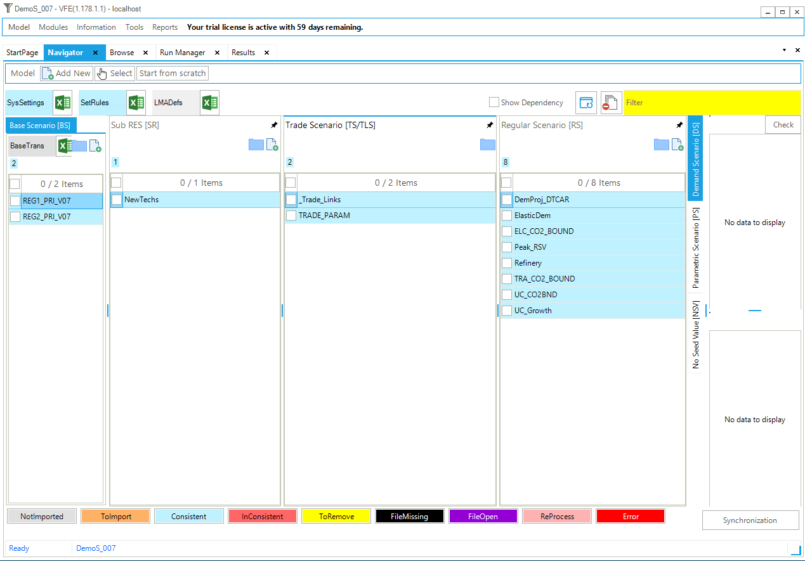{width="6.5in" height="4.53125in"}

[]{#_Ref444527374 .anchor}Figure 118. Templates Included in DemoS_007

### SysSettings file

#### Interpol_Extrapol_Defaults

More interpolation/extrapolation rules are added to the transformation
table (Figure 119). The same interpolation/extrapolation rule (number 5)
is also used for the maximum input shares (Share-I) and the maximum
output shares (Share-O) of all processes at once. These new attributes
are defined in the next section.

{width="3.6041666666666665in" height="0.90625in"}

[]{#_Ref444527384 .anchor}Figure 119. Updated
Interpolation/Extrapolation Rules

### B-Y Templates

#### EnergyBalance

At this step, the energy balance is disaggregated and includes a larger
number of commodities. The crude oil category is disaggregated to track
all refined products independently (Figure 120) to better describe the
transport sector where different types of cars are introduced. A larger
portion of the energy balance is covered in terms of the number of
commodities and also of the number of transformation steps in the whole
supply-demand chain, with the addition of the refining step.

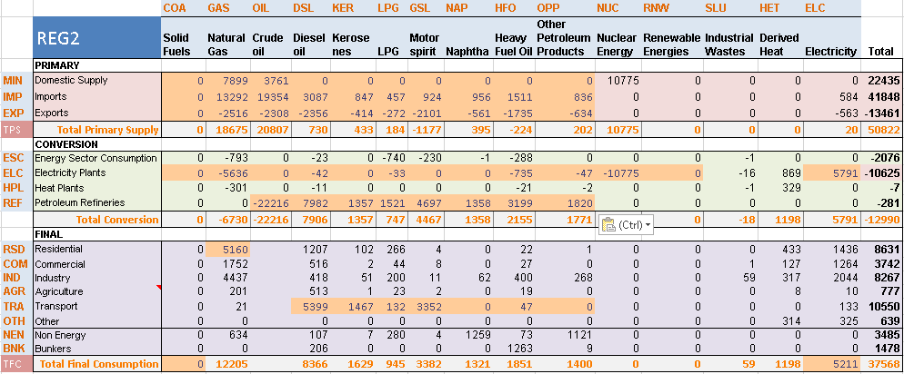{width="6.197916666666667in"
height="2.5729166666666665in"}

[]{#_Ref444527391 .anchor}Figure 120. Disaggregated Initial Energy
Balance (2005) for REG2 in DemoS_007

#### Con_REF -- primary commodity group definition

A flexible refinery (REFEOIL00) is introduced in this sheet (Figure 121)
to convert crude oil (OIL) into refined products (DSL, KER, LPG, GSL,
etc.) that will be used in the transportation sector.

-   The existing refinery is characterized with an efficiency (EFF) and
    an annual activity bound (ACT_BND) equivalent to the sum of the
    refined products produced at base year 2005 as given in the energy
    balance. In this example the efficiency is represented by the ratio
    of the crude oil in input to the refinery on the sum of the
    petroleum products in output. For this reason we get an efficiency
    greater than 1. This behaviour depends on the definition of the
    commodity group of a technology (see below for more details).

-   This more complex process with multiple outputs commodities is also
    characterized with a new attribute: the maximum share for each
    commodity output in the total production (Share-O\~UP). In this
    example, the maximum shares for all outputs sum to 100%, meaning
    that they are equivalent to fixed shares. It would be possible to
    have a sum of maximum shares greater than 100%, leaving some
    flexibility to the model to optimize the output mix.

The same approach is used to declare the new commodities and processes
in their definition tables, where the refinery is declared as a PRE
process, and the concept of Primary Commodity Group (PCG) is introduced
(Figure 122). The activity of a standard process is equal to the sum of
the commodity flow(s) on either the input side or the output side of a
process, as defined by the PCG. The activity of a process is limited by
the available capacity, so that the activity variable establishes a link
between the installed capacity of a process and the maximum possible
commodity flows entering or leaving the process during a year or a
subdivision of a year.

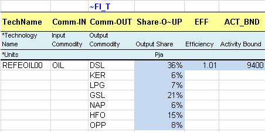{width="3.46875in" height="1.6979166666666667in"}

[]{#_Ref444527398 .anchor}Figure 121. Refinery

In a simple process, one consuming a single commodity and producing a
single commodity, the modeler simply chooses one of these two flows to
define the activity, and thereby the process normalization (input or
output). In complex processes, with several commodities (perhaps of
different types) as inputs and/or outputs, the definition of the
activity variable requires designation of the PCG to serve as the
activity-defining group. The PCG is defined as a subset of the
commodities of the same nature entering or leaving a process. For
instance, the PCG may be the group of energy carriers, or the group of
materials of a given type, on either the input or output side of the
process. More about PCGs and their use can be found in Section 2.2.1 of
Part II of the TIMES documentation.

VEDA2.0 establishes default PCGs for any process involving multiple
inputs and/or outputs, based upon the assumption first that all
processes are output normalized and then according to the commodities'
nature. In case of different commodity types on the output (or input)
side, the default PCG is based on the following order:

-   DEM -- demands;

-   MAT -- materials;

-   NRG -- energy;

-   ENV -- emissions, and

-   FIN -- financial.

However, in some cases it is desirable/necessary to override these
defaults, for instance to normalize a process with energy commodities
inputs (NRGI) as for the refinery in this example. Indeed, the activity
of a refinery is usually characterized based on the barrels of crude oil
consumed.

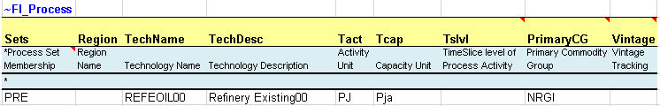{width="6.0in" height="0.96875in"}

[]{#_Ref444527405 .anchor}Figure 122. Set PCG for the Refinery

#### Pri_PP

Import and export options for all refined petroleum products were added
in this sheet; they are characterized with the COST and ACT_BND
attributes as for any other primary fuels (solid fuels, natural gas,
crude oil) (Figure 123). Note that by convention, the export prices are
generally be slightly less than import prices, to avoid the model
importing just to export.

#### Sector_Fuels

Additional sector fuel processes (FTE-\*) are defined and characterized
in this sheet (Figure 124), namely to produce the transportation sector
fuels from primary refined products (e.g. GSL to TRAGSL). It is not
always relevant to keep track of all primary fuels in a sector; multiple
primary fuels can be aggregated into a single sector fuel in this case.
In this example, several refined products are aggregated into a single
electricity sector fuel (via FTE-ELCOIL). When more than one primary
fuel are used to create one sector fuel, the shares of input fuels
(Share-I\~UP) need to be provided. As with Share-O, the maximum input
shares may sum to greater than 100%, if desired, to provide some process
flexibility.

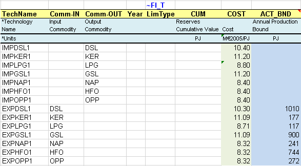{width="4.28125in" height="2.3645833333333335in"}

[]{#_Ref456281936 .anchor}Figure 123. Imports and Exports of Refined
Petroleum Products

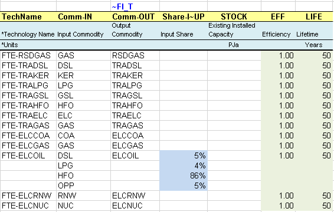{width="4.416666666666667in" height="2.8125in"}

[]{#_Ref444527423 .anchor}Figure 124. Additional Sector Fuel Processes
with Multiple Input Commodities

#### DemTechs_TRA

The single demand process consuming an energy commodity (TRAOIL) and
producing directly the transport demand commodity (DTD1) is replaced
with more sophisticated processes representing cars and characterized
with non-energy units (Figure 125). The declaration of these processes
is shown below (Figure 126): their activity units are in billions
passengers-kilometres (BpK) rather than PJ, and their capacity units are
in thousands of units (000_units) rather than PJa.

-   The existing processes are characterized with their existing
    installed capacity (STOCK) in thousands of car units (000_units) as
    indicated above. The stock values correspond to the amount of fuel
    consumption (e.g. TRADSL) required to produce the transportation
    demand (DTCAR) as given by the energy balance and taking into
    account the efficiency (EFF), the annual availability factor (AFA)
    and the conversion between capacity unit and activity unit
    (CAP2ACT).

-   The efficiency (EFF) is specified in terms of billions of
    vehicle-kilometres per petajoule (BVkm/PJ), and can be interpreted
    as the number of kilometres a vehicle can travel with 1 PJ of
    energy.

-   The annual availability factor (AFA) represents the average thousand
    kilometres (\'000 km) a car is traveling each year.

-   A new attribute is introduced to capture the relation between the
    process activity and the commodity flow (ACTFLO), the commodity
    being the output demand, in terms of passengers per car unit
    (Passenger/Car). This TIMES parameter requires an additional index
    that is the specification of the commodity group: DEMO (demand out)
    in this example.

-   The life time (LIFE) is specified in number of years as for the
    other processes.

-   The conversion factor between capacity unit and activity unit
    (CAP2ACT) is not equal to 1 because the units are different: the
    activity is in billion vehicle-kilometres, the stock is in thousands
    of units (000_units or vehicles) and the utilization factor (AFA) is
    in thousand kilometres per vehicle. The CAP2ACT is translating mvkm
    into bvkm.

> 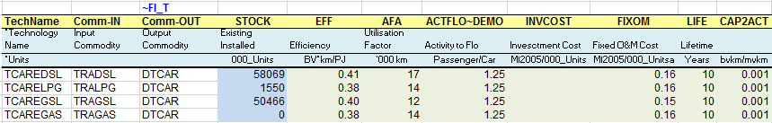{width="6.5in" height="1.0416666666666667in"}

[]{#_Ref444527431 .anchor}Figure 125. More Complex Transportation
Processes

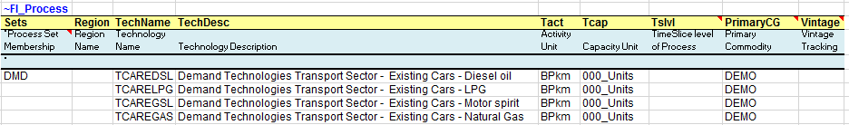{width="6.5in" height="0.9583333333333334in"}

[]{#_Ref444527463 .anchor}Figure 126. Declaration of More Processes in
the Transportation Sector

#### Demands

The demand for transportation by cars is updated and declared in the
right units and correspond to the sum of billion passengers-kilometres
(Bpass\*km) for all types of cars (Figure 127):

-   Demand (Bpass\*km) = STOCK (000_units) \* AFA (000_vehiclekm/unit)
    \* ACTFLO\~DEMO (Passengers/vehicle)\* CAP2ACT(0.001bvkm/mvkm)

> 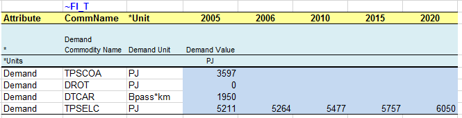{width="5.947916666666667in"
> height="1.4791666666666667in"}

[]{#_Ref444527472 .anchor}Figure 127. Demand for Transportation by Car
(physical units)

#### Emi

A new sheet is added to introduce a comprehensive and convenient
approach to account for combustion emissions by sector. Indeed, the
easiest way to account for combustion emissions is to directly associate
the fuel-based emission coefficients with fuel consumption throughout
the whole energy system.

A new \~COMEMI table is added (Figure 128) to define fuel-based emission
coefficients instead of defining emission coefficients for each process
in all \~FI_T tables. The special tag \~COMEMI is used to link emissions
to commodity consumption through special processing in the VEDA2.0 SYNC
process. (The VEDA-TIMES parameters VDA-EMCB and FLO-EMIS provide
alternative ways to declare consumption-linked emissions. See Part II of
the TIMES documentation for more on the use of these parameters.)

In this example, emissions of TRACO2 are associated with six fuels (LPG,
gasoline, kerosene, diesel, heavy fuel oil, natural gas,) for which a
coefficient (kt/PJ) is provided. These coefficients are applied to all
the fuel consumption by all the individual processes in the
transportation sector.

{width="4.229166666666667in"
height="0.6770833333333334in"}

[]{#_Ref444527478 .anchor}Figure 128. Combustion Emissions from the
Transportation Sector

### SubRES_NewTechs

#### PRI_TRA

This sheet is updated to model the new cars using the same approach as
described above for the existing cars.

### Scenario files

Several scenario files are created at this seventh step.

#### Scen_DemProj_DTCAR

This scenario file is created to project transport demand using a fill
table to grab base year values from B-Y templates (Figure 129). The
**\~TFM_FILL** table (see section 2.4.6 for more information) is a
feature allowing a template to collect information from other templates.
In this example, the table is collecting the base year values
(YEAR=2005) from the B-Y templates (Scenario = BASE) for the
transportation demand (Attribute=Demand) by cars (commodity = DTCAR).
VEDA2.0 fills in the REG1 and REG2 values in the blue highlighted cells
each time the template is SYNCed.

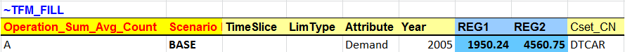{width="6.0in" height="0.5in"}

[]{#_Ref444527490 .anchor}Figure 129. Grab Base Year Demand Values from
B-Y Templates - Transportation

The DTCAR demand is then projected to 2020 in the **\~TFM_INS** table
using the base year values and some multipliers (2% for REG1 and 3% for
REG2) defined by the user (Figure 130).

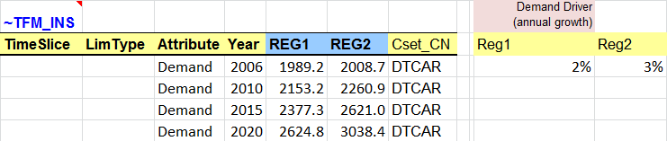{width="5.28125in" height="1.1145833333333333in"}

[]{#_Ref444527495 .anchor}Figure 130. Using Base Year Values to Project
End-use Demands - Transportation

#### Scen_Refinery

This scenario file is created to update refinery attributes, again using
a fill table to grab information from B-Y templates (Figure 131). In
this example, the table is collecting the base year values (YEAR=2005)
from the B-Y templates (Scenario = BASE) for the activity production
bound (Attribute=ACT_BND) of the refinery (process = REFEOIL00).

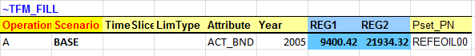{width="4.989583333333333in" height="0.59375in"}

[]{#_Ref444527500 .anchor}Figure 131. Grab Base Year Activity Level from
B-Y Templates - Refinery

The activity production is then projected to 2020 in the \~TFM_INS table
using the base year values and some relaxation factors (25% for REG1 and
30% for REG2) defined by the user (Figure 132). In addition, the maximum
(UP) shares of the refinery outputs (Attribute=SHARE-O) are all updated
to 50%, creating flexibility for the model to optimize the mix of
refined products (DSL, KER, LPG, etc.).

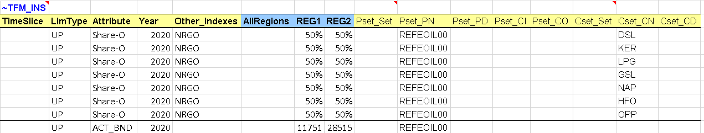{width="6.125in" height="1.15625in"}

[]{#_Ref444527510 .anchor}Figure 132. Using Base Year Values to Update
Refinery Attributes

#### Scen_TRA_CO2_BOUND

This file is used to introduce bounds (limits) on the CO2 emissions from
the transportation sector in REG1 and REG2. A transformation table
\~TFM_INS is used (Figure 133) to declare upper bounds on annual
emissions (Attribute = COM_BNDNET; LimType = UP), on the CO2 emissions
from the transportation sector only (TRACO2) in REG1 and REG2. These
upper bounds are calculated as percentage reduction targets from the
transportation sector CO2 emissions in a reference scenario for 2010
(10%) and 2020 (20%). It is necessary to run the step model without any
limit on emissions first to get the reference emission trajectory (run
DemoS_007) and then calculate the bounds as a reduction targets from the
reference emissions. An interpolation rule is used with the \"0\" flag
in the Year column and the interpolation/extrapolation option in the
region column where the bounds are declared; the code 5 means full
interpolation and forward extrapolation.

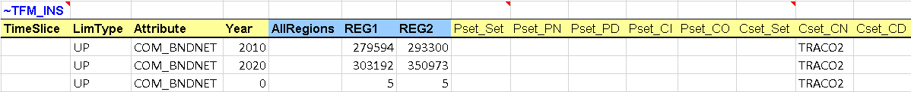{width="5.989583333333333in"
height="0.6145833333333334in"}

[]{#_Ref444527534 .anchor}Figure 133. Set Emission Bounds for
Transportation Sector

#### Scen_UC Growth

This file shows another type of user constraint that specifies the
maximum (or minimum) annual growth rate for a set of processes using the
CAP, GROWTH attribute (Figure 134). (See Section 2.4.7 for more on user
constraints.)

This user constraint imposes a maximum capacity (defined by UC_CAP)
growth rate (CAP,GROWTH) of 1% per year (value in the column UC_CAP) for
cars consuming TRADSL (these cars are identified using the two columns
PSET_CO and PSET_CI). This constraint also provides a seed value of 1
(column UC_RHSRTS) to enable the capacity growth to start in case the
existing capacity of diesel cars is zero.

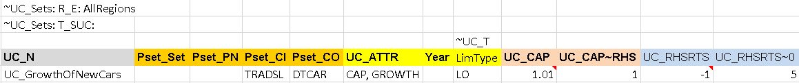{width="6.0in" height="0.625in"}

[]{#_Ref444527542 .anchor}Figure 134. Specifying Growth Rates with a
User Constraint

#### Scen_ElasticDem

This file is used to introduce price-elasticities for end-use demands
(Figure 135), so that demands can react to changes in their prices under
a constrained energy system (e.g., under limits or tax on emissions,
etc.). (See Section 4.2 of Part I of the TIMES documentation for more on
the elastic demand formulation.)

In this example, price-elasticities are declared for the transportation
demand by cars (DTCAR). Three attributes need to be declared:

-   COM_ELAST: Elasticity of demand indicating how much the demand
    rises/falls in response to a unit change in the marginal cost of
    meeting a demand that is elastic.

-   COM_VOC: Maximum possible variation of demand in both directions
    when using the elastic demand formulation (15% in this example).

-   COM_STEP: Number of steps for the linear approximation of the demand
    curve (10 steps in this example).

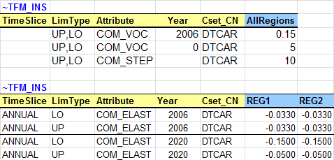{width="3.0520833333333335in"
height="1.4583333333333333in"}

[]{#_Ref444527550 .anchor}Figure 135. Declare Price-elasticities for
End-use Demands

In order to activate the elastic demand feature, there are few steps to
follow:

-   Generate a file with demand prices from a reference case, i.e.
    without any constraint or tax on emissions: in the Parameter Group
    make sure the option "Write B Price for Elast Dem\" is selected
    (Figure 136). This option is already selected in the DemoS_007.

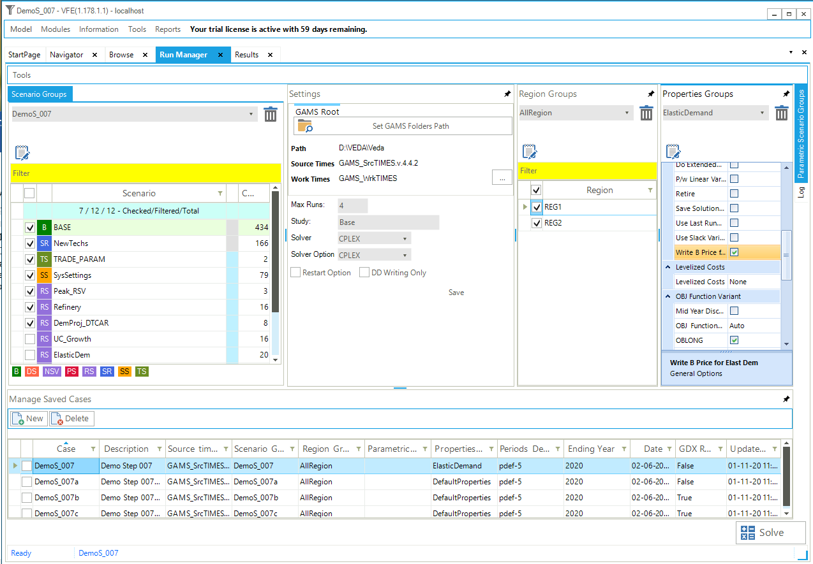{width="5.854166666666667in"
height="4.072916666666667in"}

[]{#_Ref444527558 .anchor}Figure 136. Write Base Prices for Elastic
Demands

-   Solve a constrained case with price-elasticity by selecting the
    constrained scenarios you want to include in the model run (emission
    limits or taxes) as well as the elastic demand scenario. In the
    RunManager Case DemoS_007a is an emission constrained case run
    without elastic demands, while Case DemoS_007b B prices and
    emissions constraint scenario, see Figure 137.

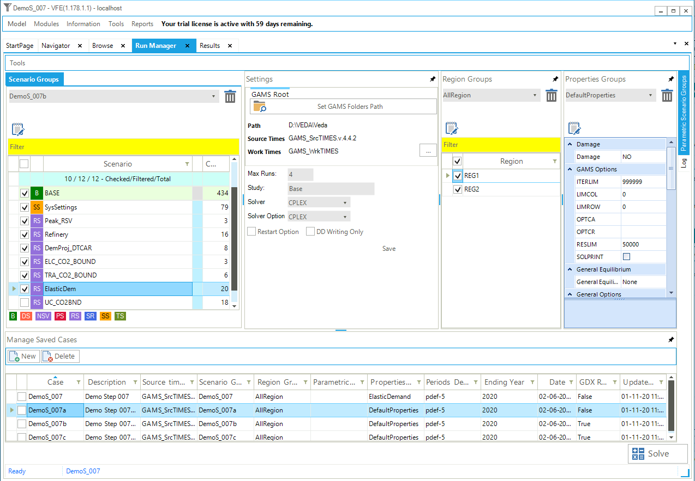{width="6.5in" height="4.510416666666667in"}

[]{#_Ref444527600 .anchor}Figure 137. Include the B Elastic Demand and
Emission Constraint

### Results

The effect of price elasticities on the new projected demand for car
transportation in thousand passengers-kilometres (kpass\*km) to the 2020
horizon is visible (Figure 138) in the scenarios where it was activated
(DemoS_007b and DemoS_007c). Demands are decreasing by about 9% in both
regions, less than the maximum decrease of 15%, meaning than more
cost-effective emission reduction options exist elsewhere in the system
beyond that level.

The impacts of the emissions constraints and the growth rate constraint
on the optimal process mix selected to meet the car transportation
demand (kpass\*km) is shown (Figure 139) for both regions together:

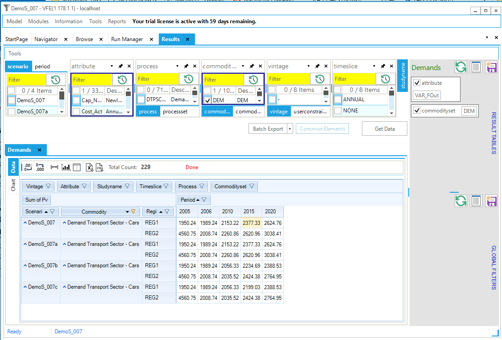{width="6.5in" height="4.40625in"}

[]{#_Ref456284123 .anchor}Figure 138. Results - Effect of Price
Elasticities on Car Transportation Demand in DemoS_007

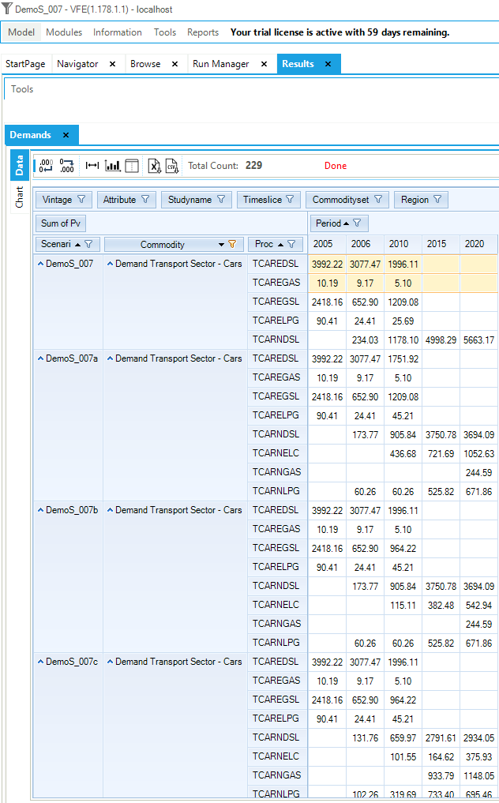{width="5.270833333333333in"
height="8.489583333333334in"}

[]{#_Ref444527645 .anchor}Figure 139. Results -- Car Transport Vehicle
Type Mix in DemoS_007

-   In the reference case (DemoS_007), new diesel cars satisfy the
    entire demand for car transportation from 2015 and beyond. The
    output mix of the refinery is shown below (Figure 140).

-   The limits on the transportation sector emissions (DemoS_007a) lead
    to a switch toward less polluting options such as electric, natural
    gas and LPG cars.

-   The activation of elastic demand (DemoS_007b) leads to a reduction
    in the use of the most expensive option to meet demand -- electric
    cars .

-   The addition of a growth rate constraint on diesel cars (DemoS_007c)
    leads to a switch toward natural gas cars.

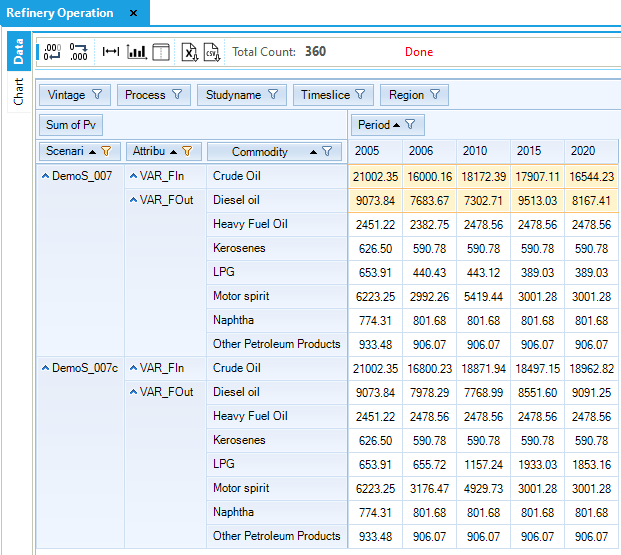{width="5.270833333333333in"
height="4.708333333333333in"}

[]{#_Ref456284175 .anchor}Figure 140. Flexible Refinery Operation in
DemoS_007

**Objective-Function** = 5,484,966 M euros (see the \_SysCost table)
with 2,859,389 M euros for REG1 and 2,625,577 M euros for REG2. These
costs are higher than those computed with the previous step model
DemoS_006 because of the many components added to the RES. The total
cost is 12% higher when emissions limits are imposed on the
transportation sector (6,145,863 M euros), but only 7% higher with the
activation of elastic demand as the model has more flexibility to reach
the emissions targets (5,891,267 M euros). The addition of the growth
rate constraint on diesel cars brings the system cost increase back up
to 10% (6,025,956 M euros).

## DemoS_008 - Split Base-Year (B-Y) templates by sector: demands by sector

**Description.** At the eighth step, the level of detail in the
representation of the RES is expanded further, the base-year information
is disaggregated into different B-Y Templates for each sector, and
demands are projected through 2050. Each of these B-Y Templates utilizes
only the relevant portion of the energy balance for its region and is
linked to an additional single file containing the complete regional
energy balances. This approach is convenient when different individuals
work in parallel on different sectors. In addition, it encourages
grouping of related commodities and processes, and as the size of a
model grows it improves (and speeds up) the process of managing the
model.

**Objective**. The objective is to give more examples on how to further
expand the detail of the representation of the RES, in terms of the
number of end-use demand segments and end-use devices as well as
commodities. On the demand side, the idea is to cover the energy
consumption by end-use in all sectors rather than by type of energy:
agriculture (one end-use demand), commercial (three end-use demands),
residential (three end-use demands), industrial (one end-use demands),
and transport (two end-use demands). On the supply side, the idea is to
break the renewables into more detail for wind, solar, hydro and biomass
power. This enhancement of the RES requires the modelling of additional
processes as well as the addition of emission coefficients for all
sectors.

Another objective is to show how to impose a limit on power generation
capacity: nuclear, for example. The scenario variants with nuclear
maximum capacity, with different types of limits on emissions, and with
and without the elastic demand feature, illustrate the impacts on the
respective contribution of each sector to the target as well as on the
electricity generation mix.

  -----------------------------------------------------------------------
  Attributes Introduced            Files Updated
  -------------------------------- --------------------------------------
  N.A.                             SysSettings

                                   Scen_TRA_CO2_Bound

                                   Scen_ELC_CO2_Bound

                                   Scen_UC_CO2BND

                                   SubRES_NewTechs

                                   Files Created

                                   VT_REG1/2_PRI_v08

                                   VT_REG1/2_ELC_v08

                                   VT_REG1/2_RCA_v08

                                   VT_REG1/2_TRA_v08

                                   VT_REG1/2_IND_v08

                                   Scen_UC_NUC_MaxCAP

                                   Files Replaced

                                   VT_REG1/2_PRI_v07
  -----------------------------------------------------------------------

**Files**. The eighth step model is built:

-   by modifying the SysSettings file to add more time periods;

-   by replacing the two B-Y Templates (VT_REG1_PRI_v07,
    VT_REG2_PRI_v07) by five B-Y Templates -- one for each sector -- in
    each region (VT_REG1\_\*\_v08, VT_REG2\_\*\_v08), and to add more
    energy commodities, energy processes, and emissions;

-   by completing the SubRES file;

-   by updating scenario files with limits on emissions;

-   by creating a scenario file with a user constraint on the maximum
    nuclear power capacity (Figure 141).

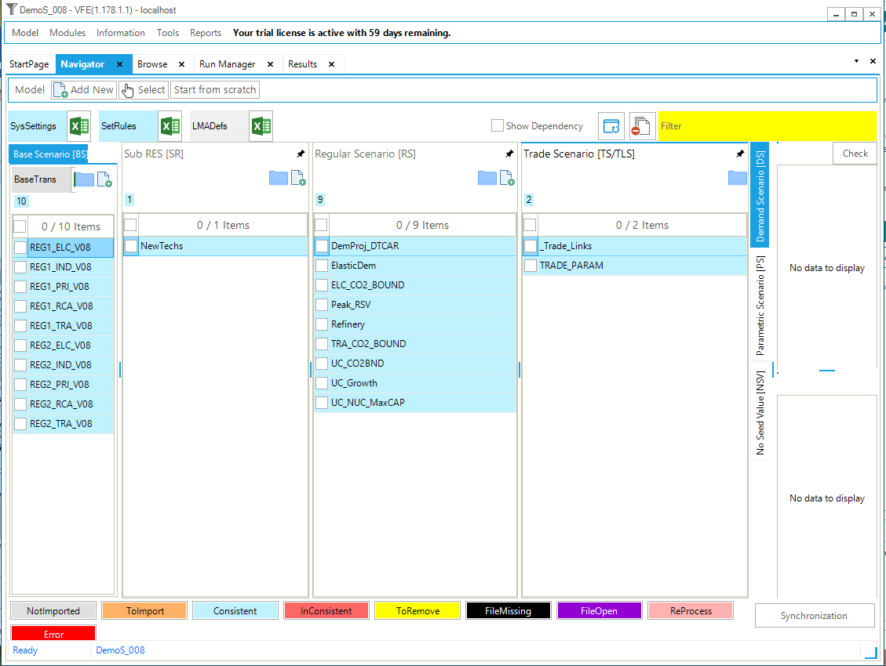{width="6.5in" height="4.895833333333333in"}

[]{#_Ref456284689 .anchor}Figure 141. Templates Included in DemoS_008

### SysSettings file

#### TimePeriods

The \~TimePeriods table is used to extend the time horizon of the model
by adding six active periods of five years (Figure 142). These
specifications are saved under a new time period definition (Pdef-11).
The time horizon is extended to 2050 with the milestones years being
2005, 2006, 2010, 2015, 2020, 2025, 2030, 2035, 2040, 2045 and 2050.
This can be seen in VEDA2.0, Advanced Functions menu, MileStone Years
tab.

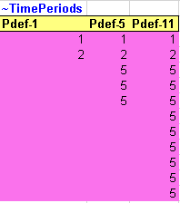{width="1.78125in" height="2.0208333333333335in"}

[]{#_Ref444527689 .anchor}Figure 142. New Time Periods Definition in
SysSettings

#### Defaults

The \~DefUnits table is used to specify the different default activity,
capacity and commodity units for each sector in the model (Figure 143).

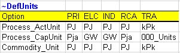{width="2.6354166666666665in" height="0.78125in"}

[]{#_Ref444527695 .anchor}Figure 143. Default Declarations in
SysSettings

### B-Y Template VT_REG\*\_PRI_V08

#### EnergyBalance

The energy balance is disaggregated further and includes a larger number
of commodities. The renewable category is disaggregated to track several
sources independently: biomass as well as hydro, wind, and solar energy
(Figure 144). Moreover, the energy balances of both regions are now
moved into a separate file (called EnergyBalance) and all B-Y Templates
are linked to this file to grab the relevant sector data.

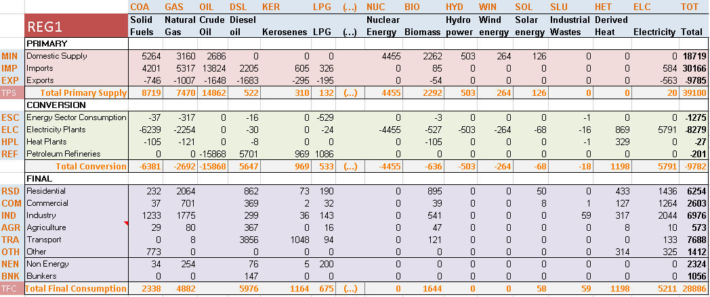{width="5.989583333333333in"
height="2.5104166666666665in"}

> \* For purposes of clarity the energy balance is not presented totally
> and some columns are missing (for refined products).

[]{#_Ref444527701 .anchor}Figure 144. Disaggregated Initial Energy
Balance (2005) for REG1 in DemoS_008

#### Pri_COA, Pri_GAS, Pri_OIL, Pri_PP, Con_REF

The structure of these sheets have not changed, but the data is updated
following a different commodity split between REG1 and REG2 in the
energy balance.

#### Pri_RNW and Pri_NUC

Mining processes for the uranium resources and the new renewable
potentials are characterized with a cost (Figure 145).

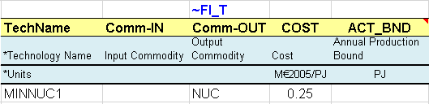{width="3.6041666666666665in" height="0.875in"}

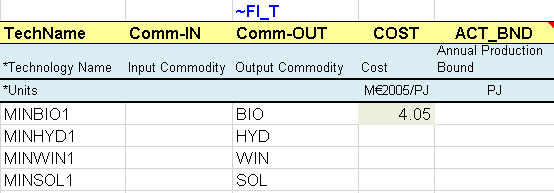{width="3.6145833333333335in"
height="1.2604166666666667in"}

[]{#_Ref444527708 .anchor}Figure 145. New Renewables Supply Options

#### Pri_ELC

This sheet is created to capture the imports and exports of electricity
(Figure 146). In the default process table, the operational level of
these processes are declared as DAYNITE in the **Tslvl** column. Note
that the ELC commodity is not declared in the default commodity table as
it is already declared in the ELC B-Y Templates. Commodities need to be
declared only once and then are available for all files (not only B-Y
Templates).

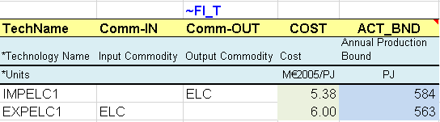{width="3.7291666666666665in"
height="1.0416666666666667in"}

[]{#_Ref444527716 .anchor}Figure 146. Electricity Imports and Exports
Options

### B-Y Template VT_REG\*\_ELC_V08

#### Con_ELC

New power plants are added for each type of renewable energy (Figure
147) using the same approach as before. Their contribution to peak
varies depending on the resources: 50% for hydro, 30% for wind, and 20%
for solar. However, there is no emission coefficient associated with
process anymore (in \~FI_T tables). All combustion emissions are tracked
in a uniform manner at the sector level in a \~COMEMI table.

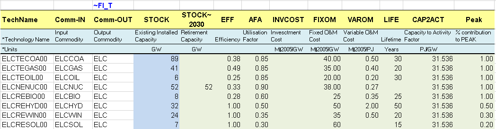{width="5.989583333333333in" height="1.5625in"}

[]{#_Ref444527723 .anchor}Figure 147. New Renewable Electric Generation
Power Plants

#### Emi

A similar sheet is added in all sectors with a \~COMEMI table used to
define fuel-based emission coefficients associated with fuel consumption
in each sector (Figure 148).

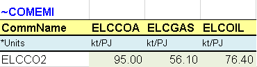{width="2.59375in" height="0.6770833333333334in"}

[]{#_Ref444527728 .anchor}Figure 148. Combustion Emissions from the
Electricity Sector

### BY Template VT_REG\*\_IND_V08

#### DemTechs_IND

The energy consumed in the industrial sector is captured through a
single generic process (Figure 149) consuming the mix of industrial
fuels as given in the energy balance and producing one end-use demand
(DIDM1). A relaxation factor is used for the maximum input shares in
2050 to give more flexibility to the model over time to optimize the
fuel mix. However, the value of the relaxation factor should remain
realistic since most fuel switches involve process switches as well.

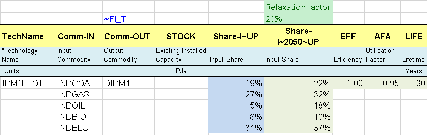{width="6.0in" height="1.8958333333333333in"}

[]{#_Ref444527735 .anchor}Figure 149. Flexible Multiple Input Process in
the Industrial Sector

#### Emi

An emission commodity is created (Figure 150) and a \~COMEMI table is
added in the Emi sheet to track all fuel-based emissions from the
sector.

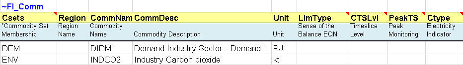{width="5.65625in" height="0.8020833333333334in"}

[]{#_Ref444527743 .anchor}Figure 150. New Environmental Commodity for
Industrial Emissions

### BY Template VT_REG\*\_RCA_V08

This B-Y Template includes the information related to three sectors:
agriculture, commercial and residential.

#### DemTechs_AGR

The energy consumed in the agriculture sector is captured through a
single generic process (as for the industrial sector) consuming the mix
of agriculture fuels as given in the energy balance and producing one
end-use demand (DAOT). A relaxation factor is also used for the maximum
input shares in 2050 to give more flexibility to the model over time to
optimize the fuel mix. However, the value of the relaxation factor
should remain realistic since most fuel switches involve process
switches as well.

#### DemTechs_RSD and DemTechs_COM

The energy consumed in the commercial and the residential sectors is
modelled through specific processes (Figure 151). Multiple processes are
in competition to satisfy each end-use demand (e.g., RSHE\* to satisfy
the DRSH demand). The existing processes are characterized with their
existing installed capacity (STOCK) corresponding in this case to the
energy consumption required to produce these energy services as given by
the energy balance and the additional fuel split assumptions. The
calculation of the existing stocks also takes into account availability
factors (AFA) and are converted into GW using a capacity to activity
factor (PRC_CAPACT equivalent to CAP2ACT). They also have an efficiency
(EFF) and a life time (LIFE).

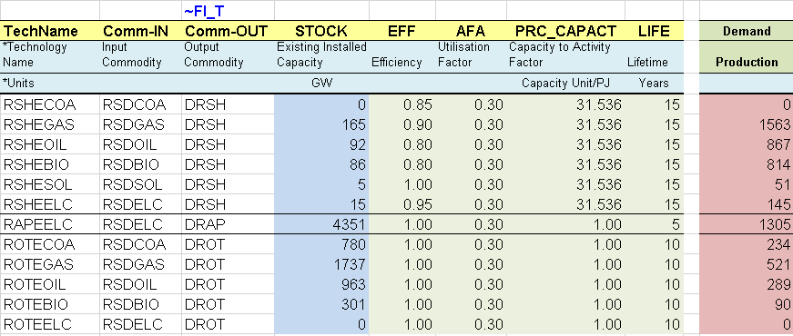{width="5.40625in" height="2.3020833333333335in"}

[]{#_Ref444527756 .anchor}Figure 151. Existing Residential Sector
Processes

#### Demands

The demand table includes all end-use demands for energy services from
the three sectors (Figure 152). The values come from the process sheets
where the values are already computed in the pink column (Figure 151):
STOCK\*AFA\*PRC_CAPACT. This sheet also includes the fractional shares
of each end-use demand by time slice (Figure 153). These shares are
relevant to capture the annual variation in the electricity (ELC)
consumption levels and prices, the only commodity tracked at the time
slice level. In this example, the annual variations are significant for
those end-use demands affected by seasonal changes (e.g. space heating).

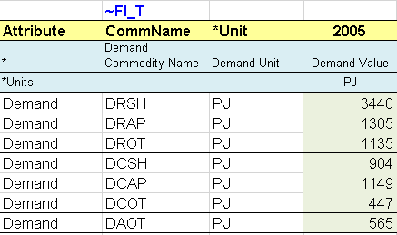{width="3.0625in" height="1.8125in"}

[]{#_Ref444527783 .anchor}Figure 152. Demand for Energy Services in the
RCA Sectors

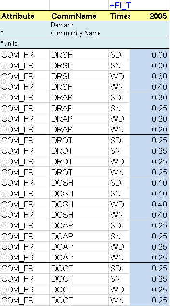{width="2.2604166666666665in"
height="4.052083333333333in"}

[]{#_Ref456285613 .anchor}Figure 153. Fractional Shares for RCA Energy
Service Demands

#### Emi

An emission commodity is created in all three sectors and three \~COMEMI
tables are added in the Emi sheet to track all fuel-based emissions from
each of the three sectors.

### BY Template VT_REG\*\_TRA_V08

#### DemTechs_TRA

The energy consumed in the transportation sector is disaggregated into
two end-use demands: transportation by cars and public transport.
Consequently, more existing processes are included to satisfy the demand
for the new public transport demand, and they are modelled using the
same approach as for cars (Figure 154).

{width="6.0in" height="2.1458333333333335in"}

[]{#_Ref444527809 .anchor}Figure 154. Existing Transportation Sector
Vehicle Types

#### Demands

The demand table includes both end-use demands (in Bpass-km) and the
fractional shares of each end-use demand by time slice.

#### Emi

An emission commodity is created and a \~COMEMI table is added in the
Emi sheet to track all fuel-based emissions from the sector.

### SubRES_NewTechs

The structure of this file has not changed; this is a repository of new
processes available for all the regions. The file includes one sheet for
each sector: ELC, PRI, IND, RCA, TRA. (The sheet\'s names have changed
and reflect each new sector\'s name).

The new process repository is completed with more new processes
similarly as for the existing processes in the B-Y Templates, namely
more processes for renewable power generation, public transport, and
more energy services in the residential and commercial sectors (Figure
155).

#### IEA-ETSAP_ETechDS

This sheet contains a reference to the technology briefs (E-TechDS --
Energy Technology Data Source) coordinated by the ETSAP-IEA. They are
classified into two main categories: energy supply technologies and
energy demand technologies. They provide relevant data on the most
important technical and economic attributes of numerous types of
technologies.[^3]

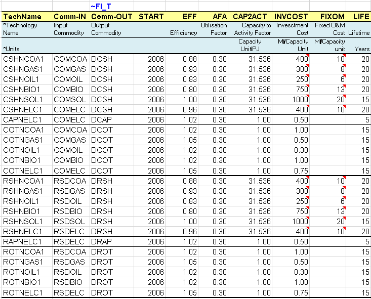{width="4.625in" height="3.7291666666666665in"}

[]{#_Ref444527846 .anchor}Figure 155. New Residential and Commercial
Devices

### Scenario files

#### Scen_UC_CO2BND

This user constraint is updated to introduce bounds (limits) on the CO2
emissions from all sectors in each region (REG1 and REG2). These upper
bound are calculated as a percentage reduction target from the CO2
emissions (sum in kt) from all the sectors in a reference scenario for
2010 (10%) and 2020 (20%). It is necessary to run the step model without
any limit on emissions first to get the reference emission trajectory
(run DemoS_008) and to calculate the bounds as a reduction target from
the reference emissions.

#### Scen_UC_NUC_MaxCAP

To build this scenario, a \~TFM_FILL table first collects information
from the B-Y Templates for REG1 and REG2 (Figure 156): the installed
capacity (STOCK) of the nuclear power plant (ELCNENUC00). These data are
refreshed each time this file is synchronized (SYNC). Second, a user
constraint is built to define an absolute upper limit on the total
nuclear capacity by region (Figure 157). In 2015, the maximum capacity
is fixed to the 2005 base year levels in both regions. Afterwards the
capacity is kept constant for REG1 (using the interpolation rule
15=interpolation migrated at start, forward extrapolation), and in REG2
is limited to an additional 10% of the 2005 base year capacity in 2030
and an additional 50% in 2050.

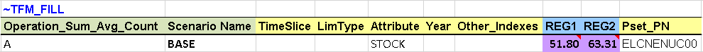{width="6.0in" height="0.4479166666666667in"}

[]{#_Ref444527869 .anchor}Figure 156. Grab Base Information on Nuclear
Plant Capacity

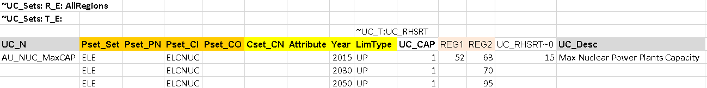{width="6.0in" height="0.75in"}

[]{#_Ref444527876 .anchor}Figure 157. User Constraint to Impose a
Maximum Capacity for Nuclear Power Plants

### Results

The results for the electricity generation capacity (Figure 158) show
the respective role of the new types of renewable power (biomass, hydro,
wind and solar), the 2050 horizon, as well as the effects of the user
constraint on nuclear capacity. Nuclear capacity remains constant for
REG1 while it grows in REG2 up to the maximum bound in 2030, but not in
2050.

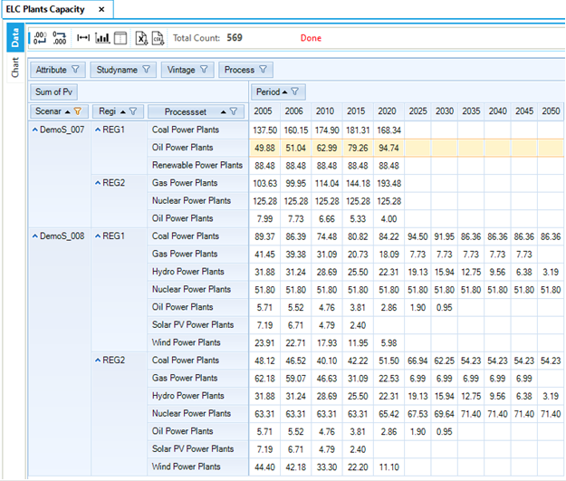{width="6.5in" height="5.520833333333333in"}

[]{#_Ref444527882 .anchor}Figure 158. Results - Power Plant Capacity by
Fuel Type in DemoS_008

The emissions by sector (in Mt) are presented in Figure 159 for both
regions, where it is possible to see the contribution of each sector to
reaching the reduction targets. In DemoS_008c, with a limit on the total
emissions, the additional reductions are coming from the electricity
sector (replacing coal-fired with gas-fired power plants), as well as
from the residential and the commercial sectors (replacing solid fuels
with renewable energies).

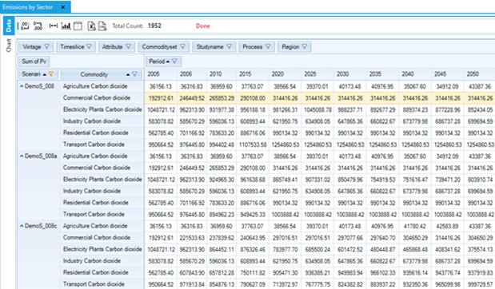{width="6.447916666666667in"
height="3.7708333333333335in"}

[]{#_Ref58340896 .anchor}Figure 159. Emissions by Sector in DemoS_008

**Objective-Function** = 19,119,653 M euros (see the \_SysCost table)
with 9,068,703 M euros for REG1 and 10,050,950 M euros for REG2. These
costs are again much higher to those computed in the previous step model
DemoS_007 because of the expansion of the RES. The total cost is 4%
higher with the emission limits for the electricity and the
transportation sectors (19,358,261 M euros), and is only slightly
reduced by the activation of the elastic demands (19,352,675 M euros).
The additional user constraint on nuclear power increases the system
cost by 11% (19,699,008 M euros).

## DemoS_009 - SubRES sophistication (CHP, district heating) and Trans files 

**Description.** At the ninth step, the model database is developed
further by adding more SubRES with more complex processes. Because
SubRES are used to add new processes in different sectors they can be
considered as separate modules that can be included in model runs as
part of the reference energy system or not. This approach is convenient
when different individuals work in parallel on different sectors.

**Objective**. The objective is to give more examples of possible SubRES
including more complex processes: one that introduces iron and steel
production in the industrial sector, and one that introduces combined
heat and power (CHP) processes, centralised heating plants, and heat
exchanger + district heating network. Additional objectives include:

-   To show how to use the BY Trans file to move or add data and reduce
    > the size of tables in the B-Y Templates. Here we specify the
    > availability factor by time slice for existing wind and solar
    > processes and add an interpolation rule for new hydro capacity
    > (NCAP_BND).

-   To show how to use the transformation file associated with each
    > SubRES to declare the availability or non-availability of each
    > process in each region: new hydro power plants in this example.

-   To give an example of a scenario used to insert/update information
    > in the B-Y Templates and SubRES: the demands and the retirement
    > profile for the iron and steel processes.

-   To illustrate how to build a user constraint to limit the
    > penetration of some processes, such as the district heating system
    > between 2020 and 2050.

  -----------------------------------------------------------------------
  Attributes Introduced            Files Updated
  -------------------------------- --------------------------------------
  PASTI                            VT_REG1/2_ELC_V09

  CEH                              BY_Trans

  CHPR                             SubRES_NewTechs_Trans

  UC_CAP                           Files Created

  UC_COMPRD                        SubRES_New-IND

  UC_FLO                           SubRES_New-CHP-DH

                                   Scen_IND_NewRes

                                   Scen_UC_DH_MinProd
  -----------------------------------------------------------------------

**Files**. The ninth step model is built by:

-   modifying two B-Y Templates (VT_REG1_ELC_v09, VT_REG2_ELC_v09) to
    introduce past investment information;

-   using the BY Transformation file (BY_Trans) to insert base year
    information (availability factor by time slice for existing wind and
    solar plants and interpolation rules);

-   using a SubRES Transformation file (SubRES_NewTechs_Trans) to insert
    information for new processes (availability factor by time slice for
    new wind and solar plants) and to declare the availability or
    non-availability of each process in each region;

-   building two new SubRES (one with an iron & steel sector; one with
    CHP processes and district heating);

-   creating a scenario file to update information in the industrial
    sector;

-   creating a scenario file with a user constraint on the minimum
    penetration of district heating in the residential sector (Figure
    160).

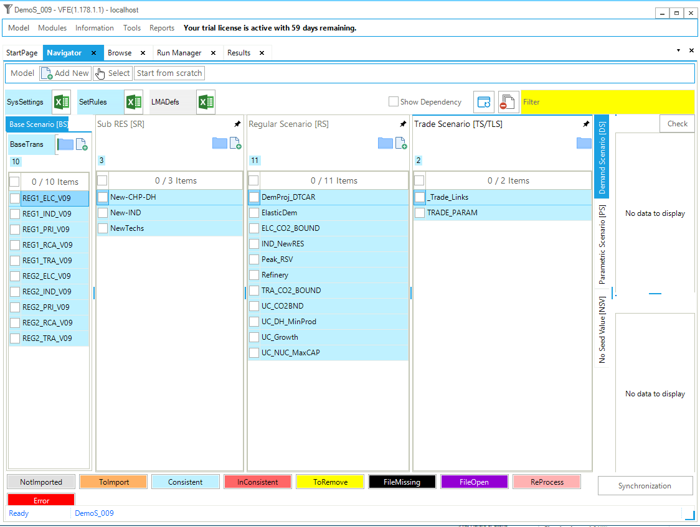{width="6.5in" height="4.895833333333333in"}

[]{#_Ref456285815 .anchor}Figure 160. Templates Included in DemoS_009

### B-Y Template VT_REG\*\_ELC_V09

The only B-Y Templates that are modified are the electricity ones
(VT_REG1_ELC_V09 and VT_REG2_ELC_V09).

#### Con_ELC

The STOCK attribute for existing capacity can be replaced by another
attribute (PASTI = past investments) to describe capacity installations
that took place before the beginning of the model horizon (2005) and
still exist during the modelling horizon. For any process, an arbitrary
number of past investments may be specified to reflect the age structure
in the existing capacity stock: the hydro power plants in this example
(Figure 161). Each vintage of PASTI capacity will be constant until the
end of its technical life, after which the capacity becomes zero in a
single step. This allows a vintage-based retirement profile for the
existing stock to be introduced into the model without the need to
calculate and specify a STOCK in each future year.

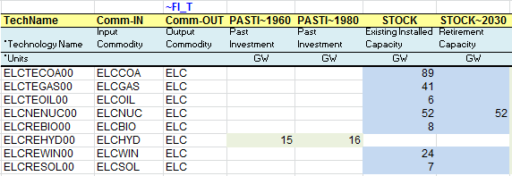{width="4.739583333333333in"
height="1.6354166666666667in"}

[]{#_Ref456285906 .anchor}Figure 161. Past Investments That Occurred
Before 2005

#### BY_Trans

The BY_Trans file works like a scenario file, except that the rule-based
filters and the update/insert changes apply only to those process and
commodities already existing in the B-Y templates. In this example
(Figure 162), the file is used to insert new information: the
availability factor (AF) by time slice (SD, SN, etc.) for existing wind
and solar plants (ELCREWIN00 and ELCRESOL00).

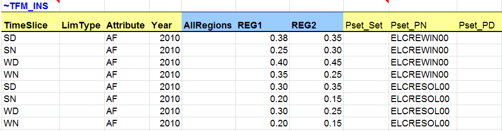{width="6.0in" height="1.5729166666666667in"}

[]{#_Ref444527927 .anchor}Figure 162. Transformation File to Insert New
Attributes for Existing Processes

The transformation file is also used to insert a new interpolation rule
(2 = interpolation, but extrapolation with EPS (epsilon, or effectively
zero), which inserts EPS in every year if no bound value is declared in
any year) to avoid the installation of new capacity (NCAP_BND) after the
base year for the existing hydro power plants (ELCREHYD00). VEDA2.0
creates this entry by default for all technologies for which STOCK is
declared. Since we have switched to using PASTI we need to declare it
manually (Figure 163).

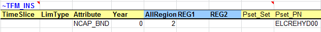{width="6.0in" height="0.59375in"}

[]{#_Ref444527932 .anchor}Figure 163. Transformation File to Insert a
New Interpolation Rule

### SubRES_NewTechs_Trans

Similarly to the BY_Trans file, a transformation file exists for each of
the SubRES created. They are used to update/insert information for new
processes and commodities declared in the corresponding SubRES and to
declare the availability or non-availability of each process in each
region. In this example, the transformation file of the SubRES_NewTechs
is used to insert the availability factor for new wind and solar plants
(ELCRNWIN01 and ELCRNSOL01) exactly as for the existing ones.

To assign the availability of processes to regions, a new \~TFM_AVA
table is created (Figure 164). The first line says that all processes
(Pset_PN=\*) are available in all regions. The second line modifies this
to say that the new hydro power plant is not available in REG1
(1=available; 0=non-available).

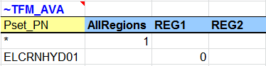{width="2.8229166666666665in"
height="0.6979166666666666in"}

[]{#_Ref444527938 .anchor}Figure 164. SubRES Transformation File to Set
Process Availability

### SubRES_New-IND

In the new SubRES_New-IND file, a simplified iron & steel sector is
added to the model (Figure 165). This file includes two sheets (IND and
PRI); sheet names need to start with the name of one of the model
sectors.

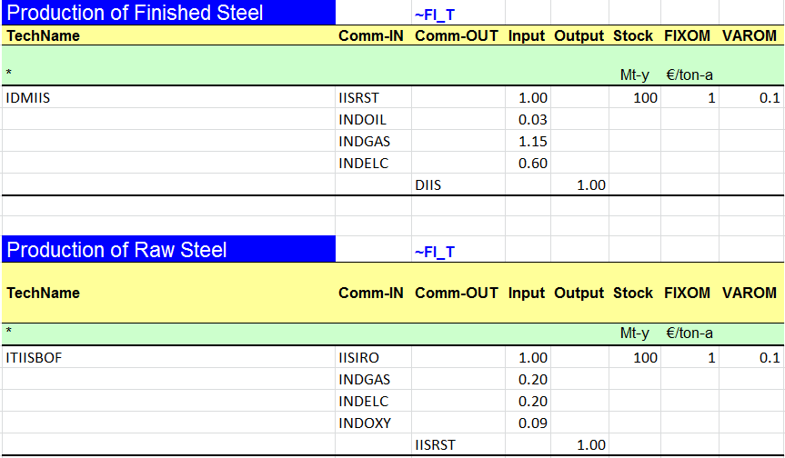{width="3.8958333333333335in"
height="2.2708333333333335in"}

[]{#_Ref444527971 .anchor}Figure 165. Iron & Steel Sector Processes

For policy analysis, it is useful to develop the most energy-intensive
industrial sectors, such as iron & steel, in more detail, using a
process-oriented approach rather than using generic processes capturing
the energy mix. Here the demand is expressed in millions tons (Mt) of
finished steel production, and a series of processes are modelled to
represent the main steps of the transformation chain, from raw material
extraction to the production of finished products (with capacity and
activity units in Mt). The last process (IDMIIS) is described like a
demand process, while the others are described as (upstream) processes
in the chain. This means that they consume energy commodities and/or
materials to produce new materials useful for the iron & steel chain
production. The last process, which is a demand technology, finally
consumes energy commodities and materials produced in the chain to
satisfy the iron and steel demand (DIIS).

These processes use a mix of energy inputs and material inputs. These
materials are declared as MAT commodities and tracked in Mt (Figure
166).

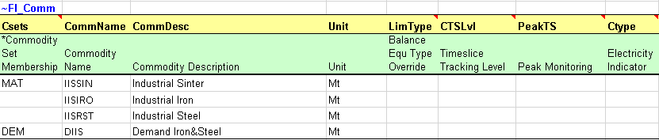{width="6.0in" height="1.3020833333333333in"}

[]{#_Ref444527986 .anchor}Figure 166. Energy and Material Input
Commodities for the Iron & Steel Sector

### SubRES_New-CHP-DH

This file includes two sheets (ELC_CHP and RCA), recalling that SubRES
sheet names need to start with the name of one of the model sectors. The
first sheet is used to add the combined heat and power (CHP) sector to
the model (Figure 167). Cogeneration power plants, or combined heat and
power plants (CHP), are plants that consume one or more commodities and
produce two commodities, electricity (ELC) and heat (HET). The new CHP
processes are characterized with additional attributes compared with
conventional power plants.

-   The new processes do not have an existing installed capacity, but
    they are available in the database to be invested in. They are
    characterized with an efficiency (EFF), an annual availability
    factor (AFA), fixed and variable O&M costs (FIXOM, VAROM), a life
    time (LIFE), a capacity to activity factor (CAP2ACT in PJ/GW), and
    an investment cost (INVCOST), as well as the year in which they
    become available (START). Maximum input shares (Share-I\~UP) are
    also specified for the dual input process ELCBNGAB01 consuming a
    maximum of 60% of biomass.

-   Two new attributes are introduced: the ratio of electricity lost to
    heat gained (CEH) as well as the ratio of heat produced to
    electricity produced (CHPR).

Two main types of cogeneration power plants can be distinguished
according to the flexibility of the outputs: a back pressure process
(ELCBNGAB01) and a condensing process (ELCCNGAS01).

-   Back pressure turbines are systems in which the ratio of the
    production of electricity and heat is fixed, so that the electricity
    generation is directly proportional to the steam produced. In a real
    system, a back pressure turbine is defined using the electrical
    efficiency, the thermal efficiency, and the load utilization. The
    **CHPR** attribute is then fixed (FX), so the production of
    electricity and heat is in a fixed proportion, but one could also
    use a (LO) CHPR for defining the back-pressure point, if so desired
    (to allow by-passing the turbine to produce more heat). CEH can be
    either 0 (or missing) or 1:

If it is 0 (or missing) as in this example, the activity represents the
electricity generation and the capacity represents the electrical
capacity;

If it is 1, the activity represents the total energy output and the
capacity represents the total capacity (electricity + heat).

-   The condensing pass-out or extraction turbines do not have to
    produce heat, permitting electricity only to be generated, and
    permitting the amount of heat generated to be directly adjusted to
    the heat demand, while the electricity generation is reciprocally
    proportional to heat generation (electricity losses because of heat
    extraction). They are thus described differently:

1.  Coefficient of electricity to heat, via attribute **CEH** such
    that: a) \<= 1: electricity loss per unit of heat gained (moving
    from condensing to backpressure mode), indicating that activity is
    measured in terms of electricity, or b) \>= 1: heat loss per unit of
    electricity gained (moving from backpressure to condensing mode),
    indicating that activity is measured in terms of total output
    (electricity plus heat).

2.  Efficiencies, according to 1: a) are specified for the condensing
    point, or b) are specified for backpressure point.

3.  Costs, according to 1 are specified based:

    a.  according to condensing mode, or

    b.  on total electricity and heat output at backpressure point.

4.  Ratio of heat produced to electricity produced (**CHPR**): Ratio of
    heat to power at backpressure point; at least a maximum value is
    required, but in addition also a minimum value may be specified.

See [Section 4.1]{.mark} of Part II of the TIMES documentation for more
on CHP processes and their attributes.

The CHP processes are declared as CHP processes in the process
declaration table with a time slice level of activity (DAYNITE). The
heat (HET) is also declared as a new energy commodity in the commodity
declaration table.

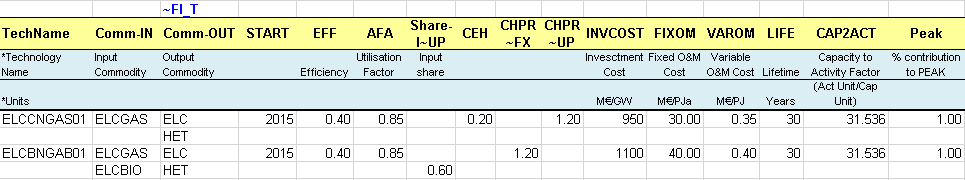{width="5.989583333333333in"
height="1.1145833333333333in"}

[]{#_Ref444527993 .anchor}Figure 167. Combined Heat and Power Processes

The RCA sheet is used to add a district heating option to the model
(Figure 168): a process is created as the district heating option
(RSHNHET1) and a sector fuel process (FTE-RSDHET) is created to produce
sector heat (RSDHET) from primary heat (HET).

-   They are characterized with an efficiency (EFF), an annual
    availability factor (AFA), fixed O&M costs (FIXOM), a life time
    (LIFE), a capacity to activity factor (CAP2ACT in PJ/GW), and an
    investment cost (INVCOST), as well as the year in which they become
    available (START).

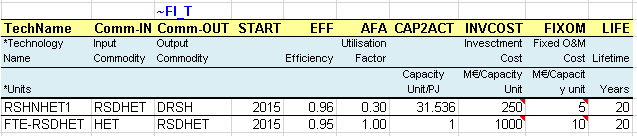{width="5.166666666666667in"
height="1.1145833333333333in"}

[]{#_Ref444528073 .anchor}Figure 168. Demand for Heat and District
Heating Options

### Scenario files

#### Scen_IND_NewRES

A transformation table is used to update the base year industrial demand
(DIDM1): the base year valued defined in the B-Y Templates are
multiplied by 0.9 (Figure 169). This essentially reduces the DIDM1
demand that was used to model all industrial sector energy consumption
by an amount roughly corresponding to that consumed by the new iron and
steel sector. (Although note that we are not trying to replicate
calibration to the energy balance precisely in this simple example.)

Another transformation table is used to define the demand value for the
new iron and steel demand (DIIS), activating this sector when the SubRES
is included in a model run, and to specify the retirement profile for
the iron and steel processes (STOCK in 2050). (In this case the STOCK
has been introduced in a SubRES template so VEDA2.0 will not create any
interpolation rule to prohibit new investments.)

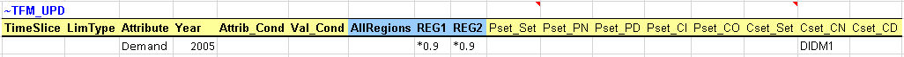{width="6.0in" height="0.3958333333333333in"}

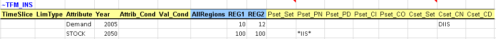{width="6.0in" height="0.4895833333333333in"}

[]{#_Ref444528081 .anchor}Figure 169. Update Existing Information and
Insert New Information in the Industrial Sector

#### Scen_UC_DH_MinProd

A user constraint is built to specify the minimum district heating
penetration requirement in specific years (2020 and 2050) with an
interpolation/extrapolation rules between those years (rule
15=interpolation migrated at start, forward extrapolation) (Figure 170).
The constraint says that the production of **DRSH** by processes that
consume **RSDHET** (Pset_CI) must be the minimum (LimType=**LO**)
percentage specified in each region/year combination of *all* production
(table level declaration **UC_COMPRD**) of DRSH.

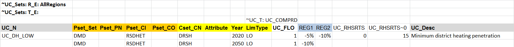{width="6.0in" height="0.5520833333333334in"}

[]{#_Ref444528088 .anchor}Figure 170. Minimum District Heating
Penetration Using a User Constraint

### Results

The model variant DemoS_009d is solved with the new iron & steel sector.
Figure 171 shows the demand production (DIIS in Mt) from the finished
steel production process (IDMIIS), consuming industrial steel (IISRST in
Mt) and a mix of energy in PJ.

The model variant DemoS_009e is solved with the new district heating
option. Figure 172 shows the contribution of district heat in meeting
the demand for residential space heating in both regions together.

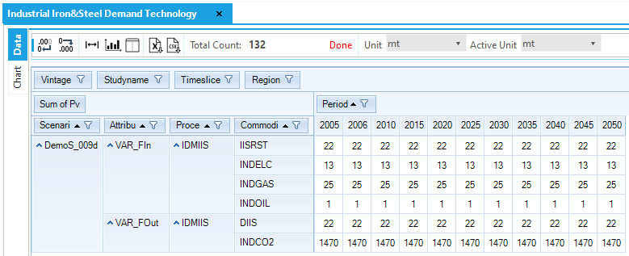{width="6.5in" height="2.6458333333333335in"}

[]{#_Ref444528105 .anchor}Figure 171. Results -- Finished steel
production in DemoS_009

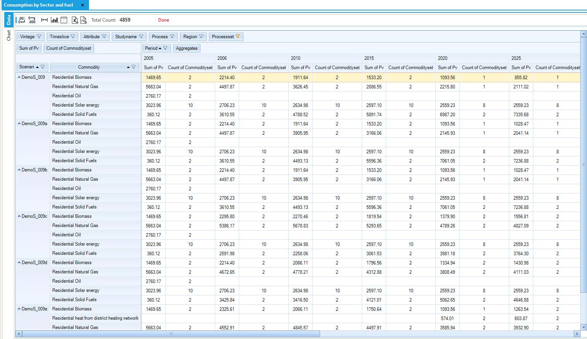{width="6.489583333333333in"
height="3.7604166666666665in"}

[]{#_Ref444528116 .anchor}Figure 172. Residential Space Heating Fuel Use
in DemoS_009

**Objective-Function** = 19,183,729 M euros (see the \_SysCost table)
with 9,084,193 M euros for REG1 and 10,099,536 M euros for REG2. These
costs are similar to those computed with the previous step model
DemoS_008. The total cost is 3% higher with the emission limits, growth
rates, elastic demands, and the new iron and steel sector (19,721,879 M
euros) and 5% with the new district heating option (20,187,883 M euros)
and the new investment required to satisfy the minimum constraint on
district heating penetration.

## DemoS_010 - Demand projections and elastic demand

**Description**. At the tenth step, the model structure and database
remain the same but energy service demands are projected using an
internal VEDA2.0 routine.

**Objective**. The objective is to show how to prepare the files
required to automatically project end-use demands for energy services
using demand drivers along with sensitivity and calibration series.

  -----------------------------------------------------------------------
  Attributes Introduced            Files Updated
  -------------------------------- --------------------------------------
  N.A.                             Scen_ElasticDem

                                   Files Created

                                   Dem_Alloc+Series

                                   ScenDem_DEM_Ref
  -----------------------------------------------------------------------

**Files**. The tenth step model is built:

-   by creating one file that allocates a demand driver to each end-use
    demand (Dem_Alloc+Series) and defines sensitivity and calibration
    series, and one file (ScenDem_DEM_Ref) that defines demand drivers;

-   by modifying the elastic demand scenarios to cover all end-use
    demands for energy services (Figure 173).

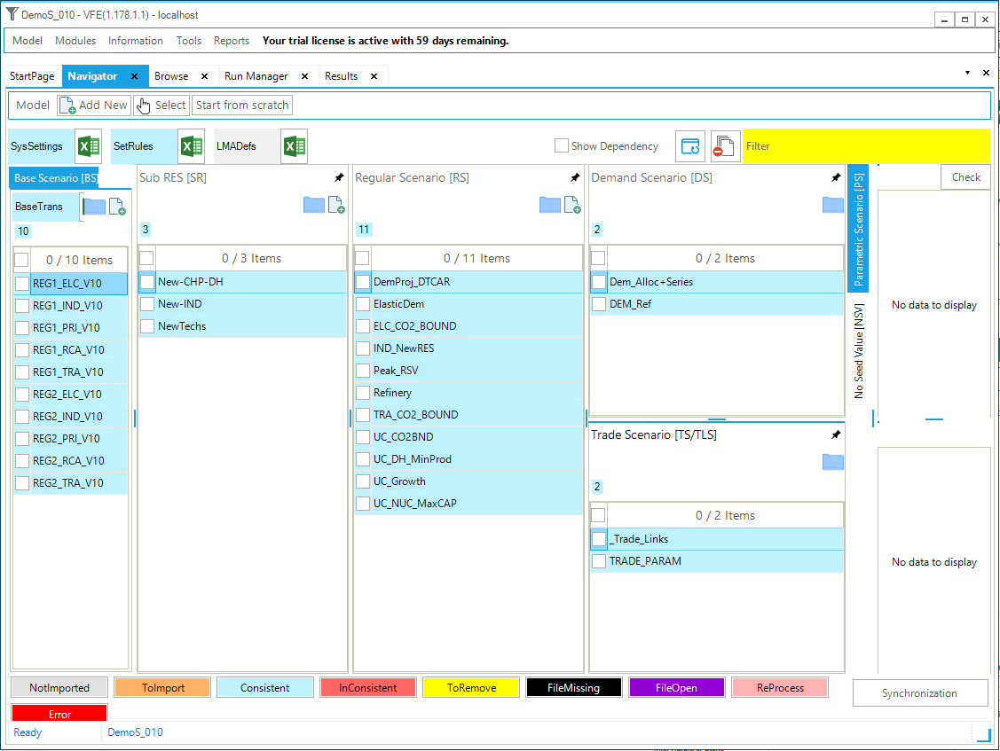{width="6.5in" height="4.885416666666667in"}

[]{#_Ref444528138 .anchor}Figure 173. Templates Included in DemoS_010

### Demand files

The Demand templates provide a means of preparing useful energy demand
(or demand services) projections by means of using drivers and factors
as discussed below.

#### ScenDem_DEM_Ref

The \~DRVR_Table table is used to declare a coherent set of driver
growth rates (or indexes, with 2005=1) to drive all end-use demands in
all regions (Figure 174). These drivers can be more general, such as
macroeconomic indicators, as in this example (Gross Domestic Product
(GDP), population (POP), industrial output demand (INDD)), or more
specific, like vehicle-kilometres for energy service demands in the
transportation sector, for instance. It is possible to build multiple
files called ScenDem\_\<file name\> with different drivers to generate,
for example, a reference case along with low and high growth cases.

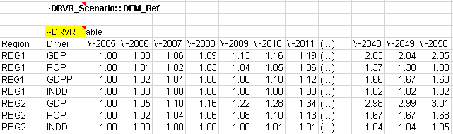{width="5.239583333333333in" height="1.5625in"}

[]{#_Ref444528146 .anchor}Figure 174. Drivers for End-use Demand
Projections

#### Dem_Alloc+Series

The \~Series table is used to define sensitivity and calibration series
(Figure 175). The sensitivity series represents the sensitivity of each
end-use demand to one unit change in its driver. The calibration series
can optionally be used to provide additional control over the resulting
demand levels.

The growth rates of the various drivers are applied to the 2005 base
year demands using the following formula:

{width="4.180555555555555in"
height="0.4131944444444444in"}

The \~DRVR_Allocation table is used to allocate a particular driver to
each end-use demand in each region (Figure 176). Only one such
allocation file, always named Dem_Alloc+Series, may be built. That is,
it is envisioned that in different scenarios, the projection of the
driver for each demand may change (higher or lower population growth,
for example), but the association of each demand with a particular
driver will not change. (For example, DRSH is always driven by
population growth with the same sensitivity.) Only one driver series may
be associated with each demand. However, one may easily create a
composite series if combining two drivers is desired. In this example,
the demand DAOT will be projected using the driver GDP, adjusted with
calibration and sensitivity series (Constant; =1 over the whole model
horizon).

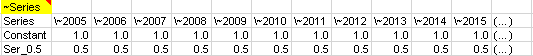{width="5.322916666666667in" height="0.5625in"}

[]{#_Ref444528157 .anchor}Figure 175. Sensitivity and Calibration Series
for End-use Demand Projections

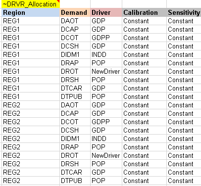{width="3.4791666666666665in"
height="3.2291666666666665in"}

[]{#_Ref444528162 .anchor}Figure 176. Allocation of Demand Drivers and
Series for End-use Demand Projections

All the demands projected with the internal VEDA2.0 module can also be
managed from the menu: **Advanced Functions/Demand Master**. Changes
made within the Demand Master will be reflected in the templates. For
more information on the Demand Master function, see
<http://support.kanors-emr.org/>.

### Results

The resulting demand projections in the reference case (DemoS_010) using
the driver and series allocation presented above are shown in Figure
177.

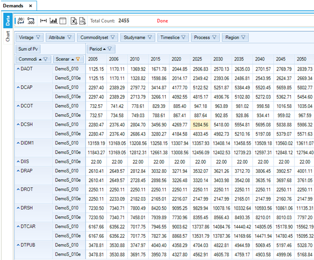{width="6.489583333333333in" height="5.375in"}

[]{#_Ref58342080 .anchor}Figure 177. Demand Projection Results in
DemoS_010

**Objective-Function** = 24,831,217 M euros (see the \_SysCost table)
with 10,869,234 M euros for REG1 and 13,961,983 M euros for REG2. The
total cost is 7% higher with all model variants (26,475,198 M euros).

## DemoS_011 -- Sets Template

**Description**. At the eleventh step, the model structure and database
remain the same, the main changes are in the SETS template and how to
use it in scenario templates..

**Objective**. The objective is to show how to use user defined SETS
(Sets-DemoModels) in a scenario file for model building and scenario
analysis. As said above, it is possible to create sets of commodities
and processes using the template Sets-\<name\>, that for the demo models
is called Sets-DemoModels. These sets are generally used to build tables
to view results in the Results module, but it is also possible to use
these sets in VEDA templates. In this step there is an example of a user
constraint on the minimum penetration of renewable power plants built
using a user defined set of renewable processes.

  -----------------------------------------------------------------------
  Attributes Introduced         Files Created
  ----------------------------- -----------------------------------------
  N.A.                          Scen_BOUNDS-UC_WSETS

  -----------------------------------------------------------------------

**Files**. The eleventh step model is built:

-   by creating one scenario file that explains VEDA Sets specification
    and includes a user constraint..

### Updating the Sets-DemoModels

The Sets-DemoModels template used in DemoS_011, includes the two sheets
VEDA_Sets-Comm for commodities sets definition and VEDA_Sets-Proc for
processes sets definition.

The commodity set rules are included in the model using the \~TFM_Csets,
while the process sets throught \~TFM_Psets.

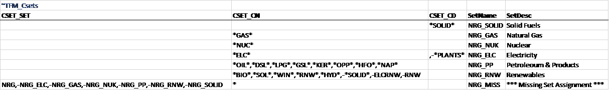{width="6.489583333333333in" height="0.96875in"}

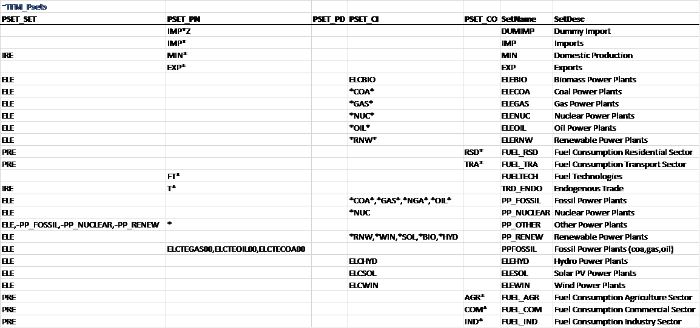{width="6.5in" height="3.0520833333333335in"}

[]{#_Toc58401317 .anchor}Figure 178. SETS Template in DemoS_010

The SET of interest for this model is the ones called PP_RENNEW (column
SetName and described as Renewable Power plant in the column SetDesc),
that is a process set built combining the information in the columns
PSet_Set, to select the group of all processes that belongs to the TIMES
set ELE, Pset_CI to identify the sub-group of ELE technologies that use
in input commodities \*RNW,\*WIN,\*SOL,\*BIO and \*HYD.

### Scen_Bounds-UC-wSets

As an example, a user constraint is built using the process set PP_RENEW
(column PSet_SET) that includes all renewable power plants: it specifies
a minimum renewable penetration share of 10% in 2020 and 15%-20% in
2050, depending on the region, along with an interpolation/extrapolation
rule (Figure 179).

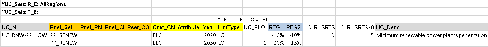{width="6.34375in" height="0.6354166666666666in"}

[]{#_Ref444528227 .anchor}Figure 179. User constraint on renewable power
using a VEDA-BE set

### Results

Figure 180 shows the impact of the new user constraint on the renewable
share of total power generation. While the share of renewables is going
to 0 without the user constraint in the previous reference case
(DemoS_010), it reaches 18% across both regions in 2050 in the new
reference case (DemoS_011), and 20% when including all additional
constraints (limits on emissions, growth rates of cars, minimum
penetration of district heating, etc.).

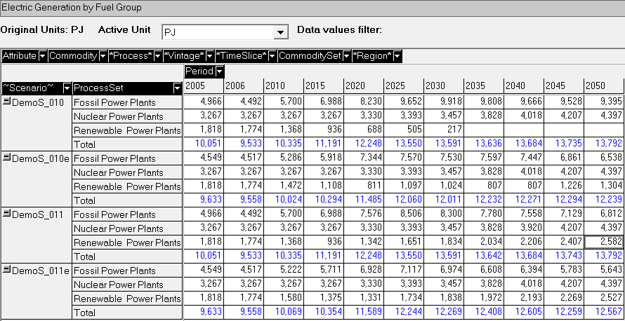{width="5.989583333333333in"
height="3.0833333333333335in"}

[]{#_Ref444528241 .anchor}Figure 180. Generation in DemoS_010/011

**Objective-Function** = 24,867,969 M euros (see the \_SysCost table)
with 10,886,683 M euros for REG1 and 13,981,286 M euros for REG2. The
total cost is 6% higher with all model variants (26,483,468 M euros).

## DemoS_012 -- More modelling techniques

**Description**. At the twelfth step, taxes and subsidies are added to
the model database and a new modelling technique is introduced, namely
the lumpy investment concept.

**Objective**. The objective is to show how to add taxes and subsidies
for processes or commodities, such as a tax on diesel and total CO2 for
all sectors and regions, as well as a subsidy on solar power plants in
this example. Another objective is to show how to use the lumpy
investment feature of TIMES through discrete capacity for the new
nuclear power plants.

  -----------------------------------------------------------------------
  Attributes Introduced            Files Updated
  -------------------------------- --------------------------------------
  N.A.                             VT_REG1/2_PRI_v12

                                   SubRES_NewTechs

                                   Files Created

                                   Scen_TRADSL_Tax

                                   Scen_CO2_Tax

                                   Scen_Solar_Subsidies

                                   Scen_UC_CO2_Regions

                                   Scen_NUC_DiscInv
  -----------------------------------------------------------------------

**Files**. The twelfth step model is built by:

-   updating two B-Y Templates (VT_REG1_PRI_v12, VT_REG2_PRI_v12) to
    create an aggregated CO2 emission commodity;

-   updating the SubRES_NewTechs file to specify discrete investment
    options;

-   creating scenario files for introducing taxes, subsidies, and an
    emission constraint for all sectors and regions, as well as for
    discrete investments for nuclear power plants.

### B-Y Template VT_REG\*\_Pri_V12

The only B-Y Templates that are modified are the primary energy ones
(VT_REG1_PRI_V12 and VT_REG2_PRI_V12).

#### TOTCO2

A sheet is added with a **\~COMAGG** table is that is used to define an
aggregated commodity (TOTCO2), including all sectoral CO2 emissions
using multipliers of 1. This is equivalent to making TOTCO2 the sum of
all sectoral CO2 emissions (Figure 181). It is possible to add more
aggregated commodities and change multipliers. For instance, when there
are different types of GHG emissions (CH4, N2O, etc.), an aggregated
commodity can be created in CO2-equivalent to account for their
respective global warming potential (CH4=36; N2O=298).

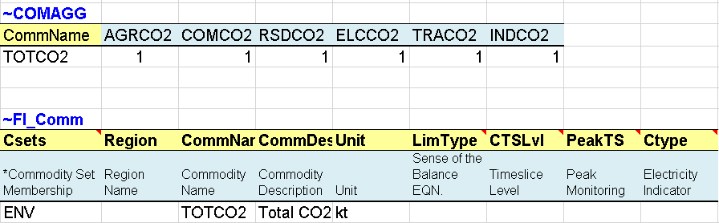{width="5.072916666666667in"
height="1.5729166666666667in"}

[]{#_Ref456286922 .anchor}Figure 181. Aggregation of Emission
Commodities

### SubRES_NewTechs (ELC sheet)

The first step necessary to enable lumpy investments is to specify
discrete investment options in the default process table, for new
nuclear power plants in this example (ELCNNUC01), by changing the
process set from ELC to ELC, DSCINV (Figure 182).

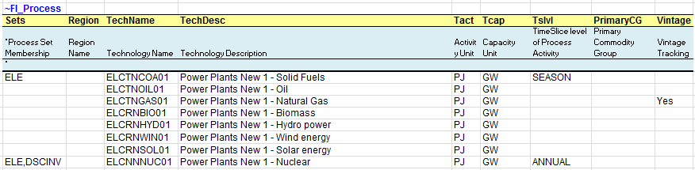{width="6.0in" height="1.46875in"}

[]{#_Ref444528262 .anchor}Figure 182. Discrete Investment Option for
Nuclear Power Plants

### Scenario files

#### Scen_NUC_DiscInv -- lumpy investments

The second step necessary to enable lumpy investments is to specify
allowable discrete capacity investments (NCAP_DISC) in specific years
for new nuclear power plants (ELCNNUC01). In this example (Figure 183)
the capacity installed for this process can be a module of 1 GW in 2015,
while in 2033 the model can install 2 GW or 3 or 4 or 5 GW.

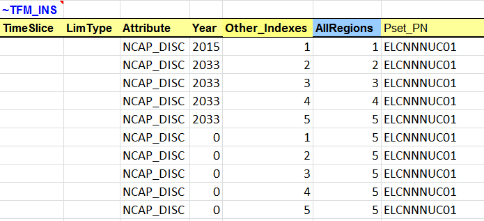{width="3.9375in" height="1.7916666666666667in"}

[]{#_Ref444528269 .anchor}Figure 183. Discrete Capacity at Specific
Years for Nuclear PowerPplants

In summary, the TIMES lumpy investment variant can be enabled following
four steps:

-   Specify the SET DSCINV for the process for which lumpy investment is
    to be enabled (here new power plants (ELCNNUC01) in the ELC sheet of
    the SubRES_NewTechs file).

-   Build a scenario file with the discrete capacity modules to be
    allowed: capacities for the new power plants (ELCNNUC01) in the
    NUC_DSCINV sheet of the Scen_NUC_DiscInv scenario.

-   Before solving the model, it is necessary to enable the variant
    discrete investment in VEDA2.0. From the FE Case Manager, select the
    **Control Panel** button, check the box for Discrete Investment at
    the top right in the TIMES Extensions section (Figure 184), and
    click the **OK** button. Back in the FE Case Manager, the
    inscription DSC YES in the yellow section at the bottom of the
    window shows that the option is enabled.

-   In the Control Panel, set OPTCR (optimization criterion, or
    tolerance) to 0, in order to get a truly optimal solution.  For
    example, if you leave OPTCR at its default value 0.1, in most models
    this will leave room for very different MIP solutions that would
    satisfy the optimality tolerance, and thus you could see lots of
    flip-flopping between model runs (even when using exactly the same
    scenario data).

{width="6.5in" height="3.0416666666666665in"}

[]{#_Ref444528278 .anchor}Figure 184. Enable the Variant Discrete
Investment in VEDA2.0

#### Scen_TRADSL_Tax

This file is used to introduce a flow tax (FLO_TAX) on processes and
commodities (input/output) (Figure 185). This is a new attribute that
allows imposing an incremental cost of using/producing a commodity by a
process (cost in Currency per unit of commodity produced or consumed).
Here it is used to impose a flow tax on all the transportation processes
(T\*) consuming the diesel commodity (TRADSL) at specific years in each
region.

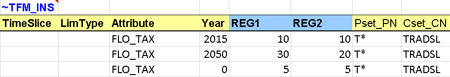{width="4.65625in" height="0.8020833333333334in"}

[]{#_Ref444528286 .anchor}Figure 185. Flow Tax on Diesel

#### Scen_CO2_Tax

This file is used to introduce a tax on a net quantity of commodity
(COM_TAXNET). Here we impose a tax on the new emission aggregated
commodity (TOTCO2) created in B-Y Templates (VT_REG\*\_PRI_V12) at
specific years (Figure 186).

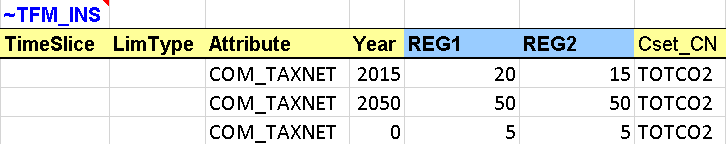{width="3.90625in" height="0.78125in"}

[]{#_Ref444528292 .anchor}Figure 186. Tax on Net CO2 Emissions

#### Scen_Solar_Subsidies

This file is used to introduce a flow subsidy (FLO_SUB) on commodities
(Figure 187). This is a new attribute that allows creating a credit for
using/producing a commodity by a process (cost in Currency per unit of
commodity produced or consumed). Here a flow subsidy on the electricity
(ELC) commodity produced by all processes consuming the solar energy
commodity (ELCSOL) is created with various values at specific years in
each region.

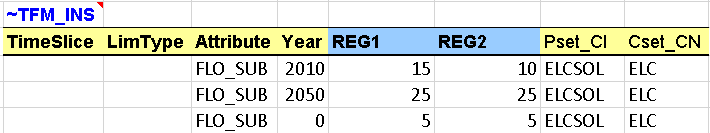{width="4.385416666666667in"
height="0.8229166666666666in"}

[]{#_Ref444528297 .anchor}Figure 187. Subsidy on Electricity

#### Scen_UC_CO2_Regions

This file introduces a new user constraint that imposes limits on all
CO2 emissions, summed over all regions and sector emissions. These upper
bounds (or limits) are calculated as a percentage reduction target from
the total CO2 emissions (TOTCO2 in kt) in a reference scenario for 2020
(10%) and 2050 (15%). It is necessary to run the step model without any
limit on emissions first to get the reference emission trajectory (run
DemoS_012) and to calculate the bounds as reduction from the reference
emissions.

Comparing this scenario with Scen_UC_BND, the differences are the
\~UC_Sets (using R_S: AllRegions rather than R_E: AllRegions) and the
declaration (UC_RHSTS rather than UC_RHSRTS).

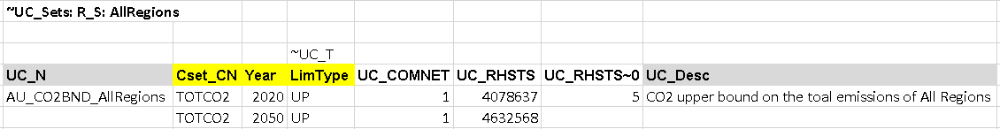{width="6.0in" height="0.7708333333333334in"}

[]{#_Ref444528303 .anchor}Figure 188. Cap Total CO2 Emission via User
Constraint

### Results

The impacts of the different taxes and subsidies, as well as the effects
of the lumpy investment feature of TIMES through the discrete capacity
requirement for the new nuclear power plants are shown in **Error!
Reference source not found.** and Figure 190.

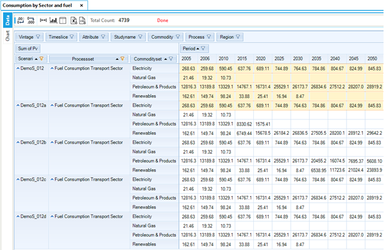{width="6.5in" height="4.229166666666667in"}

[]{#_Ref58343691 .anchor}Figure 189. Final Energy Fuel Consumption in
Transport

The impact on fuel consumption in the Transport section in are discussed
below.

-   The tax on diesel consumption in the transportation sector
    (DemoS_012a) leads to a rapid decrease in refined products, reaching
    zero by 2025, to the benefit of renewable energies, which meet most
    of the demand by 2050.

-   The tax on total CO2 emissions (DemoS_012b) leads to an even more
    drastic decrease of refined products, reaching zero by 2010, to the
    benefit of renewable energies.

-   The limit on total CO2 emissions (DemoS_012d) does not have an
    impact on the transportation fuel mix but affects other parts of the
    whole energy system. The tax puts much higher pressure on the energy
    system than the limit.

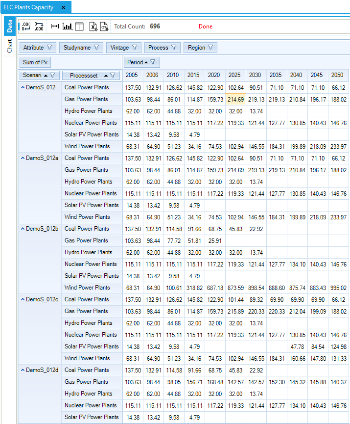{width="6.5in" height="7.854166666666667in"}

[]{#_Ref456287478 .anchor}Figure 190. Electricity Power Plant Capacity
in DemoS_012

The impact on the power sector in the various scenarios, as seen in
Figure 190 shows are describing beow.

-   The tax on total CO2 emissions (DemoS_012b) has important impacts on
    the electricity sector as well, where most of the thermal generation
    capacity is replaced with wind power.

-   The subsidy on solar power (DemoS_012c) leads to a more diversified
    mix, as part of the wind power is replaced with solar power.

The declaration of discrete capacity for nuclear power plants
(DemoS_012e) limits the nuclear growth, with only 1 GW of new capacity
addition in 2020, 2025, 2030 and 10 GW in 2035 compared with 121 GW in
the reference case (

-   Figure 191). Note that to facilitate the comparing of the
    differences between the two scenarios the scenario was moved to the
    right of the power plant types.

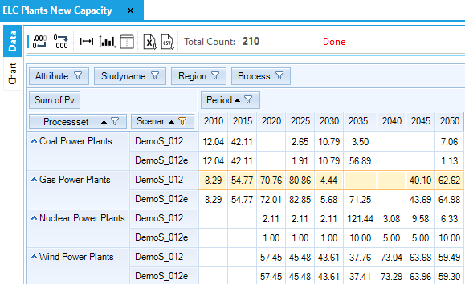{width="6.03125in"
height="3.6875in"}[]{#_Ref444528353 .anchor}

Figure 191. New Electric Plant Capacity Investments - DemoS_011/012
Comparison

###### RESULTS TIMES Attributes

Table 9 provides a list of TIMES results attributes produced by the
**gdx2veda** GAMS utility from a TIMES run **GDX** file, according to
the **times2veda.vdd** directives (see Appendix B) and the reporting
options (see Part III, Section 3.10) invoked with the run. Not all
attributes listed will appear in every Results database. Many attributes
will not appear if the driving input attributes were not used in the
model input. See Part II, Section 3.3.1 for more details on the TIMES
reporting parameters.

+----------------+------------+----------------------------------------+
| **Results      | **         | **Description**                        |
| Attribute**    | Dimensions |                                        |
|                | Invo       |                                        |
|                | lved^\*^** |                                        |
+================+============+========================================+
| Cap_New        | p          | New capacity and lumpsum investment    |
|                |            | costs. (UC tags INSTCAP and LUMPINV,   |
|                |            | respectively.)                         |
+----------------+------------+----------------------------------------+
| Cost_Act       | p          | Annual variable activity costs of      |
|                |            | processes. Undiscounted.               |
+----------------+------------+----------------------------------------+
| Cost_Com       | c          | Annual commodity costs. Undiscounted.  |
+----------------+------------+----------------------------------------+
| Cost_Comx      | c          | Annual commodity taxes/subsidies.      |
|                |            | Undiscounted.                          |
+----------------+------------+----------------------------------------+
| Cost_Dam       | c          | Annual undiscounted commodity related  |
|                |            | damage costs, generated by DAM_COST.   |
+----------------+------------+----------------------------------------+
| Cost_Dec       | p          | Annualized decommissioning costs for a |
|                |            | process. Undiscounted.                 |
+----------------+------------+----------------------------------------+
| Cost_Els       | c          | Annual elastic demand costs (losses)   |
|                |            | due to elastic demand changes.         |
|                |            | Undiscounted.                          |
+----------------+------------+----------------------------------------+
| Cost_Fixx      | p          | Annual fixed taxes/subsidies           |
|                |            | associated with process installed      |
|                |            | capacity. Undiscounted.                |
+----------------+------------+----------------------------------------+
| Cost_Flo       | p,c        | Annual flow costs (including exogenous |
|                |            | import/export prices). Undiscounted.   |
+----------------+------------+----------------------------------------+
| Cost_Flox      | p,c        | Annual undiscounted flow-related       |
|                |            | tax/subsidy costs (caused by FLO_TAX,  |
|                |            | FLO_SUB) in period (t) associated with |
|                |            | a commodity (c) flow in/out of a       |
|                |            | process (p) with vintage period (v) as |
|                |            | well as capacity related commodity     |
|                |            | flows.                                 |
+----------------+------------+----------------------------------------+
| Cost_Fom       | p          | Annual fixed operating and maintenance |
|                |            | costs. Undiscounted.                   |
+----------------+------------+----------------------------------------+
| Cost_Inv       | p          | Annualized investment costs.           |
|                |            | Undiscounted.                          |
+----------------+------------+----------------------------------------+
| Cost_Invx      | p          | Annual undiscounted investment         |
|                |            | taxes/subsidies,                       |
|                |            |                                        |
|                |            | spread over the economic process       |
|                |            | lifetime.                              |
+----------------+------------+----------------------------------------+
| Cost_ire       | p          | Annual implied costs of endogenous     |
|                |            | trade, valued according to the         |
|                |            | marginal(s) of the trade equation of   |
|                |            | process p. Undiscounted                |
+----------------+------------+----------------------------------------+
| Cost_NPV       | p,c        | Total discounted costs by component.   |
|                |            | See Table XX below for components, and |
|                |            | Part III, Section 3.10 for reporting   |
|                |            | options.                               |
+----------------+------------+----------------------------------------+
| COST_Salv      | p          | Salvage value of investment cost,      |
|                |            | taxes and subsidies of process (p)     |
|                |            | with vintage period (v), for which the |
|                |            | technical lifetime exceeds the end of  |
|                |            | the model horizon, value at year       |
|                |            | EOH+1.                                 |
+----------------+------------+----------------------------------------+
| Dual_Clic      | c          | Climate module results for the duals   |
|                |            | of constraint related to climate       |
|                |            | variable (c) in period (t).            |
+----------------+------------+----------------------------------------+
| EQ_Combal      | c          | Commodity Slack/Levels: commodity      |
|                |            | production minus consumption.          |
+----------------+------------+----------------------------------------+
| EQ_CombalM     | c          | Commodity shadow price                 |
+----------------+------------+----------------------------------------+
| EQ_Cumflo      | p,c        | Level of cumulative constraint for     |
|                |            | flow of commodity (c) of process (p)   |
|                |            | between the year range (v--t).         |
+----------------+------------+----------------------------------------+
| EQ_CumfloM     | p,c        | Shadow price of cumulative constraint  |
|                |            | for flow of commodity (c) of process   |
|                |            | (p) between the year range (v--t). Not |
|                |            | undiscounted.                          |
+----------------+------------+----------------------------------------+
| EQ_IreM        | p,c        | Inter-regional trade equation          |
|                |            | marginal. The undiscounted shadow      |
|                |            | price can be interpreted as the        |
|                |            | import/export price of the traded      |
|                |            | commodity.                             |
+----------------+------------+----------------------------------------+
| EQ_Peak        | c          | Peaking constraint slack               |
+----------------+------------+----------------------------------------+
| EQ_PeakM       | c          | Peaking Constraint shadow price (price |
|                |            | premium for consumption during peak    |
|                |            | timeslice paid by the consumer in      |
|                |            | addition to COMBAL price).             |
+----------------+------------+----------------------------------------+
| ObjZ           | none       | Total discounted present value of      |
|                |            | system cost                            |
+----------------+------------+----------------------------------------+
| PAR_CapLO      | p          | Capacity lower limit                   |
+----------------+------------+----------------------------------------+
| PAR_CapUP      | p          | Capacity upper limit                   |
+----------------+------------+----------------------------------------+
| Reg_ACost      | r          | Regional total annualized costs by     |
|                |            | period and cost category. (See Table   |
|                |            | XX below for categories.)              |
+----------------+------------+----------------------------------------+
| Reg_irec       | r          | Regional total discounted implied      |
|                |            | trade cost, derived by multiplying the |
|                |            | shadow prices of the trade equations   |
|                |            | by the trade volumes. The sum of       |
|                |            | REG_IREC over regions is zero.         |
+----------------+------------+----------------------------------------+
| Reg_obj        | r          | Regional total discounted system cost  |
+----------------+------------+----------------------------------------+
| Reg_wobj       | r          | Regional total discounted system cost  |
|                |            | by cost type (uc_n). (See Table XX     |
|                |            | below for cost types.)                 |
+----------------+------------+----------------------------------------+
| Time_NPV       |            | Present value of the time in each      |
|                |            | model period (t) by region (r), with   |
|                |            | s=\'ANNUAL\' and                       |
|                |            | uc_n=\'COST\'/\'LEVCOST\' depending on |
|                |            | whether the \$SET ANNCOST LEV          |
|                |            | reporting option has been used.        |
+----------------+------------+----------------------------------------+
| User_Con       |            | Level of user constraint (or its       |
|                |            | slack). Only reported when the VAR_UC  |
|                |            | variables are used.                    |
+----------------+------------+----------------------------------------+
| User_ConFXM    |            | User constraint shadow price.          |
|                |            | Undiscounted only if the constraint is |
|                |            | defined by region and period.          |
+----------------+------------+----------------------------------------+
| User_DynbM     |            | Undiscounted shadow price of dynamic   |
|                |            | process-wise bound constraint,         |
|                |            | identified with name uc_n, for         |
|                |            | variable c (CAP / NCAP / ACT), in      |
|                |            | period t and timeslice s.              |
+----------------+------------+----------------------------------------+
| Val_Flo        | p,c        | Annual commodity flow values:          |
|                |            |                                        |
|                |            | Flows of process (p) multiplied by the |
|                |            | commodity balance marginals of those   |
|                |            | commodities (c), which can be          |
|                |            | interpreted as the market values of    |
|                |            | the process inputs and outputs.        |
+----------------+------------+----------------------------------------+
| VAR_Act        | p          | Process activity level                 |
+----------------+------------+----------------------------------------+
| VAR_ActM       | p          | Process activity marginal. Annual      |
|                |            | undiscounted reduced cost of process   |
|                |            | activity variable.                     |
+----------------+------------+----------------------------------------+
| VAR_Cap        | p          | Process capacity. The vintage tags 0,  |
|                |            | -, and ¤ are used to indicate residual |
|                |            | capacity, new capacity, and retired    |
|                |            | capacity, respectively.                |
+----------------+------------+----------------------------------------+
| VAR_CapM       | p          | Process capacity marginal.             |
|                |            | Undiscounted reduced cost of process   |
|                |            | capacity variable, when generated.     |
+----------------+------------+----------------------------------------+
| VAR_Climate    |            | Climate module results for the levels  |
|                |            | of climate variable (c) in period (t). |
+----------------+------------+----------------------------------------+
| VAR_Comnet     | c          | Commodity net quantity (consumption    |
|                |            | minus production); only generated when |
|                |            | bound is specified by the user         |
|                |            | (COM_BNDNET).                          |
+----------------+------------+----------------------------------------+
| VAR_ComnetM    | c          | Dual variable of bound put on the net  |
|                |            | production of a commodity.             |
+----------------+------------+----------------------------------------+
| VAR_Comprd     | c          | Commodity total production; only       |
|                |            | generated when bound is specified by   |
|                |            | the user (COM_BNDPRD).                 |
+----------------+------------+----------------------------------------+
| VAR_ComprdM    | c          | Dual variable of constraint related to |
|                |            | the bound on the production of a       |
|                |            | commodity.                             |
+----------------+------------+----------------------------------------+
| VAR_CumCst     |            | Cumulative costs by type (if           |
|                |            | constrained).                          |
+----------------+------------+----------------------------------------+
| VAR_Eout       |            | Electricity output of electricity      |
|                |            | supply processes by energy source.     |
|                |            | (Opted out by default -- set           |
|                |            | RPT_OPT(\'FLO\',\'5\')=1 to activate;  |
|                |            | see Part III, Section 3.10).           |
+----------------+------------+----------------------------------------+
| VAR_Fin        | p,c        | Commodity consumption by process       |
+----------------+------------+----------------------------------------+
| VAR_Fout       | p,c        | Commodity production by process        |
+----------------+------------+----------------------------------------+
| VAR_Ncap       | p          | Technology investment                  |
+----------------+------------+----------------------------------------+
| VAR_NcapM      | p          | Technology investment marginal.        |
|                |            | Undiscounted reduced cost of process   |
|                |            | investment variable.                   |
+----------------+------------+----------------------------------------+
| VAR_NcapR      | p          | Technology Investment -- BenCost +     |
|                |            | ObjRange (see Part II, Section 3.3.3   |
|                |            | and Part III, Section 3.10 for more    |
|                |            | details):                              |
|                |            |                                        |
|                |            | Cost-benefit and ranging indicators    |
|                |            | for process (p) in period (t), where   |
|                |            | uc_n is the name of the indicator:     |
|                |            |                                        |
|                |            | • COST - the total unit costs of       |
|                |            | VAR_NCAP (in terms of an equivalent    |
|                |            | investment cost)                       |
|                |            |                                        |
|                |            | • CGAP - competitiveness gap (in terms |
|                |            | of investment costs), obtained         |
|                |            | directly from the VAR_NCAP marginals   |
|                |            | (and optional ranging information)     |
|                |            |                                        |
|                |            | • GGAP - competitiveness gap (in terms |
|                |            | of investment costs), obtained by      |
|                |            | checking also the VAR_ACT, VAR_FLO and |
|                |            | VAR_CAP marginals, in case VAR_NCAP is |
|                |            | basic at zero                          |
|                |            |                                        |
|                |            | • RATIO - benefit / cost ratio, based  |
|                |            | on CGAP                                |
|                |            |                                        |
|                |            | • GRATIO - benefit / cost ratio, based |
|                |            | on GGAP                                |
|                |            |                                        |
|                |            | • RNGLO - ranging information (LO) for |
|                |            | VAR_NCAP (if ranging is activated; in  |
|                |            | terms of investment costs)             |
|                |            |                                        |
|                |            | • RNGUP - ranging information (UP) for |
|                |            | VAR_NCAP (if ranging is activated; in  |
|                |            | terms of investment costs)             |
+----------------+------------+----------------------------------------+

\* p = *process*, c= *commodity*, r = *region*, t = *period*, s =
*timeslice*, and v = *vintage*

In addition, the r,t,s,v dimensions are involved for attributes
involving processes, and the r,t,s dimensions for attributes involving
commodities only.

######  TIMES Results files

There are three files produced for the Results module by the GDX2VEDA
utility: the \<scenarioname\>.VD data dump with the attributes,
\<scenarioname\>.VDE (set elements), and \<scenarioname\>.VDS (sets
definition). In addition, VEDA2.0 produces a \<scenarioname\>.VDT
(topology) file with the RES connectivity information. These files are
dumped in comma delimited format. They never require user intervention,
though they may be processed by other software if desired. Snippets of
each file are shown below, after a brief description of the layout of
each.

## B.1 \<scenarioname\>.VD {#b.1-scenarioname.vd .unnumbered}

The \<scenarioname\>.VD file contains the application Results module
header directives (controlling the appearance of the main Results table
specification form) followed by the actual model data.

[Layout, after the header]{.underline}: Attribute, Commodity, Process,
Period, Region, Vintage, Timeslice, UserConstraint, Value;

[Excerpt:]{.underline}

\* GDX2VEDAversion- 2005-10-07

\* ImportID- Scenario:DemoS_012b

\* VEDAFlavor- TIMES

\* Dimensions-
Attribute;Commodity;Process;Period;Region;Vintage;TimeSlice;UserConstraint;PV

\* ParentDimensions- Commodity: Region; Process: Region

\* SetsAllowed- Commodity;Process

\* FieldSize-
Attribute:31;Commodity:31;Process:31;Period:31;Region:31;Vintage:31;TimeSlice:31;UserConstraint:31;PV:20

\* NotIndexed- PV

\* ValueDim- PV

\* DefaultValueDim- PV

\* FieldSeparator- ,

\* TextDelim- \"

\"VAR_Act\",\"-\",\"AOTETOT\",\"2005\",\"REG1\",\"2005\",\"ANNUAL\",\"-\",564.8409

\"VAR_Act\",\"-\",\"CAPEELC\",\"2005\",\"REG1\",\"2005\",\"ANNUAL\",\"-\",1148.6992095

\"VAR_Act\",\"-\",\"COTEBIO\",\"2005\",\"REG1\",\"2005\",\"ANNUAL\",\"-\",3.939

\"VAR_Act\",\"-\",\"COTECOA\",\"2005\",\"REG1\",\"2005\",\"ANNUAL\",\"-\",37.3712625

\"VAR_Act\",\"-\",\"COTEELC\",\"2005\",\"REG1\",\"2005\",\"ANNUAL\",\"-\",63.8166227499999

\"VAR_Act\",\"-\",\"COTEGAS\",\"2005\",\"REG1\",\"2005\",\"ANNUAL\",\"-\",212.309676

\"VAR_Act\",\"-\",\"COTEOIL\",\"2005\",\"REG1\",\"2005\",\"ANNUAL\",\"-\",129.503715

\"VAR_Act\",\"-\",\"CSHEBIO\",\"2005\",\"REG1\",\"2005\",\"ANNUAL\",\"-\",35.451

\"VAR_Act\",\"-\",\"CSHEELC\",\"2005\",\"REG1\",\"2005\",\"ANNUAL\",\"-\",63.81662275

\"VAR_Act\",\"-\",\"CSHEGAS\",\"2005\",\"REG1\",\"2005\",\"ANNUAL\",\"-\",495.389244

\"VAR_Act\",\"-\",\"CSHEOIL\",\"2005\",\"REG1\",\"2005\",\"ANNUAL\",\"-\",302.175335

\"VAR_Act\",\"-\",\"CSHESOL\",\"2005\",\"REG1\",\"2005\",\"ANNUAL\",\"-\",7.575

\"VAR_Act\",\"-\",\"ELCNENUC00\",\"2005\",\"REG1\",\"2005\",\"S\",\"-\",746.220483540681

\"VAR_Act\",\"-\",\"ELCNENUC00\",\"2005\",\"REG1\",\"2005\",\"W\",\"-\",723.929516459321

\"VAR_Act\",\"-\",\"ELCREHYD00\",\"2005\",\"REG1\",\"2005\",\"SD\",\"-\",244.125

\"VAR_Act\",\"-\",\"ELCREHYD00\",\"2005\",\"REG1\",\"2005\",\"SN\",\"-\",0.837000000000359

\"VAR_Act\",\"-\",\"ELCREHYD00\",\"2005\",\"REG1\",\"2005\",\"WD\",\"-\",243.846

\"VAR_Act\",\"-\",\"ELCRESOL00\",\"2005\",\"REG1\",\"2005\",\"SD\",\"-\",16.9805936073059

\"VAR_Act\",\"-\",\"ELCRESOL00\",\"2005\",\"REG1\",\"2005\",\"SN\",\"-\",10.4147640791476

\"VAR_Act\",\"-\",\"ELCRESOL00\",\"2005\",\"REG1\",\"2005\",\"WD\",\"-\",16.9611872146119

\"VAR_Act\",\"-\",\"ELCRESOL00\",\"2005\",\"REG1\",\"2005\",\"WN\",\"-\",12.2907153729072

\"VAR_Act\",\"-\",\"ELCREWIN00\",\"2005\",\"REG1\",\"2005\",\"SD\",\"-\",71.5472816780823

\"VAR_Act\",\"-\",\"ELCREWIN00\",\"2005\",\"REG1\",\"2005\",\"SN\",\"-\",43.3049336472603

\"VAR_Act\",\"-\",\"ELCREWIN00\",\"2005\",\"REG1\",\"2005\",\"WD\",\"-\",75.2268561643836

\"VAR_Act\",\"-\",\"ELCREWIN00\",\"2005\",\"REG1\",\"2005\",\"WN\",\"-\",71.5472816780823

\"VAR_Act\",\"-\",\"ELCTECOA00\",\"2005\",\"REG1\",\"2005\",\"S\",\"-\",1351.31629846897

\"VAR_Act\",\"-\",\"ELCTECOA00\",\"2005\",\"REG1\",\"2005\",\"W\",\"-\",1044.37445353102

\"VAR_Act\",\"-\",\"ELCTEGAS00\",\"2005\",\"REG1\",\"2005\",\"SD\",\"-\",226.711979456911

\"VAR_Act\",\"-\",\"ELCTEGAS00\",\"2005\",\"REG1\",\"2005\",\"SN\",\"-\",300.30842173892

\"VAR_Act\",\"-\",\"EXPCOA1\",\"2005\",\"REG1\",\"2005\",\"ANNUAL\",\"-\",745.59485

\"VAR_Act\",\"-\",\"EXPHFO1\",\"2005\",\"REG1\",\"2005\",\"ANNUAL\",\"-\",804.770973903333

\"VAR_Act\",\"-\",\"EXPKER1\",\"2005\",\"REG1\",\"2005\",\"ANNUAL\",\"-\",295.3885

\"VAR_Act\",\"-\",\"EXPLPG1\",\"2005\",\"REG1\",\"2005\",\"ANNUAL\",\"-\",32.1237949472747

\"VAR_Act\",\"-\",\"EXPNAP1\",\"2005\",\"REG1\",\"2005\",\"ANNUAL\",\"-\",400.84

\"VAR_Act\",\"-\",\"EXPOIL1\",\"2005\",\"REG1\",\"2005\",\"ANNUAL\",\"-\",1648.4855

\"VAR_Act\",\"-\",\"EXPOPP1\",\"2005\",\"REG1\",\"2005\",\"ANNUAL\",\"-\",453.036

\"VAR_Act\",\"-\",\"FTE-AGRBIO\",\"2005\",\"REG1\",\"2005\",\"ANNUAL\",\"-\",8.9265138547333

\"VAR_Act\",\"-\",\"FTE-AGRCOA\",\"2005\",\"REG1\",\"2005\",\"ANNUAL\",\"-\",8.46903001967851

\"VAR_Act\",\"-\",\"FTE-AGRELC\",\"2005\",\"REG1\",\"2005\",\"SD\",\"-\",72.2276809309521

\"VAR_Act\",\"-\",\"FTE-AGRELC\",\"2005\",\"REG1\",\"2005\",\"SN\",\"-\",66.4494664564759

\"VAR_Act\",\"-\",\"FTE-AGRELC\",\"2005\",\"REG1\",\"2005\",\"WD\",\"-\",72.1451350098882

\"VAR_Act\",\"-\",\"FTE-AGRELC\",\"2005\",\"REG1\",\"2005\",\"WN\",\"-\",78.418625010748

\"VAR_Act\",\"-\",\"FTE-AGRGAS\",\"2005\",\"REG1\",\"2005\",\"ANNUAL\",\"-\",160.377867843615

\"VAR_Act\",\"-\",\"FTE-AGROIL\",\"2005\",\"REG1\",\"2005\",\"ANNUAL\",\"-\",97.8265808739081

\"VAR_Act\",\"-\",\"FTE-COMBIO\",\"2005\",\"REG1\",\"2005\",\"ANNUAL\",\"-\",48.25275

\"VAR_Act\",\"-\",\"FTE-COMCOA\",\"2005\",\"REG1\",\"2005\",\"ANNUAL\",\"-\",37.3712625

\"VAR_Act\",\"-\",\"FTE-COMELC\",\"2005\",\"REG1\",\"2005\",\"SD\",\"-\",309.846497299342

\"VAR_Act\",\"-\",\"FTE-COMELC\",\"2005\",\"REG1\",\"2005\",\"SN\",\"-\",309.846497299342

\"VAR_Act\",\"-\",\"FTE-COMELC\",\"2005\",\"REG1\",\"2005\",\"WD\",\"-\",329.999115009868

\"VAR_Act\",\"-\",\"FTE-COMELC\",\"2005\",\"REG1\",\"2005\",\"WN\",\"-\",329.999115009868

\"VAR_Act\",\"-\",\"FTE-COMGAS\",\"2005\",\"REG1\",\"2005\",\"ANNUAL\",\"-\",762.742169333334

\"VAR_Act\",\"-\",\"FTE-COMOIL\",\"2005\",\"REG1\",\"2005\",\"ANNUAL\",\"-\",507.22288375

## B.2 \<scenarioname\>.VDE {#b.2-scenarioname.vde .unnumbered}

The \<scenarioname\>.VDE file contains the list of individual set member
elements for each index managed by Results module along with their
descriptions.

[Layout]{.underline}: Dimension Name - Region - Element name - Element
Description;

[Excerpt]{.underline}:

\"Attribute\",\"-\",\"VAR_act\",\"Process Activity\"

\"Attribute\",\"-\",\"VAR_actM\",\"Process Activity - Marginals\"

\"Attribute\",\"-\",\"VAR_cap\",\"Technology Capacity\"

\"Attribute\",\"-\",\"VAR_capM\",\"Technology Capacity - Marginals\"

\"Attribute\",\"-\",\"VAR_ncap\",\"Technology Investment - New
capacity\"

\"Attribute\",\"-\",\"VAR_ncapM\",\"Technology Investment - Marginals\"

\"Attribute\",\"-\",\"VAR_ncapR\",\"Technology Investment - BenCost +
ObjRange\"

\"Attribute\",\"-\",\"VAR_fin\",\"Commodity Consumption by Process\"

\"Attribute\",\"-\",\"VAR_fout\",\"Commodity Production by Process\"

\"Attribute\",\"-\",\"VAR_comprd\",\"Commodity Total Production\"

\"Attribute\",\"-\",\"VAR_comprdM\",\"Commodity Total Production -
Marginal\"

\"Attribute\",\"-\",\"VAR_comnet\",\"Commodity Net\"

\"Attribute\",\"-\",\"VAR_comnetM\",\"Commodity Net - Marginal\"

\"Attribute\",\"-\",\"VAR_eout\",\"Electricity supply by technology and
energy source\"

\"Attribute\",\"-\",\"EQ_combal\",\"Commodity Slack/Levels\"

\"Attribute\",\"-\",\"EQ_combalM\",\"Commodity Slack/Levels -
Marginals\"

\"Attribute\",\"-\",\"EQ_peak\",\"Peaking Constraint Slack\"

\"Attribute\",\"-\",\"EQ_peakM\",\"Peaking Constraint Slack -
Marginals\"

\"Attribute\",\"-\",\"EQ_Cumflo\",\"Cumulative flow constraint -
Levels\"

\"Attribute\",\"-\",\"EQ_CumfloM\",\"Cumulative flow constraint -
Marginals\"

\"Attribute\",\"-\",\"PAR_capLO\",\"Capacity Lower Limit\"

\"Attribute\",\"-\",\"PAR_capUP\",\"Capacity Upper Limit\"

\"Attribute\",\"-\",\"PAR_Top\",\"Process topology (Opted out - SET
RPT_TOP YES to activate)\"

\"Attribute\",\"-\",\"Cap_New\",\"Newly installed capacity and lumpsum
investment by vintage and commissioning period\"

\"Attribute\",\"-\",\"COST_inv\",\"Annual investment costs\"

\"Attribute\",\"-\",\"COST_dec\",\"Annual decommissioning costs\"

\"Attribute\",\"-\",\"COST_salv\",\"Salvage values of capacities at
EOH+1\"

\"Attribute\",\"-\",\"COST_late\",\"Annual late costs\"

\"Attribute\",\"-\",\"COST_fom\",\"Annual fixed operating and
maintenance costs\"

\"Attribute\",\"-\",\"COST_act\",\"Annual activity costs\"

\"Attribute\",\"-\",\"COST_flo\",\"Annual flow costs (including
import/export prices)\"

\"Attribute\",\"-\",\"COST_com\",\"Annual commodity costs\"

\"Attribute\",\"-\",\"COST_els\",\"Annual elastic demand cost term\"

\"Attribute\",\"-\",\"COST_dam\",\"Annual damage cost term\"

\"Attribute\",\"-\",\"COST_invx\",\"Annual investment taxes/subsidies\"

\"Attribute\",\"-\",\"COST_fixx\",\"Annual fixed taxes/subsidies\"

\"Attribute\",\"-\",\"COST_flox\",\"Annual flow taxes/subsidies\"

\"Attribute\",\"-\",\"COST_comx\",\"Annual commodity taxes/subsidies\"

\"Attribute\",\"-\",\"COST_ire\",\"Annual implied costs of endogenous
trade\"

\"Attribute\",\"-\",\"COST_NPV\",\"Total discounted costs by
process/commodity (optional)\"

\"Attribute\",\"-\",\"Time_NPV\",\"Discounted value of time by period\"

\"Attribute\",\"-\",\"VAL_Flo\",\"Annual commodity flow values\"

\"Attribute\",\"-\",\"ObjZ\",\"Total discounted system cost\"

\"Attribute\",\"-\",\"Reg_wobj\",\"Regional total expected discounted
system cost\"

\"Attribute\",\"-\",\"Reg_obj\",\"Regional total discounted system
cost\"

\"Attribute\",\"-\",\"Reg_irec\",\"Regional total discounted implied
trade cost\"

\"Attribute\",\"-\",\"Reg_ACost\",\"Regional total annualized costs by
period\"

\"Attribute\",\"-\",\"User_Con\",\"Level of user constraint\"

\"Attribute\",\"-\",\"User_ConFXM\",\"Marginal cost of fixed bound user
constraint\"

\"Attribute\",\"-\",\"User_ConLOM\",\"Marginal cost of lower bound user
constraint\"

\"Attribute\",\"-\",\"User_ConUPM\",\"Marginal cost of upper bound user
constraint\"

\"Attribute\",\"-\",\"User_DynbM\",\"Marginal cost of dynamic process
bound constraint\"

\"Attribute\",\"-\",\"User_Maxbet\",\"Level of MaxBet constraint\"

\"Attribute\",\"-\",\"VAR_climate\",\"Climate result variables\"

\"Attribute\",\"-\",\"Dual_Clic\",\"Shadow price of climate constraint\"

\"Attribute\",\"-\",\"VAR_Macro\",\"MACRO result variables\"

\"Commodity\",\"REG2\",\"GAS\",\"Natural Gas\"

\"Commodity\",\"REG1\",\"GAS\",\"Natural Gas\"

\"Commodity\",\"REG2\",\"ELC\",\"Electricity\"

\"Commodity\",\"REG1\",\"ELC\",\"Electricity\"

\"Commodity\",\"REG2\",\"AGRBIO\",\"Agriculture Biomass\"

\"Commodity\",\"REG1\",\"AGRBIO\",\"Agriculture Biomass\"

\"Commodity\",\"REG2\",\"AGRCO2\",\"Agriculture Carbon dioxide\"

\"Commodity\",\"REG1\",\"AGRCO2\",\"Agriculture Carbon dioxide\"

\"Commodity\",\"REG2\",\"AGRCOA\",\"Agriculture Solid Fuels\"

\"Commodity\",\"REG1\",\"AGRCOA\",\"Agriculture Solid Fuels\"

\"Commodity\",\"REG2\",\"AGRELC\",\"Agriculture Electricity\"

\"Commodity\",\"REG1\",\"AGRELC\",\"Agriculture Electricity\"

\"Commodity\",\"REG2\",\"AGRGAS\",\"Agriculture Natural Gas\"

\"Commodity\",\"REG1\",\"AGRGAS\",\"Agriculture Natural Gas\"

\"Commodity\",\"REG2\",\"AGROIL\",\"Agriculture oil\"

\"Commodity\",\"REG1\",\"AGROIL\",\"Agriculture Oil\"

\"Commodity\",\"REG2\",\"BIO\",\"Biomass\"

\"Commodity\",\"REG1\",\"BIO\",\"Biomass\"

\"Commodity\",\"REG2\",\"COA\",\"Solid Fuels\"

\"Commodity\",\"REG1\",\"COA\",\"Solid Fuels\"

\"Commodity\",\"REG2\",\"COMBIO\",\"Commercial Biomass\"

\"Commodity\",\"REG1\",\"COMBIO\",\"Commercial Biomass\"

\"Commodity\",\"REG2\",\"COMCO2\",\"Commercial Carbon dioxide\"

\"Commodity\",\"REG1\",\"COMCO2\",\"Commercial Carbon dioxide\"

\"Commodity\",\"REG2\",\"COMCOA\",\"Commercial Solid Fuels\"

\"Commodity\",\"REG1\",\"COMCOA\",\"Commercial Solid Fuels\"

\"Commodity\",\"REG2\",\"COMELC\",\"Commercial Electricity\"

\"Commodity\",\"REG1\",\"COMELC\",\"Commercial Electricity\"

\"Commodity\",\"REG2\",\"COMGAS\",\"Commercial Natural Gas\"

\"Commodity\",\"REG1\",\"COMGAS\",\"Commercial Natural Gas\"

\"Commodity\",\"REG2\",\"COMOIL\",\"Commercial oil\"

\"Commodity\",\"REG1\",\"COMOIL\",\"Commercial Oil\"

\"Commodity\",\"REG2\",\"COMSOL\",\"Commercial Solar energy\"

\"Commodity\",\"REG1\",\"COMSOL\",\"Commercial Solar energy\"

## B.3 \<scenarioname\>.VDS {#b.3-scenarioname.vds .unnumbered}

The \<scenarioname\>.VDS file provides the set membership information
for the dimensions where sets are allowed. Note that these are different
from the user-defined sets (rule-based) that are managed in the Results
module. But these sets can be used as a part of those rules.

[Layout]{.underline}: Type of set (tab), region, set name, item name;

[Excerpt]{.underline}:

\"Commodity\",\"REG1\",\"ELC+\",\"ELC\"

\"Commodity\",\"REG2\",\"ELC+\",\"ELC\"

\"Commodity\",\"REG1\",\"ELC+\",\"AGRELC\"

\"Commodity\",\"REG2\",\"ELC+\",\"AGRELC\"

\"Commodity\",\"REG1\",\"ELC+\",\"COMELC\"

\"Commodity\",\"REG2\",\"ELC+\",\"COMELC\"

\"Commodity\",\"REG1\",\"ELC+\",\"RSDELC\"

\"Commodity\",\"REG2\",\"ELC+\",\"RSDELC\"

\"Commodity\",\"REG1\",\"ELC+\",\"TRAELC\"

\"Commodity\",\"REG2\",\"ELC+\",\"TRAELC\"

\"Commodity\",\"REG1\",\"ENV\",\"AGRCO2\"

\"Commodity\",\"REG2\",\"ENV\",\"AGRCO2\"

\"Commodity\",\"REG1\",\"ENV\",\"COMCO2\"

\"Commodity\",\"REG2\",\"ENV\",\"COMCO2\"

\"Commodity\",\"REG1\",\"ENV\",\"ELCCO2\"

\"Commodity\",\"REG2\",\"ENV\",\"ELCCO2\"

\"Commodity\",\"REG1\",\"ENV\",\"INDCO2\"

\"Commodity\",\"REG2\",\"ENV\",\"INDCO2\"

\"Commodity\",\"REG1\",\"ENV\",\"RSDCO2\"

\"Commodity\",\"REG2\",\"ENV\",\"RSDCO2\"

\"Commodity\",\"REG1\",\"ENV\",\"TOTCO2\"

\"Commodity\",\"REG2\",\"ENV\",\"TOTCO2\"

\"Commodity\",\"REG1\",\"ENV\",\"TRACO2\"

\"Commodity\",\"REG2\",\"ENV\",\"TRACO2\"

\"Commodity\",\"REG1\",\"DEM\",\"DAOT\"

\"Commodity\",\"REG2\",\"DEM\",\"DAOT\"

\"Commodity\",\"REG1\",\"DEM\",\"DCAP\"

\"Commodity\",\"REG2\",\"DEM\",\"DCAP\"

\"Commodity\",\"REG1\",\"DEM\",\"DCOT\"

\"Commodity\",\"REG2\",\"DEM\",\"DCOT\"

\"Commodity\",\"REG1\",\"DEM\",\"DCSH\"

\"Commodity\",\"REG2\",\"DEM\",\"DCSH\"

\"Commodity\",\"REG1\",\"DEM\",\"DIDM1\"

\"Commodity\",\"REG2\",\"DEM\",\"DIDM1\"

\"Commodity\",\"REG1\",\"DEM\",\"DRAP\"

\"Commodity\",\"REG2\",\"DEM\",\"DRAP\"

\"Commodity\",\"REG1\",\"DEM\",\"DROT\"

\"Commodity\",\"REG2\",\"DEM\",\"DROT\"

\"Commodity\",\"REG1\",\"DEM\",\"DRSH\"

\"Commodity\",\"REG2\",\"DEM\",\"DRSH\"

\"Commodity\",\"REG1\",\"DEM\",\"DTCAR\"

\"Commodity\",\"REG2\",\"DEM\",\"DTCAR\"

\"Commodity\",\"REG1\",\"DEM\",\"DTPUB\"

\"Commodity\",\"REG2\",\"DEM\",\"DTPUB\"

\"Commodity\",\"REG1\",\"NRG\",\"GAS\"

######### B.3.4 \<scenarioname\>.VDT {#b.3.4-scenarioname.vdt .unnumbered}

The \<scenarioname\>.VDT file contains all the Reference Energy System
(RES) topology information.

[Layout]{.underline}: Region, Process, Commodity, IN/OUT topology
indicator. VEDA BE also enables one to look at UCs that are related to a
process or commodity. \<UC Name\>, Process, Commodity, "UC" entries are
needed for that.

[Excerpt]{.underline}:

\*VFEPATH=C:\\Veda\\VEDA_Models\\DemoS_012

\*ScenDesc=Demo Step 012 CO2 Tax

\*ScenEDesc=Demo Step 012 CO2 Tax

\"AU_NUC_MaxCAP\",\"ELCNENUC00\",\"-\",\"UC\"

\"AU_NUC_MaxCAP\",\"ELCNNNUC01\",\"-\",\"UC\"

\"REG1\",\"AOTETOT\",\"AGRBIO\",\"IN\"

\"REG1\",\"AOTETOT\",\"AGRCO2\",\"OUT\"

\"REG1\",\"AOTETOT\",\"AGRCOA\",\"IN\"

\"REG1\",\"AOTETOT\",\"AGRELC\",\"IN\"

\"REG1\",\"AOTETOT\",\"AGRGAS\",\"IN\"

\"REG1\",\"AOTETOT\",\"AGROIL\",\"IN\"

\"REG1\",\"AOTETOT\",\"DAOT\",\"OUT\"

\"REG1\",\"AOTETOT\",\"DEMO\",\"OUT\"

\"REG1\",\"AOTETOT\",\"NRGI\",\"IN\"

\"REG1\",\"CAPEELC\",\"COMELC\",\"IN\"

\"REG1\",\"CAPEELC\",\"DCAP\",\"OUT\"

\"REG1\",\"CAPEELC\",\"DEMO\",\"OUT\"

\"REG1\",\"CAPEELC\",\"NRGI\",\"IN\"

\"REG1\",\"CAPNELC1\",\"COMELC\",\"IN\"

\"REG1\",\"CAPNELC1\",\"DCAP\",\"OUT\"

\"REG1\",\"CAPNELC1\",\"DEMO\",\"OUT\"

\"REG1\",\"CAPNELC1\",\"NRGI\",\"IN\"

\"REG1\",\"COTEBIO\",\"COMBIO\",\"IN\"

\"REG1\",\"COTEBIO\",\"DCOT\",\"OUT\"

\"REG1\",\"COTEBIO\",\"DEMO\",\"OUT\"

\"REG1\",\"COTEBIO\",\"NRGI\",\"IN\"

\"REG1\",\"COTECOA\",\"COMCO2\",\"OUT\"

\"REG1\",\"COTECOA\",\"COMCOA\",\"IN\"

\"REG1\",\"COTECOA\",\"DCOT\",\"OUT\"

\"REG1\",\"COTECOA\",\"DEMO\",\"OUT\"

\"REG1\",\"COTECOA\",\"NRGI\",\"IN\"

\"REG1\",\"COTEELC\",\"COMELC\",\"IN\"

\"REG1\",\"COTEELC\",\"DCOT\",\"OUT\"

\"REG1\",\"COTEELC\",\"DEMO\",\"OUT\"

\"REG1\",\"COTEELC\",\"NRGI\",\"IN\"

\"REG1\",\"COTEGAS\",\"COMCO2\",\"OUT\"

\"REG1\",\"COTEGAS\",\"COMGAS\",\"IN\"

\"REG1\",\"COTEGAS\",\"DCOT\",\"OUT\"

\"REG1\",\"COTEGAS\",\"DEMO\",\"OUT\"

\"REG1\",\"COTEGAS\",\"NRGI\",\"IN\"

\"REG1\",\"COTEOIL\",\"COMCO2\",\"OUT\"

\"REG1\",\"COTEOIL\",\"COMOIL\",\"IN\"

\"REG1\",\"COTEOIL\",\"DCOT\",\"OUT\"

\"REG1\",\"COTEOIL\",\"DEMO\",\"OUT\"


[^2]: The meaning of all the attributes, along with their qualifier indexes, as said above can be found in VEDA2.0, Information / TIMES Attributes.

[^3]: <http://www.iea-etsap.org/Energy_Technologies/Energy_Technology.asp>
